# Chapitre 3.6 — Les Rich Rules Firewalld

> **Campagne 3 — Réseau et exposition**

> *« Une bonne politique de sécurité ne consiste pas à tout autoriser ou tout interdire. Elle consiste à autoriser précisément ce qui est légitime. »*

## Vous êtes ici

```text
Partie I ─ Construire un socle sécurisé
        │
        ├── Campagne 1 ─ Installation
        ├── Campagne 2 ─ Comptes et privilèges
        │
        └── Campagne 3 ─ Sécurisation réseau
                 │
                 ├── 3.1 TCP/IP côté administrateur
                 ├── 3.2 Firewalld
                 ├── 3.3 Les zones
                 ├── 3.4 Les services
                 ├── 3.5 Conntrack
                 │
                 ├──► 3.6 Les Rich Rules
                 ├── 3.7 Journalisation
                 ├── 3.8 IP Sets
                 ├── 3.9 Runtime vs Permanent
                 └── 3.10 Architecture Firewalld
```

## Objectifs pédagogiques

À la fin de ce chapitre, vous serez capable de :

- comprendre pourquoi les services et les ports ne suffisent plus dans une infrastructure moderne ;
- maîtriser la syntaxe des Rich Rules de Firewalld ;
- construire des politiques réseau exprimant plusieurs critères simultanément ;
- comprendre comment Firewalld traduit ces règles vers `nftables` ;
- mettre en œuvre des règles lisibles, maintenables et industrialisables avec Ansible ;
- intégrer ces mécanismes dans la sécurisation de Sentinel.

## Pourquoi ce chapitre existe

Au début d'un projet, les besoins semblent simples. On ouvre :

- SSH ;
- HTTPS ;
- DNS.

Puis l'infrastructure grandit. Rapidement apparaissent des demandes comme :

> Seul le réseau d'administration peut accéder à SSH.

Puis :

> Le réseau industriel peut accéder à Sentinel mais uniquement en TLS.

Puis :

> Les administrateurs externes peuvent utiliser SSH uniquement depuis le bastion.

Puis :

> Les développeurs peuvent accéder à l'API de test mais jamais à la production.

Puis :

> Les sauvegardes sont autorisées uniquement la nuit.

À partir de ce moment-là, raisonner uniquement en termes de ports devient insuffisant. Le pare-feu doit exprimer une véritable **politique de sécurité**. C'est exactement le rôle des Rich Rules.

## Théorie détaillée

### Une règle simple atteint rapidement ses limites

Jusqu'à présent, nous avons utilisé des commandes comme :

```bash
firewall-cmd --add-service=https
```

ou

```bash
firewall-cmd --add-port=8443/tcp
```

Ces commandes répondent à une seule question :

> Quel port est autorisé ?

Mais elles ne répondent pas à d'autres questions essentielles :

- qui ?
- depuis où ?
- vers quelle interface ?
- avec quelle famille d'adresses ?
- avec quelle action ?
- faut-il journaliser ?
- faut-il rejeter ou simplement ignorer ?

Autrement dit, elles décrivent **une ouverture**. Elles ne décrivent pas une **politique**.

### Une Rich Rule est une phrase

L'erreur classique consiste à vouloir apprendre la syntaxe par cœur. En réalité, une Rich Rule est presque une phrase en anglais. Par exemple :

```text
rule

source address="192.168.10.0/24"

service name="ssh"

accept
```

Si on la lit naturellement :

```
Rule

si la source appartient au réseau

192.168.10.0/24

et demande le service SSH

alors accepter.
```

Une Rich Rule n'est donc pas une formule magique. C'est une description.

### Premier exemple

Autoriser SSH uniquement depuis le réseau d'administration.

```bash
firewall-cmd \
--add-rich-rule='
rule
family="ipv4"
source address="192.168.10.0/24"
service name="ssh"
accept'
```

Décomposons-la.

```
rule
```

Début de la règle.

```
family="ipv4"
```

Ne concerne que IPv4. Nous pourrions également utiliser :

```
ipv6
```

ou omettre complètement ce critère. Puis :

```
source address
```

définit l'origine.

```
192.168.10.0/24
```

Le réseau d'administration. Puis :

```
service ssh
```

Le service déclaré dans Firewalld. Enfin :

```
accept
```

Action à réaliser.

### Une règle décrit un contexte

Visualisons la même politique.

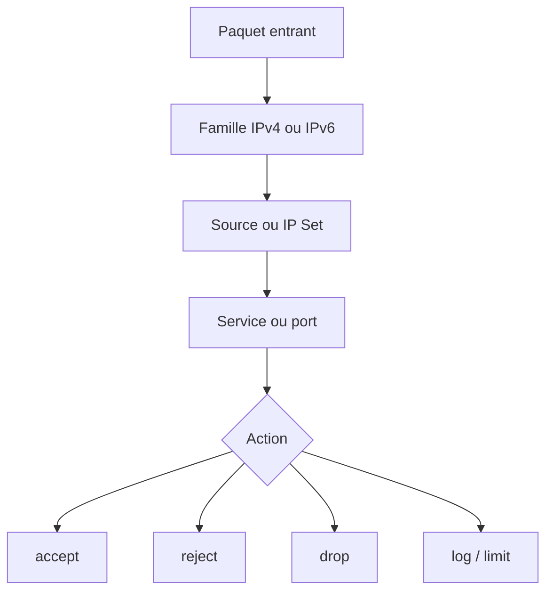

La règle ne dit pas simplement :

```
ouvrir SSH
```

Elle dit :

```
ouvrir SSH

SI

la source est autorisée.
```

Cette nuance est capitale.

## Les éléments d'une Rich Rule

Une Rich Rule est composée d'éléments. Les plus utilisés sont :

```
family

source

destination

service

port

protocol

icmp-type

log

audit

limit

accept

reject

drop

mark

forward-port
```

Nous allons étudier ceux réellement utilisés dans une infrastructure professionnelle.

## family

Spécifie la famille IP. Exemple : `family="ipv4"` ou `family="ipv6"` Pourquoi est-ce important ? Parce que beaucoup d'administrateurs sécurisent parfaitement IPv4… …et oublient complètement IPv6. Le résultat est parfois catastrophique. Une machine inaccessible en IPv4 reste parfaitement joignable en IPv6. L'ingénieur sécurité pense toujours aux deux piles réseau.

## source

Le critère le plus courant. Exemple : `source address="10.20.30.0/24"` On peut également utiliser une adresse unique. `source address="192.168.50.15"` Ou encore une plage. Le filtrage devient alors extrêmement précis.

### Exemple Sentinel

Seuls les agents industriels peuvent envoyer leurs rapports.

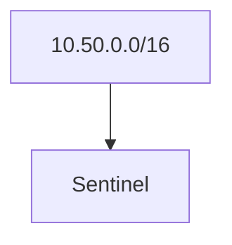

Tous les autres réseaux sont refusés. La politique réseau devient alors une première ligne de défense avant même que TLS ou l'authentification FreeIPA n'interviennent.

## destination

Beaucoup moins utilisé. Il permet de filtrer selon l'adresse de destination. Cela devient utile sur :

- un routeur ;
- une passerelle ;
- un serveur multi-hébergé.

Exemple : `destination address="192.168.100.10"` La règle ne s'applique que si cette adresse est la destination.

## service

Le plus lisible. `service name="https"` Il est généralement préférable d'utiliser :

```
service
```

plutôt que

```
port
```

Pourquoi ? Parce que le service possède une signification fonctionnelle.

```
HTTPS
```

est plus explicite que

```
443/tcp
```

Cette lisibilité devient précieuse plusieurs années après le déploiement.

## port

Parfois aucun service Firewalld n'existe. On utilise alors :

```text
port port="8443"

protocol="tcp"
```

C'est précisément le cas de Sentinel. L'application écoute :

```
8443/TCP
```

Il est donc logique d'écrire : `port="8443"` En revanche, si plus tard Sentinel est empaqueté en RPM avec son propre service Firewalld, nous pourrons remplacer cette notion de port par :

```
service="sentinel"
```

La politique deviendra beaucoup plus expressive.

## protocol

Tous les protocoles ne possèdent pas de ports. Par exemple :

```
ICMP
```

Il est parfois nécessaire de raisonner directement sur le protocole. Exemple : `protocol value="icmp"` Ou encore : `protocol value="esp"` pour certains VPN IPsec.

## accept, reject et drop

Ces trois actions semblent proches. Elles ne le sont pas. C'est probablement l'un des choix les plus importants lors de la conception d'une politique de sécurité. Prenons un client qui tente d'accéder à Sentinel. Trois comportements sont possibles.

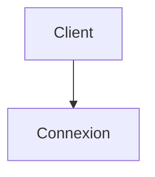

Puis...

### ACCEPT

Le pare-feu accepte explicitement la communication.

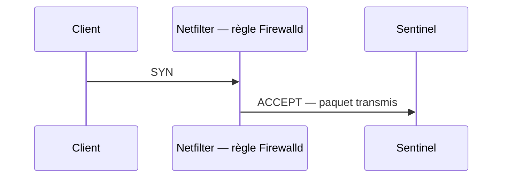

Le paquet poursuit son chemin vers l'application. Pour le client, tout semble normal.

### REJECT

Le pare-feu refuse la communication… ...mais il l'indique explicitement.

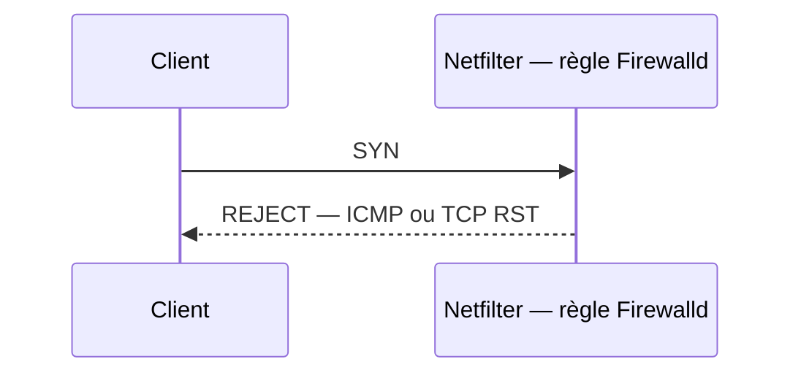

Le client reçoit immédiatement une réponse. Selon le protocole, il peut recevoir :

- un message ICMP ;
- un paquet TCP RST.

Conséquences :

- l'échec est immédiat ;
- les applications détectent rapidement que le service est indisponible ;
- le temps d'attente est très faible.

### DROP

Avec `DROP`, le pare-feu ne répond absolument rien.

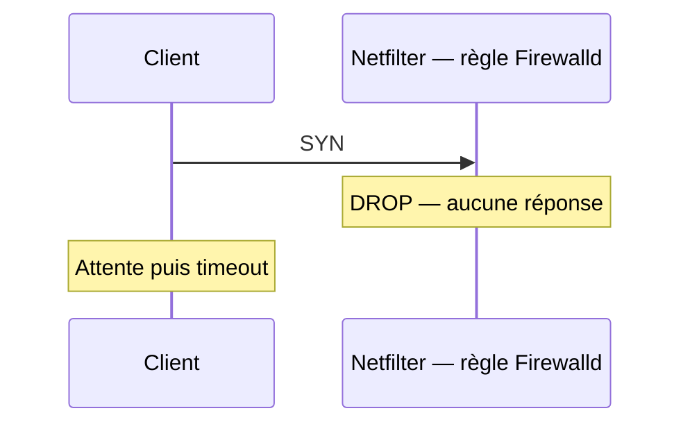

Le client attend. Puis attend encore. Enfin :

```
Timeout
```

Le pare-feu se comporte comme si la machine n'existait pas.

### Lequel choisir ?

Il n'existe pas de réponse universelle. Tout dépend de la politique de sécurité.

#### Cas n°1 : réseau interne maîtrisé

Dans un réseau d'entreprise :

```
REJECT
```

est souvent préférable. Pourquoi ? Parce qu'il facilite énormément le diagnostic. Un administrateur comprend immédiatement :

> « Le pare-feu refuse cette connexion. »

Les outils de supervision réagissent également plus vite.

#### Cas n°2 : exposition Internet

Pour un service exposé publiquement :

```
DROP
```

est souvent retenu. L'objectif est différent. On souhaite fournir le moins d'informations possible à un attaquant. Celui-ci ne sait pas immédiatement si :

- la machine est éteinte ;
- un routeur bloque le trafic ;
- un pare-feu filtre les paquets ;
- l'hôte existe réellement.

Cette absence d'information ralentit certains outils d'exploration automatisés. Il faut toutefois relativiser cet avantage. Des outils modernes comme Nmap sont capables d'interpréter de nombreux comportements réseau. Le choix entre `DROP` et `REJECT` relève donc davantage de la stratégie opérationnelle que d'une supposée invisibilité absolue.

### Une bonne pratique d'entreprise

Une politique fréquemment rencontrée est la suivante :

| Contexte | Action privilégiée |
|----------|--------------------|
| Réseau d'administration | REJECT |
| Réseau interne | REJECT |
| Production interne | REJECT |
| Internet | DROP |
| Flux suspects | DROP |

Cette approche offre un bon compromis entre :

- facilité d'exploitation ;
- discrétion vis-à-vis d'Internet.

## La journalisation (`log`)

Une Rich Rule peut également générer un journal. Exemple :

```text
rule

source address="203.0.113.0/24"

service name="ssh"

log prefix="SSH_DENIED "

drop
```

À chaque tentative :

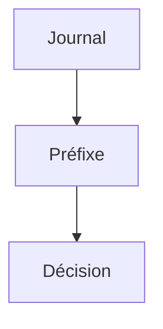

Le préfixe facilite énormément les recherches. Par exemple :

```bash
journalctl | grep SSH_DENIED
```

En environnement SOC, cette simple convention de nommage peut faire gagner plusieurs heures lors d'une investigation.

### Attention à la volumétrie

Une erreur fréquente consiste à journaliser chaque paquet refusé. Imaginons :

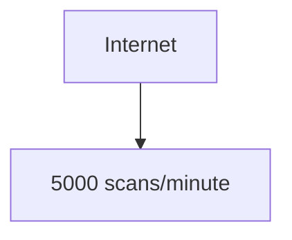

Chaque paquet génère une ligne. Résultat :

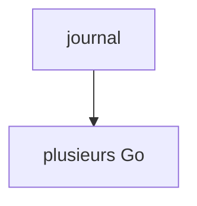

Les effets sont nombreux :

- consommation disque ;
- charge CPU supplémentaire ;
- bruit dans la supervision ;
- difficulté à identifier les événements réellement importants.

Une journalisation doit toujours être réfléchie.

## Le contrôle du débit (`limit`)

Pour éviter ce problème, Firewalld permet de limiter certaines actions. Exemple : `limit value="5/m"` La règle sera exécutée :

```
5 fois

par minute
```

Les événements supplémentaires seront ignorés par cette partie de la règle. Cela est particulièrement utile avec `log`. Exemple :

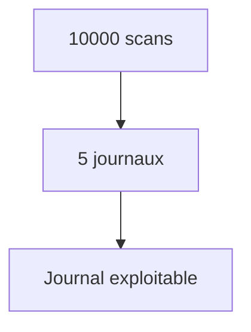

## Combiner plusieurs critères

Toute la puissance des Rich Rules réside dans leur composition. Prenons une politique réaliste.

```
Autoriser SSH

uniquement

depuis

192.168.10.0/24

journaliser

limiter

puis accepter.
```

Une seule règle permet d'exprimer cette politique. On passe progressivement d'une logique :

```
Port
```

à une logique :

```
Contexte
```

C'est précisément ce que recherche un architecte sécurité.

## Les Rich Rules ne remplacent pas les zones

Une erreur de conception apparaît souvent lors des premiers projets. L'administrateur découvre les Rich Rules. Puis il commence à tout écrire sous forme de Rich Rules. Très rapidement, la configuration devient illisible. Par exemple :

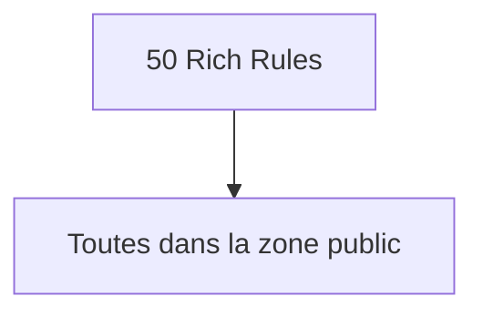

Quelques mois plus tard, plus personne ne comprend la politique appliquée. Les zones et les Rich Rules répondent pourtant à deux besoins différents. Les zones définissent :

> **le niveau de confiance d'une interface réseau.**

Les Rich Rules définissent :

> **les exceptions et les raffinements de cette politique.**

Autrement dit :

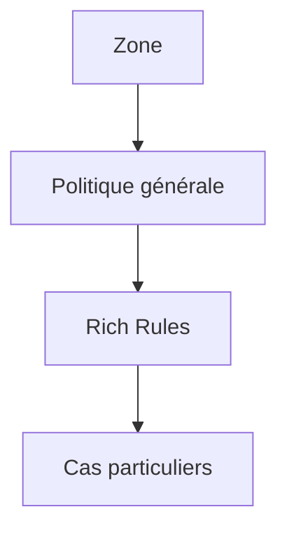

Cette séparation rend une architecture beaucoup plus maintenable.

## Exemple d'architecture

Imaginons un serveur Sentinel possédant deux interfaces.

```
eth0

Production

10.20.0.10
```

```
eth1

Administration

192.168.10.10
```

Une bonne architecture pourrait être :

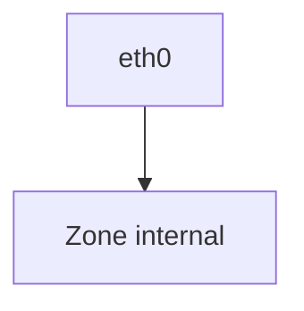

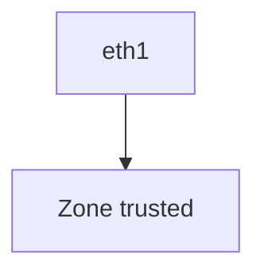

Puis seulement quelques Rich Rules. Par exemple :

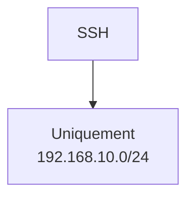

Ou encore :

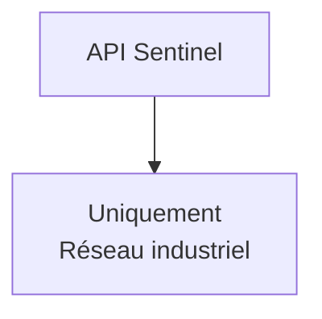

La politique reste immédiatement compréhensible.

## Les Rich Rules et Ansible

Dans une entreprise, les règles ne sont presque jamais créées manuellement. Elles sont généralement déployées par Ansible. Pourquoi ? Parce que :

- elles doivent être identiques sur plusieurs dizaines de serveurs ;
- elles doivent être versionnées ;
- elles doivent être auditables ;
- elles doivent être reproductibles.

Un playbook Ansible pourra par exemple :

- créer les zones ;
- associer les interfaces ;
- installer les services ;
- ajouter les Rich Rules ;
- vérifier leur présence.

Nous reviendrons en détail sur cette industrialisation dans la campagne consacrée à Ansible. Retenez toutefois une idée essentielle :

> Une Rich Rule n'est pas seulement une règle de pare-feu. C'est un élément de votre politique de sécurité, qui mérite le même niveau de rigueur qu'un fichier de configuration applicatif ou qu'une politique SELinux.

## Partir de la matrice de flux

Le premier réflexe n'est pas « quelle règle vais-je écrire ? », mais « qui doit parler à qui ? ». Pour Sentinel, on commence par nommer les zones et les flux légitimes :

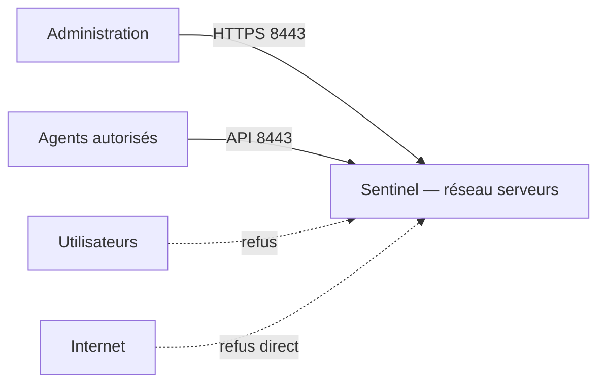

Les Rich Rules deviennent presque une traduction mécanique de cette politique. C'est une différence fondamentale. Un administrateur configure. Un architecte modélise.

### La politique doit survivre au temps

Une Rich Rule ne doit pas seulement fonctionner aujourd'hui. Elle doit encore être compréhensible :

- dans six mois ;
- après une migration ;
- par une autre équipe ;
- lors d'un audit de sécurité.

Prenons deux formulations. Première approche :

```text
Autoriser

192.168.10.15
```

Pourquoi ? Personne ne le sait. Deuxième approche :

```text
Autoriser

le bastion d'administration

192.168.10.15
```

Même si la règle technique reste identique, la documentation associée raconte une intention. L'intention est souvent plus importante que la syntaxe.

### Anticiper les évolutions

Un architecte sait que Sentinel va évoluer. Aujourd'hui :

```
8443
```

Demain peut-être :

```
8443

9443

10443
```

Ou encore plusieurs instances. Si toutes les Rich Rules manipulent directement les ports, chaque évolution nécessitera une réécriture. En revanche, si Sentinel est distribué sous forme de RPM avec son propre service Firewalld : `service sentinel` les règles évolueront beaucoup plus facilement. On retrouve ici un principe fondamental de l'ingénierie :

> Éviter de faire dépendre une politique de sécurité de détails techniques susceptibles de changer.

## En entreprise

Une entreprise possède rarement un seul serveur. Imaginons un parc composé de :

- 180 serveurs AlmaLinux ;
- deux centres de données ;
- une DMZ ;
- un réseau bureautique ;
- plusieurs réseaux industriels ;
- un bastion d'administration ;
- une infrastructure FreeIPA.

Sans Rich Rules, il faudrait souvent créer de très nombreuses zones pour représenter tous les cas particuliers. À l'inverse, si tout est exprimé uniquement avec des Rich Rules, la politique devient illisible. La bonne approche consiste à répartir les responsabilités. Les zones expriment le **contexte général**. Les Rich Rules expriment les **exceptions métier**. Cette distinction est essentielle. Elle facilite :

- les audits ;
- les revues de sécurité ;
- les déploiements Ansible ;
- les analyses d'incident.

Dans beaucoup d'organisations, une revue annuelle consiste précisément à répondre à cette question :

> « Cette Rich Rule est-elle encore justifiée ? »

Une règle dont personne ne connaît la raison d'être est une dette technique… et souvent une dette de sécurité.

## Culture technique

### Pourquoi les Rich Rules existent-elles ?

Lorsque Firewalld est apparu, un constat s'est rapidement imposé. Deux profils d'utilisateurs coexistaient. Le premier souhaitait simplement effectuer des opérations courantes. Par exemple :

```bash
firewall-cmd --add-service=https
```

ou

```bash
firewall-cmd --add-service=ssh
```

Pour ces besoins, les zones et les services suffisaient largement. Le second profil était très différent. Il devait exprimer des politiques telles que :

- autoriser un service uniquement depuis certains réseaux ;
- limiter un protocole particulier ;
- ajouter une journalisation spécifique ;
- rediriger certains flux ;
- définir des exceptions très ciblées.

Avant Firewalld, cela nécessitait souvent l'écriture directe de règles `iptables`. Ces règles étaient puissantes… …mais difficiles à lire, à maintenir et à auditer. Les Rich Rules ont été créées pour combler cet écart. Elles offrent une expressivité proche d'`iptables` ou de `nftables`, tout en conservant une syntaxe cohérente avec l'approche de Firewalld.

### Une couche d'abstraction

Il est tentant de considérer Firewalld comme un pare-feu indépendant. Ce n'est pas le cas. Il s'agit d'une couche d'abstraction.

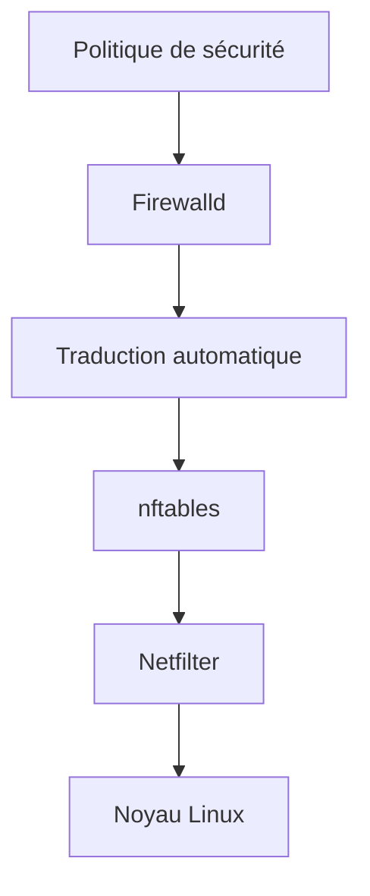

Les Rich Rules participent à cette philosophie. Elles permettent à l'administrateur d'exprimer une intention plutôt qu'une implémentation technique. Prenons deux formulations. Approche bas niveau :

```
Comparer un champ d'en-tête IP.

Comparer un protocole.

Comparer un port.

Comparer une interface.

Produire un verdict.
```

Approche Firewalld :

```
Autoriser HTTPS

depuis

le réseau d'administration.
```

La seconde formulation est beaucoup plus proche du langage de l'architecte.

### Une politique de sécurité est un document vivant

Une Rich Rule ne devrait jamais être considérée comme un simple objet technique. Elle représente une décision. Par exemple :

> Les agents Sentinel sont autorisés à communiquer avec le serveur central depuis le réseau industriel.

Cette phrase possède une valeur documentaire. Lorsqu'elle est traduite en Rich Rule, elle devient exécutable. Autrement dit :

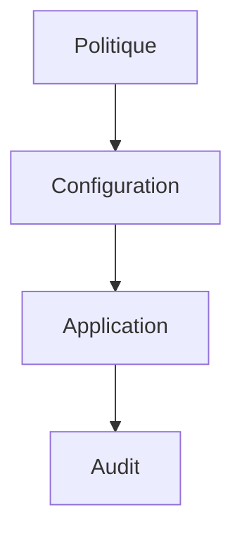

Les meilleures équipes cherchent à réduire au maximum l'écart entre ces quatre niveaux.

## Piège classique

### Confondre sécurité réseau et authentification

Une Rich Rule peut autoriser :

```
192.168.10.0/24
```

Cela ne signifie absolument pas que les utilisateurs de ce réseau sont autorisés à utiliser Sentinel. Elle ne fait qu'autoriser les paquets à atteindre l'application. Ensuite seulement interviennent :

- TLS ;
- l'authentification FreeIPA ;
- les certificats ;
- les autorisations applicatives.

Une politique de sécurité robuste ressemble davantage à ceci :

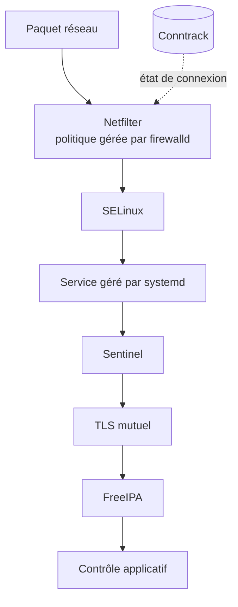

Chaque couche élimine une partie des attaques. Aucune ne remplace les autres.

### Les Rich Rules ne remplacent pas une bonne architecture réseau

Une erreur fréquente consiste à corriger une mauvaise segmentation à l'aide du pare-feu. Imaginons un réseau unique : `10.0.0.0/8` Tous les serveurs, les postes utilisateurs, les imprimantes et les équipements industriels y cohabitent. Pour retrouver un niveau de sécurité acceptable, l'administrateur ajoute progressivement :

- 20 Rich Rules ;
- puis 50 ;
- puis 120.

Le problème n'est plus Firewalld. Le problème est l'architecture réseau. Les Rich Rules doivent **compléter** une bonne segmentation, jamais la remplacer.

## Priorité, famille et validation

Lorsque plusieurs Rich Rules peuvent correspondre, compter sur leur ordre d'affichage est fragile. Firewalld permet d'associer une `priority` numérique à une règle ; les valeurs plus faibles sont évaluées avant les valeurs plus élevées, tandis que la valeur par défaut `0` suit l'organisation standard des actions. Une priorité ne corrige pas une politique contradictoire : elle rend seulement l'intention d'ordre explicite.

Les règles ne sont pas évaluées « en parallèle ». Le paquet est d'abord associé à un trajet et à une zone, puis les règles installées dans le noyau sont parcourues selon leur organisation. Conntrack accélère le traitement des échanges déjà connus, mais une politique de 500 exceptions reste plus coûteuse et surtout plus difficile à prouver qu'une politique de 5 règles. Si le nombre de Rich Rules explose, recherchez d'abord une meilleure segmentation, un service nommé ou un IP Set.

Une Rich Rule n'est pas la copie d'une longue ACL de routeur. Elle doit exprimer une exception lisible dans le modèle Firewalld. Les règles temporaires, projets terminés et anciennes adresses constituent une dette de sécurité : prévoyez un propriétaire, une justification et une date de revue, faute de quoi leur accumulation devient exploitable lors d'un mouvement latéral.

```bash
sudo firewall-cmd --add-rich-rule='rule priority="-100" family="ipv4" source address="192.168.10.20" service name="ssh" accept'
```

Une règle contenant une adresse source ou destination doit utiliser une famille cohérente. Si l'hôte possède IPv4 et IPv6, écrivez et testez les deux politiques ou désactivez explicitement la pile qui n'est pas utilisée ; protéger seulement IPv4 laisse une autre surface d'exposition.

Avant un rechargement, contrôlez la syntaxe permanente puis relisez la traduction métier :

```bash
sudo firewall-cmd --check-config
firewall-cmd --list-rich-rules
```

Un parseur confirme une syntaxe valide, pas une intention correcte. Pour chaque règle, prévoyez un test autorisé, un test refusé, la suppression exacte et un accès de secours. Les règles temporaires peuvent utiliser `--timeout` en runtime pour un besoin borné ; elles ne doivent pas devenir une maintenance permanente cachée.

## TP 1 — Restreindre un accès avec une Rich Rule

### Objectif

Construire progressivement une politique de sécurité réaliste pour Sentinel en utilisant les Rich Rules.

### Architecture

```mermaid
flowchart LR
    kali[Kali Linux<br/>192.168.10.20]
    alma[AlmaLinux Sentinel<br/>192.168.10.10<br/>Firewalld, OpenSSH et Sentinel 8443/TCP]
    kali <-->|Réseau de laboratoire| alma
```

### Étape 1 — Créer une règle d'accès SSH

Autoriser SSH uniquement depuis Kali.

```bash
sudo firewall-cmd \
--permanent \
--add-rich-rule='rule family="ipv4" source address="192.168.10.20" service name="ssh" accept'
```

Rechargez ensuite la configuration.

```bash
sudo firewall-cmd --reload
```

Vérifiez la présence de la règle.

```bash
firewall-cmd --list-rich-rules
```

### Étape 2 — Tester depuis une autre machine

Depuis une machine différente de Kali, tentez une connexion SSH. Le comportement doit être cohérent avec la politique définie. Analysez :

- le délai de réponse ;
- les journaux ;
- le comportement du client.

## TP 2 — Composer la politique Sentinel

Ajoutez une Rich Rule autorisant le port 8443 uniquement depuis le réseau industriel fictif. Par exemple : `10.50.0.0/16` Interrogez-vous : Pourquoi cette règle constitue-t-elle une défense supplémentaire alors que Sentinel possède déjà une authentification TLS ?

### Étape 4 — Ajouter une journalisation

Ajoutez une Rich Rule journalisant les tentatives de connexion SSH refusées. Choisissez un préfixe explicite. Par exemple : `SSH_POLICY` Effectuez plusieurs tentatives depuis Kali. Analysez ensuite :

```bash
journalctl
```

Le volume de messages est-il acceptable ? Comment amélioreriez-vous cette politique sur un serveur exposé à Internet ?

### Étape 5 — Ajouter une limitation

Complétez la règle précédente avec un mécanisme de limitation (`limit`). Comparez :

- le nombre réel de tentatives ;
- le nombre d'événements effectivement consignés.

Réfléchissez à l'impact de cette limitation sur un centre opérationnel de sécurité (SOC).

## Mission d'ingénieur

### Contexte

Votre entreprise exploite Sentinel sur plusieurs sites industriels. Les agents de collecte sont répartis sur des réseaux OT. Les administrateurs interviennent depuis un bastion sécurisé. Les développeurs disposent d'une plateforme de qualification. La direction impose les exigences suivantes :

- aucun accès SSH direct depuis les postes utilisateurs ;
- Sentinel ne doit accepter que les agents industriels ;
- les sauvegardes doivent pouvoir accéder au serveur pendant une plage horaire définie ;
- toute tentative d'accès non autorisée au port SSH doit être journalisée ;
- les journaux ne doivent pas être saturés lors d'un scan Internet massif.

En complément :

- les règles devront être déployées automatiquement par Ansible ;
- elles devront être compréhensibles lors d'un audit ISO 27001 ;
- elles devront pouvoir évoluer sans interruption de service.

### Votre mission

Produisez une proposition de politique réseau. Votre réponse devra notamment justifier :

- le choix des zones ;
- les Rich Rules nécessaires ;
- les cas où un simple service Firewalld suffit ;
- les cas où une Rich Rule est indispensable ;
- les éléments devant être documentés pour les futurs administrateurs.

La qualité de la justification sera considérée comme plus importante que la quantité de règles.

## Impact sur Sentinel

Grâce aux Rich Rules, Sentinel commence à s'intégrer pleinement dans la politique de sécurité globale. Au lieu d'être simplement exposé sur un port TCP : `8443` l'application bénéficie désormais d'un contexte d'accès. Par exemple :

```mermaid
flowchart TD
    N0["Réseau industriel"]
    N1["Firewalld"]
    N2["TLS mutuel"]
    N3["Authentification FreeIPA"]
    N4["Sentinel"]
    N0 --> N1
    N1 --> N2
    N2 --> N3
    N3 --> N4
```

Chaque couche élimine une catégorie différente de menaces. Cette philosophie sera reprise dans les chapitres consacrés :

- à SELinux ;
- aux certificats ;
- à Systemd ;
- au durcissement des services ;
- aux conteneurs Podman.

L'objectif n'est jamais de faire confiance à un seul mécanisme. L'objectif est que plusieurs mécanismes indépendants protègent le même service.

## Synthèse

- Les Rich Rules permettent d'exprimer des politiques de sécurité beaucoup plus fines que les simples ouvertures de ports.
- Elles complètent les zones ; elles ne les remplacent pas.
- Une Rich Rule décrit un **contexte d'autorisation**, pas seulement un port.
- `ACCEPT`, `REJECT` et `DROP` répondent à des besoins opérationnels différents.
- La journalisation doit être pensée avec soin afin d'éviter le bruit.
- Les Rich Rules sont particulièrement adaptées à une gestion industrialisée avec Ansible.
- Une politique lisible et documentée est plus pérenne qu'une accumulation de règles techniques.
- Les Rich Rules constituent une couche parmi d'autres dans une stratégie de défense en profondeur.

## Infographie de révision

```text
┌──────────────────────────────────────────────────────────────────────────────┐
│               CHAPITRE 3.6 — LES RICH RULES FIREWALLD                        │
├──────────────────────────────────────────────────────────────────────────────┤
│                                                                              │
│                 Une Rich Rule décrit une politique                           │
│                                                                              │
├──────────────────────────────────────────────────────────────────────────────┤
│                                                                              │
│  rule                                                                        │
│    ├── family (IPv4 / IPv6)                                                  │
│    ├── source                                                                │
│    ├── destination                                                           │
│    ├── service / port                                                        │
│    ├── protocol                                                              │
│    ├── log                                                                   │
│    ├── limit                                                                 │
│    └── action (accept / reject / drop)                                       │
│                                                                              │
├──────────────────────────────────────────────────────────────────────────────┤
│                                                                              │
│                 Zones                                                        │
│                    │                                                         │
│        Politique générale                                                    │
│                    │                                                         │
│                    ▼                                                         │
│              Rich Rules                                                      │
│                    │                                                         │
│         Exceptions métier                                                    │
│                    │                                                         │
│                    ▼                                                         │
│              Décision finale                                                 │
│                                                                              │
├──────────────────────────────────────────────────────────────────────────────┤
│                                                                              │
│                 Défense en profondeur                                        │
│                                                                              │
│ Firewalld → Conntrack → SELinux → TLS → FreeIPA → Sentinel                  │
│                                                                              │
├──────────────────────────────────────────────────────────────────────────────┤
│                                                                              │
│ Bonnes pratiques                                                             │
│                                                                              │
│ ✓ Décrire une intention                                                      │
│ ✓ Utiliser les zones                                                         │
│ ✓ Journaliser avec modération                                                │
│ ✓ Prévoir l'industrialisation Ansible                                        │
│ ✓ Documenter chaque exception                                                │
│                                                                              │
├──────────────────────────────────────────────────────────────────────────────┤
│                                                                              │
│ Réflexe d'ingénieur                                                          │
│                                                                              │
│ « Une Rich Rule ne décrit pas un port.                                      │
│  Elle décrit une politique de sécurité. »                                    │
│                                                                              │
└──────────────────────────────────────────────────────────────────────────────┘
```

## Pour aller plus loin

Jusqu'à présent, nous avons appris à **autoriser**, **refuser** ou **restreindre** des flux. Mais une question reste entière :

> **Comment savoir ce que le pare-feu fait réellement en production ?**

Un pare-feu qui ne laisse aucune trace est difficile à administrer, impossible à auditer et presque impossible à investiguer après un incident. Le prochain chapitre abordera donc un aspect souvent négligé mais essentiel de l'exploitation : **la journalisation et l'analyse des événements Firewalld**. Nous verrons comment produire des journaux utiles, exploitables par un SOC, tout en évitant les pièges liés à une journalisation excessive.

← [3.5 — Conntrack et le filtrage par états](3.5-conntrack-filtrage-etats.md) · [3.7 — Journalisation et analyse Firewalld](3.7-journalisation-firewalld.md) →
