# Chapitre 3.7 — Journalisation et analyse Firewalld

> **Campagne 3 — Réseau et exposition**

> *« On ne sécurise pas ce que l'on ne peut pas observer. Un pare-feu silencieux protège peut-être votre serveur, mais il ne vous apprendra jamais pourquoi il a fallu le protéger. »*

## Vous êtes ici

```text
Partie I ─ Construire un socle sécurisé
        │
        ├── Campagne 1 ─ Installation
        ├── Campagne 2 ─ Comptes et privilèges
        │
        └── Campagne 3 ─ Sécurisation réseau
                 │
                 ├── 3.1 TCP/IP côté administrateur
                 ├── 3.2 Firewalld
                 ├── 3.3 Les zones
                 ├── 3.4 Les services
                 ├── 3.5 Conntrack
                 ├── 3.6 Les Rich Rules
                 │
                 ├──► 3.7 Journalisation et analyse
                 ├── 3.8 IP Sets
                 ├── 3.9 Runtime vs Permanent
                 └── 3.10 Architecture Firewalld
```

## Objectifs pédagogiques

À la fin de ce chapitre, vous serez capable de :

- comprendre les différents niveaux de journalisation d'un pare-feu Linux ;
- produire des journaux réellement exploitables en production ;
- distinguer une journalisation de diagnostic d'une journalisation de sécurité ;
- intégrer Firewalld dans une chaîne de supervision moderne ;
- utiliser `journalctl` pour analyser une attaque ou un incident réseau ;
- préparer l'intégration future avec Sentinel, rsyslog, Grafana et un SIEM.

## Pourquoi ce chapitre existe

Un pare-feu qui bloque correctement les attaques est utile. Un pare-feu capable d'expliquer ce qu'il vient de bloquer est infiniment plus précieux. Dans de nombreuses entreprises, un incident ressemble à ceci. Le support reçoit plusieurs appels.

> « Je n'arrive plus à accéder au serveur. »

Le réseau semble fonctionner. Le service est démarré. Le certificat TLS est valide. SELinux ne remonte aucune alerte. L'application écoute bien sur son port. Alors une question devient centrale. **Le pare-feu bloque-t-il réellement quelque chose ?** Si aucune journalisation n'existe, il ne reste que des hypothèses. L'administrateur commence alors à modifier la configuration « pour essayer ». C'est précisément ce qu'un ingénieur sécurité cherche à éviter.

Les journaux doivent répondre aux questions avant même qu'elles soient posées.

## Théorie détaillée

### Le pare-feu voit tout...

Avant de protéger un service, Firewalld voit passer l'intégralité des paquets concernés. Chaque tentative de connexion traverse le sous-système Netfilter. Conceptuellement :

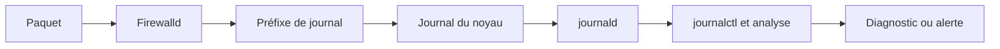

Autrement dit, le pare-feu est souvent le premier composant capable d'observer une tentative d'attaque. Avant même :

- Sentinel ;
- SSH ;
- Apache ;
- Nginx ;
- FreeIPA.

### Toutes les décisions ne doivent pas être journalisées

Lorsqu'un administrateur découvre la journalisation, il est souvent tenté d'enregistrer absolument tout. C'est une erreur. Imaginons un serveur exposé sur Internet. Chaque minute :

```
300 scans

150 connexions SSH

200 scans HTTP

50 scans RDP

80 scans SMTP
```

En une heure : plusieurs dizaines de milliers d'événements. En une journée : plusieurs millions. Si chaque paquet est journalisé :

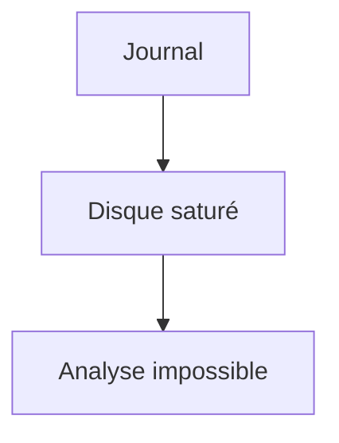

Un bon journal n'est pas un journal volumineux. C'est un journal utile.

## Les objectifs d'une journalisation

Avant d'ajouter une règle `log`, il faut toujours répondre à une question. Pourquoi souhaite-t-on enregistrer cet événement ? En pratique, plusieurs objectifs coexistent.

### Diagnostic

Exemple :

```
Un utilisateur ne peut plus accéder à Sentinel.
```

La journalisation permet alors de répondre :

```
Le paquet est-il bloqué ?

Par quelle règle ?

Depuis quelle adresse ?

À quelle heure ?
```

### Détection d'attaque

Autre objectif. Repérer des comportements anormaux. Par exemple :

```
200 tentatives SSH

en

30 secondes
```

Le journal devient alors un capteur de sécurité. Il alimente :

- Fail2ban ;
- un SIEM ;
- un SOC ;
- des tableaux de bord.

### Audit

Certaines entreprises doivent démontrer :

- qu'une politique est appliquée ;
- que certains accès sont refusés ;
- que les flux sensibles sont surveillés.

Les journaux deviennent alors des éléments de preuve.

### Investigation

Après un incident, les journaux permettent de reconstruire la chronologie. Par exemple :

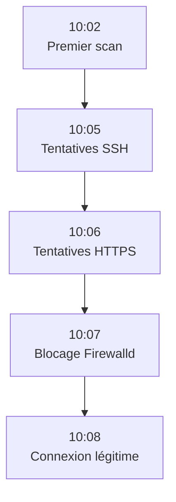

Cette chronologie est souvent beaucoup plus précieuse que le contenu d'un unique événement.

## Où sont enregistrés les journaux ?

Sous AlmaLinux moderne, la majorité des événements transitent par :

```
systemd-journald
```

Ils peuvent ensuite être :

- conservés localement ;
- transférés vers `rsyslog` ;
- envoyés vers un serveur central ;
- collectés par un SIEM.

Le schéma est généralement le suivant :

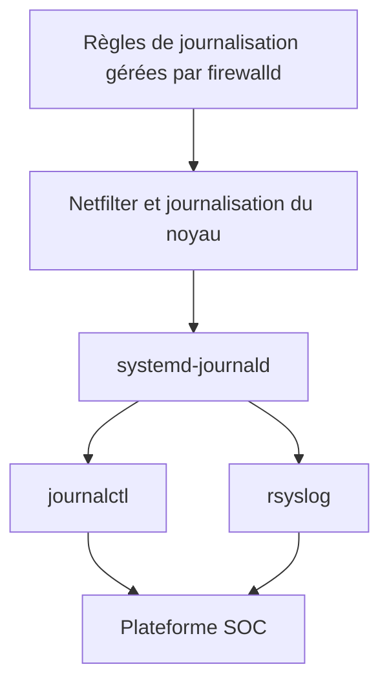

Cette architecture sera progressivement enrichie au fil du manuel.

## journalctl : l'outil principal

L'ingénieur sécurité passe énormément de temps dans `journalctl`. Quelques commandes doivent devenir des réflexes. Afficher les événements les plus récents :

```bash
journalctl -n 50
```

Suivre les événements en temps réel :

```bash
journalctl -f
```

Limiter aux messages du noyau :

```bash
journalctl -k
```

Rechercher un préfixe particulier :

```bash
journalctl | grep SENTINEL_FW
```

Afficher les événements depuis une heure :

```bash
journalctl --since "1 hour ago"
```

Ces commandes semblent simples. Pourtant, elles constituent souvent le point de départ d'une investigation.

## Comprendre une entrée de journal

Prenons un exemple simplifié.

```text
Jul 14 09:42:18 sentinel kernel:

SSH_DENIED

IN=eth0

OUT=

SRC=192.168.10.20

DST=192.168.10.10

PROTO=TCP

SPT=53214

DPT=22
```

Décortiquons-la.

```
Jul 14 09:42:18
```

Date et heure.

```
kernel
```

Le message provient du noyau Linux. Ce n'est pas Firewalld lui-même qui écrit directement.

```
SSH_DENIED
```

Préfixe choisi dans la Rich Rule. C'est précisément pour cette raison qu'il doit être explicite.

```
IN=eth0
```

Interface d'entrée.

```
SRC
```

Adresse source.

```
DST
```

Destination.

```
SPT
```

Source Port. Le port éphémère choisi par le client.

```
DPT
```

Destination Port. Ici :

```
22
```

Le service SSH. À partir de ces seules informations, un ingénieur peut déjà répondre à plusieurs questions :

- Quelle machine a tenté de se connecter ?
- Quel service était visé ?
- Quelle interface a reçu le paquet ?
- Le trafic était-il TCP ou UDP ?

Une ligne correctement structurée contient souvent suffisamment d'informations pour orienter immédiatement le diagnostic.

## Les niveaux de journalisation

Toutes les informations enregistrées dans le journal n'ont pas la même importance. Le noyau Linux associe un **niveau de gravité** à chaque événement. Les principaux niveaux sont :

| Niveau | Signification | Utilisation courante |
|---------|---------------|----------------------|
| `debug` | Diagnostic très détaillé | Développement, tests |
| `info` | Information normale | Exploitation |
| `notice` | Événement notable | Changements attendus |
| `warning` | Situation inhabituelle | À surveiller |
| `err` | Erreur | Investigation nécessaire |
| `crit` | Situation critique | Action immédiate |
| `alert` | Intervention urgente | Très rare |
| `emerg` | Système inutilisable | Exceptionnel |

Tous les événements Firewalld ne sont pas forcément enregistrés avec le même niveau. Le choix du niveau influence :

- la visibilité dans les outils de supervision ;
- les alertes ;
- les politiques de conservation ;
- les filtres appliqués par `rsyslog` ou un SIEM.

### Pourquoi le niveau est-il important ?

Imaginons un serveur Sentinel. Deux événements se produisent. Premier événement :

```
Connexion HTTPS réussie.
```

Second événement :

```
500 tentatives SSH
depuis une même adresse IP
en moins d'une minute.
```

Les deux événements ne présentent évidemment pas le même intérêt. Le premier est une activité normale. Le second est potentiellement une attaque. Si tous deux sont enregistrés avec exactement le même niveau de gravité, les outils d'analyse auront plus de difficultés à distinguer l'important de l'accessoire. La qualité d'une journalisation ne dépend pas uniquement du contenu des messages. Elle dépend également de leur classification.

## Le préfixe (`prefix`)

L'une des meilleures pratiques consiste à préfixer systématiquement les journaux produits par le pare-feu. Exemple : `SSH_DENIED` ou `SENTINEL_API` ou encore : `FW_POLICY` À première vue, cela semble anodin. En réalité, ce choix conditionne toute la facilité des futures investigations. Prenons un journal contenant plusieurs millions de lignes. Retrouver une règle devient très simple.

```bash
journalctl | grep SENTINEL_API
```

En quelques secondes :

- toutes les tentatives ;
- toutes les dates ;
- toutes les adresses IP.

Le préfixe agit comme une étiquette.

### Construire une convention de nommage

Dans une petite infrastructure, quelques préfixes suffisent. Dans une entreprise de plusieurs centaines de serveurs, une convention devient indispensable. Par exemple :

```text
FW_SSH

FW_TLS

FW_API

FW_ADMIN

FW_DROP

FW_IPSET

FW_DNS
```

Ou encore :

```text
SENTINEL_AUTH

SENTINEL_AGENT

SENTINEL_BACKUP
```

L'objectif est qu'un analyste SOC puisse comprendre immédiatement :

- quelle politique est concernée ;
- quel service est visé ;
- quel type d'événement est enregistré.

Une convention stable est beaucoup plus importante qu'un choix de noms particulier.

## Journaliser intelligemment

Une règle de sécurité n'est pas obligatoirement une règle de journalisation. Prenons un exemple.

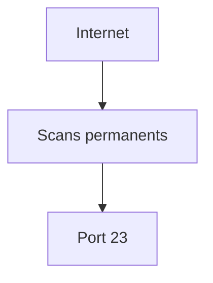

Journaliser chacune de ces tentatives apporte peu d'information. En revanche :

```
Accès refusé

au bastion SSH

depuis

un réseau interne
```

est un événement beaucoup plus intéressant. L'ingénieur sécurité cherche donc à enregistrer :

- les événements rares ;
- les événements significatifs ;
- les événements exploitables.

Il évite de produire du bruit.

## Le bruit est un risque de sécurité

Cette idée surprend souvent. Pourtant : trop de journaux… peut être aussi dangereux que pas assez. Pourquoi ? Imaginons :

```text
2 millions

de lignes

par jour.
```

Au milieu :

```
Une tentative

réellement importante.
```

Personne ne la verra. L'attaquant bénéficie alors d'un phénomène bien connu : **la fatigue des alertes**. Lorsque tout paraît critique… plus rien ne paraît critique. Le rôle d'une bonne politique de journalisation est donc aussi de protéger les analystes humains.

## La limitation (`limit`) appliquée aux journaux

Dans le chapitre précédent, nous avons découvert la directive : `limit` Son intérêt devient particulièrement évident avec la journalisation. Prenons une Rich Rule simplifiée.

```text
rule

service ssh

log

limit

drop
```

Le déroulement est le suivant.

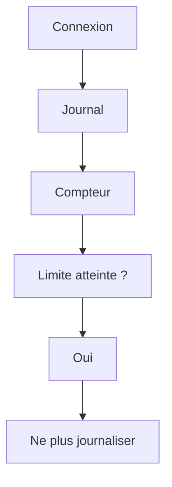

Le paquet est toujours bloqué. En revanche, les journaux cessent temporairement. Le comportement du pare-feu reste inchangé. Seule la production de messages est limitée.

## Une bonne stratégie de journalisation

Dans un environnement de production, on retrouve souvent une logique comparable à celle-ci.

### Flux normaux

Aucune journalisation. Pourquoi ? Parce qu'ils représentent l'immense majorité du trafic.

### Flux refusés sur Internet

Journalisation limitée. Par exemple :

```
10 événements

par minute

et

par règle.
```

L'objectif est de conserver une visibilité sans générer plusieurs gigaoctets de journaux.

### Flux internes sensibles

Journalisation systématique. Par exemple :

- tentative d'accès au bastion ;
- accès interdit à FreeIPA ;
- tentative vers Sentinel depuis un réseau utilisateur.

Ces événements sont suffisamment rares pour mériter une conservation complète.

## De Firewalld au SIEM

Dans une grande entreprise, les journaux restent rarement sur le serveur. Ils suivent généralement un parcours similaire à celui-ci.

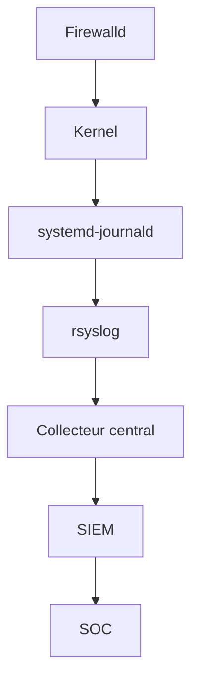

Chaque étape ajoute de nouvelles possibilités :

- stockage ;
- recherche ;
- corrélation ;
- alertes ;
- tableaux de bord.

Le serveur ne constitue donc qu'un maillon de la chaîne.

## Corréler plusieurs sources

Une tentative de connexion produit rarement un seul événement. Prenons une attaque contre Sentinel.

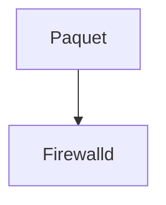

Premier journal. Puis :

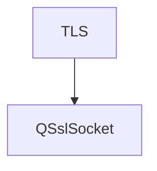

Deuxième journal. Puis :

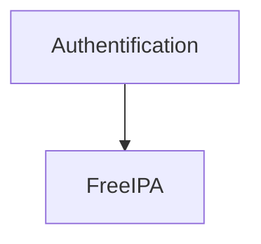

Troisième journal. Enfin :

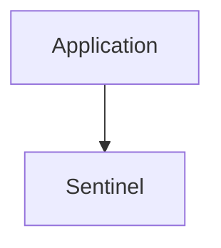

Quatrième journal. Chaque composant raconte une partie de l'histoire. L'ingénieur sécurité cherche à reconstruire le scénario complet. Cette approche est appelée : **corrélation d'événements**. Elle sera au cœur des campagnes consacrées à Sentinel.

## Firewalld n'est qu'un capteur

Une erreur fréquente consiste à croire que le pare-feu est responsable de toute la détection d'intrusion. En réalité : Firewalld fournit uniquement une partie des observations. Un système complet comporte généralement plusieurs sources.

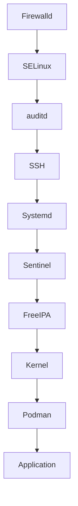

Plus les sources sont nombreuses… plus la compréhension d'un incident est précise. C'est exactement le principe de la défense en profondeur appliqué à l'observabilité.

## Journaliser Sentinel

À partir de ce chapitre, Sentinel va progressivement adopter la même philosophie. L'objectif n'est pas de produire énormément de journaux. L'objectif est de produire des journaux :

- cohérents ;
- corrélables ;
- exploitables automatiquement.

Par exemple :

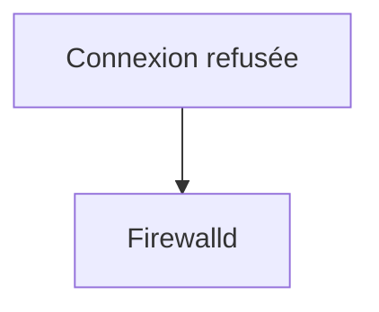

Puis :

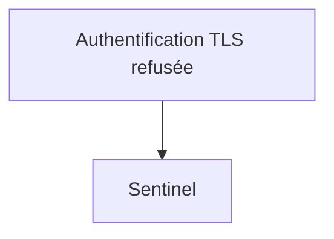

Puis :

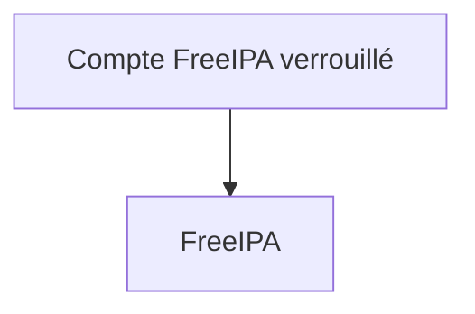

Les trois événements racontent une seule histoire. Notre futur tableau de bord de supervision devra être capable de les rapprocher automatiquement. Cette approche sera progressivement construite dans les prochaines campagnes.

## En entreprise

Dans une entreprise mature, la journalisation est considérée comme un produit à part entière. Des règles existent. Par exemple :

- format commun ;
- fuseau horaire unique ;
- synchronisation NTP obligatoire ;
- niveaux de gravité normalisés ;
- durée de conservation définie ;
- procédures d'investigation documentées.

Le pare-feu doit respecter ces conventions. Sinon, ses journaux seront difficiles à intégrer aux autres sources.

### Exemple d'incident

Un administrateur constate que plusieurs agents Sentinel cessent de communiquer. Le serveur semble pourtant parfaitement opérationnel. Les journaux montrent : `FW_AGENT_DENIED` Quelques secondes plus tard : `SNT_AGENT_TIMEOUT` Puis : `IPA_MACHINE_AUTH_FAILED` L'enquête révèle finalement qu'une nouvelle Rich Rule, déployée par erreur via Ansible, bloque un sous-réseau industriel. Sans une convention de journalisation cohérente, ce diagnostic aurait demandé beaucoup plus de temps.

L'objectif n'est donc pas uniquement de conserver des journaux. Il est de réduire le temps nécessaire pour comprendre un incident.

## Culture technique

Les grandes plateformes de sécurité modernes manipulent rarement des journaux « bruts ». Elles les transforment. Chaque événement est enrichi. Par exemple :

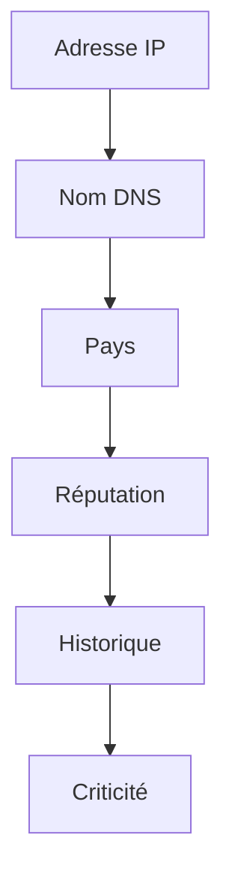

Un simple refus Firewalld devient ainsi :

> « Une adresse IP déjà impliquée dans plusieurs scans cette semaine tente d'accéder au bastion SSH depuis un pays inhabituel. »

Le message d'origine n'a pas changé. C'est son contexte qui s'est enrichi. C'est précisément la logique que nous adopterons progressivement avec Sentinel : produire des événements simples mais suffisamment structurés pour pouvoir être enrichis ultérieurement.

## Piège classique

### Croire qu'un journal prouve une attaque

Voir apparaître : `FW_SSH_DENIED` ne signifie pas nécessairement qu'une attaque est en cours. Il peut s'agir :

- d'une erreur de configuration ;
- d'un administrateur utilisant un mauvais réseau ;
- d'un test de supervision ;
- d'un script de maintenance ;
- d'un équipement mal configuré.

À l'inverse, l'absence de journaux ne prouve pas qu'aucune attaque n'existe. Un attaquant peut :

- utiliser un flux déjà autorisé ;
- compromettre un poste interne ;
- exploiter une vulnérabilité applicative après le pare-feu.

Les journaux doivent toujours être interprétés dans leur contexte. Ils constituent des indices. Jamais des preuves absolues.

## Journal global, règle ciblée et protection des données

Firewalld propose `LogDenied`, observable avec `firewall-cmd --get-log-denied`. Cette option ajoute une journalisation générale près des refus finaux ; elle est utile pour un diagnostic court, mais souvent trop large pour une exploitation durable. Une Rich Rule avec un préfixe et une limite associe mieux l'événement à une intention précise.

```bash
firewall-cmd --get-log-denied
sudo firewall-cmd --set-log-denied=unicast
```

`--set-log-denied` modifie la politique globale et provoque un rechargement : notez l'état initial et remettez-le après le diagnostic. Sur un serveur exposé, commencez par une règle ciblée et limitée plutôt que par `all`.

Un journal réseau contient des données : adresses, ports, horaires, noms d'hôtes et parfois fragments de contexte organisationnel. Définissez qui peut le lire, sa durée de conservation, sa rotation, son transfert et son horodatage. La centralisation protège l'enquête contre la perte locale, mais agrandit aussi le périmètre de données à protéger.

La limitation du journal ne limite pas forcément le trafic lui-même. Elle peut réduire les messages tout en continuant à refuser chaque paquet. Le tableau de bord doit donc distinguer « événements enregistrés » et « événements réseau estimés » ; sinon une limite transforme silencieusement une mesure en sous-échantillonnage.

Une taxonomie commune facilite la corrélation : par exemple `FW_` pour le filtrage, `TLS_` pour le chiffrement et `IPA_` pour l'identité, suivis d'une action stable. Elle évite qu'un même scénario soit décrit sous trois noms incompatibles par Firewalld, Sentinel et FreeIPA.

Ne calibrez pas une détection uniquement sur les rafales. Une tentative toutes les vingt minutes peut disparaître dans chaque fenêtre courte tout en dessinant une campagne sur plusieurs jours. Corrélez dans le temps et observez aussi les changements de source. Enfin, souvenez-vous que les réponses visibles — bannissement immédiat, fermeture ou nouveau délai — renseignent également l'attaquant sur vos mécanismes ; la collecte silencieuse peut parfois préserver un avantage défensif.

## TP 1 — Produire et retrouver un refus

### Objectif

Mettre en œuvre une politique de journalisation réaliste sur un serveur AlmaLinux, puis analyser les événements générés lors de différentes situations réseau. À l'issue de ce laboratoire, vous devrez être capable de distinguer :

- un trafic légitime ;
- un trafic bloqué par Firewalld ;
- un comportement anormal ;
- une tentative d'attaque automatisée.

### Architecture

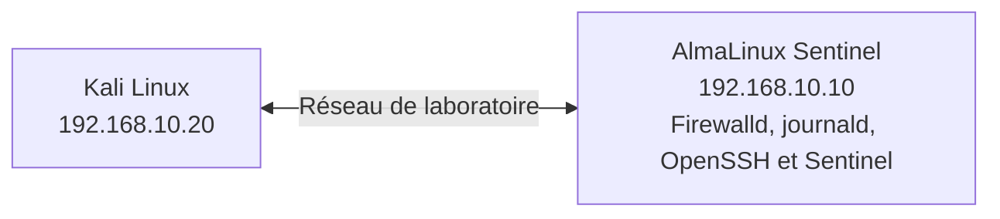

### Étape 1 — Observer le journal du noyau

Sur AlmaLinux :

```bash
sudo journalctl -k -f
```

Laissez cette commande ouverte. Elle affichera les nouveaux messages du noyau en temps réel.

### Étape 2 — Ajouter une Rich Rule journalisée

Ajoutez une règle refusant les connexions SSH provenant de Kali tout en les journalisant. Par exemple :

```bash
sudo firewall-cmd \
--add-rich-rule='
rule
family="ipv4"
source address="192.168.10.20"
service name="ssh"
log prefix="FW_SSH_DENIED "
drop'
```

Rechargez ensuite Firewalld si nécessaire.

### Étape 3 — Générer plusieurs tentatives

Depuis Kali :

```bash
ssh utilisateur@192.168.10.10
```

Répétez plusieurs fois la tentative. Observez simultanément :

```bash
journalctl -k -f
```

Relevez notamment :

- le préfixe ;
- l'adresse IP source ;
- le port source ;
- le port destination ;
- l'interface concernée.

## TP 2 — Limiter et corréler les événements

Supprimez la règle précédente. Recréez-la avec une limitation. Par exemple : `5 événements par minute` Reproduisez ensuite un grand nombre de tentatives. Comparez :

- le nombre réel de connexions ;
- le nombre d'événements effectivement enregistrés.

Réfléchissez aux conséquences pour un SOC.

### Étape 5 — Rechercher un événement précis

À partir du préfixe choisi :

```bash
journalctl | grep FW_SSH_DENIED
```

Puis :

```bash
journalctl --since "30 minutes ago"
```

Construisez progressivement votre propre méthode de recherche. L'objectif est de pouvoir retrouver rapidement :

- une tentative ;
- une adresse IP ;
- une plage horaire.

### Étape 6 — Corréler plusieurs journaux

Lancez Sentinel. Depuis Kali :

- réalisez une connexion valide ;
- réalisez ensuite une connexion invalide (certificat absent, mauvais certificat ou refus volontaire selon votre environnement).

Comparez les événements obtenus dans :

- Firewalld ;
- le journal système ;
- Sentinel.

Essayez de reconstruire la chronologie complète. Ne vous contentez pas d'un seul journal.

## Mission d'ingénieur

### Contexte

Votre entreprise exploite Sentinel sur plus de 250 serveurs répartis sur plusieurs sites. Les événements de sécurité sont centralisés dans un SIEM. Depuis quelques jours, plusieurs analystes se plaignent d'une explosion du nombre d'alertes. Les tableaux de bord deviennent pratiquement inutilisables. Après analyse, vous constatez que :

- chaque scan Internet produit plusieurs milliers d'événements Firewalld ;
- certaines Rich Rules journalisent chaque paquet ;
- plusieurs serveurs utilisent des conventions de préfixes différentes ;
- aucune limitation (`limit`) n'est appliquée.

La direction ne souhaite pas diminuer la visibilité de la sécurité. Elle souhaite au contraire améliorer la qualité des informations remontées.

### Votre mission

Proposez une nouvelle stratégie de journalisation. Votre proposition devra notamment traiter :

- la convention de nommage des préfixes ;
- les événements qui méritent réellement une journalisation ;
- les événements qui devraient être ignorés ;
- les niveaux de gravité ;
- les limitations à mettre en place ;
- les informations indispensables pour faciliter les investigations futures.

Vous devrez également expliquer comment cette stratégie pourra être déployée automatiquement sur l'ensemble du parc grâce à Ansible. L'objectif n'est pas de produire plus de journaux. L'objectif est de produire de meilleurs journaux.

## Impact sur Sentinel

À partir de ce chapitre, Sentinel cesse d'être uniquement un service réseau. Il devient également une source d'événements de sécurité. Dans les campagnes suivantes, nous construirons progressivement une chaîne complète d'observabilité.

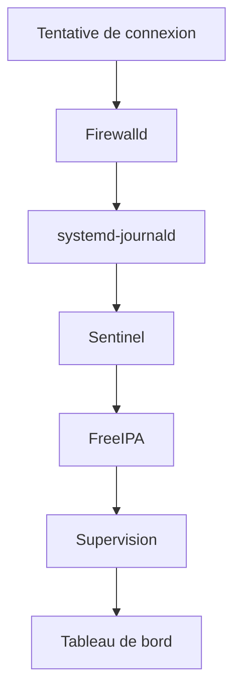

Chaque couche apportera des informations complémentaires. L'objectif final sera de pouvoir répondre à des questions telles que :

- Pourquoi cette connexion a-t-elle été refusée ?
- À quel moment ?
- Depuis quelle machine ?
- Le certificat était-il valide ?
- L'utilisateur existait-il dans FreeIPA ?
- Une règle Firewalld est-elle intervenue ?
- Une attaque similaire a-t-elle déjà été observée auparavant ?

Une infrastructure sécurisée est une infrastructure capable d'expliquer son propre comportement.

## Synthèse

- Journaliser ne consiste pas à enregistrer tous les paquets.
- Une bonne politique de journalisation distingue les événements utiles du bruit.
- Les préfixes doivent être normalisés et documentés.
- `journalctl` est un outil fondamental pour toute investigation sur AlmaLinux.
- Les Rich Rules permettent de produire des événements précis et contextualisés.
- La limitation (`limit`) protège les journaux contre les scans massifs.
- Les journaux Firewalld prennent toute leur valeur lorsqu'ils sont corrélés avec ceux de Sentinel, FreeIPA, SELinux et des autres composants.
- Une stratégie d'observabilité fait partie intégrante de la défense en profondeur.

## Infographie de révision

```text
┌──────────────────────────────────────────────────────────────────────────────┐
│          CHAPITRE 3.7 — JOURNALISATION FIREWALLD                             │
├──────────────────────────────────────────────────────────────────────────────┤
│                                                                              │
│                    Observer avant d'agir                                     │
│                                                                              │
├──────────────────────────────────────────────────────────────────────────────┤
│                                                                              │
│             Firewalld                                                        │
│                  │                                                           │
│                  ▼                                                           │
│             Kernel Log                                                       │
│                  │                                                           │
│                  ▼                                                           │
│        systemd-journald                                                      │
│                  │                                                           │
│        ┌─────────┴─────────┐                                                 │
│        ▼                   ▼                                                 │
│    journalctl          rsyslog                                               │
│        │                   │                                                 │
│        └─────────┬─────────┘                                                 │
│                  ▼                                                           │
│            SIEM / SOC                                                        │
│                                                                              │
├──────────────────────────────────────────────────────────────────────────────┤
│                                                                              │
│ Bonnes pratiques                                                             │
│                                                                              │
│ ✓ Préfixes cohérents                                                         │
│ ✓ Journaliser les événements significatifs                                   │
│ ✓ Utiliser limit                                                             │
│ ✓ Corréler plusieurs sources                                                 │
│ ✓ Définir une convention commune                                             │
│                                                                              │
├──────────────────────────────────────────────────────────────────────────────┤
│                                                                              │
│ Mauvaises pratiques                                                          │
│                                                                              │
│ ✗ Tout journaliser                                                           │
│ ✗ Préfixes incohérents                                                       │
│ ✗ Aucune limitation                                                          │
│ ✗ Utiliser les journaux comme unique preuve                                  │
│                                                                              │
├──────────────────────────────────────────────────────────────────────────────┤
│                                                                              │
│ Défense en profondeur                                                        │
│                                                                              │
│ Firewalld → journald → Sentinel → FreeIPA → SIEM → SOC                      │
│                                                                              │
├──────────────────────────────────────────────────────────────────────────────┤
│                                                                              │
│ Réflexe d'ingénieur                                                          │
│                                                                              │
│ « Un bon journal ne raconte pas seulement ce qui s'est passé.                │
│  Il permet de comprendre pourquoi cela s'est produit. »                      │
│                                                                              │
└──────────────────────────────────────────────────────────────────────────────┘
```

## Pour aller plus loin

Jusqu'à présent, nos règles de pare-feu ciblaient principalement des **adresses IP individuelles** ou de petits sous-réseaux. Cette approche fonctionne correctement pour quelques exceptions. Mais comment gérer efficacement :

- plusieurs centaines de serveurs d'administration ;
- des milliers d'agents Sentinel ;
- des listes d'adresses malveillantes mises à jour quotidiennement ;
- des réseaux partenaires qui évoluent régulièrement ?

Créer une Rich Rule pour chaque adresse deviendrait rapidement ingérable. Le chapitre suivant introduit un mécanisme essentiel pour les infrastructures de taille importante : **les IP Sets**. Nous verrons comment regrouper des centaines ou des milliers d'adresses dans des ensembles réutilisables, performants et facilement administrables, notamment via Ansible.

← [3.6 — Les Rich Rules Firewalld](3.6-rich-rules-firewalld.md) · [3.8 — Les IP Sets Firewalld](3.8-ip-sets-firewalld.md) →
