# Chapitre 3.8 — Les IP Sets Firewalld

> **Campagne 3 — Réseau et exposition**

> *« Une politique de sécurité qui ne passe pas à l'échelle finit toujours par être contournée par ses propres administrateurs. »*

## Vous êtes ici

```text
Partie I ─ Construire un socle sécurisé
        │
        ├── Campagne 1 ─ Installation
        ├── Campagne 2 ─ Comptes et privilèges
        │
        └── Campagne 3 ─ Sécurisation réseau
                 │
                 ├── 3.1 TCP/IP côté administrateur
                 ├── 3.2 Firewalld
                 ├── 3.3 Les zones
                 ├── 3.4 Les services
                 ├── 3.5 Conntrack
                 ├── 3.6 Les Rich Rules
                 ├── 3.7 Journalisation
                 │
                 ├──► 3.8 Les IP Sets
                 ├── 3.9 Runtime vs Permanent
                 └── 3.10 Architecture Firewalld
```

## Objectifs pédagogiques

À la fin de ce chapitre, vous serez capable de :

- comprendre pourquoi les IP Sets sont indispensables dans une infrastructure importante ;
- distinguer une Rich Rule d'un IP Set ;
- créer, modifier et supprimer des IP Sets avec Firewalld ;
- construire des politiques évolutives adaptées à plusieurs centaines ou milliers d'adresses ;
- intégrer les IP Sets dans une architecture Ansible et FreeIPA ;
- comprendre leur fonctionnement interne et leur impact sur les performances.

## Pourquoi ce chapitre existe

Jusqu'à présent, nous avons utilisé des Rich Rules pour exprimer des politiques telles que :

> Seul le réseau d'administration peut accéder à SSH.

Cette approche fonctionne très bien lorsque les règles concernent :

- un serveur ;
- un sous-réseau ;
- quelques adresses IP.

Mais imaginons maintenant une entreprise de taille nationale. Elle possède :

- 18 sites industriels ;
- 250 serveurs AlmaLinux ;
- 4 500 postes d'administration ;
- plusieurs partenaires externes ;
- plusieurs VPN ;
- une flotte d'agents Sentinel.

Une Rich Rule par adresse IP ? Rapidement, la configuration devient ingérable. Ce n'est plus un problème technique. C'est un problème d'industrialisation. Les IP Sets répondent précisément à cette problématique. Ils permettent de remplacer :

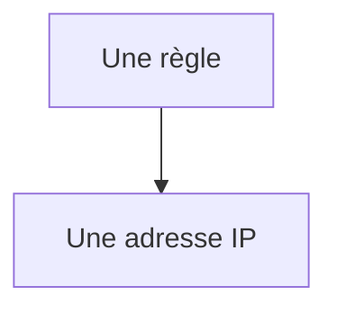

par :

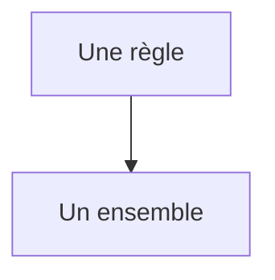

Cette différence paraît minime. Elle change pourtant complètement la manière de concevoir une politique de sécurité.

## Théorie détaillée

### Une Rich Rule décrit une politique

Prenons une Rich Rule.

```text
Autoriser SSH

depuis

192.168.10.15
```

La politique est claire. Mais que se passe-t-il lorsque dix nouvelles machines doivent être autorisées ? L'administrateur ajoute :

- une nouvelle règle ;
- puis une autre ;
- puis une autre.

Quelques mois plus tard :

```text
Rich Rule 1

Rich Rule 2

Rich Rule 3

...

Rich Rule 48
```

Toutes réalisent exactement la même action. La seule différence est l'adresse IP. Cette duplication constitue un excellent indicateur qu'un autre mécanisme est plus adapté.

## Le principe d'un IP Set

Un IP Set est simplement une collection d'adresses. Par exemple :

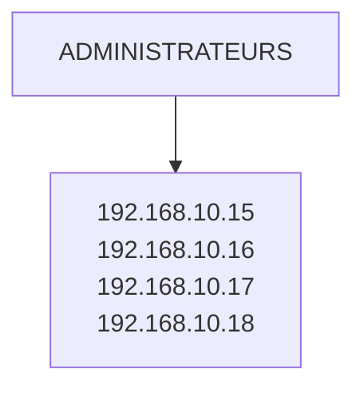

La Rich Rule ne contient plus les adresses. Elle référence uniquement :

```
ADMINISTRATEURS
```

La politique devient immédiatement plus lisible.

### Visualisation

Sans IP Set :


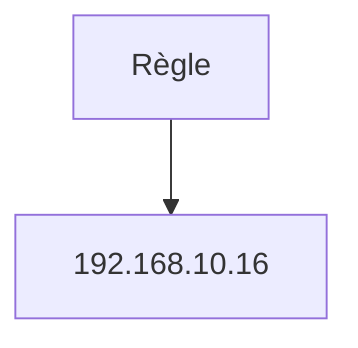

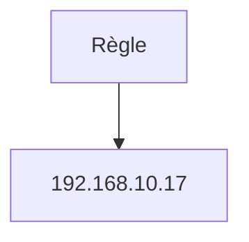

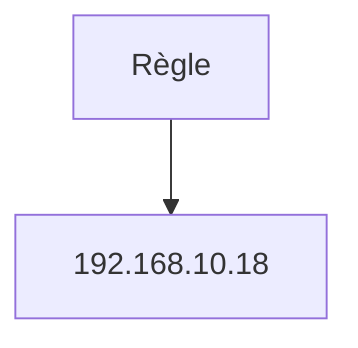

Avec IP Set :

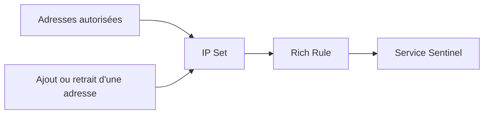

Une seule règle. Un seul objet à maintenir.

## Pourquoi est-ce plus performant ?

Beaucoup imaginent que Firewalld parcourt une liste d'adresses. Ce n'est pas le cas. Les IP Sets utilisent des structures de données optimisées dans le noyau. Schématiquement :

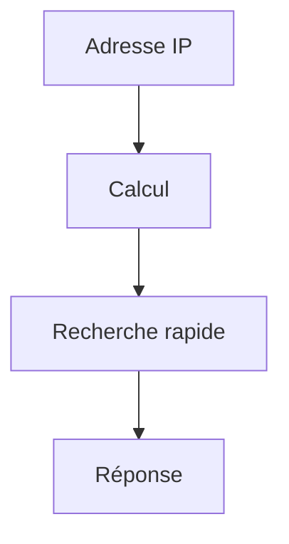

La recherche ne consiste pas à comparer successivement :

```
Adresse 1

Adresse 2

Adresse 3

...

Adresse 5000
```

Elle utilise une structure de type **table de hachage** (*hash table*) dans la majorité des cas. Le coût reste très faible, même lorsque l'ensemble contient plusieurs milliers d'entrées.

## Un changement de philosophie

Une Rich Rule répond à une question.

> Qui peut accéder à SSH ?

Un IP Set répond à une autre.

> Qui appartient au groupe des administrateurs ?

Cette distinction est importante. Les Rich Rules expriment une **politique**. Les IP Sets décrivent des **groupes**. Cette séparation est un principe classique d'ingénierie. Les données évoluent. Les règles restent stables.

## Les différents types d'IP Sets

Les plus courants sont : `hash:ip` Une liste d'adresses IPv4 ou IPv6. `hash:net` Une liste de réseaux. `hash:ip,port` Association d'une adresse et d'un port. `hash:mac` Basé sur des adresses MAC. Firewalld masque une partie de cette complexité. Dans la plupart des infrastructures, les deux premiers types couvrent déjà la majorité des besoins.

## Créer un IP Set

Exemple.

```bash
sudo firewall-cmd \
--permanent \
--new-ipset=admins \
--type=hash:ip
```

Nous créons ici un ensemble nommé :

```
admins
```

capable de contenir des adresses IP.

## Ajouter des membres

Ajoutons plusieurs administrateurs.

```bash
sudo firewall-cmd \
--permanent \
--ipset=admins \
--add-entry=192.168.10.15
```

Puis :

```bash
sudo firewall-cmd \
--permanent \
--ipset=admins \
--add-entry=192.168.10.16
```

Puis :

```bash
sudo firewall-cmd \
--permanent \
--ipset=admins \
--add-entry=192.168.10.17
```

Rechargeons ensuite Firewalld.

```bash
sudo firewall-cmd --reload
```

## Vérifier le contenu

```bash
firewall-cmd --info-ipset=admins
```

Exemple :

```text
admins

type: hash:ip

entries:

192.168.10.15

192.168.10.16

192.168.10.17
```

Le pare-feu possède maintenant un objet réutilisable.

## Utiliser un IP Set dans une Rich Rule

La Rich Rule devient très simple.

```text
rule

source ipset="admins"

service name="ssh"

accept
```

Remarquez la différence. Nous n'avons plus besoin de connaître :

```
192.168.10.15

192.168.10.16

192.168.10.17
```

La règle ne manipule plus les adresses. Elle manipule un groupe logique.

## Modifier une politique devient trivial

Un nouvel administrateur rejoint l'équipe. Ancienne approche. Créer une nouvelle Rich Rule. Nouvelle approche. Ajouter une entrée.

```bash
--add-entry=192.168.10.42
```

Aucune politique n'est modifiée. Seules les données évoluent. C'est exactement ce que recherche une architecture maintenable.

## Exemple Sentinel

Imaginons plusieurs centaines d'agents industriels. Au lieu d'écrire :


Puis :


Puis :

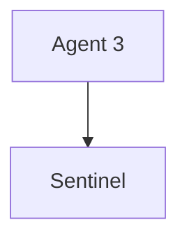

Nous créons simplement :

```text
IP Set

INDUSTRIAL_AGENTS
```

La Rich Rule devient :

```text
Les membres du groupe

INDUSTRIAL_AGENTS

peuvent accéder

au service Sentinel.
```

Demain, si un nouvel atelier est déployé, il suffira d'ajouter les nouvelles adresses au groupe. La politique de sécurité restera inchangée.

## Les IP Sets comme référentiel

C'est probablement le changement de perspective le plus important. Dans une infrastructure mature, les IP Sets ne sont plus considérés comme des listes techniques. Ils deviennent des référentiels métiers. Par exemple : `BASTIONS` `SERVEURS_BACKUP` `AGENTS_SENTINEL` `ADMIN_OT` `PARTENAIRES` Ces noms racontent l'organisation de l'entreprise. Ils sont compréhensibles même par un auditeur qui ne connaît pas les adresses IP. Ils survivront également à un changement complet du plan d'adressage.

C'est l'un des objectifs majeurs de toute architecture pérenne.

## Fonctionnement interne des IP Sets

À première vue, un IP Set ressemble à une simple liste. En réalité, le noyau Linux met en œuvre des structures de données beaucoup plus élaborées. L'objectif est simple. Répondre extrêmement rapidement à une question :

> **Cette adresse appartient-elle à cet ensemble ?**

Si la réponse devait être obtenue en parcourant séquentiellement plusieurs milliers d'adresses, chaque nouveau paquet coûterait davantage de temps processeur. Le noyau utilise donc des structures adaptées aux recherches rapides. Dans la majorité des cas, il s'agit de **tables de hachage** (*hash tables*).

### Pourquoi une table de hachage ?

Imaginons deux approches. Première approche :

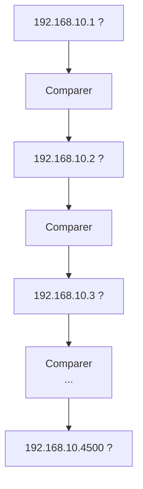

Le temps augmente avec la taille de la liste. Deuxième approche.

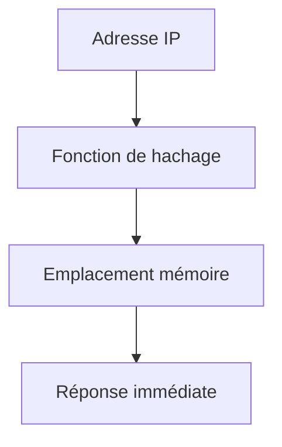

Le temps de recherche devient pratiquement indépendant du nombre d'entrées. C'est précisément ce qui rend les IP Sets adaptés aux grandes infrastructures.

## Les performances

Prenons deux architectures.

### Architecture A

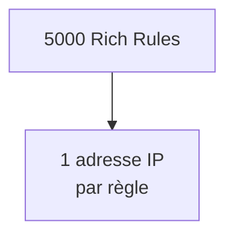

Chaque nouvelle connexion devra être comparée à un très grand nombre de règles.

### Architecture B

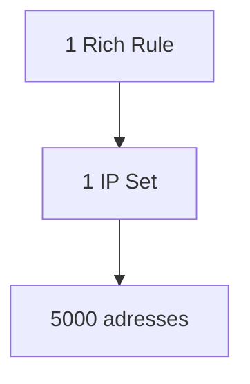

Le noyau consulte directement l'ensemble. La politique est :

- plus courte ;
- plus lisible ;
- plus rapide.

Ce gain devient particulièrement visible sur :

- les passerelles ;
- les reverse proxies ;
- les concentrateurs VPN ;
- les serveurs fortement exposés.

## Les IP Sets et Conntrack

Une question revient souvent. Les IP Sets remplacent-ils Conntrack ? Absolument pas. Ils répondent à deux problématiques totalement différentes. Conntrack répond à la question :

```
Ce paquet appartient-il

à une connexion

déjà connue ?
```

Les IP Sets répondent à une autre question.

```
Cette adresse

appartient-elle

à un ensemble ?
```

Ces deux mécanismes sont complémentaires. Une nouvelle connexion TCP pourra être traitée ainsi.

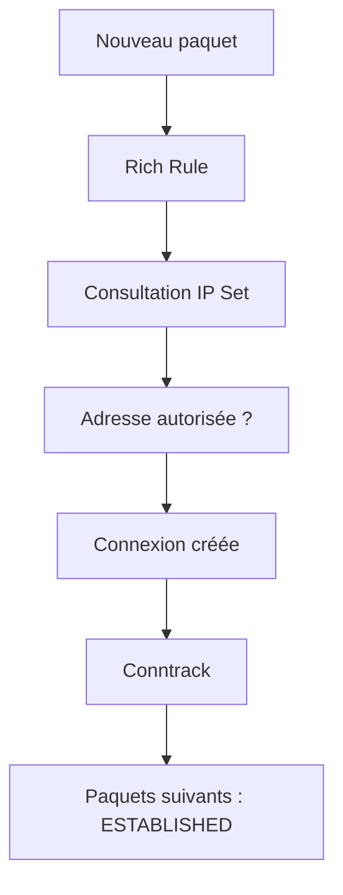

Les IP Sets interviennent généralement au début de la vie d'une connexion. Conntrack prend ensuite le relais.

## Les IP Sets et nftables

Comme pour les Rich Rules, Firewalld ne réalise pas lui-même les comparaisons. Le processus est identique.

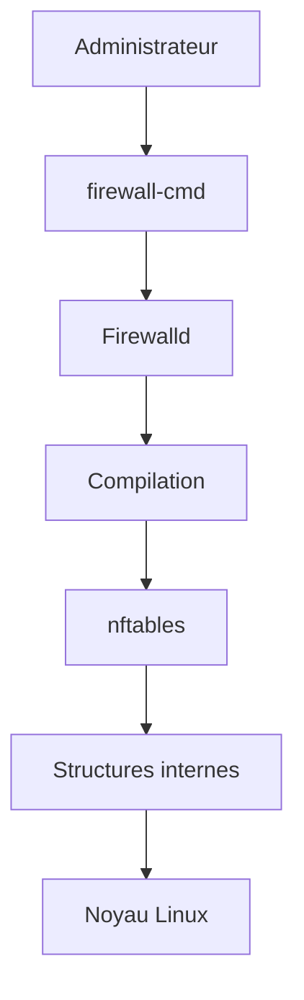

Les ensembles créés par Firewalld deviennent des objets `nftables`. Le traitement des paquets reste donc extrêmement rapide.

## Les IP Sets et FreeIPA

À première vue, ces deux technologies semblent sans rapport. En réalité, elles répondent à une problématique commune : **la gestion centralisée d'un référentiel.** FreeIPA centralise :

- les utilisateurs ;
- les groupes ;
- les hôtes ;
- les certificats.

Les IP Sets centralisent :

- les groupes d'adresses.

Prenons un exemple. FreeIPA contient un groupe : `Administrateurs Sentinel` L'automatisation Ansible peut alors produire un IP Set correspondant : `SENTINEL_ADMINS` La politique Firewalld devient :

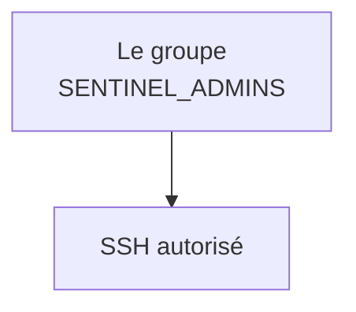

L'administrateur n'a plus besoin de modifier manuellement les règles du pare-feu. Il met simplement à jour le référentiel. Cette séparation entre :

- les données ;
- les politiques ;

est une caractéristique des architectures industrielles.

## Les IP Sets et Ansible

C'est probablement ici que les IP Sets prennent toute leur valeur. Imaginons un inventaire Ansible.

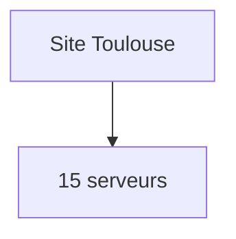

```mermaid
flowchart TD
    N0["Site Lyon"]
    N1["32 serveurs"]
    N0 --> N1
```

```mermaid
flowchart TD
    N0["Site Lille"]
    N1["18 serveurs"]
    N0 --> N1
```

Les adresses évoluent régulièrement. Sans IP Set : chaque modification implique de réécrire plusieurs Rich Rules. Avec les IP Sets : Ansible met simplement à jour les ensembles. Les politiques restent identiques. Le déploiement devient beaucoup plus fiable.

## Les IP Sets et Podman

Notre futur environnement Sentinel utilisera également Podman. Un point mérite donc d'être anticipé. Les conteneurs possèdent souvent leurs propres réseaux. Par exemple : `10.88.0.0/16` ou `10.89.0.0/16` Plutôt que d'écrire plusieurs Rich Rules spécifiques :

```
10.88.0.0/16

10.89.0.0/16

10.90.0.0/16
```

nous pourrons créer : `PODMAN_NETWORKS` Le pare-feu raisonnera alors sur un groupe logique. Si demain un nouveau réseau de conteneurs apparaît, il suffira de l'ajouter à l'ensemble. La politique de sécurité restera inchangée.

## Les IP Sets comme objet métier

À mesure qu'une infrastructure grandit, un phénomène intéressant apparaît. Les administrateurs cessent progressivement de raisonner en adresses IP. Ils raisonnent en populations. Par exemple : `Tous les bastions.` `Tous les serveurs de sauvegarde.` `Tous les agents Sentinel.` `Tous les partenaires VPN.` L'adresse IP devient un simple attribut technique. La politique exprime désormais une intention métier. Cette évolution est exactement la même que celle observée avec FreeIPA.

Un administrateur ne donne pas des droits à un utilisateur. Il les donne à un groupe. Les IP Sets appliquent ce même principe au réseau.

## Les IP Sets et la maintenance

Imaginons qu'un partenaire externe change complètement de plan d'adressage. Ancienne approche. Il faut retrouver :

- toutes les Rich Rules ;
- toutes les ACL ;
- toutes les documentations.

Nouvelle approche. Il suffit de mettre à jour :

```text
IP Set

PARTNERS
```

Toutes les politiques utilisant cet ensemble continuent immédiatement de fonctionner. Cette capacité d'évolution constitue probablement le principal intérêt des IP Sets. Une bonne architecture ne cherche pas seulement à être correcte aujourd'hui. Elle cherche à rester simple à maintenir dans cinq ans.

## Les limites des IP Sets

Comme toute technologie, les IP Sets ne résolvent pas tous les problèmes. Ils ne remplacent pas :

- une authentification ;
- TLS ;
- FreeIPA ;
- SELinux ;
- les Rich Rules.

Ils ne savent répondre qu'à une seule question :

> Cette adresse appartient-elle à cet ensemble ?

Il ne faut donc pas leur demander davantage. Les IP Sets sont un excellent outil de structuration. Ils ne constituent pas une politique de sécurité complète.

## Quand utiliser un IP Set ?

Une règle empirique est souvent suffisante. Utilisez un IP Set lorsque :

- plusieurs Rich Rules utilisent les mêmes adresses ;
- les adresses évoluent régulièrement ;
- plusieurs serveurs partagent la même politique ;
- les ensembles représentent un groupe métier.

À l'inverse, pour une exception très ponctuelle concernant une seule adresse, une Rich Rule classique reste souvent plus simple. L'ingénieur sécurité choisit toujours l'outil le plus simple répondant correctement au besoin. Il évite les architectures inutilement complexes.

## En entreprise

Dans une entreprise mature, les IP Sets sont rarement créés manuellement. Ils sont généralement issus d'une chaîne d'automatisation. Prenons un exemple réaliste.

```mermaid
flowchart TD
    N0["FreeIPA"]
    N1["Inventaire Ansible"]
    N2["Génération des IP Sets"]
    N3["Déploiement Firewalld"]
    N4["Validation automatique"]
    N0 --> N1
    N1 --> N2
    N2 --> N3
    N3 --> N4
```

Chaque nuit, les ensembles sont recalculés. Les adresses obsolètes disparaissent. Les nouveaux serveurs sont ajoutés. L'administrateur n'intervient pratiquement jamais. Cette automatisation réduit considérablement :

- les oublis ;
- les divergences ;
- les erreurs humaines.

### Exemple Sentinel

Supposons que Sentinel soit déployé sur cinquante sites industriels. Chaque site possède :

- un serveur Sentinel ;
- plusieurs dizaines d'agents ;
- un bastion d'administration.

Les IP Sets suivants peuvent être définis : `SENTINEL_AGENTS` `SENTINEL_ADMINS` `BACKUP_SERVERS` `MONITORING` Toutes les Rich Rules deviennent extrêmement simples. Le changement de politique ne nécessite plus de modifier les règles. Il suffit de faire évoluer les ensembles. Cette approche est particulièrement appréciée lors des audits, car elle rend les politiques beaucoup plus lisibles.

## Culture technique

Les IP Sets sont souvent comparés aux groupes d'utilisateurs. Cette analogie est excellente.

| Gestion des identités | Gestion réseau |
|------------------------|----------------|
| Utilisateur | Adresse IP |
| Groupe LDAP / FreeIPA | IP Set |
| Politique d'autorisation | Rich Rule |
| Authentification | Filtrage réseau |

Personne n'imagine gérer plusieurs milliers d'utilisateurs sans groupes. De la même manière, gérer plusieurs milliers d'adresses sans IP Sets devient rapidement irréaliste. L'évolution des infrastructures a naturellement conduit à cette abstraction. Les grands équipements réseau, les pare-feu matériels et les solutions SDN utilisent tous des concepts similaires, même si les terminologies diffèrent.

## Piège classique

### Utiliser les IP Sets comme une simple "liste d'adresses"

C'est probablement l'erreur la plus fréquente. Un administrateur crée : `ipset1` Puis : `ipset2` Puis : `ipset3` Quelques mois plus tard, plus personne ne sait :

- ce que contient chaque ensemble ;
- pourquoi il existe ;
- qui en est responsable.

Le problème ne vient pas de Firewalld. Il vient du manque de sémantique. Comparez les deux exemples suivants. Premier : `IPSET_01` Deuxième : `SENTINEL_PRODUCTION_AGENTS` Le second se documente pratiquement tout seul. Le nom raconte déjà une partie de la politique. Une convention de nommage cohérente est un investissement qui sera amorti pendant toute la durée de vie de l'infrastructure.

### Confondre groupe réseau et groupe fonctionnel

Prenons un exemple. Vous créez : `192.168.10.0/24` sous le nom : `ADMINS` Quelques mois plus tard, un nouvel administrateur arrive. Il travaille depuis : `192.168.80.0/24` Que faire ? Ajouter ce nouveau réseau ? Changer le nom ? Créer un second ensemble ? Le problème est que le nom ne représente plus correctement la réalité. Une meilleure approche consiste à distinguer :

- les groupes fonctionnels ;
- les groupes techniques.

Par exemple : `ADMINISTRATORS` désigne une population. Alors que : `SITE_TOULOUSE_ADMIN_NETWORK` désigne une réalité réseau. Cette distinction facilite énormément les évolutions futures.

### Oublier les adresses obsolètes

Un IP Set est vivant. Il doit être entretenu. Sans revue régulière, il finit par contenir :

- d'anciens partenaires ;
- des serveurs supprimés ;
- des réseaux migrés ;
- des exceptions oubliées.

Ces entrées inutiles élargissent progressivement la surface d'attaque. Une bonne pratique consiste à considérer chaque IP Set comme un objet soumis au même cycle de vie qu'un compte utilisateur.

### Ne pas confondre adresse autorisée et identité fiable

Un attaquant qui compromet un bastion ou un agent déjà membre d'un IP Set hérite du chemin réseau associé : c'est un point de départ possible pour un rebond. L'appartenance à l'ensemble ne prouve donc ni l'identité du processus ni celle de l'utilisateur. Elle doit rester combinée à TLS, à l'authentification, aux autorisations applicatives et à la journalisation.

## Famille, capacité et durée de vie

Un IP Set possède un type et des options. `family=inet` et `family=inet6` séparent IPv4 et IPv6 ; une entrée de la mauvaise famille doit être refusée plutôt que convertie implicitement. `hashsize` dimensionne la structure initiale, `maxelem` borne le nombre d'éléments et `timeout` permet des expirations dans certains usages. Les types réellement disponibles dépendent de Firewalld et du noyau : interrogez la machine.

```bash
firewall-cmd --get-ipset-types
firewall-cmd --permanent --info-ipset=sentinel-agents
```

Une liste d'adresses n'est fiable que si sa source de vérité l'est. Associez à chaque ensemble un propriétaire, une origine, une date de revue et une procédure de retrait. Un nom DNS n'est pas un substitut automatique : Firewalld attend des entrées compatibles avec le type, et une résolution ponctuelle ne suit pas magiquement les changements futurs.

Pour une mise à jour volumineuse, préparez un fichier versionné et utilisez les opérations d'ajout ou de retrait depuis un fichier. Vérifiez les erreurs partielles, l'état runtime et l'état permanent. Une règle qui référence un ensemble vide peut être techniquement valide tout en interrompant tout accès Sentinel.

```bash
sudo firewall-cmd --permanent --ipset=sentinel-agents --add-entries-from-file=agents.txt
sudo firewall-cmd --check-config
```

## TP 1 — Construire un IP Set

### Objectif

Mettre en œuvre des IP Sets afin de simplifier la politique de sécurité de Sentinel et observer les bénéfices apportés par cette approche.

### Architecture

```mermaid
flowchart LR
    kali[Kali Linux<br/>192.168.10.20]
    alma[AlmaLinux Sentinel<br/>192.168.10.10<br/>Firewalld, OpenSSH, Sentinel et IP Sets]
    kali <-->|Réseau de laboratoire| alma
```

### Étape 1 — Créer un IP Set

Créer un ensemble destiné aux administrateurs.

```bash
sudo firewall-cmd \
--permanent \
--new-ipset=sentinel_admins \
--type=hash:ip
```

Rechargez ensuite Firewalld.

### Étape 2 — Ajouter plusieurs membres

Ajoutez plusieurs adresses. Par exemple :

```bash
sudo firewall-cmd \
--permanent \
--ipset=sentinel_admins \
--add-entry=192.168.10.20
```

Ajoutez ensuite d'autres adresses de test. Vérifiez le résultat.

```bash
firewall-cmd --info-ipset=sentinel_admins
```

### Étape 3 — Créer une Rich Rule

Autorisez SSH uniquement pour les membres de cet ensemble. Vérifiez que la Rich Rule reste très simple. Posez-vous la question suivante. Que faudrait-il modifier si un nouvel administrateur arrivait demain ?

## TP 2 — Faire évoluer l'ensemble sans réécrire la règle

Ajoutez une nouvelle adresse. Ne modifiez aucune Rich Rule. Testez immédiatement l'accès. Vous constaterez que la politique évolue sans que les règles elles-mêmes ne changent.

### Étape 5 — Construire un second ensemble

Créez : `sentinel_agents` Ajoutez plusieurs adresses fictives représentant des agents Sentinel. Écrivez ensuite une Rich Rule autorisant uniquement cet ensemble à accéder au port : `8443/TCP` Comparez cette approche avec une politique composée de plusieurs dizaines de Rich Rules individuelles.

### Étape 6 — Réflexion d'architecture

Sans modifier votre configuration, répondez aux questions suivantes.

- Quels ensembles pourraient être générés automatiquement par Ansible ?
- Lesquels pourraient provenir directement d'un inventaire Sentinel ?
- Quels ensembles devraient être revus régulièrement lors d'un audit ?

L'objectif est d'apprendre à distinguer les ensembles techniques des ensembles métier.

## Mission d'ingénieur

### Contexte

Votre entreprise déploie Sentinel sur 120 sites industriels. Chaque site possède :

- plusieurs dizaines d'agents ;
- un bastion ;
- un serveur de supervision ;
- un serveur de sauvegarde ;
- un réseau OT.

Jusqu'à présent, la politique Firewalld repose sur plus de 1 800 Rich Rules. Chaque nouveau site nécessite plusieurs heures de configuration. Les audits révèlent également :

- des adresses obsolètes ;
- des doublons ;
- des règles devenues inutiles.

La direction demande une refonte complète de la politique réseau. Les contraintes sont les suivantes :

- aucune interruption de service ;
- compatibilité avec Ansible ;
- possibilité d'intégrer de nouveaux sites sans modifier les Rich Rules existantes ;
- documentation compréhensible par des auditeurs non spécialistes de Firewalld.

### Votre mission

Proposez une nouvelle architecture basée sur les IP Sets. Expliquez notamment :

- quels ensembles créer ;
- quels noms utiliser ;
- quelles équipes seront responsables de leur contenu ;
- quelles données devront être générées automatiquement ;
- comment éviter les dérives au fil des années.

Votre objectif n'est pas uniquement de réduire le nombre de règles. Vous devez également améliorer la gouvernance de la politique de sécurité.

## Impact sur Sentinel

Les IP Sets constituent une étape importante dans l'industrialisation de Sentinel. À partir de maintenant, notre application ne raisonnera plus en adresses IP individuelles. Elle s'intégrera dans une politique réseau décrite à l'aide de groupes. Par exemple :

```mermaid
flowchart TD
    N0["Agents Sentinel"]
    N1["IP Set SENTINEL_AGENTS"]
    N2["Rich Rule"]
    N3["Firewalld"]
    N4["TLS mutuel"]
    N5["FreeIPA"]
    N6["Sentinel"]
    N0 --> N1
    N1 --> N2
    N2 --> N3
    N3 --> N4
    N4 --> N5
    N5 --> N6
```

Cette architecture présente plusieurs avantages.

- Les règles restent stables.
- Les ensembles évoluent facilement.
- Les déploiements Ansible sont simplifiés.
- Les audits deviennent plus lisibles.
- La croissance de l'infrastructure n'impose plus une explosion du nombre de Rich Rules.

Cette philosophie sera réutilisée dans les chapitres consacrés :

- à Ansible ;
- à FreeIPA ;
- aux déploiements multi-sites ;
- à l'industrialisation de Sentinel.

## Synthèse

- Les IP Sets regroupent des adresses IP ou des réseaux dans des ensembles réutilisables.
- Ils permettent de séparer les **données** (les adresses) de la **politique** (les Rich Rules).
- Ils améliorent à la fois la lisibilité, les performances et la maintenabilité.
- Les ensembles doivent représenter des groupes métier ou techniques clairement identifiés.
- Les IP Sets sont particulièrement adaptés aux déploiements automatisés avec Ansible.
- Ils complètent les Rich Rules ; ils ne les remplacent pas.
- Une bonne gouvernance des IP Sets est aussi importante que leur configuration technique.

## Infographie de révision

```text
┌──────────────────────────────────────────────────────────────────────────────┐
│                    CHAPITRE 3.8 — LES IP SETS                                │
├──────────────────────────────────────────────────────────────────────────────┤
│                                                                              │
│                 Séparer les données de la politique                          │
│                                                                              │
├──────────────────────────────────────────────────────────────────────────────┤
│                                                                              │
│               Rich Rule                                                      │
│                   │                                                          │
│                   ▼                                                          │
│        IP Set : SENTINEL_ADMINS                                              │
│                   │                                                          │
│     ┌─────────────┼─────────────┐                                            │
│     ▼             ▼             ▼                                            │
│ 192.168.10.20 192.168.10.21 192.168.10.22                                    │
│                                                                              │
├──────────────────────────────────────────────────────────────────────────────┤
│                                                                              │
│ Architecture recommandée                                                     │
│                                                                              │
│ CMDB / FreeIPA / Inventaire                                                  │
│             │                                                                │
│             ▼                                                                │
│         Ansible                                                              │
│             │                                                                │
│             ▼                                                                │
│         IP Sets                                                              │
│             │                                                                │
│             ▼                                                                │
│       Rich Rules                                                             │
│             │                                                                │
│             ▼                                                                │
│       Firewalld                                                              │
│                                                                              │
├──────────────────────────────────────────────────────────────────────────────┤
│                                                                              │
│ Bonnes pratiques                                                             │
│                                                                              │
│ ✓ Noms explicites                                                            │
│ ✓ Groupes métier                                                             │
│ ✓ Source de vérité unique                                                    │
│ ✓ Mise à jour automatisée                                                    │
│ ✓ Revue régulière des ensembles                                              │
│                                                                              │
├──────────────────────────────────────────────────────────────────────────────┤
│                                                                              │
│ Réflexe d'ingénieur                                                          │
│                                                                              │
│ « Les règles changent rarement.                                              │
│  Les groupes évoluent constamment. »                                         │
│                                                                              │
└──────────────────────────────────────────────────────────────────────────────┘
```

## Pour aller plus loin

Jusqu'à présent, nous avons essentiellement étudié **le contenu** de la politique de sécurité :

- les zones ;
- les services ;
- les Rich Rules ;
- les IP Sets.

Une autre caractéristique de Firewalld est pourtant à l'origine de nombreux incidents de production : **la coexistence de deux configurations distinctes : la configuration _runtime_ et la configuration _permanent_.** Cette particularité est extrêmement pratique pour tester des modifications… mais elle est également responsable d'un grand nombre d'erreurs lors des opérations de maintenance.

Le chapitre **3.9** sera consacré à cette dualité, à ses implications opérationnelles et aux bonnes pratiques permettant d'éviter les incohérences entre la configuration active et la configuration persistante.

← [3.7 — Journalisation et analyse Firewalld](3.7-journalisation-firewalld.md) · [3.9 — Runtime et Permanent](3.9-runtime-permanent.md) →
