# Chapitre 3.9 — Runtime et Permanent

> **Campagne 3 — Réseau et exposition**

> *« Une règle qui fonctionne aujourd'hui mais disparaît au prochain redémarrage n'est pas une politique de sécurité. C'est un accident heureux. »*

## Vous êtes ici

```text
Partie I ─ Construire un socle sécurisé
        │
        ├── Campagne 1 ─ Installation
        ├── Campagne 2 ─ Comptes et privilèges
        │
        └── Campagne 3 ─ Sécurisation réseau
                 │
                 ├── 3.1 TCP/IP côté administrateur
                 ├── 3.2 Firewalld
                 ├── 3.3 Les zones
                 ├── 3.4 Les services
                 ├── 3.5 Conntrack
                 ├── 3.6 Les Rich Rules
                 ├── 3.7 Journalisation
                 ├── 3.8 Les IP Sets
                 │
                 ├──► 3.9 Runtime vs Permanent
                 └── 3.10 Architecture Firewalld
```

## Objectifs pédagogiques

À la fin de ce chapitre, vous serez capable de :

- comprendre la différence fondamentale entre les configurations **runtime** et **permanent** ;
- expliquer pourquoi Firewalld a été conçu autour de deux espaces de configuration ;
- réaliser des modifications sans interrompre le trafic réseau ;
- éviter les erreurs classiques responsables de nombreuses indisponibilités ;
- intégrer cette logique dans des procédures d'exploitation professionnelles ;
- industrialiser les changements avec Ansible sans créer d'incohérences.

## Pourquoi ce chapitre existe

L'une des erreurs les plus fréquentes chez les administrateurs débutants est la suivante. Ils exécutent :

```bash
firewall-cmd --add-service=https
```

Le service devient immédiatement accessible. Les tests sont concluants. Quelques jours plus tard, le serveur redémarre. Le service cesse soudainement de répondre. Le diagnostic est souvent long. Pourtant, le problème est extrêmement simple. La règle n'a jamais été enregistrée dans la configuration permanente. À l'inverse, certains administrateurs modifient exclusivement la configuration permanente. Ils oublient ensuite de recharger Firewalld. Les nouvelles règles existent bien…

…mais elles ne sont jamais appliquées. Comprendre cette dualité est indispensable. Elle conditionne toute l'exploitation quotidienne d'un serveur Linux.

## Théorie détaillée

### Deux configurations indépendantes

Contrairement à de nombreux services Linux, Firewalld ne possède pas une seule configuration. Il en possède deux.

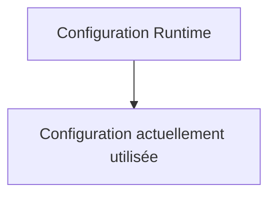

et

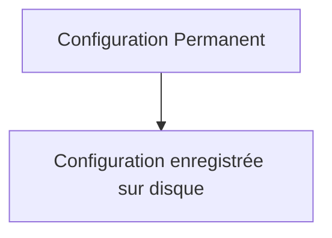

Ces deux espaces sont distincts. Ils peuvent même être différents. C'est précisément ce qui rend Firewalld particulièrement puissant… et parfois déroutant.

### Runtime

La configuration **runtime** représente l'état actuel du pare-feu. Autrement dit :

```
Ce que le noyau applique maintenant.
```

Toute modification réalisée sans option particulière agit sur cette configuration. Exemple :

```bash
firewall-cmd --add-service=https
```

La règle est immédiatement active. Aucun redémarrage n'est nécessaire. Le trafic peut immédiatement emprunter le nouveau port autorisé.

### Permanent

La configuration **permanent** représente l'état qui survivra au prochain rechargement ou redémarrage. Exemple :

```bash
firewall-cmd \
--permanent \
--add-service=https
```

Dans ce cas : la configuration est enregistrée… mais elle n'est pas encore appliquée. Autrement dit :

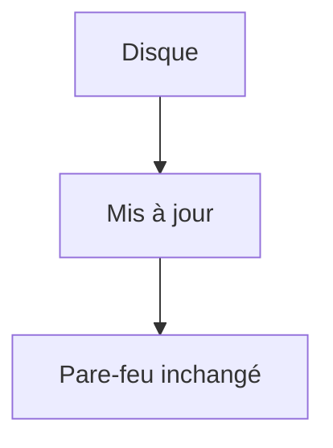

### Deux mondes parallèles

Visualisons cette architecture.

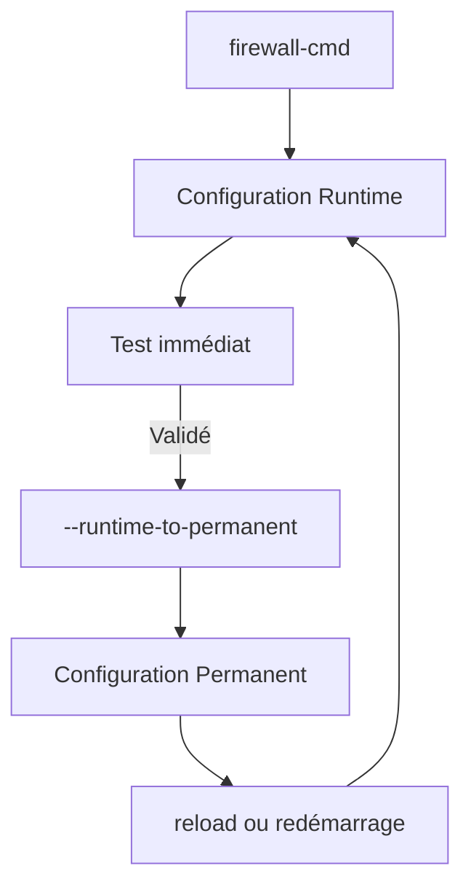

Les deux espaces sont synchronisés uniquement lorsque vous le décidez.

## Pourquoi cette architecture ?

Cette question est rarement posée. Pourtant, elle est essentielle. Pourquoi ne pas modifier directement la configuration active ? La réponse tient en un mot : **sécurité opérationnelle.** Imaginons un serveur Sentinel en production. Des centaines d'agents sont connectés. Vous souhaitez tester une nouvelle Rich Rule. Si chaque modification était immédiatement définitive, le moindre essai comporterait un risque important. Grâce au runtime : vous pouvez expérimenter. Puis revenir immédiatement en arrière.

Sans modifier la configuration durable.

## Une zone de test

Le runtime constitue une excellente zone d'expérimentation. Par exemple :

```bash
firewall-cmd --add-rich-rule='...'
```

Vous réalisez ensuite plusieurs vérifications.

- Sentinel fonctionne-t-il encore ?
- SSH est-il toujours accessible ?
- Les agents communiquent-ils correctement ?
- Les sauvegardes passent-elles toujours ?

Si tout est conforme : vous pourrez ensuite rendre cette modification permanente.

## Le rechargement (`reload`)

Le lien entre les deux configurations est assuré par une commande essentielle.

```bash
firewall-cmd --reload
```

Que fait-elle exactement ? Contrairement à une idée répandue, elle ne sauvegarde rien. Elle recharge. Autrement dit :

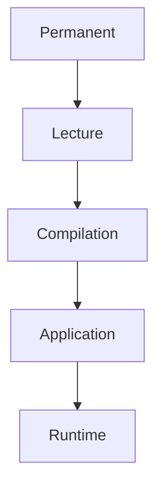

La configuration runtime est entièrement reconstruite à partir de la configuration permanente.

### Conséquence importante

Prenons un exemple. Vous ajoutez :

```bash
firewall-cmd --add-service=https
```

Puis :

```bash
firewall-cmd --reload
```

Que se passe-t-il ? La règle disparaît. Pourquoi ? Parce qu'elle n'existait que dans le runtime. Le rechargement remplace complètement cette configuration par celle enregistrée sur disque. Ce comportement surprend énormément lors des premiers déploiements. Il est pourtant parfaitement logique.

## Le redémarrage du serveur

Lorsqu'AlmaLinux redémarre : Firewalld redémarre également. Que charge-t-il ? Toujours : `Configuration Permanent` La configuration runtime précédente disparaît totalement. Elle n'existe plus. C'est pourquoi toute modification non persistante est perdue.

## Visualisation

Supposons la situation suivante. Configuration permanente :

```text
HTTPS

SSH
```

Configuration runtime :

```text
HTTPS

SSH

Sentinel 8443
```

Après un redémarrage :

```text
HTTPS

SSH
```

Le port 8443 disparaît. Sentinel devient inaccessible. L'application fonctionne pourtant parfaitement. L'erreur ne provient ni de Python, ni de TLS, ni de Systemd. Elle provient simplement du cycle de vie de Firewalld.

## Comment afficher les deux configurations ?

Configuration active :

```bash
firewall-cmd --list-all
```

Configuration permanente :

```bash
firewall-cmd --permanent --list-all
```

Ces deux commandes devraient devenir un réflexe. Lorsqu'un comportement paraît incohérent, la première question est toujours :

> Les deux configurations sont-elles identiques ?

## Runtime ou Permanent ?

Prenons quelques situations concrètes.

### Cas n°1 : diagnostic

Vous souhaitez tester rapidement une hypothèse. Exemple :

```
Autoriser temporairement

8443/TCP
```

Le runtime est idéal. Aucun impact durable.

### Cas n°2 : déploiement

Vous préparez la mise en production d'un nouveau service. La modification doit survivre aux redémarrages. La configuration permanente est indispensable.

### Cas n°3 : maintenance

Vous intervenez pendant une fenêtre de maintenance. Vous souhaitez vérifier plusieurs hypothèses avant de valider définitivement les changements. Une approche très courante consiste à :

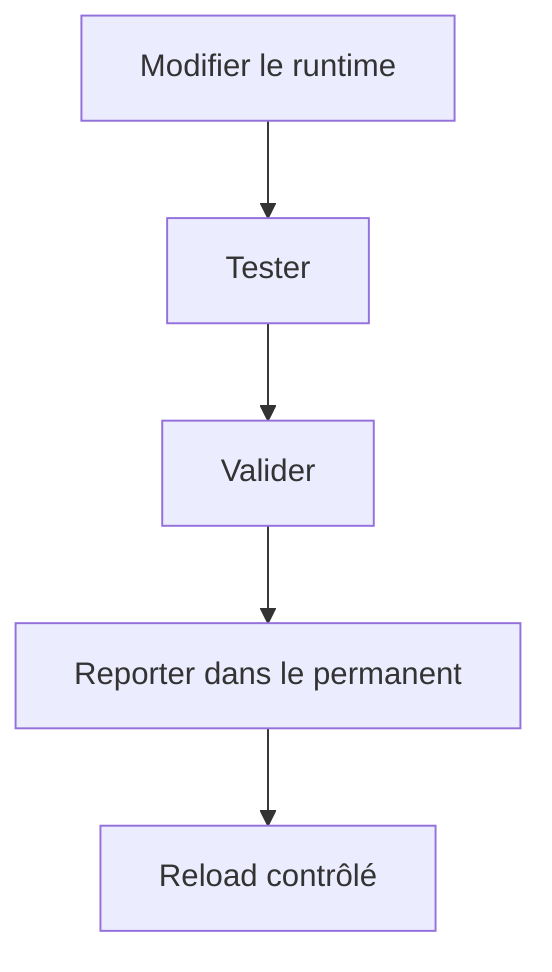

Cette méthode limite fortement les risques.

## Les erreurs les plus fréquentes

Erreur n°1.

```bash
firewall-cmd --add-service=https
```

Puis oubli. Le serveur redémarre. La règle disparaît. Erreur n°2.

```bash
firewall-cmd

--permanent

--add-service=https
```

Puis oubli du :

```bash
firewall-cmd --reload
```

La règle existe. Mais elle n'est jamais appliquée. Erreur n°3. Modifier simultanément :

- runtime ;
- permanent.

Puis oublier quelles différences existent entre les deux. Quelques semaines plus tard, plus personne ne comprend pourquoi la production fonctionne. Cette situation est malheureusement très fréquente.

## La synchronisation

Dans une exploitation rigoureuse, une règle simple est souvent appliquée. À la fin d'une intervention :

```text
Runtime

=

Permanent
```

Les deux configurations doivent être identiques. Sinon : la prochaine opération de maintenance risque de produire un comportement inattendu. Cette discipline est particulièrement importante lorsque plusieurs administrateurs interviennent sur les mêmes serveurs.

## Que se passe-t-il réellement lors d'un `reload` ?

La commande :

```bash
firewall-cmd --reload
```

semble extrêmement simple. Pourtant, plusieurs opérations sont réalisées en quelques millisecondes. Schématiquement :

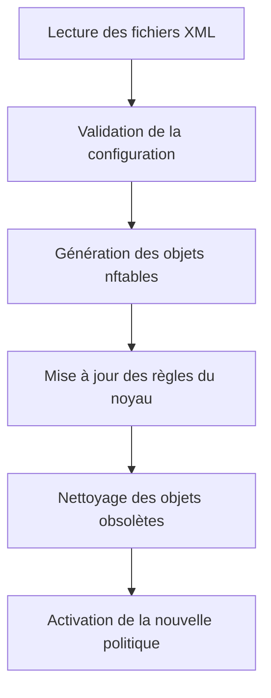

Il ne s'agit donc pas simplement de "relire un fichier". Firewalld reconstruit une grande partie de sa représentation interne avant de l'appliquer au noyau.

## Reload ou redémarrage du service ?

Ces deux opérations sont souvent confondues. Pourtant, elles poursuivent des objectifs différents.

### `firewall-cmd --reload`

Recharge uniquement la configuration.

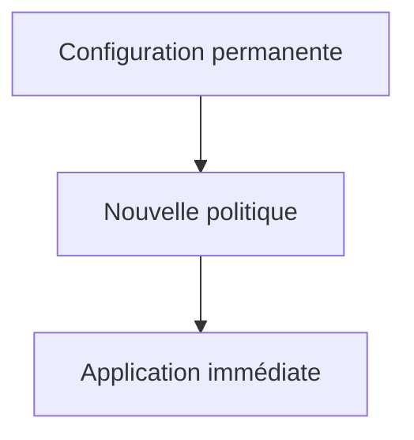

Le service Firewalld continue de fonctionner.

### `systemctl restart firewalld`

Cette commande redémarre le démon Firewalld.

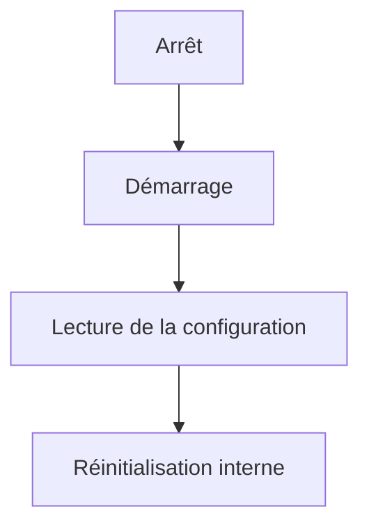

Dans la majorité des cas, un simple `reload` est préférable. Il est moins intrusif et correspond exactement au besoin : appliquer une nouvelle politique. Le redémarrage complet est réservé à des situations plus particulières, par exemple après une mise à jour du logiciel lui-même.

## Conntrack et le `reload`

Voici un point que beaucoup d'administrateurs découvrent tardivement. Ils imaginent le scénario suivant.

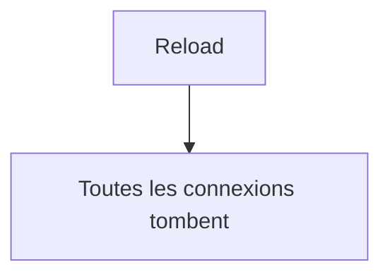

Heureusement, ce n'est généralement pas ce qui se produit. Pourquoi ? Parce que les connexions déjà établies sont suivies par **Conntrack**. Reprenons un exemple. Un administrateur est connecté en SSH.

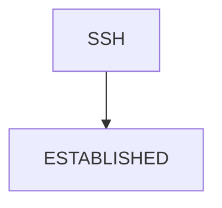

Vous exécutez :

```bash
firewall-cmd --reload
```

Dans la plupart des cas, la session SSH reste ouverte. Pourquoi ? Parce que :

- la connexion existe déjà ;
- Conntrack la connaît ;
- les paquets appartiennent à un flux `ESTABLISHED`.

Le noyau continue donc à les traiter normalement.

### Ce qui change réellement

Le `reload` influence principalement les **nouvelles connexions**. Imaginons une nouvelle Rich Rule. Avant le rechargement :

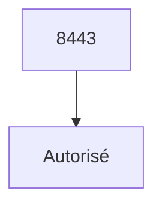

Après le rechargement :

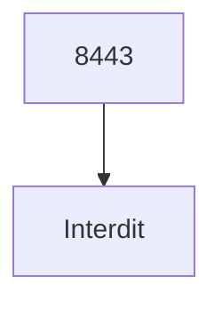

Que se passe-t-il ? Les nouvelles connexions sont refusées. En revanche : les connexions déjà établies peuvent continuer jusqu'à leur fermeture naturelle. C'est un point fondamental pour comprendre le comportement de Firewalld en production.

## Attention : Conntrack n'est pas une garantie absolue

Il est tentant d'en conclure :

> « Un `reload` est toujours transparent. »

Ce serait une simplification excessive. Le comportement dépend notamment :

- de la nature des règles modifiées ;
- des protocoles utilisés ;
- des mécanismes NAT ;
- des éventuelles modifications d'interfaces ;
- des changements de zones.

Dans la plupart des scénarios courants, les connexions établies survivent. Mais il ne faut jamais transformer cette observation en règle absolue. C'est précisément pour cette raison qu'une politique de sécurité doit toujours être validée en environnement de qualification avant une mise en production.

## Pourquoi Firewalld distingue-t-il runtime et permanent ?

Cette séparation n'est pas uniquement destinée au confort de l'administrateur. Elle facilite également :

- les déploiements progressifs ;
- les tests ;
- les retours arrière ;
- les changements sous supervision.

Imaginons un déploiement Sentinel. Nouvelle politique :

```text
Autoriser uniquement

TLS mutuel.
```

L'équipe sécurité souhaite vérifier son impact. Grâce au runtime :

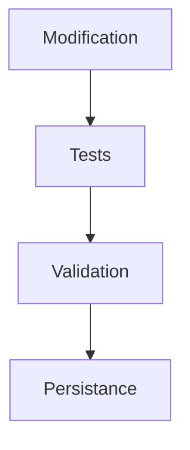

Cette démarche réduit fortement le risque opérationnel.

## Les modifications manuelles en production

Une bonne pratique mérite d'être soulignée. Pendant un incident de production, la tentation est grande de taper rapidement :

```bash
firewall-cmd --add-port=8443/tcp
```

Le service repart. L'incident semble résolu. Quelques semaines plus tard : redémarrage planifié. Le problème réapparaît. Pourquoi ? Parce que cette modification n'a jamais été intégrée dans la configuration permanente… ni dans les playbooks Ansible. L'infrastructure dérive progressivement. Cette dérive porte un nom bien connu des équipes d'exploitation : **configuration drift**.

## Le "Configuration Drift"

Le *Configuration Drift* désigne la situation où l'état réel d'un serveur s'éloigne progressivement de l'état attendu. Prenons un exemple. La documentation indique :

```text
SSH

HTTPS

Sentinel
```

Le playbook Ansible déploie exactement cette politique. Mais, au fil des incidents, plusieurs administrateurs ajoutent manuellement :

```text
8443

9000

9443
```

uniquement dans le runtime. Le serveur fonctionne. La documentation reste inchangée. Le playbook aussi. Puis un jour :

```bash
firewall-cmd --reload
```

ou `Redémarrage` Toutes ces modifications disparaissent. L'incident réapparaît. Le problème n'est plus technique. Il est organisationnel.

## Les changements doivent avoir une source de vérité

Une infrastructure industrielle repose toujours sur une source de vérité. Pour Firewalld, cette source ne devrait jamais être : `Le runtime` Elle devrait être :

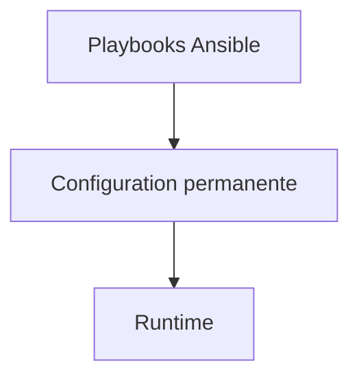

Le runtime n'est qu'une projection temporaire. Il ne doit jamais devenir le référentiel de votre politique de sécurité.

Les fenêtres de maintenance sont aussi des fenêtres d'opportunité : des règles de secours très larges sont parfois ajoutées sous pression, puis oubliées parce que le service est revenu. Toute exception d'urgence doit donc être bornée par un `--timeout` lorsque c'est possible, enregistrée dans le ticket d'incident et soit retirée, soit traduite dans la source de vérité avant la clôture.

## Une stratégie d'exploitation recommandée

Une procédure fréquemment utilisée en production est la suivante.

### Étape 1

Appliquer la modification dans le runtime.

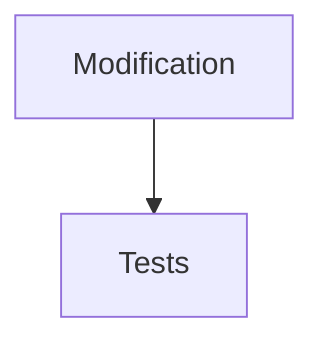

### Étape 2

Valider le fonctionnement.

- Sentinel
- SSH
- FreeIPA
- Sauvegardes
- Supervision
- Podman

### Étape 3

Reporter exactement la même modification dans la configuration permanente.

### Étape 4

Versionner la modification. Par exemple :

- dépôt Git ;
- playbook Ansible ;
- documentation d'exploitation.

### Étape 5

Effectuer un `reload` contrôlé. À ce stade :

```text
Runtime

=

Permanent
```

L'infrastructure redevient cohérente. Cette discipline paraît contraignante. Elle évite pourtant un très grand nombre d'incidents plusieurs mois plus tard.

## En entreprise

Dans une organisation mature, les modifications Firewalld suivent généralement un processus formel.

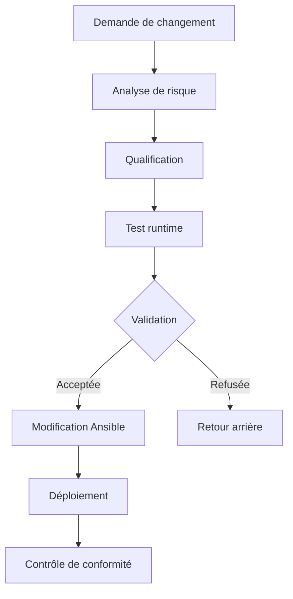

Ce processus peut sembler lourd. Il évite pourtant les incidents les plus coûteux : ceux qui apparaissent plusieurs semaines après un changement oublié.

### Exemple Sentinel

L'équipe Sentinel souhaite ouvrir un nouveau port destiné à une future API d'administration. Le responsable sécurité refuse de modifier immédiatement la configuration permanente. Une première phase est réalisée en qualification. Ensuite :

- ouverture runtime ;
- batterie de tests ;
- validation fonctionnelle ;
- validation sécurité ;
- intégration au RPM ;
- mise à jour des playbooks Ansible ;
- seulement ensuite, intégration dans la configuration permanente.

Le changement est beaucoup plus lent… …mais pratiquement sans surprise lors de la mise en production.

## Culture technique

Cette séparation entre état courant et état persistant existe dans de nombreux composants Linux. Par exemple :

| Composant | État courant | État persistant |
|-----------|--------------|-----------------|
| Firewalld | Runtime | Permanent |
| Systemd | Service démarré | Service activé |
| SELinux | Mode actuel (`setenforce`) | Fichier `/etc/selinux/config` |
| Réseau | Adresse ajoutée avec `ip` | Fichier NetworkManager |
| Noyau | `sysctl -w` | `/etc/sysctl.d/` |

Cette cohérence de conception facilite l'apprentissage. Une fois ce principe compris, il devient beaucoup plus simple d'administrer l'ensemble du système.

## Piège classique

### Utiliser `--permanent` pendant un dépannage

L'erreur paraît anodine. Un administrateur ajoute :

```bash
firewall-cmd --permanent --add-port=8443/tcp
```

Puis teste immédiatement. Rien ne fonctionne. Pourquoi ? Parce que la configuration active n'a jamais été modifiée. La règle existe… …mais uniquement sur disque. Dans une situation d'urgence, ce comportement peut conduire à des diagnostics erronés. Il faut toujours savoir dans quel espace de configuration on travaille.

### Utiliser uniquement le runtime

L'erreur inverse est encore plus fréquente. Le serveur fonctionne parfaitement. Toutes les modifications ont été réalisées dans le runtime. Quelques mois plus tard :

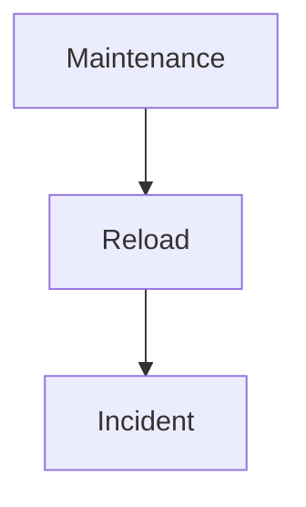

La politique disparaît. Une règle simple permet d'éviter ce scénario :

> **Aucune intervention n'est terminée tant que le runtime et le permanent ne sont pas identiques.**

## Valider, borner et revenir en arrière

Une modification runtime est idéale pour un test, à condition de prévoir sa disparition. Pour un accès temporaire, `--timeout=20m` exprime directement la durée et évite qu'une autorisation d'urgence survive par oubli ; cette option n'est pas compatible avec `--permanent`.

```bash
sudo firewall-cmd --zone=public --add-service=https --timeout=20m
```

Avant de recharger une configuration permanente, exécutez `firewall-cmd --check-config`, conservez une console de secours et exportez l'état utile. Après le rechargement, testez la connectivité existante et une **nouvelle** connexion : Conntrack peut maintenir une session déjà établie alors que les nouveaux flux échouent.

`--runtime-to-permanent` copie tout le runtime courant. Cette commande est pratique après un test maîtrisé, mais dangereuse si le runtime contient aussi des essais, des règles ajoutées par un autre opérateur ou des ouvertures temporaires. Comparez les deux états avant de les faire converger.

```bash
firewall-cmd --list-all
firewall-cmd --permanent --list-all
sudo firewall-cmd --check-config
```

Le retour arrière doit être écrit avant la modification : commande de suppression inverse, restauration des fichiers validés ou rechargement du permanent connu. « Redémarrer Firewalld » n'est pas une stratégie universelle et peut modifier les liaisons d'interfaces ou interrompre davantage de trafic qu'un simple reload.

## TP 1 — Expérimenter dans le runtime

### Objectif

Comprendre concrètement la différence entre les configurations **runtime** et **permanent**, puis mettre en place une méthode d'exploitation garantissant que les modifications de Firewalld sont reproductibles et pérennes. À la fin de ce laboratoire, vous devrez être capable de répondre immédiatement aux questions suivantes :

- Une règle est-elle uniquement active ou également persistante ?
- Pourquoi une règle a-t-elle disparu après un redémarrage ?
- Comment tester une nouvelle politique sans compromettre la production ?
- Comment intégrer définitivement une modification validée ?

### Architecture

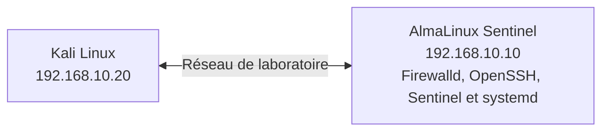

### Étape 1 — Observer l'état initial

Afficher la configuration active.

```bash
firewall-cmd --list-all
```

Puis la configuration permanente.

```bash
firewall-cmd --permanent --list-all
```

Comparer attentivement les deux sorties. À ce stade, elles devraient idéalement être identiques.

### Étape 2 — Modifier uniquement le runtime

Ajoutez temporairement le port de Sentinel.

```bash
sudo firewall-cmd --add-port=8443/tcp
```

Contrôlez immédiatement :

```bash
firewall-cmd --list-ports
```

Puis :

```bash
firewall-cmd --permanent --list-ports
```

Expliquez pourquoi les deux résultats diffèrent.

### Étape 3 — Simuler un redémarrage logique

Sans redémarrer la machine :

```bash
sudo firewall-cmd --reload
```

Contrôlez à nouveau :

```bash
firewall-cmd --list-ports
```

Le port est-il toujours présent ? Expliquez précisément pourquoi.

## TP 2 — Faire converger runtime et permanent

Ajoutez maintenant le même port :

```bash
sudo firewall-cmd \
--permanent \
--add-port=8443/tcp
```

Contrôlez immédiatement. Le port est-il utilisable ? Pourquoi ?

### Étape 5 — Synchroniser

Rechargez Firewalld.

```bash
sudo firewall-cmd --reload
```

Vérifiez :

```bash
firewall-cmd --list-ports
```

Puis :

```bash
firewall-cmd --permanent --list-ports
```

Les deux configurations sont-elles désormais identiques ?

### Étape 6 — Construire une procédure

Rédigez votre propre procédure d'exploitation répondant aux questions suivantes.

- Quand modifier le runtime ?
- Quand modifier le permanent ?
- Quand effectuer un `reload` ?
- Comment documenter une modification ?
- À quel moment intégrer cette modification dans Ansible ?

L'objectif est de construire une méthode reproductible, et non une simple suite de commandes.

## Mission d'ingénieur

### Contexte

Un incident critique survient sur la plateforme Sentinel. Plusieurs agents ne peuvent plus transmettre leurs données. L'astreinte ouvre immédiatement le port : `8443/TCP` directement dans le runtime. Le service redevient fonctionnel. L'incident est clôturé. Trois semaines plus tard, une mise à jour de sécurité impose le redémarrage des serveurs. Les agents cessent immédiatement de communiquer. Les équipes applicatives affirment que Sentinel fonctionne. Les équipes système indiquent que Firewalld est actif.

La documentation précise pourtant que le port 8443 est autorisé. Après investigation, vous découvrez :

- le playbook Ansible n'a jamais été modifié ;
- la configuration permanente ne contient pas le port 8443 ;
- seule la configuration runtime avait été corrigée pendant l'incident initial.

### Votre mission

Vous devez proposer une nouvelle procédure d'exploitation garantissant qu'une telle situation ne puisse plus se reproduire. Votre réponse devra notamment préciser :

- les étapes de validation ;
- la gestion des interventions d'urgence ;
- le rôle des playbooks Ansible ;
- la synchronisation entre runtime et permanent ;
- les contrôles à réaliser avant la clôture d'une intervention.

Votre objectif est autant organisationnel que technique.

## Impact sur Sentinel

Ce chapitre influence directement la manière dont Sentinel sera déployé dans les campagnes suivantes. À partir de maintenant :

- les modifications temporaires serviront uniquement à qualifier une nouvelle politique ;
- la configuration permanente deviendra la référence locale ;
- les playbooks Ansible constitueront la référence globale.

Le cycle de vie d'une évolution sera systématiquement le suivant :

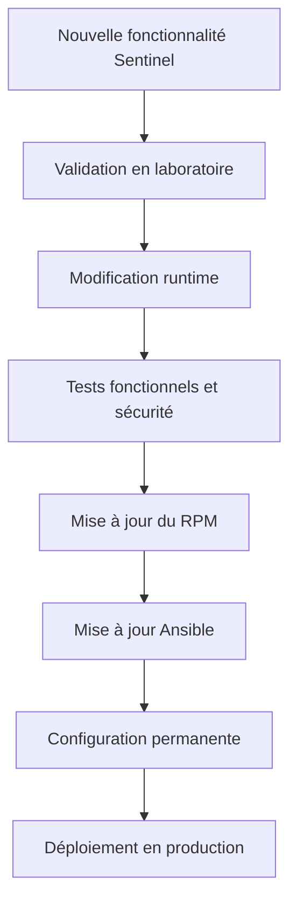

Cette méthode garantit que la sécurité de Sentinel ne dépend jamais d'une intervention manuelle oubliée plusieurs semaines auparavant.

## Synthèse

- Firewalld possède deux espaces de configuration indépendants : **runtime** et **permanent**.
- Le runtime représente l'état actuellement appliqué par le noyau.
- Le permanent représente la configuration enregistrée sur disque.
- `firewall-cmd --reload` reconstruit le runtime à partir du permanent.
- Une modification runtime disparaît après un `reload` ou un redémarrage.
- Une modification permanente n'est pas appliquée tant qu'elle n'a pas été rechargée.
- Une infrastructure fiable maintient en permanence la cohérence entre runtime, permanent, documentation et Ansible.
- Le runtime constitue un excellent environnement de validation, mais ne doit jamais devenir la source de vérité.

## Infographie de révision

```text
┌──────────────────────────────────────────────────────────────────────────────┐
│          CHAPITRE 3.9 — RUNTIME VS PERMANENT                                 │
├──────────────────────────────────────────────────────────────────────────────┤
│                                                                              │
│                  Deux états, deux objectifs                                  │
│                                                                              │
├──────────────────────────────────────────────────────────────────────────────┤
│                                                                              │
│      Runtime                     Permanent                                   │
│ ┌─────────────────┐        ┌────────────────────────┐                        │
│ │ Configuration   │        │ Configuration          │                        │
│ │ actuellement    │        │ persistante            │                        │
│ │ appliquée       │        │ (XML sur disque)       │                        │
│ └────────┬────────┘        └──────────┬─────────────┘                        │
│          ▲                            │                                      │
│          │                            │                                      │
│          └──────── firewall-cmd --reload ───────────────┐                    │
│                                                         │                    │
├─────────────────────────────────────────────────────────┼────────────────────┤
│                                                         │                    │
│ Modification runtime                                    │                    │
│ ✓ Immédiate                                             │                    │
│ ✓ Idéale pour tester                                    │                    │
│ ✗ Disparaît après reload/redémarrage                    │                    │
│                                                                              │
│ Modification permanent                                                     │
│ ✓ Persistante                                                                │
│ ✓ Reproductible                                                              │
│ ✗ Nécessite un reload pour être appliquée                                    │
│                                                                              │
├──────────────────────────────────────────────────────────────────────────────┤
│                                                                              │
│ Bonnes pratiques                                                             │
│                                                                              │
│ ✓ Tester dans le runtime                                                     │
│ ✓ Valider les flux                                                           │
│ ✓ Reporter dans le permanent                                                 │
│ ✓ Mettre à jour Ansible                                                      │
│ ✓ Vérifier que Runtime = Permanent                                           │
│                                                                              │
├──────────────────────────────────────────────────────────────────────────────┤
│                                                                              │
│ Réflexe d'ingénieur                                                          │
│                                                                              │
│ « Une règle n'existe réellement que lorsqu'elle est                          │
│  reproductible, documentée et persistante. »                                 │
│                                                                              │
└──────────────────────────────────────────────────────────────────────────────┘
```

## Pour aller plus loin

Les chapitres précédents ont présenté les différents mécanismes de Firewalld de manière progressive :

- les zones ;
- les services ;
- les Rich Rules ;
- Conntrack ;
- les IP Sets ;
- la journalisation ;
- le cycle de vie des configurations.

Il est maintenant temps de prendre de la hauteur. Dans le dernier chapitre de cette campagne, nous ne découvrirons pas une nouvelle fonctionnalité. Nous apprendrons **à concevoir une architecture Firewalld complète**, cohérente, maintenable et industrialisable, intégrant l'ensemble des briques étudiées jusqu'à présent ainsi que leurs interactions avec SELinux, FreeIPA, Systemd, Podman, Ansible et l'application Sentinel.

← [3.8 — Les IP Sets Firewalld](3.8-ip-sets-firewalld.md) · [3.10 — Concevoir la politique réseau de Sentinel](3.10-politique-reseau-sentinel.md) →
