# Chapitre 4.1 — Architecture d'OpenSSH

> **Campagne 4 — SSH et accès distant**

> *« SSH est souvent la première porte d'entrée d'un serveur. Sa sécurité conditionne celle de toute l'infrastructure. »*

> *« Pour sécuriser SSH, il faut d'abord comprendre ce qui se passe entre le moment où l'on tape `ssh serveur` et celui où l'on obtient un shell. »*

## Vous êtes ici

```text
Partie I — Construire un socle sécurisé

Campagne 4 — SSH et accès distant

    ► 4.1 Architecture d'OpenSSH
      4.2 Authentification par mot de passe
      4.3 Authentification par clés
      4.4 Durcissement de sshd_config
      4.5 Bastion d'administration
      4.6 Journalisation et audit SSH
      4.7 Protection contre les attaques
      4.8 Mission : administration sécurisée de Sentinel
```

## Objectifs pédagogiques

À la fin de ce chapitre, vous serez capable de :

- comprendre l'architecture complète d'OpenSSH ;
- distinguer le client SSH du serveur SSH ;
- comprendre le déroulement d'une connexion SSH ;
- identifier les composants impliqués dans une authentification ;
- comprendre où interviennent le chiffrement, l'authentification et l'autorisation.

## Pourquoi ce chapitre existe

SSH est probablement le service le plus critique d'un serveur Linux. Pourquoi ? Parce qu'il permet d'obtenir un accès distant complet. Lorsqu'un administrateur se connecte en SSH, il possède généralement la capacité de :

- administrer le système ;
- modifier les fichiers ;
- installer des logiciels ;
- redémarrer des services ;
- gérer les utilisateurs ;
- consulter les journaux.

Autrement dit, **une compromission de SSH peut rapidement devenir une compromission du serveur tout entier.** Pourtant, beaucoup d'administrateurs connaissent uniquement cette commande.

```bash
ssh serveur
```

Ils savent l'utiliser. Mais ils ignorent complètement ce qui se passe derrière. Or, un bon durcissement ne commence jamais par des options de configuration. Il commence par la compréhension de l'architecture.

## Théorie détaillée

### SSH est un protocole

Première idée importante. SSH n'est pas un logiciel. SSH est avant tout un protocole réseau. Son nom signifie : `Secure Shell` Il définit :

- comment deux machines communiquent ;
- comment elles se reconnaissent ;
- comment elles négocient un chiffrement ;
- comment elles authentifient les utilisateurs ;
- comment elles échangent des données.

OpenSSH est simplement l'implémentation la plus répandue de ce protocole.

## Les deux côtés d'une connexion

Une connexion SSH implique toujours deux acteurs.

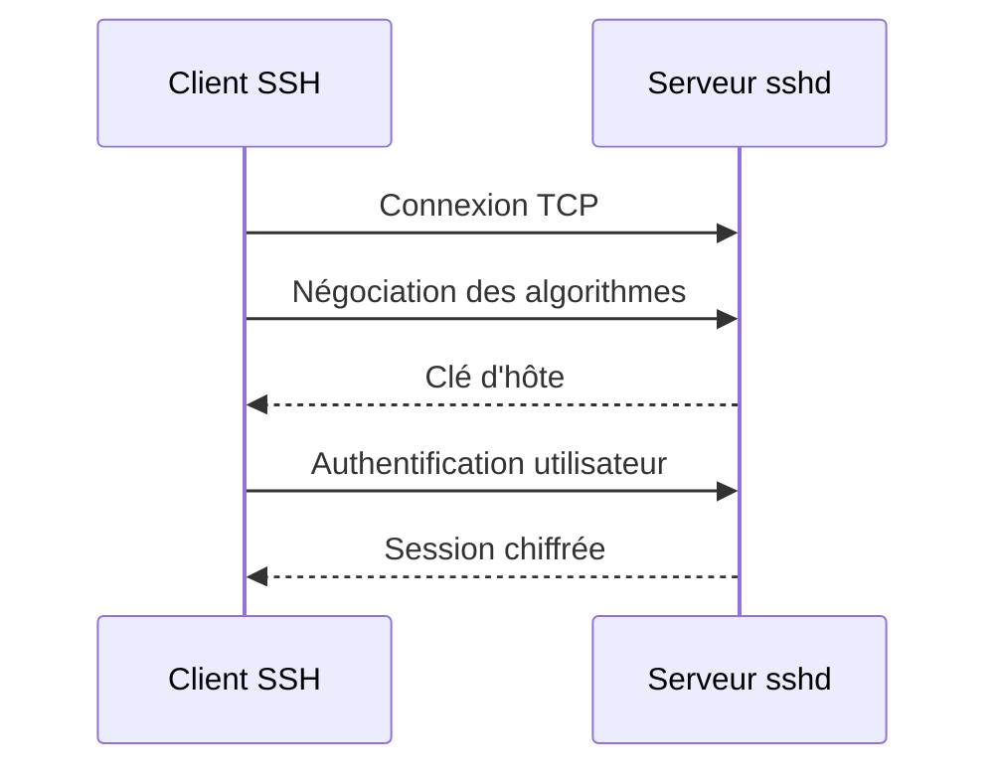

Sur votre poste de travail, vous utilisez : `ssh` C'est le client. Sur le serveur, un démon écoute en permanence. `sshd` C'est lui qui accepte les connexions. Il s'agit de deux programmes complètement différents.

## OpenSSH côté client

Le client est généralement représenté par cette commande.

```bash
ssh
```

Mais OpenSSH fournit bien plus que cela. Par exemple.

```bash
ssh
```

Connexion distante.

```bash
scp
```

Copie sécurisée.

```bash
sftp
```

Transfert de fichiers.

```bash
ssh-keygen
```

Génération de clés.

```bash
ssh-agent
```

Gestionnaire de clés.

```bash
ssh-add
```

Ajout de clés dans l'agent. Autrement dit, OpenSSH est une véritable suite d'outils, pas uniquement un client de connexion.

## OpenSSH côté serveur

Sur AlmaLinux, le serveur est assuré par : `sshd` Il s'agit d'un démon systemd. On retrouve généralement.

```bash
systemctl status sshd
```

Lorsqu'il démarre, il réalise notamment plusieurs actions.

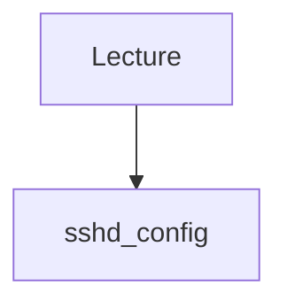

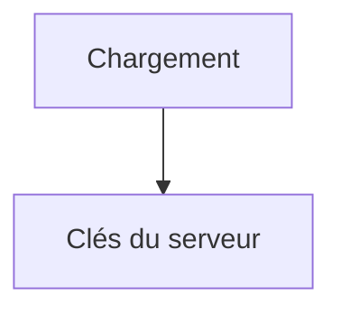

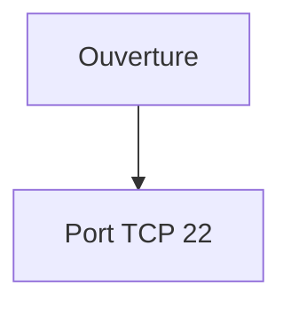

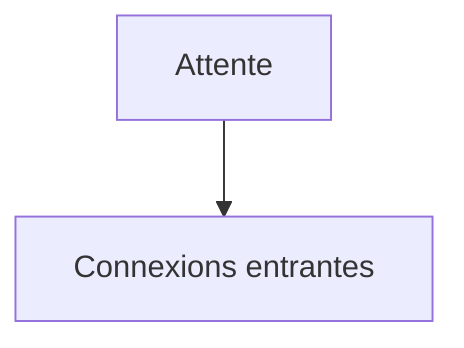

À partir de ce moment, le serveur reste passif. Il attend simplement qu'un client tente une connexion.

## Une vision globale

L'architecture peut être représentée ainsi.

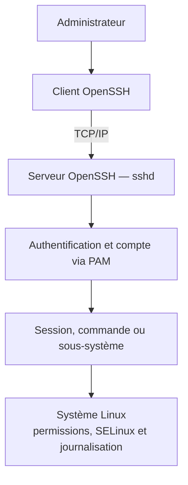

Nous retrouvons déjà plusieurs éléments étudiés dans les campagnes précédentes.

- PAM
- comptes utilisateurs
- systemd
- journalisation
- permissions UNIX

SSH s'intègre naturellement dans tout l'écosystème Linux.

## Pourquoi le démon s'appelle sshd ?

Le suffixe : `d` signifie : `daemon` Autrement dit, un service fonctionnant en arrière-plan. Comme :

```text
chronyd

httpd

firewalld

systemd-journald
```

OpenSSH suit donc la nomenclature traditionnelle des services UNIX.

## Le rôle de systemd

Depuis la campagne précédente, nous savons que presque tous les services Linux sont pilotés par systemd. SSH ne fait pas exception. Le démarrage suit la séquence suivante.

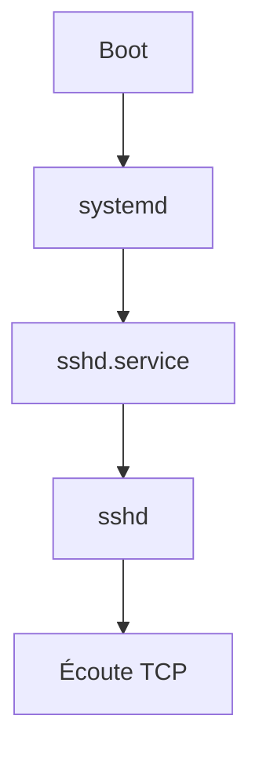

Autrement dit, ce n'est pas sshd qui démarre seul. C'est systemd qui crée et supervise le service. Nous retrouverons d'ailleurs les mécanismes de redémarrage automatique, de sandboxing et de journalisation étudiés précédemment.

## Une connexion SSH n'est pas un simple échange de mots de passe

C'est probablement la plus grande idée fausse. Beaucoup imaginent ceci.

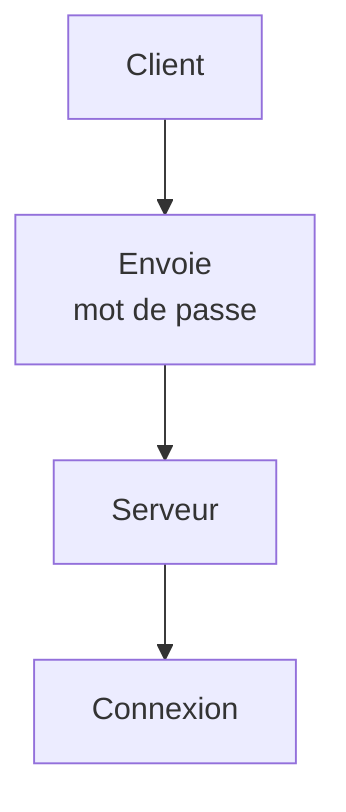

En réalité, il ne se passe absolument pas cela. Avant même que l'utilisateur ne saisisse son identité, les deux machines vont :

- négocier les algorithmes cryptographiques ;
- vérifier l'identité du serveur ;
- établir un canal chiffré ;
- créer des clés de session.

Ce n'est qu'après toutes ces étapes que l'authentification de l'utilisateur commence. Autrement dit, le mot de passe, lorsqu'il est utilisé, circule déjà dans un tunnel chiffré. C'est précisément ce qui distingue SSH des anciens protocoles comme Telnet.

## Les grandes étapes d'une connexion SSH

Lorsqu'un administrateur exécute :

```bash
ssh admin@sentinel
```

beaucoup d'opérations sont réalisées automatiquement. Visualisons la séquence complète.

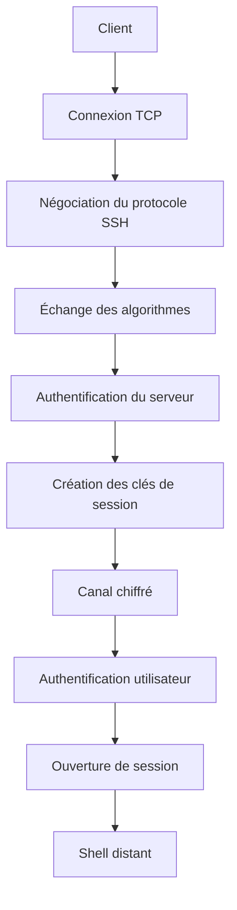

Chaque étape joue un rôle précis. Comprendre cette séquence permettra de comprendre ensuite chacune des options de `sshd_config`.

## Étape 1 — Ouverture de la connexion TCP

Avant toute chose, SSH reste une application TCP. Le client ouvre une connexion vers :

```text
Adresse IP

+

Port TCP
```

Par défaut. `22/TCP` Le noyau Linux transmet ensuite cette connexion au démon : `sshd` Nous retrouvons exactement le fonctionnement étudié dans la campagne consacrée au réseau.

## Étape 2 — Échange des versions

Avant même de parler de chiffrement, les deux machines annoncent leur version du protocole. Par exemple. `SSH-2.0-OpenSSH_9.x` Cet échange permet de vérifier que les deux parties parlent bien le même protocole. Aujourd'hui, la quasi-totalité des infrastructures utilisent : `SSH version 2` Le protocole SSHv1 est considéré comme obsolète depuis de nombreuses années.

## Étape 3 — Négociation des algorithmes

C'est une étape essentielle. Le client et le serveur proposent chacun une liste d'algorithmes qu'ils savent utiliser. Par exemple. Pour l'échange de clés.

```text
curve25519

ecdh

diffie-hellman
```

Pour le chiffrement.

```text
AES

ChaCha20

AES-GCM
```

Pour l'intégrité.

```text
SHA-2

Poly1305
```

Les deux machines choisissent ensuite le meilleur algorithme commun. Cette négociation est entièrement automatique.

## Pourquoi cette négociation existe-t-elle ?

Imaginons deux ordinateurs. Le premier est très récent. Le second est plus ancien. Ils ne possèdent pas exactement les mêmes algorithmes. Sans mécanisme de négociation, ils seraient incapables de communiquer. Grâce à cette étape, ils choisissent automatiquement une combinaison compatible. Cette souplesse explique pourquoi OpenSSH évolue depuis plus de vingt ans sans casser la compatibilité.

## Étape 4 — Authentification du serveur

Avant de transmettre la moindre information sensible, le client doit répondre à une question.

> Suis-je réellement connecté au bon serveur ?

Pour cela, le serveur présente sa clé publique. Le client la compare avec celle qu'il connaît déjà. Deux situations sont possibles.

### Premier cas

La clé est connue.

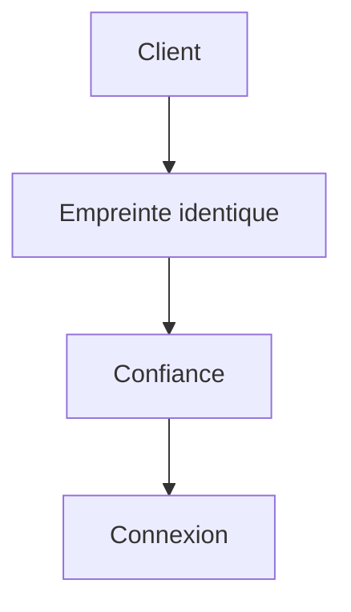

### Deuxième cas

Le serveur est inconnu. Le client affiche un message ressemblant à ceci.

```text
The authenticity of host ...

can't be established.
```

Puis.

```text
Are you sure you want

to continue connecting ?
```

C'est une étape extrêmement importante. Elle protège contre les attaques de type : `Man In The Middle` Nous détaillerons ce mécanisme plus loin dans cette campagne.

Cette protection n'est réelle que si l'empreinte initiale est vérifiée par un canal indépendant. Répondre automatiquement « yes » à la première connexion transforme le mécanisme en simple confiance au premier usage (*Trust On First Use*). À grande échelle, une entreprise peut publier les empreintes dans un inventaire fiable ou signer les clés d'hôte avec une autorité de certification OpenSSH ; le client fait alors confiance à l'autorité plutôt qu'à chaque serveur isolé.

## Étape 5 — Création des clés de session

Une fois le serveur authentifié, les deux machines calculent une clé de session. Attention. Cette clé n'est pas la clé du serveur. Elle est créée spécialement pour cette connexion. Visualisons.

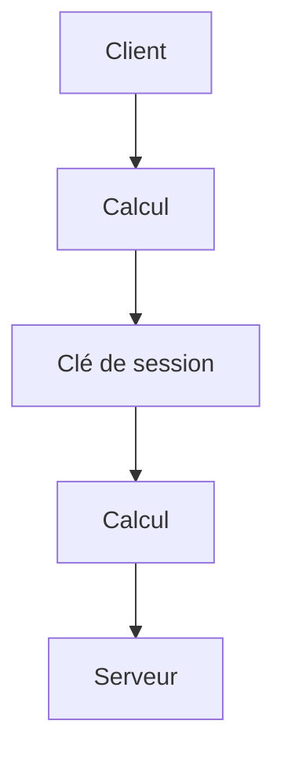

Cette clé sera utilisée pour chiffrer tous les échanges suivants. Lors de la connexion suivante, une nouvelle clé sera créée. Chaque session possède donc son propre chiffrement.

## Pourquoi ne pas utiliser directement la clé du serveur ?

C'est une excellente question. Parce que les clés du serveur doivent rester stables. Elles servent à identifier la machine. Les clés de session, elles, doivent être temporaires. Elles sont détruites lorsque la connexion se termine. Cette séparation améliore considérablement la sécurité. Même si une clé de session était compromise, les autres connexions resteraient protégées.

## Étape 6 — Canal sécurisé

Nous arrivons maintenant à une étape fondamentale. Toutes les négociations précédentes avaient un objectif unique. Créer un tunnel sécurisé. À partir de cet instant, tout circule dans un canal chiffré.

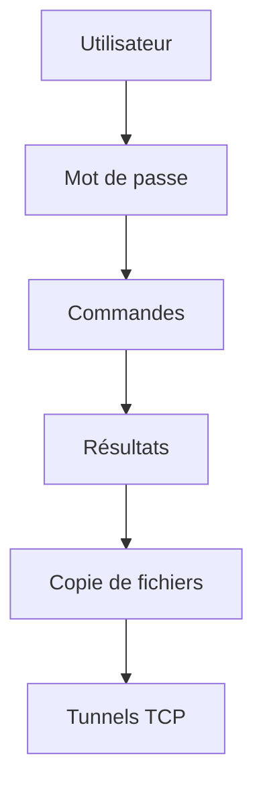

Tout est chiffré. Un observateur réseau ne peut plus lire le contenu des échanges.

## Étape 7 — Authentification utilisateur

Seulement maintenant, SSH cherche à identifier l'utilisateur. Cette authentification peut utiliser plusieurs méthodes. Par exemple. `Mot de passe` `Clé publique` `Certificat SSH` `Kerberos` `Authentification multifactorielle` Le protocole SSH est indépendant du mécanisme d'authentification. Cette souplesse explique pourquoi il est utilisé dans des environnements très variés.

## Étape 8 — Ouverture de session

Une fois l'utilisateur authentifié, sshd crée une session. Cette étape comprend notamment :

- création d'un processus enfant ;
- ouverture du terminal (PTY) ;
- chargement de l'environnement ;
- lancement du shell.

Schématiquement.

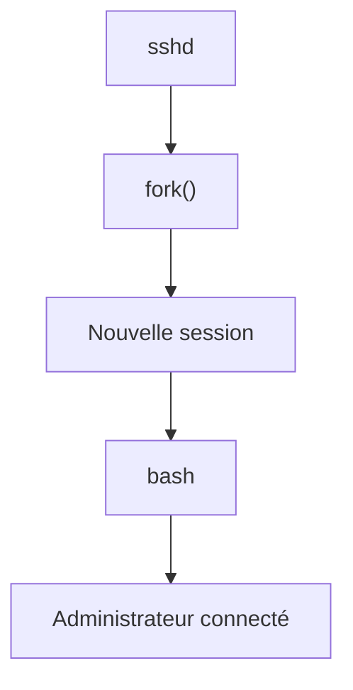

À partir de ce moment, la connexion SSH fonctionne exactement comme si l'utilisateur était assis devant la machine. La seule différence est que toutes les communications continuent de passer dans le tunnel chiffré établi précédemment. Cette architecture explique pourquoi SSH permet non seulement d'exécuter des commandes, mais également de transférer des fichiers, d'ouvrir des tunnels, de lancer des applications distantes, ou encore de rediriger des connexions TCP de manière totalement transparente.

## L'architecture interne d'OpenSSH

Jusqu'à présent, nous avons observé la connexion du point de vue du protocole. Regardons maintenant ce qui se passe à l'intérieur du serveur. Lorsqu'une connexion arrive, le démon principal : `sshd` n'exécute pas directement la session utilisateur. Pourquoi ? Parce qu'il doit continuer à écouter les nouvelles connexions. Il adopte donc une architecture très classique sous UNIX.

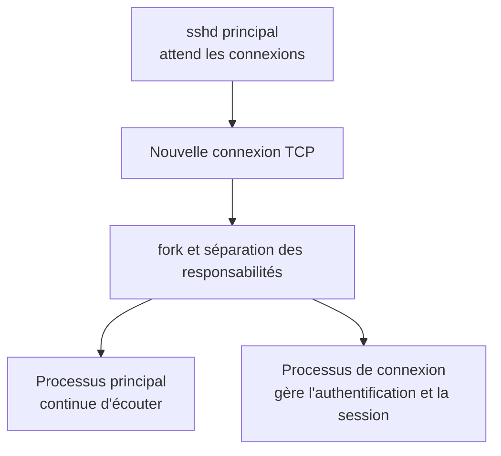

Cette architecture est utilisée depuis des décennies par de nombreux démons UNIX.

## Pourquoi utiliser un processus fils ?

Imaginons deux administrateurs. Alice se connecte. Quelques secondes plus tard, Bob se connecte. Si sshd ne créait qu'un seul processus, les deux sessions devraient partager le même contexte d'exécution. Ce serait catastrophique. Grâce au `fork()`, chaque utilisateur obtient son propre processus.

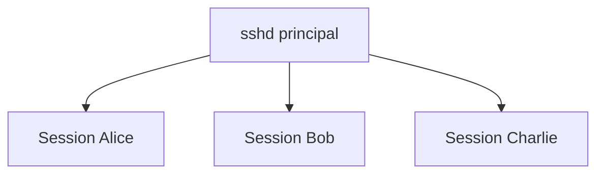

Chaque session devient totalement indépendante.

## Une session SSH est un processus Linux

Une fois connecté, votre session n'a rien de magique. Elle devient simplement un ensemble de processus Linux. Par exemple.

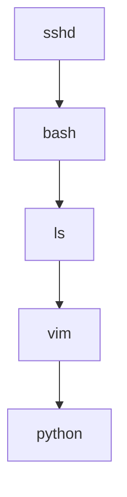

Tous ces programmes sont des processus classiques. Ils apparaissent dans :

```bash
ps -ef
```

ou

```bash
pstree
```

SSH n'est donc qu'un moyen sécurisé de créer ces processus à distance.

## Où intervient PAM ?

Nous avons étudié PAM dans la campagne précédente. SSH s'appuie directement dessus. La séquence devient alors.

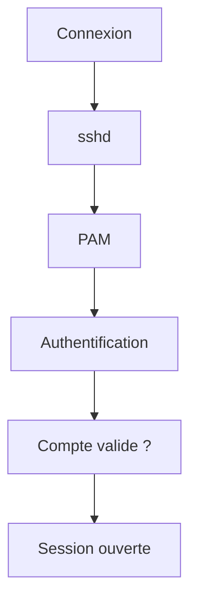

Cela signifie qu'une grande partie de la politique de sécurité étudiée auparavant s'applique automatiquement à SSH. Par exemple.

- expiration des mots de passe ;
- complexité ;
- verrouillage des comptes ;
- restrictions PAM.

Toutes ces règles sont héritées par OpenSSH.

## Le shell n'est pas obligatoire

Lorsqu'on pense à SSH, on imagine immédiatement un terminal. Pourtant, SSH peut fonctionner sans shell interactif. Par exemple.

```bash
ssh serveur uptime
```

Dans ce cas, la séquence est beaucoup plus courte.

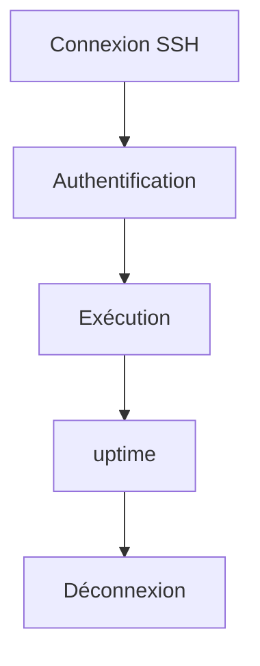

Aucun terminal interactif n'est ouvert. Cette possibilité est très utilisée par les outils d'automatisation comme Ansible.

## Les sous-systèmes SSH

OpenSSH ne transporte pas uniquement un shell. Il peut également lancer des sous-systèmes. Par exemple. `SFTP` Visualisons.

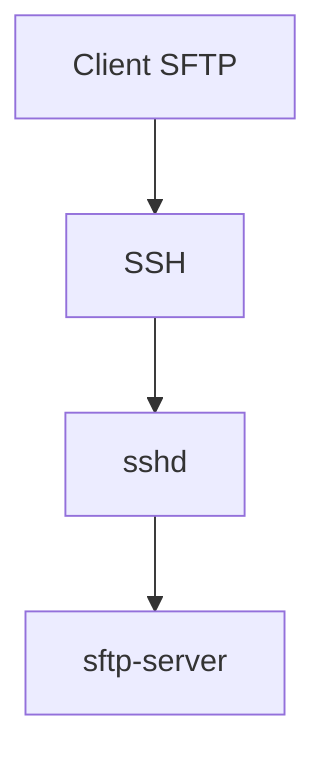

L'utilisateur n'obtient jamais de shell. Il interagit uniquement avec le serveur SFTP. Cette architecture permet d'autoriser des transferts de fichiers tout en interdisant l'accès au terminal. Nous retrouverons ce mécanisme lorsque nous parlerons des comptes techniques.

## SSH est un multiplexeur

Une fois le canal sécurisé établi, SSH peut transporter plusieurs types de données. Par exemple.

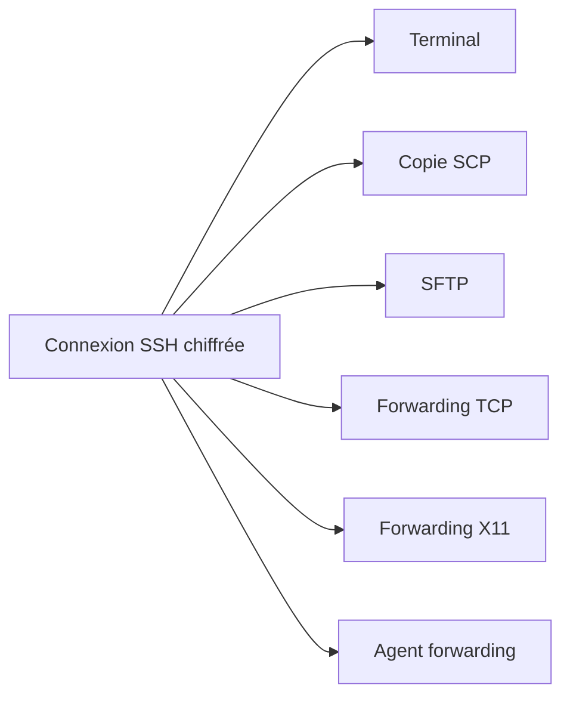

Tout passe dans le même tunnel chiffré. Autrement dit, SSH n'est pas uniquement un terminal distant. C'est un véritable protocole de transport sécurisé. Cette polyvalence explique son immense succès dans les infrastructures Linux.

Le nom d'un outil ne suffit pas à identifier le sous-protocole employé. Selon la version d'OpenSSH, la commande `scp` peut utiliser SFTP par défaut ou conserver un mode SCP historique sélectionnable. Pour un diagnostic ou une politique de sécurité, relevez la version, les options et le sous-système réellement utilisés au lieu de conclure à partir du seul nom de la commande.

## Une représentation complète

Nous pouvons désormais représenter toute l'architecture.

```mermaid
flowchart TD
    admin[Administrateur] --> client[Client SSH]
    client -->|TCP 22| parent[sshd principal]
    parent --> child[Processus de connexion]
    child --> auth[Authentification et compte PAM]
    auth --> identity[Identité Linux]
    identity --> shell[Bash ou commande]
    identity --> sftp[Sous-système SFTP]
    identity --> forwarding[Canal de forwarding autorisé]
    shell --> process[Processus utilisateur]
    sftp --> transfer[Transfert de fichiers]
    forwarding --> service[Service cible]
```

Cette vision globale servira de référence pendant toute la campagne. Nous allons désormais étudier chacune de ces briques en détail, en commençant par le mécanisme d'authentification le plus ancien : **l'authentification par mot de passe.**

## Approfondissement

### SSH est avant tout un protocole de transport sécurisé

Lorsque l'on parle de SSH, la plupart des administrateurs pensent immédiatement :

```mermaid
flowchart TD
    N0["Connexion"]
    N1["Terminal distant"]
    N0 --> N1
```

C'est historiquement vrai. Mais aujourd'hui, cette vision est beaucoup trop restrictive. En réalité, SSH est un protocole capable de transporter pratiquement n'importe quel flux. Le terminal n'est qu'une application parmi d'autres. Visualisons cela.

```mermaid
flowchart TD
    tunnel[Canal SSH] --> terminal[Terminal]
    tunnel --> files[SFTP ou SCP]
    tunnel --> forward[TCP forwarding]
    terminal --> shell[Shell]
    files --> transfer[Transfert de fichiers]
    forward --> database[Base SQL]
    forward --> web[Interface web]
    forward --> api[API REST]
```

Cette distinction est importante. Lorsqu'un ingénieur sécurise SSH, il ne sécurise pas uniquement un accès shell. Il sécurise un **canal de communication universel**.

### La session ne contourne pas les privilèges Linux

`sshd` démarre avec des privilèges élevés parce qu'il doit écouter, lire ses clés d'hôte, authentifier des comptes puis créer une session sous l'identité demandée. OpenSSH réduit ce risque grâce à la séparation de privilèges et à des processus spécialisés. Une fois la session établie sous l'utilisateur, SSH ne lui accorde toutefois aucun passe-droit sur le système. Prenons une connexion.

```bash
ssh admin@serveur
```

Une fois connecté, si vous exécutez :

```bash
id
```

Le résultat provient simplement du noyau Linux. SSH ne décide plus de rien. Il a simplement créé une session. Toutes les décisions suivantes sont prises par :

- le noyau ;
- les permissions UNIX ;
- PAM ;
- SELinux ;
- sudo.

Autrement dit, SSH n'est qu'un point d'entrée. Il ne remplace aucun des mécanismes de sécurité étudiés jusqu'à présent.

### Pourquoi OpenSSH est devenu le standard

Plusieurs implémentations du protocole SSH existent. Historiquement, on trouvait notamment :

- OpenSSH ;
- Tectia SSH ;
- Bitvise SSH Server (Windows) ;
- d'autres implémentations commerciales.

Pourtant, OpenSSH s'est imposé presque partout. Pourquoi ? Parce qu'il possède plusieurs qualités essentielles.

- Open Source ;
- extrêmement audité ;
- portable ;
- compatible avec pratiquement tous les systèmes UNIX ;
- maintenu activement depuis plus de vingt-cinq ans.

Aujourd'hui, la quasi-totalité des infrastructures Linux professionnelles utilisent OpenSSH. Maîtriser OpenSSH revient donc à maîtriser le fonctionnement réel de SSH sur la majorité des serveurs.

### Le démon SSH est volontairement minimal

Une philosophie importante d'OpenSSH consiste à réduire au maximum la surface d'attaque. Le démon principal : `sshd` réalise uniquement ce qui est nécessaire. Par exemple.

- accepter les connexions ;
- négocier le protocole ;
- authentifier ;
- créer la session.

Le véritable travail est ensuite confié :

- au shell ;
- à PAM ;
- au noyau ;
- à systemd ;
- aux sous-systèmes.

Cette séparation simplifie énormément les audits de sécurité. Plus un composant est petit, plus il est facile à vérifier.

## Concevoir la politique

Pour un architecte, SSH n'est jamais considéré comme un simple service. Il constitue le **plan de contrôle** (*Control Plane*) de l'infrastructure. Prenons notre laboratoire Sentinel.

```mermaid
flowchart TD
    N0["Internet"]
    N1["Firewalld"]
    N2["SSH (22/TCP)"]
    N3["Administrateur"]
    N4["Configuration système"]
    N5["Tous les services"]
    N0 --> N1
    N1 --> N2
    N2 --> N3
    N3 --> N4
    N4 --> N5
```

Autrement dit, compromettre SSH revient souvent à prendre le contrôle de toute la plateforme. C'est pourquoi un architecte accorde une attention particulière à :

- son exposition réseau ;
- ses méthodes d'authentification ;
- ses journaux ;
- sa supervision ;
- ses mises à jour.

### SSH est souvent le premier service durci

Dans une nouvelle infrastructure, l'ordre de sécurisation ressemble souvent à ceci.

```mermaid
flowchart TD
    N0["Installation"]
    N1["Mises à jour"]
    N2["SSH"]
    N3["Firewalld"]
    N4["SELinux"]
    N5["Applications"]
    N0 --> N1
    N1 --> N2
    N2 --> N3
    N3 --> N4
    N4 --> N5
```

Pourquoi commencer par SSH ? Parce que tant que le point d'administration n'est pas sécurisé, toutes les autres protections peuvent être contournées par une compromission distante. SSH constitue donc généralement la première brique de sécurité réellement opérationnelle.

## Point de vue offensif

Un attaquant ne voit pas SSH comme un terminal. Il le voit comme un objectif. Sa réflexion ressemble souvent à ceci.

```mermaid
flowchart TD
    N0["Le port 22 est-il ouvert ?"]
    N1["Quelle version ?"]
    N2["Quelles méthodes d'authentification ?"]
    N3["Root est-il autorisé ?"]
    N4["Mots de passe ?"]
    N5["Clés ?"]
    N6["Failles connues ?"]
    N0 --> N1
    N1 --> N2
    N2 --> N3
    N3 --> N4
    N4 --> N5
    N5 --> N6
```

Autrement dit, avant même de chercher une vulnérabilité applicative, il cherche souvent à comprendre comment l'administration distante est protégée.

### Pourquoi SSH est autant ciblé

Sur Internet, des robots analysent en permanence les adresses IP. Leur logique est très simple.

```mermaid
flowchart TD
    N0["Port 22 ouvert ?"]
    N1["Oui"]
    N2["Tentatives de connexion"]
    N3["Brute Force"]
    N4["Dictionnaires"]
    N5["Credential Stuffing"]
    N0 --> N1
    N1 --> N2
    N2 --> N3
    N3 --> N4
    N4 --> N5
```

Des milliers de tentatives peuvent être observées chaque jour sur un simple serveur exposé. Cette réalité explique pourquoi nous consacrerons plusieurs chapitres :

- au durcissement ;
- aux clés publiques ;
- à Fail2ban ;
- à l'audit ;
- aux bastions d'administration.

SSH est l'un des services les plus attaqués au monde. Le considérer comme un simple terminal serait une erreur majeure.

## En entreprise

Dans une entreprise, SSH est rarement ouvert à tous les utilisateurs. Il est considéré comme un **point d'administration privilégié**. Une architecture professionnelle ressemble souvent à ceci.

```mermaid
flowchart TD
    internet[Internet] --> vpn[VPN d'entreprise]
    vpn --> bastion[Bastion SSH]
    bastion --> web[Serveur web]
    bastion --> ipa[Serveur IPA]
    bastion --> sentinel[Sentinel]
```

L'administrateur ne se connecte jamais directement aux serveurs de production. Il passe par un bastion, dont nous étudierons l'architecture au chapitre 4.5. Cette approche permet :

- de centraliser les accès ;
- de journaliser toutes les connexions ;
- de limiter l'exposition réseau ;
- de simplifier les audits.

### Une connexion SSH est un événement de sécurité

Dans un environnement professionnel, une connexion SSH n'est jamais considérée comme un simple accès utilisateur. Elle constitue un événement sensible. Elle est généralement :

- journalisée ;
- horodatée ;
- corrélée avec l'identité de l'administrateur ;
- parfois enregistrée intégralement.

Certaines entreprises vont jusqu'à conserver :

- les commandes exécutées ;
- les transferts SCP/SFTP ;
- les ouvertures de tunnels ;
- les changements de privilèges (`sudo`).

L'objectif est simple : **être capable de reconstruire précisément toute action d'administration.**

### SSH et l'automatisation

Aujourd'hui, la majorité des connexions SSH ne proviennent plus d'humains. Elles proviennent d'outils comme :

- Ansible ;
- GitLab Runner ;
- Jenkins ;
- Terraform ;
- scripts d'administration.

Pour ces outils, SSH devient une API d'administration sécurisée. Par exemple.

```mermaid
flowchart TD
    N0["Ansible"]
    N1["SSH"]
    N2["Commande distante"]
    N3["Résultat"]
    N4["Connexion fermée"]
    N0 --> N1
    N1 --> N2
    N2 --> N3
    N3 --> N4
```

Des milliers de connexions SSH peuvent ainsi être ouvertes chaque jour sans qu'aucun administrateur ne tape une seule commande. C'est pourquoi la stabilité, la rapidité et la sécurité d'OpenSSH sont devenues essentielles dans les infrastructures modernes.

## Culture technique

### Pourquoi le port 22 ?

Le choix du port : `22/TCP` n'a rien de technique. Il s'agit simplement du numéro attribué historiquement par l'IANA au protocole SSH. Le protocole fonctionnerait exactement de la même manière sur :

```text
2222

2022

22022
```

ou n'importe quel autre port TCP. Changer de port ne renforce donc pas le chiffrement. Il modifie uniquement le point d'écoute. Nous reviendrons sur ce sujet lors du durcissement de `sshd_config`.

### Pourquoi OpenSSH remplace-t-il Telnet ?

Avant SSH, les administrateurs utilisaient principalement : `Telnet` Le fonctionnement était très simple.

```mermaid
flowchart TD
    N0["Client"]
    N1["TCP"]
    N2["Serveur"]
    N3["Mot de passe"]
    N4["Shell"]
    N0 --> N1
    N1 --> N2
    N2 --> N3
    N3 --> N4
```

Le problème était dramatique. Tout circulait en clair. Un simple analyseur réseau suffisait à récupérer :

- le mot de passe ;
- toutes les commandes ;
- toutes les réponses.

SSH a complètement changé ce modèle. Aujourd'hui, même si un attaquant capture tous les paquets réseau, il ne voit qu'un flux chiffré. Cette évolution a profondément transformé l'administration des systèmes UNIX.

### Pourquoi SSH est-il devenu indispensable ?

Au fil des années, SSH a remplacé une multitude de protocoles.

| Ancien protocole | Remplacé par |
|------------------|--------------|
| Telnet | SSH |
| rlogin | SSH |
| rsh | SSH |
| rcp | SCP / SFTP |
| FTP (administration) | SFTP |

OpenSSH est progressivement devenu le standard universel d'administration des systèmes UNIX. Aujourd'hui, il est difficile d'imaginer une infrastructure Linux sans SSH.

## Piège classique

### Confondre SSH et OpenSSH

Beaucoup utilisent les deux termes comme des synonymes. Ils ne le sont pas.

```mermaid
flowchart TD
    N0["SSH"]
    N1["Protocole"]
    N0 --> N1
```

```mermaid
flowchart TD
    N0["OpenSSH"]
    N1["Implémentation"]
    N0 --> N1
```

Cette distinction est importante. Lorsqu'on lit la documentation officielle, certaines recommandations concernent le protocole, d'autres uniquement OpenSSH.

### Croire que le chiffrement commence après l'authentification

Cette erreur est extrêmement fréquente. Beaucoup imaginent encore :

```mermaid
flowchart TD
    N0["Mot de passe"]
    N1["Création du tunnel"]
    N2["Session"]
    N0 --> N1
    N1 --> N2
```

C'est faux. L'ordre réel est :

```mermaid
flowchart TD
    N0["Négociation"]
    N1["Authentification du serveur"]
    N2["Création du tunnel"]
    N3["Authentification utilisateur"]
    N0 --> N1
    N1 --> N2
    N2 --> N3
```

Le mot de passe, lorsqu'il existe, circule donc déjà dans un canal chiffré. Cette propriété explique pourquoi SSH reste sûr, même lorsqu'il utilise encore une authentification par mot de passe. Le véritable problème du mot de passe n'est pas son transport, mais sa robustesse et sa résistance aux attaques par force brute.

## TP 1 — Observer le service et ses processus

### Objectif

Observer l'architecture réelle d'OpenSSH sur un serveur AlmaLinux.

### Étape 1 — Vérifier le service

Afficher l'état du démon.

```bash
systemctl status sshd
```

Identifier :

- le PID ;
- l'état du service ;
- le fichier d'unité systemd utilisé.

### Étape 2 — Observer les processus

Lister les processus SSH.

```bash
ps -ef | grep sshd
```

Puis ouvrir une connexion SSH depuis une seconde machine. Observer l'apparition d'un nouveau processus fils. Identifier la différence entre :

- le démon principal ;
- le processus associé à la session.

## TP 2 — Relier le port d'écoute aux processus

### Étape 3 — Observer le port d'écoute

Afficher les sockets réseau.

```bash
ss -ltnp
```

Repérer :

- le port TCP 22 ;
- le processus associé ;
- les adresses IP d'écoute.

Faire le lien avec les chapitres consacrés au réseau.

### Étape 4 — Visualiser l'arbre des processus

Afficher l'arborescence.

```bash
pstree -p
```

Observer la relation entre :

- systemd ;
- sshd ;
- bash ;
- les commandes exécutées.

Cette représentation permettra de mieux comprendre les chapitres suivants.

## Mission d'ingénieur

Votre entreprise déploie une nouvelle plateforme Sentinel. Avant toute configuration de sécurité, vous devez produire un document expliquant précisément le fonctionnement interne d'une connexion SSH. Votre schéma devra montrer :

- le client OpenSSH ;
- le démon `sshd` ;
- le rôle de systemd ;
- le rôle de PAM ;
- la création du tunnel chiffré ;
- l'ouverture de session ;
- le lancement du shell.

L'objectif est de fournir aux futurs administrateurs une vision claire de toute la chaîne de traitement avant d'aborder les mécanismes de durcissement.

## Impact sur Sentinel

Sentinel sera administré exclusivement via SSH. Toutes les opérations sensibles passeront par cette chaîne de confiance. Comprendre son architecture est donc indispensable avant de modifier la moindre option de sécurité. Les prochains chapitres porteront précisément sur les différents mécanismes d'authentification proposés par OpenSSH. Nous commencerons par le plus ancien : l'authentification par mot de passe.

## Synthèse

- SSH est un protocole ; OpenSSH en est l'implémentation la plus répandue.
- Une connexion SSH comporte plusieurs étapes avant même l'authentification de l'utilisateur.
- Le chiffrement est établi avant l'envoi du mot de passe.
- `sshd` est supervisé par `systemd` et crée un processus dédié pour chaque session.
- OpenSSH est une suite d'outils : `ssh`, `scp`, `sftp`, `ssh-keygen`, `ssh-agent`, etc.
- SSH est aujourd'hui le principal plan d'administration des infrastructures Linux.
- Comprendre son architecture est indispensable avant d'aborder son durcissement.

## Infographie de révision

```text
┌──────────────────────────────────────────────────────────────────────────────────────────────┐
│                     CHAPITRE 4.1 — ARCHITECTURE D'OPENSSH                                    │
├──────────────────────────────────────────────────────────────────────────────────────────────┤
│                                                                                              │
│                         CONNEXION SSH COMPLÈTE                                                │
│                                                                                              │
│ Administrateur                                                                               │
│       │                                                                                      │
│       ▼                                                                                      │
│ Client OpenSSH (ssh)                                                                         │
│       │                                                                                      │
│       ▼                                                                                      │
│ Connexion TCP 22                                                                             │
│       │                                                                                      │
│       ▼                                                                                      │
│ Échange des versions SSH                                                                     │
│       │                                                                                      │
│       ▼                                                                                      │
│ Négociation des algorithmes                                                                  │
│       │                                                                                      │
│       ▼                                                                                      │
│ Authentification du serveur                                                                  │
│       │                                                                                      │
│       ▼                                                                                      │
│ Création de la clé de session                                                                │
│       │                                                                                      │
│       ▼                                                                                      │
│ Tunnel SSH chiffré                                                                           │
│       │                                                                                      │
│       ▼                                                                                      │
│ Authentification utilisateur                                                                 │
│       │                                                                                      │
│       ▼                                                                                      │
│ Session ouverte                                                                              │
│       │                                                                                      │
│       ▼                                                                                      │
│ Bash / SFTP / SCP / Tunnels TCP                                                              │
│                                                                                              │
├──────────────────────────────────────────────────────────────────────────────────────────────┤
│                           ARCHITECTURE INTERNE                                                │
│                                                                                              │
│                      systemd                                                                  │
│                         │                                                                    │
│                         ▼                                                                    │
│                    sshd.service                                                              │
│                         │                                                                    │
│                         ▼                                                                    │
│                    sshd (daemon)                                                             │
│                         │                                                                    │
│                Nouvelle connexion                                                            │
│                         │                                                                    │
│                      fork()                                                                  │
│                         │                                                                    │
│          ┌──────────────┴──────────────┐                                                     │
│          ▼                             ▼                                                     │
│  sshd principal                 sshd (session)                                               │
│ Continue d'écouter                     │                                                     │
│                                        ▼                                                     │
│                                      PAM                                                     │
│                                        │                                                     │
│                                        ▼                                                     │
│                                   Utilisateur                                                │
│                                        │                                                     │
│                      ┌─────────────────┼─────────────────┐                                   │
│                      ▼                 ▼                 ▼                                   │
│                    Bash              SFTP          Commande unique                           │
│                                                                                              │
├──────────────────────────────────────────────────────────────────────────────────────────────┤
│                         COMPOSANTS OPENSSH                                                    │
│                                                                                              │
│ ssh          → Client                                                                        │
│ sshd         → Serveur                                                                       │
│ ssh-keygen   → Génération des clés                                                           │
│ ssh-agent    → Coffre de clés                                                                │
│ ssh-add      → Ajout des clés                                                                │
│ scp          → Copie sécurisée                                                               │
│ sftp         → Transfert sécurisé                                                            │
├──────────────────────────────────────────────────────────────────────────────────────────────┤
│                            IDÉES CLÉS                                                        │
│                                                                                              │
│ ✔ SSH est un protocole                                                                       │
│ ✔ OpenSSH est son implémentation                                                             │
│ ✔ Le chiffrement précède toujours l'authentification utilisateur                             │
│ ✔ Une session SSH est simplement un ensemble de processus Linux                              │
│ ✔ PAM, systemd, SELinux et les permissions UNIX continuent de s'appliquer                    │
└──────────────────────────────────────────────────────────────────────────────────────────────┘

```

## Pour aller plus loin

Les pages de manuel `ssh(1)`, `sshd(8)` et `sshd_config(5)` détaillent les composants et les étapes observés. Le chapitre suivant suit une première méthode d'authentification dans ce canal déjà chiffré : le mot de passe et son traitement par PAM.

[4.2 — Authentification par mot de passe](4.2-authentification-mot-de-passe.md) →
