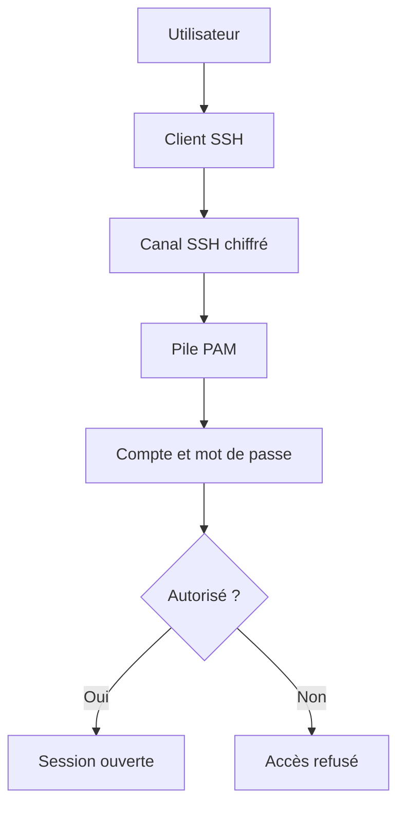

# Chapitre 4.2 — Authentification par mot de passe

> **Campagne 4 — SSH et accès distant**

> *« Pendant des décennies, le mot de passe a constitué le principal rempart protégeant les serveurs. Aujourd'hui encore, il reste omniprésent... mais il est devenu la cible privilégiée des attaquants. »*

---

## Vous êtes ici

```text
Partie I — Construire un socle sécurisé

Campagne 4 — SSH et accès distant

      4.1 Architecture d'OpenSSH
    ► 4.2 Authentification par mot de passe
      4.3 Authentification par clés
      4.4 Durcissement de sshd_config
      4.5 Bastion d'administration
      4.6 Journalisation et audit SSH
      4.7 Protection contre les attaques
      4.8 Mission : administration sécurisée de Sentinel
```

---

## Objectifs pédagogiques

À la fin de ce chapitre, vous serez capable de :

- comprendre précisément le fonctionnement de l'authentification par mot de passe dans OpenSSH ;
- suivre le chemin parcouru par un mot de passe depuis le clavier jusqu'à PAM ;
- comprendre pourquoi le mot de passe n'est jamais envoyé en clair ;
- identifier les faiblesses de cette méthode d'authentification ;
- préparer la transition vers les clés publiques.

---

## Pourquoi ce chapitre existe

Lorsque l'on évoque SSH,

la première image qui vient à l'esprit est souvent celle-ci.

```bash
ssh admin@serveur
```

Puis.

```text
admin@serveur's password:
```

Cette scène paraît banale.

Pourtant,

elle masque un mécanisme extrêmement sophistiqué.

Beaucoup d'administrateurs pensent que SSH :

- demande un mot de passe ;
- l'envoie au serveur ;
- compare le résultat ;
- ouvre la session.

En réalité,

aucune de ces étapes n'est aussi simple.

Le mot de passe :

- n'est jamais envoyé en clair ;
- n'est jamais comparé directement à celui contenu dans `/etc/shadow` ;
- n'est même pas vérifié directement par OpenSSH.

Pour comprendre cela,

nous devons suivre le chemin complet de l'authentification.

---

## Théorie détaillée

### À quel moment le mot de passe est-il demandé ?

Souvenons-nous du chapitre précédent.

Avant même de demander un mot de passe,

SSH a déjà :

- négocié les algorithmes ;
- authentifié le serveur ;
- établi un tunnel chiffré ;
- créé une clé de session.

Le déroulement est donc.

```text
Connexion TCP

↓

Tunnel chiffré

↓

Demande du nom d'utilisateur

↓

Demande du mot de passe

↓

Authentification
```

Cette chronologie est fondamentale.

Le mot de passe circule déjà dans un tunnel sécurisé.

---

## Le mot de passe n'est jamais visible sur le réseau

Imaginons un attaquant connecté sur le même réseau.

Il capture tous les paquets.

Que voit-il ?

Pas ceci.

```text
MotDePasse123
```

Mais quelque chose ressemblant plutôt à cela.

```text
8F 2A 91 64

A3 8C D2

7F 91...
```

Autrement dit,

un flux entièrement chiffré.

Même si l'attaquant capture l'intégralité de la session,

il ne peut pas retrouver directement le mot de passe.

C'est l'une des différences fondamentales avec Telnet.

---

## Qui vérifie réellement le mot de passe ?

Une autre idée reçue consiste à croire que :

```text
sshd

↓

lit

/etc/shadow

↓

compare

↓

ouvre la session
```

Ce n'est pas exactement ce qui se passe.

Sur AlmaLinux,

OpenSSH délègue cette opération à PAM.

La séquence réelle est la suivante.

```text
Utilisateur

↓

sshd

↓

PAM

↓

Modules PAM

↓

/etc/shadow

↓

Résultat

↓

sshd
```

Autrement dit,

OpenSSH ne connaît pas les règles d'authentification.

Il demande simplement à PAM :

> « Cet utilisateur est-il autorisé à ouvrir une session ? »

Cette architecture permet à SSH de bénéficier automatiquement de toutes les politiques PAM étudiées dans la campagne 2.

---

## Le rôle de PAM

Grâce à PAM,

SSH n'a pas besoin de savoir :

- comment vérifier un mot de passe ;
- si le compte est expiré ;
- si le compte est verrouillé ;
- si une authentification multifactorielle est requise ;
- si FreeIPA ou LDAP doivent être interrogés.

Toutes ces décisions sont prises par PAM.

Visualisons.



Cette séparation est l'une des grandes forces de Linux.

---

## Où est stocké le mot de passe ?

Question importante.

Le mot de passe n'est jamais stocké.

Ce qui est stocké est son **hachage**.

Dans :

```text
/etc/shadow
```

Par exemple.

```text
$y$j9T$...
```

ou

```text
$6$...
```

Ces chaînes représentent le résultat d'une fonction de hachage.

Le mot de passe d'origine n'est pas conservé.

Lorsqu'un utilisateur saisit son mot de passe,

PAM calcule un nouveau hachage,

puis compare les deux résultats.

Si les empreintes correspondent,

l'authentification est acceptée.

Nous retrouvons ici exactement les notions étudiées dans le chapitre consacré à `/etc/shadow`.

---

## Une représentation complète

L'authentification par mot de passe peut maintenant être représentée ainsi.

```text
Administrateur

        │

Tape son mot de passe

        │

        ▼

Tunnel SSH chiffré

        │

        ▼

sshd

        │

        ▼

PAM

        │

        ▼

Calcul du hachage

        │

        ▼

Comparaison avec

/etc/shadow

        │

        ▼

Succès

ou

Échec
```

Cette architecture est remarquablement modulaire.

Chaque composant possède une responsabilité précise.

## Le rôle du hachage

Une question revient très souvent.

Pourquoi ne pas stocker directement les mots de passe ?

Imaginons une base contenant ceci.

```text
tom

↓

MonMotDePasse
```

Si un attaquant vole ce fichier,

il connaît immédiatement le mot de passe.

À l'inverse,

avec un hachage.

```text
tom

↓

$y$j9T$3...
```

Il devient impossible de retrouver directement le mot de passe d'origine.

Le système ne conserve jamais le secret lui-même,

uniquement son empreinte cryptographique.

---

## Comment PAM vérifie-t-il un mot de passe ?

Prenons un exemple.

Le mot de passe réel est :

```text
Sentinel2026!
```

Lors de sa création,

PAM calcule son hachage.

```text
Sentinel2026!

↓

Fonction de hachage

↓

$y$j9T$...
```

Cette valeur est enregistrée dans :

```text
/etc/shadow
```

Plus tard,

l'utilisateur tente une connexion.

Il saisit de nouveau.

```text
Sentinel2026!
```

PAM réalise exactement le même calcul.

```text
Sentinel2026!

↓

Même fonction

↓

$y$j9T$...
```

Puis compare les deux résultats.

```text
Hachage calculé

=

Hachage enregistré ?

↓

Oui

↓

Authentification
```

Le mot de passe n'est jamais comparé directement.

---

## Pourquoi utiliser un sel (*Salt*) ?

Une autre question essentielle.

Pourquoi les hachages commencent-ils par une longue chaîne aléatoire ?

Par exemple.

```text
$y$j9T$...
```

Cette partie contient notamment un **sel** (*salt*).

Le principe est simple.

Deux utilisateurs choisissent le même mot de passe.

```text
Azerty123
```

Sans sel,

ils obtiendraient exactement le même hachage.

```text
Utilisateur A

↓

A1B2C3

Utilisateur B

↓

A1B2C3
```

Un attaquant pourrait immédiatement repérer les mots de passe identiques.

Grâce au sel,

chaque utilisateur obtient un résultat différent.

```text
Utilisateur A

↓

$y$j9T$...

Utilisateur B

↓

$y$QkP$...
```

Même mot de passe.

Deux empreintes totalement différentes.

Cette technique complique considérablement les attaques utilisant des tables pré-calculées (*Rainbow Tables*).

---

## Pourquoi les attaques par force brute existent-elles encore ?

À première vue,

on pourrait croire qu'un hachage protège totalement les mots de passe.

En réalité,

un attaquant n'essaie généralement pas de retrouver directement le mot de passe.

Il procède autrement.

```text
Essai

↓

Calcul du hachage

↓

Comparaison

↓

Essai suivant
```

Il répète cette opération des millions de fois.

C'est ce que l'on appelle une attaque par :

```text
Brute Force
```

ou

```text
Dictionnaire
```

La sécurité repose donc fortement sur :

- la longueur du mot de passe ;
- sa complexité ;
- le coût de l'algorithme de hachage ;
- les limitations imposées par le serveur.

---

## Pourquoi SSH reste vulnérable aux attaques par mot de passe

Une idée reçue consiste à croire que le chiffrement SSH protège contre les attaques.

Le chiffrement protège :

- la confidentialité ;
- l'intégrité.

Mais il ne protège pas contre les tentatives répétées d'authentification.

Prenons un serveur exposé sur Internet.

Un robot peut effectuer.

```text
Connexion

↓

Tentative

↓

Échec

↓

Déconnexion

↓

Nouvelle connexion

↓

Nouvelle tentative
```

Des milliers de fois par minute.

Le chiffrement fonctionne parfaitement.

Pourtant,

le serveur continue de recevoir des tentatives de connexion.

C'est pourquoi nous étudierons plus loin :

- Fail2ban ;
- le verrouillage des comptes ;
- les limitations PAM ;
- les listes d'autorisation ;
- les clés publiques.

---

## Pourquoi les administrateurs abandonnent progressivement les mots de passe

Le problème du mot de passe n'est pas son transport.

SSH le protège très efficacement.

Le véritable problème est humain.

Les utilisateurs choisissent souvent :

- des mots de passe trop courts ;
- des mots de passe réutilisés ;
- des mots de passe prédictibles ;
- des variantes faciles à deviner.

Par exemple.

```text
Password123

Admin2026

Bienvenue1

Azerty123
```

Ces mots de passe sont testés automatiquement par les attaquants.

La robustesse de SSH ne peut pas compenser une mauvaise hygiène de mots de passe.

C'est précisément pour cette raison que les infrastructures modernes privilégient désormais :

- les clés publiques ;
- les certificats ;
- l'authentification multifactorielle.

Nous commencerons cette transition dans le chapitre suivant.

---

## Une représentation complète

```text
Utilisateur

        │

Mot de passe

        │

        ▼

Tunnel SSH

(chiffré)

        │

        ▼

sshd

        │

        ▼

PAM

        │

        ▼

Calcul du hachage

        │

        ▼

Comparaison

avec

/etc/shadow

        │

        ▼

Authentification

        │

        ▼

Session SSH
```

Cette représentation montre clairement que le mot de passe n'est jamais transmis en clair et qu'il n'est jamais stocké sous sa forme originale.

## 💎 Le point d'expertise

### Le véritable problème n'est pas le mot de passe, mais le secret partagé

Le mot de passe appartient à une famille de mécanismes que l'on appelle :

```text
Shared Secret

(Secret partagé)
```

Le principe est extrêmement simple.

Le client connaît le secret.

Le serveur connaît également le secret.

L'authentification consiste à démontrer que les deux possèdent exactement la même information.

Visualisons.

```text
          Client

             │

     Mot de passe

             │

──────── Secret partagé ────────

             │

     Mot de passe

             │

          Serveur
```

Cette approche fonctionne.

Mais elle présente plusieurs limites.

---

### Un secret partagé finit toujours par être partagé

C'est probablement le plus grand défaut des mots de passe.

Plus une infrastructure grandit,

plus le nombre de secrets augmente.

Prenons une entreprise.

```text
Administrateur

↓

SSH

↓

Serveur A
```

---

```text
Administrateur

↓

SSH

↓

Serveur B
```

---

```text
Administrateur

↓

SSH

↓

Serveur C
```

Chaque serveur attend généralement le même secret.

En pratique,

les administrateurs réutilisent très souvent les mêmes mots de passe.

Une compromission sur une seule machine peut alors mettre en danger toute l'infrastructure.

---

### Le mot de passe devient la cible

Lorsqu'un attaquant attaque SSH,

il ne cherche généralement pas à casser le chiffrement.

Ce serait pratiquement impossible.

Il préfère attaquer le secret lui-même.

Par exemple.

```text
Brute Force
```

---

```text
Password Spraying
```

---

```text
Credential Stuffing
```

---

```text
Phishing
```

---

```text
Vol d'un gestionnaire de mots de passe
```

Toutes ces attaques ciblent le même élément.

Le mot de passe.

Le protocole SSH n'est donc pas la faiblesse.

Le facteur humain l'est beaucoup plus.

---

### Pourquoi les entreprises abandonnent progressivement les mots de passe

Dans les environnements critiques,

l'objectif est simple.

Supprimer complètement les secrets partagés.

À la place,

on utilise :

```text
Clés publiques
```

ou

```text
Certificats
```

Le serveur ne possède plus votre secret.

Il ne possède que votre **clé publique**.

Même si le serveur est compromis,

votre clé privée reste sur votre poste.

Cette différence est fondamentale.

Elle explique pourquoi les clés SSH sont aujourd'hui la méthode privilégiée dans pratiquement toutes les infrastructures Linux professionnelles.

---

## 🧠 Comment pense un architecte ?

Pour un architecte,

les mots de passe représentent un coût opérationnel.

Pourquoi ?

Parce qu'il faut :

- les créer ;
- les renouveler ;
- les oublier ;
- les réinitialiser ;
- les transmettre ;
- les protéger.

Plus une infrastructure grandit,

plus cette gestion devient complexe.

Imaginons mille serveurs.

Avec des mots de passe,

chaque administrateur doit gérer :

- des rotations ;
- des politiques PAM ;
- des expirations ;
- des demandes de réinitialisation.

Avec des clés publiques,

la gestion devient beaucoup plus simple.

On distribue une clé publique.

On conserve la clé privée.

Le secret ne quitte jamais son propriétaire.

C'est précisément cette philosophie qui sera adoptée pour Sentinel.

---

### Le mot de passe reste néanmoins indispensable

Attention.

Il serait faux de conclure que les mots de passe sont devenus inutiles.

Ils restent omniprésents.

Par exemple.

- ouverture de session locale ;
- récupération d'urgence ;
- authentification PAM ;
- sudo ;
- chiffrement de certaines clés privées.

L'objectif n'est donc pas de supprimer totalement les mots de passe,

mais de réduire leur utilisation lorsque cela est possible.

---

## ⚔️ Comment pense un attaquant ?

Lorsqu'un serveur SSH est découvert,

l'attaquant commence rarement par rechercher une vulnérabilité.

Il effectue plutôt un calcul très simple.

```text
Le serveur accepte-t-il

les mots de passe ?

↓

Oui

↓

Tentatives automatiques
```

Pourquoi ?

Parce qu'une attaque automatisée coûte extrêmement peu.

Quelques milliers de robots répartis sur Internet peuvent tester quotidiennement plusieurs millions de combinaisons.

Même si un très faible pourcentage réussit,

cela reste rentable.

Cette réalité explique pourquoi les administrateurs professionnels désactivent souvent complètement l'authentification par mot de passe sur les serveurs exposés.

---

### Une authentification réussie n'est pas toujours légitime

Autre point important.

Supposons qu'un attaquant connaisse réellement le bon mot de passe.

SSH ne peut pas faire la différence entre :

```text
Administrateur

↓

Mot de passe correct
```

et

```text
Attaquant

↓

Mot de passe correct
```

Le protocole fonctionne exactement comme prévu.

Le problème n'est plus technique.

Il est lié à la compromission du secret.

C'est une limite fondamentale de toute authentification basée sur un secret partagé.

---

## 🏢 En entreprise

Les politiques de sécurité imposent généralement plusieurs mesures lorsque les mots de passe restent autorisés.

Par exemple.

- longueur minimale ;
- complexité ;
- expiration périodique ;
- historique des anciens mots de passe ;
- verrouillage après plusieurs échecs ;
- authentification multifactorielle.

Toutes ces mesures cherchent à compenser les faiblesses intrinsèques des mots de passe.

Cependant,

la tendance actuelle est claire.

Les nouvelles infrastructures privilégient :

- les clés SSH ;
- les certificats ;
- les jetons matériels ;
- les solutions d'identité centralisée comme FreeIPA.

Les mots de passe deviennent progressivement un mécanisme de secours plutôt qu'un mécanisme principal.

## 📚 Culture technique

### Pourquoi SSH ne peut jamais retrouver votre mot de passe

Une question revient très souvent.

> Si j'oublie mon mot de passe, pourquoi Linux ne peut-il pas simplement me le redonner ?

La réponse est simple.

Parce qu'il ne le connaît pas.

Souvenons-nous.

Le système ne stocke jamais :

```text
MonSuperMotDePasse
```

Il stocke uniquement une empreinte.

Par exemple.

```text
$y$j9T$...
```

Cette empreinte est obtenue grâce à une fonction dite **à sens unique**.

```text
Mot de passe

↓

Fonction de hachage

↓

Empreinte
```

En revanche,

l'opération inverse n'existe pas.

```text
Empreinte

↓

???

↓

Mot de passe
```

Impossible.

Même l'administrateur système ne peut pas récupérer votre mot de passe.

Il peut uniquement le remplacer.

Cette propriété constitue l'un des fondements de la sécurité moderne.

---

### Pourquoi Linux utilise aujourd'hui yescrypt

Si vous ouvrez `/etc/shadow` sur une AlmaLinux récente,

vous verrez souvent des hachages commençant par :

```text
$y$
```

Cela indique l'utilisation de :

```text
yescrypt
```

Avant cela,

les distributions utilisaient principalement :

```text
$6$
```

correspondant à SHA-512.

Pourquoi ce changement ?

Parce que les processeurs,

et surtout les cartes graphiques,

sont devenus extrêmement rapides.

Les anciens algorithmes pouvaient être testés des milliards de fois par seconde.

Yescrypt introduit volontairement :

- davantage de calculs ;
- davantage d'utilisation mémoire ;
- un coût plus élevé pour chaque tentative.

Résultat :

les attaques par force brute deviennent beaucoup plus coûteuses.

---

### PAM permet de changer complètement le mode d'authentification

SSH ne sait pratiquement rien de l'identité des utilisateurs.

Il délègue cette responsabilité.

Grâce à PAM,

le même démon SSH peut fonctionner avec :

```text
Mot de passe local
```

---

```text
FreeIPA
```

---

```text
LDAP
```

---

```text
Kerberos
```

---

```text
Smart Card
```

---

```text
Authentification multifactorielle
```

Sans qu'OpenSSH ait besoin d'être modifié.

C'est l'une des grandes forces de l'architecture Linux.

---

### Pourquoi les robots continuent malgré les échecs

Un serveur SSH exposé sur Internet reçoit parfois plusieurs milliers de tentatives quotidiennes.

Pourtant,

les attaquants savent qu'elles échoueront presque toujours.

Pourquoi persistent-ils ?

Parce que leur coût est extrêmement faible.

Leur logique ressemble à ceci.

```text
Scanner Internet

↓

Port 22 ouvert ?

↓

Oui

↓

Tester

admin

↓

Tester

root

↓

Tester

ubuntu

↓

Tester

ec2-user

↓

Serveur suivant
```

L'ensemble est entièrement automatisé.

Quelques machines suffisent à tester des millions de serveurs.

---

## ⚠️ Piège classique

### Désactiver les mots de passe trop tôt

Une erreur fréquente consiste à suivre un tutoriel.

On exécute.

```text
PasswordAuthentication no
```

Puis.

```text
systemctl restart sshd
```

Et...

plus personne ne peut se connecter.

Pourquoi ?

Parce qu'aucune clé publique n'avait encore été déployée.

Le serveur devient alors pratiquement inaccessible.

Une règle simple.

> **On ne désactive jamais l'authentification par mot de passe avant d'avoir vérifié qu'une authentification par clé fonctionne réellement.**

Cette vérification doit être effectuée depuis une seconde session SSH.

Ainsi,

si la nouvelle configuration est incorrecte,

la première session reste ouverte et permet de revenir en arrière.

---

### Confondre chiffrement et authentification

Autre erreur classique.

Certains administrateurs pensent :

> « SSH est chiffré, donc je peux utiliser n'importe quel mot de passe. »

Le chiffrement protège le transport.

Il ne protège pas contre :

- un mot de passe faible ;
- un mot de passe réutilisé ;
- un mot de passe volé ;
- un mot de passe divulgué.

Ces deux notions sont indépendantes.

---

## Laboratoire AlmaLinux / Kali

### Objectif

Observer le fonctionnement réel de l'authentification par mot de passe dans OpenSSH.

---

### Étape 1 — Vérifier la configuration actuelle

Afficher les options liées à l'authentification.

```bash
grep -Ei "PasswordAuthentication|PermitRootLogin|UsePAM" \
/etc/ssh/sshd_config
```

Comparer les résultats avec la documentation officielle.

---

### Étape 2 — Observer les journaux

Depuis une autre machine,

effectuer :

- une connexion réussie ;
- une connexion avec un mauvais mot de passe.

Puis afficher.

```bash
journalctl -u sshd
```

Identifier :

- la tentative ;
- l'utilisateur ;
- l'adresse IP ;
- le résultat.

---

### Étape 3 — Vérifier PAM

Afficher les fichiers utilisés par SSH.

```bash
cat /etc/pam.d/sshd
```

Repérer les différents modules PAM.

Essayer d'identifier leur rôle.

---

### Étape 4 — Observer `/etc/shadow`

Afficher uniquement votre utilisateur.

```bash
sudo grep "^votre_utilisateur:" /etc/shadow
```

Identifier :

- l'algorithme utilisé ;
- la présence du sel ;
- les champs liés à l'expiration.

Faire le lien avec les chapitres de la campagne 2.

---

## Mission d'ingénieur

Votre entreprise vous demande de conserver temporairement l'authentification par mot de passe sur les serveurs Sentinel,

mais uniquement pendant la phase de migration vers les clés publiques.

Vous devez rédiger une politique d'exploitation répondant aux questions suivantes.

- Quelles contraintes imposer aux mots de passe ?
- Quels mécanismes PAM utiliser ?
- Quels journaux surveiller ?
- Comment détecter une attaque par force brute ?
- À quel moment pourra-t-on désactiver définitivement `PasswordAuthentication` ?

Cette politique devra permettre une transition progressive sans interrompre l'administration des serveurs.

---

## Impact sur Sentinel

Au début du projet,

Sentinel sera probablement administré grâce à des mots de passe.

Cette méthode reste simple,

universelle

et facile à déployer.

Cependant,

au fur et à mesure de l'industrialisation de la plateforme,

nous abandonnerons progressivement cette méthode au profit de l'authentification par **clés publiques**.

Cette évolution réduira considérablement les risques liés :

- aux attaques par dictionnaire ;
- aux fuites de secrets ;
- aux réutilisations de mots de passe.

Le prochain chapitre expliquera précisément pourquoi les clés publiques représentent aujourd'hui la méthode de référence pour administrer des serveurs Linux.

---

## Synthèse

- Le mot de passe circule toujours dans un tunnel SSH déjà chiffré.
- OpenSSH délègue l'authentification à PAM.
- Linux ne stocke jamais le mot de passe mais uniquement son hachage.
- Les attaques ciblent principalement le secret partagé, pas le protocole SSH.
- Les mots de passe restent compatibles avec une infrastructure sécurisée, mais ils ne constituent plus la méthode privilégiée.
- Avant de désactiver `PasswordAuthentication`, il faut toujours valider une méthode d'authentification alternative.
- Les clés publiques permettront de supprimer le principal point faible : le secret partagé.

---
## Infographie de révision

```text
┌──────────────────────────────────────────────────────────────────────────────────────────────┐
│              CHAPITRE 4.2 — AUTHENTIFICATION PAR MOT DE PASSE                                │
├──────────────────────────────────────────────────────────────────────────────────────────────┤
│                                                                                              │
│                     DÉROULEMENT D'UNE AUTHENTIFICATION                                        │
│                                                                                              │
│ Administrateur                                                                               │
│       │                                                                                      │
│       ▼                                                                                      │
│ Saisie du mot de passe                                                                       │
│       │                                                                                      │
│       ▼                                                                                      │
│ Tunnel SSH déjà chiffré                                                                      │
│       │                                                                                      │
│       ▼                                                                                      │
│ sshd                                                                                         │
│       │                                                                                      │
│       ▼                                                                                      │
│ PAM                                                                                          │
│       │                                                                                      │
│       ▼                                                                                      │
│ Calcul du hachage                                                                            │
│       │                                                                                      │
│       ▼                                                                                      │
│ Comparaison avec /etc/shadow                                                                 │
│       │                                                                                      │
│   ┌───┴───────────────┐                                                                      │
│   ▼                   ▼                                                                      │
│ Succès             Échec                                                                     │
│   │                   │                                                                      │
│   ▼                   ▼                                                                      │
│ Shell             Refus                                                                      │
│                                                                                              │
├──────────────────────────────────────────────────────────────────────────────────────────────┤
│                    QUI FAIT QUOI ?                                                           │
│                                                                                              │
│ Client SSH                                                                                   │
│   • Établit le tunnel chiffré                                                                │
│   • Transmet les identifiants                                                                │
│                                                                                              │
│ sshd                                                                                         │
│   • Gère la connexion                                                                        │
│   • Dialogue avec PAM                                                                        │
│                                                                                              │
│ PAM                                                                                          │
│   • Vérifie l'identité                                                                       │
│   • Consulte /etc/shadow ou FreeIPA                                                          │
│                                                                                              │
│ /etc/shadow                                                                                  │
│   • Stocke uniquement le hachage                                                             │
│                                                                                              │
├──────────────────────────────────────────────────────────────────────────────────────────────┤
│                   LES MENACES                                                                │
│                                                                                              │
│ ✔ Brute Force                                                                                │
│ ✔ Password Spraying                                                                          │
│ ✔ Credential Stuffing                                                                        │
│ ✔ Réutilisation des mots de passe                                                            │
│ ✔ Phishing                                                                                   │
│                                                                                              │
│ Le chiffrement SSH protège le transport,                                                     │
│ mais pas la qualité du mot de passe.                                                         │
├──────────────────────────────────────────────────────────────────────────────────────────────┤
│                    BONNES PRATIQUES                                                          │
│                                                                                              │
│ ✔ Mots de passe longs                                                                        │
│ ✔ PAM correctement configuré                                                                 │
│ ✔ Journalisation activée                                                                     │
│ ✔ Limitation des tentatives                                                                  │
│ ✔ Préparer la migration vers les clés SSH                                                    │
│ ✘ Ne jamais désactiver PasswordAuthentication avant d'avoir testé les clés                   │
├──────────────────────────────────────────────────────────────────────────────────────────────┤
│                              IDÉE CLÉ                                                        │
│                                                                                              │
│ « Le point faible de l'authentification par mot de passe                                     │
│  n'est pas le protocole SSH, mais le secret partagé lui-même. »                              │
└──────────────────────────────────────────────────────────────────────────────────────────────┘

```

---

← [4.1 — Architecture d'OpenSSH](4.1-architecture-openssh.md) · [4.3 — Authentification par clés](4.3-authentification-par-cles.md) →
