# Chapitre 4.3 — Authentification par clés

> **Campagne 4 — SSH et accès distant**

> *« Le meilleur mot de passe est celui que l'on n'a jamais besoin de transmettre. L'authentification par clés SSH repose sur une idée révolutionnaire : prouver son identité sans jamais révéler son secret. »*

## Vous êtes ici

```text
Partie I — Construire un socle sécurisé

Campagne 4 — SSH et accès distant

      4.1 Architecture d'OpenSSH
      4.2 Authentification par mot de passe
    ► 4.3 Authentification par clés
      4.4 Durcissement de sshd_config
      4.5 Bastion d'administration
      4.6 Journalisation et audit SSH
      4.7 Protection contre les attaques
      4.8 Mission : administration sécurisée de Sentinel
```

## Objectifs pédagogiques

À la fin de ce chapitre, vous serez capable de :

- comprendre le principe cryptographique des clés publiques ;
- distinguer clairement clé privée et clé publique ;
- comprendre pourquoi la clé privée ne quitte jamais son propriétaire ;
- suivre le déroulement complet d'une authentification par clé SSH ;
- comprendre pourquoi cette méthode est aujourd'hui la référence pour administrer des serveurs Linux.

## Pourquoi ce chapitre existe

Dans le chapitre précédent, nous avons identifié la principale faiblesse des mots de passe. Ils reposent sur un secret partagé. Le client connaît ce secret. Le serveur le connaît également. Cette approche présente plusieurs inconvénients. Le mot de passe peut :

- être deviné ;
- être volé ;
- être réutilisé ;
- être divulgué ;
- être oublié.

Les clés publiques résolvent élégamment ce problème. Elles permettent de démontrer son identité **sans jamais transmettre le secret utilisé pour prouver cette identité.** Cette idée paraît presque magique. Pourtant, elle repose sur des principes cryptographiques aujourd'hui parfaitement maîtrisés.

## Théorie détaillée

### Une paire de clés

Contrairement aux mots de passe, nous ne manipulons plus un seul secret. Nous créons désormais deux clés.

```text
Clé privée

+

Clé publique
```

Ces deux clés sont mathématiquement liées. Mais elles ne jouent absolument pas le même rôle.

## La clé privée

La première est : `Private Key` C'est le véritable secret. Elle doit rester :

- sur votre poste ;
- protégée ;
- confidentielle.

Elle ne doit jamais être copiée sur un serveur. Jamais. Même un administrateur système ne doit normalement pas y avoir accès.

## La clé publique

La seconde est : `Public Key` Comme son nom l'indique, elle peut être diffusée. Vous pouvez :

- la copier sur un serveur ;
- la transmettre à un collègue ;
- l'envoyer par e-mail ;
- la publier.

Elle ne permet pas de retrouver la clé privée. C'est une propriété fondamentale de la cryptographie asymétrique.

## Une représentation simple

Visualisons les deux clés.

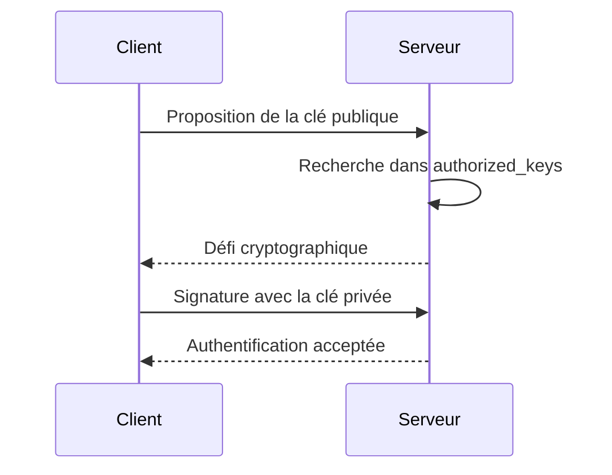

L'une ne remplace pas l'autre. Elles travaillent ensemble.

## Où sont-elles stockées ?

Sous Linux, les fichiers se trouvent généralement ici. `~/.ssh/` Par exemple. `id_ed25519` La clé privée. `id_ed25519.pub` La clé publique. Le suffixe : `.pub` désigne toujours la partie publique. L'autre fichier est le plus sensible. Il doit être protégé avec le plus grand soin.

## Générer une paire de clés

OpenSSH fournit un outil dédié.

```bash
ssh-keygen
```

Une exécution classique ressemble à ceci.

```bash
ssh-keygen -t ed25519
```

Quelques secondes plus tard, deux fichiers sont créés.

```text
id_ed25519

id_ed25519.pub
```

À partir de cet instant, vous possédez votre identité cryptographique.

## Pourquoi deux clés ?

La question est naturelle. Pourquoi ne pas utiliser une seule clé ? Parce que les rôles sont totalement différents. La clé privée permet : `Signer` La clé publique permet : `Vérifier` Cette séparation est au cœur de toute la cryptographie asymétrique. Nous allons maintenant voir comment SSH l'utilise pour authentifier un utilisateur.

## Le serveur ne reçoit jamais votre clé privée

C'est probablement l'idée la plus importante de tout ce chapitre. Lors d'une authentification, le serveur ne reçoit jamais ceci. `id_ed25519` Jamais. Même sous une forme chiffrée. Même temporairement. La clé privée reste exclusivement sur votre poste. C'est elle qui fait toute la force de ce mécanisme.

## Le serveur connaît uniquement votre clé publique

Lorsque vous préparez un serveur, vous copiez uniquement : `id_ed25519.pub` dans : `~/.ssh/authorized_keys` Le serveur connaît donc uniquement votre clé publique. Il ne possède aucun secret permettant de se faire passer pour vous. Cette différence est fondamentale. Même si le serveur est compromis, votre identité cryptographique reste protégée.

## Comment fonctionne réellement l'authentification ?

Beaucoup d'administrateurs imaginent le scénario suivant.

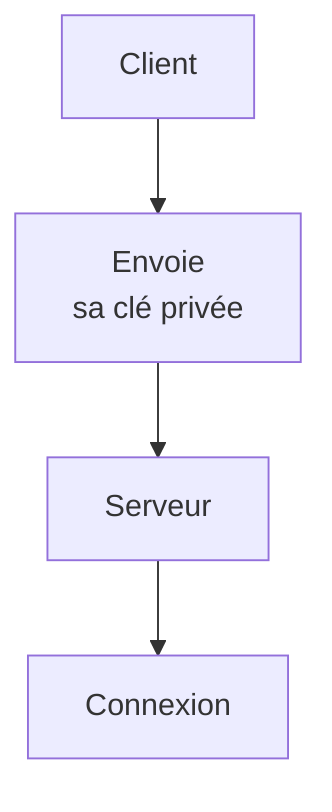

C'est totalement faux. La clé privée ne quitte jamais votre ordinateur. Le fonctionnement réel est beaucoup plus élégant.

## Le principe du défi (Challenge)

Le serveur souhaite vérifier votre identité. Pour cela, il crée une donnée aléatoire. `Challenge` ou `Nonce` Visualisons.

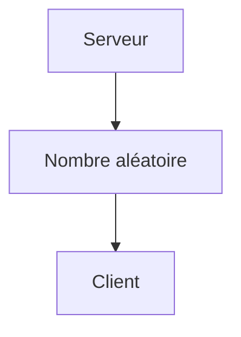

À lui seul, ce nombre ne sert à rien. Il n'est ni secret, ni sensible. Son rôle est uniquement de servir de défi cryptographique.

## La signature

Le client reçoit ce défi. Il utilise alors : `Sa clé privée` pour produire une signature.

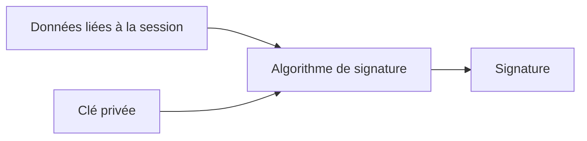

Cette signature est ensuite envoyée au serveur. Remarque importante. Le défi est envoyé. La signature est envoyée. **La clé privée ne l'est jamais.**

## La vérification

Le serveur possède déjà : `Votre clé publique.` Il peut donc vérifier la signature.

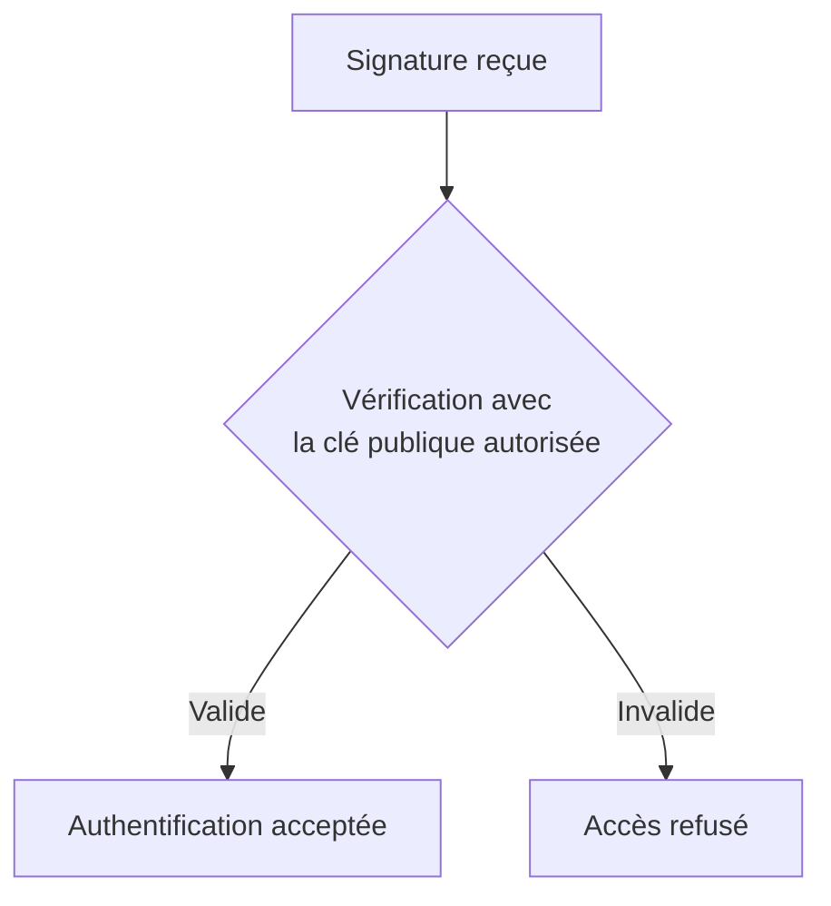

Si quelqu'un ne possède pas la bonne clé privée, il est incapable de produire une signature correcte.

## Une représentation complète

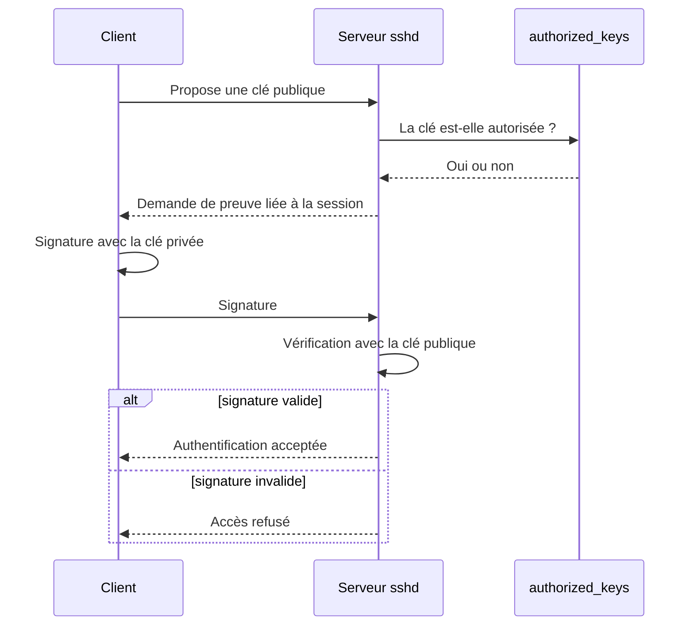

Le mot « challenge » fournit un bon modèle mental. Dans le protocole réel, la signature porte notamment sur l'identifiant de session et les données de la demande d'authentification ; elle lie donc la preuve à cette connexion au lieu de signer un simple nombre isolé.

À aucun moment, la clé privée ne quitte votre poste.

## Pourquoi est-ce beaucoup plus sûr ?

Imaginons maintenant qu'un attaquant compromette le serveur. Que peut-il voler ? Uniquement : `authorized_keys` Autrement dit, les clés publiques. Mais ces clés sont, par définition, publiques. Elles ne permettent absolument pas de se connecter. Même avec un accès complet au serveur, l'attaquant ne récupère jamais votre véritable secret. C'est un changement radical par rapport aux mots de passe.

## Le fichier `authorized_keys`

Sur le serveur, chaque utilisateur possède généralement un fichier. `~/.ssh/authorized_keys` Exemple. `/home/admin/.ssh/authorized_keys` Il contient une ou plusieurs clés publiques. Par exemple.

```text
ssh-ed25519 AAAAC3NzaC...

tom@portable
```

Chaque ligne représente une identité autorisée. Lorsqu'un client tente une connexion, OpenSSH parcourt ce fichier. Si une clé publique correspond, il lance le mécanisme de challenge que nous venons d'étudier.

## Plusieurs administrateurs

L'un des grands avantages de ce système est sa simplicité. Imaginons trois administrateurs.

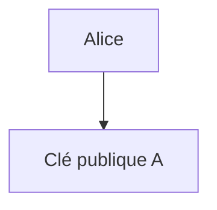

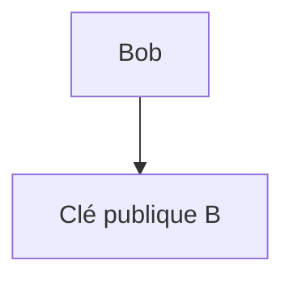

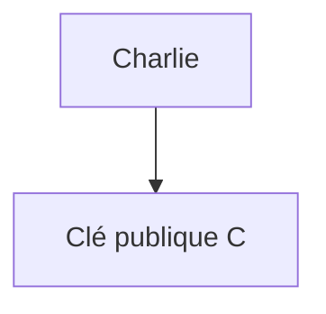

Le fichier : `authorized_keys` contient simplement les trois clés.

```text
Clé A

Clé B

Clé C
```

Chaque administrateur conserve sa propre clé privée. Il n'existe plus aucun mot de passe partagé entre eux.

## Révoquer un accès

Autre avantage considérable. Supposons que Bob quitte l'entreprise. Avec des mots de passe, il faudrait :

- changer le mot de passe ;
- prévenir tous les administrateurs ;
- redistribuer le nouveau secret.

Avec les clés publiques, il suffit de supprimer une seule ligne.

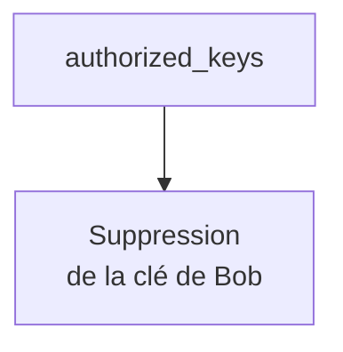

Les autres administrateurs continuent à travailler sans aucune modification. Cette facilité de révocation explique pourquoi les clés SSH sont parfaitement adaptées aux équipes d'administration.

## Une identité forte

Une clé Ed25519 correctement générée possède une entropie considérablement supérieure à celle d'un mot de passe humain. Un administrateur peut choisir : `Admin2026!` Mais il ne peut pas mémoriser une clé privée de plusieurs centaines de bits. L'identité cryptographique est donc générée automatiquement. Elle n'est plus limitée par les capacités de mémorisation humaines.

Cette différence explique pourquoi les attaques par dictionnaire deviennent totalement inefficaces contre une authentification exclusivement basée sur des clés publiques.

## Quels algorithmes de clés utiliser ?

OpenSSH supporte plusieurs types de clés. Historiquement, on trouvait principalement : `RSA` Puis sont apparus : `ECDSA` Dans un environnement OpenSSH moderne hors contrainte réglementaire particulière, `Ed25519` constitue généralement un excellent choix. La politique cryptographique du système et les besoins de compatibilité restent toutefois prioritaires. Comparons-les.

| Algorithme | Statut | Recommandation |
|------------|--------|----------------|
| DSA | Obsolète | ❌ À proscrire |
| RSA | Compatible | ✔ Encore acceptable |
| ECDSA | Moderne | ✔ Bon choix |
| Ed25519 | Moderne | ⭐ Choix courant hors mode FIPS |

Dans le laboratoire standard, nous utiliserons donc :

```bash
ssh-keygen -t ed25519
```

## Pourquoi Ed25519 ?

Ed25519 présente plusieurs avantages.

- génération très rapide ;
- signatures très rapides ;
- excellente sécurité ;
- clés plus courtes ;
- très faible risque d'erreur d'implémentation.

Ed25519 est compact, rapide et difficile à mal paramétrer. En revanche, il n'est pas utilisable dans tous les environnements soumis à une politique FIPS. Sur AlmaLinux, vérifiez `update-crypto-policies --show` et les algorithmes réellement acceptés ; une clé RSA d'au moins 2048 bits utilisant des signatures RSA-SHA2 peut alors être préférable. Le nom historique `ssh-rsa` désigne aussi un ancien schéma de signature SHA-1 qu'il ne faut pas confondre avec la famille de clés RSA moderne.

## Peut-on voler une clé privée ?

Malheureusement, oui. Mais contrairement à un mot de passe, cela nécessite généralement un accès au poste de travail de l'utilisateur. Par exemple.

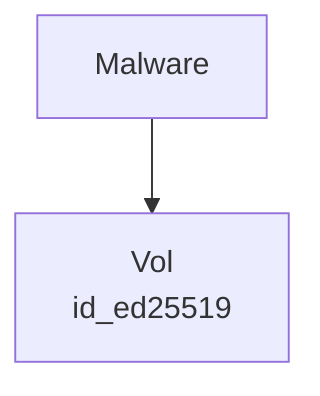

ou

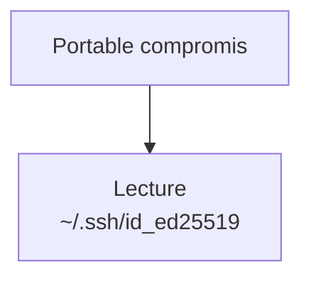

C'est précisément pour cette raison que la clé privée doit être protégée.

## La phrase de passe (Passphrase)

Une excellente pratique consiste à protéger la clé privée avec une phrase de passe. Ne pas confondre. Le mot de passe SSH protège : `Le serveur.` La phrase de passe protège : `Votre clé privée.` Visualisons.

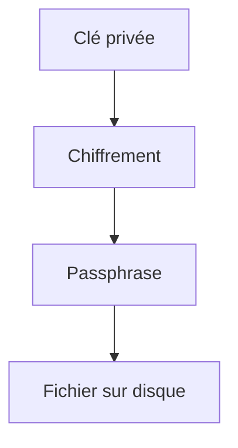

Même si quelqu'un vole le fichier, il devra également connaître la phrase de passe. Nous ajoutons donc une couche de sécurité supplémentaire.

## Le rôle de ssh-agent

Une objection apparaît immédiatement.

> Vais-je devoir saisir ma phrase de passe à chaque connexion ?

Heureusement, non. OpenSSH fournit un composant extrêmement pratique. `ssh-agent` Son rôle est simple.

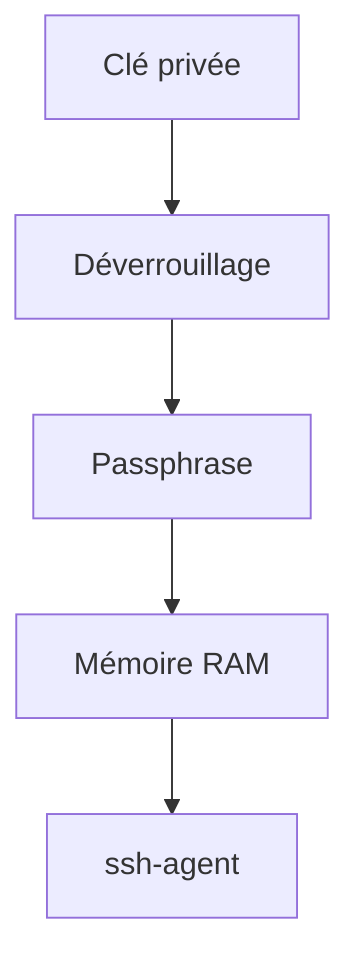

Par la suite, chaque connexion SSH demande simplement à l'agent de signer le challenge. La clé privée reste protégée, mais l'utilisateur n'a plus besoin de retaper sa phrase de passe toutes les cinq minutes.

L'agent est cependant une capacité active : tout processus pouvant accéder à son socket peut lui demander des signatures pendant que la clé est chargée. Chargez une clé pour une durée bornée avec `ssh-add -t`, utilisez la confirmation par signature avec `ssh-add -c` lorsque le flux de travail le permet, et évitez le transfert d'agent vers un serveur non maîtrisé.

## Ajouter une clé dans l'agent

Une commande suffit.

```bash
ssh-add ~/.ssh/id_ed25519
```

La première fois, la phrase de passe est demandée. Ensuite, l'agent conserve temporairement la clé en mémoire. Les connexions deviennent alors transparentes.

## Que se passe-t-il si quelqu'un vole votre clé publique ?

Elle ne permet pas d'usurper l'identité cryptographique. Souvenons-nous : la clé publique est destinée à être distribuée. Elle est déjà présente :

- sur les serveurs ;
- dans `authorized_keys` ;
- parfois dans GitHub ;
- parfois dans GitLab.

Sa divulgation ne permet ni de signer ni de se connecter à la place du propriétaire. Elle peut toutefois révéler un commentaire, une empreinte réutilisée ou des liens entre plusieurs systèmes ; ne publiez donc pas inutilement l'inventaire complet. Le secret d'authentification reste : `La clé privée.`

## Copier une clé publique sur un serveur

La méthode la plus simple consiste à utiliser :

```bash
ssh-copy-id
```

Par exemple.

```bash
ssh-copy-id admin@sentinel
```

La commande réalise automatiquement plusieurs opérations.

- création de `~/.ssh` si nécessaire ;
- création de `authorized_keys` ;
- ajout de la clé publique ;
- réglage des permissions.

Cette commande évite de nombreuses erreurs de manipulation.

## Une représentation complète

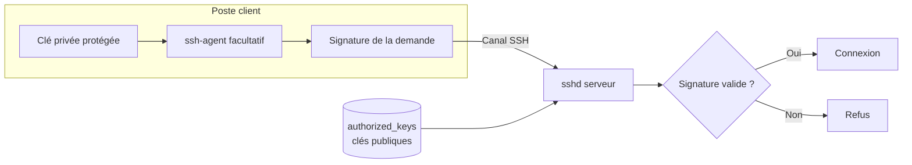

Cette architecture constitue aujourd'hui la méthode de référence pour administrer des serveurs Linux. Elle élimine le principal défaut des mots de passe : **le secret partagé.**

## Approfondissement

### Les clés SSH ne remplacent pas les mots de passe. Elles remplacent le secret partagé.

C'est une nuance extrêmement importante. On entend souvent :

> « Avec les clés SSH, on n'utilise plus de mot de passe. »

Ce n'est pas tout à fait exact. En réalité, on remplace un mécanisme d'authentification basé sur un **secret partagé** par un mécanisme basé sur une **preuve cryptographique**. Visualisons.

#### Authentification par mot de passe

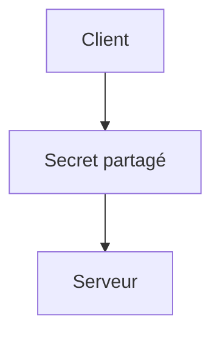

Les deux parties connaissent exactement le même secret.

#### Authentification par clé publique

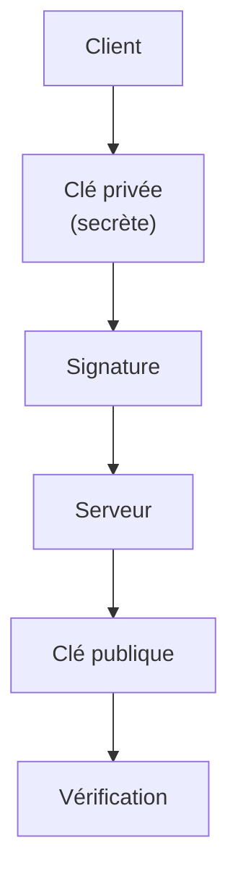

Le serveur ne connaît jamais votre véritable secret. C'est cette différence qui rend cette méthode beaucoup plus robuste.

### La clé privée devient votre identité

Dans une infrastructure moderne, la clé privée représente votre identité numérique. Elle est comparable à un passeport. Vous ne le laissez jamais :

- sur un serveur ;
- dans un dépôt Git ;
- sur une clé USB oubliée.

Vous le conservez soigneusement. Le même raisonnement s'applique à votre clé privée. Elle devient un élément de votre identité professionnelle.

### Une clé privée compromise reste révocable

Supposons qu'un ordinateur portable soit volé. Avec un mot de passe, la situation est délicate. Il faut :

- changer le mot de passe ;
- le redistribuer ;
- mettre à jour les scripts ;
- prévenir toute l'équipe.

Avec des clés publiques, l'opération est beaucoup plus simple.

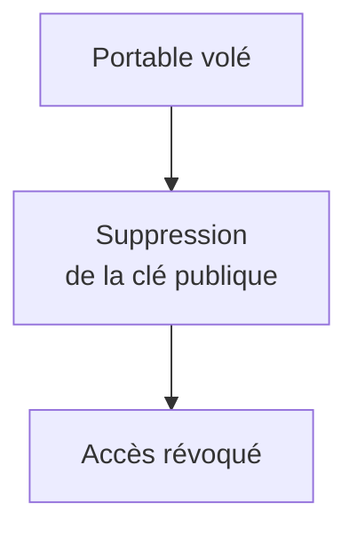

L'ensemble de l'infrastructure continue de fonctionner. Aucun autre administrateur n'est impacté. Cette facilité de révocation constitue l'un des grands avantages opérationnels des clés SSH.

### Les clés SSH sont idéales pour l'automatisation

Imaginons maintenant Ansible. Chaque déploiement ouvre potentiellement plusieurs centaines de connexions SSH. Demander un mot de passe à chaque fois serait impossible. Les clés publiques permettent au contraire une authentification automatique, tout en conservant un excellent niveau de sécurité.

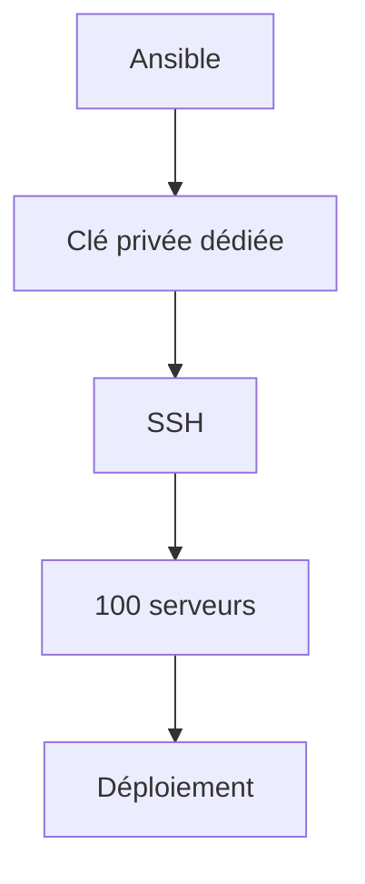

Cette approche est devenue le standard dans les environnements DevOps.

## Concevoir la politique

Un architecte ne réfléchit pas en termes de "connexion SSH". Il réfléchit en termes de **gestion des identités**. Chaque administrateur possède :

- une identité ;
- une clé privée ;
- une clé publique ;
- des autorisations.

Le serveur ne stocke jamais les secrets. Il stocke uniquement les identités autorisées. Cette architecture est beaucoup plus simple à administrer à grande échelle.

### Une clé par personne

Une erreur classique consiste à créer une seule clé pour toute une équipe. Par exemple.

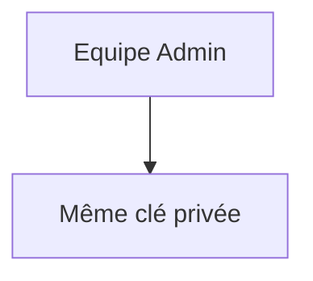

Cette approche détruit tous les bénéfices des clés publiques. Pourquoi ? Parce qu'il devient impossible de savoir :

- qui s'est connecté ;
- qui doit être révoqué ;
- qui est responsable d'une action.

La bonne pratique est simple.

```mermaid
flowchart TD
    N0["Alice"]
    N1["Sa clé"]
    N0 --> N1
```

```mermaid
flowchart TD
    N0["Bob"]
    N1["Sa clé"]
    N0 --> N1
```

```mermaid
flowchart TD
    N0["Charlie"]
    N1["Sa clé"]
    N0 --> N1
```

Chaque identité est individuelle. Chaque révocation est indépendante. Chaque connexion est traçable.

### Les clés deviennent un patrimoine de sécurité

Dans une entreprise, les clés SSH doivent être gérées comme les certificats TLS. Elles possèdent :

- un propriétaire ;
- une date de création ;
- une durée de vie ;
- une procédure de renouvellement ;
- une procédure de révocation.

Autrement dit, une clé SSH n'est pas un simple fichier. C'est un actif de sécurité.

## Point de vue offensif

Face à un serveur utilisant uniquement des clés publiques, l'attaquant comprend immédiatement qu'une attaque par dictionnaire est inutile. Son objectif change alors complètement. Il cherche désormais :

- une clé privée mal protégée ;
- une sauvegarde contenant des clés ;
- un poste utilisateur compromis ;
- un dépôt Git contenant accidentellement une clé privée.

Autrement dit, l'attaque se déplace du serveur vers les postes des administrateurs. C'est pourquoi la protection des postes d'administration est tout aussi importante que celle des serveurs.

### Pourquoi protéger la clé privée avec une phrase de passe

Supposons qu'un attaquant copie simplement : `~/.ssh/id_ed25519` Si cette clé n'est pas chiffrée, il peut immédiatement l'utiliser. En revanche, si elle est protégée par une phrase de passe, il devra également casser cette protection, ce qui augmente fortement le coût de l'attaque. La phrase de passe ne protège donc pas le serveur. Elle protège votre identité cryptographique.

## En entreprise

Dans les environnements professionnels, les politiques de sécurité imposent généralement plusieurs règles.

- une clé par administrateur ;
- une phrase de passe obligatoire ;
- aucune clé privée sur les serveurs ;
- rotation périodique des clés ;
- révocation immédiate lors du départ d'un collaborateur ;
- journalisation des connexions.

Les infrastructures les plus matures vont encore plus loin. Elles remplacent progressivement les clés permanentes par :

- des certificats OpenSSH à durée de vie limitée ;
- des jetons matériels (YubiKey, Nitrokey...) ;
- des infrastructures de signature centralisées.

Nous reviendrons sur ces sujets lorsque nous aborderons la PKI et FreeIPA.

## Culture technique

### Pourquoi Ed25519 est souvent privilégié

Pendant de nombreuses années, la référence était : `RSA` On générait généralement des clés de :

- 2048 bits ;
- puis 3072 bits ;
- parfois 4096 bits.

Pour de nombreux déploiements modernes, le choix courant est : `Ed25519` Pourquoi ? Parce que cet algorithme offre simultanément :

- une sécurité très élevée ;
- des clés beaucoup plus courtes ;
- des signatures plus rapides ;
- une génération plus rapide ;
- une implémentation réputée plus robuste face à certaines erreurs.

À sécurité équivalente, une clé Ed25519 est beaucoup plus compacte qu'une clé RSA.

### Pourquoi RSA existe encore ?

Pourquoi trouve-t-on encore autant de clés RSA ? Principalement pour des raisons de compatibilité et de conformité. Certaines infrastructures anciennes, certains équipements réseau, certaines distributions historiques ou certains modes FIPS ne prennent pas Ed25519 en charge. RSA reste donc largement utilisé ; sa sécurité dépend aussi de la taille de clé et de l'algorithme de signature négocié.

### Le rôle exact de `authorized_keys`

Une erreur très fréquente consiste à croire que ce fichier contient les utilisateurs autorisés. Ce n'est pas exact. Il contient : `Des clés publiques autorisées.` Ce n'est pas la même chose. Par exemple, un même utilisateur peut posséder plusieurs postes.

```mermaid
flowchart TD
    N0["Portable"]
    N1["Clé A"]
    N0 --> N1
```

```mermaid
flowchart TD
    N0["PC Bureau"]
    N1["Clé B"]
    N0 --> N1
```

```mermaid
flowchart TD
    N0["Machine de secours"]
    N1["Clé C"]
    N0 --> N1
```

Les trois clés peuvent être présentes simultanément dans : `authorized_keys` Le compte Linux reste le même. L'identité cryptographique, elle, est multiple.

### Une clé publique contient plus qu'une clé

Observons une ligne classique.

```text
ssh-ed25519 AAAAC3NzaC1lZDI1NTE5AAAA...

tom@portable
```

Elle contient en réalité trois informations.

```mermaid
flowchart TD
    N0["Algorithme"]
    N1["Données cryptographiques"]
    N2["Commentaire"]
    N0 --> N1
    N1 --> N2
```

Le commentaire : `tom@portable` n'est utilisé que pour faciliter l'identification humaine. Il ne participe absolument pas au mécanisme cryptographique. Vous pouvez même le modifier sans casser la clé.

Une ligne `authorized_keys` peut aussi commencer par des options de restriction : `from=`, `command=`, `restrict`, `no-agent-forwarding` ou `no-port-forwarding`. Elles sont particulièrement importantes pour une clé d'automatisation : même volée, elle ne doit pas offrir un shell ou un tunnel plus large que la tâche prévue. Avant de les utiliser, vérifiez leur disponibilité dans `sshd(8)` sur la version réellement installée.

## Piège classique

### Copier la mauvaise clé

C'est probablement l'erreur la plus fréquente. Beaucoup d'administrateurs copient : `id_ed25519` au lieu de : `id_ed25519.pub` La conséquence est dramatique. Ils viennent de transmettre leur clé privée. Cette erreur compromet immédiatement leur identité. Une règle simple.

```text
Le fichier

.pub

quitte votre ordinateur.

Le fichier

sans .pub

n'en sort jamais.
```

### Oublier les permissions

OpenSSH est très strict. Si les permissions sont trop ouvertes, il refuse d'utiliser les clés. Par exemple. Le répertoire. `~/.ssh` doit généralement être : `700` Le fichier. `authorized_keys` souvent : `600` Et la clé privée : `600` également. Cette exigence évite qu'un autre utilisateur du système puisse modifier les fichiers d'authentification.

## TP 1 — Générer et installer une identité SSH

### Objectif

Mettre en place une authentification par clés publiques entre deux machines AlmaLinux.

### Étape 1 — Générer une identité

Créer une nouvelle paire de clés.

```bash
ssh-keygen -t ed25519
```

Choisir une phrase de passe robuste. Observer les deux fichiers créés.

```text
id_ed25519

id_ed25519.pub
```

Identifier lequel doit rester secret.

### Étape 2 — Installer la clé publique

Depuis le poste client.

```bash
ssh-copy-id admin@sentinel
```

Vérifier ensuite sur le serveur.

```bash
cat ~/.ssh/authorized_keys
```

Observer la présence de la clé publique.

## TP 2 — Tester la clé et utiliser `ssh-agent`

### Étape 3 — Tester la connexion

Établir une nouvelle connexion.

```bash
ssh admin@sentinel
```

Constater que le mot de passe du compte utilisateur n'est plus demandé. Si une phrase de passe protège la clé, observer qu'elle est demandée à la place.

### Étape 4 — Utiliser `ssh-agent`

Démarrer un agent.

```bash
eval "$(ssh-agent -s)"
```

Ajouter ensuite la clé.

```bash
ssh-add ~/.ssh/id_ed25519
```

Établir plusieurs connexions successives. Constater que la phrase de passe n'est plus redemandée. Faire le lien avec le fonctionnement mémoire de `ssh-agent`.

## Mission d'ingénieur

Votre entreprise souhaite supprimer définitivement l'authentification par mot de passe sur l'ensemble des serveurs Sentinel. Avant cette migration, vous devez rédiger une procédure d'exploitation. Votre document devra préciser :

- comment générer une paire de clés conforme aux standards de l'entreprise ;
- comment protéger les clés privées ;
- comment distribuer les clés publiques ;
- comment révoquer rapidement un administrateur ;
- comment gérer plusieurs postes de travail pour un même utilisateur ;
- comment vérifier qu'aucune clé privée ne s'est retrouvée sur un serveur.

Cette procédure servira de référence à l'ensemble des équipes d'administration.

## Impact sur Sentinel

À partir de ce chapitre, toutes les opérations d'administration de Sentinel seront réalisées à l'aide de **clés publiques individuelles conformes à la politique cryptographique du système** — Ed25519 dans le laboratoire standard. Les mots de passe resteront uniquement disponibles comme mécanisme de secours durant la phase de transition. Cette approche apportera plusieurs bénéfices.

- suppression des attaques par dictionnaire ;
- identité cryptographique propre à chaque administrateur ;
- révocation individuelle des accès ;
- intégration simple avec Ansible ;
- meilleure traçabilité des opérations d'administration.

Le prochain chapitre expliquera comment renforcer encore la sécurité du serveur OpenSSH grâce au durcissement du fichier **`sshd_config`**.

## Synthèse

- Une paire de clés SSH est composée d'une clé privée (secrète) et d'une clé publique (diffusable).
- La clé privée ne quitte jamais le poste de son propriétaire.
- Le serveur authentifie l'utilisateur grâce à un mécanisme de défi (challenge) et de signature.
- `authorized_keys` contient uniquement les clés publiques autorisées.
- `ssh-agent` permet d'utiliser une clé protégée par une phrase de passe sans la ressaisir à chaque connexion.
- Ed25519 est un excellent choix moderne hors contraintes incompatibles, notamment certains contextes FIPS.
- Les clés publiques éliminent le principal défaut des mots de passe : le secret partagé.

## Infographie de révision

```text
┌──────────────────────────────────────────────────────────────────────────────────────────────┐
│               CHAPITRE 4.3 — AUTHENTIFICATION PAR CLÉS SSH                                   │
├──────────────────────────────────────────────────────────────────────────────────────────────┤
│                                                                                              │
│                       GÉNÉRATION D'UNE IDENTITÉ                                               │
│                                                                                              │
│                     ssh-keygen -t ed25519                                                    │
│                               │                                                              │
│                               ▼                                                              │
│                 ┌─────────────────────────────┐                                              │
│                 │                             │                                              │
│                 ▼                             ▼                                              │
│        id_ed25519                     id_ed25519.pub                                          │
│       Clé privée                      Clé publique                                            │
│       (SECRÈTE)                       (DIFFUSABLE)                                            │
│                                                                                              │
├──────────────────────────────────────────────────────────────────────────────────────────────┤
│                    AUTHENTIFICATION PAR CHALLENGE                                             │
│                                                                                              │
│             Client                               Serveur                                      │
│                                                                                              │
│                │                                    │                                         │
│                │──────── Connexion SSH ───────────▶ │                                         │
│                │                                    │                                         │
│                │ ◀────── Challenge aléatoire ────── │                                         │
│                │                                    │                                         │
│                │ Signature avec                     │                                         │
│                │ la clé privée                      │                                         │
│                │                                    │                                         │
│                │ ───────── Signature ─────────────▶ │                                         │
│                │                                    │                                         │
│                │                         Vérification avec                                    │
│                │                         la clé publique                                      │
│                │                                    │                                         │
│                │                       ┌────────────┴────────────┐                            │
│                │                       ▼                         ▼                            │
│                │                  Signature                 Signature                         │
│                │                   valide                    invalide                         │
│                │                       │                         │                            │
│                │                       ▼                         ▼                            │
│                │                 Connexion                  Refus                             │
│                                                                                              │
├──────────────────────────────────────────────────────────────────────────────────────────────┤
│                     RÉPARTITION DES CLÉS                                                      │
│                                                                                              │
│ Poste administrateur                     Serveur                                              │
│                                                                                              │
│ id_ed25519              ────────────────╮                                                     │
│ (Privée)                               │                                                     │
│                                        │                                                     │
│ ssh-agent                              │                                                     │
│                                        │                                                     │
│ id_ed25519.pub ───────────────────────▶│ authorized_keys                                     │
│                                        │                                                     │
│                                        │                                                     │
│ La clé privée ne quitte jamais         │ Le serveur ne possède                               │
│ le poste de travail.                   │ que la clé publique.                                │
│                                                                                              │
├──────────────────────────────────────────────────────────────────────────────────────────────┤
│                         BONNES PRATIQUES                                                      │
│                                                                                              │
│ ✔ Utiliser Ed25519                                                                           │
│ ✔ Une clé par administrateur                                                                 │
│ ✔ Protéger la clé privée par une passphrase                                                  │
│ ✔ Utiliser ssh-agent                                                                         │
│ ✔ Déployer uniquement les clés publiques                                                     │
│ ✔ Révoquer une clé en supprimant une ligne de authorized_keys                                │
│ ✘ Ne jamais copier id_ed25519 sur un serveur                                                 │
│ ✘ Ne jamais partager une même clé privée entre plusieurs personnes                           │
├──────────────────────────────────────────────────────────────────────────────────────────────┤
│                          IDÉE CLÉ                                                            │
│                                                                                              │
│ « Le serveur ne connaît jamais votre secret.                                                 │
│  Il vérifie uniquement que vous possédez la clé privée                                       │
│  correspondant à la clé publique qu'il a enregistrée. »                                      │
└──────────────────────────────────────────────────────────────────────────────────────────────┘

```

## Pour aller plus loin

Les pages `ssh-keygen(1)`, `ssh-add(1)`, `ssh-agent(1)` et `sshd(8)` documentent les formats, contraintes et options de `authorized_keys`. Le chapitre suivant transforme ces identités en politique serveur explicite et vérifiable.

← [4.2 — Authentification par mot de passe](4.2-authentification-mot-de-passe.md) · [4.4 — Durcissement de `sshd_config`](4.4-durcissement-sshd-config.md) →
