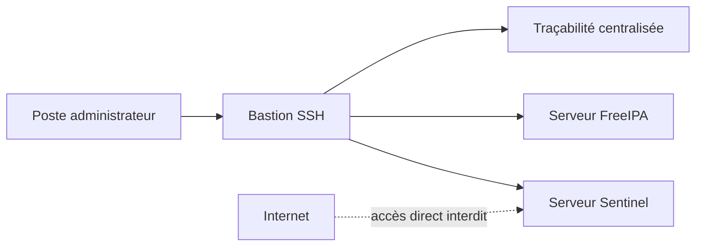

# Chapitre 4.5 — Bastion d'administration

> **Campagne 4 — SSH et accès distant**

> *« Le serveur SSH le plus sécurisé est souvent celui qui n'est jamais directement accessible depuis Internet. »*

---

## Vous êtes ici

```text
Partie I — Construire un socle sécurisé

Campagne 4 — SSH et accès distant

      4.1 Architecture d'OpenSSH
      4.2 Authentification par mot de passe
      4.3 Authentification par clés
      4.4 Durcissement de sshd_config
    ► 4.5 Bastion d'administration
      4.6 Journalisation et audit SSH
      4.7 Protection contre les attaques
      4.8 Mission : administration sécurisée de Sentinel
```

---

## Objectifs pédagogiques

À la fin de ce chapitre, vous serez capable de :

- comprendre le rôle d'un bastion d'administration ;
- distinguer un serveur de production d'un serveur de rebond ;
- comprendre pourquoi les infrastructures modernes n'exposent plus directement leurs serveurs ;
- mettre en place une architecture d'administration sécurisée ;
- intégrer Sentinel dans une chaîne d'administration professionnelle.

---

## Pourquoi ce chapitre existe

Depuis le début de cette campagne,

nous avons cherché à sécuriser OpenSSH.

Nous avons :

- renforcé l'authentification ;
- supprimé les mots de passe ;
- durci `sshd_config`.

Mais une question demeure.

> **Pourquoi exposer directement un serveur de production à Internet ?**

Même parfaitement configuré,

un serveur SSH reste :

- détectable ;
- attaquable ;
- scannable.

Une approche beaucoup plus robuste consiste à supprimer totalement cette exposition.

C'est précisément le rôle d'un **bastion d'administration**.

---

## Théorie détaillée

### Qu'est-ce qu'un bastion ?

Un bastion est un serveur spécialement dédié à l'administration.

Son rôle est extrêmement simple.

Il constitue l'unique point d'entrée vers les autres serveurs.

Visuellement.



Les serveurs internes ne sont plus accessibles directement.

---

## Pourquoi utiliser un bastion ?

Imaginons une infrastructure de vingt serveurs.

Sans bastion.

```text
Internet

↓

20 serveurs SSH

exposés
```

Chaque serveur devient une cible.

Chaque serveur reçoit :

- des scans ;
- des attaques ;
- des tentatives de brute force.

Maintenant,

avec un bastion.

```text
Internet

↓

1 seul serveur SSH

↓

Infrastructure interne
```

La surface d'attaque est immédiatement divisée.

---

## Une analogie simple

Imaginez un immeuble.

Sans bastion.

```text
Rue

↓

Chaque appartement

possède sa propre porte.
```

Avec un bastion.

```text
Rue

↓

Hall sécurisé

↓

Contrôle

↓

Ascenseurs

↓

Appartements
```

Le bastion joue exactement le rôle du hall d'entrée sécurisé.

---

## Ce que fait réellement un bastion

Contrairement à une idée reçue,

le bastion ne remplace pas SSH.

Il exécute lui-même OpenSSH.

Il agit simplement comme un intermédiaire.

```text
Administrateur

↓

SSH

↓

Bastion

↓

SSH

↓

Sentinel
```

Deux connexions SSH existent donc.

Une première.

```text
Administrateur

↓

Bastion
```

Puis une seconde.

```text
Bastion

↓

Sentinel
```

Le bastion devient le seul serveur autorisé à dialoguer avec les machines internes.

---

## Où placer le bastion ?

Dans une architecture classique,

on distingue plusieurs zones réseau.

```text
Internet

↓

Firewall

↓

DMZ

↓

Bastion

↓

Réseau d'administration

↓

Serveurs internes
```

Le bastion se situe généralement :

- dans une DMZ ;
- ou dans un réseau d'administration dédié.

Il ne doit jamais être placé au hasard.

Sa position fait partie intégrante de l'architecture de sécurité.

---

## Les serveurs internes deviennent invisibles

L'un des plus grands avantages est celui-ci.

Prenons Sentinel.

Sans bastion.

```text
Internet

↓

Port 22 ouvert
```

Tout le monde peut détecter son existence.

Avec un bastion.

```text
Internet

↓

Impossible

de joindre Sentinel.
```

Même un scan complet du réseau ne verra jamais le serveur.

Il devient invisible depuis l'extérieur.

Cette réduction de visibilité constitue un gain de sécurité considérable.

---

## Une architecture complète

Nous obtenons maintenant.

```text
                Administrateur

                      │

               Clé publique

                      │

                      ▼

                Bastion SSH

                      │

          Authentification

                      │

                      ▼

           Réseau interne sécurisé

                      │

      ┌───────────────┼────────────────┐

      ▼               ▼                ▼

  Sentinel        FreeIPA        PostgreSQL
```

Le bastion devient le point central de toute l'administration.

---

## Le principe du rebond

Le terme anglais est souvent :

```text
Jump Host
```

ou

```text
Jump Server
```

Pourquoi ?

Parce que l'administrateur effectue un "rebond".

```text
PC

↓

Bastion

↓

Serveur cible
```

Aujourd'hui,

OpenSSH permet même d'automatiser ce rebond,

comme nous le verrons un peu plus loin avec :

```text
ProxyJump
```

Cette fonctionnalité simplifie énormément l'administration des grandes infrastructures.

## Les différents types de bastions

Toutes les infrastructures n'utilisent pas exactement le même modèle.

On distingue généralement plusieurs architectures.

---

### Bastion unique

La plus simple.

```text
                Internet

                    │

                    ▼

              Bastion SSH

                    │

        ┌───────────┼───────────┐

        ▼           ▼           ▼

    Sentinel     FreeIPA     PostgreSQL
```

Cette architecture est suffisante pour :

- une PME ;
- un laboratoire ;
- un environnement de développement.

---

### Bastions redondants

Dans une infrastructure critique,

le bastion devient lui-même un point sensible.

On le redonde.

```text
                 Internet

                     │

          ┌──────────┴──────────┐

          ▼                     ▼

     Bastion A            Bastion B

          │                     │

          └──────────┬──────────┘

                     ▼

              Réseau interne
```

La perte d'un bastion ne bloque plus l'administration.

---

### Bastion par zone

Certaines entreprises vont encore plus loin.

```text
              Internet

                  │

                  ▼

         Bastion Externe

                  │

        Réseau d'administration

                  │

      ┌───────────┴────────────┐

      ▼                        ▼

 Bastion Production      Bastion Préproduction

      │                        │

      ▼                        ▼

 Serveurs PROD          Serveurs TEST
```

Chaque environnement possède son propre niveau de sécurité.

---

## Le bastion ne doit pas être un serveur "normal"

Une erreur fréquente consiste à transformer un serveur classique en bastion.

Par exemple.

```text
SSH

+

Apache

+

MariaDB

+

Podman

+

Docker

+

Grafana
```

C'est une très mauvaise idée.

Pourquoi ?

Parce que le bastion constitue le cœur de l'administration.

Il doit rester aussi simple que possible.

En pratique,

un bastion contient souvent uniquement :

- OpenSSH ;
- les outils d'administration ;
- les journaux ;
- éventuellement un agent de supervision.

Moins il exécute de services,

plus sa surface d'attaque est réduite.

---

## Le bastion devient un point de contrôle

Puisque tous les administrateurs passent par lui,

il devient extrêmement intéressant.

Toutes les connexions peuvent y être :

- authentifiées ;
- journalisées ;
- corrélées ;
- supervisées.

Visuellement.

```text
Administrateur

        │

        ▼

Authentification

        │

        ▼

Journalisation

        │

        ▼

Autorisation

        │

        ▼

Connexion au serveur
```

Le bastion devient alors un véritable poste de contrôle.

---

## Une identité nominative

Le bastion permet également d'imposer une règle essentielle.

Chaque administrateur utilise son propre compte.

```text
Alice

↓

alice
```

---

```text
Bob

↓

bob
```

---

```text
Charlie

↓

charlie
```

Il n'existe plus de compte partagé.

Toutes les opérations deviennent attribuables.

Nous retrouvons ici un principe fondamental des audits de sécurité.

---

## Le rebond automatique avec ProxyJump

Pendant longtemps,

les administrateurs réalisaient deux connexions.

```bash
ssh bastion
```

Puis.

```bash
ssh sentinel
```

OpenSSH simplifie énormément cette opération.

```bash
ssh -J bastion sentinel
```

Le client établit automatiquement le rebond.

L'utilisateur a l'impression de se connecter directement au serveur cible.

En réalité,

la connexion traverse toujours le bastion.

Schématiquement.

```text
Client

↓

ProxyJump

↓

Bastion

↓

Sentinel
```

Cette fonctionnalité est aujourd'hui très utilisée dans les grandes infrastructures.

---

## Simplifier avec ~/.ssh/config

OpenSSH permet également de définir des alias.

Par exemple.

```text
Host sentinel

    HostName 10.0.10.12

    User admin

    ProxyJump bastion
```

L'administrateur peut ensuite simplement taper.

```bash
ssh sentinel
```

Le client applique automatiquement :

- le bon utilisateur ;
- la bonne adresse ;
- le rebond sur le bastion ;
- la clé SSH adaptée.

Cette approche réduit considérablement les erreurs humaines.

---

## Une architecture Sentinel

Notre laboratoire peut désormais être représenté ainsi.

```text
                 Administrateur

                        │

                 Clé Ed25519

                        │

                        ▼

                Bastion Sentinel

                        │

                Réseau interne

        ┌───────────────┼────────────────┐

        ▼               ▼                ▼

   Sentinel API     FreeIPA       PostgreSQL

        │               │                │

        └───────────────┼────────────────┘

                        ▼

                 Journalisation
```

Toutes les opérations d'administration passent désormais par un point unique,

facilitant :

- les audits ;
- la supervision ;
- la détection d'incidents ;
- la gestion des accès.

## 💎 Le point d'expertise

### Le bastion protège autant les serveurs que les administrateurs

Lorsqu'on découvre le principe du bastion,

on pense immédiatement :

> « Il protège les serveurs. »

C'est vrai.

Mais ce n'est qu'une partie de son intérêt.

Il protège également les administrateurs eux-mêmes.

Pourquoi ?

Parce qu'il devient le point unique où sont appliquées toutes les politiques de sécurité.

Par exemple.

```text
Authentification MFA

↓

Bastion

↓

Tous les serveurs
```

Sans bastion,

il faudrait configurer la même politique sur chaque machine.

Avec un bastion,

une seule configuration suffit.

---

### Le bastion devient l'identité de l'administration

Dans une infrastructure moderne,

les serveurs internes ne connaissent parfois plus les administrateurs.

Ils ne connaissent que le bastion.

Visualisons.

Sans bastion.

```text
Alice

↓

Sentinel
```

---

Avec bastion.

```text
Alice

↓

Bastion

↓

Sentinel
```

Le bastion devient donc un véritable **courtier d'identité** (*Identity Broker*).

Il authentifie l'utilisateur,

vérifie qu'il est autorisé,

puis lui ouvre l'accès aux ressources internes.

Cette philosophie est très proche de celle des solutions de type :

- Privileged Access Management (PAM) ;
- Zero Trust ;
- Identity Provider (IdP).

---

### Le bastion réduit considérablement la surface d'attaque

Prenons un exemple.

Une entreprise possède :

```text
150 serveurs
```

Sans bastion.

```text
150 ports SSH

ouverts
```

Un attaquant peut lancer :

- 150 attaques parallèles ;
- 150 scans ;
- 150 campagnes de brute force.

Avec un bastion.

```text
1 seul port SSH

visible
```

Les autres machines disparaissent complètement du périmètre Internet.

La réduction de surface d'attaque est spectaculaire.

---

### Le bastion est un actif critique

Parce que tout passe par lui,

le bastion devient l'un des serveurs les plus sensibles de l'entreprise.

Il doit donc être plus sécurisé que les autres.

On y applique généralement :

- authentification multifacteur ;
- clés SSH obligatoires ;
- journalisation renforcée ;
- supervision permanente ;
- mises à jour prioritaires ;
- surveillance d'intégrité.

Un bastion compromis représente un risque majeur.

Sa protection constitue donc une priorité absolue.

---

## 🧠 Comment pense un architecte ?

Un architecte ne voit jamais un bastion comme une simple machine.

Il le considère comme un **plan de contrôle**.

Toutes les opérations d'administration passent par lui.

```text
                Bastion

                    │

        ┌───────────┼────────────┐

        ▼           ▼            ▼

Authentifier   Journaliser   Autoriser

                    │

                    ▼

          Accès aux serveurs
```

Le bastion devient le point central de gouvernance.

Il simplifie :

- les audits ;
- les revues de sécurité ;
- la conformité ;
- les investigations.

---

### Le bastion prépare le Zero Trust

Les architectures modernes abandonnent progressivement la notion de réseau de confiance.

On parle désormais de :

```text
Zero Trust
```

Le principe est simple.

Chaque connexion doit être :

- authentifiée ;
- autorisée ;
- tracée.

Même si elle provient du réseau interne.

Le bastion constitue souvent la première étape vers cette philosophie.

Il impose une vérification systématique,

quelle que soit l'origine de la connexion.

---

### Le bastion facilite l'automatisation

Prenons Ansible.

Sans bastion.

```text
Ansible

↓

150 connexions

↓

150 serveurs
```

Avec bastion.

```text
Ansible

↓

Bastion

↓

150 serveurs
```

Les règles de filtrage deviennent beaucoup plus simples.

Les clés privées restent concentrées sur les postes d'administration ou sur les plateformes d'automatisation.

Les serveurs de production restent totalement isolés d'Internet.

---

## ⚔️ Comment pense un attaquant ?

Face à une infrastructure moderne,

l'attaquant cherche d'abord :

```text
Un accès SSH direct
```

S'il découvre qu'aucun serveur de production n'est accessible,

sa stratégie change complètement.

Il doit désormais :

- compromettre le bastion ;
- compromettre un administrateur ;
- compromettre un VPN ;
- compromettre une solution d'identité.

Le coût de l'attaque augmente considérablement.

---

### Le bastion ralentit la progression d'un attaquant

Imaginons qu'un serveur Sentinel soit compromis.

Sans bastion.

```text
Sentinel

↓

SSH

↓

Autres serveurs
```

Le mouvement latéral est relativement simple.

Avec un bastion.

```text
Sentinel

↓

Aucun accès SSH

↓

Blocage
```

Le serveur compromis ne possède aucun accès direct vers les autres machines.

Cette séparation limite fortement la propagation d'une compromission.

Nous retrouvons ici la logique de compartimentation étudiée avec SELinux,

mais cette fois à l'échelle du réseau.

---

## 🏢 En entreprise

Les grandes entreprises vont souvent encore plus loin.

Le bastion devient une véritable plateforme d'administration.

Il intègre :

- MFA ;
- gestion centralisée des clés ;
- enregistrement vidéo des sessions ;
- journalisation des commandes ;
- approbation préalable de certaines opérations ;
- intégration avec l'annuaire (FreeIPA, Active Directory).

Certaines solutions commerciales permettent même de revoir une session SSH exactement comme une vidéo.

L'objectif est double.

- empêcher les abus ;
- faciliter les investigations après incident.

Le bastion devient ainsi l'un des piliers de la gouvernance des accès privilégiés.

## 📚 Culture technique

### Le bastion n'est pas un VPN

Les deux technologies sont souvent confondues.

Pourtant,

elles répondent à des problématiques différentes.

Le VPN répond à la question.

> **Comment rejoindre le réseau privé ?**

Le bastion répond à une autre question.

> **Qui est autorisé à administrer les serveurs ?**

Visualisons.

#### VPN

```text
Internet

↓

Tunnel VPN

↓

Réseau privé
```

Le VPN transporte le trafic.

---

#### Bastion

```text
Administrateur

↓

Authentification

↓

Bastion

↓

Serveurs
```

Le bastion contrôle les accès.

Les deux technologies sont donc complémentaires.

Dans beaucoup d'entreprises,

le bastion est lui-même uniquement accessible après connexion VPN.

---

### ProxyJump n'est pas un tunnel permanent

Une autre confusion fréquente concerne :

```text
ProxyJump
```

Lorsque l'on exécute :

```bash
ssh -J bastion sentinel
```

OpenSSH ne crée pas une connexion permanente entre le bastion et Sentinel.

Le client établit simplement un relais temporaire.

Schématiquement.

```text
Client

↓

Connexion SSH

↓

Bastion

↓

Relais

↓

Serveur cible
```

Le bastion ne fait que transmettre les données.

Il ne termine pas la connexion SSH.

Le chiffrement de bout en bout reste assuré entre le client et le serveur final.

C'est une propriété très importante.

Même le bastion ne peut pas lire les données de la session.

---

### Le bastion n'est pas forcément interactif

On imagine souvent un administrateur ouvrant un shell.

Pourtant,

de nombreuses connexions via un bastion sont réalisées par :

- Ansible ;
- Terraform ;
- scripts CI/CD ;
- sauvegardes ;
- supervision.

Dans ces cas,

aucun terminal interactif n'est ouvert.

Le bastion devient simplement un point de passage sécurisé.

---

### OpenSSH facilite énormément les rebonds

Avant OpenSSH 7.3,

les administrateurs devaient souvent utiliser :

```bash
ProxyCommand
```

avec `netcat`.

Par exemple.

```bash
ssh \
-o ProxyCommand="ssh bastion nc %h %p"
```

Cette syntaxe était difficile à maintenir.

Aujourd'hui,

elle est remplacée par :

```bash
ProxyJump
```

ou plus simplement.

```bash
ssh -J bastion serveur
```

Cette évolution a largement simplifié les architectures à rebond.

---

## ⚠️ Piège classique

### Transformer le bastion en serveur d'administration généraliste

Beaucoup d'entreprises installent progressivement sur le bastion :

- Grafana ;
- GitLab Runner ;
- Docker ;
- Podman ;
- Jenkins ;
- Apache ;
- bases de données.

Au fil des années,

le bastion devient un serveur "à tout faire".

Cette évolution est dangereuse.

Pourquoi ?

Parce que chaque nouveau service :

- augmente la surface d'attaque ;
- ajoute des dépendances ;
- complexifie les mises à jour ;
- augmente le risque de compromission.

Un bastion doit rester spécialisé.

Sa mission est unique :

**contrôler les accès privilégiés.**

---

### Autoriser tous les utilisateurs à utiliser le bastion

Autre erreur fréquente.

Le bastion est parfois ouvert à l'ensemble des employés.

Cette approche est contraire à sa philosophie.

Le bastion est réservé :

- aux administrateurs ;
- aux équipes d'exploitation ;
- aux automatisations autorisées.

Limiter les utilisateurs réduit fortement le risque d'abus.

---

## Laboratoire AlmaLinux / Kali

### Objectif

Construire une architecture d'administration basée sur un bastion SSH.

---

### Étape 1 — Préparer trois machines

Créer trois VM.

```text
VM 1

↓

Poste administrateur
```

---

```text
VM 2

↓

Bastion
```

---

```text
VM 3

↓

Sentinel
```

Configurer le réseau afin que Sentinel ne soit accessible que depuis le bastion.

---

### Étape 2 — Déployer les clés SSH

Installer :

- la clé publique de l'administrateur sur le bastion ;
- la clé publique du bastion sur Sentinel.

Tester les deux connexions séparément.

---

### Étape 3 — Configurer ProxyJump

Sur le poste administrateur.

Créer.

```text
~/.ssh/config
```

Avec.

```text
Host bastion

    HostName 192.168.10.10

    User admin
```

Puis.

```text
Host sentinel

    HostName 10.10.0.12

    User admin

    ProxyJump bastion
```

Tester ensuite.

```bash
ssh sentinel
```

Observer que le rebond est totalement transparent.

---

### Étape 4 — Vérifier l'isolation

Depuis une machine extérieure,

effectuer un scan.

```bash
nmap
```

Vérifier que :

- le bastion est visible ;
- Sentinel ne l'est pas.

Faire le lien avec la réduction de surface d'attaque étudiée précédemment.

---

## Mission d'ingénieur

Votre entreprise prépare le déploiement de vingt serveurs Sentinel répartis sur plusieurs sites.

Vous devez concevoir l'architecture d'administration.

Votre proposition devra préciser :

- où sera placé le bastion ;
- quelles interfaces réseau il utilisera ;
- quelles méthodes d'authentification seront autorisées ;
- quels utilisateurs pourront s'y connecter ;
- comment seront journalisées les sessions ;
- comment les connexions Ansible traverseront le bastion ;
- comment les administrateurs utiliseront `ProxyJump`.

L'objectif est de fournir une architecture évolutive capable d'accueillir plusieurs centaines de serveurs sans augmenter leur exposition directe.

---

## Impact sur Sentinel

Grâce au bastion,

les serveurs Sentinel ne seront plus directement exposés à Internet.

L'administration suivra désormais le chemin suivant.

```text
Administrateur

        │

        ▼

VPN (si nécessaire)

        │

        ▼

Bastion SSH

        │

        ▼

Sentinel
```

Cette architecture apporte plusieurs bénéfices.

- réduction drastique de la surface d'attaque ;
- centralisation des accès ;
- meilleure traçabilité ;
- intégration simplifiée avec FreeIPA et Ansible ;
- préparation à une architecture Zero Trust.

Le prochain chapitre s'intéressera à un autre pilier essentiel de la sécurité SSH :

**la journalisation et l'audit des connexions**.

---

## Synthèse

- Un bastion est un point d'entrée unique pour l'administration des serveurs.
- Il réduit fortement la surface d'attaque en supprimant l'exposition directe des machines de production.
- `ProxyJump` permet de traverser automatiquement un bastion sans complexifier le travail des administrateurs.
- Un bastion doit rester minimaliste et exclusivement dédié à l'administration.
- Toutes les connexions administratives doivent être authentifiées, journalisées et attribuables à une identité nominative.
- Le bastion constitue un élément central des architectures modernes de type Zero Trust et Privileged Access Management.

---

## Infographie de révision

```text
┌──────────────────────────────────────────────────────────────────────────────────────────────┐
│                     CHAPITRE 4.5 — BASTION D'ADMINISTRATION                                  │
├──────────────────────────────────────────────────────────────────────────────────────────────┤
│                                                                                              │
│                    ADMINISTRATION SANS BASTION                                                │
│                                                                                              │
│                        Internet                                                              │
│                            │                                                                 │
│        ┌───────────────────┼────────────────────┐                                            │
│        ▼                   ▼                    ▼                                            │
│   SSH Sentinel        SSH FreeIPA         SSH PostgreSQL                                     │
│        │                   │                    │                                            │
│  Chaque serveur est directement exposé à Internet.                                          │
│                                                                                              │
├──────────────────────────────────────────────────────────────────────────────────────────────┤
│                    ADMINISTRATION AVEC BASTION                                                │
│                                                                                              │
│                        Internet                                                              │
│                            │                                                                 │
│                            ▼                                                                 │
│                       Bastion SSH                                                            │
│                            │                                                                 │
│      ┌─────────────────────┼─────────────────────┐                                           │
│      ▼                     ▼                     ▼                                           │
│  Sentinel              FreeIPA             PostgreSQL                                        │
│                                                                                              │
│  ✔ Un seul point d'entrée                                                                    │
│  ✔ Les serveurs internes sont invisibles                                                     │
│  ✔ Les accès sont centralisés                                                                │
│                                                                                              │
├──────────────────────────────────────────────────────────────────────────────────────────────┤
│                          DÉROULEMENT D'UNE CONNEXION                                          │
│                                                                                              │
│ Administrateur                                                                               │
│       │                                                                                      │
│       ▼                                                                                      │
│ Authentification (Clé SSH / MFA)                                                             │
│       │                                                                                      │
│       ▼                                                                                      │
│ Bastion                                                                                      │
│       │                                                                                      │
│       ▼                                                                                      │
│ ProxyJump                                                                                    │
│       │                                                                                      │
│       ▼                                                                                      │
│ Serveur Sentinel                                                                             │
│       │                                                                                      │
│       ▼                                                                                      │
│ Session SSH                                                                                  │
│                                                                                              │
├──────────────────────────────────────────────────────────────────────────────────────────────┤
│                            RÔLES DU BASTION                                                   │
│                                                                                              │
│ ✔ Authentifier les administrateurs                                                           │
│ ✔ Centraliser les accès                                                                      │
│ ✔ Journaliser toutes les connexions                                                          │
│ ✔ Limiter l'exposition réseau                                                                │
│ ✔ Préparer les architectures Zero Trust                                                      │
│ ✔ Servir de point d'entrée pour Ansible                                                      │
│                                                                                              │
├──────────────────────────────────────────────────────────────────────────────────────────────┤
│                         CE QUE LE BASTION N'EST PAS                                           │
│                                                                                              │
│ ✘ Un VPN                                                                                     │
│ ✘ Un serveur d'applications                                                                  │
│ ✘ Un serveur Docker/Podman                                                                   │
│ ✘ Un serveur Grafana                                                                         │
│ ✘ Un serveur Git                                                                             │
│                                                                                              │
│ Sa mission est unique :                                                                       │
│ CONTRÔLER LES ACCÈS D'ADMINISTRATION.                                                        │
├──────────────────────────────────────────────────────────────────────────────────────────────┤
│                           BONNES PRATIQUES                                                    │
│                                                                                              │
│ ✔ Une clé SSH par administrateur                                                             │
│ ✔ Comptes nominatifs                                                                         │
│ ✔ MFA si possible                                                                            │
│ ✔ Journalisation complète                                                                    │
│ ✔ ProxyJump                                                                                  │
│ ✔ Serveur minimal                                                                            │
│ ✔ Mises à jour prioritaires                                                                  │
│ ✔ Supervision permanente                                                                     │
│                                                                                              │
├──────────────────────────────────────────────────────────────────────────────────────────────┤
│                               IDÉE CLÉ                                                        │
│                                                                                              │
│ « Le meilleur serveur SSH de production est souvent                                          │
│  celui qui n'est jamais directement accessible depuis Internet. »                            │
└──────────────────────────────────────────────────────────────────────────────────────────────┘
```

---

← [4.4 — Durcissement de `sshd_config`](4.4-durcissement-sshd-config.md) · [4.6 — Journalisation et audit SSH](4.6-journalisation-audit-ssh.md) →
