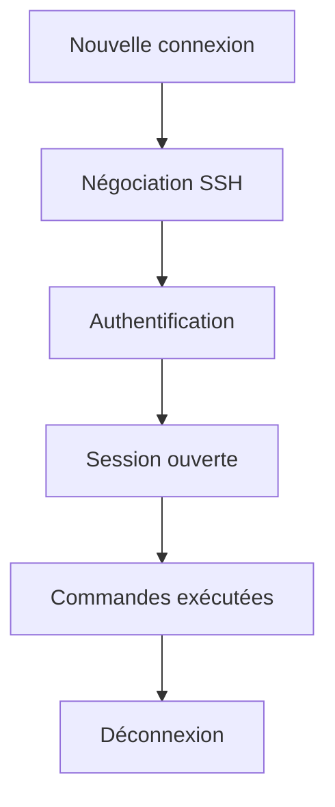
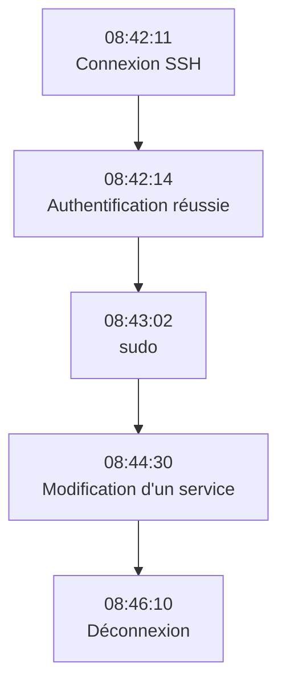
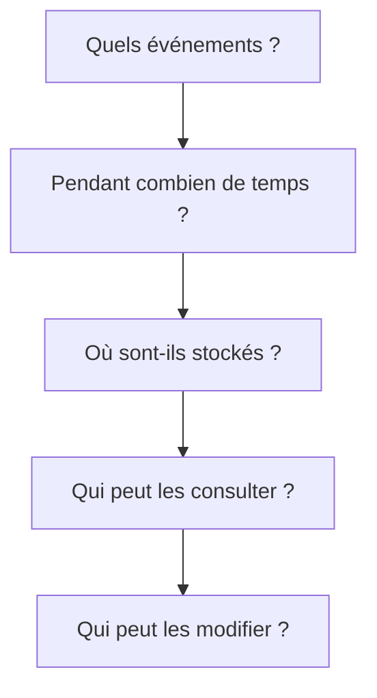
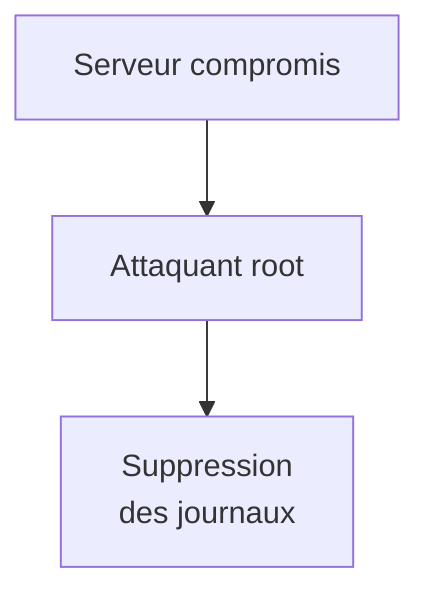
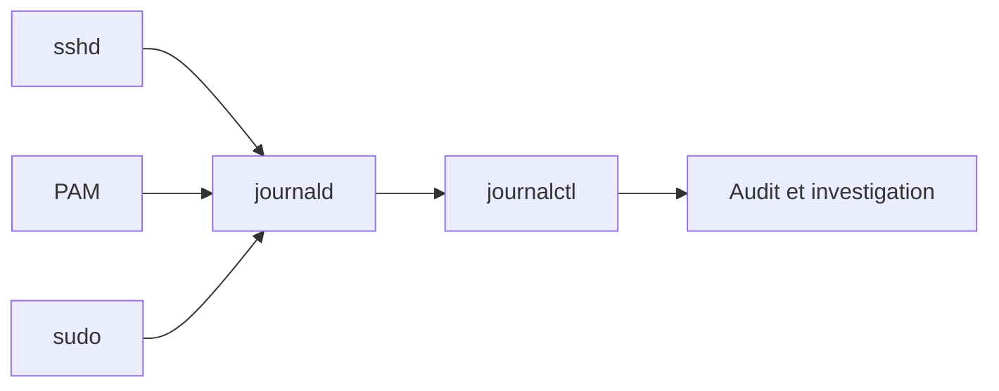
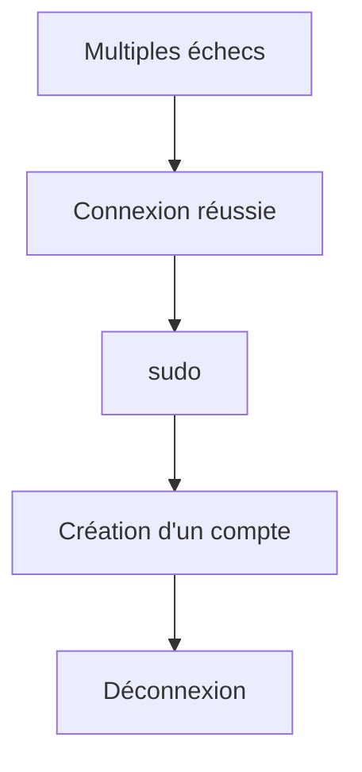
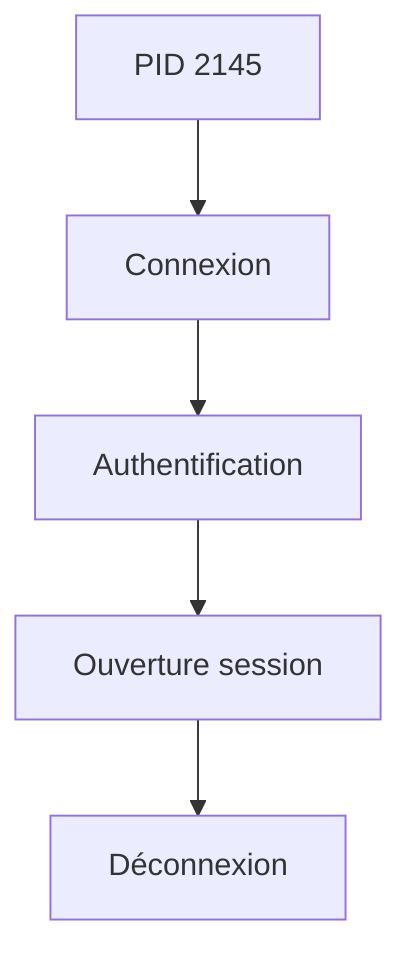

# Chapitre 4.6 — Journalisation et audit SSH

> **Campagne 4 — SSH et accès distant**

> *« Une connexion sécurisée est importante. Une connexion traçable l'est tout autant. Une attaque que l'on ne peut pas reconstituer est une attaque dont on ne tirera jamais les enseignements. »*

## Vous êtes ici

```text
Partie I — Construire un socle sécurisé

Campagne 4 — SSH et accès distant

      4.1 Architecture d'OpenSSH
      4.2 Authentification par mot de passe
      4.3 Authentification par clés
      4.4 Durcissement de sshd_config
      4.5 Bastion d'administration
    ► 4.6 Journalisation et audit SSH
      4.7 Protection contre les attaques
      4.8 Mission : administration sécurisée de Sentinel
```

## Objectifs pédagogiques

À la fin de ce chapitre, vous serez capable de :

- comprendre ce que journalise réellement OpenSSH ;
- retrouver une connexion dans les journaux système ;
- distinguer authentification, autorisation et activité utilisateur ;
- utiliser `journalctl` pour investiguer un incident ;
- mettre en place une stratégie d'audit adaptée à un environnement professionnel.

## Pourquoi ce chapitre existe

Imaginez le scénario suivant. Le lundi matin, vous découvrez que plusieurs fichiers système ont été modifiés pendant le week-end. Vous savez qu'une connexion SSH a probablement eu lieu. Mais vous ignorez :

- qui s'est connecté ;
- depuis quelle adresse IP ;
- à quelle heure ;
- avec quelle méthode d'authentification ;
- combien de tentatives ont été nécessaires.

Sans journalisation, vous êtes aveugle. L'objectif de ce chapitre est de montrer que **la sécurité ne consiste pas uniquement à empêcher les attaques**. Elle consiste également à être capable de les comprendre.

## Théorie détaillée

### Que journalise OpenSSH ?

Chaque connexion génère de nombreux événements. Par exemple. `Nouvelle connexion` `Authentification réussie` `Authentification refusée` `Déconnexion` `Erreur de protocole` `Clé publique refusée` `Tentative root` OpenSSH produit donc beaucoup plus d'informations qu'on ne l'imagine.

## Où sont stockés les journaux ?

Sous AlmaLinux, OpenSSH utilise : `systemd-journald` Les événements sont donc accessibles via.

```bash
journalctl
```

Par exemple.

```bash
journalctl -u sshd
```

Cette commande affiche tous les événements produits par le démon SSH. Nous retrouvons ainsi les notions étudiées dans la campagne consacrée à `journald`.

## Une connexion réussie

Lorsqu'un administrateur ouvre une session, on retrouve généralement un message ressemblant à ceci.

```text
Accepted publickey

for tom

from 192.168.1.15
```

Plusieurs informations apparaissent immédiatement.

- la méthode d'authentification ;
- le nom de l'utilisateur ;
- l'adresse IP source.

Ces trois informations sont essentielles lors d'une investigation.

## Une authentification refusée

Même principe pour un échec. Par exemple.

```text
Failed password

for root

from 203.0.113.42
```

Nous obtenons immédiatement.

- l'utilisateur visé ;
- l'adresse IP ;
- le type d'échec.

Quelques lignes de ce type suffisent souvent à détecter une attaque automatique.

## Une chronologie complète

Visualisons le déroulement d'une connexion.



Tous ces événements ne sont pas nécessairement enregistrés par OpenSSH. Il est important de distinguer :

- ce que SSH sait ;
- ce que Linux sait ;
- ce que d'autres outils devront compléter.

## Ce que SSH ne journalise pas

Une erreur fréquente consiste à croire que SSH enregistre toutes les commandes. Ce n'est pas le cas. Par défaut, OpenSSH sait principalement :

- qui s'est connecté ;
- quand ;
- comment ;
- depuis où.

En revanche, il ne connaît pas :

```text
ls

rm

vim

dnf

systemctl
```

Ces commandes sont exécutées par le shell. Elles relèvent d'autres mécanismes de journalisation. Nous reviendrons sur ce sujet dans la campagne consacrée à Auditd.

## Rechercher une connexion

`journalctl` permet de filtrer très facilement. Par exemple. Les événements du démon SSH.

```bash
journalctl -u sshd
```

Les événements récents.

```bash
journalctl -u sshd -n 50
```

Les événements depuis aujourd'hui.

```bash
journalctl -u sshd --since today
```

Les événements d'une période donnée.

```bash
journalctl -u sshd \
--since "2026-07-15 08:00" \
--until "2026-07-15 12:00"
```

Ces filtres sont extrêmement utiles lors d'une investigation.

## Les niveaux de journalisation

OpenSSH permet de choisir la quantité d'informations produites. Directive. `LogLevel` Quelques valeurs possibles. `QUIET` Très peu d'informations. `INFO` Valeur généralement recommandée. `VERBOSE` Davantage d'informations, notamment sur les clés utilisées.

```text
DEBUG

DEBUG1

DEBUG2

DEBUG3
```

Principalement destinés au diagnostic. Ils ne doivent normalement pas rester activés en production, car ils produisent un volume très important de journaux.

## Une première stratégie de surveillance

Pour Sentinel, nous pouvons déjà définir une première politique. Journaliser systématiquement.

- les connexions réussies ;
- les connexions échouées ;
- les tentatives root ;
- les changements de configuration ;
- les redémarrages du service SSH.

Ces informations constitueront la base de notre future stratégie d'audit.

## Approfondissement

### Les journaux servent avant tout à reconstruire une histoire

Lorsqu'un incident survient, la première question n'est généralement pas :

> « Que s'est-il passé ? »

Mais plutôt :

> **« Dans quel ordre les événements se sont-ils produits ? »**

Un journal n'est pas simplement une liste de messages. C'est une chronologie. Par exemple.



Chaque événement complète le précédent. Pris isolément, ils ont peu de valeur. Ensemble, ils racontent précisément ce qui s'est produit.

### Les journaux ne remplacent pas l'audit

Une confusion très fréquente consiste à considérer que : `Journal = Audit` Ce n'est pas exact. Les journaux répondent principalement à la question : `Que s'est-il passé ?` L'audit répond plutôt à :

```text
Qui ?

Quand ?

Comment ?

Pourquoi ?

Quelles conséquences ?
```

Autrement dit, l'audit exploite les journaux, mais il les complète avec d'autres informations. Par exemple :

- les commandes exécutées ;
- les changements de configuration ;
- les accès aux fichiers sensibles ;
- les modifications de privilèges.

Nous retrouverons ces notions avec `auditd`.

OpenSSH journalise l'établissement et la fermeture des sessions, mais pas automatiquement chaque commande ni son intention. Pour une traçabilité plus forte, combinez les événements SSH avec `sudo`, `auditd` et, lorsque le besoin réglementaire le justifie, un enregistrement de session tel que `tlog`. L'enregistrement intégral augmente fortement le volume et peut capturer des données sensibles : accès, conservation et intégrité doivent être définis avant son activation.

### Une connexion réussie peut être un incident

Beaucoup d'administrateurs surveillent uniquement les échecs. Pourtant, une connexion réussie est parfois beaucoup plus intéressante. Prenons deux exemples.

#### Exemple 1

```text
Accepted publickey

tom

09:12
```

Tout est normal.

#### Exemple 2

```text
Accepted publickey

tom

03:17
```

Pourquoi un administrateur s'est-il connecté à trois heures du matin ? La connexion est parfaitement légitime d'un point de vue technique. Mais elle mérite peut-être une investigation. Les journaux permettent justement de détecter ce type d'anomalies.

### L'absence de journaux est un incident

Une autre situation mérite l'attention. Supposons que plus aucun événement SSH n'apparaisse. Deux possibilités existent.

```text
Personne

ne se connecte.
```

Ou bien.

```text
Le système de journalisation

ne fonctionne plus.
```

Dans les environnements critiques, l'absence de journaux est elle-même considérée comme une alerte. Pourquoi ? Parce qu'un attaquant cherche souvent à masquer ses traces.

## Concevoir la politique

Pour un architecte, les journaux constituent un patrimoine. Ils permettent :

- d'améliorer la sécurité ;
- d'analyser les incidents ;
- de satisfaire les audits réglementaires ;
- d'optimiser l'exploitation.

Il cherche donc à répondre à plusieurs questions.



Les réponses à ces questions définissent une véritable politique de journalisation.

### Les journaux doivent survivre au serveur

Une erreur classique consiste à conserver les journaux uniquement sur la machine concernée. Imaginons.



Toute l'historique disparaît. Les entreprises préfèrent donc envoyer automatiquement les journaux vers :

- un serveur Syslog ;
- une plateforme SIEM ;
- une solution centralisée de collecte.

Ainsi, même si le serveur est compromis, une copie des événements existe toujours ailleurs.

### Corréler plusieurs sources

Une investigation ne repose jamais sur un seul journal. Prenons une connexion SSH. Elle peut être corrélée avec :

- Firewalld ;
- `sudo` ;
- `auditd` ;
- SELinux ;
- les journaux applicatifs ;
- FreeIPA ;
- les équipements réseau.

Visualisons.



Cette corrélation permet de reconstruire précisément toute une chaîne d'événements.

## Point de vue offensif

Un attaquant sait que les journaux constituent une preuve. Il cherche donc souvent à :

- les supprimer ;
- les modifier ;
- réduire leur niveau de détail ;
- désactiver la journalisation.

Une compromission est beaucoup plus difficile à analyser lorsque les traces ont disparu. C'est pourquoi la protection des journaux est un élément majeur de toute architecture de sécurité.

### Les attaquants laissent presque toujours des traces

Même un attaquant expérimenté laisse généralement des indices. Par exemple.



Chaque étape produit un événement. L'objectif de l'administrateur est donc moins de tout empêcher que de pouvoir reconstruire fidèlement la séquence des faits. C'est précisément ce que permettent des journaux bien configurés.

## En entreprise

Dans une infrastructure professionnelle, les journaux SSH sont généralement :

- centralisés ;
- horodatés précisément (NTP) ;
- conservés plusieurs mois ;
- protégés contre les modifications ;
- analysés automatiquement.

Des règles détectent par exemple :

- plusieurs échecs successifs ;
- une connexion inhabituelle ;
- une connexion depuis un nouveau pays ;
- une connexion en dehors des horaires habituels ;
- une augmentation brutale du nombre de tentatives.

La journalisation ne sert donc pas uniquement après un incident. Elle permet également de détecter les attaques en cours.

## Culture technique

### Pourquoi `journalctl` remplace progressivement les anciens fichiers de logs

Pendant longtemps, les administrateurs Linux consultaient principalement des fichiers comme :

```text
/var/log/secure

/var/log/messages

/var/log/auth.log
```

Selon les distributions. Aujourd'hui, sur AlmaLinux utilisant `systemd`, la plupart des événements transitent par : `systemd-journald` Les avantages sont nombreux.

- indexation des événements ;
- filtrage puissant ;
- horodatage précis ;
- recherche par service ;
- recherche par PID ;
- recherche par utilisateur ;
- conservation cohérente.

Par exemple.

```bash
journalctl -u sshd
```

est beaucoup plus précis que :

```bash
grep sshd /var/log/messages
```

Cette évolution simplifie énormément les investigations.

### Les journaux sont horodatés

Chaque événement possède plusieurs informations.

```text
Date

Heure

PID

Service

Message
```

Par exemple.

```text
Jul 15 09:42:31

sshd[2145]:

Accepted publickey

for tom
```

L'horodatage est essentiel. Pourquoi ? Parce qu'une enquête consiste presque toujours à reconstituer une chronologie. Si l'heure des serveurs est incorrecte, toute l'investigation devient beaucoup plus difficile. C'est pourquoi les serveurs d'entreprise utilisent systématiquement : `NTP` ou `Chrony` afin de synchroniser leur horloge.

### Les PID sont précieux

Regardons une ligne de journal. `sshd[2145]` Le nombre : `2145` est le **PID** du processus. Pourquoi est-ce utile ? Parce qu'une même connexion SSH produit souvent plusieurs événements. Grâce au PID, on peut retrouver tous les messages associés au même processus. Schématiquement.



Cette corrélation est extrêmement utile lors des analyses.

### SSH ne connaît pas les commandes exécutées

Cette distinction est capitale. OpenSSH sait : `Connexion ouverte` Mais il ignore généralement :

```bash
rm -rf

dnf install

useradd

systemctl stop
```

Pourquoi ? Parce que ces commandes sont exécutées par : `bash` ou `zsh` et non par `sshd`. Si l'on souhaite connaître précisément les commandes, il faut utiliser :

- `auditd` ;
- l'historique du shell (avec ses limites) ;
- des solutions d'enregistrement de session.

Cette séparation explique pourquoi plusieurs mécanismes d'audit coexistent sous Linux.

## Piège classique

### Croire que l'historique Bash est une preuve

De nombreux administrateurs consultent immédiatement.

```bash
~/.bash_history
```

après un incident. Cette approche est insuffisante. Pourquoi ? L'historique peut être :

- supprimé ;
- modifié ;
- désactivé ;
- incomplet.

Il ne constitue donc jamais une preuve fiable. Les journaux système et `auditd` sont beaucoup plus robustes.

### Utiliser DEBUG en production

Pendant une phase de diagnostic, on peut être tenté de configurer. `LogLevel DEBUG3` Le résultat est impressionnant. Le serveur produit une quantité considérable d'informations. Mais en production, cela entraîne plusieurs inconvénients.

- augmentation du volume de journaux ;
- consommation disque ;
- difficulté de lecture ;
- risque de divulgation d'informations techniques.

La recommandation est simple. `INFO` pour la production. `DEBUG` uniquement pendant un diagnostic, et pour une durée limitée.

## TP 1 — Produire et retrouver les événements SSH

### Objectif

Apprendre à investiguer une connexion SSH à l'aide des journaux système.

### Étape 1 — Générer plusieurs événements

Depuis une machine distante, effectuer successivement :

- une connexion réussie ;
- deux connexions avec un mauvais mot de passe ;
- une tentative de connexion sur un utilisateur inexistant.

Créer volontairement plusieurs types d'événements.

### Étape 2 — Lire les journaux

Afficher.

```bash
journalctl -u sshd
```

Repérer pour chaque tentative :

- l'adresse IP ;
- l'utilisateur ;
- la méthode d'authentification ;
- le résultat.

Construire une chronologie.

## TP 2 — Filtrer et corréler les événements

### Étape 3 — Filtrer

Afficher uniquement les événements récents.

```bash
journalctl -u sshd -n 20
```

Puis.

```bash
journalctl -u sshd --since "10 minutes ago"
```

Comparer les deux approches.

### Étape 4 — Corréler

Après une connexion réussie, utiliser immédiatement :

```bash
sudo
```

Puis consulter :

```bash
journalctl
```

Identifier les événements SSH, puis les événements `sudo`. Comprendre que plusieurs composants racontent ensemble l'histoire complète.

## Mission d'ingénieur

Votre équipe SOC souhaite pouvoir détecter rapidement une compromission d'un serveur Sentinel. Vous devez définir une politique de journalisation SSH précisant :

- le niveau de journalisation (`LogLevel`) retenu ;
- les événements devant déclencher une alerte ;
- la durée minimale de conservation des journaux ;
- la stratégie de centralisation ;
- les événements qui devront être corrélés avec `sudo`, `auditd`, SELinux et FreeIPA.

Cette politique servira de base au futur système de supervision de Sentinel.

## Impact sur Sentinel

À partir de ce chapitre, chaque connexion d'administration sur Sentinel devient un événement exploitable. Nous sommes désormais capables de répondre à des questions comme :

- Qui s'est connecté ?
- Depuis quelle adresse IP ?
- À quel moment ?
- Avec quelle méthode d'authentification ?
- Combien de tentatives ont été nécessaires ?

Dans le prochain chapitre, nous utiliserons précisément ces informations pour détecter et bloquer automatiquement les attaques contre SSH.

## Synthèse

- OpenSSH journalise les connexions, les authentifications et les déconnexions, mais pas les commandes exécutées.
- `journalctl -u sshd` est l'outil principal d'investigation sous AlmaLinux.
- Les journaux permettent de reconstruire une chronologie, mais doivent être complétés par `auditd`, `sudo` et SELinux.
- Un horodatage fiable (Chrony/NTP) est indispensable pour corréler les événements.
- Les journaux doivent être centralisés et protégés contre les modifications.
- Une connexion réussie peut être aussi intéressante qu'une tentative échouée lors d'une investigation.
- Une politique de journalisation est une composante essentielle de toute architecture de sécurité.

## Infographie de révision

```text
┌──────────────────────────────────────────────────────────────────────────────────────────────┐
│                 CHAPITRE 4.6 — JOURNALISATION ET AUDIT SSH                                   │
├──────────────────────────────────────────────────────────────────────────────────────────────┤
│                                                                                              │
│                     CYCLE DE VIE D'UNE CONNEXION SSH                                          │
│                                                                                              │
│ Tentative de connexion                                                                       │
│          │                                                                                   │
│          ▼                                                                                   │
│ Négociation SSH                                                                              │
│          │                                                                                   │
│          ▼                                                                                   │
│ Authentification                                                                             │
│          │                                                                                   │
│     ┌────┴──────────────┐                                                                    │
│     ▼                   ▼                                                                    │
│ Échec               Succès                                                                   │
│     │                   │                                                                    │
│     ▼                   ▼                                                                    │
│ Journal            Ouverture de session                                                      │
│     │                   │                                                                    │
│     │                   ▼                                                                    │
│     │            Déconnexion                                                                 │
│     │                   │                                                                    │
│     └──────────────► Journal                                                                 │
│                                                                                              │
├──────────────────────────────────────────────────────────────────────────────────────────────┤
│                       CE QUE JOURNALISE OPENSSH                                               │
│                                                                                              │
│ ✔ Nouvelle connexion                                                                         │
│ ✔ Adresse IP source                                                                          │
│ ✔ Utilisateur ciblé                                                                          │
│ ✔ Méthode d'authentification                                                                 │
│ ✔ Succès / Échec                                                                             │
│ ✔ Déconnexion                                                                                │
│ ✔ Erreurs du protocole                                                                       │
│                                                                                              │
│ ✘ Les commandes exécutées                                                                    │
│ ✘ Les modifications de fichiers                                                              │
│ ✘ Les actions réalisées après connexion                                                      │
├──────────────────────────────────────────────────────────────────────────────────────────────┤
│                           INVESTIGATION                                                      │
│                                                                                              │
│ journalctl -u sshd                                                                           │
│          │                                                                                   │
│          ▼                                                                                   │
│ Connexion SSH                                                                                │
│          │                                                                                   │
│          ▼                                                                                   │
│ sudo                                                                                         │
│          │                                                                                   │
│          ▼                                                                                   │
│ auditd                                                                                       │
│          │                                                                                   │
│          ▼                                                                                   │
│ SELinux                                                                                      │
│          │                                                                                   │
│          ▼                                                                                   │
│ Journaux applicatifs                                                                         │
│                                                                                              │
│ Tous ces éléments permettent de reconstruire l'incident.                                     │
├──────────────────────────────────────────────────────────────────────────────────────────────┤
│                          COMMANDES PRINCIPALES                                                │
│                                                                                              │
│ journalctl -u sshd                                                                           │
│     Tous les événements SSH                                                                  │
│                                                                                              │
│ journalctl -u sshd -n 50                                                                     │
│     Les 50 derniers événements                                                               │
│                                                                                              │
│ journalctl -u sshd --since today                                                             │
│     Depuis aujourd'hui                                                                       │
│                                                                                              │
│ journalctl -u sshd --since "08:00" --until "10:00"                                           │
│     Filtrage temporel                                                                        │
├──────────────────────────────────────────────────────────────────────────────────────────────┤
│                           BONNES PRATIQUES                                                    │
│                                                                                              │
│ ✔ Synchroniser l'heure (Chrony/NTP)                                                          │
│ ✔ Conserver les journaux plusieurs mois                                                      │
│ ✔ Centraliser les journaux                                                                   │
│ ✔ Corréler SSH, sudo, auditd et SELinux                                                      │
│ ✔ Surveiller les connexions inhabituelles                                                    │
│ ✔ Protéger les journaux contre la suppression                                                │
│ ✘ Ne jamais considérer .bash_history comme une preuve                                        │
│ ✘ Ne pas laisser LogLevel DEBUG en production                                                │
├──────────────────────────────────────────────────────────────────────────────────────────────┤
│                               IDÉE CLÉ                                                       │
│                                                                                              │
│ « La sécurité ne consiste pas uniquement à empêcher                                          │
│  les attaques, mais aussi à être capable                                                     │
│  de les comprendre et de les reconstruire. »                                                 │
└──────────────────────────────────────────────────────────────────────────────────────────────┘
```

## Pour aller plus loin

Les pages `journalctl(1)`, `sshd_config(5)`, `auditd(8)` et la documentation de `tlog` permettent d'adapter le niveau de preuve au risque. Le chapitre suivant utilise ces événements pour déclencher une réponse automatisée sans confondre détection et blocage.

← [4.5 — Bastion d'administration](4.5-bastion-administration.md) · [4.7 — Protection contre les attaques SSH](4.7-protection-attaques-ssh.md) →
