# Chapitre 4.7 — Protection contre les attaques SSH

> **Campagne 4 — SSH et accès distant**

> *« Aucun service exposé sur un réseau ne reste longtemps sans être attaqué. La question n'est pas de savoir si des tentatives auront lieu, mais comment les détecter, les ralentir et les rendre inefficaces. »*

## Vous êtes ici

```text
Partie I — Construire un socle sécurisé

Campagne 4 — SSH et accès distant

      4.1 Architecture d'OpenSSH
      4.2 Authentification par mot de passe
      4.3 Authentification par clés
      4.4 Durcissement de sshd_config
      4.5 Bastion d'administration
      4.6 Journalisation et audit SSH
    ► 4.7 Protection contre les attaques
      4.8 Mission : administration sécurisée de Sentinel
```

## Objectifs pédagogiques

À la fin de ce chapitre, vous serez capable de :

- identifier les principales attaques visant OpenSSH ;
- comprendre pourquoi certaines protections sont efficaces et d'autres non ;
- mettre en œuvre plusieurs couches de défense complémentaires ;
- comprendre le fonctionnement de Fail2ban ;
- intégrer la protection SSH dans une stratégie globale de défense en profondeur.

## Pourquoi ce chapitre existe

Vous venez de déployer votre serveur Sentinel. Vous avez :

- désactivé `root` ;
- supprimé les mots de passe ;
- configuré des clés Ed25519 ;
- installé un bastion ;
- activé la journalisation.

Vous pourriez croire que le travail est terminé. Pourtant, dès que le serveur sera connecté au réseau, les premières tentatives apparaîtront. Parfois en quelques minutes. Parfois en quelques secondes. Pourquoi ? Parce que des robots analysent Internet en permanence. Ils recherchent automatiquement :

- les ports SSH ;
- les versions vulnérables ;
- les mots de passe faibles ;
- les erreurs de configuration.

L'objectif de ce chapitre est d'apprendre à résister à cette réalité.

## Théorie détaillée

### Les attaques automatisées

La très grande majorité des attaques contre SSH ne sont pas réalisées par des humains. Elles sont réalisées par des robots. Leur fonctionnement est extrêmement simple.

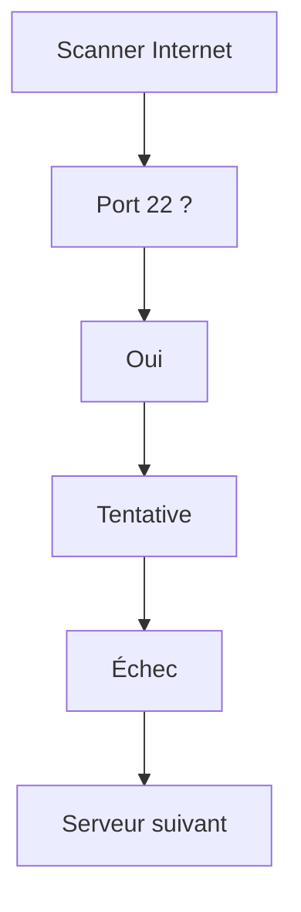

Des millions de serveurs sont ainsi testés chaque jour.

## Le brute force

L'attaque la plus connue.

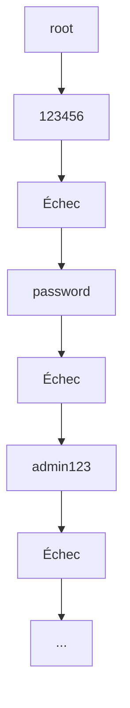

L'objectif est de trouver le bon mot de passe. Cette attaque disparaît presque totalement lorsque : `PasswordAuthentication no` est activé.

## Le Password Spraying

Contrairement au brute force, l'attaquant ne teste pas des milliers de mots de passe sur un seul compte. Il teste quelques mots de passe très courants sur un grand nombre d'utilisateurs. Par exemple.

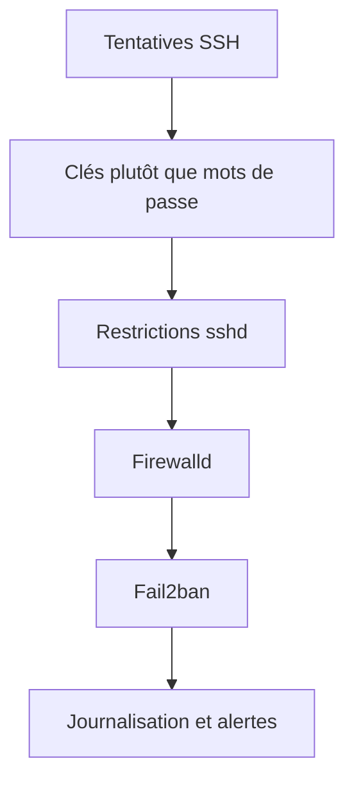

Cette stratégie évite parfois les mécanismes de verrouillage de compte.

## Le Credential Stuffing

Ici, l'attaquant exploite des mots de passe déjà divulgués. Par exemple. Une fuite provenant :

- d'un site web ;
- d'un forum ;
- d'un service cloud.

Les identifiants sont ensuite testés automatiquement sur SSH. Cette attaque repose sur une faiblesse humaine. La réutilisation des mots de passe.

## Les scans de versions

Tous les attaquants ne cherchent pas immédiatement à se connecter. Certains commencent simplement par identifier le serveur. Par exemple. `OpenSSH_9.3` Ils recherchent ensuite :

- des vulnérabilités connues ;
- des configurations dangereuses ;
- des algorithmes obsolètes.

Cette phase est appelée : `Reconnaissance` Elle précède souvent toute tentative d'exploitation.

## Les attaques par déni de service

Une autre catégorie consiste à épuiser les ressources du serveur. Par exemple.

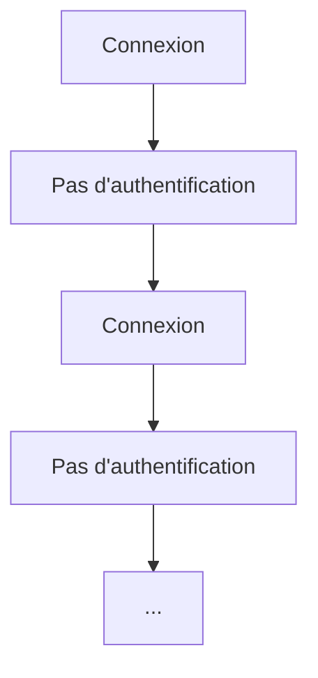

Des milliers de connexions incomplètes peuvent monopoliser :

- les processus ;
- la mémoire ;
- les sockets.

C'est précisément pour cette raison que nous avons étudié : `LoginGraceTime` et. `MaxStartups` dans le chapitre précédent.

## Une défense en profondeur

Aucune protection ne suffit seule. Nous devons combiner plusieurs couches.

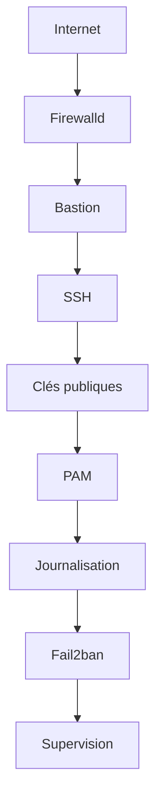

Chaque couche ralentit l'attaquant. Ensemble, elles rendent l'attaque beaucoup plus coûteuse.

## Pourquoi les clés publiques changent tout

Reprenons le brute force. Face à un serveur utilisant exclusivement des clés publiques.

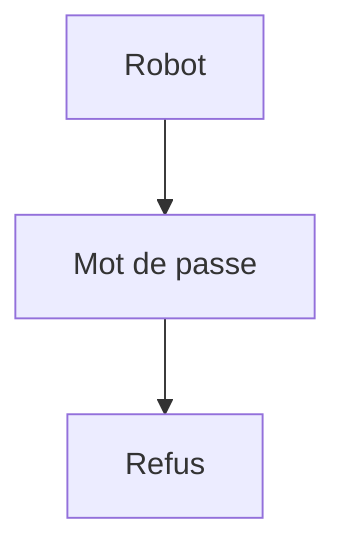

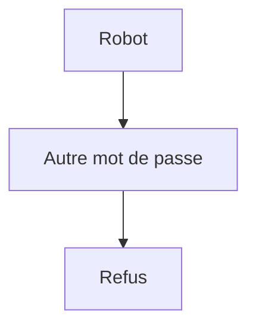

Peu importe le nombre d'essais. Le serveur n'accepte tout simplement plus cette méthode. L'attaquant doit donc changer complètement de stratégie. Nous avons déplacé le problème, plutôt que de simplement le ralentir.

## Fail2ban

L'un des outils les plus populaires pour protéger SSH est : `Fail2ban` Son fonctionnement est remarquablement simple. Il surveille les journaux. Dès qu'il détecte un comportement anormal, il bloque automatiquement l'adresse IP concernée.

## Le principe

Visualisons.

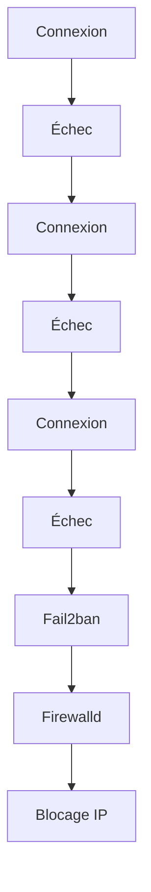

L'attaquant n'est plus seulement confronté à un refus d'authentification. Il ne peut même plus établir une nouvelle connexion.

## Pourquoi Fail2ban fonctionne-t-il ?

Souvenons-nous du chapitre précédent. OpenSSH écrit des événements dans : `journalctl` Fail2ban analyse précisément ces événements. Par exemple.

```text
Failed password

for root

from 203.0.113.15
```

Après plusieurs occurrences similaires, Fail2ban considère qu'il s'agit probablement d'une attaque. Il applique alors une règle de blocage.

## Le fonctionnement interne

Le mécanisme complet ressemble à ceci.

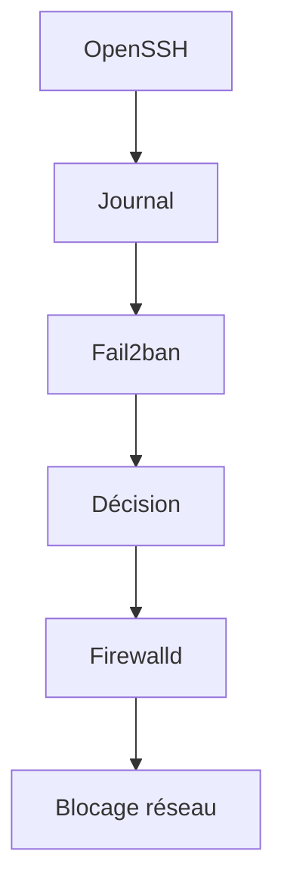

Remarquons que Fail2ban ne modifie pas OpenSSH. Il agit au niveau du pare-feu. C'est une excellente illustration de la défense en profondeur.

## Une configuration typique

Par exemple.

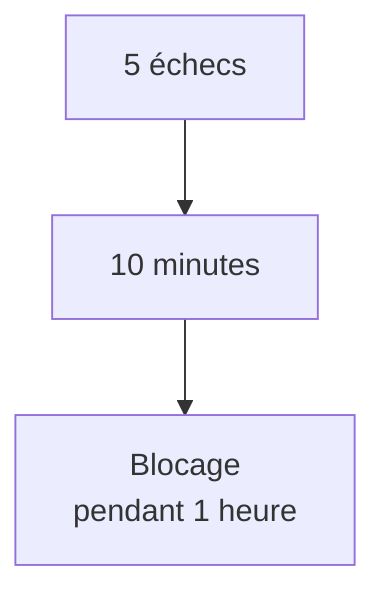

L'utilisateur légitime qui se trompe une fois n'est pas pénalisé. En revanche, un robot réalisant plusieurs centaines de tentatives est rapidement bloqué.

## Le moteur de bannissement applique le blocage

Une confusion fréquente consiste à attribuer le blocage au filtre de journal. Fail2ban détecte et décide ; une **action de bannissement** applique ensuite la mesure dans le moteur configuré. Selon la distribution et le paquet, cette action peut piloter nftables, Firewalld ou un autre backend. Il faut donc vérifier la configuration effective au lieu de supposer systématiquement l'usage de `firewall-cmd`.

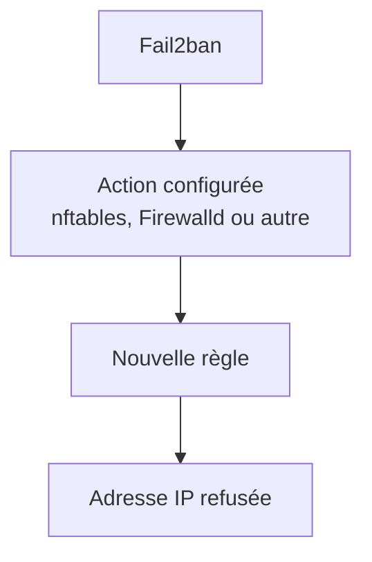

La décision est prise par Fail2ban. Le blocage réseau est réalisé par le backend choisi.

## Les limites de Fail2ban

Fail2ban est surtout efficace contre :

- les rafales et répétitions comprises dans sa fenêtre d'observation ;
- les robots classiques ;
- les tentatives répétées provenant d'une même adresse IP.

En revanche, il devient beaucoup moins efficace contre :

- des attaques distribuées ;
- des botnets ;
- des milliers d'adresses IP différentes.

Dans ce cas, chaque adresse effectue seulement quelques tentatives. Aucune n'atteint le seuil de blocage. Fail2ban reste donc une excellente protection, mais il ne constitue pas une solution miracle.

## Pourquoi conserver Fail2ban si les mots de passe sont désactivés ?

Question fréquente. Si nous avons : `PasswordAuthentication no` Pourquoi installer Fail2ban ? Parce qu'il protège également contre :

- certaines erreurs de configuration ;
- des comptes oubliés ;
- d'autres services ;
- des tentatives répétées de connexion.

De plus, dans de nombreuses entreprises, tous les serveurs ne sont pas encore entièrement migrés vers les clés publiques. Fail2ban reste donc une couche de protection pertinente.

## Les listes blanches

Attention à un point important. Les administrateurs peuvent eux aussi se tromper. Une adresse de secours ou un réseau d'administration maîtrisé peut être exclu du bannissement. Par exemple.

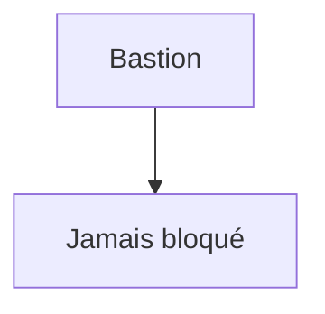

ou.

```text
Réseau

d'administration
```

Ainsi, une erreur de saisie ne provoquera pas le verrouillage de toute l'équipe d'exploitation. Mais `ignoreip` crée aussi un angle mort : si le bastion ou un poste exclu est compromis, Fail2ban ne réagira pas. Limitez la liste, conservez une authentification forte et surveillez ces sources avec autant d'attention que les autres.

## Une architecture complète

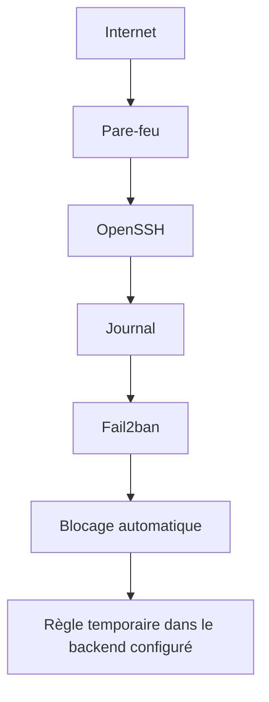

Chaque composant joue un rôle bien défini. Aucun ne remplace les autres. Ils se complètent.

## Détecter les attaques

Grâce aux journaux, Fail2ban produit également des statistiques. Par exemple.

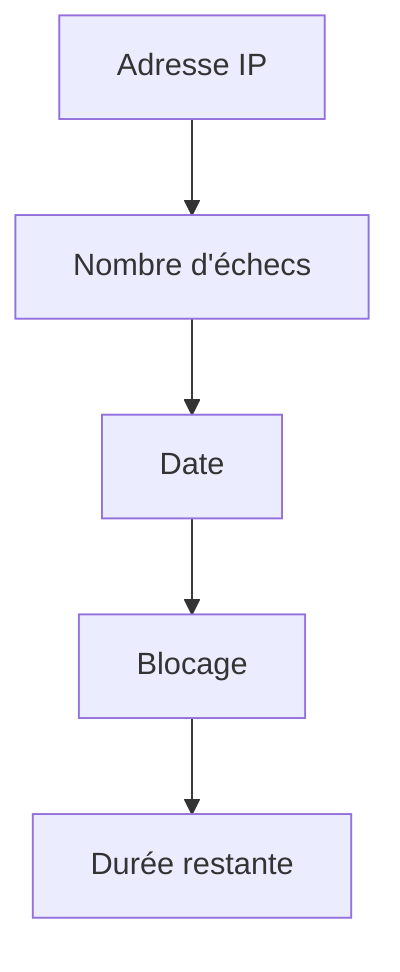

Ces informations permettent aux administrateurs de comprendre :

- quelles attaques sont en cours ;
- quelles adresses reviennent régulièrement ;
- quelles règles doivent éventuellement être renforcées.

Nous retrouvons ici l'importance de la journalisation étudiée dans le chapitre précédent.

## Approfondissement

### Une bonne protection ne cherche pas à empêcher toutes les attaques

Lorsqu'on débute en cybersécurité, on imagine souvent qu'une bonne protection est une protection qui bloque absolument tout. En réalité, ce n'est pas l'objectif. Un architecte cherche plutôt à :

- augmenter le coût de l'attaque ;
- ralentir l'attaquant ;
- multiplier les obstacles ;
- détecter rapidement les comportements anormaux.

Prenons un exemple. Deux serveurs.

#### Serveur A

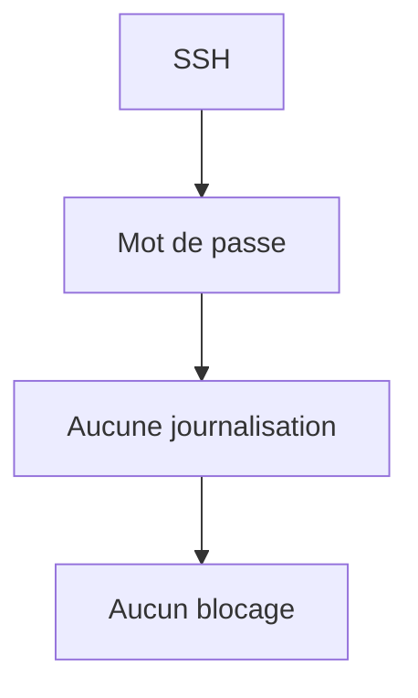

#### Serveur B

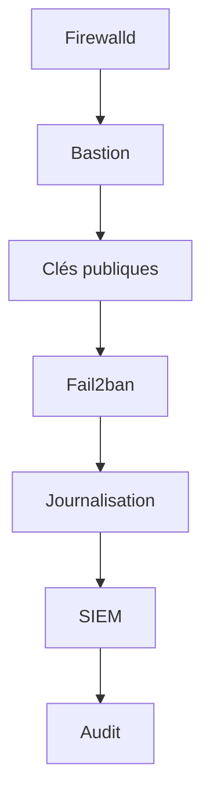

Le second serveur n'est pas invulnérable. Mais il demande énormément plus de temps, de compétences et de ressources pour être compromis. En cybersécurité, on parle souvent de :

> **Augmenter le coût de l'attaque.**

### Toutes les attaques ne sont pas techniques

Prenons un attaquant. Il possède deux possibilités. Première possibilité. `Casser Ed25519` Probabilité ? Pratiquement nulle. Deuxième possibilité.

```text
Voler

la clé privée

sur le PC

de l'administrateur.
```

Probabilité ? Beaucoup plus réaliste. Cette observation change complètement la manière de penser la sécurité. On ne protège plus uniquement les serveurs. On protège également :

- les postes d'administration ;
- les sauvegardes ;
- les comptes FreeIPA ;
- les secrets ;
- les équipements réseau.

### Les protections doivent être indépendantes

Supposons que Fail2ban tombe en panne. Que se passe-t-il ? Si l'infrastructure repose uniquement sur lui, la sécurité disparaît. En revanche, dans Sentinel, nous avons déjà : `Clés publiques` ↓ `Pas de mots de passe` ↓ `Firewalld` ↓ `Bastion` ↓ `Journalisation` ↓ `Fail2ban` Chaque couche reste utile, même si une autre devient indisponible. C'est précisément la définition de la **défense en profondeur**.

### La meilleure attaque est souvent celle qui n'a jamais lieu

Prenons deux infrastructures.

#### Infrastructure 1

```text
SSH

visible

sur Internet
```

Elle reçoit :

- des scans ;
- des robots ;
- des tentatives quotidiennes.

#### Infrastructure 2

```text
Serveur

non exposé

derrière un bastion
```

Le serveur n'est même plus découvert. Les attaques n'ont tout simplement pas lieu. La meilleure protection consiste parfois à rendre la cible invisible. C'est pourquoi nous avons consacré un chapitre entier au bastion d'administration.

## Concevoir la politique

Un architecte ne cherche jamais :

> **la meilleure protection.**

Il cherche :

> **la meilleure combinaison de protections.**

Par exemple.

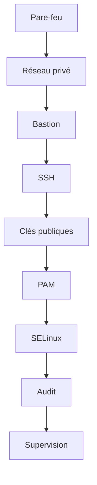

Chaque mécanisme répond à une question différente. Ensemble, ils construisent une architecture résiliente.

### Les attaques évoluent

Une erreur classique consiste à considérer une configuration comme définitive. Prenons l'histoire d'OpenSSH. Hier.

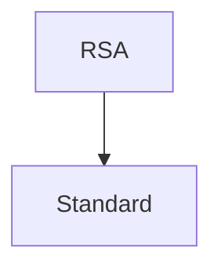

Aujourd'hui.

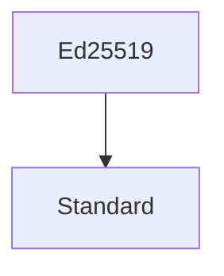

Demain, de nouveaux algorithmes apparaîtront. Il en va de même pour :

- les méthodes d'attaque ;
- les recommandations ;
- les outils.

La sécurité est donc un processus, pas un état.

### Mesurer plutôt que supposer

Une entreprise mature ne dit jamais :

> « Notre SSH est sécurisé. »

Elle mesure. Par exemple.

- nombre quotidien de tentatives ;
- adresses IP bloquées ;
- comptes ciblés ;
- temps moyen avant détection ;
- temps moyen avant remédiation.

Ces indicateurs permettent d'améliorer progressivement la posture de sécurité.

## Point de vue offensif

Un attaquant opportuniste abandonne rapidement lorsqu'il rencontre plusieurs obstacles successifs. Prenons notre infrastructure Sentinel.

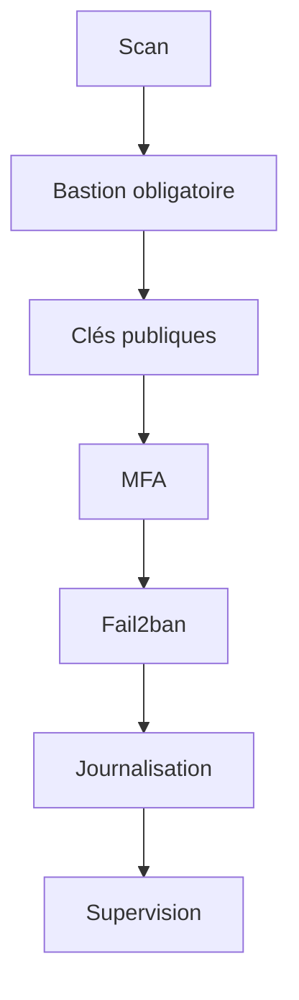

À chaque étape, la probabilité de réussite diminue. L'attaquant choisira souvent une cible moins protégée. C'est une réalité économique. Le temps passé représente un coût.

### Les erreurs humaines restent le principal risque

Malgré toutes les protections étudiées, les incidents proviennent très souvent :

- d'une clé privée copiée par erreur ;
- d'un compte administrateur partagé ;
- d'une mauvaise règle Firewalld ;
- d'un `PermitRootLogin yes` oublié ;
- d'un serveur laissé accessible directement à Internet.

Autrement dit, la majorité des compromissions résultent davantage d'erreurs de configuration que de failles cryptographiques. C'est pourquoi les procédures, les revues de configuration et l'automatisation sont si importantes.

## En entreprise

Dans une infrastructure mature, la protection SSH repose généralement sur une combinaison de mécanismes.

- Bastion d'administration ;
- authentification par clés publiques ;
- MFA sur le bastion ;
- Fail2ban ;
- Firewalld ;
- journalisation centralisée ;
- supervision en temps réel ;
- scans réguliers de conformité ;
- déploiement automatique de la configuration via Ansible.

Aucun de ces éléments n'est suffisant seul. Ensemble, ils forment une architecture cohérente, résistante et beaucoup plus difficile à compromettre.

## Culture technique

### Fail2ban n'analyse pas le réseau

Une idée reçue consiste à croire que Fail2ban observe directement les paquets réseau. Ce n'est pas son fonctionnement. Fail2ban ne regarde jamais les paquets TCP. Il lit uniquement les journaux produits par les services. Dans notre cas.

```mermaid
flowchart TD
    N0["OpenSSH"]
    N1["journalctl"]
    N2["Fail2ban"]
    N3["Analyse"]
    N4["Blocage"]
    N0 --> N1
    N1 --> N2
    N2 --> N3
    N3 --> N4
```

Autrement dit, si SSH ne journalise plus un événement, Fail2ban ne pourra jamais le détecter. Cette dépendance explique pourquoi la qualité des journaux est essentielle.

### Les filtres de Fail2ban

Fail2ban fonctionne grâce à des filtres. Chaque filtre décrit :

- quelles lignes rechercher ;
- quels événements ignorer ;
- quelles informations extraire.

Par exemple.

```mermaid
flowchart TD
    N0["Failed password"]
    N1["Adresse IP"]
    N2["Utilisateur"]
    N0 --> N1
    N1 --> N2
```

Le même mécanisme existe pour :

- Apache ;
- Nginx ;
- Postfix ;
- Dovecot ;
- vsftpd ;
- Cockpit ;
- et de nombreux autres services.

Fail2ban n'est donc pas un outil spécifique à SSH. C'est une plateforme générique de protection basée sur les journaux.

### Les "Jails"

Dans Fail2ban, une règle de protection est appelée une **Jail**. Une jail définit :

- le service surveillé ;
- le filtre utilisé ;
- le nombre maximal d'échecs ;
- la durée du bannissement ;
- l'action à appliquer.

Schématiquement.

```mermaid
flowchart TD
    N0["SSH Jail"]
    N1["Filtre SSH"]
    N2["5 échecs"]
    N3["1 heure"]
    N4["Blocage Firewalld"]
    N0 --> N1
    N1 --> N2
    N2 --> N3
    N3 --> N4
```

Chaque service peut posséder sa propre jail.

### Les attaques distribuées

Les botnets représentent aujourd'hui une difficulté majeure. Prenons un exemple. Sans botnet.

```mermaid
flowchart TD
    N0["Adresse IP A"]
    N1["500 tentatives"]
    N2["Fail2ban"]
    N3["Blocage"]
    N0 --> N1
    N1 --> N2
    N2 --> N3
```

Très efficace. Maintenant.

```mermaid
flowchart TD
    N0["500 adresses IP"]
    N1["1 tentative chacune"]
    N0 --> N1
```

Aucune adresse n'atteint le seuil. Fail2ban ne déclenche rien. Cette limite explique pourquoi les entreprises complètent souvent Fail2ban par :

- des listes de réputation IP ;
- des pare-feu intelligents ;
- des protections réseau ;
- des services anti-DDoS.

## Piège classique

### Changer le port SSH en pensant être protégé

L'un des conseils les plus répandus sur Internet est :

```mermaid
flowchart TD
    N0["Port 22"]
    N1["Port 22222"]
    N0 --> N1
```

Cette mesure réduit effectivement le bruit généré par les robots les plus simples. Mais elle ne protège pas réellement le serveur. Pourquoi ? Parce qu'un attaquant réalise généralement un scan.

```mermaid
flowchart TD
    N0["nmap"]
    N1["Tous les ports"]
    N2["SSH trouvé"]
    N0 --> N1
    N1 --> N2
```

Le changement de port ne doit donc jamais être considéré comme une véritable protection. Il peut être utilisé, mais uniquement comme une mesure complémentaire.

### Penser que Fail2ban remplace les clés publiques

Autre erreur fréquente. Certains administrateurs gardent : `PasswordAuthentication yes` en se disant :

> « Fail2ban me protège. »

Cette approche est dangereuse. Pourquoi ? Parce que Fail2ban intervient : **après plusieurs tentatives**. Les clés publiques, elles, suppriment complètement cette méthode d'attaque. L'ordre des priorités est donc.

```mermaid
flowchart TD
    N0["Clés publiques"]
    N1["Bastion"]
    N2["Firewalld"]
    N3["Fail2ban"]
    N0 --> N1
    N1 --> N2
    N2 --> N3
```

Et non l'inverse.

## TP 1 — Installer et déclencher une protection adaptative

### Objectif

Observer le fonctionnement réel de Fail2ban sur un serveur AlmaLinux.

### Étape 1 — Installer Fail2ban

Vérifiez d'abord que le dépôt fournissant Fail2ban est approuvé dans votre environnement AlmaLinux ; selon l'image utilisée, le paquet peut provenir d'EPEL plutôt que des dépôts de base. Installez ensuite le paquet sans modifier les fichiers fournis directement : les personnalisations iront dans `jail.local` ou `jail.d/*.local`.

```bash
sudo dnf install fail2ban
```

Créez un fragment local plutôt que de modifier `jail.conf` :

```bash
sudoedit /etc/fail2ban/jail.d/sshd.local
```

```ini
[sshd]
enabled = true
backend = systemd
maxretry = 5
findtime = 10m
bantime = 1h
```

Le backend et l'action de bannissement doivent être confirmés à partir des fichiers réellement fournis par le paquet. Validez la configuration, puis démarrez le service.

```bash
sudo fail2ban-client -t
```

```bash
sudo systemctl enable --now fail2ban
```

Vérifier son état.

```bash
systemctl status fail2ban
```

### Étape 2 — Simuler une attaque

Dans le laboratoire isolé uniquement, utilisez un compte jetable et effectuez depuis Kali plusieurs connexions volontairement refusées. Si les méthodes par mot de passe sont déjà désactivées, provoquez un échec cohérent avec la politique active et vérifiez d'abord qu'il correspond au filtre installé.

- cinq tentatives successives.

Observer ensuite les journaux.

```bash
sudo journalctl -u fail2ban
```

Identifier le moment où l'adresse IP est bannie.

## TP 2 — Vérifier le bannissement de bout en bout

### Étape 3 — Observer le bannissement

Afficher les jails actives.

```bash
sudo fail2ban-client status
```

Puis.

```bash
sudo fail2ban-client status sshd
```

Identifier :

- le nombre d'adresses bannies ;
- les adresses IP concernées ;
- les statistiques de la jail.

### Étape 4 — Vérifier l'action de bannissement

Identifiez d'abord l'action réellement sélectionnée :

```bash
sudo fail2ban-client get sshd actions
```

Affichez ensuite l'état du backend correspondant. Si l'action utilise Firewalld, commencez par :

```bash
sudo firewall-cmd --list-all
```

Si elle utilise directement nftables, inspectez plutôt le jeu de règles avec `sudo nft list ruleset`. Comprendre que le filtre de journaux prend la décision tandis que l'action configurée réalise le blocage.

## Mission d'ingénieur

Votre entreprise souhaite renforcer automatiquement la protection des serveurs Sentinel contre les attaques SSH. Vous devez proposer une politique Fail2ban répondant aux questions suivantes.

- Combien d'échecs doivent être autorisés ?
- Quelle durée de bannissement appliquer ?
- Quelles adresses IP doivent être placées en liste blanche (bastion, supervision, réseau d'administration) ?
- Quels journaux doivent être surveillés ?
- Comment superviser les bannissements et générer des alertes en cas d'augmentation inhabituelle ?

Votre proposition devra également expliquer pourquoi Fail2ban constitue une **couche supplémentaire** et non le mécanisme principal de protection.

## Impact sur Sentinel

Grâce aux mesures étudiées dans ce chapitre, Sentinel est désormais capable de :

- ralentir les attaques automatisées ;
- bloquer temporairement les adresses IP malveillantes ;
- détecter les comportements anormaux ;
- produire des indicateurs exploitables par l'équipe sécurité.

Le chapitre suivant conclura cette campagne en réunissant toutes les briques étudiées pour concevoir une architecture d'administration complète, industrialisée et conforme aux bonnes pratiques.

## Synthèse

- Les attaques SSH sont majoritairement automatisées.
- Les clés publiques rendent le brute force de mots de passe inopérant lorsque les autres méthodes de secret sont réellement désactivées.
- Fail2ban analyse les événements puis déclenche l'action de bannissement configurée.
- Fail2ban est efficace contre les attaques répétées provenant d'une même adresse IP, mais moins contre les botnets distribués.
- Le changement de port SSH ne constitue pas une véritable mesure de sécurité.
- La meilleure protection repose sur une combinaison de mécanismes : bastion, clés publiques, Firewalld, journalisation, Fail2ban et supervision.
- La défense en profondeur reste le principe fondamental de la protection des services SSH.

## Infographie de révision

```text
ATTAQUE                     CONTRÔLE PRINCIPAL                 LIMITE À RETENIR

Brute force mot de passe -> Clés + méthodes désactivées    -> Vérifier password et keyboard-interactive
Rafale depuis une IP     -> Fail2ban + action de ban        -> Peu efficace contre une attaque distribuée
Connexions incomplètes   -> LoginGraceTime + MaxStartups    -> Dimensionner et superviser les ressources
Mouvement latéral        -> Bastion + segmentation          -> Le bastion devient un actif critique
Vol de clé               -> Passphrase + agent borné        -> Révocation et inventaire indispensables

Détecter n'est pas bloquer : le filtre décide, l'action configurée applique la mesure.
```

## Pour aller plus loin

Vérifiez la documentation et les fichiers installés de Fail2ban : filtres, jails, backend de journal et action de bannissement varient selon le paquet. La mission finale transforme ensuite l'ensemble de ces contrôles en architecture d'administration Sentinel.

← [4.6 — Journalisation et audit SSH](4.6-journalisation-audit-ssh.md) · [4.8 — Mission : administrer Sentinel en sécurité](4.8-mission-administration-sentinel.md) →
