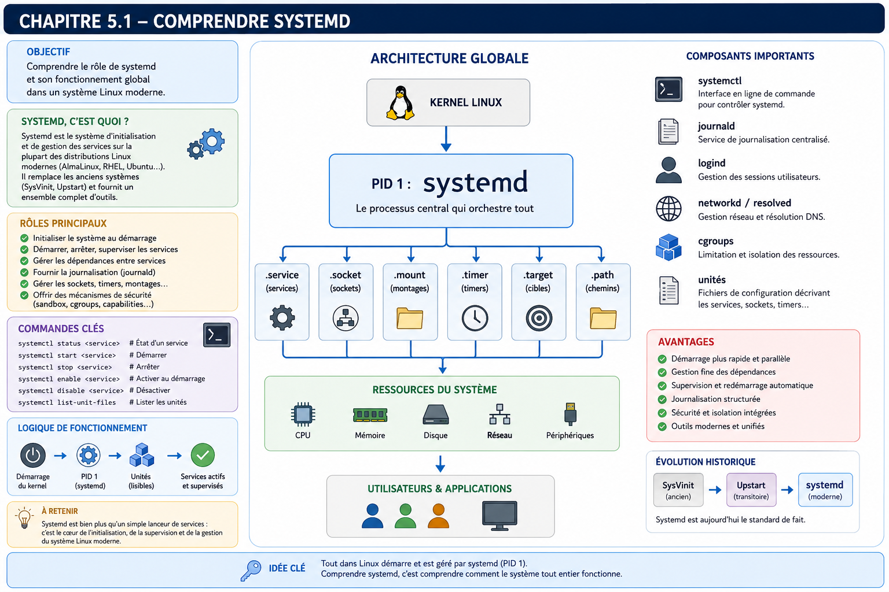

# Chapitre 5.1 — Comprendre systemd

> *« Un service n'est pas un programme qui tourne. C'est un composant dont tout le cycle de vie est maîtrisé. »*

---

# Vous êtes ici

```text
Partie I — Construire un socle sécurisé

Campagne 5 — Systemd et les services

    ► 5.1 Comprendre systemd
      5.2 Les unités (.service, .socket, .target…)
      5.3 Créer le service Sentinel
      5.4 Sandboxing systemd
      5.5 Capacités Linux
      5.6 Journalisation avec journald
      5.7 Supervision et redémarrage automatique
      5.8 Mission : rendre Sentinel résilient
```

---

# Objectifs pédagogiques

À la fin de ce chapitre, vous serez capable de :

- comprendre pourquoi systemd existe ;
- expliquer son rôle dans un système Linux moderne ;
- distinguer PID 1 d'un simple processus utilisateur ;
- comprendre pourquoi un démon n'est plus écrit aujourd'hui comme il l'était il y a vingt ans ;
- identifier les responsabilités exactes de systemd dans une infrastructure de production ;
- préparer Sentinel à devenir un véritable service système.

---

# Pourquoi ce chapitre existe

Jusqu'à présent, Sentinel est essentiellement une application Python.

Nous la lançons manuellement.

```bash
python3 sentinel.py
```

ou

```bash
./sentinel
```

Cette approche est parfaitement adaptée au développement.

Elle devient totalement insuffisante dès qu'une application doit fonctionner en production.

Une infrastructure professionnelle attend beaucoup plus d'un service.

Par exemple :

- démarrer automatiquement après un redémarrage ;
- s'arrêter proprement ;
- redémarrer après un crash ;
- produire des journaux ;
- limiter ses privilèges ;
- dépendre d'autres services ;
- être supervisé ;
- être mis à jour sans intervention manuelle.

Autrement dit, l'application ne suffit plus.

Il faut désormais gérer **son cycle de vie**.

C'est précisément le rôle de systemd.

---

# Théorie détaillée

## Avant systemd

Pour comprendre pourquoi systemd est devenu incontournable, il faut revenir quelques années en arrière.

Pendant longtemps, les distributions Linux utilisaient un système d'initialisation appelé **SysVinit**.

Le démarrage d'un serveur ressemblait à ceci :

```text
BIOS / UEFI

↓

Bootloader

↓

Noyau Linux

↓

init

↓

Scripts shell

↓

Services
```

Chaque service possédait généralement un script placé dans :

```text
/etc/init.d/
```

Par exemple :

```bash
/etc/init.d/httpd start
```

ou

```bash
service sshd start
```

Ces scripts étaient de simples scripts Shell.

Ils exécutaient généralement :

- quelques vérifications ;
- le lancement du démon ;
- parfois un `fork()`;
- parfois un fichier PID.

Cette approche a fonctionné pendant plusieurs décennies.

Mais les infrastructures ont profondément évolué.

---

## Les limites de SysVinit

Les premiers grands centres de données ont rapidement rencontré plusieurs difficultés.

### Dépendances

Prenons un exemple.

Sentinel dépend de :

- la pile réseau ;
- FreeIPA ;
- journald ;
- éventuellement Podman.

Comment garantir l'ordre de démarrage ?

Avec SysVinit :

```text
Script A

↓

Script B

↓

Script C
```

Le système reposait essentiellement sur :

- un ordre alphabétique ;
- des numéros ;
- quelques dépendances déclarées.

Les erreurs étaient fréquentes.

---

### Démarrage lent

Autre problème.

Les scripts étaient souvent exécutés séquentiellement.

```text
Service A

↓

attendre

↓

Service B

↓

attendre

↓

Service C
```

Même lorsque deux services étaient totalement indépendants.

Les machines multicœurs restaient largement sous-utilisées.

---

### Supervision

Supposons maintenant que Sentinel plante.

Qui redémarre le processus ?

Dans SysVinit :

souvent...

personne.

Il fallait :

- un cron ;
- un script externe ;
- ou une intervention humaine.

Aujourd'hui, ce comportement serait considéré comme inacceptable.

---

## L'arrivée de systemd

Systemd est apparu avec un objectif très clair.

Ne plus simplement démarrer les services.

Mais gérer **l'ensemble du système**.

Le changement de philosophie est majeur.

Avant :

```text
init

↓

Lancer les services
```

Aujourd'hui :

```text
systemd

↓

Décrire

↓

Orchestrer

↓

Superviser

↓

Isoler

↓

Journaliser

↓

Redémarrer

↓

Sécuriser
```

Systemd n'est plus un simple lanceur.

C'est un orchestrateur.

---

# PID 1

Sous Linux, tous les processus possèdent un identifiant appelé :

```text
PID
```

Le premier processus créé par le noyau est toujours :

```text
PID 1
```

Sur AlmaLinux moderne :

```text
PID 1

↓

systemd
```

On peut le vérifier.

```bash
ps -p 1
```

ou

```bash
ps -fp 1
```

Exemple :

```text
UID   PID  PPID  CMD

root    1     0  /usr/lib/systemd/systemd
```

Tout le reste du système dépend directement ou indirectement de lui.

---

## Pourquoi PID 1 est-il particulier ?

Le noyau possède un comportement spécifique vis-à-vis du processus numéro 1.

Si un processus ordinaire meurt :

le système continue.

Si PID 1 disparaît :

le système devient incapable de gérer correctement les processus.

Sur la plupart des distributions, cela conduit rapidement à un kernel panic ou à un état irrécupérable.

PID 1 possède donc des responsabilités très particulières.

---

# Une vision hiérarchique

Tous les processus Linux appartiennent à un arbre.

```text
systemd (PID 1)

├── sshd

├── NetworkManager

├── firewalld

├── crond

├── podman

├── rsyslog

└── Sentinel
```

Même lorsqu'un utilisateur ouvre une session SSH.

```text
systemd

↓

sshd

↓

bash

↓

python

↓

sentinel
```

Tous ces processus restent rattachés, directement ou indirectement, à PID 1.

Cette hiérarchie est essentielle pour comprendre :

- les signaux ;
- les groupes de contrôle (cgroups) ;
- la supervision ;
- l'arrêt du système.

---

# Systemd ne lance pas seulement des services

C'est une idée reçue très fréquente.

Systemd est responsable de nombreux composants.

Par exemple :

```text
journald
```

pour les journaux.

---

```text
logind
```

pour les sessions.

---

```text
networkd
```

pour certaines configurations réseau.

---

```text
resolved
```

pour la résolution DNS.

---

```text
tmpfiles
```

pour la gestion automatique des répertoires temporaires.

---

```text
timedated
```

pour la gestion de l'heure.

---

Autrement dit :

systemd est devenu une véritable plateforme.

Il dépasse largement le simple lancement de services.

---

# La philosophie déclarative

C'est probablement la caractéristique la plus importante de systemd.

Prenons une ancienne approche.

Un script Shell contenait :

```bash
Créer un répertoire.

Lancer le démon.

Créer un fichier PID.

Attendre.

Relancer si nécessaire.
```

Aujourd'hui, systemd demande simplement :

```text
Quel est l'état souhaité ?
```

Par exemple :

```text
Le service Sentinel

doit être

actif,

redémarré automatiquement,

après le réseau,

avec peu de privilèges,

et produire des journaux.
```

Systemd se charge ensuite d'atteindre cet état.

Cette approche est dite **déclarative**.

Elle sera omniprésente dans les prochains chapitres.

---
# Le fonctionnement interne de systemd

Pour comprendre la puissance de systemd, il faut abandonner une vision simpliste consistant à dire :

> *« systemd démarre des services. »*

En réalité, systemd est un **gestionnaire d'état**.

Il possède une représentation complète du système.

Pour lui, un serveur est un ensemble d'objets reliés entre eux.

Par exemple :

```text
                 Réseau

                    │

                    ▼

              NetworkManager

                    │

                    ▼

                firewalld

                    │

                    ▼

                 FreeIPA

                    │

                    ▼

                 Sentinel
```

Chaque composant possède :

- un état ;
- des dépendances ;
- des conditions ;
- un cycle de vie.

Systemd orchestre l'ensemble.

---

# Les unités (Units)

L'objet fondamental manipulé par systemd est appelé une **Unit**.

Une unité représente une ressource du système.

Contrairement à une idée reçue, une unité n'est pas forcément un service.

Il existe plusieurs dizaines de types d'unités.

Les plus importantes sont :

```text
.service
```

Un service.

Exemple :

```
sshd.service
```

---

```text
.socket
```

Une socket réseau.

---

```text
.mount
```

Un système de fichiers.

---

```text
.target
```

Un objectif de démarrage.

---

```text
.timer
```

Un planificateur.

---

```text
.path
```

Une surveillance de fichier.

---

```text
.device
```

Un périphérique.

---

Toutes ces ressources sont gérées par le même moteur.

Cette uniformité constitue l'une des grandes forces de systemd.

---

# Les dépendances

Supposons que Sentinel nécessite :

- le réseau ;
- FreeIPA ;
- journald.

Avec SysVinit, cette logique était souvent codée dans un script Shell.

Avec systemd, elle devient déclarative.

Conceptuellement :

```text
Sentinel

↓

After=network.target

↓

After=ipa.service

↓

Requires=network.target
```

Systemd calcule alors automatiquement l'ordre de démarrage.

L'administrateur décrit les relations.

Systemd construit le plan d'exécution.

---

# Les Jobs

Lorsqu'on demande :

```bash
systemctl start sentinel
```

systemd ne lance pas immédiatement Sentinel.

Il construit d'abord un **Job**.

Un Job est une action planifiée.

Par exemple :

```
Démarrer Sentinel
```

Mais systemd constate immédiatement :

```
Le réseau n'est pas prêt.
```

Il ajoute alors :

```
Démarrer NetworkManager
```

Puis :

```
Attendre network.target
```

Puis seulement :

```
Démarrer Sentinel
```

Autrement dit :

la commande demandée par l'utilisateur est transformée en un graphe d'actions.

---

# Les Targets

Une autre innovation majeure est la notion de **Target**.

Une Target représente un état souhaité du système.

Par exemple :

```text
multi-user.target
```

signifie :

```
Serveur opérationnel

sans interface graphique.
```

---

Autre exemple.

```text
graphical.target
```

correspond généralement à :

```
Système complet

avec interface graphique.
```

Une Target ne fait rien.

Elle regroupe simplement plusieurs unités.

Schématiquement :

```text
multi-user.target

├── sshd

├── firewalld

├── NetworkManager

├── chronyd

└── Sentinel
```

Lorsqu'une Target est atteinte,

tous les services qui lui sont associés doivent être opérationnels.

---

# Les cgroups

Nous arrivons maintenant à l'une des technologies les plus importantes de systemd.

Les **Control Groups**, ou **cgroups**.

Les cgroups permettent au noyau Linux de regrouper des processus.

Par exemple.

```
Sentinel
```

peut lancer :

- plusieurs threads ;
- plusieurs processus Python ;
- plusieurs workers.

Systemd ne voit pas uniquement le processus principal.

Il voit tout le groupe.

```text
systemd

↓

Sentinel.service

↓

Processus principal

↓

Worker 1

↓

Worker 2

↓

Worker 3
```

Cette vision de groupe change complètement la supervision.

---

# Pourquoi les cgroups sont révolutionnaires ?

Avant leur apparition,

arrêter proprement un démon pouvait être compliqué.

Le processus principal mourait.

Les processus fils continuaient parfois à tourner.

Ils devenaient :

```
Orphelins
```

ou

```
Zombies
```

Aujourd'hui :

```text
systemctl stop sentinel
```

entraîne l'arrêt du groupe complet.

Systemd connaît tous les processus appartenant au service.

Aucun processus ne reste oublié.

---

# Les ressources

Les cgroups permettent également de contrôler les ressources.

Par exemple :

```text
Mémoire maximale
```

```text
Nombre maximal de processus
```

```text
CPU
```

```text
Entrées/sorties disque
```

Autrement dit,

systemd n'est plus uniquement un lanceur.

Il devient également un superviseur de ressources.

Nous exploiterons ces fonctionnalités dans le chapitre consacré au sandboxing.

---

# Pourquoi écrire un démon est devenu beaucoup plus simple ?

Historiquement, un démon Linux devait réaliser lui-même de nombreuses opérations.

Par exemple :

- effectuer un `fork()`;
- détacher le terminal ;
- créer un fichier PID ;
- gérer les signaux ;
- parfois abandonner les privilèges Root avec `setuid()`;
- gérer ses propres journaux ;
- implémenter une logique de redémarrage.

Un démon ressemblait souvent à plusieurs centaines de lignes de code "infrastructure" avant même de commencer son véritable travail.

Aujourd'hui, cette philosophie a changé.

Le rôle de l'application est devenu beaucoup plus simple.

Sentinel devra essentiellement :

- écouter ;
- traiter des requêtes ;
- produire des événements.

Systemd prendra en charge :

- le lancement ;
- les dépendances ;
- le redémarrage ;
- la journalisation ;
- les limites de ressources ;
- les privilèges ;
- les cgroups ;
- les signaux d'arrêt.

Cette séparation des responsabilités rend les applications :

- plus simples ;
- plus robustes ;
- plus faciles à maintenir.

---

# L'arrêt propre d'un service

Un autre avantage souvent sous-estimé concerne l'arrêt des applications.

Supposons que l'on exécute :

```bash
systemctl stop sentinel
```

Systemd ne tue pas immédiatement le processus.

La séquence est généralement la suivante.

```text
systemctl stop

↓

SIGTERM

↓

Attente

↓

L'application termine son travail

↓

Fermeture des sockets

↓

Sauvegarde éventuelle

↓

Fin propre
```

Si le processus refuse de s'arrêter :

```text
Timeout

↓

SIGKILL
```

Cette différence est importante.

Une application bien écrite doit réagir correctement au signal `SIGTERM`.

Nous adapterons Sentinel dans ce sens lors des prochains chapitres.

---

# Pourquoi cela change notre manière de développer Sentinel ?

Jusqu'à présent, nous écrivions une application Python.

À partir de maintenant, nous allons écrire un **service système**.

Cette nuance est fondamentale.

Notre réflexion change complètement.

Nous ne nous demanderons plus uniquement :

> *« Mon code fonctionne-t-il ? »*

Nous nous demanderons également :

- démarre-t-il automatiquement ?
- survit-il à un crash ?
- produit-il des journaux exploitables ?
- peut-il être arrêté proprement ?
- peut-il être limité à certains privilèges ?
- est-il compatible avec une supervision ?
- peut-il être déployé automatiquement par Ansible ?

Autrement dit,

nous ne développons plus un programme.

Nous construisons un composant d'infrastructure.

---
# 💎 Le point d'expertise

## Systemd est un orchestrateur d'état, pas un lanceur de processus

Lorsqu'un administrateur découvre systemd, il retient souvent les commandes suivantes :

```bash
systemctl start
```

```bash
systemctl stop
```

```bash
systemctl restart
```

Cela donne l'impression que systemd est simplement un remplaçant de :

```bash
service
```

C'est une vision très réductrice.

Le véritable rôle de systemd consiste à maintenir le système dans **l'état souhaité**.

Prenons un exemple.

L'état désiré est :

```text
Sentinel

↓

Actif

↓

Après le réseau

↓

Avec TLS

↓

Journalisé

↓

Redémarré automatiquement

↓

Exécuté sous un utilisateur dédié

↓

Avec des privilèges limités
```

Systemd ne lance pas seulement Sentinel.

Il vérifie en permanence que cet état reste vrai.

Cette différence est fondamentale.

---

## PID 1 n'est pas un processus comme les autres

Tous les processus Linux héritent, directement ou indirectement, de PID 1.

Cela signifie que systemd possède une vision globale de l'ensemble du système.

Prenons un exemple.

```text
systemd

├── sshd

├── firewalld

├── chronyd

├── podman

├── Sentinel

└── journald
```

Cette vision lui permet :

- d'arrêter proprement un groupe complet de processus ;
- de connaître les dépendances ;
- de limiter les ressources ;
- de redémarrer uniquement ce qui doit l'être.

Cette capacité n'existe pas lorsqu'une application est simplement lancée avec :

```bash
python sentinel.py
```

---

## La disparition du code "infrastructure"

Pendant longtemps, les développeurs de démons Linux devaient écrire énormément de code qui n'avait rien à voir avec leur métier.

Par exemple :

```text
fork()

↓

setsid()

↓

Création PID

↓

Gestion des signaux

↓

Drop des privilèges

↓

Rotation des logs

↓

Restart
```

Aujourd'hui, ce code disparaît progressivement.

Il est remplacé par une unité systemd.

Le résultat est remarquable.

L'application se concentre uniquement sur sa mission.

Le système d'exploitation prend en charge l'infrastructure.

Cette séparation est comparable à celle qui existe entre :

- Python et son interpréteur ;
- Kubernetes et les conteneurs ;
- FreeIPA et les comptes locaux.

Chaque composant se concentre sur son domaine d'expertise.

---

## Pourquoi cela améliore la sécurité

Plus une application contient de code d'infrastructure,

plus elle risque d'introduire des erreurs.

Prenons un exemple.

Une application implémente elle-même :

- son mécanisme de redémarrage ;
- sa rotation de logs ;
- son changement d'utilisateur ;
- son sandbox.

Chaque fonctionnalité représente plusieurs centaines de lignes de code supplémentaires.

Autant de possibilités de bogues.

En confiant ces responsabilités à systemd,

nous utilisons un composant :

- extrêmement testé ;
- utilisé sur des millions de serveurs ;
- audité depuis plus d'une décennie.

Le meilleur code de sécurité est souvent celui que l'on n'a pas besoin d'écrire.

---

# 🧠 Comment pense un architecte ?

Un architecte ne réfléchit pas en termes de processus.

Il réfléchit en termes de **services**.

La nuance paraît subtile.

Elle change pourtant complètement la conception.

Prenons Sentinel.

Le développeur voit :

```text
Programme Python
```

L'architecte voit :

```text
Service métier
```

Ce service possède :

- une disponibilité attendue ;
- des dépendances ;
- un niveau de criticité ;
- des contraintes de sécurité ;
- une supervision ;
- un cycle de mise à jour.

L'application n'est qu'un détail d'implémentation.

---

## Les dépendances doivent être explicites

Un service qui dépend implicitement d'un autre finit toujours par provoquer des incidents.

Prenons un exemple.

Sentinel démarre.

FreeIPA n'est pas encore disponible.

Deux comportements sont possibles.

Premier cas.

L'application plante.

Deuxième cas.

Systemd attend simplement que FreeIPA soit opérationnel.

L'architecte privilégie toujours la seconde approche.

Les dépendances doivent être déclarées,

jamais supposées.

---

## Les services doivent être remplaçables

Imaginons que Sentinel soit entièrement réécrit en Rust dans quelques années.

La politique de sécurité devrait-elle changer ?

Non.

L'unité systemd devrait conserver :

- le même nom ;
- les mêmes dépendances ;
- les mêmes contraintes ;
- la même supervision.

Le langage n'est pas l'architecture.

Cette séparation facilite énormément les évolutions futures.

---

# ⚔️ Comment pense un attaquant ?

Un attaquant sait que de nombreuses applications maison sont exécutées ainsi.

```bash
python mon_application.py &
```

Puis plus rien.

Pas de supervision.

Pas de journalisation.

Pas de redémarrage.

Pas de limitation mémoire.

Pas de restrictions de privilèges.

Ces applications représentent souvent des cibles privilégiées.

---

## Les processus orphelins

Supposons qu'un service démarre plusieurs processus.

L'administrateur tue uniquement le processus principal.

Des processus secondaires continuent d'exécuter du code.

Ces situations existaient fréquemment avant les cgroups.

Aujourd'hui,

systemd suit l'ensemble du groupe.

Cette évolution réduit considérablement les comportements imprévisibles.

---

## Les privilèges excessifs

Beaucoup de services historiques continuaient à fonctionner en tant que :

```text
root
```

simplement parce qu'ils avaient besoin d'ouvrir un port privilégié au démarrage.

Une fois ce port ouvert,

ils oubliaient parfois de perdre leurs privilèges.

Systemd permet aujourd'hui de déléguer cette logique de manière beaucoup plus propre.

Nous approfondirons ce mécanisme dans les chapitres consacrés :

- aux capacités Linux ;
- au sandboxing.

---

# 🏢 En entreprise

Dans un environnement professionnel,

presque aucun service critique n'est lancé manuellement.

Prenons un exemple.

Le serveur Sentinel redémarre à 3 heures du matin après une mise à jour du noyau.

Personne n'est connecté.

Pourtant,

quelques secondes plus tard,

l'ensemble des composants reviennent automatiquement.

```text
NetworkManager

↓

firewalld

↓

FreeIPA

↓

Sentinel

↓

Supervision
```

Aucune intervention humaine.

Cette automatisation constitue l'un des fondements de l'exploitation moderne.

---

## Les unités sont du code

Les entreprises les plus matures considèrent désormais les fichiers :

```text
.service
```

comme du code.

Ils sont :

- versionnés dans Git ;
- relus ;
- testés ;
- validés ;
- déployés automatiquement.

Modifier une unité systemd directement sur un serveur de production est souvent interdit.

La modification passe d'abord par :

- une revue ;
- un pipeline CI/CD ;
- Ansible.

Cette approche garantit que tous les serveurs restent homogènes.

---

# 📚 Culture technique

Lorsque systemd a été introduit,

il a suscité d'importants débats dans la communauté Linux.

Pourquoi ?

Parce qu'il ne se limitait plus au rôle traditionnel d'init.

Il intégrait progressivement :

- la journalisation (`journald`) ;
- la gestion des connexions (`logind`) ;
- certains aspects du réseau (`networkd`, `resolved`) ;
- la synchronisation horaire (`timesyncd`) ;
- les périphériques (`udev`, désormais intégré).

Certains y voyaient une concentration excessive de responsabilités.

D'autres considéraient qu'un système moderne avait besoin d'un orchestrateur central capable de coordonner ces composants.

Aujourd'hui, quelle que soit l'opinion que l'on puisse avoir sur cette évolution, systemd est devenu le standard de fait de la quasi-totalité des distributions Linux destinées aux serveurs, notamment AlmaLinux, RHEL, Rocky Linux, Fedora, Debian, Ubuntu, SUSE et bien d'autres.

Dans ce manuel, nous ne cherchons pas à défendre un choix historique.

Nous cherchons à maîtriser l'outil réellement utilisé dans les infrastructures professionnelles actuelles.

---

# ⚠️ Piège classique

## Croire qu'un programme lancé en arrière-plan est un service

Beaucoup d'applications internes sont encore démarrées ainsi :

```bash
nohup python sentinel.py &
```

ou

```bash
./sentinel &
```

Techniquement,

cela fonctionne.

Mais ce n'est pas un service au sens de systemd.

Il manque notamment :

- un cycle de vie ;
- une supervision ;
- une intégration avec les journaux ;
- une politique de redémarrage ;
- une gestion des dépendances ;
- un contrôle des ressources ;
- une intégration avec le reste du système.

Un véritable service est un citoyen du système d'exploitation.

Pas simplement un processus exécuté en arrière-plan.

---
# Laboratoire AlmaLinux / Kali

## Objectif

Transformer Sentinel, actuellement lancé comme une simple application Python, en un véritable service système intégré à l'environnement AlmaLinux.

À la fin de ce laboratoire, vous devrez être capable de :

- identifier les services déjà présents sur un système ;
- comprendre leur cycle de vie ;
- observer leurs dépendances ;
- distinguer un processus d'un service systemd ;
- préparer Sentinel à être intégré dans systemd au chapitre suivant.

---

## Architecture

```text
                         AlmaLinux

                         systemd (PID 1)
                               │
      ┌───────────────┬─────────┴──────────────┬──────────────┐
      ▼               ▼                        ▼              ▼
 NetworkManager   firewalld               sshd.service   chronyd
                                              │
                                              ▼
                                          Sessions SSH
                                              │
                                              ▼
                                         Administrateur
                                              │
                                              ▼
                                   python3 sentinel.py
```

À ce stade du manuel, Sentinel n'est **pas encore** un service systemd.

C'est précisément ce qui va évoluer dans cette campagne.

---

# Étape 1 — Identifier PID 1

Afficher le processus numéro 1.

```bash
ps -fp 1
```

Comparer également avec :

```bash
pstree -p
```

Repérer :

- systemd ;
- ses principaux services ;
- la hiérarchie des processus.

---

# Étape 2 — Explorer les unités

Lister quelques unités.

```bash
systemctl list-units
```

Puis uniquement les services.

```bash
systemctl list-units --type=service
```

Identifier notamment :

- sshd
- firewalld
- chronyd
- NetworkManager

Essayez d'imaginer les dépendances entre eux.

---

# Étape 3 — Observer un service

Choisissez par exemple :

```bash
systemctl status firewalld
```

Observer attentivement :

- l'état Active ;
- le PID principal ;
- les journaux récents ;
- le chemin de l'unité.

Réalisez le même exercice avec :

```bash
systemctl status sshd
```

Comparez les deux sorties.

---

# Étape 4 — Observer l'arbre des processus

Afficher :

```bash
pstree -p
```

Repérez :

```text
systemd

↓

sshd

↓

bash

↓

python
```

Lancez ensuite un petit programme Python.

Observez où il apparaît dans l'arbre.

Répondez à la question suivante :

> Pourquoi n'est-il pas considéré comme un service systemd ?

---

# Étape 5 — Étudier les dépendances

Afficher :

```bash
systemctl list-dependencies multi-user.target
```

Identifier :

- quels services démarrent automatiquement ;
- lesquels sont indispensables ;
- lesquels semblent liés au réseau.

L'objectif n'est pas de tout mémoriser.

Il est de comprendre que systemd raisonne sous forme de graphe de dépendances.

---

# Étape 6 — Observer les journaux

Afficher les journaux d'un service.

Par exemple :

```bash
journalctl -u firewalld
```

Puis :

```bash
journalctl -u sshd
```

Comparer avec :

```bash
journalctl -b
```

Réfléchissez :

Pourquoi est-il intéressant que les journaux soient directement associés au service ?

---

# Étape 7 — Réflexion

Imaginez maintenant Sentinel en production.

Listez toutes les fonctionnalités que systemd pourrait lui apporter sans modifier une seule ligne de code Python.

Par exemple :

- démarrage automatique ;
- redémarrage après un crash ;
- journalisation ;
- dépendances ;
- limitation mémoire ;
- etc.

Cette liste servira de cahier des charges pour le chapitre suivant.

---

# Mission d'ingénieur

## Contexte

Votre entreprise exploite plusieurs applications internes développées au fil des années.

Chaque équipe a adopté sa propre méthode de lancement.

Certains utilisent :

```bash
nohup application &
```

D'autres :

```bash
screen
```

D'autres encore :

```bash
tmux
```

Certaines applications sont même lancées depuis :

```bash
rc.local
```

ou directement depuis des scripts Bash.

Les conséquences sont nombreuses :

- aucune homogénéité ;
- supervision difficile ;
- journalisation disparate ;
- arrêt parfois brutal des applications ;
- redémarrage manuel après incident ;
- forte dépendance aux administrateurs historiques.

La direction souhaite normaliser l'exploitation de toutes les applications.

---

## Votre mission

Vous devez proposer une stratégie de migration vers systemd.

Votre proposition devra répondre notamment aux questions suivantes.

- Quels services migrer en priorité ?
- Quels bénéfices immédiats attendre ?
- Quels risques faut-il anticiper ?
- Comment accompagner les équipes de développement ?
- Quels contrôles mettre en place avant la mise en production ?

Votre réponse devra montrer que systemd constitue une évolution d'architecture, et non un simple changement de commandes.

---

# Impact sur Sentinel

Jusqu'à présent, Sentinel était un programme.

À partir de maintenant, il devient progressivement un **service système**.

Cette évolution est déterminante.

Avant :

```text
Utilisateur

↓

python sentinel.py
```

Après :

```text
systemd

↓

Sentinel.service

↓

Supervision

↓

Journalisation

↓

Sécurité

↓

Haute disponibilité
```

Ce changement influencera directement tous les chapitres suivants.

Le service Sentinel pourra alors bénéficier :

- des cgroups ;
- du sandboxing ;
- des capacités Linux ;
- de `journald` ;
- des politiques de redémarrage ;
- d'Ansible ;
- du packaging RPM.

Autrement dit,

tout l'écosystème Linux moderne devient disponible.

---

# Ce qu'il faut retenir

- Systemd est le processus **PID 1** d'AlmaLinux.
- Il ne lance pas simplement des services : il orchestre l'état du système.
- Les unités constituent les objets fondamentaux manipulés par systemd.
- Les dépendances sont déclaratives et non codées dans des scripts Shell.
- Les cgroups permettent de superviser un groupe complet de processus.
- Les applications modernes délèguent à systemd la gestion du cycle de vie.
- Un programme lancé en arrière-plan n'est pas un véritable service système.
- Sentinel évoluera progressivement pour exploiter pleinement les capacités offertes par systemd.

---

# Grande infographie de révision du chapitre

```text
┌────────────────────────────────────────────────────────────────────────────────────────────┐
│                     CHAPITRE 5.1 — COMPRENDRE SYSTEMD                                      │
├────────────────────────────────────────────────────────────────────────────────────────────┤
│                                                                                            │
│                         SYSTEMD = ORCHESTRATEUR DU SYSTÈME                                 │
│                                                                                            │
├────────────────────────────────────────────────────────────────────────────────────────────┤
│                                                                                            │
│                         Démarrage d'un serveur AlmaLinux                                   │
│                                                                                            │
│      BIOS / UEFI                                                                           │
│            │                                                                               │
│            ▼                                                                               │
│      Bootloader (GRUB)                                                                     │
│            │                                                                               │
│            ▼                                                                               │
│      Noyau Linux                                                                           │
│            │                                                                               │
│            ▼                                                                               │
│      systemd (PID 1)                                                                       │
│            │                                                                               │
│    ┌───────┼──────────┬──────────┬───────────┬─────────────┐                               │
│    ▼       ▼          ▼          ▼           ▼             ▼                               │
│ firewalld sshd   NetworkMgr  journald   chronyd      Sentinel.service                      │
│                                                                                            │
├────────────────────────────────────────────────────────────────────────────────────────────┤
│                                                                                            │
│                           LES RESPONSABILITÉS DE SYSTEMD                                   │
│                                                                                            │
│ ✓ Démarrer les services                                                                    │
│ ✓ Arrêter proprement                                                                       │
│ ✓ Superviser les processus                                                                 │
│ ✓ Gérer les dépendances                                                                    │
│ ✓ Journaliser (journald)                                                                   │
│ ✓ Redémarrer automatiquement                                                               │
│ ✓ Gérer les cgroups                                                                        │
│ ✓ Préparer le sandboxing                                                                   │
│                                                                                            │
├────────────────────────────────────────────────────────────────────────────────────────────┤
│                                                                                            │
│                     PROCESSUS VS SERVICE                                                   │
│                                                                                            │
│ python sentinel.py                  Sentinel.service                                       │
│        │                                   │                                               │
│        ▼                                   ▼                                               │
│ Processus isolé                 Objet systemd complet                                      │
│        │                                   │                                               │
│ Pas de supervision          Dépendances + Restart + Logs + Sécurité                        │
│                                                                                            │
├────────────────────────────────────────────────────────────────────────────────────────────┤
│                                                                                            │
│                          DÉFENSE EN PROFONDEUR                                             │
│                                                                                            │
│ Firewalld → systemd → Sentinel → TLS → FreeIPA → SELinux → Application                     │
│                                                                                            │
├────────────────────────────────────────────────────────────────────────────────────────────┤
│                                                                                            │
│ Réflexes d'ingénieur                                                                       │
│                                                                                            │
│ ✓ Décrire l'état souhaité                                                                  │
│ ✓ Déclarer les dépendances                                                                 │
│ ✓ Considérer les unités comme du code                                                      │
│ ✓ Utiliser systemd plutôt que des scripts maison                                           │
│ ✓ Concevoir des services, pas seulement des programmes                                     │
│                                                                                            │
├────────────────────────────────────────────────────────────────────────────────────────────┤
│                                                                                            │
│                       PHRASE À RETENIR                                                     │
│                                                                                            │
│ « Une application devient un service lorsqu'elle confie son cycle de vie                   │
│  au système d'exploitation plutôt qu'à son propre code. »                                  │
│                                                                                            │
└────────────────────────────────────────────────────────────────────────────────────────────┘
```



---

# Transition vers le chapitre suivant

Maintenant que nous comprenons **ce qu'est systemd**, nous allons étudier **le langage qu'il utilise**.

Contrairement à SysVinit, systemd ne manipule pas uniquement des services. Il orchestre une grande variété d'objets appelés **unités** (*Units*).

Le chapitre **5.2 — Les unités (.service, .socket, .target, .timer…)** nous permettra de découvrir ces différents types d'unités, leurs interactions et la manière dont elles composent une architecture de services moderne. C'est à partir de ces briques que nous construirons ensuite **Sentinel.service**.
