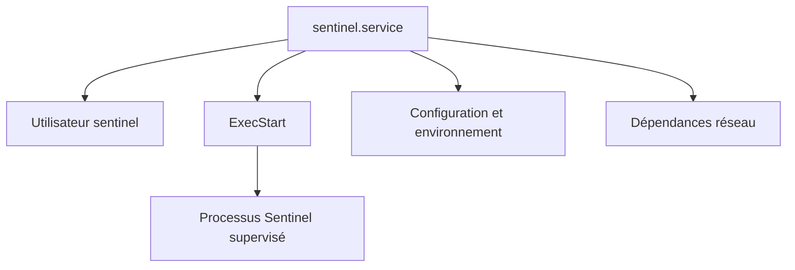
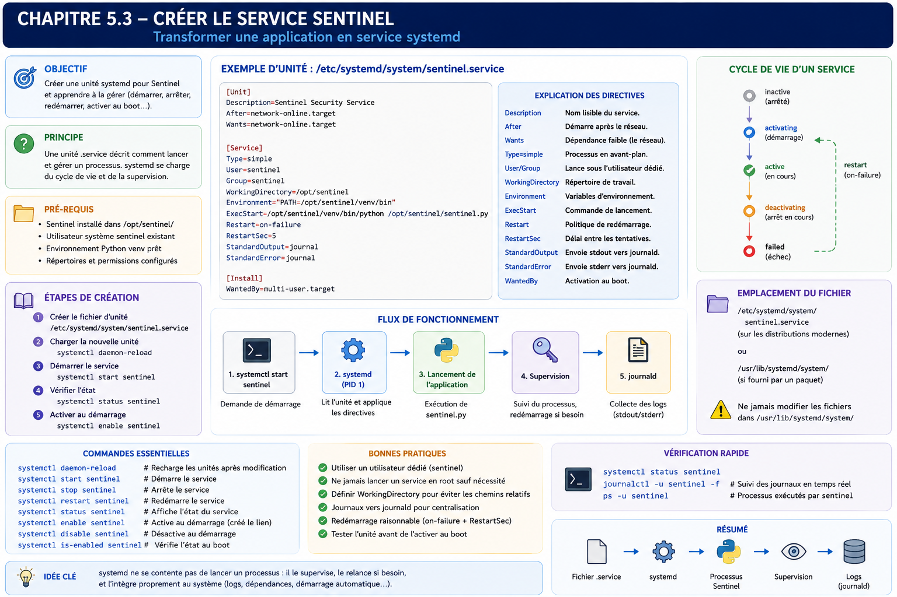

# Chapitre 5.3 — Créer le service Sentinel

> **Campagne 5 — systemd et services**

> *« Une application devient réellement exploitable lorsqu'elle peut être installée, démarrée, arrêtée, supervisée et reconstruite automatiquement, sans intervention humaine. »*

---

## Vous êtes ici

```text
Partie I — Construire un socle sécurisé

Campagne 5 — Systemd et les services

      5.1 Comprendre systemd
      5.2 Les unités (.service, .socket, .target…)
    ► 5.3 Créer le service Sentinel
      5.4 Sandboxing systemd
      5.5 Capacités Linux
      5.6 Journalisation avec journald
      5.7 Supervision et redémarrage automatique
      5.8 Mission : rendre Sentinel résilient
```

---

## Objectifs pédagogiques

À la fin de ce chapitre, vous serez capable de :

- créer un véritable service systemd ;
- comprendre chacune des sections d'une unité `.service` ;
- choisir les directives adaptées à une application serveur ;
- intégrer Sentinel dans le cycle de vie du système ;
- préparer le service aux futurs mécanismes de sandboxing, de supervision et de durcissement.

---

## Pourquoi ce chapitre existe

Jusqu'à présent, Sentinel est exécuté manuellement.

```bash
python3 sentinel.py
```

ou

```bash
./sentinel
```

Cette méthode suffit pendant le développement.

Elle devient rapidement problématique en production.

Imaginons quelques situations.

Le serveur redémarre pendant la nuit.

Qui relance Sentinel ?

---

Un administrateur quitte son terminal SSH.

L'application continue-t-elle de fonctionner ?

---

Le processus se termine brutalement.

Comment détecter le problème ?

---

Les journaux sont-ils correctement centralisés ?

---

Comment savoir précisément :

- quand le service a démarré ;
- sous quel utilisateur ;
- avec quelles options ;
- combien de fois il a redémarré ?

Une application de production doit répondre à toutes ces questions.

Le simple fait d'exécuter un binaire ne suffit plus.

Nous allons maintenant transformer Sentinel en un **service système**.

---

## Théorie détaillée

### La philosophie

Avant d'écrire la moindre ligne,

prenons un instant pour réfléchir.

Que doit savoir systemd ?

Il doit connaître :

- le nom du service ;
- son rôle ;
- le programme à lancer ;
- son utilisateur ;
- son groupe ;
- ses dépendances ;
- son comportement à l'arrêt ;
- son comportement après un crash.

Autrement dit,

une unité décrit **le contrat d'exploitation** de l'application.

---

## Où créer l'unité ?

Comme vu dans le chapitre précédent,

nous placerons notre fichier dans :

```text
/etc/systemd/system/
```

Nous obtenons donc :



Pourquoi ici ?

Parce que Sentinel est une application développée par l'entreprise.

Elle ne provient pas d'un paquet système AlmaLinux.

Plus tard,

lorsque Sentinel sera distribué sous forme de RPM,

nous déplacerons naturellement cette unité dans :

```text
/usr/lib/systemd/system/
```

Le paquet installera automatiquement le fichier.

Pour le moment,

nous travaillons encore comme développeurs.

---

## Structure d'une unité

Une unité comporte généralement trois sections.

```ini
[Unit]

...

[Service]

...

[Install]

...
```

Chacune possède une responsabilité bien précise.

---

## La section `[Unit]`

Cette première section décrit l'identité du service.

Par exemple.

```ini
[Unit]

Description=Sentinel Security Platform

Documentation=https://sentinel.example

After=network-online.target

Wants=network-online.target
```

On remarque immédiatement plusieurs informations.

Le service :

- possède une description ;
- référence sa documentation ;
- dépend du réseau.

Cette section ne contient encore aucune information sur l'application elle-même.

Elle décrit uniquement son contexte.

---

### Pourquoi `network-online.target` ?

Beaucoup d'administrateurs utilisent :

```ini
After=network.target
```

sans réellement connaître la différence.

Pourtant,

elle est importante.

`network.target` signifie essentiellement :

> Le sous-système réseau est démarré.

Cela ne garantit pas que les interfaces disposent déjà d'une connectivité.

À l'inverse,

`network-online.target` indique que le réseau est considéré comme opérationnel.

Pour un service comme Sentinel,

qui communique immédiatement avec :

- FreeIPA ;
- des agents ;
- une base de données éventuelle ;

ce choix est généralement plus pertinent.

---

## La section `[Service]`

Nous arrivons au cœur de l'unité.

Exemple minimal.

```ini
[Service]

Type=simple

ExecStart=/opt/sentinel/bin/sentinel

User=sentinel

Group=sentinel
```

Chaque directive mérite une explication.

---

### `Type=simple`

C'est le type le plus courant.

Il signifie simplement :

```text
Le processus lancé

est

le service.
```

Autrement dit,

systemd considère que le service est démarré dès que le processus existe.

Pour une application Python moderne,

c'est généralement le bon choix.

Nous reviendrons plus tard sur :

- `notify`
- `forking`
- `oneshot`
- `idle`

qui répondent à des besoins particuliers.

---

### `ExecStart`

La directive la plus célèbre.

```ini
ExecStart=/opt/sentinel/bin/sentinel
```

Elle indique le programme principal.

Une erreur fréquente consiste à vouloir écrire :

```ini
ExecStart=/bin/bash -c "..."
```

Cette approche doit rester exceptionnelle.

Systemd est capable de lancer directement l'application.

Il est préférable d'éviter les couches inutiles.

---

### `User`

Pendant longtemps,

de nombreux services Linux fonctionnaient sous :

```text
root
```

Aujourd'hui,

cette pratique est largement déconseillée.

Nous créerons un utilisateur dédié.

```text
sentinel
```

Puis :

```ini
User=sentinel
```

Ainsi,

même si l'application est compromise,

l'attaquant ne récupère pas immédiatement les privilèges administrateur.

Cette décision constitue l'une des mesures de sécurité les plus importantes du chapitre.

---

### `Group`

Même logique.

```ini
Group=sentinel
```

L'application fonctionne avec :

- un utilisateur dédié ;
- un groupe dédié.

Cette séparation facilitera ensuite :

- les permissions ;
- SELinux ;
- les capacités Linux ;
- le sandboxing.

---

## Une première unité complète

Nous obtenons désormais :

```ini
[Unit]

Description=Sentinel Security Platform

After=network-online.target

Wants=network-online.target

[Service]

Type=simple

ExecStart=/opt/sentinel/bin/sentinel

User=sentinel

Group=sentinel

[Install]

WantedBy=multi-user.target
```

Ce fichier est volontairement très simple.

Pourtant,

il suffit déjà à transformer Sentinel en véritable service systemd.

Les prochains chapitres viendront progressivement enrichir cette unité.

---

## La section `[Install]`

Elle est souvent mal comprise.

Prenons :

```ini
WantedBy=multi-user.target
```

Cette directive ne sert absolument pas au démarrage immédiat.

Elle indique uniquement :

> Lorsque le service est **activé** (`enable`), il doit être rattaché à cette Target.

Concrètement,

```bash
systemctl enable sentinel
```

créera un lien symbolique vers :

```text
multi-user.target.wants/
```

Cette distinction est importante.

`enable`

et

`start`

répondent à deux besoins totalement différents.

---

## Création de l'utilisateur Sentinel

Avant de démarrer le service,

l'utilisateur doit exister.

Par exemple.

```bash
useradd \
--system \
--home /var/lib/sentinel \
--shell /sbin/nologin \
sentinel
```

Plusieurs éléments méritent d'être commentés.

`--system`

crée un compte système.

---

Le répertoire personnel pourra accueillir :

- la configuration ;
- des données ;
- certains certificats.

---

Le shell :

```text
/sbin/nologin
```

interdit toute connexion interactive.

L'utilisateur existe uniquement pour exécuter l'application.

Cette approche est conforme au principe du moindre privilège.

---
## Construire une unité professionnelle

L'unité que nous avons écrite est volontairement minimaliste.

Elle fonctionne.

Mais elle ne répond pas encore aux exigences d'une exploitation professionnelle.

Une application de production possède généralement des besoins supplémentaires.

Par exemple :

- définir un répertoire de travail ;
- charger des variables d'environnement ;
- gérer proprement les arrêts ;
- redémarrer automatiquement après un incident ;
- limiter les délais d'arrêt ;
- distinguer les différents codes de retour.

Nous allons enrichir progressivement notre unité.

---

## Le répertoire de travail

Prenons un exemple.

Sentinel utilise plusieurs fichiers :

```text
configuration.yml

↓

certificats/

↓

plugins/

↓

logs/
```

Ces chemins peuvent être relatifs.

Systemd permet de définir explicitement le répertoire de travail.

```ini
WorkingDirectory=/var/lib/sentinel
```

Ainsi,

tous les chemins relatifs utilisés par l'application deviennent cohérents.

Cette directive évite de nombreuses erreurs lors des déploiements.

---

## Les variables d'environnement

Une application moderne est rarement entièrement configurée par sa ligne de commande.

Elle utilise souvent des variables d'environnement.

Exemple.

```ini
Environment=SENTINEL_ENV=production
```

ou

```ini
Environment=PYTHONUNBUFFERED=1
```

La seconde directive est particulièrement intéressante pour une application Python.

Elle désactive le buffering standard.

Les journaux apparaissent immédiatement dans `journald`, sans attendre le remplissage du tampon.

Pour une application serveur,

c'est généralement le comportement recherché.

---

### Les fichiers d'environnement

Plutôt que de multiplier les directives :

```ini
Environment=
```

systemd permet également d'utiliser un fichier dédié.

```ini
EnvironmentFile=/etc/sysconfig/sentinel
```

Ce fichier peut contenir :

```bash
SENTINEL_PORT=8443

SENTINEL_LOG_LEVEL=INFO

SENTINEL_DATA=/var/lib/sentinel
```

Cette approche présente plusieurs avantages.

Le fichier de service reste stable.

La configuration devient indépendante du cycle de vie du service.

Cette séparation sera particulièrement utile lorsque Sentinel sera distribué sous forme de RPM.

---

## Les commandes avant démarrage

Il arrive qu'une application nécessite quelques opérations préparatoires.

Par exemple :

- vérifier un certificat ;
- créer un répertoire ;
- contrôler un fichier de configuration ;
- attendre une ressource.

Systemd propose plusieurs directives.

La plus utilisée est :

```ini
ExecStartPre=
```

Exemple.

```ini
ExecStartPre=/usr/bin/test -f /etc/sentinel/config.yml
```

Si cette commande échoue,

le service ne démarre pas.

Cette possibilité est souvent préférable à une vérification réalisée directement dans le code de l'application.

Pourquoi ?

Parce qu'elle est visible,

documentée

et intégrée au cycle de vie systemd.

---

## Les commandes après démarrage

Autre possibilité.

```ini
ExecStartPost=
```

Elle permet par exemple :

- d'enregistrer un état ;
- d'envoyer une notification ;
- de déclencher une supervision.

Attention toutefois.

Une unité ne doit pas devenir un script Bash complexe.

Ces commandes doivent rester simples.

---

## L'arrêt propre

Nous avons déjà vu que systemd envoie généralement :

```text
SIGTERM
```

Avant :

```text
SIGKILL
```

L'application doit donc être capable :

- de fermer ses sockets ;
- de terminer les traitements en cours ;
- de libérer les ressources.

Systemd permet également d'exécuter une commande spécifique avant l'arrêt.

```ini
ExecStop=
```

Cette directive reste relativement rare.

Elle est surtout utile lorsque l'arrêt nécessite une action explicite.

Dans le cas de Sentinel,

nous privilégierons une gestion correcte du signal `SIGTERM`.

---

## Le redémarrage automatique

C'est probablement la directive la plus utilisée.

```ini
Restart=on-failure
```

Cette ligne paraît anodine.

Elle change pourtant profondément le comportement du service.

Sans elle :

```text
Crash

↓

Service arrêté
```

Avec elle :

```text
Crash

↓

systemd détecte l'échec

↓

Redémarrage automatique
```

Cette fonctionnalité améliore considérablement la disponibilité.

---

### Les différentes politiques de redémarrage

Systemd propose plusieurs stratégies.

#### `no`

Jamais de redémarrage.

---

#### `always`

Toujours redémarrer,

même après un arrêt volontaire.

Ce comportement est rarement adapté à un serveur.

---

#### `on-success`

Redémarrer uniquement si le programme s'est terminé correctement.

Cas d'usage très particulier.

---

#### `on-failure`

Le choix le plus courant.

Le service est relancé uniquement après :

- un crash ;
- un signal anormal ;
- un code de retour indiquant une erreur.

C'est généralement la stratégie retenue pour les applications serveur.

---

## Éviter les boucles infinies

Imaginons une erreur de configuration.

Sentinel démarre.

Il plante immédiatement.

Systemd redémarre.

Il replante.

Le cycle continue.

Pour éviter ce phénomène,

plusieurs directives existent.

Par exemple :

```ini
RestartSec=5
```

Systemd attendra cinq secondes avant une nouvelle tentative.

Ce délai limite :

- la consommation CPU ;
- le bruit dans les journaux ;
- les boucles de redémarrage.

---

## Les délais d'arrêt

Prenons un scénario.

Sentinel traite actuellement plusieurs centaines de connexions TLS.

L'administrateur exécute :

```bash
systemctl stop sentinel
```

L'application a besoin de quelques secondes pour :

- terminer les traitements ;
- fermer les sockets ;
- enregistrer son état.

Systemd attend.

Pendant combien de temps ?

La réponse est donnée par :

```ini
TimeoutStopSec=30
```

Si le délai est dépassé,

systemd considère que le service refuse de s'arrêter.

Le comportement normal devient alors :

```text
SIGTERM

↓

Attente

↓

Timeout

↓

SIGKILL
```

Cette directive doit être choisie avec soin.

Un délai trop court peut interrompre brutalement des traitements.

Un délai trop long peut ralentir les opérations d'exploitation.

---

## KillMode

Voici une directive très peu connue,

mais particulièrement importante.

```ini
KillMode=
```

Elle détermine quels processus seront arrêtés.

Par défaut,

systemd utilise généralement :

```text
control-group
```

Autrement dit,

l'ensemble des processus appartenant au cgroup du service est arrêté.

Pour Sentinel,

ce comportement est généralement celui attendu.

Si plusieurs workers Python sont lancés,

ils seront tous arrêtés proprement.

Cette directive illustre parfaitement l'intérêt des cgroups étudiés dans le chapitre précédent.

---

## Le fichier de service évolue

Notre unité ressemble désormais à ceci.

```ini
[Unit]

Description=Sentinel Security Platform

After=network-online.target

Wants=network-online.target

[Service]

Type=simple

User=sentinel

Group=sentinel

WorkingDirectory=/var/lib/sentinel

EnvironmentFile=/etc/sysconfig/sentinel

ExecStart=/opt/sentinel/bin/sentinel

Restart=on-failure

RestartSec=5

TimeoutStopSec=30

[Install]

WantedBy=multi-user.target
```

Cette unité reste volontairement sobre.

Pourtant,

elle répond déjà à de nombreux besoins d'exploitation.

Dans les chapitres suivants,

nous y ajouterons progressivement :

- le sandboxing ;
- les capacités Linux ;
- les restrictions de sécurité ;
- les limites de ressources.

L'unité évoluera au même rythme que Sentinel.

---
## Les rechargements de configuration

Toutes les applications ne réagissent pas de la même manière lorsqu'un administrateur modifie leur configuration.

Prenons quelques exemples.

### Cas n°1

L'application doit être entièrement redémarrée.

```text
Modification

↓

Restart

↓

Nouvelle configuration
```

---

### Cas n°2

L'application sait relire son fichier de configuration.

```text
Modification

↓

Reload

↓

Configuration appliquée

↓

Connexions conservées
```

Cette seconde approche est souvent préférable.

Elle limite les interruptions de service.

Systemd permet d'intégrer ce comportement.

---

## ExecReload

Une unité peut définir une commande spécifique de rechargement.

Par exemple :

```ini
ExecReload=/bin/kill -HUP $MAINPID
```

Ici,

systemd envoie le signal :

```text
SIGHUP
```

au processus principal.

L'application décide ensuite :

- de relire sa configuration ;
- de recharger ses certificats ;
- de rouvrir certains fichiers ;
- de poursuivre son exécution.

Pour Sentinel,

nous implémenterons progressivement cette fonctionnalité.

L'objectif sera de pouvoir modifier :

- certains paramètres ;
- les niveaux de journalisation ;
- certains certificats ;

sans interrompre le service.

---

## Les signaux

Systemd s'appuie largement sur les signaux Unix.

Les principaux sont :

```text
SIGTERM
```

Arrêt propre.

---

```text
SIGKILL
```

Arrêt immédiat.

Impossible à intercepter.

---

```text
SIGHUP
```

Traditionnellement utilisé pour demander :

> Recharge ta configuration.

---

```text
SIGUSR1

SIGUSR2
```

Signaux laissés à la disposition des applications.

Ils sont souvent utilisés pour des fonctions spécifiques.

Une application bien intégrée à Linux réagit correctement à ces signaux.

---

## Les codes de retour

Une application ne se contente pas de :

- fonctionner ;
- planter.

Elle retourne également un **code de sortie**.

Par exemple :

```text
0

↓

Succès
```

---

```text
1

↓

Erreur générique
```

---

Autres valeurs.

```text
2

↓

Configuration invalide
```

```text
3

↓

Port occupé
```

```text
10

↓

Certificat absent
```

Ces valeurs sont choisies par l'application.

Systemd peut ensuite adapter son comportement.

Par exemple,

ne pas redémarrer un service dont la configuration est invalide.

---

## Les états d'échec

Lorsqu'un service échoue,

systemd mémorise cet état.

```bash
systemctl status sentinel
```

peut afficher :

```text
Active: failed
```

Ce statut est précieux.

Il permet :

- à la supervision ;
- aux administrateurs ;
- aux outils d'automatisation ;

de détecter immédiatement une anomalie.

Contrairement à un simple script lancé en arrière-plan,

le système sait qu'un problème est survenu.

---

## Type=notify

Jusqu'à présent,

nous avons utilisé :

```ini
Type=simple
```

Ce mode convient à la majorité des applications.

Il existe cependant une approche plus avancée.

```ini
Type=notify
```

Dans ce mode,

systemd ne considère pas le service comme opérationnel immédiatement.

C'est l'application elle-même qui indique :

```text
READY=1
```

lorsqu'elle estime être totalement prête.

Pourquoi est-ce intéressant ?

Prenons Sentinel.

Au démarrage,

plusieurs opérations peuvent être nécessaires.

- lecture de la configuration ;
- ouverture des certificats ;
- initialisation des plugins ;
- connexion à FreeIPA ;
- création du cache.

Avec :

```text
Type=simple
```

systemd considère le service démarré dès le lancement du processus.

Avec :

```text
Type=notify
```

il attend la confirmation de l'application.

Cette différence devient importante lorsque plusieurs services dépendent de Sentinel.

---

## Faut-il utiliser Type=notify ?

Pour une petite application,

probablement pas.

Pour une application critique,

souvent oui.

Nous commencerons Sentinel avec :

```ini
Type=simple
```

afin de limiter la complexité.

Puis,

dans les campagnes consacrées à la haute disponibilité,

nous ferons évoluer le service vers :

```ini
Type=notify
```

Cette progression suit la philosophie générale du manuel :

commencer simplement,

puis enrichir progressivement l'architecture.

---

## Les dépendances implicites

Une erreur fréquente consiste à déclarer trop de dépendances.

Par exemple :

```ini
After=firewalld.service

After=chronyd.service

After=systemd-journald.service

After=...
```

Plus une unité contient de dépendances,

plus le graphe devient complexe.

Un architecte cherche au contraire à limiter ces relations.

La question à se poser est simple.

> **Sentinel peut-il réellement fonctionner si ce service n'existe pas ?**

Si la réponse est oui,

la dépendance est probablement inutile.

Une architecture simple est généralement une architecture plus robuste.

---

## Le fichier d'unité n'est pas un script

Une tentation apparaît souvent.

Ajouter progressivement :

```ini
ExecStartPre

ExecStartPre

ExecStartPre

ExecStartPost

ExecStartPost

ExecStop

ExecReload

...
```

Puis :

```bash
if

then

else

...
```

Le fichier devient un pseudo-script Bash.

C'est une mauvaise direction.

Une unité doit :

- décrire ;
- orchestrer ;
- superviser.

La logique métier reste dans Sentinel.

La logique d'automatisation complexe reste dans Ansible.

Cette séparation des responsabilités est l'un des fondements d'une architecture maintenable.

---

## Une unité évolutive

À ce stade de la formation,

notre unité reste relativement simple.

C'est volontaire.

Au fil des prochains chapitres,

nous y ajouterons progressivement :

```text
Sandboxing
```

↓

```text
Capabilities Linux
```

↓

```text
Limitations mémoire
```

↓

```text
Restrictions système de fichiers
```

↓

```text
Protection des namespaces
```

↓

```text
Journalisation avancée
```

↓

```text
Watchdog
```

À la fin de la campagne,

le lecteur disposera d'une unité comparable à celles utilisées dans les infrastructures professionnelles les plus exigeantes.

---
## 💎 Le point d'expertise

### Un service systemd est un contrat d'exploitation

Lorsqu'un ingénieur écrit une unité systemd, il ne décrit pas seulement comment lancer un exécutable.

Il décrit **tout le contrat qui lie l'application au système d'exploitation**.

Prenons Sentinel.

L'application répond à une question :

> Comment collecter et traiter les événements de sécurité ?

L'unité systemd répond à une autre :

> Comment exploiter Sentinel de manière fiable pendant plusieurs années ?

Ces deux responsabilités sont volontairement séparées.

L'application ne doit jamais connaître :

- la politique de redémarrage ;
- les dépendances du système ;
- le niveau de privilège ;
- les restrictions mémoire ;
- les contraintes CPU ;
- la journalisation ;
- la supervision.

Toutes ces informations appartiennent au système d'exploitation.

C'est exactement ce que décrit le fichier `.service`.

---

### Un service est une promesse

Prenons cette unité.

```ini
Restart=on-failure

TimeoutStopSec=30

User=sentinel
```

Elle n'exprime pas une configuration.

Elle exprime une promesse.

```text
Si Sentinel plante,

je le relancerai.

──────────────

Si Sentinel doit s'arrêter,

je lui laisserai trente secondes.

──────────────

Sentinel ne sera jamais exécuté en root.
```

Une unité systemd est donc beaucoup plus proche d'une **politique d'exploitation** que d'un simple fichier de configuration.

---

### Le cycle de vie devient prévisible

Avant systemd, chaque démon gérait son propre cycle de vie.

Chaque développeur avait sa manière de :

- démarrer ;
- s'arrêter ;
- redémarrer ;
- produire des logs.

Aujourd'hui, les comportements deviennent homogènes.

Quel que soit le service :

```text
systemctl start

↓

systemctl stop

↓

systemctl restart

↓

systemctl reload

↓

systemctl status
```

L'exploitant n'a plus besoin d'apprendre une nouvelle procédure pour chaque application.

Cette homogénéité réduit énormément les erreurs humaines.

---

### Une bonne unité contient très peu de logique

Lorsque l'on ouvre une unité systemd de qualité,

on remarque immédiatement une caractéristique.

Elle est courte.

Très courte.

Pourquoi ?

Parce que toute la logique métier reste dans l'application.

Toute la logique d'automatisation complexe reste dans Ansible.

L'unité se contente de décrire :

- le cycle de vie ;
- les dépendances ;
- les contraintes.

C'est précisément ce qui la rend robuste.

---

## 🧠 Comment pense un architecte ?

Un architecte ne rédige pas un fichier `.service`.

Il définit un **service d'infrastructure**.

Prenons Sentinel.

Avant même d'écrire une ligne d'unité,

il répond aux questions suivantes.

Qui possède le service ?

```text
Équipe Sécurité.
```

---

Sous quel compte fonctionne-t-il ?

```text
Utilisateur sentinel.
```

---

Que se passe-t-il après un crash ?

```text
Redémarrage automatique.
```

---

Quand peut-il démarrer ?

```text
Après la disponibilité du réseau.
```

---

Que devient-il lors d'un arrêt du serveur ?

```text
Arrêt propre.

Libération des connexions.

Fermeture des fichiers.

Fin des traitements.
```

L'unité devient simplement la traduction technique de ces décisions.

---

### Une unité doit survivre aux évolutions

Supposons que Sentinel soit profondément modifié.

- nouvelle architecture interne ;
- nouveau langage ;
- nouveaux modules.

L'unité devra très peu évoluer.

Pourquoi ?

Parce qu'elle décrit le service,

pas son implémentation.

Cette stabilité constitue un énorme avantage dans les grandes infrastructures.

---

## ⚔️ Comment pense un attaquant ?

Un attaquant apprécie les applications qui ne respectent pas le cycle de vie normal du système.

Par exemple.

```bash
nohup mon_application &
```

Ou encore :

```bash
screen

↓

python serveur.py
```

Pourquoi ?

Parce que ces applications échappent souvent :

- aux journaux ;
- aux procédures ;
- à la supervision ;
- aux contrôles d'intégrité.

Elles deviennent difficiles à inventorier.

Et ce qui est difficile à inventorier est souvent difficile à sécuriser.

---

### Les redémarrages infinis

Autre situation classique.

Une application contient une erreur.

Elle plante immédiatement.

Systemd la redémarre.

Elle replante.

La boucle continue.

Un attaquant peut parfois exploiter ce comportement pour provoquer :

- une consommation CPU importante ;
- une saturation des journaux ;
- un déni de service.

C'est précisément pour cette raison que les politiques de redémarrage doivent être soigneusement réfléchies.

---

## 🏢 En entreprise

Dans une infrastructure de plusieurs centaines de serveurs,

les unités systemd deviennent un élément du patrimoine logiciel.

Prenons Sentinel.

Le fichier :

```text
sentinel.service
```

est généralement :

- versionné dans Git ;
- intégré au paquet RPM ;
- déployé par Ansible ;
- vérifié lors des audits.

L'unité suit exactement le même cycle de vie que l'application.

Une modification de :

```ini
Restart=always
```

peut nécessiter :

- une revue de code ;
- une validation QA ;
- une qualification sécurité.

Pourquoi ?

Parce qu'elle modifie directement le comportement de production.

---

### Une unité fait partie du produit

Dans beaucoup d'équipes,

on considère encore le fichier `.service` comme un simple "fichier de configuration".

En réalité,

il fait partie intégrante du produit.

Livrer Sentinel sans son unité systemd,

c'est livrer une application incomplète.

---

## 📚 Culture technique

Lorsque systemd est apparu,

de nombreux développeurs ont progressivement cessé d'écrire le code traditionnel des démons Unix.

Autrefois,

un démon devait généralement :

- appeler `fork()` ;
- appeler `setsid()` ;
- fermer les descripteurs de fichiers ;
- rediriger les sorties ;
- créer un fichier PID ;
- gérer lui-même les signaux.

Aujourd'hui,

une application moderne fonctionne généralement au premier plan (*foreground process*).

C'est systemd qui se charge :

- de l'isolation ;
- de la supervision ;
- de la journalisation ;
- des cgroups ;
- des signaux.

Cette évolution explique pourquoi de nombreuses applications récentes semblent beaucoup plus simples que leurs équivalents historiques.

Le code d'infrastructure a été déplacé vers le système d'exploitation.

---

## ⚠️ Piège classique

### Vouloir tout faire dans l'unité systemd

On rencontre parfois des fichiers de plusieurs centaines de lignes.

```ini
ExecStartPre=...

ExecStartPre=...

ExecStartPost=...

ExecStop=...

ExecReload=...

ExecCondition=...
```

Puis viennent :

- des scripts Bash ;
- des tests ;
- des traitements métier.

Cette approche est rarement satisfaisante.

Une règle simple peut être retenue.

Si une logique nécessite plusieurs dizaines de lignes,

elle n'a probablement plus sa place dans l'unité.

L'unité décrit le service.

L'application réalise le métier.

Ansible automatise le déploiement.

Chaque composant conserve une responsabilité clairement définie.

---

## Laboratoire AlmaLinux / Kali

### Objectif

Créer, installer et exploiter le premier service **Sentinel** sous systemd.

À la fin de ce laboratoire,

Sentinel devra :

- démarrer automatiquement ;
- fonctionner sous un utilisateur dédié ;
- produire ses journaux dans `journald` ;
- survivre à un redémarrage du serveur ;
- être administrable exclusivement avec `systemctl`.

---

### Architecture

```text
                     AlmaLinux

                   systemd (PID 1)

                         │

                  sentinel.service

                         │

              /opt/sentinel/bin/sentinel

                         │

                  Utilisateur sentinel

                         │

                 Journald / Cgroups
```

---

### Étape 1 — Créer l'utilisateur

Créer le compte système.

```bash
useradd \
    --system \
    --home /var/lib/sentinel \
    --shell /sbin/nologin \
    sentinel
```

Vérifier ensuite :

```bash
id sentinel
```

---

### Étape 2 — Installer Sentinel

Créer une arborescence propre.

```text
/opt/sentinel/

├── bin/

├── etc/

├── plugins/

└── data/
```

Installer le binaire.

---

### Étape 3 — Écrire `sentinel.service`

Créer le fichier :

```text
/etc/systemd/system/sentinel.service
```

avec les directives étudiées dans ce chapitre.

---

### Étape 4 — Recharger systemd

```bash
systemctl daemon-reload
```

Comprendre pourquoi cette étape est indispensable.

---

### Étape 5 — Démarrer le service

```bash
systemctl start sentinel
```

Puis vérifier :

```bash
systemctl status sentinel
```

Identifier :

- le PID ;
- le compte utilisateur ;
- les journaux ;
- les éventuels messages d'erreur.

---

### Étape 6 — Activer au démarrage

```bash
systemctl enable sentinel
```

Redémarrer ensuite la machine.

Vérifier que Sentinel est automatiquement relancé.

---

### Étape 7 — Simuler une panne

Terminer brutalement le processus.

Observer :

- la réaction de systemd ;
- le comportement de `Restart=on-failure` ;
- les journaux générés.

---

## Mission d'ingénieur

Votre entreprise développe une dizaine de services Python.

Chaque équipe possède sa propre manière de les lancer.

La direction décide que toute nouvelle application devra respecter un standard unique.

Vous devez rédiger ce standard.

Il devra préciser notamment :

- la structure des unités ;
- les conventions de nommage ;
- les utilisateurs système dédiés ;
- les politiques de redémarrage ;
- les emplacements des fichiers ;
- la gestion des journaux ;
- les règles de packaging RPM ;
- les exigences Ansible.

Votre proposition servira de référence pour l'ensemble des développements futurs.

---

## Impact sur Sentinel

Sentinel est désormais un véritable service système.

À partir de maintenant,

nous ne lancerons plus l'application avec :

```bash
python sentinel.py
```

mais avec :

```bash
systemctl start sentinel
```

Ce changement paraît anodin.

Il transforme pourtant complètement l'exploitation de l'application.

Les prochains chapitres enrichiront progressivement cette unité avec :

- le sandboxing ;
- les capacités Linux ;
- la journalisation avancée ;
- les mécanismes de haute disponibilité.

---

## Synthèse

- Une unité `.service` décrit le contrat d'exploitation d'une application.
- Une application de production doit fonctionner sous un utilisateur dédié.
- `WorkingDirectory`, `EnvironmentFile` et `ExecStart` structurent le lancement du service.
- `Restart=on-failure` constitue généralement le meilleur compromis pour un serveur.
- `ExecReload` permet de recharger une configuration sans interrompre le service.
- Une unité doit rester déclarative et concise.
- Le fichier `.service` fait partie intégrante du produit et doit être versionné, testé et déployé comme le reste du code.

---

## Infographie de révision

```text
┌──────────────────────────────────────────────────────────────────────────────────────────┐
│                     CHAPITRE 5.3 — CRÉER LE SERVICE SENTINEL                              │
├──────────────────────────────────────────────────────────────────────────────────────────┤
│                                                                                          │
│                  APPLICATION                 →              SERVICE                       │
│                                                                                          │
│          python sentinel.py                                systemctl start sentinel       │
│                                                                                          │
├──────────────────────────────────────────────────────────────────────────────────────────┤
│                                                                                          │
│                         STRUCTURE D'UNE UNITÉ                                             │
│                                                                                          │
│ [Unit]                                                                                   │
│   • Description                                                                          │
│   • Documentation                                                                        │
│   • After / Wants / Requires                                                             │
│                                                                                          │
│ [Service]                                                                                │
│   • ExecStart                                                                            │
│   • User / Group                                                                         │
│   • WorkingDirectory                                                                     │
│   • EnvironmentFile                                                                      │
│   • Restart                                                                              │
│   • TimeoutStopSec                                                                       │
│                                                                                          │
│ [Install]                                                                                │
│   • WantedBy                                                                             │
│                                                                                          │
├──────────────────────────────────────────────────────────────────────────────────────────┤
│                                                                                          │
│                     CYCLE DE VIE D'UN SERVICE                                             │
│                                                                                          │
│ daemon-reload → start → active → reload → stop → restart → enable                       │
│                                                                                          │
├──────────────────────────────────────────────────────────────────────────────────────────┤
│                                                                                          │
│ Réflexes d'ingénieur                                                                     │
│                                                                                          │
│ ✓ Un utilisateur dédié                                                                   │
│ ✓ Un fichier Environment séparé                                                          │
│ ✓ Restart adapté                                                                         │
│ ✓ Aucune logique métier dans l'unité                                                     │
│ ✓ Une unité versionnée et déployée par RPM + Ansible                                     │
│                                                                                          │
├──────────────────────────────────────────────────────────────────────────────────────────┤
│                                                                                          │
│ « Une bonne unité systemd ne décrit pas comment lancer un programme.                     │
│  Elle décrit comment exploiter un service pendant plusieurs années. »                    │
└──────────────────────────────────────────────────────────────────────────────────────────┘
```


---

## Pour aller plus loin

Notre service fonctionne désormais correctement, mais il possède encore un défaut majeur : si Sentinel est compromis, il dispose de toutes les permissions accordées à son utilisateur.

Dans le prochain chapitre, **5.4 — Sandboxing systemd**, nous verrons comment transformer cette unité en un environnement fortement contraint grâce aux mécanismes de confinement natifs de systemd (`ProtectSystem`, `ProtectHome`, `PrivateTmp`, `NoNewPrivileges`, `RestrictAddressFamilies`, etc.). C'est l'une des fonctionnalités les plus puissantes — et pourtant les plus sous-utilisées — de systemd.

---

← [5.2 — Les unités `systemd`](5.2-unites-systemd.md) · [5.4 — Sandboxing `systemd`](5.4-sandboxing-systemd.md) →
