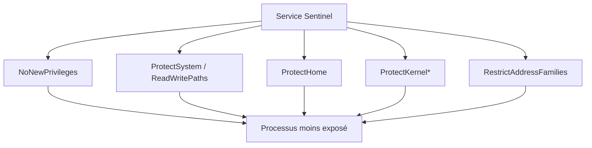
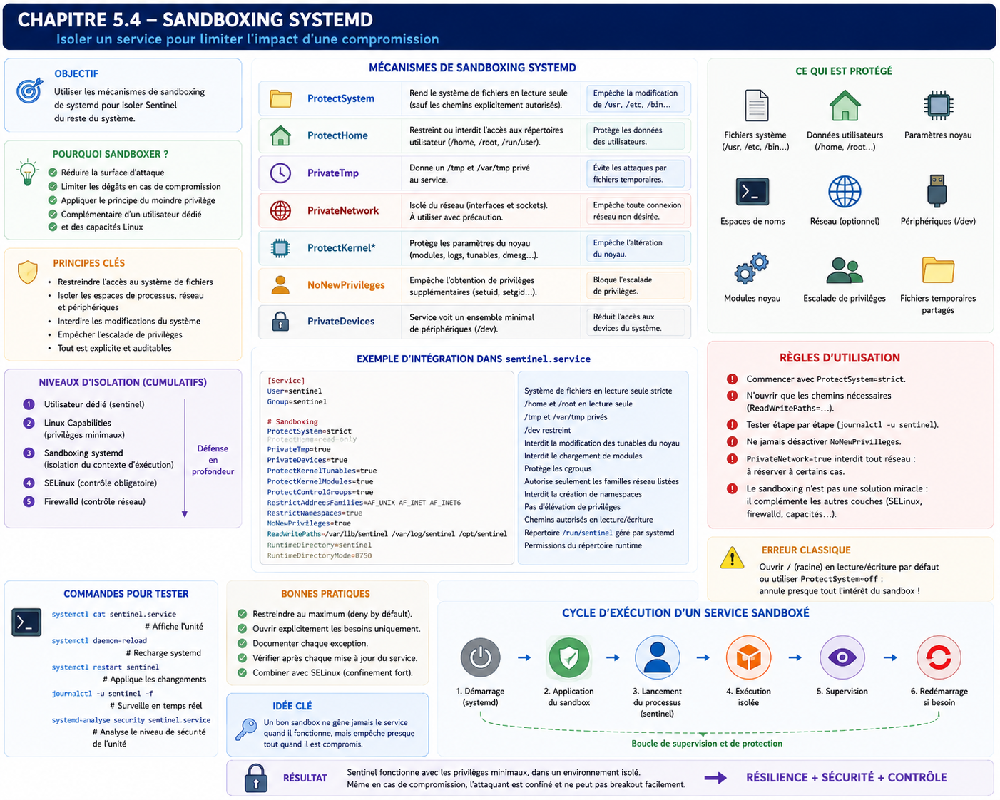

# Chapitre 5.4 — Sandboxing `systemd`

> **Campagne 5 — systemd et services**

> *« Le meilleur code est celui qui n'a jamais accès aux ressources dont il n'a pas besoin. »*

---

## Vous êtes ici

```text
Partie I — Construire un socle sécurisé

Campagne 5 — Systemd et les services

      5.1 Comprendre systemd
      5.2 Les unités (.service, .socket, .target…)
      5.3 Créer le service Sentinel
    ► 5.4 Sandboxing systemd
      5.5 Capacités Linux
      5.6 Journalisation avec journald
      5.7 Supervision et redémarrage automatique
      5.8 Mission : rendre Sentinel résilient
```

---

## Objectifs pédagogiques

À la fin de ce chapitre, vous serez capable de :

- comprendre ce qu'est le sandboxing proposé par systemd ;
- distinguer le sandboxing systemd d'un conteneur Podman ;
- réduire drastiquement la surface d'attaque d'un service ;
- appliquer le principe du moindre privilège directement au système d'exploitation ;
- construire progressivement une unité Sentinel fortement durcie.

---

## Pourquoi ce chapitre existe

Nous avons créé un service.

Il fonctionne.

Il démarre automatiquement.

Il redémarre après un crash.

Il produit des journaux.

Pour beaucoup d'administrateurs, le travail est terminé.

En réalité...

nous n'avons encore quasiment rien fait du point de vue de la sécurité.

Prenons un scénario.

Une vulnérabilité RCE est découverte dans Sentinel.

L'attaquant parvient à exécuter :

```python
os.system(...)
```

Que peut-il faire ?

La réponse dépend entièrement des privilèges accordés au processus.

Si Sentinel possède accès :

- à tout le système de fichiers ;
- aux répertoires utilisateurs ;
- aux périphériques ;
- aux namespaces ;
- aux appels système sensibles ;

alors la compromission devient extrêmement grave.

Notre objectif est donc simple.

Même si Sentinel est compromis,

nous voulons limiter au maximum ce que l'attaquant pourra faire.

C'est exactement le rôle du sandboxing systemd.

---

## Théorie détaillée

### Qu'est-ce que le sandboxing ?

Le mot *sandbox* signifie littéralement :

```text
Bac à sable
```

L'image est particulièrement parlante.

Un enfant peut jouer librement.

Mais uniquement **à l'intérieur** du bac.

Il ne peut pas accéder :

- au jardin ;
- à la route ;
- au garage.

Le principe est identique en sécurité informatique.

L'application peut fonctionner.

Mais uniquement dans un environnement volontairement limité.

---

## Une nouvelle philosophie

Historiquement,

la sécurité Linux reposait principalement sur :

- les permissions UNIX ;
- les utilisateurs ;
- les groupes.

Par exemple.

```text
Utilisateur sentinel

↓

Lecture

/var/lib/sentinel

↓

Refus

/etc/shadow
```

Cette approche reste indispensable.

Mais elle n'est plus suffisante.

Aujourd'hui,

le système d'exploitation est capable d'imposer des restrictions beaucoup plus fines.

Systemd exploite pour cela plusieurs mécanismes du noyau Linux.

Par exemple :

- namespaces ;
- cgroups ;
- capabilities ;
- protections du système de fichiers ;
- filtres d'appels système.

Toutes ces fonctionnalités sont accessibles avec quelques directives extrêmement simples.

---

## Une défense supplémentaire

Le sandboxing ne remplace jamais :

- SELinux ;
- Firewalld ;
- les permissions Linux ;
- les capacités.

Il ajoute une nouvelle couche.

Prenons Sentinel.

Avant.

```text
Attaquant

↓

Exécution de code

↓

Utilisateur sentinel

↓

Accès relativement large
```

Après.

```text
Attaquant

↓

Exécution de code

↓

Utilisateur sentinel

↓

Sandbox systemd

↓

Restrictions

↓

SELinux

↓

Application
```

Chaque couche limite un peu plus les possibilités de l'attaquant.

---

## Pourquoi systemd ?

Une question revient souvent.

Pourquoi utiliser le sandboxing de systemd alors que SELinux existe déjà ?

Parce que les deux répondent à des besoins différents.

Systemd permet d'exprimer très simplement des contraintes comme :

```text
Ce service

n'a jamais besoin

d'écrire dans /usr.
```

Ou :

```text
Ce service

n'a jamais besoin

d'accéder aux répertoires utilisateurs.
```

Ou encore :

```text
Ce service

n'a jamais besoin

de créer un namespace.
```

Ces décisions appartiennent directement au contrat d'exploitation.

Il est donc logique qu'elles figurent dans l'unité systemd.

SELinux continuera ensuite à appliquer une politique encore plus fine.

Les deux mécanismes sont complémentaires.

---

## Le principe fondamental

Une question doit guider toutes les décisions.

> **De quoi Sentinel a-t-il réellement besoin pour fonctionner ?**

Pas :

> Que pourrait-il utiliser un jour ?

Mais bien :

> Qu'utilise-t-il aujourd'hui ?

Chaque permission inutile représente une opportunité supplémentaire pour un attaquant.

Le sandboxing consiste donc essentiellement à supprimer tout ce qui est superflu.

---

## Une démarche progressive

Contrairement à une idée reçue,

on ne sécurise pas une unité en ajoutant immédiatement toutes les protections possibles.

Pourquoi ?

Parce que certaines applications ont réellement besoin :

- d'écrire ;
- de créer des sockets ;
- d'accéder au réseau ;
- de charger des bibliothèques ;
- d'utiliser certains appels système.

La bonne méthode consiste à procéder progressivement.

```text
Application fonctionnelle

↓

Observation

↓

Ajout d'une protection

↓

Tests

↓

Nouvelle protection

↓

Nouveaux tests

↓

...
```

Cette démarche sera celle suivie tout au long de ce chapitre.

---

## La première protection : NoNewPrivileges

Nous commençons par une directive extrêmement simple.

```ini
NoNewPrivileges=yes
```

Elle est pourtant d'une importance considérable.

Que signifie-t-elle ?

Elle interdit au processus d'acquérir de nouveaux privilèges pendant son exécution.

Autrement dit,

même si Sentinel exécute accidentellement un programme disposant d'un bit **setuid**,

celui-ci ne pourra pas élever les privilèges du processus.

Schématiquement.

Sans cette protection.

```text
Sentinel

↓

Exécution

↓

Programme setuid

↓

Privilèges supplémentaires
```

Avec :

```ini
NoNewPrivileges=yes
```

```text
Sentinel

↓

Programme setuid

↓

Refus
```

Cette simple directive neutralise toute une catégorie d'élévations de privilèges.

Elle est aujourd'hui considérée comme une excellente pratique pour la majorité des services.

---

## Pourquoi cette directive est-elle si efficace ?

Parce qu'elle agit très tôt.

Elle ne cherche pas à détecter une attaque.

Elle empêche simplement le noyau Linux d'accorder de nouveaux privilèges.

Autrement dit,

la compromission de Sentinel reste confinée au niveau de privilège initial.

Nous retrouvons ici un principe déjà rencontré plusieurs fois dans ce manuel :

> empêcher une action est toujours préférable à détecter son exploitation après coup.

---
## ProtectSystem

Nous arrivons maintenant à l'une des directives les plus importantes de systemd.

```ini
ProtectSystem=
```

Cette directive repose sur une idée extrêmement simple.

Une application serveur n'a généralement **pas besoin de modifier le système d'exploitation**.

Pourquoi autoriser Sentinel à écrire dans :

```text
/usr
```

ou

```text
/boot
```

ou

```text
/etc
```

si cela ne fait absolument pas partie de son métier ?

Le meilleur droit est souvent celui qui n'existe pas.

---

### Les différents niveaux

#### `ProtectSystem=no`

Aucune protection supplémentaire.

Le comportement est celui de Linux classique.

---

#### `ProtectSystem=yes`

Les principaux répertoires système deviennent accessibles uniquement en lecture.

Par exemple :

```text
/usr

↓

Lecture seule
```

```text
/boot

↓

Lecture seule
```

```text
/etc

↓

Lecture seule
```

Le service continue de fonctionner,

mais il ne peut plus modifier ces emplacements.

---

#### `ProtectSystem=full`

La protection est renforcée.

Le système devient presque entièrement en lecture seule,

à l'exception de certains emplacements explicitement autorisés.

---

#### `ProtectSystem=strict`

Le niveau le plus exigeant.

Pratiquement tout le système de fichiers devient accessible uniquement en lecture.

Seuls les chemins explicitement autorisés restent modifiables.

Cette option est particulièrement intéressante pour des services comme Sentinel,

dont le code est quasiment immuable une fois installé.

---

### Pourquoi est-ce si efficace ?

Imaginons qu'une vulnérabilité permette à un attaquant d'exécuter :

```bash
echo "Backdoor" > /usr/bin/ssh
```

Sans sandbox :

l'opération peut réussir si les privilèges le permettent.

Avec :

```ini
ProtectSystem=strict
```

Le noyau refuse simplement l'écriture.

L'attaque échoue avant même que SELinux ou l'application n'interviennent.

Nous avons supprimé une possibilité entière d'attaque.

---

## ReadWritePaths

Une question apparaît immédiatement.

Si tout devient en lecture seule,

comment Sentinel peut-il écrire ses données ?

C'est ici qu'intervient :

```ini
ReadWritePaths=
```

Par exemple :

```ini
ProtectSystem=strict

ReadWritePaths=/var/lib/sentinel
```

Le résultat est particulièrement élégant.



Nous ne raisonnons plus en termes de permissions générales.

Nous raisonnons en termes de **besoins réels**.

---

## ProtectHome

Deuxième directive essentielle.

```ini
ProtectHome=yes
```

À quoi sert-elle ?

Elle masque les répertoires personnels.

Par exemple.

```text
/home

↓

Inaccessible
```

```text
/root

↓

Inaccessible
```

```text
/run/user

↓

Inaccessible
```

Posons-nous une question simple.

Sentinel a-t-il besoin d'accéder aux documents personnels d'un administrateur ?

Évidemment non.

Pourquoi laisser cette possibilité ?

Cette directive réduit immédiatement la surface d'exposition.

---

### Les différents niveaux

#### `ProtectHome=yes`

Les répertoires personnels deviennent inaccessibles.

---

#### `ProtectHome=read-only`

Ils restent visibles,

mais impossibles à modifier.

---

#### `ProtectHome=tmpfs`

Une vue temporaire vide est présentée à l'application.

Cette option est plus rare,

mais particulièrement intéressante dans certains contextes.

---

## PrivateTmp

Une autre directive très utilisée.

```ini
PrivateTmp=yes
```

Chaque application Linux utilise souvent :

```text
/tmp
```

Le problème est évident.

Tous les processus partagent le même espace.

Cela favorise :

- certaines collisions ;
- des fuites d'informations ;
- quelques attaques historiques.

Avec :

```ini
PrivateTmp=yes
```

Systemd crée un espace temporaire privé.

Schématiquement.

Avant.

```text
/tmp

├── Firefox

├── Sentinel

├── SSH

└── Utilisateur
```

Après.

```text
/tmp

↓

Vue privée

↓

Sentinel uniquement
```

Sentinel ne voit plus les fichiers temporaires des autres applications.

Les autres applications ne voient plus les siens.

Cette isolation est très efficace,

tout en restant quasiment transparente.

---

## PrivateDevices

Poursuivons.

```ini
PrivateDevices=yes
```

Linux représente les périphériques sous forme de fichiers.

Par exemple.

```text
/dev/sda
```

```text
/dev/random
```

```text
/dev/kvm
```

```text
/dev/input/*
```

Une application classique n'a généralement besoin que de très peu d'entre eux.

Avec :

```ini
PrivateDevices=yes
```

Systemd présente une vue extrêmement réduite de `/dev`.

L'application ne voit plus la majorité des périphériques physiques.

Pourquoi laisser Sentinel accéder à :

- une carte son ;
- un périphérique USB ;
- un disque brut ;

alors que son métier consiste uniquement à collecter des événements de sécurité ?

---

## ProtectKernelTunables

Cette directive est beaucoup moins connue.

```ini
ProtectKernelTunables=yes
```

Elle protège notamment plusieurs éléments situés sous :

```text
/proc/sys
```

et

```text
/sys
```

Ces emplacements permettent de modifier certains paramètres du noyau.

Par exemple :

- IPv4 ;
- IPv6 ;
- mémoire virtuelle ;
- paramètres réseau.

Sentinel n'a aucune raison de modifier ces informations.

Nous pouvons donc interdire complètement cet accès.

---

## ProtectKernelModules

Autre protection particulièrement intéressante.

```ini
ProtectKernelModules=yes
```

Le chargement ou le déchargement de modules du noyau devient impossible.

Pourquoi est-ce important ?

Un attaquant cherchant à obtenir un contrôle profond de la machine pourrait tenter :

- de charger un module malveillant ;
- de désactiver un module de sécurité ;
- de manipuler certains pilotes.

Cette directive élimine cette possibilité pour le service concerné.

Encore une fois,

nous supprimons une capacité inutile.

---

## ProtectControlGroups

Nous retrouvons maintenant les cgroups.

```ini
ProtectControlGroups=yes
```

Le service ne peut plus modifier lui-même les groupes de contrôle.

Cette protection évite qu'une application compromise tente de manipuler sa propre supervision ou celle d'autres services.

Elle est généralement recommandée pour les applications qui n'ont pas vocation à administrer le système.

---

## Une première unité durcie

Notre fichier évolue progressivement.

```ini
[Service]

User=sentinel

Group=sentinel

ProtectSystem=strict

ReadWritePaths=/var/lib/sentinel

ProtectHome=yes

PrivateTmp=yes

PrivateDevices=yes

ProtectKernelTunables=yes

ProtectKernelModules=yes

ProtectControlGroups=yes

NoNewPrivileges=yes
```

Aucune ligne de code Python n'a changé.

Pourtant,

la surface d'attaque de Sentinel a déjà considérablement diminué.

C'est toute la philosophie du sandboxing.

Le système d'exploitation protège l'application,

sans demander au développeur de réécrire son logiciel.

---
## RestrictAddressFamilies

Une application ne devrait pouvoir utiliser que les familles de sockets dont elle a réellement besoin.

C'est exactement ce que permet :

```ini
RestrictAddressFamilies=
```

Prenons Sentinel.

Son rôle est relativement simple.

Il communique essentiellement via :

- IPv4 ;
- IPv6 ;
- éventuellement des sockets Unix locales.

Pourquoi lui laisser la possibilité d'utiliser d'autres familles de communication ?

Par exemple :

- Bluetooth ;
- Netlink ;
- CAN Bus ;
- DECnet ;
- Appletalk.

Ces protocoles n'ont absolument aucun intérêt pour Sentinel.

Ils représentent uniquement de la surface d'attaque supplémentaire.

---

### Exemple

```ini
RestrictAddressFamilies=

AF_INET

AF_INET6

AF_UNIX
```

L'effet est immédiat.

Si un attaquant compromet Sentinel,

il ne pourra plus créer des sockets appartenant à d'autres familles.

Cette directive est particulièrement pertinente pour des services réseau bien identifiés.

---

## RestrictNamespaces

Nous avons déjà rencontré les namespaces,

notamment lors de l'introduction aux conteneurs.

Les namespaces permettent de créer de nouveaux espaces isolés.

Par exemple :

- PID namespace ;
- Network namespace ;
- Mount namespace ;
- User namespace.

Ces mécanismes sont extrêmement puissants.

Ils constituent d'ailleurs l'un des fondements de Podman.

Mais...

Sentinel a-t-il réellement besoin de créer de nouveaux namespaces ?

La réponse est généralement non.

Nous pouvons donc écrire :

```ini
RestrictNamespaces=yes
```

Le processus perd alors la possibilité de créer de nouveaux namespaces.

Pourquoi est-ce intéressant ?

Parce que de nombreuses techniques d'évasion ou d'escalade de privilèges utilisent précisément ces mécanismes.

Encore une fois,

nous supprimons une capacité inutile.

---

## MemoryDenyWriteExecute

Voici probablement l'une des directives les plus impressionnantes de systemd.

```ini
MemoryDenyWriteExecute=yes
```

Pour comprendre son intérêt,

revenons quelques instants sur les attaques mémoire.

Une technique classique consiste à :

1. écrire du code en mémoire ;
2. rendre cette mémoire exécutable ;
3. exécuter ce code.

Cette approche est utilisée dans de nombreuses familles d'exploits.

La directive :

```ini
MemoryDenyWriteExecute=yes
```

interdit précisément cette combinaison.

Schématiquement.

Avant.

```text
Mémoire

↓

Écriture

↓

Exécution
```

Après.

```text
Mémoire

↓

Écriture

↓

Impossible

d'exécuter
```

L'application continue généralement à fonctionner normalement.

En revanche,

certaines classes d'exploits deviennent beaucoup plus difficiles à mettre en œuvre.

---

### Attention aux applications utilisant du JIT

Cette directive possède néanmoins une limite importante.

Certaines applications utilisent un compilateur **JIT (Just-In-Time)**.

C'est notamment le cas de certaines machines virtuelles ou moteurs JavaScript.

Ces applications génèrent du code en mémoire avant de l'exécuter.

Avec :

```ini
MemoryDenyWriteExecute=yes
```

elles peuvent cesser de fonctionner correctement.

Il faut donc toujours tester soigneusement une application avant d'activer cette protection.

Pour Sentinel,

développé en Python sans moteur JIT spécifique,

cette restriction est généralement adaptée.

---

## LockPersonality

Sous Linux,

un processus peut modifier certains aspects de sa personnalité d'exécution.

Cette fonctionnalité historique est aujourd'hui rarement utilisée.

Elle peut néanmoins être détournée dans certains scénarios d'exploitation.

Systemd propose donc :

```ini
LockPersonality=yes
```

Une fois cette directive activée,

le processus ne peut plus modifier sa personnalité.

Le gain paraît modeste.

Pourtant,

il participe à une logique essentielle.

Supprimer toutes les fonctionnalités dont l'application n'a pas besoin.

---

## RestrictSUIDSGID

Nous avons déjà étudié :

- le bit setuid ;
- le bit setgid.

Ils permettent à certains programmes d'obtenir temporairement des privilèges supplémentaires.

Pour Sentinel,

ce comportement n'a aucune utilité.

Nous pouvons donc ajouter :

```ini
RestrictSUIDSGID=yes
```

Cette directive empêche plusieurs scénarios impliquant ces mécanismes historiques.

Elle complète parfaitement :

```ini
NoNewPrivileges=yes
```

Les deux protections sont souvent utilisées ensemble.

---

## SystemCallArchitectures

Autre directive méconnue.

```ini
SystemCallArchitectures=native
```

Elle interdit l'utilisation d'appels système destinés à d'autres architectures.

Pourquoi ?

Prenons un système x86_64.

Le noyau peut parfois accepter :

- des appels 32 bits ;
- des appels compatibles.

Un attaquant pourrait tenter d'exploiter ces mécanismes.

Avec :

```ini
SystemCallArchitectures=native
```

seuls les appels correspondant à l'architecture native sont autorisés.

La surface d'attaque diminue encore.

---

## Le filtrage des appels système

Nous arrivons maintenant à l'un des mécanismes les plus puissants du sandboxing.

Les filtres :

```ini
SystemCallFilter=
```

Chaque opération réalisée par un processus passe finalement par un **appel système** (*system call*).

Par exemple :

```text
open()
```

```text
read()
```

```text
write()
```

```text
socket()
```

```text
mount()
```

```text
ptrace()
```

```text
reboot()
```

Le noyau Linux constitue la frontière entre l'espace utilisateur et l'espace noyau.

Chaque demande passe donc par ces appels.

L'idée est alors simple.

Pourquoi autoriser Sentinel à utiliser :

```text
mount()
```

alors qu'il ne montera jamais un système de fichiers ?

Pourquoi lui permettre :

```text
reboot()
```

alors qu'il n'arrêtera jamais le serveur ?

Pourquoi lui laisser :

```text
ptrace()
```

alors qu'il n'a aucune raison de déboguer d'autres processus ?

---

## Les groupes prédéfinis

Heureusement,

il n'est pas nécessaire de connaître plusieurs centaines d'appels système.

Systemd fournit déjà plusieurs groupes.

Par exemple.

```ini
SystemCallFilter=@system-service
```

Ce profil est conçu spécifiquement pour les services classiques.

Il interdit automatiquement un grand nombre d'appels inutiles ou dangereux.

Pour beaucoup d'applications,

cette seule directive apporte déjà un gain de sécurité considérable.

---

## Une approche progressive

Le filtrage des appels système constitue probablement le mécanisme de sandboxing le plus puissant...

mais également le plus délicat.

Pourquoi ?

Parce qu'un appel système interdit peut empêcher l'application de fonctionner.

La bonne pratique consiste toujours à procéder progressivement.

```text
Application fonctionnelle

↓

Ajout du filtre

↓

Tests

↓

Analyse des journaux

↓

Corrections éventuelles

↓

Nouveau filtre
```

Il est fortement déconseillé d'activer un profil très restrictif directement en production.

---

## Notre unité continue d'évoluer

À ce stade,

notre fichier ressemble désormais à ceci.

```ini
[Service]

User=sentinel
Group=sentinel

ProtectSystem=strict
ProtectHome=yes

ReadWritePaths=/var/lib/sentinel

PrivateTmp=yes
PrivateDevices=yes

ProtectKernelTunables=yes
ProtectKernelModules=yes
ProtectControlGroups=yes

NoNewPrivileges=yes
RestrictSUIDSGID=yes

RestrictAddressFamilies=AF_UNIX AF_INET AF_INET6
RestrictNamespaces=yes

MemoryDenyWriteExecute=yes
LockPersonality=yes

SystemCallArchitectures=native
SystemCallFilter=@system-service
```

Aucune de ces directives n'améliore les fonctionnalités de Sentinel.

Elles améliorent exclusivement **sa résistance à une compromission**.

C'est une distinction fondamentale.

Le sandboxing ne rend pas une application meilleure.

Il limite les conséquences lorsqu'elle cesse de l'être.

---
## 💎 Le point d'expertise

### Le sandboxing n'est pas une protection contre les vulnérabilités

C'est probablement l'erreur de compréhension la plus fréquente.

Prenons Sentinel.

Supposons qu'une vulnérabilité de type Remote Code Execution (RCE) soit découverte.

L'attaquant parvient à exécuter :

```python
os.system(...)
```

Le sandboxing n'empêche absolument pas cette exécution.

La vulnérabilité existe toujours.

En revanche, il change complètement la question suivante.

Avant le sandboxing, l'attaquant se demande :

> *Que puis-je faire maintenant ?*

Après le sandboxing, il découvre rapidement que la réponse est beaucoup plus limitée.

Par exemple :

- impossible d'écrire dans `/usr` ;
- impossible d'accéder aux répertoires utilisateurs ;
- impossible de charger des modules noyau ;
- impossible de créer certains namespaces ;
- impossible d'utiliser certaines familles réseau ;
- impossible d'obtenir de nouveaux privilèges.

Autrement dit, le sandboxing ne supprime pas la vulnérabilité.

Il réduit considérablement son impact.

C'est exactement ce que l'on attend d'une stratégie de **défense en profondeur**.

---

### Le principe des privilèges négatifs

Pendant longtemps, les systèmes Unix ont été conçus selon une logique d'autorisation.

```text
Le processus possède

↓

certaines permissions

↓

il peut agir.
```

Le sandboxing introduit une logique différente.

Il commence par supposer que l'application n'a besoin de **rien**.

Puis il autorise uniquement ce qui est indispensable.

Cette inversion de raisonnement est fondamentale.

Elle conduit naturellement à des services beaucoup plus robustes.

---

### Une bonne politique est ennuyeuse

Les meilleures unités systemd sont souvent... décevantes.

Pourquoi ?

Parce qu'elles n'accordent presque rien.

Prenons Sentinel.

Une bonne politique ressemble à ceci.

```text
Lecture

Oui.

──────────────

Écriture

Uniquement

dans

/var/lib/sentinel

──────────────

Réseau

IPv4

IPv6

UNIX

──────────────

Namespaces

Non.

──────────────

Modules noyau

Non.

──────────────

Home utilisateurs

Non.
```

Autrement dit,

le service possède juste assez de privilèges pour fonctionner.

Pas davantage.

---

### Le sandboxing est une documentation

Une unité fortement durcie raconte énormément de choses sur l'application.

Prenons ces deux lignes.

```ini
ProtectHome=yes

PrivateDevices=yes
```

Même sans connaître Sentinel,

nous savons immédiatement :

- qu'il ne manipule pas les fichiers personnels ;
- qu'il n'a pas besoin des périphériques physiques.

L'unité devient donc également une documentation technique extrêmement précieuse.

---

## 🧠 Comment pense un architecte ?

Un architecte ne cherche jamais à protéger **le serveur**.

Il cherche à protéger **chaque service indépendamment**.

Cette nuance est essentielle.

Prenons un serveur hébergeant :

```text
FreeIPA

↓

Sentinel

↓

Grafana

↓

Prometheus
```

Tous ces services possèdent des besoins différents.

Leurs politiques doivent donc être différentes.

Une politique unique serait nécessairement trop permissive.

---

### Chaque permission doit être justifiée

Un excellent exercice consiste à parcourir une unité ligne par ligne.

Pour chacune,

poser la question suivante.

> **Pourquoi cette permission existe-t-elle ?**

Si personne n'est capable d'y répondre,

elle est probablement inutile.

Par exemple.

Pourquoi Sentinel aurait-il besoin de :

```text
Créer des namespaces ?
```

Pourquoi Sentinel aurait-il besoin de :

```text
Modifier /usr ?
```

Pourquoi Sentinel aurait-il besoin de :

```text
Voir les fichiers temporaires d'OpenSSH ?
```

La plupart du temps,

la réponse est :

> Il n'en a pas besoin.

L'architecte supprime alors cette possibilité.

---

### Concevoir pour l'échec

Aucune application n'est parfaite.

L'architecte le sait.

Il part donc du principe que :

- une vulnérabilité existera ;
- un bug apparaîtra ;
- un composant sera compromis.

La vraie question devient alors :

> **Quelle sera l'étendue des dégâts ?**

Le sandboxing répond précisément à cette question.

---

## ⚔️ Comment pense un attaquant ?

Un attaquant qui compromet une application cherche immédiatement à sortir de son périmètre.

Ses premières actions sont souvent :

- explorer le système de fichiers ;
- rechercher des secrets ;
- inspecter `/home` ;
- chercher des certificats ;
- ouvrir de nouvelles connexions réseau ;
- manipuler `/proc` ;
- tenter une élévation de privilèges.

Le sandboxing vise précisément à rendre ces opérations difficiles, voire impossibles.

---

### La reconnaissance post-exploitation

Beaucoup d'attaques modernes ne consistent pas immédiatement à détruire le système.

Elles commencent par une phase de reconnaissance.

Exemple.

```bash
ls /home

cat /etc/shadow

ip a

mount

lsblk

find / -name "*.pem"
```

Une unité correctement durcie réduit considérablement les informations auxquelles l'attaquant peut accéder.

Moins il voit,

moins il comprend l'environnement.

Moins il comprend l'environnement,

plus sa progression devient difficile.

---

## 🏢 En entreprise

Les grands groupes disposent rarement d'une seule politique de sandboxing.

Ils définissent généralement plusieurs profils.

Par exemple.

```text
SERVICES WEB
```

↓

Pas d'accès au matériel.

↓

Accès réseau limité.

↓

Lecture seule du système.

---

```text
COLLECTEURS

↓

Accès réseau important.

↓

Écriture uniquement dans leurs données.

```

---

```text
BASES DE DONNÉES

↓

Accès disque spécifique.

↓

Accès mémoire plus important.

↓

Très peu d'accès système.
```

Chaque famille de services possède son propre profil.

Les nouvelles applications héritent automatiquement du modèle correspondant.

Cette standardisation facilite énormément les audits.

---

## Sentinel dans cette architecture

Sentinel appartiendra à une famille clairement identifiée.

Par conséquent,

son unité systemd sera construite à partir d'un modèle validé par :

- l'équipe Sécurité ;
- l'équipe Système ;
- l'équipe Exploitation.

Les développeurs ne repartiront jamais d'une feuille blanche.

Ils enrichiront progressivement un profil déjà éprouvé.

---

## 📚 Culture technique

Le sandboxing systemd s'appuie principalement sur plusieurs mécanismes du noyau Linux.

Parmi eux :

- les **namespaces** ;
- les **cgroups** ;
- **seccomp** pour le filtrage des appels système ;
- les montages (`mount namespaces`) ;
- les permissions classiques du VFS ;
- les capacités Linux.

Autrement dit,

systemd n'invente pas de nouveaux mécanismes de sécurité.

Il fournit une interface cohérente et déclarative pour exploiter des fonctionnalités déjà présentes dans le noyau.

C'est l'une des grandes forces de son approche.

Les administrateurs peuvent bénéficier de protections très avancées sans avoir à manipuler directement les API noyau.

---

## ⚠️ Piège classique

## Activer toutes les protections d'un seul coup

Une erreur fréquente consiste à copier une unité trouvée sur Internet.

Par exemple.

```ini
ProtectSystem=strict
ProtectHome=yes
PrivateTmp=yes
PrivateDevices=yes
RestrictNamespaces=yes
SystemCallFilter=@system-service
...
```

Puis :

```bash
systemctl restart sentinel
```

Et...

l'application ne démarre plus.

Pourquoi ?

Parce qu'une protection légitime peut aussi empêcher un comportement indispensable.

La bonne démarche est toujours incrémentale.

```text
Nouvelle protection

↓

Tests

↓

Validation

↓

Nouvelle protection

↓

Tests
```

Cette méthode demande davantage de temps.

Elle produit en revanche une politique réellement maîtrisée.

---

## Laboratoire AlmaLinux / Kali

## Objectif

Transformer progressivement `sentinel.service` en un service fortement confiné.

Le laboratoire consiste à ajouter les protections **une par une** et à mesurer leur impact.

L'objectif n'est pas d'obtenir le plus grand nombre de directives.

L'objectif est de comprendre précisément **pourquoi chacune existe**.

---

## Étape 1 — Établir une référence

Créer une unité fonctionnelle sans sandboxing.

Vérifier :

```bash
systemctl status sentinel
```

Puis noter :

- les fichiers utilisés ;
- les accès réseau ;
- les répertoires écrits ;
- les journaux.

Cette photographie servira de point de comparaison.

---

## Étape 2 — Activer progressivement les protections

Ajouter successivement :

```ini
NoNewPrivileges=yes
```

Puis :

```ini
ProtectHome=yes
```

Puis :

```ini
PrivateTmp=yes
```

Après chaque modification :

```bash
systemctl daemon-reload
systemctl restart sentinel
```

Vérifier que l'application fonctionne toujours.

---

## Étape 3 — Activer ProtectSystem

Configurer :

```ini
ProtectSystem=strict
```

Observer les erreurs éventuelles.

Identifier précisément les répertoires devant rester accessibles en écriture.

Ajouter uniquement ceux-ci via :

```ini
ReadWritePaths=
```

---

## Étape 4 — Tester le confinement

Depuis Sentinel,

tenter volontairement :

- d'écrire dans `/usr`;
- de lire `/home`;
- de créer un fichier dans `/etc`.

Observer les refus.

Chercher à comprendre quel mécanisme intervient.

---

## Étape 5 — Ajouter le filtrage des appels système

Configurer :

```ini
SystemCallFilter=@system-service
```

Vérifier que Sentinel continue de fonctionner.

Consulter :

```bash
journalctl -u sentinel
```

en cas d'échec.

---

## Mission d'ingénieur

Votre entreprise héberge plusieurs dizaines de services Python.

Un audit conclut :

> *Les applications fonctionnent correctement, mais une compromission d'un seul service permet encore de parcourir une grande partie du système.*

Vous devez proposer une politique de sandboxing commune.

Votre proposition devra notamment définir :

- les protections obligatoires ;
- les protections optionnelles ;
- la procédure de validation avant mise en production ;
- la méthode de diagnostic lorsqu'une protection casse une application ;
- les critères permettant d'accepter une exception.

Votre objectif est de montrer qu'un sandboxing efficace repose autant sur une méthodologie que sur des directives systemd.

---

## Impact sur Sentinel

Sentinel n'est plus seulement un service.

Il devient un **service fortement confiné**.

Même en cas de compromission,

l'attaquant devra désormais franchir plusieurs barrières supplémentaires avant d'atteindre le reste du système.

Cette unité servira de fondation aux prochains chapitres.

Nous y ajouterons ensuite :

- les capacités Linux ;
- la supervision avancée ;
- le watchdog ;
- la haute disponibilité.

---

## Synthèse

- Le sandboxing limite les conséquences d'une compromission ; il ne corrige pas les vulnérabilités.
- Chaque permission doit être explicitement justifiée.
- `ProtectSystem`, `ProtectHome` et `PrivateTmp` constituent souvent les premières protections à activer.
- `NoNewPrivileges` et `RestrictSUIDSGID` limitent les possibilités d'élévation de privilèges.
- `SystemCallFilter` et `RestrictAddressFamilies` réduisent fortement la surface d'attaque.
- Les protections doivent être ajoutées progressivement et validées par des tests.
- Une unité fortement durcie documente naturellement les besoins réels de l'application.

---

## Infographie de révision

```text
┌────────────────────────────────────────────────────────────────────────────────────────────┐
│                    CHAPITRE 5.4 — SANDBOXING SYSTEMD                                       │
├────────────────────────────────────────────────────────────────────────────────────────────┤
│                                                                                            │
│                      OBJECTIF : LIMITER L'IMPACT D'UNE COMPROMISSION                        │
│                                                                                            │
│                Vulnérabilité → Exécution de code → Sandbox → Dégâts limités                │
│                                                                                            │
├────────────────────────────────────────────────────────────────────────────────────────────┤
│                                                                                            │
│                 DIRECTIVES MAJEURES                                                        │
│                                                                                            │
│ NoNewPrivileges          → Aucun nouveau privilège                                         │
│ ProtectSystem=strict     → Système en lecture seule                                        │
│ ReadWritePaths           → Exceptions d'écriture                                           │
│ ProtectHome              → Masquer /home                                                   │
│ PrivateTmp               → Répertoire /tmp privé                                           │
│ PrivateDevices           → Vue réduite de /dev                                             │
│ ProtectKernelModules     → Interdire les modules noyau                                     │
│ ProtectKernelTunables    → Protéger /proc/sys et /sys                                      │
│ RestrictNamespaces       → Bloquer la création de namespaces                               │
│ RestrictAddressFamilies  → Limiter les familles réseau                                     │
│ MemoryDenyWriteExecute   → Empêcher W+X                                                    │
│ SystemCallFilter         → Filtrer les appels système                                      │
│                                                                                            │
├────────────────────────────────────────────────────────────────────────────────────────────┤
│                                                                                            │
│                  MÉTHODE                                                                    │
│                                                                                            │
│ Application fonctionnelle                                                                  │
│          │                                                                                 │
│          ▼                                                                                 │
│ Ajouter UNE protection                                                                     │
│          │                                                                                 │
│          ▼                                                                                 │
│ Tester                                                                                     │
│          │                                                                                 │
│          ▼                                                                                 │
│ Corriger si nécessaire                                                                     │
│          │                                                                                 │
│          ▼                                                                                 │
│ Ajouter la protection suivante                                                             │
│                                                                                            │
├────────────────────────────────────────────────────────────────────────────────────────────┤
│                                                                                            │
│ PHRASE À RETENIR                                                                           │
│                                                                                            │
│ « Le sandboxing ne cherche pas à empêcher qu'une application soit compromise.              │
│  Il cherche à empêcher qu'une compromission devienne une compromission du serveur. »       │
└────────────────────────────────────────────────────────────────────────────────────────────┘
```



---

← [5.3 — Créer le service Sentinel](5.3-creer-service-sentinel.md) · [5.5 — Les capacités Linux](5.5-capacites-linux.md) →
