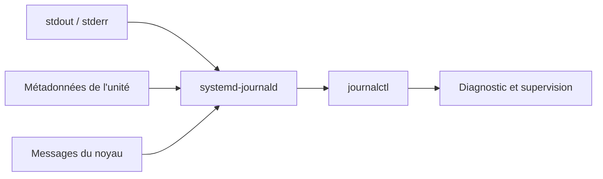
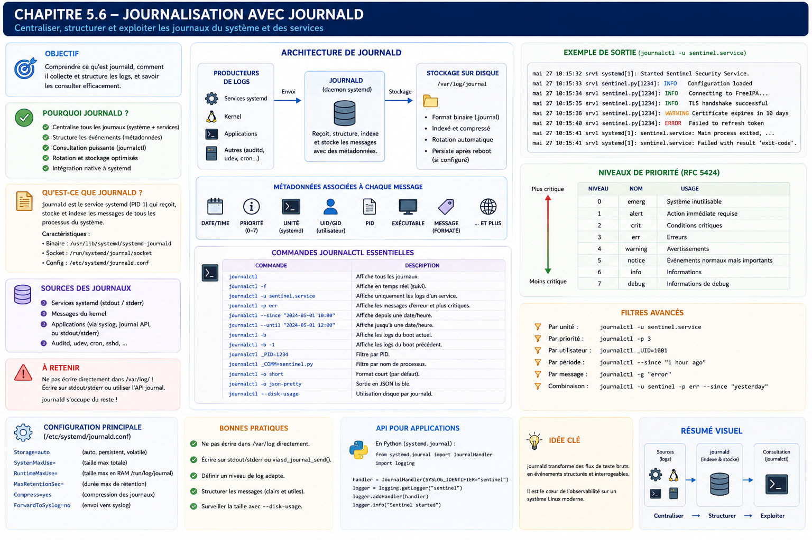

# Chapitre 5.6 — Journalisation avec `journald`

> **Campagne 5 — systemd et services**

> *« Une panne sans journal est une hypothèse. Une panne avec des journaux est un problème que l'on peut résoudre. »*

---

## Vous êtes ici

```text
Partie I — Construire un socle sécurisé

Campagne 5 — Systemd et les services

      5.1 Comprendre systemd
      5.2 Les unités (.service, .socket, .target…)
      5.3 Créer le service Sentinel
      5.4 Sandboxing systemd
      5.5 Capacités Linux
    ► 5.6 Journalisation avec journald
      5.7 Supervision et redémarrage automatique
      5.8 Mission : rendre Sentinel résilient
```

---

## Objectifs pédagogiques

À la fin de ce chapitre, vous serez capable de :

- comprendre le fonctionnement interne de **systemd-journald** ;
- distinguer `journald` de Syslog ;
- concevoir une stratégie de journalisation adaptée à un service moderne ;
- exploiter efficacement `journalctl` lors d'un incident ;
- intégrer naturellement Sentinel dans l'écosystème de journalisation d'AlmaLinux.

---

## Pourquoi ce chapitre existe

Imaginons qu'un administrateur vous appelle à 3 h du matin.

> « Sentinel ne répond plus. »

La première question que vous allez poser ne sera probablement pas :

> Quel est le PID ?

Ni :

> Quelle version de Python est installée ?

Vous demanderez presque toujours :

> **Que disent les journaux ?**

Les journaux sont la mémoire du système.

Sans eux,

tout diagnostic devient une succession d'hypothèses.

Avec eux,

l'ingénieur dispose d'une chronologie précise des événements.

Dans une infrastructure moderne,

la journalisation n'est plus une fonctionnalité secondaire.

Elle fait partie intégrante de la sécurité.

---

## Théorie détaillée

### Avant systemd

Historiquement,

la plupart des distributions Linux utilisaient :

```text
syslog
```

ou

```text
rsyslog
```

Les applications écrivaient dans :

```text
/var/log/messages

/var/log/secure

/var/log/maillog

...
```

Chaque service possédait parfois son propre fichier.

Exemple.

```text
Apache

↓

/var/log/httpd/access_log
```

Puis :

```text
SSH

↓

/var/log/secure
```

Puis :

```text
Cron

↓

/var/log/cron
```

Cette approche fonctionnait.

Elle présentait néanmoins plusieurs limites.

---

## Les limites des fichiers de logs

Prenons un incident.

À 14 h 32,

Sentinel cesse brutalement de fonctionner.

Pour comprendre pourquoi,

l'administrateur doit parfois consulter :

```text
/var/log/messages
```

Puis :

```text
/var/log/secure
```

Puis :

```text
/var/log/firewalld
```

Puis :

```text
/var/log/audit/audit.log
```

Puis :

```text
Les journaux de Sentinel.
```

L'information est dispersée.

Les corrélations deviennent difficiles.

---

## L'arrivée de journald

Systemd introduit un nouveau composant.

```text
systemd-journald
```

Son rôle est simple.

Centraliser tous les événements du système.

Schématiquement.



Tous les événements convergent vers une base commune.

---

## Une différence fondamentale

Contrairement aux anciens systèmes,

`journald` ne raisonne plus principalement en termes de fichiers.

Il raisonne en termes **d'événements structurés**.

Chaque événement possède des métadonnées.

Par exemple :

- le service ;
- le PID ;
- l'utilisateur ;
- l'UID ;
- le cgroup ;
- le boot ;
- l'heure ;
- la priorité.

Cette richesse d'information facilite énormément les investigations.

---

## Les journaux suivent le service

Prenons Sentinel.

Le service produit :

```text
stdout
```

ou

```text
stderr
```

Systemd capture automatiquement ces flux.

Ils deviennent immédiatement consultables.

```bash
journalctl -u sentinel
```

Aucune configuration supplémentaire n'est nécessaire.

C'est l'une des grandes forces de systemd.

Le développeur écrit simplement :

```python
print(...)
```

ou utilise le module :

```python
logging
```

Le système se charge du reste.

---

## Les flux standard

Une application possède généralement trois flux.

```text
stdin

stdout

stderr
```

Pour un service systemd,

les deux derniers sont automatiquement redirigés vers journald.

Schématiquement.

```text
Sentinel

↓

stdout

↓

journald
```

```text
Sentinel

↓

stderr

↓

journald
```

Le développeur n'a donc pas besoin d'écrire lui-même dans un fichier.

Cette responsabilité appartient désormais au système.

---

## Où sont stockés les journaux ?

Deux modes existent.

### Journal volatil

Par défaut,

certaines distributions conservent les journaux uniquement en mémoire.

Ils disparaissent après un redémarrage.

Les données sont généralement placées sous :

```text
/run/log/journal
```

---

### Journal persistant

Pour conserver les événements après un redémarrage,

il suffit généralement de créer :

```text
/var/log/journal
```

Puis :

```bash
systemctl restart systemd-journald
```

Les journaux deviennent persistants.

Cette configuration est pratiquement indispensable sur un serveur.

---

## Une base d'événements

Visualisons le fonctionnement.

```text
               journald

┌─────────────────────────────────────────────┐

 Heure

 Service

 PID

 UID

 Priorité

 Message

 Boot ID

 CGroup

 ...

└─────────────────────────────────────────────┘
```

Chaque événement possède un ensemble d'attributs.

C'est précisément ce qui rend les recherches extrêmement puissantes.

---

## Le premier réflexe : journalctl

L'outil principal est :

```bash
journalctl
```

Sans argument,

il affiche l'ensemble des événements connus.

Très rapidement,

on préférera cibler les recherches.

Par exemple.

```bash
journalctl -u sentinel
```

Cette commande affiche uniquement les événements du service Sentinel.

Elle deviendra rapidement l'une des commandes les plus utilisées de toute la formation.

---

## Pourquoi cette approche est-elle supérieure ?

Supposons que Sentinel redémarre automatiquement.

Avec un simple fichier texte,

retrouver le bon PID peut devenir compliqué.

Avec journald,

chaque événement est déjà associé :

- au bon service ;
- au bon processus ;
- au bon démarrage.

Le système effectue lui-même cette corrélation.

L'ingénieur peut alors se concentrer sur l'analyse,

plutôt que sur la recherche des informations.

---
## Explorer efficacement les journaux

Afficher l'ensemble du journal est rarement la bonne approche.

Sur un serveur de production,

plusieurs millions d'événements peuvent être enregistrés.

Un ingénieur sécurité doit apprendre à **interroger** le journal plutôt qu'à le parcourir.

---

## Consulter un service

La commande la plus utilisée est :

```bash
journalctl -u sentinel
```

Elle affiche uniquement les événements produits par :

```text
sentinel.service
```

Le filtrage est réalisé directement par journald.

Il ne s'agit pas d'une recherche textuelle.

Le système connaît précisément le service à l'origine de chaque événement.

---

## Afficher les derniers événements

Très souvent,

seuls les derniers messages sont intéressants.

```bash
journalctl -u sentinel -n 50
```

Affiche les cinquante dernières entrées.

Cette commande devient rapidement un réflexe lors des diagnostics.

---

## Suivre les journaux en temps réel

Comme avec :

```bash
tail -f
```

sur un fichier classique,

journald permet un suivi temps réel.

```bash
journalctl -fu sentinel
```

Les nouvelles entrées apparaissent immédiatement.

Cette commande est extrêmement pratique pendant :

- un développement ;
- un test d'intégration ;
- une montée de version ;
- une investigation.

---

## Rechercher sur une période

Les filtres temporels constituent l'une des grandes forces de `journalctl`.

Exemple.

```bash
journalctl \
-u sentinel \
--since "2026-07-14 09:00:00"
```

Ou plus simplement.

```bash
journalctl \
-u sentinel \
--since "1 hour ago"
```

Autres exemples.

```bash
--since today
```

```bash
--since yesterday
```

```bash
--since "10 minutes ago"
```

Ces expressions naturelles rendent les recherches particulièrement rapides.

---

## Définir une période complète

Nous pouvons également combiner :

```bash
--since
```

et

```bash
--until
```

Exemple.

```bash
journalctl \
-u sentinel \
--since "14:00" \
--until "14:30"
```

Cette fonctionnalité est très utile lors d'une enquête de sécurité.

Supposons qu'un IDS détecte une activité suspecte à :

```text
14 h 12
```

Il devient alors possible de reconstruire précisément ce qui s'est produit quelques minutes avant et quelques minutes après.

---

## Les niveaux de priorité

Chaque événement possède une priorité.

Systemd reprend les niveaux historiques de Syslog.

```text
0  Emergency

1  Alert

2  Critical

3  Error

4  Warning

5  Notice

6  Info

7  Debug
```

Ces niveaux sont importants.

Ils permettent d'effectuer des recherches très ciblées.

---

### Exemple

Afficher uniquement les erreurs.

```bash
journalctl \
-u sentinel \
-p err
```

Ou :

```bash
journalctl \
-p warning
```

Il devient inutile de parcourir plusieurs milliers de lignes d'informations.

---

## Comprendre les niveaux

Tous les messages n'ont pas la même importance.

Prenons Sentinel.

#### INFO

```text
Service démarré.
```

Simple information.

---

#### WARNING

```text
Le certificat expire dans quinze jours.
```

Le service fonctionne,

mais une intervention sera bientôt nécessaire.

---

#### ERROR

```text
Impossible de charger la configuration.
```

Le fonctionnement est perturbé.

---

#### CRITICAL

```text
La base des signatures est corrompue.
```

Une intervention immédiate est probablement nécessaire.

---

#### DEBUG

Messages très détaillés,

principalement utiles au développement.

Ils sont généralement désactivés en production.

---

## Filtrer par démarrage

Chaque redémarrage du serveur possède un identifiant unique.

Il est donc possible d'afficher uniquement :

```bash
journalctl -b
```

c'est-à-dire :

> Les événements du démarrage courant.

Ou encore.

```bash
journalctl -b -1
```

Le démarrage précédent.

Puis :

```bash
journalctl -b -2
```

Deux redémarrages auparavant.

Cette fonctionnalité est extrêmement utile lorsqu'un incident survient juste après un reboot.

---

## Les métadonnées

Chaque entrée du journal contient beaucoup plus qu'un simple message.

Affichons une entrée au format détaillé.

```bash
journalctl -u sentinel -o verbose
```

Nous découvrons notamment :

```text
_SYSTEMD_UNIT

_PID

_UID

_GID

_BOOT_ID

_COMM

_EXE

_CMDLINE

_HOSTNAME

_MACHINE_ID
```

Toutes ces informations sont automatiquement enregistrées.

Le développeur n'a rien à faire.

---

## Pourquoi est-ce important ?

Prenons un exemple.

Deux services produisent exactement le même message.

```text
Connection refused
```

Avec un simple fichier texte,

la recherche devient compliquée.

Avec journald,

chaque entrée possède déjà :

- le service ;
- le PID ;
- le processus ;
- l'exécutable.

L'ambiguïté disparaît.

---

## Exporter les journaux

Journalctl permet également plusieurs formats de sortie.

Format classique.

```bash
journalctl
```

---

Format court.

```bash
journalctl -o short
```

---

Format JSON.

```bash
journalctl -o json
```

---

Format JSON "pretty".

```bash
journalctl -o json-pretty
```

Ce dernier est particulièrement intéressant pour :

- les scripts Python ;
- les outils SIEM ;
- les traitements automatisés.

Nous retrouverons ce format dans la partie du manuel consacrée à la supervision.

---

## Les journaux ne doivent jamais être analysés par expressions régulières

Voici un point d'expertise souvent ignoré.

Beaucoup de scripts font encore ceci.

```bash
grep ERROR /var/log/messages
```

Cette approche est fragile.

Pourquoi ?

Parce qu'elle dépend du texte affiché.

Avec journald,

nous pouvons interroger directement les métadonnées.

Par exemple :

- uniquement Sentinel ;
- uniquement les erreurs ;
- uniquement depuis une heure ;
- uniquement sur le boot précédent.

L'information devient structurée.

Les scripts deviennent beaucoup plus robustes.

---

## Sentinel et le module logging de Python

L'une des erreurs les plus fréquentes consiste à écrire directement dans un fichier.

Par exemple.

```python
logging.FileHandler(
    "/var/log/sentinel.log"
)
```

Cette approche était courante autrefois.

Aujourd'hui,

elle présente plusieurs inconvénients.

- rotation des journaux à gérer ;
- permissions ;
- concurrence ;
- chemins différents selon les distributions.

Une application exécutée par systemd peut adopter une approche beaucoup plus simple.

```python
import logging

logging.basicConfig(
    level=logging.INFO
)

logger = logging.getLogger("sentinel")
```

Puis :

```python
logger.info("Sentinel started")
```

Ou même :

```python
print("Sentinel started")
```

Les flux étant capturés automatiquement,

ils apparaissent immédiatement dans :

```bash
journalctl -u sentinel
```

L'application reste totalement indépendante du système de journalisation.

C'est une excellente séparation des responsabilités.

---

## Structurer les messages

Un bon journal ne consiste pas uniquement à écrire des phrases.

Les messages doivent être exploitables.

Évitez :

```text
Erreur.
```

Préférez :

```text
Impossible d'ouvrir le certificat serveur
(/etc/sentinel/tls/server.pem).
```

Évitez :

```text
Connexion refusée.
```

Préférez :

```text
Connexion TLS refusée :
certificat client expiré
(CN=agent-42).
```

Un bon message répond immédiatement aux questions suivantes :

- Que s'est-il passé ?
- Où ?
- Pourquoi ?
- Sur quel composant ?
- Avec quelles conséquences ?

Cette discipline réduit considérablement le temps d'investigation.

---
## 💎 Le point d'expertise

### Les journaux sont une preuve, pas un simple historique

L'erreur la plus fréquente consiste à considérer les journaux comme une simple aide au débogage.

En réalité, dans une infrastructure professionnelle, les journaux remplissent trois fonctions distinctes.

```text
Développement

↓

Comprendre un bug

────────────────────────

Exploitation

↓

Comprendre un incident

────────────────────────

Sécurité

↓

Constituer une preuve
```

Cette troisième fonction est souvent sous-estimée.

Lorsqu'une compromission est découverte plusieurs semaines après les faits, les journaux deviennent la seule mémoire fiable du système.

Chaque message doit donc être considéré comme un élément d'investigation potentiel.

---

### La journalisation est un contrat

Prenons deux développeurs.

Le premier écrit :

```python
logger.error("Erreur")
```

Le second écrit :

```python
logger.error(
    "Échec de l'authentification TLS "
    "(CN=%s, IP=%s)",
    client_cn,
    client_ip
)
```

Les deux applications fonctionnent.

Pourtant,

la seconde permettra quelques mois plus tard de répondre immédiatement à des questions comme :

- Quel client était concerné ?
- Depuis quelle adresse IP ?
- À quel moment ?
- Combien de fois ?

Un journal bien conçu réduit considérablement le coût d'une investigation.

---

### Les journaux doivent être exploitables par une machine

Une autre erreur classique consiste à produire uniquement des messages destinés à un humain.

Par exemple.

```text
Une erreur étrange est apparue...
```

Ce message est peut-être compréhensible par le développeur.

Il est très difficilement exploitable par :

- Grafana ;
- Loki ;
- Splunk ;
- Elastic ;
- un SIEM ;
- un moteur d'alertes.

Un bon journal doit rester :

- lisible par un humain ;
- interprétable par une machine.

C'est l'une des raisons pour lesquelles les journaux structurés gagnent progressivement du terrain.

---

### L'application ne choisit pas la destination

Une application moderne ne devrait généralement pas décider où seront stockés ses journaux.

Elle produit simplement des événements.

Le système d'exploitation décide ensuite :

```text
stdout

↓

journald

↓

rsyslog

↓

SIEM

↓

Archivage

↓

Console

↓

API
```

Cette séparation rend l'application beaucoup plus portable.

Sentinel fonctionnera exactement de la même manière :

- sur une VM AlmaLinux ;
- dans un conteneur Podman ;
- sur une infrastructure cloud.

---

## 🧠 Comment pense un architecte ?

Un architecte ne commence jamais par se demander :

> Quels messages allons-nous écrire ?

Il commence par répondre à une autre question.

> Quelles informations seront nécessaires lors d'un incident ?

Cette différence de perspective change complètement la qualité de la journalisation.

---

### Chaque événement possède une valeur

Prenons un serveur Sentinel.

Plusieurs événements sont possibles.

```text
Service démarré

↓

Information
```

---

```text
Authentification refusée

↓

Sécurité
```

---

```text
Nouvelle configuration chargée

↓

Traçabilité
```

---

```text
Rotation des certificats

↓

Audit
```

---

```text
Crash

↓

Diagnostic
```

Tous ces événements répondent à des besoins différents.

Un architecte veille à ce qu'aucune catégorie ne soit oubliée.

---

### Penser "investigation"

Imaginons qu'un analyste SOC intervienne six mois après un incident.

Quelles questions posera-t-il ?

Probablement :

- Quel utilisateur était concerné ?
- Quelle machine ?
- Quel certificat ?
- Quelle adresse IP ?
- Quel module Sentinel ?
- Quelle version de l'application ?

Si ces informations ne figurent pas dans les journaux,

elles seront probablement perdues.

Une bonne stratégie de journalisation est donc pensée dès la conception.

---

## ⚔️ Comment pense un attaquant ?

L'attaquant déteste les journaux.

Pourquoi ?

Parce qu'ils racontent son histoire.

Une attaque laisse généralement de nombreuses traces.

Par exemple :

```text
Connexion inhabituelle

↓

Échec TLS

↓

Nouvelle tentative

↓

Succès

↓

Création d'un processus

↓

Crash

↓

Redémarrage
```

Même si chaque événement paraît anodin,

leur chronologie révèle souvent la totalité du scénario.

---

### Les premières actions d'un attaquant

Après une compromission,

l'attaquant cherche fréquemment à :

- supprimer des journaux ;
- modifier des journaux ;
- empêcher leur production.

C'est précisément pour cette raison que les journaux doivent être :

- centralisés ;
- protégés ;
- archivés ;
- surveillés.

Nous reviendrons sur ces aspects dans la campagne consacrée à la supervision.

---

## 🏢 En entreprise

Dans les grandes infrastructures,

les journaux ne sont pratiquement jamais consultés directement sur les serveurs.

Le flux ressemble davantage à ceci.

```text
Sentinel

↓

journald

↓

rsyslog

↓

Loki

↓

Grafana

↓

Centre opérationnel (SOC)
```

Ou :

```text
Sentinel

↓

journald

↓

Elastic Agent

↓

ElasticSearch

↓

Kibana
```

Le serveur devient uniquement un point de collecte.

L'analyse est réalisée ailleurs.

Cette architecture présente plusieurs avantages.

- conservation longue durée ;
- corrélation entre plusieurs serveurs ;
- alertes automatiques ;
- recherche plein texte ;
- tableaux de bord.

Nous construirons progressivement cette architecture dans les dernières campagnes du manuel.

---

## 📚 Culture technique

Contrairement à une idée répandue,

`journald` n'a jamais eu pour objectif de remplacer complètement Syslog.

Les deux peuvent parfaitement cohabiter.

Une architecture classique AlmaLinux ressemble souvent à ceci.

```text
Applications

↓

journald

↓

rsyslog

↓

SIEM
```

`journald` assure :

- la collecte locale ;
- les métadonnées ;
- l'intégration avec systemd.

`rsyslog` assure :

- le transport ;
- le filtrage ;
- le stockage distant.

Cette complémentarité explique pourquoi les deux composants sont encore largement utilisés ensemble.

---

## ⚠️ Piège classique

### Journaliser beaucoup n'est pas journaliser correctement

Certains développeurs pensent qu'un bon journal est un journal très volumineux.

Ils écrivent alors :

```text
Connexion reçue

Connexion reçue

Connexion reçue

Connexion reçue

...
```

Plusieurs millions de lignes plus tard,

personne ne trouve l'information utile.

Une bonne journalisation n'est pas une question de quantité.

C'est une question de pertinence.

Chaque message doit répondre à un besoin clairement identifié.

---

### Écrire les journaux en double

Autre erreur fréquente.

L'application écrit :

```text
stdout
```

et simultanément :

```text
/var/log/sentinel.log
```

On obtient alors :

- deux jeux de journaux ;
- deux rotations ;
- deux stratégies de conservation.

Cette duplication complique inutilement l'exploitation.

Lorsqu'une application est exécutée par systemd,

il est généralement préférable de laisser `journald` assurer cette responsabilité.

---

## Laboratoire AlmaLinux / Kali

### Objectif

Maîtriser `journalctl` et concevoir une stratégie de journalisation professionnelle pour Sentinel.

---

### Étape 1 — Produire des événements

Démarrer Sentinel.

Générer volontairement :

- un démarrage ;
- une erreur de configuration ;
- une connexion TLS refusée ;
- un arrêt propre.

Observer les journaux.

```bash
journalctl -u sentinel
```

---

### Étape 2 — Utiliser les filtres

Afficher :

Les cinquante derniers événements.

```bash
journalctl -u sentinel -n 50
```

Les erreurs uniquement.

```bash
journalctl -u sentinel -p err
```

Les événements de la dernière heure.

```bash
journalctl -u sentinel --since "1 hour ago"
```

---

### Étape 3 — Suivi temps réel

Ouvrir deux terminaux.

Dans le premier :

```bash
journalctl -fu sentinel
```

Dans le second,

générer différentes actions dans Sentinel.

Observer la chronologie des événements.

---

### Étape 4 — Tester le module `logging`

Modifier Sentinel afin d'utiliser le module Python `logging`.

Vérifier que les messages apparaissent automatiquement dans :

```bash
journalctl -u sentinel
```

sans écrire dans un fichier dédié.

---

### Étape 5 — Concevoir une politique de journalisation

Définir pour Sentinel :

- quels événements relèvent du niveau `INFO` ;
- lesquels doivent être `WARNING` ;
- lesquels doivent être `ERROR` ;
- lesquels justifient un niveau `CRITICAL`.

Comparer cette politique avec les besoins d'un centre opérationnel de sécurité (SOC).

---

## Mission d'ingénieur

Votre entreprise possède plusieurs centaines de serveurs.

Chaque application produit ses propres journaux.

Formats différents.

Emplacements différents.

Niveaux différents.

L'équipe SOC ne parvient plus à corréler les incidents.

Votre mission consiste à définir une politique commune de journalisation.

Cette politique devra notamment préciser :

- les niveaux de sévérité autorisés ;
- les informations obligatoires dans chaque événement ;
- la durée de conservation ;
- la centralisation ;
- les règles de confidentialité ;
- les événements déclenchant automatiquement une alerte.

Votre proposition devra être directement applicable à Sentinel.

---

## Impact sur Sentinel

Sentinel produit désormais des journaux exploitables par :

- les administrateurs ;
- les développeurs ;
- les équipes sécurité ;
- les outils de supervision.

Cette étape est essentielle.

Les prochains chapitres utiliseront directement ces journaux pour :

- détecter les défaillances ;
- déclencher des redémarrages ;
- superviser le service ;
- construire les tableaux de bord de sécurité.

---

## Synthèse

- `journald` centralise les événements produits par les services systemd.
- `journalctl` permet des recherches structurées par service, période, priorité ou démarrage.
- Les applications modernes doivent produire des événements, pas gérer elles-mêmes leur stockage.
- Les journaux constituent une preuve d'exploitation autant qu'un outil de diagnostic.
- Une bonne politique de journalisation est pensée dès la conception de l'application.
- Les journaux doivent être utiles aussi bien à un humain qu'à une machine.

---

## Infographie de révision

```text
┌──────────────────────────────────────────────────────────────────────────────────────────────┐
│                   CHAPITRE 5.6 — JOURNALISATION AVEC JOURNALD                               │
├──────────────────────────────────────────────────────────────────────────────────────────────┤
│                                                                                              │
│              SENTINEL                                                                        │
│                   │                                                                          │
│           stdout / stderr                                                                    │
│                   │                                                                          │
│                   ▼                                                                          │
│             systemd-journald                                                                 │
│                   │                                                                          │
│      ┌────────────┼────────────┐                                                            │
│      ▼            ▼            ▼                                                            │
│ journalctl     rsyslog      SIEM / Grafana / Loki                                           │
│                                                                                              │
├──────────────────────────────────────────────────────────────────────────────────────────────┤
│                                                                                              │
│                COMMANDES ESSENTIELLES                                                        │
│                                                                                              │
│ journalctl -u sentinel                 → Journal du service                                 │
│ journalctl -fu sentinel                → Suivi temps réel                                   │
│ journalctl -u sentinel -n 50           → Dernières entrées                                  │
│ journalctl -u sentinel -p err          → Erreurs uniquement                                 │
│ journalctl -b                          → Boot courant                                       │
│ journalctl -b -1                       → Boot précédent                                     │
│                                                                                              │
├──────────────────────────────────────────────────────────────────────────────────────────────┤
│                                                                                              │
│                 NIVEAUX                                                                      │
│                                                                                              │
│ DEBUG → INFO → NOTICE → WARNING → ERROR → CRITICAL → ALERT → EMERGENCY                      │
│                                                                                              │
├──────────────────────────────────────────────────────────────────────────────────────────────┤
│                                                                                              │
│ PHRASE À RETENIR                                                                             │
│                                                                                              │
│ « Un journal n'est pas la mémoire d'une application.                                         │
│  C'est la mémoire opérationnelle et sécuritaire du système. »                                │
└──────────────────────────────────────────────────────────────────────────────────────────────┘
```



---

← [5.5 — Les capacités Linux](5.5-capacites-linux.md) · [5.7 — Supervision et redémarrage automatique](5.7-supervision-redemarrage.md) →
