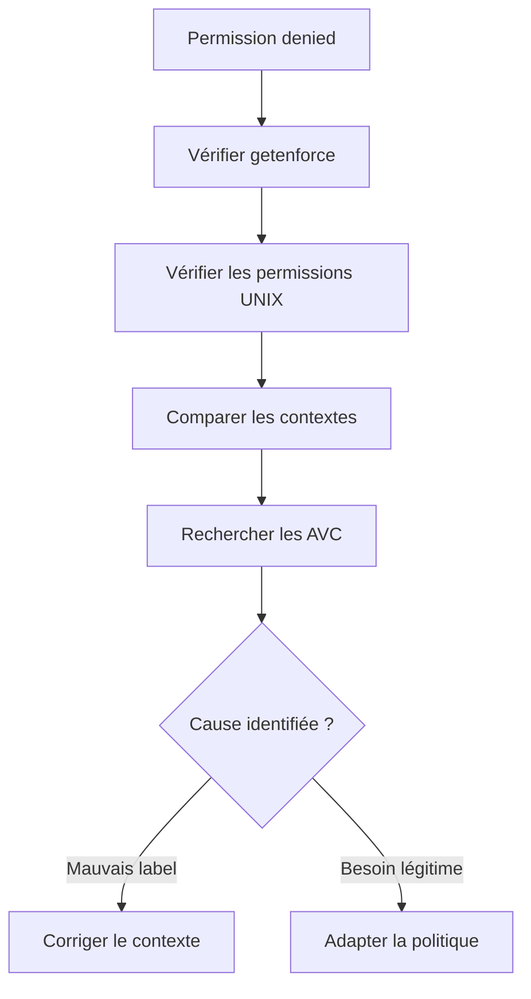
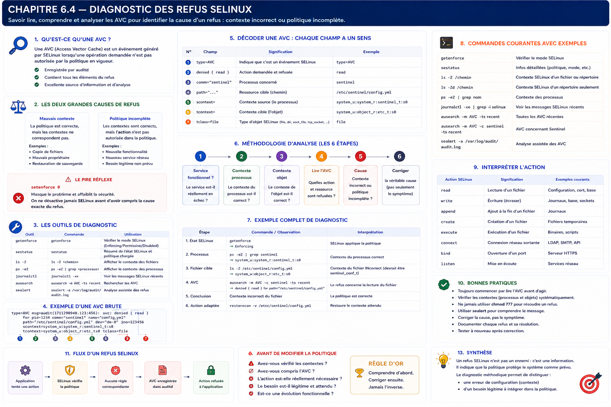

# Chapitre 6.4 — Diagnostic des refus SELinux

> **Campagne 6 — SELinux**

> *« Un administrateur débutant désactive SELinux lorsqu'il rencontre un refus. Un ingénieur sécurité commence par considérer ce refus comme une information précieuse. »*

---

## Vous êtes ici

```text
Partie I — Construire un socle sécurisé

Campagne 6 — SELinux

      6.1 Pourquoi SELinux existe
      6.2 Les contextes
      6.3 Les politiques
    ► 6.4 Diagnostic des refus
      6.5 Création de règles
      6.6 Sécuriser Sentinel avec SELinux
```

---

## Objectifs pédagogiques

À la fin de ce chapitre, vous serez capable de :

- comprendre ce qu'est un refus AVC ;
- identifier rapidement la cause d'un refus SELinux ;
- distinguer un problème de contexte d'un problème de politique ;
- utiliser les principaux outils de diagnostic ;
- adopter une méthodologie systématique avant toute modification de la politique.

---

## Pourquoi ce chapitre existe

C'est probablement le chapitre le plus important de toute la campagne.

Pourquoi ?

Parce que la très grande majorité des administrateurs ne rencontrent pas de difficultés avec les commandes SELinux.

Ils rencontrent des difficultés avec **l'interprétation des refus**.

Prenons une situation réelle.

Vous déployez une nouvelle version de Sentinel.

Le service démarre.

Aucune erreur systemd.

Les permissions UNIX sont correctes.

Le propriétaire est correct.

Pourtant,

l'application renvoie :

```text
Permission denied
```

À ce stade,

plusieurs réactions sont possibles.

Le débutant pense :

> « Les permissions sont mauvaises. »

L'administrateur expérimenté pense :

> « Les permissions semblent correctes... essayons `chmod 777`. »

L'ingénieur sécurité pense immédiatement :

> **« Que dit SELinux ? »**

Cette différence de raisonnement est précisément l'objectif de ce chapitre.

---

## Théorie détaillée

### Un refus SELinux possède un nom

Chaque refus généré par SELinux est appelé :

```text
AVC

Access Vector Cache
```

Le nom peut sembler étrange.

Historiquement,

l'Access Vector Cache est le mécanisme utilisé par le noyau pour mémoriser les décisions de sécurité.

Lorsqu'une opération est refusée,

SELinux enregistre également un événement que l'on appelle communément une **AVC**.

Dans la pratique,

lorsqu'un administrateur dit :

> « J'ai une AVC. »

Il signifie généralement :

> **« SELinux vient de refuser une opération et je dois comprendre pourquoi. »**

---

## Pourquoi une AVC est une bonne nouvelle

À première vue,

un refus paraît être un problème.

En réalité,

c'est souvent une excellente nouvelle.

Pourquoi ?

Parce que cela signifie que SELinux vient précisément d'empêcher une opération qui ne correspondait pas à la politique.

Autrement dit,

la couche de sécurité fonctionne.

Prenons deux situations.

---

### Sans SELinux

```text
Application compromise

↓

Lecture

/etc/shadow

↓

Succès
```

---

### Avec SELinux

```text
Application compromise

↓

Lecture

/etc/shadow

↓

AVC

↓

Refus
```

Le refus n'est donc pas un dysfonctionnement.

Il est souvent la preuve que le mécanisme de protection remplit parfaitement son rôle.

Le véritable travail consiste maintenant à déterminer si ce refus est :

- attendu ;
- ou légitime mais mal configuré.

---

## Deux grandes familles de refus

En pratique,

la plupart des AVC appartiennent à l'une de ces deux catégories.

### Première catégorie

Le contexte est incorrect.

Exemple.

```text
Sentinel

↓

Veut lire

↓

Configuration

↓

Contexte erroné

↓

Refus
```

La politique est correcte.

Le contexte ne l'est pas.

---

### Deuxième catégorie

La politique est incomplète.

Exemple.

Une nouvelle version de Sentinel ajoute une fonctionnalité.

```text
Connexion

↓

Serveur SMTP
```

La politique n'a jamais prévu cette interaction.

Le contexte est parfaitement correct.

Le refus est normal.

La politique doit être enrichie.

---

Avant de modifier quoi que ce soit,

il faut donc répondre à une question fondamentale.

> **Le problème vient-il du contexte ou de la politique ?**

C'est précisément cette méthode de raisonnement qui distingue un administrateur expérimenté d'un véritable ingénieur sécurité.

---

## Le pire réflexe possible

Le scénario suivant est malheureusement très courant.

```bash
setenforce 0
```

L'application fonctionne.

Le problème semble résolu.

En réalité,

le problème vient simplement d'être masqué.

Pire encore,

l'entreprise vient de perdre une couche essentielle de sa défense en profondeur.

À partir de maintenant,

nous adopterons une règle simple.

> **On ne désactive jamais SELinux avant d'avoir compris la cause exacte du refus.**

Cette discipline constitue l'une des compétences les plus recherchées chez les administrateurs RHEL et AlmaLinux.

---

## Le premier réflexe : vérifier le mode SELinux

Avant toute investigation,

commencer par vérifier l'état général du système.

```bash
getenforce
```

Résultat possible.

```text
Enforcing
```

SELinux applique la politique.

---

```text
Permissive
```

Les refus sont journalisés,

mais non bloquants.

---

```text
Disabled
```

SELinux est totalement inactif.

Cette simple commande évite de nombreuses heures de recherche inutiles.

Si le système est déjà en mode **Disabled**,

la cause du problème est évidemment ailleurs.

---

## Deuxième réflexe : confirmer les contextes

Avant même de lire les journaux,

vérifier les contextes.

Pour un fichier.

```bash
ls -Z
```

Pour un processus.

```bash
ps -eZ
```

Cette vérification permet souvent de détecter immédiatement un contexte incohérent.

Par exemple.

```text
default_t
```

sur un fichier de configuration de Sentinel constitue déjà un indice très sérieux.

Un contexte inattendu explique une grande partie des refus rencontrés en production.

## Où trouver les AVC ?

Le diagnostic SELinux repose presque entièrement sur les journaux.

Contrairement aux permissions UNIX,

SELinux explique généralement **pourquoi** une opération a été refusée.

C'est une différence considérable.

Les principales sources d'information sont :

- `journalctl`
- `ausearch`
- `audit.log`
- `sealert`

Nous allons apprendre à les utiliser dans cet ordre.

---

## Première source : journalctl

Depuis les chapitres précédents,

nous utilisons déjà :

```bash
journalctl
```

Pour rechercher uniquement les messages récents.

```bash
journalctl -xe
```

ou

```bash
journalctl -u sentinel.service
```

Si SELinux a bloqué Sentinel,

le journal contient souvent une entrée ressemblant à ceci.

```text
SELinux is preventing sentinel from reading
/etc/sentinel/config.yml
```

Même lorsque cette information est succincte,

elle permet déjà d'identifier :

- le processus concerné ;
- la ressource ciblée ;
- le type d'opération.

---

## Deuxième source : le journal d'audit

Sur AlmaLinux,

les refus SELinux sont principalement enregistrés par le sous-système d'audit.

Le fichier principal est généralement :

```text
/var/log/audit/audit.log
```

Une entrée réelle ressemble à ceci.

```text
type=AVC msg=audit(…)

avc: denied { read }

for pid=2314

comm="sentinel"

path="/etc/sentinel/config.yml"

tcontext=system_u:object_r:etc_t:s0

scontext=system_u:system_r:sentinel_t:s0
```

À première vue,

ce message paraît impressionnant.

En réalité,

il contient exactement les informations dont nous avons besoin.

---

## Décortiquer une AVC

Prenons la ligne précédente.

Nous pouvons déjà identifier plusieurs éléments.

```text
comm="sentinel"
```

Le processus concerné.

---

```text
read
```

L'opération demandée.

---

```text
path=
```

Le fichier concerné.

---

```text
scontext=
```

Le contexte du processus (source).

---

```text
tcontext=
```

Le contexte de l'objet cible.

---

Autrement dit,

une seule AVC contient déjà presque tout le raisonnement de SELinux.

Il ne reste plus qu'à comprendre pourquoi cette interaction ne figure pas dans la politique.

---

## Une méthode de diagnostic

Lorsqu'un refus apparaît,

n'essayez jamais de résoudre le problème immédiatement.

Commencez toujours par reconstruire les faits.

Par exemple.

```text
Qui ?

↓

Sentinel
```

---

```text
Que voulait-il faire ?

↓

Lire
```

---

```text
Sur quoi ?

↓

config.yml
```

---

```text
Avec quel contexte ?

↓

sentinel_t
```

---

```text
Vers quel contexte ?

↓

etc_t
```

Une fois ces cinq informations connues,

la majorité du diagnostic est déjà réalisée.

---

## Troisième source : ausearch

Lire directement `audit.log` devient vite difficile.

L'outil recommandé est :

```bash
ausearch
```

Par exemple.

```bash
ausearch -m AVC
```

Il affiche uniquement les événements SELinux.

Pour rechercher les refus récents.

```bash
ausearch -m AVC -ts recent
```

Ou encore.

```bash
ausearch -m AVC -c sentinel
```

pour ne voir que les événements concernant Sentinel.

Cette commande deviendra rapidement l'un de vos principaux outils de diagnostic.

---

## Quatrième source : sealert

Les messages AVC sont précis,

mais parfois difficiles à interpréter.

Le paquet :

```text
setroubleshoot-server
```

fournit un outil extrêmement pratique.

```bash
sealert
```

Celui-ci traduit les refus en langage beaucoup plus accessible.

Exemple.

```text
SELinux prevented Sentinel

from reading

/etc/sentinel/config.yml

because the file

has the wrong context.
```

Puis,

il propose généralement plusieurs pistes.

Par exemple.

```text
restorecon

ou

semanage
```

Il ne s'agit pas d'un outil magique,

mais il constitue une excellente aide pour débuter.

---

## Lire une AVC comme un ingénieur

Au lieu de considérer une AVC comme un message d'erreur,

essayez désormais de la lire comme un compte-rendu.

Par exemple.

```text
Le processus

sentinel_t

a tenté

de lire

un objet

etc_t

↓

La politique ne possède

aucune règle

autorisant cette opération.
```

Cette formulation est beaucoup plus fidèle au fonctionnement réel de SELinux.

Elle évite de tomber dans le piège classique :

> « SELinux bloque mon application. »

En réalité,

SELinux constate simplement que l'action demandée ne fait pas partie du comportement autorisé.

---

## Le raisonnement systématique

À partir de maintenant,

chaque refus devra suivre exactement la même méthode.

```text
1

Le service fonctionne-t-il ?
```

↓

```text
2

Le contexte

du processus

est-il correct ?
```

↓

```text
3

Le contexte

de l'objet

est-il correct ?
```

↓

```text
4

Que dit l'AVC ?
```

↓

```text
5

Le problème vient-il

du contexte

ou de la politique ?
```

↓

```text
6

Corriger

la véritable cause.
```

Cette séquence sera utilisée dans tous les laboratoires de la fin de la campagne.

Elle constitue la méthode de diagnostic utilisée quotidiennement par les administrateurs Red Hat.

## 💎 Le point d'expertise

### La première hypothèse est presque toujours fausse

Après plusieurs années à accompagner des équipes Linux, un constat revient systématiquement.

Lorsqu'un administrateur rencontre un refus SELinux, sa première hypothèse est généralement :

> « La politique est trop restrictive. »

Dans la majorité des cas, cette hypothèse est fausse.

Les statistiques observées sur les plateformes RHEL montrent que la plupart des incidents proviennent de l'une des situations suivantes :

- un contexte incorrect après une copie de fichiers ;
- une restauration incomplète d'une sauvegarde ;
- une installation manuelle en dehors des conventions de la distribution ;
- une erreur de déploiement Ansible ;
- un fichier créé avec un type par défaut (`default_t`).

Autrement dit,

le moteur de décision fonctionne parfaitement.

C'est l'environnement qui ne correspond plus à ce que la politique attend.

---

### Le diagnostic est une enquête

Un ingénieur sécurité ne corrige jamais immédiatement.

Il enquête.

Visualisons la démarche.



L'ordre est extrêmement important.

Si l'on inverse les étapes,

on risque de masquer le problème au lieu de le résoudre.

---

### Pourquoi SELinux journalise autant

Beaucoup considèrent les messages AVC comme du bruit.

C'est exactement l'inverse.

Ils constituent une trace extrêmement riche.

Une AVC contient notamment :

- le processus ;
- le PID ;
- le chemin du fichier ;
- le contexte source ;
- le contexte cible ;
- l'opération demandée ;
- le résultat.

Peu de mécanismes de sécurité fournissent un niveau d'explication aussi détaillé.

Un refus SELinux bien interprété est souvent plus instructif qu'un simple message « Permission denied » produit par les permissions UNIX.

---

### Le piège des corrections rapides

Imaginons le scénario suivant.

```text
AVC

↓

Permission denied

↓

restorecon

↓

Tout fonctionne
```

Cette séquence est satisfaisante.

Mais...

Avez-vous compris pourquoi le contexte était incorrect ?

Était-ce :

- une copie de fichier ?
- un script d'installation ?
- un RPM mal construit ?
- une erreur Ansible ?
- une restauration de sauvegarde ?

Si la cause profonde n'est pas identifiée,

le problème réapparaîtra lors du prochain déploiement.

Une correction durable traite toujours la cause,

jamais uniquement le symptôme.

---

## 🧠 Comment pense un architecte ?

Un architecte considère les refus SELinux comme un mécanisme de validation.

Lorsqu'une nouvelle version de Sentinel est développée,

il s'attend presque à voir apparaître de nouvelles AVC.

Pourquoi ?

Parce que l'application vient d'acquérir de nouveaux comportements.

Le véritable travail consiste alors à déterminer :

Ces nouveaux comportements sont-ils légitimes ?

Deux réponses sont possibles.

#### Cas n°1

Le comportement est attendu.

La politique doit évoluer.

---

#### Cas n°2

Le comportement est inattendu.

Le code contient probablement une erreur,

ou révèle une tentative d'exploitation.

Dans ce cas,

le refus SELinux est précisément ce que l'on souhaitait obtenir.

---

### Les AVC participent au cycle de développement

Dans une organisation mature,

les AVC sont intégrées au cycle qualité.

```text
Développeur

↓

Nouvelle fonctionnalité

↓

Tests

↓

Analyse des AVC

↓

Validation sécurité

↓

Production
```

Les refus deviennent ainsi un excellent indicateur des nouvelles interactions introduites par le logiciel.

Ils ne sont plus considérés comme un problème,

mais comme une étape normale de validation.

---

## ⚔️ Comment pense un attaquant ?

Lorsqu'un attaquant rencontre un refus SELinux,

plusieurs stratégies sont possibles.

Il peut tenter :

- d'accéder à une autre ressource ;
- de changer de technique ;
- d'obtenir davantage de privilèges ;
- de désactiver SELinux.

Ce dernier point est particulièrement intéressant.

Sur de nombreuses compromissions réelles,

la tentative de désactivation de SELinux apparaît très tôt.

Pourquoi ?

Parce que l'attaquant comprend rapidement qu'il ne pourra pas progresser tant que la politique reste active.

Cette observation est précieuse pour les équipes SOC.

Une tentative de modification de SELinux constitue souvent un excellent indicateur de compromission.

---

### Les AVC ralentissent l'attaquant

Même lorsqu'une politique n'empêche pas complètement une attaque,

elle la rend beaucoup plus coûteuse.

Chaque refus oblige l'attaquant à :

- comprendre la politique ;
- trouver une autre voie ;
- tester de nouvelles hypothèses.

Pendant ce temps,

les journaux continuent de s'enrichir.

Le temps gagné profite au défenseur.

C'est exactement le principe de la défense en profondeur.

---

## 🏢 En entreprise

Dans les grandes infrastructures,

les refus SELinux sont souvent collectés par une plateforme centralisée.

Par exemple :

```text
AlmaLinux

↓

auditd

↓

rsyslog

↓

SIEM

↓

Centre opérationnel de sécurité
```

Les analystes disposent alors d'une vue globale.

Ils peuvent détecter :

- une nouvelle vague de refus sur plusieurs serveurs ;
- un comportement inhabituel d'une application ;
- une tentative de mouvement latéral ;
- une erreur de déploiement généralisée.

Les AVC deviennent ainsi une véritable source de télémétrie de sécurité.

## 📚 Culture technique

### AVC signifie bien plus qu'un simple message d'erreur

Le terme **AVC** est souvent utilisé pour désigner les refus SELinux.

En réalité,

l'Access Vector Cache (AVC) est un composant interne du noyau.

Son rôle est double.

Premièrement,

il mémorise les décisions déjà prises afin d'éviter de recalculer systématiquement les mêmes autorisations.

Deuxièmement,

lorsqu'une opération est refusée,

il génère les informations nécessaires à la journalisation.

Cette distinction explique pourquoi le terme « AVC » est utilisé aussi bien pour désigner le cache que les événements enregistrés.

---

### Pourquoi auditd est-il utilisé ?

Une autre question revient fréquemment.

Pourquoi SELinux écrit-il principalement dans **auditd** plutôt que directement dans `journald` ?

La réponse tient à la nature des informations.

Une AVC n'est pas un simple message système.

C'est un **événement de sécurité**.

Les infrastructures professionnelles souhaitent pouvoir :

- conserver ces événements plusieurs années ;
- les signer ;
- les transmettre vers un SIEM ;
- les corréler avec d'autres événements (authentification, sudo, SSH, etc.).

Le sous-système Linux Audit a précisément été conçu pour cela.

SELinux s'intègre donc naturellement dans cet écosystème.

---

### Une AVC est reproductible

Contrairement à de nombreuses erreurs applicatives,

une AVC est généralement parfaitement reproductible.

Même contexte.

Même politique.

Même opération.

Même résultat.

Cette propriété facilite énormément les investigations.

L'ingénieur peut reproduire exactement le scénario sur une plateforme de qualification,

corriger le problème,

puis vérifier que le refus disparaît sans avoir à modifier le reste du système.

---

### Pourquoi les ingénieurs Red Hat lisent rarement les chemins

Lorsque vous débutez,

vous avez tendance à regarder immédiatement :

```text
path=/etc/sentinel/config.yml
```

Les ingénieurs expérimentés regardent souvent autre chose en premier.

Ils recherchent immédiatement :

```text
scontext
```

et

```text
tcontext
```

Pourquoi ?

Parce que SELinux raisonne sur les **types**,

pas sur les chemins.

Le chemin n'est qu'une conséquence.

Le contexte est la véritable information utile.

Cette habitude permet de diagnostiquer beaucoup plus rapidement les incidents.

---

## ⚠️ Piège classique

### Corriger sans reproduire

Le scénario est fréquent.

Une AVC apparaît.

L'administrateur applique une correction.

L'application fonctionne.

L'incident est clos.

Pourtant,

aucun test de reproduction n'a été réalisé.

Quelques semaines plus tard,

le problème revient après une mise à jour.

Une bonne pratique consiste toujours à :

1. reproduire le problème ;
2. identifier précisément sa cause ;
3. appliquer une correction ;
4. reproduire exactement le même scénario ;
5. vérifier que la correction est réellement efficace.

Cette discipline est essentielle pour éviter les corrections accidentelles.

---

### Utiliser `audit2allow` trop tôt

Nous rencontrerons bientôt l'outil :

```bash
audit2allow
```

Il est extrêmement pratique.

Mais il peut également être dangereux.

Beaucoup d'administrateurs exécutent immédiatement :

```bash
audit2allow

↓

Création automatique d'une règle

↓

Installation
```

Sans même lire la règle générée.

Cette pratique est fortement déconseillée.

`audit2allow` ne comprend pas le métier de votre application.

Il traduit simplement les refus observés.

C'est à l'ingénieur de décider si ces accès sont réellement légitimes.

Dans la campagne suivante,

nous utiliserons cet outil avec discernement,

jamais comme une solution automatique.

---

## Laboratoire AlmaLinux / Kali

### Objectif

Apprendre à diagnostiquer méthodiquement un refus SELinux sans modifier immédiatement la politique.

---

### Étape 1 — Vérifier le mode SELinux

```bash
getenforce

sestatus
```

Identifier :

- le mode actuel ;
- la politique chargée ;
- l'état général du système.

---

### Étape 2 — Observer les journaux

Afficher les derniers événements.

```bash
journalctl -xe
```

Puis.

```bash
ausearch -m AVC -ts recent
```

Repérer les informations suivantes :

- processus ;
- opération ;
- contexte source ;
- contexte cible.

---

### Étape 3 — Vérifier les contextes

Afficher les contextes du processus.

```bash
ps -eZ | grep sentinel
```

Puis ceux des ressources manipulées.

```bash
ls -Z /etc/sentinel

ls -Z /var/lib/sentinel

ls -Z /var/log/sentinel
```

Comparer les résultats avec l'architecture prévue.

---

### Étape 4 — Construire un diagnostic

Sans modifier le système,

rédiger une conclusion.

Le refus provient-il :

- d'un contexte incorrect ?
- d'une nouvelle fonctionnalité ?
- d'une politique incomplète ?
- d'un comportement anormal de l'application ?

Chaque hypothèse devra être argumentée à partir des éléments observés.

---

## Mission d'ingénieur

Une nouvelle version de Sentinel est déployée sur cinquante serveurs AlmaLinux.

Quelques minutes après le déploiement,

le SOC constate plusieurs centaines de refus SELinux.

Votre mission consiste à produire un rapport d'investigation.

Celui-ci devra contenir :

- les AVC observées ;
- les contextes impliqués ;
- l'analyse de la cause probable ;
- les impacts fonctionnels ;
- les risques de sécurité ;
- les actions correctives proposées.

Vous devrez également justifier pourquoi chaque correction est préférable à une simple désactivation de SELinux.

L'objectif est de démontrer une véritable méthodologie d'analyse,

et non une simple capacité à appliquer des commandes.

---

## Impact sur Sentinel

Nous disposons désormais de toutes les compétences nécessaires pour comprendre un refus rencontré par Sentinel.

Nous savons :

- où rechercher les AVC ;
- comment lire les contextes ;
- comment distinguer un problème de contexte d'un problème de politique ;
- pourquoi une AVC est souvent un indicateur de bon fonctionnement de la sécurité.

Le prochain chapitre franchira une nouvelle étape.

Nous apprendrons à **créer et adapter des règles SELinux** de manière maîtrisée,

afin d'intégrer progressivement Sentinel dans la politique de sécurité d'AlmaLinux.

---

## Synthèse

- Une AVC est une information de sécurité, pas un simple message d'erreur.
- La majorité des incidents provient d'un mauvais contexte, pas d'une mauvaise politique.
- Le diagnostic doit toujours commencer par les contextes et les journaux.
- `ausearch` et `journalctl` sont les principaux outils d'investigation.
- Les champs `scontext` et `tcontext` sont souvent plus importants que le chemin du fichier.
- `audit2allow` est un outil d'assistance, pas un outil de décision.
- Une correction durable traite toujours la cause profonde du refus.

---

## Infographie de révision

```text
┌──────────────────────────────────────────────────────────────────────────────────────────────┐
│                  CHAPITRE 6.4 — DIAGNOSTIC DES REFUS SELINUX                                  │
├──────────────────────────────────────────────────────────────────────────────────────────────┤
│                                                                                              │
│                    APPLICATION                                                                │
│                          │                                                                   │
│                          ▼                                                                   │
│                 Permission denied                                                            │
│                          │                                                                   │
│                          ▼                                                                   │
│                    Vérifier SELinux                                                          │
│                    (getenforce)                                                              │
│                          │                                                                   │
│                          ▼                                                                   │
│                 Lire les AVC                                                                 │
│          journalctl / ausearch / audit.log                                                   │
│                          │                                                                   │
│                          ▼                                                                   │
│      scontext ?       tcontext ?       Action ?                                              │
│                          │                                                                   │
│                          ▼                                                                   │
│           Mauvais contexte ?    Politique incomplète ?                                       │
│                          │                                                                   │
│                          ▼                                                                   │
│                 Correction adaptée                                                           │
│                                                                                              │
├──────────────────────────────────────────────────────────────────────────────────────────────┤
│ OUTILS CLÉS                                                                                  │
│                                                                                              │
│ getenforce          → État SELinux                                                           │
│ sestatus            → Configuration                                                          │
│ ls -Z               → Contextes fichiers                                                     │
│ ps -eZ              → Contextes processus                                                    │
│ ausearch -m AVC     → Recherche des refus                                                    │
│ journalctl          → Journaux système                                                       │
│ sealert             → Analyse assistée                                                       │
├──────────────────────────────────────────────────────────────────────────────────────────────┤
│ RÈGLE D'OR                                                                                   │
│                                                                                              │
│ « On ne corrige jamais une AVC avant de l'avoir comprise. »                                  │
└──────────────────────────────────────────────────────────────────────────────────────────────┘
```


---

← [6.3 — Les politiques SELinux](6.3-politiques-selinux.md) · [6.5 — Création de règles SELinux](6.5-creation-regles-selinux.md) →
