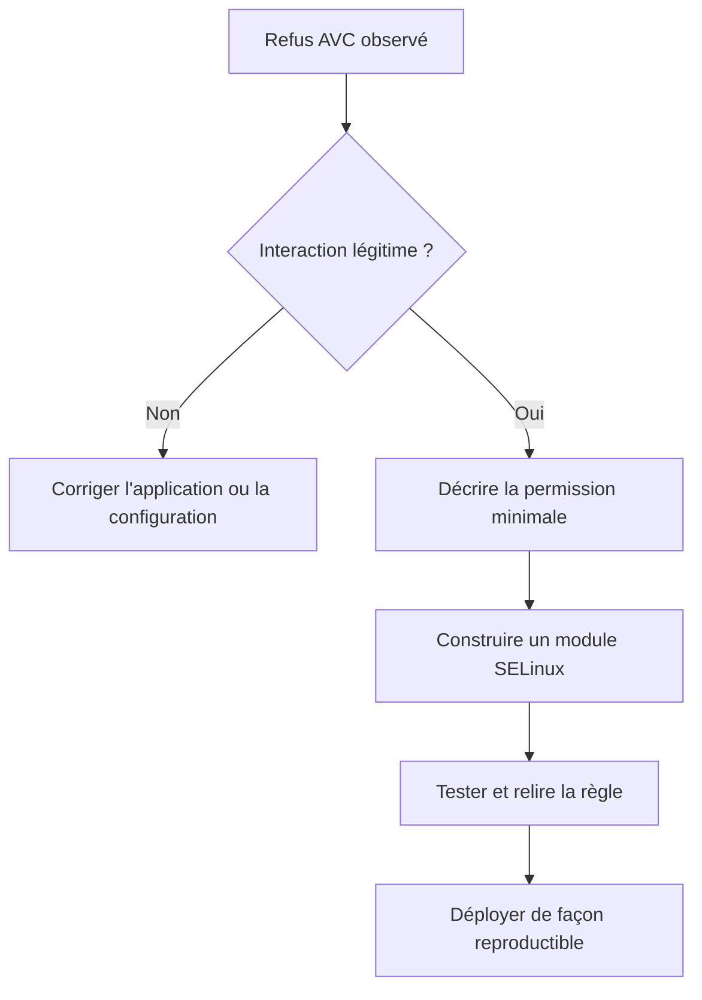

# Chapitre 6.5 — Création de règles SELinux

> **Campagne 6 — SELinux**

> *« Écrire une règle SELinux ne consiste pas à faire disparaître un refus. Il s'agit de décrire précisément le comportement légitime d'une application. »*

---

## Vous êtes ici

```text
Partie I — Construire un socle sécurisé

Campagne 6 — SELinux

      6.1 Pourquoi SELinux existe
      6.2 Les contextes
      6.3 Les politiques
      6.4 Diagnostic des refus
    ► 6.5 Création de règles
      6.6 Sécuriser Sentinel avec SELinux
```

---

## Objectifs pédagogiques

À la fin de ce chapitre, vous serez capable de :

- comprendre comment une règle SELinux est construite ;
- distinguer une bonne règle d'une règle dangereuse ;
- utiliser les principaux outils permettant de générer et d'installer des règles ;
- comprendre le rôle des modules de politique ;
- préparer la politique spécifique de Sentinel.

---

## Pourquoi ce chapitre existe

Depuis le début de cette campagne,

nous avons volontairement repoussé le moment où nous allions écrire des règles.

Ce choix est délibéré.

Dans de nombreuses formations,

on montre très rapidement une commande comme :

```bash
audit2allow
```

Puis on installe immédiatement le résultat.

L'application fonctionne.

Le stagiaire est satisfait.

Mais...

Il n'a absolument rien compris au fonctionnement de SELinux.

C'est exactement ce que nous voulions éviter.

Maintenant,

vous savez :

- pourquoi SELinux existe ;
- ce qu'est un contexte ;
- comment fonctionne une politique ;
- comment diagnostiquer un refus.

Nous pouvons enfin apprendre à créer des règles.

Et vous allez constater qu'une règle SELinux est finalement beaucoup plus simple qu'elle n'en a l'air.

---

## Théorie détaillée

### Une règle décrit une interaction

Une règle SELinux ne décrit jamais un fichier.

Elle ne décrit jamais un utilisateur.

Elle décrit une **interaction**.

Prenons Sentinel.

Il souhaite lire son fichier de configuration.

La règle correspondante peut être représentée ainsi.

```text
Processus

sentinel_t

↓

Action

read

↓

Objet

sentinel_conf_t

↓

ALLOW
```

Voilà toute la logique de SELinux.

Chaque règle répond simplement à la question :

> **Cette interaction est-elle autorisée ?**

---

## Une règle ne donne pas "tous les droits"

Prenons une erreur très fréquente.

Un administrateur pense :

> Sentinel doit accéder à sa configuration.

Il écrit alors mentalement :

```text
Sentinel

↓

Peut accéder

à

/etc
```

Cette formulation est beaucoup trop large.

Une bonne règle sera beaucoup plus précise.

```text
sentinel_t

↓

read

↓

sentinel_conf_t
```

On remarque immédiatement plusieurs différences.

La règle :

- ne parle pas du chemin ;
- ne parle pas du propriétaire ;
- ne parle pas de l'utilisateur ;
- ne parle que des types.

C'est cette abstraction qui rend SELinux si puissant.

---

## Une règle est extrêmement granulaire

Imaginons que Sentinel ait besoin de plusieurs opérations.

Lire.

```text
read
```

Écrire.

```text
write
```

Créer.

```text
create
```

Supprimer.

```text
unlink
```

Chaque opération correspond à une autorisation indépendante.

Autrement dit,

autoriser la lecture ne signifie absolument pas autoriser l'écriture.

C'est une différence majeure avec les permissions UNIX,

où plusieurs opérations sont souvent regroupées derrière le même bit.

SELinux permet un contrôle beaucoup plus fin.

---

## Les règles sont regroupées dans des modules

Une politique SELinux n'est pas un immense fichier unique.

Elle est constituée de nombreux modules.

Visualisons son organisation.



Chaque module apporte les règles correspondant à une application ou à un domaine fonctionnel.

Cette architecture facilite énormément la maintenance.

Lorsqu'une application évolue,

il suffit généralement de mettre à jour son module,

sans modifier toute la politique.

---

## Pourquoi utiliser un module ?

Prenons Sentinel.

Nous pourrions modifier directement la politique globale.

Ce serait une très mauvaise idée.

Pourquoi ?

Parce que les mises à jour de la distribution remplaceraient potentiellement nos modifications.

La bonne approche consiste à créer un module indépendant.

```text
Politique Red Hat

+

Module Sentinel

=

Politique finale
```

Cette séparation présente plusieurs avantages.

- maintenance simplifiée ;
- mises à jour sans conflit ;
- désinstallation propre ;
- versionnement possible.

C'est exactement la méthode utilisée par les éditeurs de logiciels professionnels.

---

## La syntaxe d'une règle

Une règle SELinux réelle ressemble à ceci.

```text
allow
```

Puis.

```text
Type source
```

Puis.

```text
Type cible
```

Puis.

```text
Classe
```

Puis.

```text
Permissions
```

Sous une forme simplifiée.

```text
allow

sentinel_t

sentinel_conf_t

:file

read
```

Cette syntaxe peut sembler austère.

En réalité,

elle est extrêmement logique.

Chaque champ répond à une question.

```text
Qui ?

↓

Vers quoi ?

↓

Quel type d'objet ?

↓

Quelle opération ?
```

Le langage SELinux est donc beaucoup plus déclaratif qu'il n'y paraît.

---

## Les classes d'objets

Jusqu'à présent,

nous avons principalement parlé de fichiers.

Pourtant,

une politique SELinux protège bien d'autres objets.

Par exemple.

```text
file
```

Fichier.

---

```text
dir
```

Répertoire.

---

```text
sock_file
```

Socket Unix.

---

```text
tcp_socket
```

Socket TCP.

---

```text
process
```

Processus.

---

```text
filesystem
```

Système de fichiers.

---

Autrement dit,

la politique peut contrôler pratiquement tous les objets manipulés par le noyau Linux.

Cette richesse explique la très grande précision de SELinux.

## Faut-il écrire ses règles à la main ?

La réponse est :

Oui...

mais rarement au début.

Dans un environnement professionnel,

la création d'une politique suit généralement plusieurs étapes.

```text
Application

↓

Refus SELinux

↓

Analyse des AVC

↓

Compréhension

↓

Règle

↓

Validation

↓

Déploiement
```

L'écriture manuelle intervient généralement à la fin du processus,

lorsque le comportement légitime de l'application est parfaitement connu.

---

## Le rôle d'audit2allow

L'outil le plus connu est probablement :

```bash
audit2allow
```

Son principe est simple.

Il lit les AVC enregistrées,

puis propose les règles susceptibles d'autoriser ces opérations.

Schématiquement.

```text
AVC

↓

audit2allow

↓

Proposition

de règle
```

Le mot important est :

```text
Proposition
```

L'outil ne décide jamais.

Il ne fait qu'interpréter les refus observés.

---

## Pourquoi audit2allow n'est pas magique

Imaginons que Sentinel ait été compromis.

L'attaquant tente :

```text
Lecture

↓

/etc/shadow
```

Une AVC apparaît.

Puis l'administrateur exécute.

```bash
audit2allow
```

L'outil répond.

```text
Une règle permettrait

d'autoriser cette lecture.
```

Techniquement,

c'est exact.

Mais...

Cette règle serait catastrophique.

Pourquoi ?

Parce que l'outil ignore totalement :

- le métier de Sentinel ;
- son architecture ;
- les intentions de l'attaquant.

Il traduit uniquement ce qu'il observe.

C'est donc toujours à l'ingénieur de décider.

---

## Une bonne utilisation d'audit2allow

La bonne démarche ressemble plutôt à ceci.

```text
AVC

↓

Analyse

↓

Cette opération

est-elle légitime ?

↓

Oui

↓

audit2allow

↓

Lecture

de la règle

↓

Validation

↓

Installation
```

L'outil intervient donc en fin de processus,

jamais au début.

---

## Générer un module

Une utilisation classique consiste à demander à audit2allow de produire directement un module.

Par exemple.

```bash
audit2allow -M sentinel
```

Le résultat est généralement :

```text
sentinel.pp

sentinel.te
```

Le premier correspond au module compilé.

Le second au fichier source.

Cette distinction est importante.

Le fichier :

```text
.te
```

reste lisible et modifiable.

Le fichier :

```text
.pp
```

est destiné au chargement dans SELinux.

---

## Installer un module

Une fois validé,

le module est chargé avec :

```bash
semodule -i sentinel.pp
```

La politique devient alors :

```text
Politique AlmaLinux

+

Module Sentinel

↓

Nouvelle politique

chargée

dans le noyau
```

Aucun redémarrage n'est nécessaire.

Le changement est immédiatement pris en compte.

---

## Désinstaller un module

Autre avantage.

Les modules sont indépendants.

Ils peuvent être retirés.

```bash
semodule -r sentinel
```

Le reste de la politique continue de fonctionner normalement.

Cette modularité facilite énormément les phases de test.

---

## Pourquoi éviter les règles trop générales

Prenons un exemple.

Sentinel doit écrire dans :

```text
/var/log/sentinel
```

Deux approches sont possibles.

#### Première

```text
Autoriser

l'écriture

dans

var_log_t
```

---

#### Deuxième

```text
Créer

un type spécifique

sentinel_log_t
```

Puis.

```text
Autoriser

uniquement

ce type.
```

La seconde approche est beaucoup plus sûre.

Elle limite très fortement les possibilités offertes à un processus compromis.

---

## La notion de domaine

Depuis le début de cette campagne,

nous rencontrons souvent des types comme :

```text
httpd_t
```

ou

```text
sshd_t
```

En réalité,

ils représentent ce que SELinux appelle un **domaine**.

Un domaine correspond au contexte d'exécution d'un processus.

Schématiquement.

```text
Processus

↓

Domaine

↓

Actions autorisées
```

Toutes les règles de la politique sont ensuite exprimées entre des domaines et des types d'objets.

Cette notion sera très importante lorsque nous construirons le domaine propre à Sentinel.

---

## Une règle n'est jamais isolée

Prenons une nouvelle fonctionnalité.

Sentinel doit désormais :

- créer un fichier ;
- l'écrire ;
- le relire ;
- le supprimer.

Il serait tentant de créer une seule règle.

En réalité,

plusieurs autorisations seront nécessaires.

Par exemple.

```text
create
```

---

```text
write
```

---

```text
read
```

---

```text
unlink
```

Chaque interaction devra être explicitement autorisée.

C'est ce niveau de détail qui permet à SELinux d'offrir une protection aussi fine.

---

## Construire progressivement la politique de Sentinel

À ce stade du livre,

nous ne cherchons pas encore à produire une politique complète.

Notre objectif est de préparer son architecture.

Nous savons déjà que Sentinel aura besoin d'interagir avec plusieurs catégories de ressources.

```text
Configuration

↓

Lecture
```

---

```text
Certificats

↓

Lecture
```

---

```text
Base locale

↓

Lecture / Écriture
```

---

```text
Journaux

↓

Création / Écriture
```

---

```text
Port HTTPS

↓

Bind / Listen
```

Le prochain chapitre réunira toutes les notions étudiées depuis le début de cette campagne afin de construire une politique SELinux cohérente pour Sentinel.

## 💎 Le point d'expertise

### Une bonne politique est presque toujours plus petite que l'on imagine

Lorsqu'un ingénieur découvre SELinux, il pense souvent qu'une politique efficace doit être volumineuse.

En réalité,

c'est généralement l'inverse.

Les meilleures politiques sont souvent les plus courtes.

Pourquoi ?

Parce qu'elles n'autorisent que le strict nécessaire.

Prenons Sentinel.

Une mauvaise approche consisterait à écrire une politique du type :

```text
Sentinel

↓

Peut lire

/etc
```

ou

```text
Sentinel

↓

Peut écrire

/var
```

Ces règles fonctionneraient.

Mais elles seraient pratiquement inutiles du point de vue de la sécurité.

Une bonne politique est beaucoup plus précise.

```text
sentinel_t

↓

read

↓

sentinel_conf_t
```

Puis :

```text
sentinel_t

↓

read

↓

sentinel_cert_t
```

Puis :

```text
sentinel_t

↓

write

↓

sentinel_log_t
```

Chaque règle possède une justification claire.

---

### Une règle doit toujours répondre à une exigence métier

C'est probablement la règle la plus importante de ce chapitre.

Avant d'écrire une autorisation,

posez-vous systématiquement la question :

> Pourquoi cette interaction est-elle nécessaire ?

Prenons quelques exemples.

#### Exemple 1

```text
Sentinel

↓

Lecture

↓

Configuration
```

Justification :

Le service ne peut pas démarrer sans sa configuration.

La règle est légitime.

---

#### Exemple 2

```text
Sentinel

↓

Lecture

↓

/home/*
```

Pourquoi ?

Aucune justification.

La règle ne doit pas exister.

---

#### Exemple 3

```text
Sentinel

↓

Connexion

↓

FreeIPA
```

Justification :

Authentification des utilisateurs.

La règle est cohérente.

---

Chaque autorisation doit pouvoir être expliquée fonctionnellement.

Si cette justification n'existe pas,

la règle ne devrait probablement jamais être créée.

---

### Une politique est vivante

Contrairement à une idée reçue,

une politique SELinux n'est jamais figée.

Une application évolue.

Par conséquent,

sa politique évolue également.

Visualisons le cycle de vie.

```text
Nouvelle version

        │

        ▼

Nouveaux besoins

        │

        ▼

Nouvelles AVC

        │

        ▼

Analyse

        │

        ▼

Évolution

de la politique
```

Une politique n'est donc pas un document terminé.

C'est un composant logiciel à part entière,

qui suit le même cycle de vie que l'application.

---

## 🧠 Comment pense un architecte ?

Avant d'autoriser quoi que ce soit,

un architecte cherche à répondre à une question.

> Quel est le domaine fonctionnel de cette application ?

Pour Sentinel,

la réponse ressemble à ceci.

```text
                 Sentinel

                     │

     ┌───────────────┼───────────────┐

     ▼               ▼               ▼

 Configuration    Journaux       Certificats

 Lecture          Écriture       Lecture

     ▼               ▼               ▼

sentinel_conf_t sentinel_log_t sentinel_cert_t
```

Une fois cette cartographie réalisée,

la politique devient presque automatique.

Chaque interaction légitime est autorisée.

Toutes les autres restent interdites.

---

### Penser en domaines plutôt qu'en chemins

Un architecte ne raisonne pratiquement jamais avec des chemins.

Il ne pense pas :

```text
/opt/sentinel
```

Il pense :

```text
Code applicatif
```

Il ne pense pas :

```text
/var/log/sentinel
```

Il pense :

```text
Journaux applicatifs
```

Cette abstraction est essentielle.

Elle permet de déplacer l'application,

de modifier son arborescence,

ou de la conteneuriser,

sans remettre en cause toute la logique de sécurité.

---

## ⚔️ Comment pense un attaquant ?

Une politique mal conçue constitue souvent une formidable opportunité.

Prenons une règle beaucoup trop large.

```text
sentinel_t

↓

read

↓

etc_t
```

Que voit immédiatement un attaquant ?

Il comprend qu'il pourra potentiellement accéder à :

- la configuration réseau ;
- les certificats d'autres services ;
- certaines informations système ;
- des fichiers qui n'ont aucun lien avec Sentinel.

Une règle trop générale augmente donc directement la surface d'attaque.

À l'inverse,

une politique très précise réduit fortement les possibilités d'exploration après compromission.

---

### Les règles inutilisées sont aussi dangereuses

Une autre erreur fréquente consiste à conserver d'anciennes autorisations.

Imaginons que Sentinel utilisait autrefois une base SQLite.

Plus tard,

l'application migre vers PostgreSQL.

La politique conserve pourtant plusieurs règles permettant d'accéder aux anciens fichiers.

Ces règles ne servent plus.

Elles représentent uniquement des possibilités supplémentaires offertes à un attaquant.

Une politique doit donc être régulièrement nettoyée,

au même titre que le code source.

---

## 🏢 En entreprise

Les grandes entreprises appliquent généralement un processus de validation avant toute modification de politique.

```text
Besoin fonctionnel

        │

        ▼

Analyse sécurité

        │

        ▼

Nouvelle règle

        │

        ▼

Tests

        │

        ▼

Validation

        │

        ▼

Déploiement Ansible
```

Cette démarche présente plusieurs avantages.

- toutes les règles sont documentées ;
- chaque autorisation possède un propriétaire ;
- les audits sont simplifiés ;
- les régressions sont limitées.

La politique SELinux devient ainsi un véritable actif de sécurité de l'entreprise,

au même titre qu'une politique Firewalld ou qu'une configuration systemd.

## 📚 Culture technique

### Les politiques SELinux sont écrites dans un langage dédié

Contrairement aux permissions UNIX,

les politiques SELinux ne sont pas stockées sous la forme d'un simple fichier de configuration.

Elles sont écrites dans un véritable langage déclaratif.

Par exemple.

```text
allow httpd_t httpd_sys_content_t:file read;
```

À première vue,

cette syntaxe paraît intimidante.

En réalité,

elle se lit presque comme une phrase.

```text
Autoriser

↓

httpd_t

↓

à lire

↓

les fichiers

↓

de type

↓

httpd_sys_content_t.
```

Le compilateur SELinux transforme ensuite ces fichiers sources en modules binaires chargés dans le noyau.

---

### Pourquoi existe-t-il plusieurs centaines de types ?

Un administrateur découvrant SELinux est souvent surpris.

Pourquoi trouve-t-on :

```text
httpd_t
httpd_sys_content_t
httpd_log_t
httpd_config_t
httpd_cache_t
...
```

Pourquoi ne pas utiliser simplement :

```text
httpd_t
```

La réponse est simple.

Parce que tous ces objets ne remplissent pas le même rôle.

Prenons Apache.

```text
Configuration

↓

Lecture uniquement
```

---

```text
Logs

↓

Écriture
```

---

```text
Pages Web

↓

Lecture
```

---

```text
Cache

↓

Lecture / Écriture
```

Chaque catégorie reçoit donc un type différent.

Cette séparation permet d'exprimer une politique beaucoup plus précise.

---

### Les modules facilitent la maintenance

L'utilisation de modules indépendants présente un avantage majeur.

Prenons l'exemple de Sentinel.

Quelques mois après son déploiement,

une nouvelle version introduit une fonctionnalité d'export.

Au lieu de modifier toute la politique SELinux,

il suffit de mettre à jour le module Sentinel.

```text
Politique système

──────────────┐

              │

Module Apache │

Module SSH    │

Module Podman │

Module Sentinel v2

              │

──────────────┘

↓

Politique finale
```

Cette architecture modulaire est très proche du fonctionnement d'un système de paquets RPM.

---

## ⚠️ Piège classique

### Installer aveuglément un module généré

L'erreur la plus fréquente consiste à enchaîner les commandes suivantes.

```bash
ausearch

↓

audit2allow

↓

semodule -i
```

Sans avoir lu une seule ligne de la règle produite.

Cette pratique est extrêmement dangereuse.

Pourquoi ?

Parce que vous déléguez votre politique de sécurité à un outil automatique.

L'outil ne connaît ni votre architecture,

ni vos exigences de sécurité,

ni les objectifs d'un éventuel attaquant.

Il traduit simplement ce qu'il observe.

Une règle générée automatiquement doit toujours être :

- lue ;
- comprise ;
- justifiée ;
- validée.

---

### Construire une politique "pour que ça marche"

Une autre erreur consiste à raisonner uniquement en termes de fonctionnement.

```text
L'application démarre ?

↓

Oui

↓

La politique est bonne.
```

Ce raisonnement est insuffisant.

Une bonne politique répond à deux questions.

```text
L'application fonctionne ?

↓

Oui
```

ET

```text
Une application compromise

reste-t-elle fortement limitée ?

↓

Oui
```

Si la seconde réponse est négative,

la politique doit être revue.

---

## Laboratoire AlmaLinux / Kali

### Objectif

Comprendre comment une politique évolue et apprendre à utiliser les outils de création de modules sans perdre de vue l'analyse de sécurité.

---

### Étape 1 — Identifier les modules installés

Afficher les modules actuellement chargés.

```bash
semodule -l
```

Repérer les principaux modules liés aux services étudiés dans ce manuel.

Par exemple :

- ssh ;
- httpd ;
- chronyd ;
- podman.

Observer qu'ils sont distribués indépendamment.

---

### Étape 2 — Générer un module de démonstration

À partir d'une AVC volontairement provoquée,

générer un module.

```bash
audit2allow -M demo
```

Sans l'installer,

ouvrir le fichier :

```text
demo.te
```

Lire chaque règle.

Essayer d'expliquer,

en français,

ce qu'elle autorise réellement.

---

### Étape 3 — Analyse critique

Pour chaque règle générée,

répondre aux questions suivantes.

- Cette interaction est-elle légitime ?
- Est-elle indispensable ?
- Existe-t-il une manière plus restrictive d'obtenir le même résultat ?
- La règle reste-t-elle valable si Sentinel évolue ?

Cette étape est volontairement plus importante que la génération du module elle-même.

---

### Étape 4 — Réflexion d'architecture

Construire un premier schéma de politique pour Sentinel.

Identifier :

- les domaines ;
- les types d'objets ;
- les interactions nécessaires ;
- les interactions interdites.

Ce schéma servira directement au chapitre suivant.

---

## Mission d'ingénieur

Votre équipe reçoit la responsabilité de publier la première politique SELinux officielle de Sentinel.

Cette politique sera installée sur plusieurs centaines de serveurs.

Avant toute mise en production,

vous devez réaliser une revue complète.

Votre rapport devra démontrer :

- que chaque règle répond à un besoin métier identifié ;
- qu'aucune autorisation n'est présente "par précaution" ;
- que toutes les autorisations sont documentées ;
- que la politique respecte strictement le principe du moindre privilège.

Vous devrez également proposer un processus permettant de faire évoluer cette politique à chaque nouvelle version de Sentinel sans introduire de régression de sécurité.

---

## Impact sur Sentinel

Nous disposons maintenant de tous les outils nécessaires pour construire une politique adaptée à Sentinel.

Nous savons :

- interpréter les contextes ;
- comprendre les décisions du Type Enforcement ;
- analyser une AVC ;
- générer un module ;
- valider une règle avant son installation.

Il ne manque plus qu'une étape.

Appliquer concrètement tous ces concepts à notre application.

C'est précisément l'objectif du dernier chapitre de cette campagne.

---

## Synthèse

- Une règle SELinux décrit une interaction, jamais un chemin.
- Les modules permettent d'étendre la politique sans modifier la politique système.
- `audit2allow` est un assistant de génération, pas un moteur de décision.
- Chaque autorisation doit répondre à une exigence fonctionnelle clairement identifiée.
- Une politique doit évoluer au même rythme que l'application qu'elle protège.
- Une politique trop permissive protège peu ; une politique trop restrictive bloque le fonctionnement. L'équilibre repose sur une compréhension fine des besoins métiers.

---

## Infographie de révision

```text
┌──────────────────────────────────────────────────────────────────────────────────────────────┐
│                    CHAPITRE 6.5 — CRÉATION DE RÈGLES SELINUX                                 │
├──────────────────────────────────────────────────────────────────────────────────────────────┤
│                                                                                              │
│        AVC                                                                                    │
│         │                                                                                    │
│         ▼                                                                                    │
│   Analyse du besoin                                                                          │
│         │                                                                                    │
│         ▼                                                                                    │
│  Interaction légitime ?                                                                      │
│      │                 │                                                                     │
│    NON                 OUI                                                                   │
│      │                 │                                                                     │
│      ▼                 ▼                                                                     │
│ Aucune règle      audit2allow                                                                │
│                         │                                                                    │
│                         ▼                                                                    │
│                 Lecture critique du .te                                                      │
│                         │                                                                    │
│                         ▼                                                                    │
│                 Module (.pp) validé                                                          │
│                         │                                                                    │
│                         ▼                                                                    │
│                   semodule -i                                                                │
│                                                                                              │
├──────────────────────────────────────────────────────────────────────────────────────────────┤
│ BONNES PRATIQUES                                                                             │
│                                                                                              │
│ ✔ Une règle = un besoin métier                                                               │
│ ✔ Toujours lire le fichier .te                                                               │
│ ✔ Préférer des types spécifiques                                                             │
│ ✔ Utiliser des modules indépendants                                                          │
│ ✘ Ne jamais installer automatiquement tout ce que propose audit2allow                        │
├──────────────────────────────────────────────────────────────────────────────────────────────┤
│ IDÉE CLÉ                                                                                     │
│                                                                                              │
│ « Une politique SELinux décrit le comportement normal de l'application.                      │
│  Toute interaction non prévue doit être considérée comme suspecte jusqu'à preuve du          │
│  contraire. »                                                                                │
└──────────────────────────────────────────────────────────────────────────────────────────────┘
```
---

← [6.4 — Diagnostic des refus SELinux](6.4-diagnostic-refus-selinux.md) · [6.6 — Sécuriser Sentinel avec SELinux](6.6-securiser-sentinel-selinux.md) →
