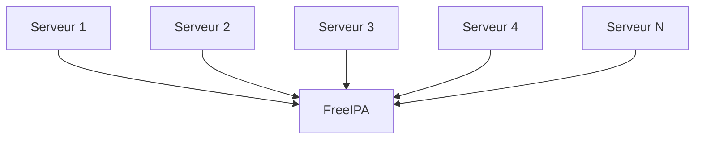
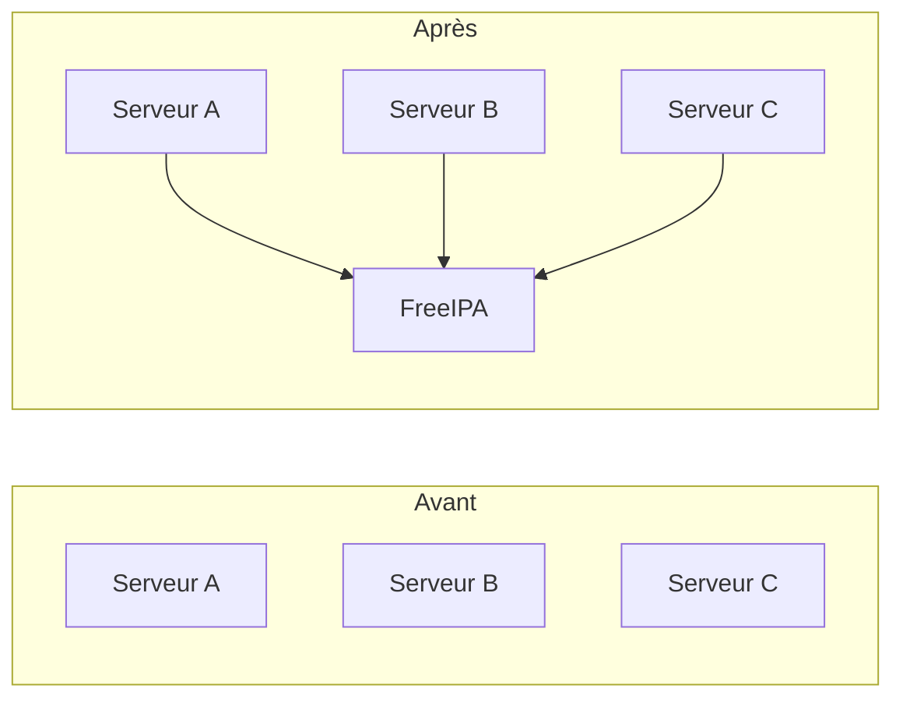
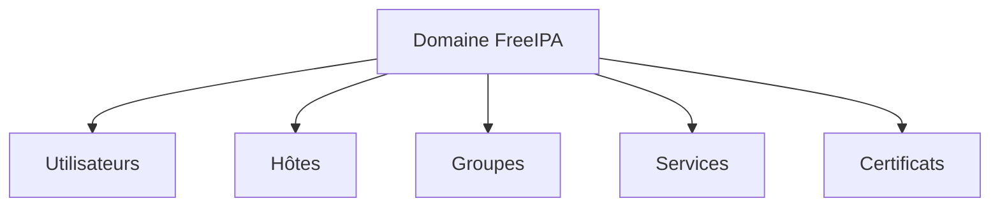
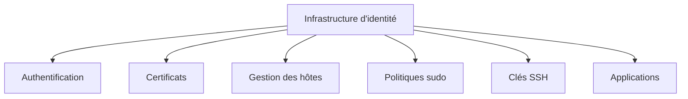

# Chapitre 8.1 — Présentation de FreeIPA

> **Campagne 8 — FreeIPA**

> *« Une infrastructure devient réellement administrable lorsque les identités cessent d'être locales et deviennent un service partagé. »*

---

## Vous êtes ici

```text
PARTIE II — Industrialiser la sécurité

Campagne 8  [█░░░░░░░░░]

   ►  8.1 Présentation de FreeIPA
      8.2 Architecture interne
      8.3 Installation
      8.4 Gestion des utilisateurs
      8.5 Groupes et rôles
      8.6 Politiques sudo
      8.7 Gestion des hôtes
      8.8 Certificats
      8.9 Intégration de Sentinel
      8.10 Mission : administrer une infrastructure avec FreeIPA
```

---

## Objectifs pédagogiques

À la fin de ce chapitre, vous serez capable de :

- comprendre pourquoi FreeIPA existe ;
- identifier les limites d'une gestion locale des identités ;
- expliquer les principaux services fournis par FreeIPA ;
- comprendre la notion de gestion centralisée des identités ;
- distinguer FreeIPA d'un simple annuaire LDAP ;
- préparer les chapitres techniques consacrés à son architecture et à son déploiement.

---

## Pourquoi ce chapitre existe

Jusqu'à présent, toute notre formation s'est déroulée sur une machine unique.

Les utilisateurs étaient décrits dans :

```text
/etc/passwd
```

Les groupes dans :

```text
/etc/group
```

Les mots de passe dans :

```text
/etc/shadow
```

Cette approche fonctionne parfaitement.

Tant que l'on possède…

Une machine.

Ou deux.

Mais imaginons maintenant une véritable entreprise.

Elle possède :

- cinquante serveurs AlmaLinux ;
- deux cents utilisateurs ;
- plusieurs équipes ;
- plusieurs applications ;
- des administrateurs différents selon les environnements.

Une simple question devient alors très compliquée.

> **Comment créer un nouvel utilisateur sur cinquante serveurs ?**

La réponse la plus naïve serait :

> « Il suffit d'exécuter `useradd` cinquante fois. »

Évidemment, cette solution n'est pas réaliste.

Et ce n'est que le premier problème.

---

## Les limites des comptes locaux

Imaginons qu'Alice rejoigne l'entreprise.

Elle doit accéder à :

- un serveur Git ;
- deux serveurs Web ;
- un serveur de supervision ;
- trois serveurs Sentinel ;
- plusieurs machines d'administration.

Sans annuaire centralisé, il faut :

- créer son compte partout ;
- lui attribuer le même UID ;
- créer les mêmes groupes ;
- définir les mêmes permissions ;
- maintenir le même mot de passe.

Quelques mois plus tard, Alice change de mot de passe.

Le changement doit être effectué…

Partout.

Puis Alice quitte l'entreprise.

Son compte doit être supprimé…

Partout.

On peut représenter cette situation ainsi.

```mermaid
flowchart LR

    A[Alice]

    A --> S1[Serveur 1]

    A --> S2[Serveur 2]

    A --> S3[Serveur 3]

    A --> S4[Serveur 4]

    A --> S5[Serveur N]

    S1 --> U1[/etc/passwd]

    S2 --> U2[/etc/passwd]

    S3 --> U3[/etc/passwd]

    S4 --> U4[/etc/passwd]

    S5 --> U5[/etc/passwd]
```

Chaque serveur possède sa propre vérité.

Le risque d'incohérence augmente rapidement.

---

## La duplication crée toujours des problèmes

Supposons maintenant qu'un administrateur oublie de supprimer le compte d'Alice sur un seul serveur.

Tous les autres systèmes sont correctement mis à jour.

Mais un serveur conserve encore :

- son compte ;
- ses groupes ;
- éventuellement ses accès `sudo`.

Que se passe-t-il ?

Alice — ou toute personne connaissant encore ses identifiants — peut continuer à accéder à cette machine.

La sécurité globale dépend alors du serveur le moins bien administré.

Ce phénomène apparaît systématiquement lorsque les informations sont dupliquées.

Plus les copies sont nombreuses, plus leur synchronisation devient difficile.

---

## Une autre façon de penser

Au lieu de demander :

> « Sur quels serveurs dois-je créer Alice ? »

Posons une autre question.

> **Où devrait exister l'identité d'Alice ?**

La réponse est simple.

À un seul endroit.

Tous les serveurs devraient ensuite venir consulter cette source.

Cette idée est au cœur de la gestion centralisée des identités.

On passe d'un modèle distribué…

```mermaid
flowchart TD

    U1[/etc/passwd<br/>Serveur 1]

    U2[/etc/passwd<br/>Serveur 2]

    U3[/etc/passwd<br/>Serveur 3]

    U4[/etc/passwd<br/>Serveur 4]

    U5[/etc/passwd<br/>Serveur N]
```

…à un modèle centralisé.



Un seul annuaire.

Une seule source de vérité.

Une seule administration.

---

## FreeIPA n'est pas seulement un annuaire

Lorsque l'on découvre FreeIPA, on pense souvent :

> « C'est un serveur LDAP. »

Cette affirmation est incomplète.

LDAP constitue effectivement une partie de FreeIPA.

Mais seulement une partie.

FreeIPA est une plateforme complète de gestion des identités.

Elle permet notamment de gérer :

- les utilisateurs ;
- les groupes ;
- les hôtes ;
- les politiques `sudo` ;
- les clés SSH ;
- les certificats ;
- les services ;
- les permissions d'administration ;
- l'authentification Kerberos.

Autrement dit, FreeIPA centralise une grande partie de ce que nous avons étudié depuis le début de cette formation.

---
## Pourquoi FreeIPA a été créé

Avant FreeIPA, plusieurs composants existaient déjà.

Par exemple :

- un annuaire LDAP ;
- un serveur Kerberos ;
- une autorité de certification ;
- un serveur DNS ;
- différents outils d'administration.

Le problème n'était pas leur existence.

Le problème était leur intégration.

Chaque composant possédait :

- sa propre configuration ;
- ses propres commandes ;
- ses propres utilisateurs ;
- sa propre logique d'administration.

Les administrateurs devaient apprendre plusieurs technologies différentes.

Et surtout, ils devaient les faire fonctionner ensemble.

Cette intégration était souvent longue.

Et parfois fragile.

FreeIPA est né d'une idée simple.

> **Assembler ces briques dans une plateforme cohérente et prête à l'emploi.**

---

## Une analogie simple

Imaginons une grande entreprise.

Chaque bâtiment possède un gardien.

Chaque gardien possède sa propre liste des employés.

Lorsqu'un nouvel employé arrive, il faut prévenir tous les gardiens.

Lorsqu'un employé quitte l'entreprise, il faut également prévenir tout le monde.

Cette organisation fonctionne.

Mais elle est coûteuse.

Elle est également source d'erreurs.

Imaginons maintenant un accueil central.

Chaque gardien consulte la même base.

Lorsqu'un employé est créé.

Toute l'entreprise le connaît immédiatement.

Lorsqu'un employé quitte l'entreprise.

Son accès disparaît partout.

FreeIPA joue exactement ce rôle.

Il devient le référentiel unique des identités de l'entreprise.

---

## Que devient un serveur AlmaLinux ?

Jusqu'à présent, nos serveurs étaient autonomes.

Ils possédaient leurs propres comptes locaux.

Avec FreeIPA, leur rôle évolue.

Ils deviennent des **clients** de l'infrastructure d'identité.

On peut représenter cette évolution ainsi.



Les comptes locaux ne disparaissent pas.

Ils continuent d'exister.

En revanche, la majorité des utilisateurs de l'entreprise proviennent désormais de FreeIPA.

---

## Une seule authentification

Prenons un exemple.

Alice ouvre une session sur le serveur Sentinel.

Le lendemain, elle se connecte sur un serveur Ansible.

Puis sur une machine de supervision.

Dans un environnement local, chaque serveur devrait connaître Alice.

Avec FreeIPA, tous les serveurs consultent le même annuaire.

On obtient donc :

```text
                Alice

                  │

                  ▼

             Authentification

                  │

                  ▼

               FreeIPA

        ┌─────────┼─────────┐

        ▼         ▼         ▼

   Sentinel   Supervision   Ansible
```

L'identité est unique.

Les serveurs deviennent simplement des consommateurs de cette identité.

---

## La notion de domaine

L'un des concepts fondamentaux de FreeIPA est celui de **domaine**.

Un domaine représente un périmètre d'administration.

Il définit notamment :

- les utilisateurs ;
- les groupes ;
- les hôtes ;
- les politiques ;
- les services.

Tous les membres du domaine partagent les mêmes mécanismes d'authentification.

Ils parlent le même langage.

Ils se font confiance.

Dans une entreprise, on peut représenter cela ainsi.



Le domaine devient le cœur de l'infrastructure d'identité.

---

## Que reste-t-il dans `/etc/passwd` ?

Une question revient souvent.

> **Si les utilisateurs sont dans FreeIPA, à quoi sert encore `/etc/passwd` ?**

La réponse est importante.

Le fichier continue d'exister.

Il contient toujours :

- `root` ;
- les comptes système ;
- quelques comptes locaux si nécessaire.

En revanche, les utilisateurs de l'entreprise ne sont plus nécessairement enregistrés dans ce fichier.

Lorsque le système recherche un utilisateur.

Par exemple :

```bash
id alice
```

Il interroge d'abord **NSS**.

NSS peut alors consulter :

- les fichiers locaux ;
- SSSD ;
- puis FreeIPA.

Autrement dit, les commandes Linux restent exactement les mêmes.

Ce qui change, c'est **l'origine des informations**.

Nous retrouverons ce fonctionnement lorsque nous étudierons SSSD et l'intégration des clients FreeIPA.

---

## Une administration beaucoup plus simple

Imaginons maintenant une opération très courante.

Vous devez créer un nouvel administrateur.

Sans FreeIPA.

Vous devez intervenir sur chaque serveur.

Avec FreeIPA.

Vous créez un seul utilisateur.

Vous l'ajoutez au bon groupe.

Tous les serveurs appliquent immédiatement cette nouvelle politique.

On peut résumer ce changement ainsi.


Le gain n'est pas seulement opérationnel.

Il est également sécuritaire.

Il devient beaucoup plus difficile d'oublier un serveur ou de créer des configurations incohérentes.

---

### 💎 Le point d'expertise

Une erreur fréquente consiste à considérer FreeIPA comme une simple « base d'utilisateurs ».

En réalité, il constitue le **socle de confiance** d'une infrastructure Linux.

Lorsqu'un serveur rejoint un domaine FreeIPA, il ne reçoit pas uniquement une liste de comptes.

Il rejoint un environnement où plusieurs services coopèrent :

- l'identité des utilisateurs ;
- l'authentification Kerberos ;
- les politiques `sudo` ;
- les clés SSH ;
- les certificats X.509 ;
- les informations sur les hôtes ;
- les politiques d'accès.

Autrement dit, FreeIPA ne centralise pas uniquement **qui est l'utilisateur**.

Il centralise également **ce qu'il est autorisé à faire**, **comment il s'authentifie** et **comment les autres machines lui font confiance**.

C'est cette vision globale qui en fait bien plus qu'un simple annuaire LDAP.

---
### 🧠 Comment pense un architecte ?

Pour un architecte, FreeIPA n'est pas un logiciel.

C'est un **service d'infrastructure**.

Au même titre que :

- le DNS ;
- le routage ;
- la synchronisation horaire (NTP) ;
- ou le stockage.

Pourquoi ?

Parce que si l'infrastructure d'identité devient indisponible, une grande partie des autres services cesse progressivement de fonctionner correctement.

L'architecte considère donc FreeIPA comme une brique critique.

Il réfléchit immédiatement à des questions telles que :

- Comment assurer sa haute disponibilité ?
- Comment le sauvegarder ?
- Comment répliquer ses données ?
- Comment protéger les comptes administrateurs ?
- Comment gérer la reprise après sinistre ?

Il ne voit pas FreeIPA comme un serveur supplémentaire.

Il le considère comme **la racine de confiance** de toute l'infrastructure Linux.



Lorsque cette racine est saine, tout le reste devient beaucoup plus simple à administrer.

---

### ⚔️ Comment pense un attaquant ?

Pour un attaquant, FreeIPA représente une cible de très grande valeur.

Pourquoi ?

Parce qu'il concentre une quantité importante d'informations sensibles.

Par exemple :

- les identités des utilisateurs ;
- les groupes ;
- les politiques `sudo` ;
- les hôtes enregistrés ;
- les certificats ;
- les services Kerberos.

Une compromission de FreeIPA peut avoir un impact sur l'ensemble du domaine.

À l'inverse, une bonne architecture limite fortement cette possibilité.

L'attaquant cherchera notamment :

- un compte administrateur FreeIPA ;
- une mauvaise délégation de privilèges ;
- un serveur IPA mal protégé ;
- des certificats compromis ;
- des secrets Kerberos exposés.

Cette concentration des responsabilités explique pourquoi la protection d'un serveur FreeIPA doit être particulièrement rigoureuse.

---

### 📚 Culture technique

FreeIPA est principalement développé par Red Hat.

Il constitue la solution de référence pour la gestion centralisée des identités dans les environnements Linux de type RHEL.

Son nom peut prêter à confusion.

Le terme **IPA** signifie :

> **Identity, Policy, Audit**

Ces trois mots résument parfaitement sa philosophie.

- **Identity** : gérer les identités.
- **Policy** : centraliser les politiques de sécurité.
- **Audit** : assurer la traçabilité des opérations.

Au fil des années, le projet s'est enrichi de nombreuses fonctionnalités.

Aujourd'hui, il ne sert plus uniquement à gérer des utilisateurs.

Il constitue une véritable plateforme de confiance pour les infrastructures Linux.

---

### ⚠️ Piège classique

Une erreur fréquente consiste à vouloir supprimer tous les comptes locaux après le déploiement de FreeIPA.

Ce serait une mauvaise idée.

Pourquoi ?

Parce qu'un serveur doit toujours pouvoir fonctionner, au minimum, même si l'annuaire central devient momentanément indisponible.

Par exemple :

- le compte `root` reste local ;
- les comptes système restent locaux ;
- certains comptes d'urgence (*break glass accounts*) peuvent également rester locaux selon la politique de l'entreprise.

FreeIPA complète les identités locales.

Il ne les remplace pas entièrement.

Une architecture robuste conserve toujours une solution de secours permettant d'administrer une machine isolée.

---

## Laboratoire AlmaLinux

Avant même d'installer FreeIPA, observons le fonctionnement actuel de notre machine.

Affichez un utilisateur local.

```bash
id $(whoami)
```

Puis recherchez son origine.

```bash
getent passwd $(whoami)
```

Le résultat provient actuellement de :

```text
/etc/passwd
```

Essayez également :

```bash
getent group wheel
```

Puis :

```bash
getent passwd root
```

Vous remarquerez que `getent` ne lit pas directement les fichiers.

Il interroge **NSS**.

Aujourd'hui, NSS renvoie des informations locales.

Après l'intégration de la machine dans FreeIPA, ces mêmes commandes continueront à fonctionner.

La différence sera invisible pour les applications.

Seule la source des informations changera.

C'est l'un des objectifs fondamentaux de l'architecture Linux.

---

## Impact sur Sentinel

Jusqu'à présent, Sentinel reposait essentiellement sur des identités locales.

À partir de cette campagne, son fonctionnement va évoluer.

Les administrateurs de Sentinel ne seront plus créés directement sur chaque serveur.

Ils seront créés dans FreeIPA.

Les groupes d'administration de Sentinel seront également centralisés.

Progressivement, Sentinel s'appuiera sur FreeIPA pour :

- identifier les utilisateurs ;
- récupérer leurs groupes ;
- appliquer les politiques `sudo` ;
- gérer les certificats utilisés pour TLS ;
- authentifier les services.

Cette évolution représente une étape majeure.

Sentinel cesse d'être une application isolée.

Elle devient un véritable composant d'une infrastructure d'entreprise.

---
## Synthèse

- FreeIPA centralise la gestion des identités d'une infrastructure Linux.
- Il permet d'éviter la duplication des comptes sur chaque serveur.
- Les serveurs deviennent des **clients** d'une infrastructure d'identité commune.
- FreeIPA ne remplace pas uniquement `/etc/passwd` ; il centralise également les groupes, les politiques `sudo`, les certificats, les hôtes et les services.
- Les comptes locaux restent indispensables pour le fonctionnement du système et pour les procédures de secours.
- Les applications continuent à utiliser les mêmes interfaces Linux (PAM, NSS, SSSD) ; seule l'origine des informations évolue.
- FreeIPA constitue une **racine de confiance** pour l'ensemble d'un parc Linux.

---

## Infographie de révision

```text
                     FREEIPA : UNE SOURCE DE VÉRITÉ

                    Avant (comptes locaux)

        Serveur A         Serveur B         Serveur C
            │                 │                 │
            ▼                 ▼                 ▼
      /etc/passwd       /etc/passwd       /etc/passwd
      /etc/group        /etc/group        /etc/group
      /etc/shadow       /etc/shadow       /etc/shadow

           Chaque serveur possède sa propre vérité.

──────────────────────────────────────────────────────────────────────────────

                    Après (gestion centralisée)

                          +------------------+
                          |     FreeIPA      |
                          |------------------|
                          | Utilisateurs     |
                          | Groupes          |
                          | Hôtes            |
                          | Certificats      |
                          | Politiques sudo  |
                          | Clés SSH         |
                          +------------------+
                             ▲     ▲     ▲
                             │     │     │
               ┌─────────────┘     │     └─────────────┐
               │                   │                   │
               ▼                   ▼                   ▼
          Serveur A          Serveur B          Serveur C

          Une seule source de vérité pour tout le domaine.

──────────────────────────────────────────────────────────────────────────────

              Les applications ne changent pas

              SSH
                │
              sudo
                │
             Sentinel
                │
             getent
                │
                ▼
           NSS / SSSD
                │
                ▼
             FreeIPA

──────────────────────────────────────────────────────────────────────────────

              Une identité.
              Une politique.
              Une administration.
              Une infrastructure cohérente.
```

## Pour aller plus loin

Nous savons désormais **pourquoi** FreeIPA existe.

Mais une question reste entière.

> **Comment un seul serveur peut-il fournir autant de services différents ?**

En effet, FreeIPA semble tout faire à la fois.

Il gère :

- les utilisateurs ;
- les groupes ;
- les authentifications ;
- les certificats ;
- les politiques `sudo` ;
- les hôtes ;
- parfois même le DNS.

La réponse est simple.

FreeIPA n'est pas un logiciel monolithique.

C'est un **assemblage de plusieurs composants spécialisés**, chacun étant reconnu depuis longtemps dans le monde Linux.

Dans le prochain chapitre, nous ouvrirons le capot de FreeIPA.

Nous découvrirons son architecture interne, le rôle de **389 Directory Server**, **Kerberos**, **Dogtag PKI**, **SSSD**, **DNS** et les interactions entre ces composants.

Comprendre cette architecture sera essentiel pour administrer efficacement une infrastructure FreeIPA et diagnostiquer les problèmes que nous rencontrerons dans les chapitres suivants.

---

[8.2 — Architecture interne de FreeIPA](8.2-architecture-interne-freeipa.md) →
