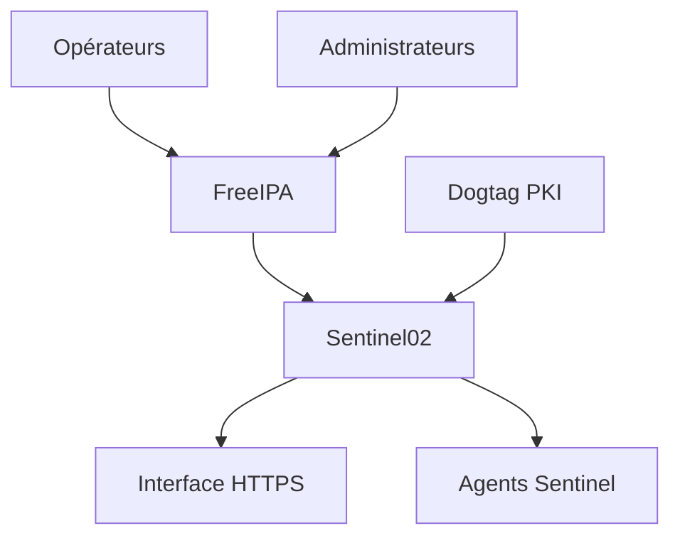
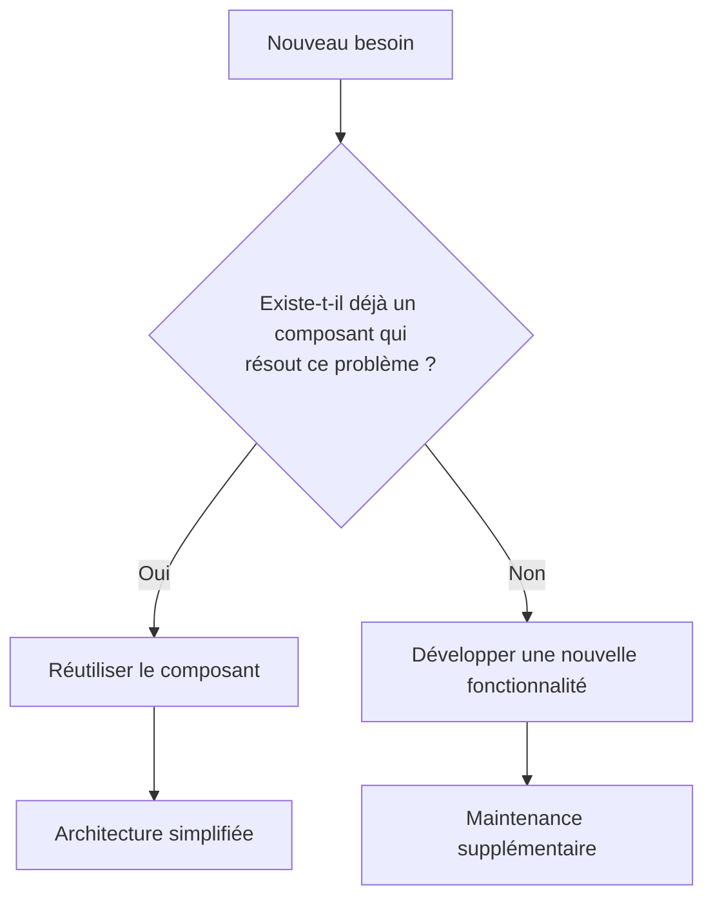
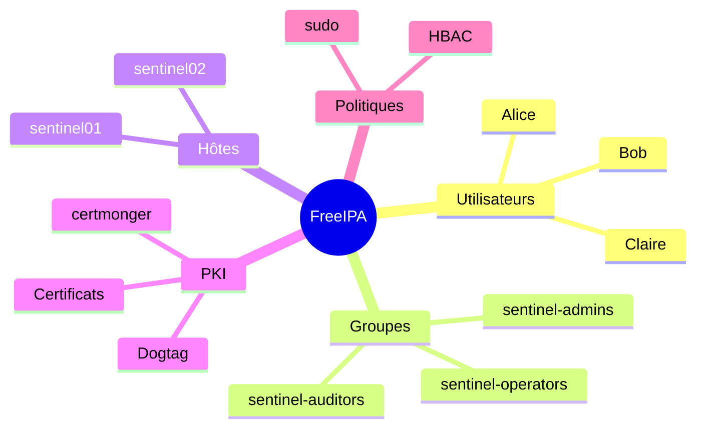
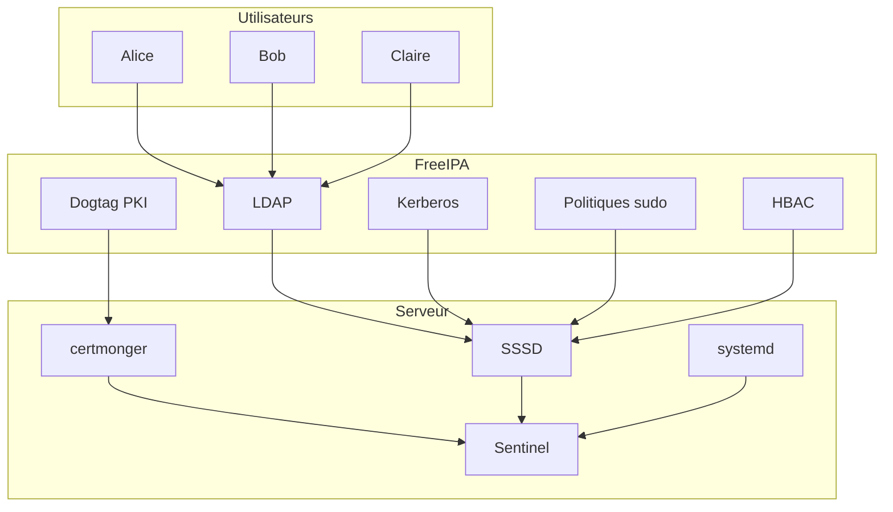

# Chapitre 8.10 — Mission : administrer avec FreeIPA

> **Campagne 8 — FreeIPA**

> *« Savoir utiliser un outil est une chose. Être capable de concevoir une architecture cohérente en est une autre. »*

---

## Vous êtes ici

```text
PARTIE II — Industrialiser la sécurité

Campagne 8  [██████████]

      8.1 Présentation de FreeIPA ✔
      8.2 Architecture interne ✔
      8.3 Installation ✔
      8.4 Gestion des utilisateurs ✔
      8.5 Groupes et rôles ✔
      8.6 Politiques sudo ✔
      8.7 Gestion des hôtes ✔
      8.8 Certificats ✔
      8.9 Intégration de Sentinel ✔
   ►  8.10 Mission : administrer une infrastructure avec FreeIPA
```

---

## Objectifs pédagogiques

Cette mission a pour objectif de vérifier que vous êtes capable de :

- concevoir une infrastructure FreeIPA cohérente ;
- intégrer un nouveau serveur Sentinel ;
- appliquer le principe du moindre privilège ;
- utiliser les groupes comme mécanisme d'administration ;
- exploiter la PKI de FreeIPA ;
- diagnostiquer un problème d'intégration.

Contrairement aux chapitres précédents, cette mission ne guide plus chaque étape.

Vous devez prendre les décisions techniques appropriées.

---

## Pourquoi ce chapitre existe

Ce chapitre fournit le modèle mental et les pratiques nécessaires pour aborder **Mission : administrer avec FreeIPA** dans un socle AlmaLinux sécurisé et reproductible.

---

## Le contexte

Votre entreprise possède désormais une plateforme Sentinel.

Un second serveur doit être ajouté.

Il sera utilisé pour :

- superviser un nouvel environnement ;
- héberger une interface Web ;
- recevoir des connexions HTTPS ;
- être administré par les opérateurs de l'équipe sécurité.

L'infrastructure FreeIPA existe déjà.

Vous devez intégrer cette nouvelle machine en respectant les bonnes pratiques étudiées dans cette campagne.

---

## Architecture cible



Aucun composant ne doit être configuré manuellement si l'infrastructure fournit déjà le service correspondant.

---

## Contraintes

Vous devez respecter les règles suivantes.

Le serveur :

- possède un FQDN valide ;
- rejoint le domaine FreeIPA ;
- utilise un certificat délivré par Dogtag ;
- fonctionne avec un compte système dédié.

Les opérateurs :

- peuvent redémarrer Sentinel ;
- ne peuvent pas ouvrir un shell root ;
- ne peuvent pas administrer les autres services Linux.

Les administrateurs :

- disposent des droits nécessaires pour maintenir l'application ;
- restent soumis aux politiques de sécurité de l'entreprise.

Aucun mot de passe utilisateur ne doit être stocké dans Sentinel.

Aucun certificat ne doit être copié depuis une autre machine.

## Travail demandé

Vous êtes libre de choisir votre méthode de mise en œuvre.

En revanche, votre architecture doit permettre de répondre aux exigences suivantes.

### 1. Préparer le serveur

Le nouveau serveur doit être :

- correctement nommé ;
- synchronisé avec la source de temps ;
- capable de résoudre le domaine FreeIPA ;
- enrôlé dans le domaine.

Les éléments suivants devront être vérifiés.

```text
hostname -f

dig

chronyc

ipa-client-install
```

---

### 2. Intégrer le serveur à l'infrastructure

Le serveur doit ensuite être ajouté aux groupes d'hôtes appropriés.

Par exemple :

```text
sentinel-servers
```

Vous devrez justifier ce choix.

Demandez-vous notamment :

- quelles politiques utiliseront ce groupe ;
- quels seraient les impacts si le serveur appartenait à un autre groupe.

---

### 3. Préparer l'identité de service

Le service HTTP de Sentinel devra posséder :

- un principal Kerberos ;
- un certificat TLS ;
- un renouvellement automatique via `certmonger`.

Vous devrez expliquer pourquoi ces trois éléments sont complémentaires.

---

### 4. Préparer les opérateurs

Les membres de :

```text
sentinel-operators
```

doivent pouvoir :

- consulter l'état du service ;
- le redémarrer ;
- vérifier son fonctionnement.

Ils ne doivent pas pouvoir :

- modifier l'unité `systemd` ;
- lancer un shell root ;
- arrêter des services sans rapport avec Sentinel.

Expliquez comment votre politique `sudo` répond à ces contraintes.

---

### 5. Préparer l'application

Sentinel doit exploiter :

- les utilisateurs du domaine ;
- les groupes FreeIPA ;
- son certificat TLS.

En revanche, l'application ne doit pas :

- stocker les mots de passe de l'entreprise ;
- gérer elle-même les groupes d'administration.

Justifiez ces choix d'architecture.

---

## Livrables attendus

À l'issue de cette mission, vous devrez être capable de produire :

- un schéma d'architecture ;
- une liste des objets créés dans FreeIPA ;
- une procédure d'installation reproductible ;
- une procédure de diagnostic ;
- une procédure de désinstallation complète.

L'objectif n'est pas seulement que la plateforme fonctionne.

Elle doit également être :

- administrable ;
- maintenable ;
- sécurisée ;
- documentée.

C'est cette capacité à raisonner sur l'ensemble du cycle de vie qui distingue un administrateur système d'un véritable architecte d'infrastructure.

## 💎 Le point d'expertise

Une infrastructure FreeIPA bien conçue ne cherche pas à centraliser absolument tout.

Elle centralise uniquement ce qui doit être partagé.

Prenons quelques exemples.

Les utilisateurs de l'entreprise doivent être identiques sur tous les serveurs.

Ils ont donc toute leur place dans FreeIPA.

En revanche, les paramètres propres à Sentinel n'ont aucun intérêt à être stockés dans l'annuaire.

Par exemple :

- la fréquence de collecte ;
- les seuils d'alerte ;
- les tableaux de bord ;
- les préférences d'affichage.

Ces informations relèvent exclusivement de l'application.

Un architecte cherche toujours à placer chaque donnée au bon endroit.

---

## 🧠 Comment pense un architecte ?

Lorsqu'un nouveau besoin apparaît, un architecte applique souvent un raisonnement similaire au suivant.



Cette approche permet d'éviter deux écueils fréquents :

- réinventer un mécanisme déjà disponible ;
- multiplier inutilement les responsabilités d'une application.

Dans le cas de Sentinel, ce raisonnement conduit naturellement à utiliser :

- FreeIPA pour les identités ;
- Dogtag pour les certificats ;
- SSSD pour la résolution des utilisateurs ;
- `systemd` pour le cycle de vie du service ;
- `journald` pour les journaux système.

Sentinel se concentre alors sur la supervision et l'analyse.

---

## ⚔️ Comment pense un attaquant ?

Un attaquant recherche souvent les points où deux systèmes ne sont plus synchronisés.

Par exemple :

```text
Utilisateur supprimé de FreeIPA

↓

Compte encore actif dans l'application
```

Ou encore :

```text
Certificat révoqué

↓

Application qui continue de l'accepter
```

Chaque duplication d'information crée un risque supplémentaire.

L'une des forces de FreeIPA est justement de réduire ces duplications.

Moins il existe de copies d'une même information de sécurité, moins il existe de risques d'incohérence.

---

## 📚 Culture technique

De nombreuses entreprises utilisent plusieurs milliers de serveurs Linux.

Dans ces environnements, il est impensable d'administrer chaque machine individuellement.

L'annuaire devient alors un véritable référentiel.

Il contient notamment :

- les identités ;
- les groupes ;
- les politiques d'accès ;
- les certificats ;
- les informations sur les hôtes.

Les applications ne sont plus autonomes.

Elles deviennent des composants d'un système d'information plus vaste.

C'est exactement cette philosophie que nous avons suivie tout au long de cette campagne.

---

## ⚠️ Piège classique

L'erreur la plus fréquente après une intégration FreeIPA est de continuer à utiliser les anciens mécanismes « au cas où ».

Par exemple :

- des utilisateurs locaux conservés inutilement ;
- une base interne contenant encore des mots de passe ;
- des certificats copiés manuellement ;
- des groupes dupliqués dans plusieurs bases de données.

Cette coexistence finit presque toujours par créer des incohérences.

Une fois la migration terminée et validée, il est préférable de supprimer progressivement les anciens mécanismes devenus inutiles.

Une architecture simple est généralement une architecture plus sûre.

## Laboratoire AlmaLinux

### Objectif

Vous allez construire une infrastructure complète autour d'un second serveur Sentinel.

Aucune procédure détaillée ne vous est imposée.

Vous devez choisir les commandes appropriées et justifier vos décisions.

L'objectif n'est plus seulement de savoir exécuter des commandes.

Il est de démontrer que vous maîtrisez l'architecture dans son ensemble.

---

### Infrastructure de départ

Le laboratoire contient les éléments suivants.

```text
ipa01.lab.sentinel.test

Serveur FreeIPA
```

```text
sentinel01.lab.sentinel.test

Premier serveur Sentinel
```

Vous devez intégrer :

```text
sentinel02.lab.sentinel.test
```

---

### Mission 1 — Préparer le serveur

Vérifiez que le serveur respecte les prérequis.

Contrôlez notamment :

- le FQDN ;
- la résolution DNS ;
- la synchronisation de l'heure ;
- la connectivité avec FreeIPA.

Avant d'exécuter la moindre commande d'enrôlement, expliquez pourquoi chacun de ces contrôles est indispensable.

---

### Mission 2 — Rejoindre le domaine

Intégrez le serveur à FreeIPA.

Une fois l'opération terminée, vérifiez :

- la présence du principal Kerberos ;
- le contenu du `keytab` ;
- le fonctionnement de SSSD ;
- la résolution d'un utilisateur du domaine.

Votre objectif n'est pas seulement de constater que l'installation a réussi.

Vous devez être capable de prouver que chaque composant fonctionne correctement.

---

### Mission 3 — Préparer Sentinel

Préparez le serveur afin qu'il puisse héberger Sentinel.

Votre procédure devra notamment prévoir :

- un compte système dédié ;
- un principal de service HTTP ;
- un certificat TLS ;
- un renouvellement automatique avec `certmonger`.

Justifiez le rôle de chacun de ces éléments.

---

### Mission 4 — Préparer l'administration

Les opérateurs doivent pouvoir administrer Sentinel.

Ils ne doivent cependant pas devenir administrateurs du système.

Construisez une politique `sudo` adaptée.

Validez ensuite cette politique en réalisant :

- des tests positifs ;
- des tests négatifs.

Chaque refus devra être expliqué.

---

### Mission 5 — Vérifier l'intégration

Réalisez une série de contrôles permettant de confirmer que le serveur est correctement intégré.

Votre procédure devra notamment vérifier :

- l'identité du serveur ;
- son certificat ;
- les groupes FreeIPA ;
- les règles `sudo` ;
- les règles HBAC ;
- le fonctionnement de `certmonger`.

Présentez cette procédure sous la forme d'une checklist réutilisable lors du déploiement d'un futur serveur Sentinel.

---

## Critères de réussite

Votre infrastructure sera considérée comme opérationnelle si les affirmations suivantes sont vraies.

- Un utilisateur du domaine peut ouvrir une session sur le serveur conformément aux règles HBAC.
- Un opérateur peut administrer Sentinel sans obtenir un shell `root`.
- Le service Sentinel présente un certificat valide.
- Le certificat est automatiquement surveillé par `certmonger`.
- Le serveur appartient au bon groupe d'hôtes.
- Les utilisateurs et groupes sont résolus par SSSD.
- Aucun mot de passe utilisateur n'est stocké dans Sentinel.
- La suppression d'un utilisateur dans FreeIPA retire immédiatement ses droits d'administration lors du prochain rafraîchissement des informations d'identité.

Cette mission clôt la campagne consacrée à FreeIPA.

À partir de la campagne suivante, nous quitterons progressivement l'administration interactive pour entrer dans le domaine de l'automatisation avec **Ansible**, afin de rendre reproductible tout ce que nous avons construit jusqu'à présent.

## Grande synthèse de la campagne 8

Cette campagne avait un objectif simple :

> **Faire de Sentinel un service pleinement intégré à une infrastructure d'entreprise.**

Au début de la campagne, Sentinel était simplement une application installée sur un serveur.

À la fin de cette campagne, il est devenu un composant du système d'information.

---

### Les briques mises en place



Toutes ces briques collaborent.

Aucune ne remplace les autres.

---

## Vue d'ensemble de l'architecture



Cette architecture est proche de ce que l'on retrouve dans de nombreuses entreprises utilisant des environnements Linux industrialisés.

---

## Ce que Sentinel délègue désormais

| Fonction | Responsable |
|----------|-------------|
| Comptes utilisateurs | FreeIPA |
| Groupes | FreeIPA |
| Authentification système | PAM / SSSD |
| Identité des machines | Kerberos |
| Certificats TLS | Dogtag |
| Renouvellement des certificats | certmonger |
| Politiques `sudo` | FreeIPA |
| Contrôle d'accès aux hôtes | HBAC |
| Cycle de vie du service | systemd |
| Données métier | Sentinel |

C'est probablement le changement d'architecture le plus important depuis le début de la formation.

---

## Les compétences acquises

À l'issue de cette campagne, vous savez désormais :

- installer et administrer FreeIPA ;
- intégrer un hôte AlmaLinux au domaine ;
- comprendre le rôle de SSSD ;
- utiliser Kerberos pour l'identité des machines ;
- créer des groupes d'utilisateurs et des groupes d'hôtes ;
- construire des politiques `sudo` centralisées ;
- utiliser HBAC pour contrôler les accès ;
- demander et renouveler des certificats avec `certmonger` ;
- intégrer une application métier à une infrastructure d'entreprise.

Ces compétences constituent le socle nécessaire avant d'automatiser l'ensemble avec Ansible.

---

## Synthèse

Le chapitre **Mission : administrer avec FreeIPA** établit une brique du socle de sécurité Sentinel.

Avant de poursuivre, vérifiez que vous savez :

- expliquer le rôle des mécanismes présentés ;
- distinguer leur configuration de leur état réellement observé ;
- valider leur comportement dans le laboratoire ;
- conserver une configuration explicite, vérifiable et reproductible.

## Pour aller plus loin

Jusqu'à présent, toutes les opérations ont été réalisées manuellement.

Nous avons volontairement procédé ainsi afin de comprendre précisément :

- ce qui est créé ;
- où les fichiers sont stockés ;
- quels services interviennent ;
- quelles dépendances existent.

À partir de la **campagne 9**, nous conserverons exactement cette architecture, mais nous apprendrons à la construire automatiquement.

L'objectif ne sera plus simplement de savoir administrer **un** serveur.

Il sera de pouvoir déployer **dix**, **cent** ou **mille** serveurs de manière identique, reproductible et vérifiable.

C'est là qu'intervient **Ansible**, qui deviendra l'outil central de l'industrialisation de notre plateforme Sentinel.

---

← [8.9 — Intégration de Sentinel](8.9-integration-sentinel.md)
