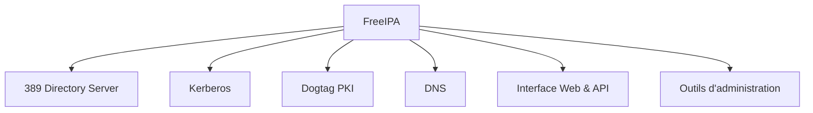
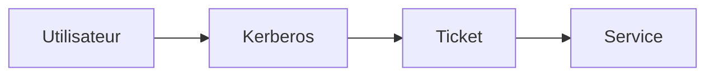
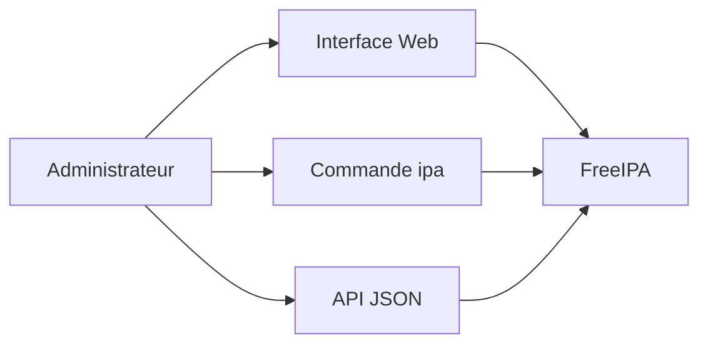
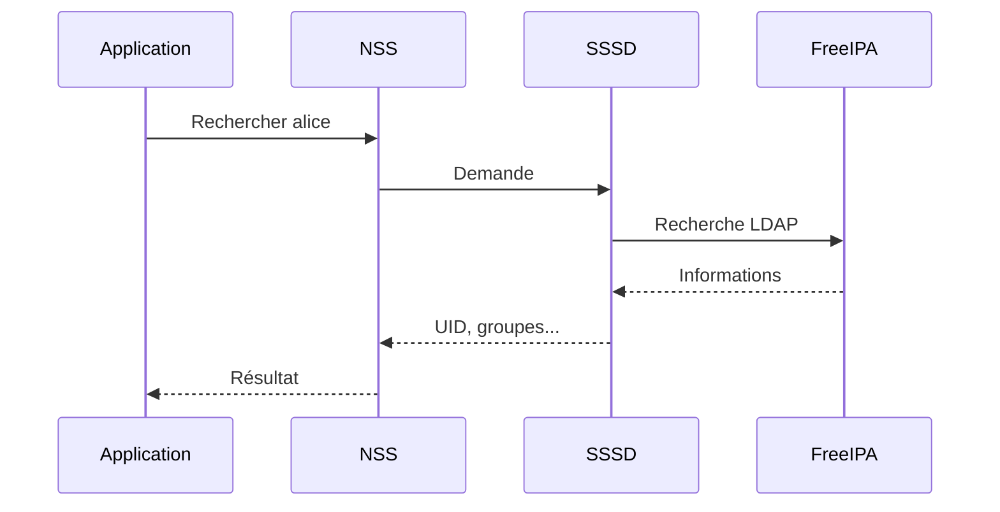
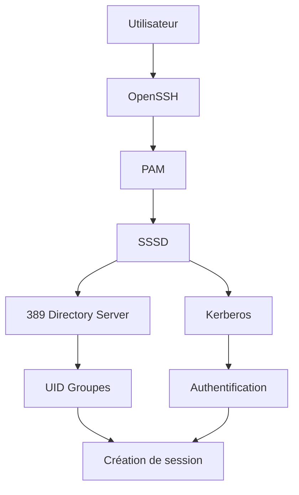
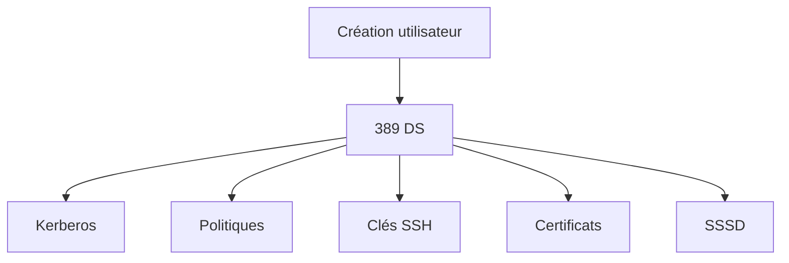
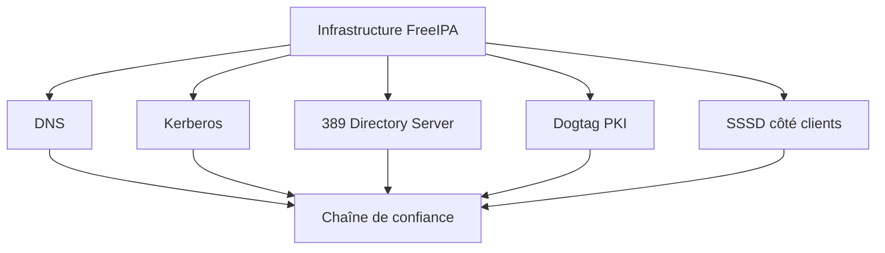
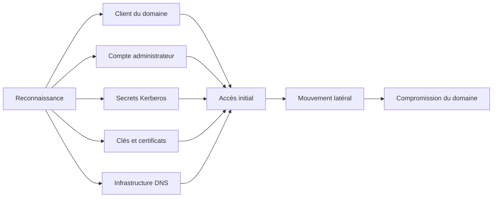
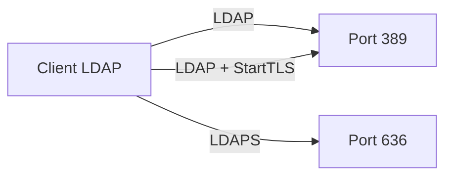

# 8.2 Architecture interne de FreeIPA

> *« Les grandes architectures ne sont pas complexes parce qu'elles font beaucoup de choses. Elles sont complexes parce qu'elles font coopérer plusieurs systèmes spécialisés. »*

---

## Vous êtes ici

```text
PARTIE II — Industrialiser la sécurité

Campagne 8  [██░░░░░░░░]

      8.1 Présentation de FreeIPA ✔
   ►  8.2 Architecture interne
      8.3 Installation
      8.4 Gestion des utilisateurs
      8.5 Groupes et rôles
      8.6 Politiques sudo
      8.7 Gestion des hôtes
      8.8 Certificats
      8.9 Intégration de Sentinel
      8.10 Mission : administrer une infrastructure avec FreeIPA
```

---

## Objectifs pédagogiques

À la fin de ce chapitre, vous serez capable de :

- identifier les principaux composants internes de FreeIPA ;
- comprendre le rôle de chacun d'eux ;
- expliquer comment ces composants coopèrent ;
- distinguer les rôles de LDAP, Kerberos, Dogtag, DNS et SSSD ;
- comprendre le chemin suivi par une authentification dans un domaine FreeIPA ;
- préparer les chapitres consacrés à l'installation et à l'administration.

---

## Pourquoi ce chapitre existe

Lorsque l'on installe FreeIPA pour la première fois, une impression revient souvent.

> **« FreeIPA fait tout. »**

Il gère :

- les utilisateurs ;
- les groupes ;
- les certificats ;
- les politiques `sudo` ;
- les hôtes ;
- l'authentification ;
- parfois le DNS.

Il serait tentant d'en conclure que FreeIPA est un gigantesque logiciel réalisant seul toutes ces tâches.

Ce n'est pas le cas.

FreeIPA est avant tout un **assembleur**.

Il réunit plusieurs composants spécialisés.

Chacun est responsable d'un domaine précis.

Cette approche présente un avantage considérable.

Chaque composant peut évoluer indépendamment.

FreeIPA fournit l'intégration.

---

# Une architecture modulaire

On peut représenter FreeIPA comme un ensemble de briques.



Chaque composant possède une responsabilité unique.

C'est précisément cette spécialisation qui rend l'ensemble robuste.

---

# 389 Directory Server

Le premier composant est probablement le plus important.

Il s'agit de :

```text
389 Directory Server
```

Souvent abrégé :

```text
389 DS
```

Il s'agit du serveur LDAP utilisé par FreeIPA.

Son rôle est simple.

Il stocke les informations.

Par exemple :

- les utilisateurs ;
- les groupes ;
- les hôtes ;
- les services ;
- certaines politiques.

On peut le considérer comme la base de données principale de FreeIPA.

Sans lui, il n'existe plus d'identité centralisée.

---

# LDAP n'authentifie pas

Cette affirmation surprend souvent.

LDAP sait stocker les utilisateurs.

Mais ce n'est pas lui qui réalise l'authentification moderne de FreeIPA.

Pourquoi ?

Parce qu'un autre composant est spécialisé dans cette tâche.

Kerberos.

Cette séparation est très importante.

LDAP répond principalement à la question :

> **« Qui est cet utilisateur ? »**

Kerberos répond à une autre.

> **« Peut-il prouver son identité ? »**

Ces deux rôles sont complémentaires.

Ils ne doivent pas être confondus.

---

# Kerberos

Kerberos est probablement le composant le plus méconnu de FreeIPA.

Et pourtant…

C'est lui qui réalise la majorité des authentifications.

Son objectif est très différent d'un simple mot de passe.

Il cherche à permettre à un utilisateur de s'authentifier une seule fois.

Puis d'accéder à plusieurs services sans ressaisir constamment son mot de passe.

On parle de :

**Single Sign-On (SSO)**.

Nous consacrerons plusieurs sections à Kerberos dans cette campagne.

Pour l'instant, retenons simplement son rôle.



Kerberos ne distribue pas les mots de passe.

Il distribue des **tickets**.

Ces tickets servent ensuite de preuve d'identité.

---

# Dogtag PKI

Nous avons déjà étudié les certificats X.509.

FreeIPA intègre également une véritable autorité de certification.

Elle repose sur :

```text
Dogtag PKI
```

Dogtag permet notamment :

- de délivrer des certificats ;
- de renouveler les certificats ;
- de révoquer des certificats ;
- de gérer une autorité de certification interne.

Cette fonctionnalité est extrêmement importante.

Elle permettra plus tard à Sentinel d'obtenir automatiquement ses certificats TLS.

Sans intervention manuelle.

---

# Le DNS

FreeIPA peut également intégrer un serveur DNS.

Pourquoi ?

Parce que de nombreux composants de sécurité utilisent les noms de machines.

Par exemple :

- Kerberos ;
- les certificats ;
- les services.

Le DNS devient alors un élément essentiel de l'infrastructure.

Cependant, il est important de noter qu'il reste optionnel.

Certaines entreprises conservent leur propre infrastructure DNS.

Et intègrent simplement FreeIPA à celle-ci.

---
# L'interface Web et l'API

FreeIPA ne se limite pas à des services réseau.

Il fournit également une interface d'administration complète.

Cette interface Web permet notamment de gérer :

- les utilisateurs ;
- les groupes ;
- les hôtes ;
- les services ;
- les politiques `sudo` ;
- les certificats ;
- les délégations d'administration.

Pour les administrateurs, cette interface constitue souvent le premier point d'entrée.

Elle simplifie énormément les tâches quotidiennes.

Mais elle n'est pas indispensable.

Toutes les opérations peuvent également être réalisées :

- en ligne de commande ;
- via une API ;
- ou automatiquement avec Ansible.

On peut représenter cette architecture ainsi.



Plusieurs moyens d'administration.

Une seule infrastructure.

---

# La commande `ipa`

L'outil principal d'administration est :

```bash
ipa
```

Cette commande permet de manipuler pratiquement tous les objets du domaine.

Par exemple :

```bash
ipa user-add
```

```bash
ipa group-add
```

```bash
ipa host-add
```

```bash
ipa service-add
```

Toutes ces commandes dialoguent avec les services internes de FreeIPA.

L'administrateur ne manipule jamais directement LDAP ou Kerberos.

C'est précisément le rôle de FreeIPA.

Masquer la complexité des composants sous-jacents.

---

# SSSD : le trait d'union avec les clients

Jusqu'à présent, nous avons surtout parlé du serveur.

Mais que se passe-t-il sur les machines clientes ?

C'est ici qu'intervient :

```text
SSSD
```

Le **System Security Services Daemon**.

SSSD est installé sur les machines clientes.

Il joue le rôle d'intermédiaire entre Linux et FreeIPA.

Lorsqu'une application demande :

```bash
id alice
```

Le déroulement ressemble à ceci.



Les applications n'ont aucune connaissance de FreeIPA.

Elles continuent simplement à utiliser NSS.

---

# Pourquoi utiliser SSSD ?

Une question naturelle apparaît.

Pourquoi les clients ne contactent-ils pas directement LDAP ?

Plusieurs raisons expliquent ce choix.

SSSD apporte notamment :

- un cache local ;
- une meilleure gestion des connexions ;
- une intégration avec Kerberos ;
- la gestion des politiques ;
- une meilleure résilience.

En cas de perte temporaire de connexion avec FreeIPA, un utilisateur déjà connu peut souvent continuer à ouvrir une session grâce au cache.

Cette fonctionnalité est essentielle.

Elle améliore considérablement la disponibilité des postes de travail et des serveurs.

---

# Une authentification complète

Regroupons maintenant tous les composants.

Prenons un utilisateur.

Il souhaite ouvrir une session SSH.

Le chemin suivi ressemble à ceci.



Chaque composant réalise une tâche bien précise.

Ensemble, ils produisent une authentification transparente pour l'utilisateur.

---

# Les composants ne sont pas indépendants

Une erreur fréquente consiste à considérer les différents composants comme des services totalement séparés.

En réalité, ils collaborent en permanence.

Par exemple.

Lorsque vous créez un utilisateur.

Plusieurs composants sont concernés.

- LDAP enregistre l'utilisateur.
- Kerberos prépare son identité d'authentification.
- Les politiques deviennent immédiatement disponibles.
- Les clients SSSD pourront le retrouver.

On peut représenter cette coopération ainsi.



L'administrateur ne voit généralement qu'une seule commande.

Mais plusieurs composants travaillent en arrière-plan.

---

## 💎 Le point d'expertise

FreeIPA applique une philosophie très différente de celle que l'on rencontre parfois dans les logiciels « tout-en-un ».

Les composants qui le constituent ne sont pas des développements propriétaires.

Ils sont eux-mêmes des projets matures, largement utilisés dans le monde Linux.

Par exemple :

- **389 Directory Server** existe indépendamment de FreeIPA.
- **MIT Kerberos** est une implémentation de référence du protocole Kerberos.
- **Dogtag PKI** est une infrastructure de gestion de certificats complète.
- **SSSD** peut fonctionner avec d'autres annuaires que FreeIPA.

FreeIPA agit donc comme une **couche d'orchestration**.

Il fournit :

- une administration cohérente ;
- une configuration homogène ;
- une intégration prête à l'emploi.

Cette architecture explique pourquoi il est possible, dans certains contextes, d'utiliser séparément chacun de ces composants.

FreeIPA les assemble afin de proposer une plateforme unique de gestion des identités.

---
## 🧠 Comment pense un architecte ?

Un architecte ne considère jamais FreeIPA comme un simple serveur.

Il le considère comme un **écosystème de confiance**.

Lorsqu'il conçoit une infrastructure FreeIPA, il ne réfléchit pas uniquement à l'annuaire LDAP.

Il étudie l'ensemble des dépendances.

Par exemple :

* le DNS fonctionne-t-il correctement ?
* les horloges sont-elles synchronisées ?
* Kerberos peut-il délivrer et valider ses tickets ?
* les certificats seront-ils automatiquement renouvelés ?
* les clients pourront-ils continuer à fonctionner si un serveur FreeIPA devient indisponible ?
* les données d'identité sont-elles répliquées ?
* existe-t-il une procédure de restauration documentée ?

Toutes ces questions sont liées.



Une défaillance du DNS peut empêcher un client de localiser les services du domaine.

Une dérive de l'horloge peut provoquer le rejet d'un ticket Kerberos.

Une autorité de certification indisponible peut empêcher la délivrance ou le renouvellement d'un certificat.

Une panne de l'annuaire peut empêcher la résolution de nouvelles identités.

L'architecte ne protège donc pas un composant isolé.

Il protège l'ensemble de la chaîne de confiance.

C'est pourquoi une infrastructure FreeIPA de production est généralement conçue avec :

* plusieurs réplicas ;
* une réplication contrôlée ;
* des sauvegardes régulières ;
* une supervision continue ;
* une synchronisation horaire fiable ;
* une architecture DNS cohérente ;
* des procédures de reprise après sinistre.

---

## ⚔️ Comment pense un attaquant ?

Un attaquant ne cherche pas nécessairement à compromettre tous les composants de FreeIPA.

Il cherche le maillon le plus faible.

Par exemple :

* un compte administrateur insuffisamment protégé ;
* une machine cliente compromise ;
* une mauvaise délégation de privilèges ;
* une clé Kerberos exposée ;
* un certificat ou une clé privée accessible ;
* un serveur dont l'horloge ou le DNS sont mal configurés ;
* une interface d'administration inutilement exposée.

Son objectif consiste à entrer dans la chaîne de confiance.

Puis à utiliser cette confiance pour progresser.



FreeIPA concentre des informations et des mécanismes très sensibles.

Sa compromission peut avoir des conséquences sur l'ensemble des machines du domaine.

Les comptes d'administration doivent donc bénéficier de protections renforcées.

Les serveurs FreeIPA doivent également être dédiés autant que possible.

Ils ne doivent pas héberger des applications métier sans rapport avec l'infrastructure d'identité.

Chaque service supplémentaire augmente la surface d'attaque.

---

## 📚 Culture technique

Le nom **389 Directory Server** peut sembler étrange.

Il provient du port historiquement utilisé par LDAP :

```text
389/TCP
```

LDAP peut utiliser ce port sans chiffrement.

Il peut également établir une protection TLS grâce à **StartTLS** sur ce même port.

Un autre mode historique consiste à encapsuler directement LDAP dans TLS.

On parle alors généralement de **LDAPS**.

Le port traditionnellement associé à LDAPS est :

```text
636/TCP
```

Ces deux approches ne doivent pas être confondues.



Dans tous les cas, l'objectif reste identique.

Protéger :

* les identifiants ;
* les requêtes ;
* les réponses ;
* les données échangées avec l'annuaire.

FreeIPA configure ces communications de manière cohérente avec sa propre autorité de certification.

Cette intégration évite à l'administrateur de construire manuellement toute la chaîne de confiance TLS.

---

## ⚠️ Piège classique

Un piège fréquent consiste à administrer directement les composants internes de FreeIPA.

Par exemple, un administrateur pourrait être tenté de :

* modifier directement des entrées LDAP ;
* éditer manuellement une configuration Kerberos ;
* intervenir directement dans Dogtag ;
* modifier les fichiers internes des services.

Techniquement, certaines de ces opérations sont possibles.

Mais elles risquent de rendre l'infrastructure incohérente.

FreeIPA maintient des relations entre plusieurs objets.

La création d'un utilisateur peut concerner :

* son entrée LDAP ;
* son principal Kerberos ;
* ses groupes ;
* ses droits ;
* ses politiques d'accès.

Modifier une seule brique sans passer par FreeIPA peut casser cette cohérence.

La règle générale est donc simple.

> Utiliser en priorité l'interface Web, la commande `ipa`, l'API ou les modules Ansible prévus pour FreeIPA.

L'administration directe des composants internes doit rester réservée au diagnostic avancé ou aux procédures documentées par l'éditeur.

---

# Laboratoire AlmaLinux

Même sans avoir encore installé le serveur FreeIPA, plusieurs composants peuvent déjà être observés sur une machine AlmaLinux.

Commencez par vérifier si SSSD est installé.

```bash
rpm -q sssd
```

Sur une installation minimale, le paquet peut être absent.

Vérifiez ensuite la présence des outils Kerberos.

```bash
rpm -q krb5-workstation
```

La commande suivante permet de rechercher les paquets liés à FreeIPA déjà installés.

```bash
rpm -qa | grep -E '^(ipa|freeipa|sssd|krb5)'
```

Observez maintenant la configuration NSS actuelle.

```bash
grep -E '^(passwd|group|shadow):' /etc/nsswitch.conf
```

Vous obtiendrez un résultat proche de celui-ci :

```text
passwd:     files systemd
shadow:     files
group:      files systemd
```

La source :

```text
files
```

désigne notamment les fichiers locaux :

```text
/etc/passwd
/etc/shadow
/etc/group
```

Après l'intégration de la machine au domaine FreeIPA, SSSD participera à la résolution des identités.

Les commandes habituelles continueront pourtant à fonctionner.

Par exemple :

```bash
getent passwd alice
```

```bash
id alice
```

```bash
groups alice
```

L'application qui exécute ces commandes n'aura pas besoin de savoir si Alice provient :

* d'un fichier local ;
* de FreeIPA ;
* ou d'une autre source configurée dans NSS.

Cette abstraction est l'une des grandes forces de l'architecture Linux.

---

# Impact sur Sentinel

Sentinel devra progressivement s'intégrer à plusieurs composants de l'infrastructure FreeIPA.

L'application ne dialoguera cependant pas directement avec tous les services internes.

Chaque besoin utilisera l'interface système appropriée.

Pour résoudre une identité :

```text
Sentinel
   │
   ▼
NSS
   │
   ▼
SSSD
   │
   ▼
FreeIPA
```

Pour authentifier un utilisateur dans un contexte compatible :

```text
Sentinel
   │
   ▼
PAM
   │
   ▼
SSSD
   │
   ▼
Kerberos / FreeIPA
```

Pour obtenir un certificat de service :

```text
Sentinel
   │
   ▼
certmonger / outils IPA
   │
   ▼
Dogtag PKI
```

Cette séparation évite de rendre Sentinel dépendante des détails internes de FreeIPA.

L'application consomme les services standards du système.

L'infrastructure conserve la responsabilité :

* des identités ;
* de l'authentification ;
* des certificats ;
* des politiques centralisées.

Sentinel devient ainsi un véritable service intégré au domaine.

---

# Ce qu'il faut retenir

* FreeIPA est une plateforme composée de plusieurs services spécialisés.
* **389 Directory Server** stocke les objets du domaine.
* **Kerberos** assure l'authentification et le Single Sign-On grâce à des tickets.
* **Dogtag PKI** fournit l'autorité de certification et la gestion des certificats.
* Le **DNS** permet de localiser correctement les services et participe au fonctionnement de Kerberos.
* **SSSD** relie les clients Linux à FreeIPA et fournit un cache local.
* L'interface Web, la commande `ipa` et l'API masquent la complexité des composants internes.
* Les composants de FreeIPA forment une chaîne de confiance et doivent être administrés comme un ensemble cohérent.

---

# Grande infographie de révision

```text
                   ARCHITECTURE INTERNE DE FREEIPA

                            +------------------+
                            |     FreeIPA      |
                            |------------------|
                            | Administration   |
                            | Web / CLI / API  |
                            +---------+--------+
                                      |
          +---------------------------+---------------------------+
          |                           |                           |
          v                           v                           v
+-------------------+       +-------------------+       +-------------------+
| 389 Directory     |       | Kerberos          |       | Dogtag PKI        |
| Server            |       |                   |       |                   |
|-------------------|       |-------------------|       |-------------------|
| Utilisateurs      |       | Authentification  |       | Certificats       |
| Groupes           |       | Tickets           |       | Autorité de       |
| Hôtes             |       | Single Sign-On    |       | certification     |
| Politiques        |       | Principals        |       | Révocation        |
+-------------------+       +-------------------+       +-------------------+

          +-------------------------------------------------------+
          |                         DNS                           |
          |-------------------------------------------------------|
          | Résolution des noms                                   |
          | Découverte des services                               |
          | Enregistrements SRV                                   |
          +-------------------------------------------------------+

────────────────────────────────────────────────────────────────────────────

                         MACHINE CLIENTE

       Application
           |
           +--------------------+
           |                    |
           v                    v
          NSS                  PAM
           |                    |
           +---------+----------+
                     |
                     v
                   SSSD
                     |
        +------------+-------------+
        |                          |
        v                          v
  389 Directory Server          Kerberos
  Identités et groupes          Authentification

────────────────────────────────────────────────────────────────────────────

                     DOGTAG PKI ET SENTINEL

        Sentinel
           |
           v
     Demande de certificat
           |
           v
      Dogtag PKI
           |
           v
   Certificat X.509 délivré
           |
           v
      Communication TLS

────────────────────────────────────────────────────────────────────────────

       FreeIPA n'est pas un composant unique.

       C'est une plateforme qui orchestre plusieurs services
       spécialisés afin de construire une infrastructure
       centralisée d'identité, de confiance et de politiques.
```

# Transition vers le chapitre 8.3

Nous connaissons désormais les principaux composants internes de FreeIPA.

Nous savons ce que fait chaque brique.

Nous savons également comment les clients Linux utilisent SSSD, NSS et PAM pour accéder à l'infrastructure d'identité.

Il est maintenant temps de construire cette infrastructure.

L'installation d'un serveur FreeIPA demande cependant davantage de préparation que celle d'un service classique.

Plusieurs éléments doivent être corrects avant même de lancer la première commande :

* le nom complet de la machine ;
* le domaine DNS ;
* le royaume Kerberos ;
* la résolution DNS ;
* la synchronisation de l'heure ;
* les règles du pare-feu ;
* les ressources disponibles.

Une mauvaise décision prise lors de l'installation peut être difficile à corriger ensuite.

Dans le prochain chapitre, nous allons préparer puis installer notre premier serveur FreeIPA sur AlmaLinux.

Nous ne chercherons pas seulement à faire fonctionner l'installation.

Nous chercherons à comprendre chaque choix afin de construire une base propre, stable et adaptée à une infrastructure d'entreprise.

