# 8.3 Installation de FreeIPA

> *« Une infrastructure d'identité ne se répare pas après coup aussi facilement qu'un service ordinaire. Sa stabilité dépend d'abord de la qualité de sa préparation. »*

---

## Vous êtes ici

```text
PARTIE II — Industrialiser la sécurité

Campagne 8  [███░░░░░░░]

      8.1 Présentation de FreeIPA ✔
      8.2 Architecture interne ✔
   ►  8.3 Installation
      8.4 Gestion des utilisateurs
      8.5 Groupes et rôles
      8.6 Politiques sudo
      8.7 Gestion des hôtes
      8.8 Certificats
      8.9 Intégration de Sentinel
      8.10 Mission : administrer une infrastructure avec FreeIPA
```

---

## Objectifs pédagogiques

À la fin de ce chapitre, vous serez capable de :

- préparer correctement une machine AlmaLinux pour accueillir FreeIPA ;
- choisir un nom d'hôte, un domaine DNS et un royaume Kerberos cohérents ;
- comprendre les dépendances entre FreeIPA, le DNS et la synchronisation horaire ;
- identifier les ports réseau nécessaires ;
- installer un serveur FreeIPA ;
- vérifier le fonctionnement des principaux composants ;
- réaliser les premiers tests d'administration ;
- préparer l'intégration d'une machine cliente au domaine.

---

## Pourquoi ce chapitre existe

Installer FreeIPA ne consiste pas simplement à exécuter :

```bash
dnf install ipa-server
```

puis à accepter les valeurs proposées.

Une infrastructure d'identité possède des caractéristiques particulières.

Elle devient rapidement dépendante :

- du nom complet du serveur ;
- du domaine DNS ;
- du royaume Kerberos ;
- des certificats générés ;
- des enregistrements DNS ;
- des relations de confiance créées pendant l'installation.

Une erreur sur le nom d'hôte peut perturber Kerberos.

Une mauvaise résolution DNS peut empêcher les clients de découvrir le serveur.

Une horloge désynchronisée peut rendre les tickets Kerberos inutilisables.

Un changement de domaine après l'installation peut nécessiter une reconstruction complète de l'infrastructure.

Il faut donc préparer FreeIPA avec beaucoup plus de rigueur qu'un service ordinaire.

Le succès de l'installation dépend largement des décisions prises **avant** son lancement.

---

# Le laboratoire de la campagne 8

Pour cette campagne, nous allons utiliser plusieurs machines.

L'objectif est de reproduire une petite infrastructure d'entreprise.


Une organisation possible est la suivante.

| Machine | Nom d'hôte | Adresse d'exemple | Fonction |
|---------|-------------|------------------|----------|
| Serveur FreeIPA | `ipa01.lab.sentinel.test` | `192.168.56.10` | Identités, Kerberos, certificats, éventuellement DNS |
| Serveur Sentinel | `sentinel01.lab.sentinel.test` | `192.168.56.20` | Application Sentinel |
| Poste d'administration | `admin01.lab.sentinel.test` | `192.168.56.30` | Administration du domaine |
| Kali Linux | `kali.lab.sentinel.test` | `192.168.56.40` | Tests de sécurité ultérieurs |

Ces adresses sont des exemples.

Elles doivent être adaptées à votre laboratoire.

L'important est de conserver :

- des adresses stables ;
- des noms cohérents ;
- une résolution DNS fonctionnelle ;
- une connectivité réseau maîtrisée.

---

# Choisir le domaine DNS

La première décision concerne le domaine DNS.

Pour notre laboratoire, nous utiliserons :

```text
lab.sentinel.test
```

Le serveur FreeIPA utilisera le nom complet :

```text
ipa01.lab.sentinel.test
```

Sentinel utilisera :

```text
sentinel01.lab.sentinel.test
```

Le suffixe :

```text
.test
```

est réservé aux usages de test et de documentation.

Il convient donc parfaitement à un laboratoire isolé.

En production, l'organisation utilisera généralement un sous-domaine dont elle contrôle réellement le DNS.

Par exemple :

```text
ipa.example.com
```

ou :

```text
linux.example.com
```

Il faut éviter d'inventer un domaine qui pourrait entrer en conflit avec un domaine public existant.

---

# Domaine DNS et royaume Kerberos

FreeIPA utilise deux notions proches.

Le domaine DNS.

Par exemple :

```text
lab.sentinel.test
```

Le royaume Kerberos.

Par convention :

```text
LAB.SENTINEL.TEST
```

Le royaume Kerberos est généralement le domaine DNS converti en lettres majuscules.

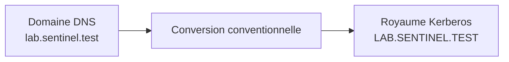

Ces deux valeurs remplissent des fonctions différentes.

Le domaine DNS organise les noms de machines et de services.

Le royaume Kerberos définit le périmètre d'authentification.

Dans une installation classique, il est fortement recommandé de conserver cette correspondance.

Elle simplifie :

- la configuration ;
- la compréhension ;
- le diagnostic ;
- l'intégration des clients.

---

# Le nom complet de la machine

Le serveur FreeIPA doit posséder un nom complet stable.

On parle de :

**FQDN**, pour *Fully Qualified Domain Name*.

Dans notre laboratoire :

```text
ipa01.lab.sentinel.test
```

Un simple nom comme :

```text
ipa01
```

n'est pas suffisant pour de nombreux composants.

Kerberos, les certificats et le DNS ont besoin d'un nom complet.

Vérifions le nom actuel.

```bash
hostnamectl
```

Puis :

```bash
hostname -f
```

La seconde commande doit retourner exactement :

```text
ipa01.lab.sentinel.test
```

Pour définir le nom :

```bash
sudo hostnamectl set-hostname ipa01.lab.sentinel.test
```

Vérifiez ensuite :

```bash
hostnamectl
```

Puis :

```bash
hostname -f
```

---

# Pourquoi le nom doit-il être définitif ?

Pendant l'installation, FreeIPA utilise le FQDN pour créer de nombreux objets.

Par exemple :

- le principal Kerberos de l'hôte ;
- les certificats du serveur Web ;
- les certificats LDAP ;
- les enregistrements de services ;
- les informations stockées dans l'annuaire.

On peut représenter cette dépendance ainsi.

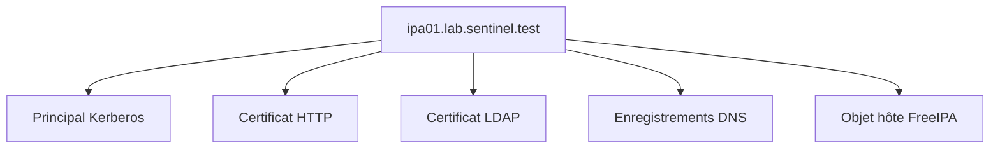

Changer le nom après l'installation ne revient donc pas à modifier une seule ligne de configuration.

Cela affecte plusieurs briques de la chaîne de confiance.

Dans la plupart des cas, il est plus sûr de reconstruire proprement le serveur que de tenter de le renommer.

---

## 💎 Le point d'expertise

Le nom d'hôte utilisé par FreeIPA doit être un nom canonique.

Il ne doit pas être uniquement un alias DNS.

Par exemple :

```text
ipa.lab.sentinel.test
```

peut être un alias pratique.

Mais le serveur doit conserver un nom canonique stable, tel que :

```text
ipa01.lab.sentinel.test
```

Les certificats, les principaux Kerberos et les objets d'annuaire sont associés à cette identité.

Une bonne convention consiste à distinguer :

- le nom physique ou canonique du serveur ;
- les éventuels alias fonctionnels.

Cette distinction facilite les évolutions futures.

---

# Préparer la résolution des noms

Avant d'installer FreeIPA, le serveur doit pouvoir résoudre son propre nom.

Testons :

```bash
getent hosts ipa01.lab.sentinel.test
```

Puis :

```bash
ping -c 1 ipa01.lab.sentinel.test
```

Le résultat doit pointer vers l'adresse IP correcte.

Par exemple :

```text
192.168.56.10
```

La résolution inverse doit également être cohérente lorsque l'infrastructure le permet.

```bash
host 192.168.56.10
```

Dans un laboratoire sans DNS existant, une entrée temporaire dans :

```text
/etc/hosts
```

peut être utilisée avant l'installation.

Par exemple :

```text
192.168.56.10 ipa01.lab.sentinel.test ipa01
192.168.56.20 sentinel01.lab.sentinel.test sentinel01
192.168.56.30 admin01.lab.sentinel.test admin01
```

Cependant, `/etc/hosts` ne remplace pas une véritable infrastructure DNS pour l'ensemble du domaine.

Il constitue uniquement une solution de préparation ou de laboratoire limité.

---

# Choisir qui gérera le DNS

Deux architectures principales sont possibles.

La première consiste à laisser FreeIPA gérer le DNS du domaine.

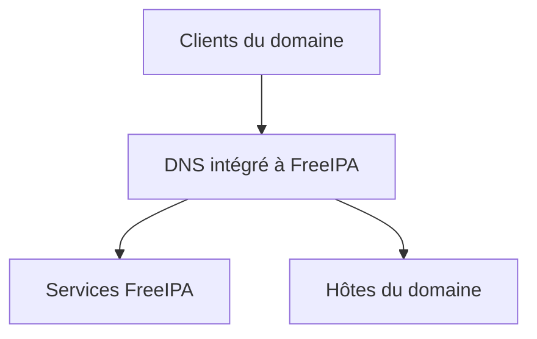

La seconde consiste à utiliser une infrastructure DNS externe.

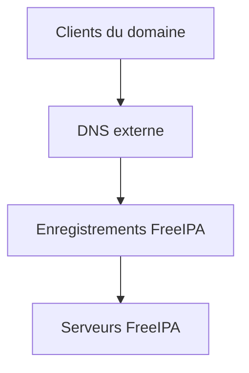

Pour un laboratoire pédagogique, le DNS intégré à FreeIPA est souvent le choix le plus simple.

Il permet de comprendre :

- les zones DNS ;
- les enregistrements SRV ;
- l'enregistrement automatique des clients ;
- la découverte des services Kerberos et LDAP.

Dans une grande entreprise, le choix dépendra de l'architecture existante.

---

# Pourquoi le DNS est indispensable à Kerberos

Kerberos utilise fortement les noms de services.

Un principal de service ressemble par exemple à :

```text
HTTP/ipa01.lab.sentinel.test@LAB.SENTINEL.TEST
```

Il contient :

- le type de service ;
- le FQDN ;
- le royaume Kerberos.

Si le client contacte le serveur sous un autre nom, l'identité attendue peut ne plus correspondre.

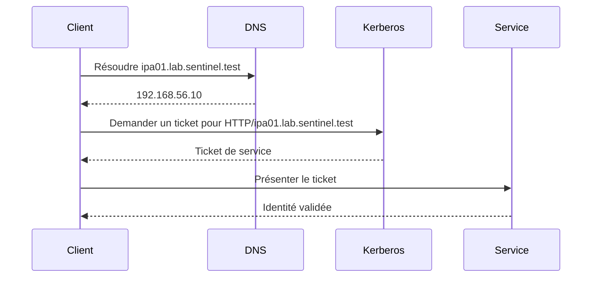

Une mauvaise résolution DNS peut donc provoquer des erreurs qui semblent provenir de Kerberos.

Dans une infrastructure FreeIPA, le DNS n'est pas une simple commodité.

Il fait partie du mécanisme de sécurité.

---

# La synchronisation de l'heure

Kerberos protège contre la réutilisation de messages anciens.

Pour cela, il s'appuie notamment sur l'heure.

Si l'horloge d'un client et celle du serveur sont trop éloignées, l'authentification peut être refusée.

Le message rencontré ressemble souvent à :

```text
Clock skew too great
```

Autrement dit :

```text
Décalage d'horloge trop important
```

Vérifions l'état de la synchronisation.

```bash
timedatectl
```

Puis :

```bash
chronyc tracking
```

La ligne suivante doit indiquer une synchronisation correcte :

```text
System clock synchronized: yes
```

ou un état équivalent dans les informations fournies par Chrony.

Vérifiez également le service.

```bash
systemctl status chronyd
```

Si nécessaire :

```bash
sudo systemctl enable --now chronyd
```

---

# Pourquoi Kerberos refuse les horloges incohérentes

Imaginons qu'un attaquant intercepte un ticket.

Sans contrôle temporel, il pourrait tenter de le rejouer plus tard.

Kerberos limite ce risque grâce à des périodes de validité et à des horodatages.

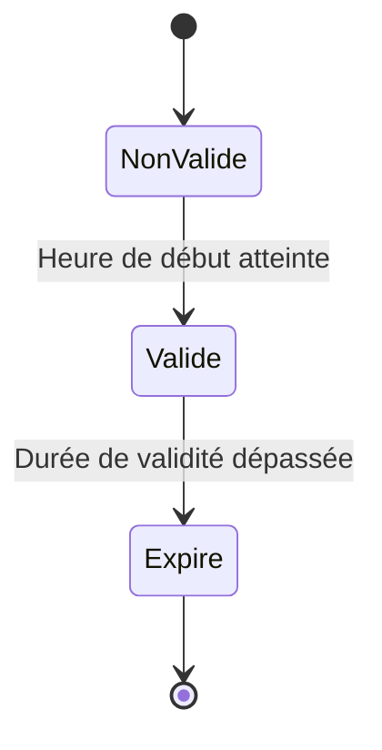

Le client et le serveur doivent donc partager une vision suffisamment proche du temps.

La synchronisation NTP ou Chrony devient une dépendance de sécurité.

---

## ⚠️ Piège classique

Une erreur fréquente consiste à modifier manuellement l'heure d'une machine FreeIPA ou d'un client Kerberos.

Une correction brutale peut provoquer :

- des tickets temporairement invalides ;
- des journaux incohérents ;
- des problèmes de réplication ;
- des échecs d'authentification.

Il est préférable de laisser Chrony corriger l'horloge de manière contrôlée.

Dans une infrastructure virtuelle, il faut également vérifier qu'aucun mécanisme de synchronisation de l'hyperviseur ne concurrence Chrony.

Deux sources de temps qui corrigent simultanément l'horloge peuvent provoquer des comportements instables.

---

# Configurer une adresse IP stable

Un serveur d'identité ne doit pas dépendre d'une adresse susceptible de changer.

Il est donc recommandé d'utiliser :

- une adresse IP statique ;
- ou une réservation DHCP stable.

Vérifiez la configuration actuelle.

```bash
ip address
```

Puis :

```bash
ip route
```

Sur AlmaLinux, NetworkManager permet de consulter les connexions.

```bash
nmcli connection show
```

La configuration exacte dépend du réseau du laboratoire.

L'objectif est d'obtenir une adresse stable, par exemple :

```text
192.168.56.10/24
```

avec une passerelle et des serveurs DNS cohérents.

---

# Vérifier les ressources de la machine

FreeIPA regroupe plusieurs services importants.

Même dans un laboratoire, il faut lui attribuer suffisamment de ressources.

Une configuration raisonnable pour un laboratoire peut commencer avec :

- 2 processeurs virtuels ;
- 4 Gio de mémoire vive ;
- 20 à 30 Gio de disque ;
- une adresse IP stable.

Pour un usage plus confortable, notamment avec Dogtag et le DNS intégré, davantage de mémoire peut être utile.

Vérifions les ressources.

```bash
lscpu
```

Puis :

```bash
free -h
```

Et :

```bash
df -h
```

Une machine trop limitée pourra présenter :

- une installation lente ;
- des délais de démarrage ;
- des erreurs liées à la mémoire ;
- une interface Web peu réactive.

---

# Mettre à jour AlmaLinux

Avant toute installation d'une brique d'infrastructure, le système doit être à jour.

```bash
sudo dnf update -y
```

Si le noyau ou des bibliothèques importantes ont été mis à jour, redémarrez la machine.

```bash
sudo reboot
```

Après le redémarrage, vérifiez :

```bash
uname -r
```

Puis :

```bash
sudo dnf check
```

L'installation doit commencer sur une base saine.

---

# Vérifier SELinux

FreeIPA est conçu pour fonctionner avec SELinux activé.

Il ne faut pas désactiver SELinux pour faciliter l'installation.

Vérifions son état.

```bash
getenforce
```

Le résultat attendu est :

```text
Enforcing
```

Puis :

```bash
sestatus
```

Si l'installation échoue avec SELinux activé, la bonne méthode consiste à diagnostiquer le refus.

La mauvaise méthode consiste à désactiver la protection.

FreeIPA est une application native de l'écosystème RHEL.

Ses politiques SELinux sont fournies par les paquets.

---

# Vérifier le pare-feu

Firewalld doit rester actif.

```bash
systemctl status firewalld
```

S'il ne l'est pas :

```bash
sudo systemctl enable --now firewalld
```

FreeIPA devra ouvrir plusieurs services.

Les principaux flux concernent notamment :

| Service | Ports principaux |
|---------|------------------|
| HTTP | `80/TCP` |
| HTTPS | `443/TCP` |
| LDAP | `389/TCP` |
| LDAPS | `636/TCP` |
| Kerberos | `88/TCP` et `88/UDP` |
| Changement de mot de passe Kerberos | `464/TCP` et `464/UDP` |
| DNS intégré | `53/TCP` et `53/UDP` |
| NTP selon architecture | `123/UDP` |

D'autres flux peuvent intervenir selon les fonctionnalités et la réplication.

Il est préférable d'utiliser les services Firewalld fournis par la distribution plutôt que d'ouvrir manuellement chaque port.

---

# Vérification préalable complète

Avant l'installation, les contrôles suivants doivent réussir.

```bash
hostname -f
```

Résultat attendu :

```text
ipa01.lab.sentinel.test
```

Résolution locale :

```bash
getent hosts ipa01.lab.sentinel.test
```

Synchronisation temporelle :

```bash
timedatectl
```

SELinux :

```bash
getenforce
```

Pare-feu :

```bash
systemctl is-active firewalld
```

Ressources :

```bash
free -h
df -h
```

Mise à jour :

```bash
sudo dnf check-update
```

Une sortie non vide de `dnf check-update` n'indique pas nécessairement une erreur.

Elle peut simplement signaler que de nouvelles mises à jour sont disponibles.

---

# Le point de décision avant l'installation

À ce stade, deux choix doivent être clairement arrêtés.

Premier choix :

```text
FreeIPA gère-t-il le DNS du laboratoire ?
```

Second choix :

```text
Quel est le domaine définitif ?
```

Pour la suite du laboratoire, nous retiendrons :

```text
Serveur : ipa01.lab.sentinel.test
```

```text
Domaine DNS : lab.sentinel.test
```

```text
Royaume Kerberos : LAB.SENTINEL.TEST
```

```text
DNS intégré : oui
```

Cette architecture nous permettra d'explorer l'ensemble des fonctionnalités de FreeIPA.

---
# Installer les paquets FreeIPA

Sur AlmaLinux, les paquets nécessaires sont disponibles dans les dépôts compatibles avec l'écosystème RHEL.

Commençons par examiner les modules disponibles.

```bash
sudo dnf module list idm
```

Selon la version d'AlmaLinux utilisée, la gestion du flux de modules peut différer.

Le paquet principal du serveur est :

```text
ipa-server
```

Pour utiliser le DNS intégré, il faut également installer :

```text
ipa-server-dns
```

L'installation s'effectue avec :

```bash
sudo dnf install -y ipa-server ipa-server-dns
```

Vérifiez ensuite les paquets installés.

```bash
rpm -q ipa-server ipa-server-dns
```

Le programme d'installation principal est maintenant disponible.

```bash
command -v ipa-server-install
```

Le résultat attendu ressemble à :

```text
/usr/sbin/ipa-server-install
```

La configuration du domaine n'est pas encore réalisée.

Seuls les logiciels nécessaires sont installés.

FreeIPA fournit ensuite l'outil `ipa-server-install`, qui configure les services du domaine et conserve un journal détaillé dans `/var/log/ipaserver-install.log`. :contentReference[oaicite:0]{index=0}

---

# Installation interactive ou non interactive

Deux méthodes principales sont possibles.

La première est interactive.

```bash
sudo ipa-server-install
```

Le programme pose progressivement les questions nécessaires.

Cette méthode est particulièrement adaptée à une première installation.

Elle permet de comprendre les choix réalisés.

La seconde méthode utilise directement des options.

Par exemple :

```bash
sudo ipa-server-install \
    --hostname=ipa01.lab.sentinel.test \
    --domain=lab.sentinel.test \
    --realm=LAB.SENTINEL.TEST \
    --setup-dns \
    --forwarder=192.168.56.1
```

Cette méthode est intéressante pour :

- automatiser l'installation ;
- documenter précisément les paramètres ;
- reproduire plusieurs environnements ;
- intégrer FreeIPA à Ansible.

Dans ce premier laboratoire, nous utiliserons le mode interactif.

L'objectif est de comprendre chaque étape.

---

# Lancer l'installation

Exécutez :

```bash
sudo ipa-server-install
```

Le programme commence par analyser la machine.

Il vérifie notamment :

- le nom d'hôte ;
- la résolution DNS ;
- les paquets installés ;
- l'existence éventuelle d'une ancienne configuration ;
- la compatibilité de l'environnement.

Il propose ensuite de configurer le DNS intégré.

```text
Do you want to configure integrated DNS (BIND)? [no]:
```

Répondez :

```text
yes
```

Le DNS intégré simplifiera considérablement notre laboratoire.

Il permettra notamment :

- de gérer la zone `lab.sentinel.test` ;
- d'enregistrer les clients ;
- de créer les enregistrements de découverte ;
- de localiser Kerberos et LDAP.

Le DNS intégré est recommandé pour une première infrastructure IdM, car il permet à FreeIPA d’automatiser une partie importante de la gestion des enregistrements DNS. :contentReference[oaicite:1]{index=1}

---

# Confirmer le nom du serveur

Le programme affiche ensuite le nom détecté.

```text
Server host name [ipa01.lab.sentinel.test]:
```

Vérifiez attentivement cette valeur.

Elle doit être exactement :

```text
ipa01.lab.sentinel.test
```

N'acceptez pas :

```text
localhost
```

Ni :

```text
ipa01
```

Ni un nom appartenant à un autre domaine.

Validez avec la touche Entrée si la valeur est correcte.

---

# Définir le domaine DNS

Le programme propose ensuite le domaine.

```text
Please confirm the domain name [lab.sentinel.test]:
```

Validez :

```text
lab.sentinel.test
```

Ce domaine sera utilisé pour :

- les noms des machines ;
- la découverte des services ;
- les zones DNS ;
- l'organisation du domaine FreeIPA.

---

# Définir le royaume Kerberos

L'étape suivante concerne le royaume Kerberos.

```text
Please provide a realm name [LAB.SENTINEL.TEST]:
```

Conservez :

```text
LAB.SENTINEL.TEST
```

Par convention, le royaume Kerberos est écrit en majuscules.

Il est généralement dérivé du domaine DNS.

Cette convention évite de nombreuses erreurs de configuration.

---

# Le mot de passe du Directory Manager

FreeIPA demande ensuite :

```text
Directory Manager password:
```

Le **Directory Manager** est un compte spécial de 389 Directory Server.

Il ne correspond pas à un utilisateur Linux.

Il ne correspond pas non plus au futur administrateur FreeIPA.

Il s'agit d'un compte interne de l'annuaire.

Son rôle est extrêmement puissant.

Il permet notamment d'effectuer certaines opérations d'administration ou de récupération directement sur le serveur LDAP.

Choisissez un mot de passe robuste.

Il doit être :

- long ;
- unique ;
- conservé dans un gestionnaire de secrets ;
- réservé aux opérations exceptionnelles.

Ne réutilisez pas :

- le mot de passe de `root` ;
- votre mot de passe personnel ;
- le mot de passe de l'administrateur FreeIPA.

---

# Le mot de passe de l'administrateur FreeIPA

Le programme demande ensuite :

```text
IPA admin password:
```

Ce mot de passe appartient au compte :

```text
admin
```

Le compte `admin` est le premier administrateur du domaine FreeIPA.

Il sera utilisé pour :

- ouvrir l'interface Web ;
- exécuter les commandes `ipa` ;
- créer les premiers utilisateurs ;
- déléguer les responsabilités.

Le compte `admin` appartient initialement aux groupes d'administration les plus puissants.

Son mot de passe doit donc bénéficier du même niveau de protection qu'un compte `root`.

Les deux comptes demandés pendant l'installation ne doivent pas être confondus.

| Compte | Fonction |
|--------|----------|
| Directory Manager | Administration interne de 389 Directory Server |
| `admin` | Administration fonctionnelle du domaine FreeIPA |

Dans l'exploitation quotidienne, le compte `admin` sera utilisé.

Le Directory Manager restera réservé aux situations particulières.

---

# Configurer les redirecteurs DNS

FreeIPA demande ensuite si des redirecteurs DNS doivent être configurés.

Un redirecteur permet au serveur FreeIPA de résoudre les noms qu'il ne gère pas lui-même.

Par exemple :

```text
www.almalinux.org
```

La zone FreeIPA connaît :

```text
lab.sentinel.test
```

Mais elle ne possède pas l'ensemble du DNS Internet.

Elle transmet donc les autres requêtes à un serveur DNS en amont.

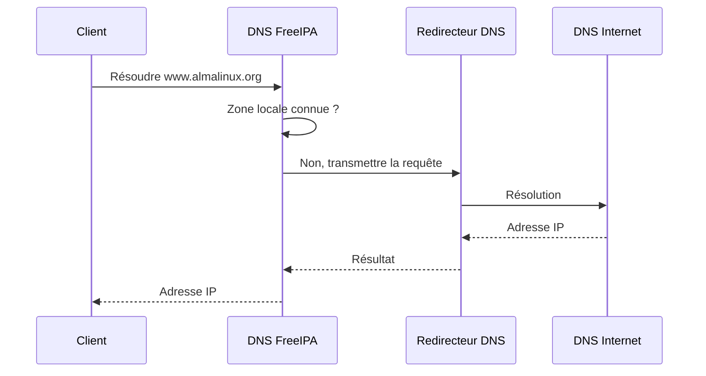

Le programme peut détecter les DNS déjà configurés dans :

```text
/etc/resolv.conf
```

Il peut proposer de les utiliser comme redirecteurs.

Dans un laboratoire, le redirecteur peut être :

- le routeur local ;
- le DNS du réseau d'entreprise ;
- un résolveur DNS autorisé.

Par exemple :

```text
192.168.56.1
```

Évitez d'utiliser arbitrairement un DNS public si la politique du réseau l'interdit.

---

# La recherche DNS inverse

Le programme peut également proposer de configurer une zone inverse.

Une zone directe associe :

```text
nom → adresse IP
```

Une zone inverse associe :

```text
adresse IP → nom
```

Par exemple :

```text
ipa01.lab.sentinel.test → 192.168.56.10
```

Et inversement :

```text
192.168.56.10 → ipa01.lab.sentinel.test
```

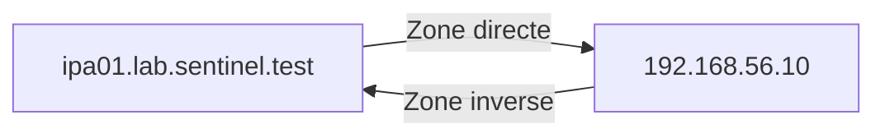

Dans un laboratoire contrôlé, acceptez la création de la zone inverse lorsque le programme la propose.

Une résolution directe et inverse cohérente simplifie :

- les diagnostics ;
- les journaux ;
- Kerberos ;
- l'administration des certificats.

---

# Le résumé avant installation

Avant de modifier le système, `ipa-server-install` affiche un résumé.

Il ressemble à ceci :

```text
The IPA Master Server will be configured with:

Hostname:       ipa01.lab.sentinel.test
IP address:     192.168.56.10
Domain name:    lab.sentinel.test
Realm name:     LAB.SENTINEL.TEST

The CA will be configured with:

Subject DN:   CN=Certificate Authority,O=LAB.SENTINEL.TEST
Subject base: O=LAB.SENTINEL.TEST

BIND DNS server will be configured to serve IPA domain with:

Forwarders:       192.168.56.1
Forward policy:   only
Reverse zone:     56.168.192.in-addr.arpa.
```

Lisez attentivement ce résumé.

Vérifiez :

- le FQDN ;
- l'adresse IP ;
- le domaine ;
- le royaume ;
- les redirecteurs DNS ;
- la zone inverse.

Le programme demande ensuite une confirmation.

```text
Continue to configure the system with these values? [no]:
```

Répondez :

```text
yes
```

---

# Ce que fait réellement l'installateur

L'installation peut prendre plusieurs minutes.

Pendant ce temps, FreeIPA configure de nombreux composants.

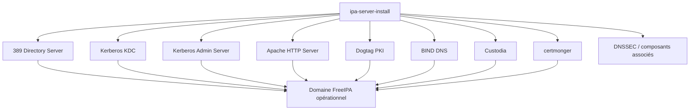

L'installateur réalise notamment :

- la création de l'annuaire LDAP ;
- la création du royaume Kerberos ;
- la génération des certificats internes ;
- la configuration du serveur Web ;
- la création des zones DNS ;
- la configuration des services systemd ;
- la création des principaux Kerberos ;
- l'initialisation du compte `admin`.

L'installation est une opération transactionnelle autant que possible.

Cependant, si elle échoue en cours de route, certaines traces peuvent rester sur le système.

Il faut alors diagnostiquer la cause avant de relancer l'installation.

---

# Suivre le journal d'installation

Pendant ou après l'installation, le journal principal se trouve dans :

```text
/var/log/ipaserver-install.log
```

Pour le consulter :

```bash
sudo less /var/log/ipaserver-install.log
```

Pour suivre son évolution dans un second terminal :

```bash
sudo tail -f /var/log/ipaserver-install.log
```

Ce fichier est essentiel en cas d'échec.

Il contient davantage d'informations que le résumé affiché dans le terminal.

Lorsqu'une installation échoue, il faut commencer par rechercher :

```bash
sudo grep -iE 'error|failed|exception' \
    /var/log/ipaserver-install.log
```

Cette commande ne remplace pas une lecture complète.

Elle permet simplement d'identifier rapidement les messages les plus importants.

---

# Fin de l'installation

Lorsque l'installation réussit, un message proche de celui-ci apparaît :

```text
Setup complete
```

Le programme rappelle également plusieurs ports à ouvrir dans le pare-feu.

Il indique enfin que l'administrateur peut obtenir un ticket Kerberos avec :

```bash
kinit admin
```

À ce stade, FreeIPA est installé.

Mais l'infrastructure n'est pas encore validée.

Une série de vérifications doit maintenant être réalisée.

---

# Ouvrir les services Firewalld

FreeIPA fournit des définitions de services Firewalld.

Affichons-les.

```bash
firewall-cmd --get-services | grep -E 'freeipa|dns'
```

Pour un serveur avec DNS intégré, les services utilisés sont généralement :

```text
freeipa-4
```

et :

```text
dns
```

Ajoutons-les à la zone active.

Commencez par identifier cette zone.

```bash
sudo firewall-cmd --get-active-zones
```

Supposons que la zone soit :

```text
public
```

Ajoutez les services.

```bash
sudo firewall-cmd \
    --permanent \
    --zone=public \
    --add-service=freeipa-4
```

Puis :

```bash
sudo firewall-cmd \
    --permanent \
    --zone=public \
    --add-service=dns
```

Rechargez la configuration.

```bash
sudo firewall-cmd --reload
```

Vérifiez :

```bash
sudo firewall-cmd \
    --zone=public \
    --list-services
```

La sortie doit inclure :

```text
freeipa-4
```

et :

```text
dns
```

L'utilisation des services Firewalld est préférable à l'ouverture manuelle de chaque port.

Elle rend la politique plus lisible.

---

# Vérifier l'état global de FreeIPA

FreeIPA fournit une commande dédiée.

```bash
sudo ipactl status
```

Le résultat doit indiquer que les services principaux sont actifs.

Par exemple :

```text
Directory Service: RUNNING
krb5kdc Service: RUNNING
kadmin Service: RUNNING
named Service: RUNNING
httpd Service: RUNNING
ipa-custodia Service: RUNNING
pki-tomcatd Service: RUNNING
ipa-otpd Service: RUNNING
ipa-dnskeysyncd Service: RUNNING
```

La liste exacte dépend :

- de la version ;
- des fonctionnalités installées ;
- des rôles portés par le serveur.

L'objectif n'est pas de retrouver exactement le même nombre de lignes.

Tous les services attendus doivent être indiqués comme :

```text
RUNNING
```

---

# `ipactl` et `systemctl`

FreeIPA utilise plusieurs unités systemd.

Il serait possible de les vérifier une par une.

Par exemple :

```bash
systemctl status krb5kdc
```

```bash
systemctl status httpd
```

```bash
systemctl status named-pkcs11
```

ou, selon la version :

```bash
systemctl status named
```

Cependant, la commande :

```bash
ipactl status
```

fournit une vision cohérente de l'ensemble.

Pour arrêter proprement l'infrastructure :

```bash
sudo ipactl stop
```

Pour la démarrer :

```bash
sudo ipactl start
```

Pour la redémarrer :

```bash
sudo ipactl restart
```

Ces opérations doivent être utilisées avec prudence.

Un arrêt du serveur affecte l'ensemble des clients qui en dépendent.

---

# Tester Kerberos

La première vérification fonctionnelle consiste à obtenir un ticket Kerberos.

Exécutez :

```bash
kinit admin
```

Saisissez le mot de passe du compte FreeIPA `admin`.

Aucun message n'est affiché en cas de réussite.

Vérifiez ensuite le cache Kerberos.

```bash
klist
```

Vous devriez obtenir un résultat proche de :

```text
Ticket cache: KCM:0
Default principal: admin@LAB.SENTINEL.TEST

Valid starting       Expires              Service principal
...
krbtgt/LAB.SENTINEL.TEST@LAB.SENTINEL.TEST
```

Le ticket :

```text
krbtgt/LAB.SENTINEL.TEST@LAB.SENTINEL.TEST
```

est un **Ticket Granting Ticket**.

Il prouve que l'utilisateur `admin` a été authentifié par Kerberos.

---

# Comprendre le premier ticket

Le mot de passe n'est pas conservé par Kerberos.

Après l'authentification, le client reçoit un ticket.

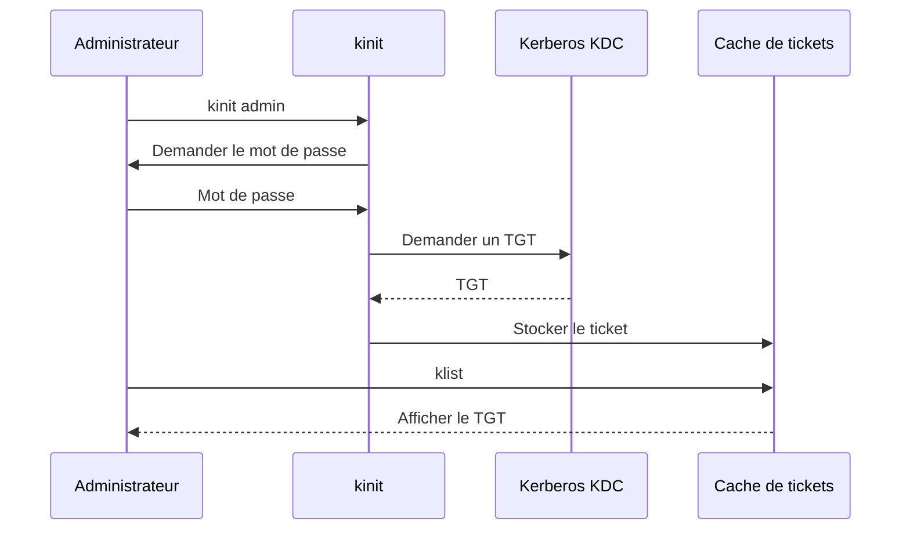

À partir de cet instant, les commandes `ipa` peuvent s'appuyer sur le ticket.

Elles n'ont plus besoin de redemander le mot de passe à chaque opération.

---

# Tester la commande `ipa`

Exécutez :

```bash
ipa ping
```

Le résultat doit ressembler à :

```text
IPA server version ...
API version ...
```

Affichez ensuite les informations du compte administrateur.

```bash
ipa user-show admin
```

Vous devriez voir notamment :

- le nom du compte ;
- son prénom et son nom ;
- son UID ;
- son GID ;
- les groupes auxquels il appartient ;
- son état.

Essayez également :

```bash
ipa config-show
```

Cette commande affiche la configuration générale du domaine.

À ce stade, la chaîne suivante fonctionne :

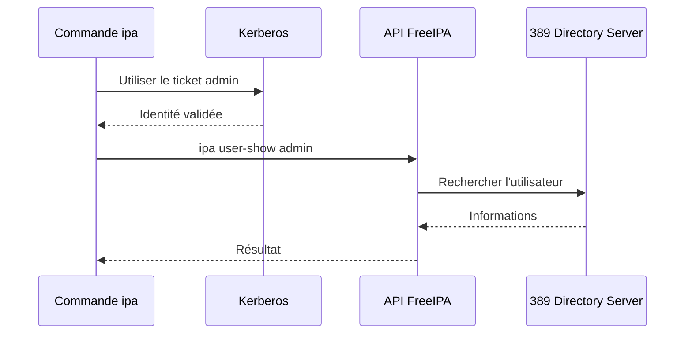

---

# Détruire un ticket Kerberos

Lorsque le travail d'administration est terminé, le ticket peut être supprimé.

```bash
kdestroy
```

Vérifiez ensuite :

```bash
klist
```

Le résultat indique qu'aucun cache de tickets n'est disponible.

Cette commande est particulièrement importante :

- sur un poste partagé ;
- sur un bastion ;
- avant de quitter une session d'administration ;
- après une opération sensible.

Un ticket Kerberos est une preuve d'identité temporaire.

Il doit être protégé comme un secret.

---

# Tester le DNS intégré

Affichez les zones FreeIPA.

```bash
ipa dnszone-find
```

Vous devriez retrouver :

```text
lab.sentinel.test.
```

Et, si elle a été créée :

```text
56.168.192.in-addr.arpa.
```

Testez la résolution du serveur.

```bash
dig ipa01.lab.sentinel.test
```

Puis la résolution inverse.

```bash
dig -x 192.168.56.10
```

Examinez également les enregistrements de découverte.

```bash
dig SRV _kerberos._udp.lab.sentinel.test
```

Puis :

```bash
dig SRV _ldap._tcp.lab.sentinel.test
```

Ces enregistrements permettent aux clients de découvrir automatiquement les services du domaine.

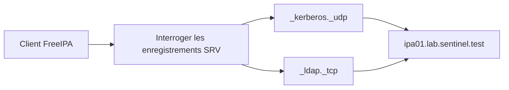

Le client n'a donc pas besoin de connaître manuellement chaque serveur.

Le DNS lui indique où se trouvent les services.

---

# Faire utiliser le DNS FreeIPA au serveur

Après l'installation, vérifiez la configuration du résolveur.

```bash
cat /etc/resolv.conf
```

Puis :

```bash
resolvectl status
```

si `systemd-resolved` est utilisé.

Sur AlmaLinux avec NetworkManager, consultez :

```bash
nmcli device show | grep -E 'IP4.DNS|IP4.DOMAIN'
```

Le serveur doit pouvoir interroger correctement la zone FreeIPA.

Dans notre laboratoire, le DNS principal du serveur peut être sa propre adresse :

```text
192.168.56.10
```

Le domaine de recherche peut être :

```text
lab.sentinel.test
```

La modification doit être réalisée via NetworkManager plutôt qu'en éditant directement `/etc/resolv.conf`.

Identifiez la connexion.

```bash
nmcli connection show
```

Puis, en adaptant son nom :

```bash
sudo nmcli connection modify \
    "System eth0" \
    ipv4.dns "192.168.56.10" \
    ipv4.dns-search "lab.sentinel.test" \
    ipv4.ignore-auto-dns yes
```

Réactivez ensuite la connexion.

```bash
sudo nmcli connection up "System eth0"
```

Le nom de connexion et l'interface doivent être adaptés au laboratoire.

Attention à ne pas interrompre une connexion distante sans accès de secours.

---

# Tester l'interface Web

L'interface Web est disponible à l'adresse :

```text
https://ipa01.lab.sentinel.test/
```

Elle doit être ouverte avec le FQDN.

Évitez d'utiliser directement :

```text
https://192.168.56.10/
```

Le certificat TLS a été délivré pour le nom du serveur.

L'utilisation de l'adresse IP provoquerait normalement une erreur de correspondance du certificat.

Connectez-vous avec :

```text
Utilisateur : admin
```

et le mot de passe défini pendant l'installation.

L'interface permet d'accéder aux principales catégories :

- Identity ;
- Policy ;
- Authentication ;
- Network Services ;
- IPA Server.

L'organisation exacte des menus peut varier selon la version installée.

---

# Faire reconnaître l'autorité de certification au navigateur

Lors de la première connexion, le navigateur peut signaler que l'autorité de certification n'est pas reconnue.

Ce comportement est normal.

FreeIPA utilise sa propre autorité interne.

Le certificat racine peut être récupéré à l'adresse :

```text
https://ipa01.lab.sentinel.test/ipa/config/ca.crt
```

Il peut également être trouvé sur le serveur dans :

```text
/etc/ipa/ca.crt
```

Vérifiez le certificat.

```bash
openssl x509 \
    -in /etc/ipa/ca.crt \
    -noout \
    -subject \
    -issuer \
    -dates \
    -fingerprint
```

Le certificat doit être importé dans le magasin de confiance du poste d'administration lorsque cela est approprié.

Ne contournez pas définitivement l'avertissement du navigateur.

La bonne solution consiste à établir la confiance envers l'autorité interne.

---

# Vérifier les certificats du serveur

FreeIPA utilise `certmonger` pour surveiller plusieurs certificats.

Affichons les demandes suivies.

```bash
sudo getcert list
```

La sortie peut être longue.

Recherchez notamment les certificats associés :

- au serveur Web ;
- à LDAP ;
- aux services internes ;
- à Dogtag.

Chaque demande possède un état.

L'état attendu est généralement :

```text
MONITORING
```

Cela signifie que `certmonger` surveille le certificat et pourra demander son renouvellement.

Vérifiez également le service.

```bash
systemctl status certmonger
```

Ce mécanisme sera réutilisé lors de la délivrance du certificat de Sentinel.

---

# Tester les ports d'écoute

Affichons les sockets du serveur.

```bash
sudo ss -lntup
```

Filtrons les principaux ports FreeIPA.

```bash
sudo ss -lntup | grep -E \
    ':(53|80|88|389|443|464|636)\b'
```

Vous devriez retrouver plusieurs services.

Par exemple :

- DNS ;
- Kerberos ;
- LDAP ;
- HTTPS.

La présence d'un port en écoute ne garantit pas que le service fonctionne entièrement.

Elle confirme simplement qu'un processus accepte les connexions.

Les tests applicatifs restent indispensables.

---

# Vérifier les journaux

FreeIPA répartit ses journaux entre plusieurs composants.

Les emplacements les plus utiles incluent notamment :

```text
/var/log/ipaserver-install.log
```

```text
/var/log/httpd/
```

```text
/var/log/dirsrv/
```

```text
/var/log/krb5kdc.log
```

```text
/var/log/pki/
```

```text
/var/named/data/
```

Les chemins exacts et les journaux actifs peuvent varier selon les versions et les composants.

`journald` reste également une source essentielle.

Par exemple :

```bash
sudo journalctl -u krb5kdc
```

```bash
sudo journalctl -u httpd
```

```bash
sudo journalctl -u pki-tomcatd@pki-tomcat
```

```bash
sudo journalctl -u named-pkcs11
```

Si l'unité `named-pkcs11` n'existe pas, recherchez le nom réel :

```bash
systemctl list-units --type=service | grep named
```

Un bon diagnostic commence toujours par identifier le composant qui échoue.

---

## 💎 Le point d'expertise

L'absence d'erreur dans :

```bash
ipactl status
```

ne garantit pas à elle seule que l'infrastructure est saine.

Un service peut être actif tout en étant inutilisable.

Par exemple :

- Kerberos fonctionne, mais l'horloge du client est incorrecte ;
- DNS fonctionne, mais les enregistrements SRV sont absents ;
- LDAP fonctionne, mais un certificat est expiré ;
- l'interface Web fonctionne, mais le compte n'a pas les autorisations nécessaires.

Une validation complète doit tester plusieurs niveaux.

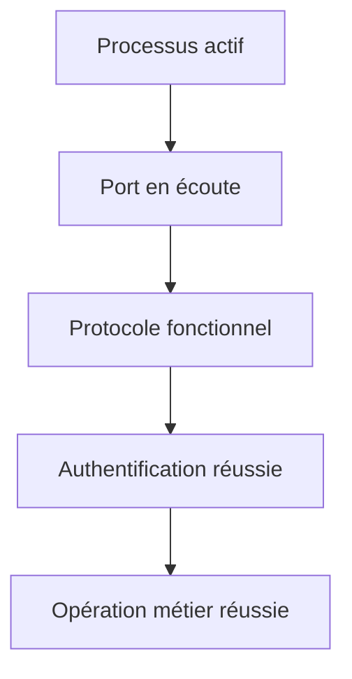

Pour FreeIPA, cela signifie au minimum :

```bash
sudo ipactl status
```

```bash
kinit admin
```

```bash
ipa ping
```

```bash
ipa user-show admin
```

```bash
dig SRV _kerberos._udp.lab.sentinel.test
```

La supervision future devra reprendre cette logique.

---

## 🧠 Comment pense un architecte ?

Un architecte prépare l'installation avant de toucher au serveur.

Il documente d'abord :

- le domaine DNS ;
- le royaume Kerberos ;
- les noms des serveurs ;
- les adresses IP ;
- les redirecteurs DNS ;
- les flux réseau ;
- la stratégie de sauvegarde ;
- la future topologie de réplication.

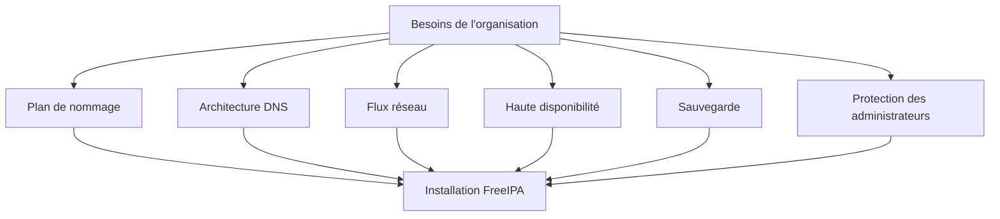

Dans un laboratoire, il est possible de reconstruire la machine.

En production, une erreur de conception peut concerner plusieurs centaines de clients.

La phase de préparation n'est donc pas du temps perdu.

Elle constitue la première mesure de sécurité.

---

## ⚔️ Comment pense un attaquant ?

Un attaquant cherche à identifier les services exposés.

Une simple reconnaissance réseau peut révéler :

- LDAP ;
- Kerberos ;
- DNS ;
- HTTPS ;
- l'autorité de certification.

Il cherche ensuite :

- des mots de passe faibles ;
- des comptes privilégiés ;
- des versions vulnérables ;
- des certificats mal protégés ;
- une interface accessible depuis un réseau inutile ;
- des flux autorisés depuis des zones non fiables.

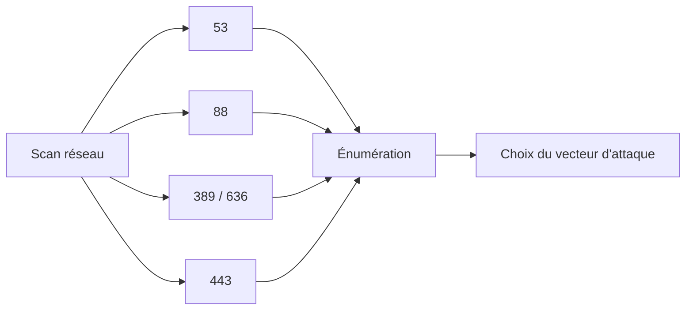

Le pare-feu ne doit donc pas ouvrir FreeIPA à l'ensemble du réseau sans justification.

Seuls les clients et les administrateurs autorisés doivent pouvoir joindre les services nécessaires.

Dans une architecture mature, les flux seront segmentés par zone réseau.

---

## 📚 Culture technique

Le premier serveur FreeIPA installé n'est pas techniquement destiné à rester l'unique serveur d'une infrastructure de production.

FreeIPA est conçu pour fonctionner avec plusieurs réplicas.

Ces réplicas peuvent partager différents rôles :

- annuaire ;
- Kerberos ;
- autorité de certification ;
- DNS.

La réplication est de type multi-maître pour les données d'identité.

Cela signifie que plusieurs serveurs peuvent accepter des modifications.

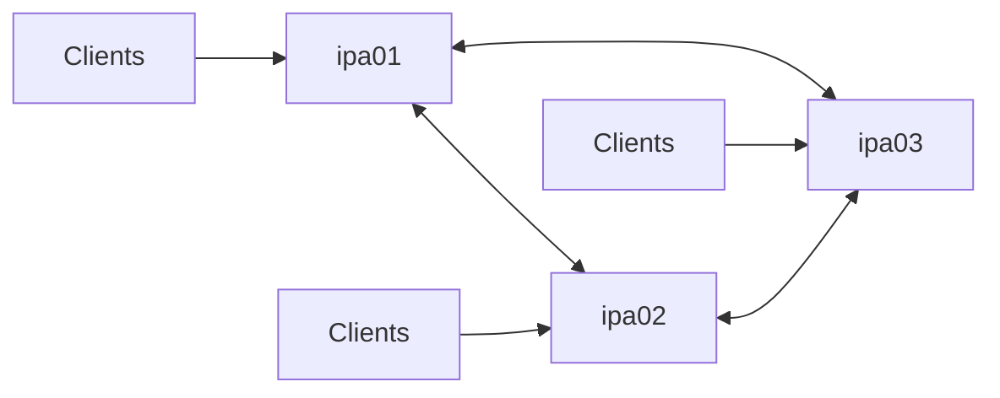

Le premier serveur constitue la naissance du domaine.

Il ne doit pas devenir un point de défaillance permanent.

La mise en place des réplicas sera étudiée lors de l'approfondissement de l'architecture FreeIPA.

FreeIPA est conçu pour une architecture répliquée multi-maître plutôt que pour dépendre durablement d’un serveur unique. :contentReference[oaicite:2]{index=2}

---

## ⚠️ Piège classique

Le piège le plus dangereux consiste à utiliser un instantané de machine virtuelle comme unique stratégie de sauvegarde.

Un snapshot peut être utile dans un laboratoire.

Mais une infrastructure FreeIPA contient plusieurs bases cohérentes entre elles.

Elle comprend notamment :

- LDAP ;
- Kerberos ;
- Dogtag ;
- DNS ;
- différentes clés internes.

Dans une architecture répliquée, le retour brutal d'un serveur à un ancien état peut également provoquer des incohérences avec les autres réplicas.

FreeIPA fournit des outils dédiés.

Par exemple :

```bash
ipa-backup
```

et :

```bash
ipa-restore
```

Ces outils doivent s'inscrire dans une procédure testée.

Une sauvegarde non testée n'est pas une garantie de restauration.

---

# Désinstaller proprement une installation de laboratoire

Si l'installation a échoué ou si le domaine doit être reconstruit, n'effacez pas manuellement les répertoires FreeIPA.

Utilisez :

```bash
sudo ipa-server-install --uninstall
```

L'outil demande une confirmation.

Il supprime ensuite la configuration réalisée par FreeIPA.

Après une désinstallation, vérifiez :

- le nom d'hôte ;
- la résolution DNS ;
- `/etc/resolv.conf` ;
- les règles Firewalld ;
- les éventuelles entrées DNS externes ;
- le journal de désinstallation.

La désinstallation ne corrige pas automatiquement une mauvaise architecture.

Il faut identifier la cause initiale avant de recommencer.

---

# Laboratoire AlmaLinux

## Mission

Construire le premier serveur du domaine :

```text
LAB.SENTINEL.TEST
```

Le serveur devra fournir :

- LDAP ;
- Kerberos ;
- une autorité de certification ;
- le DNS du laboratoire ;
- l'interface d'administration FreeIPA.

---

## Étape 1 — Vérifier le socle

```bash
hostname -f
```

Résultat attendu :

```text
ipa01.lab.sentinel.test
```

```bash
getenforce
```

Résultat attendu :

```text
Enforcing
```

```bash
systemctl is-active chronyd
```

Résultat attendu :

```text
active
```

```bash
systemctl is-active firewalld
```

Résultat attendu :

```text
active
```

```bash
getent hosts ipa01.lab.sentinel.test
```

L'adresse retournée doit être celle du serveur.

---

## Étape 2 — Installer les paquets

```bash
sudo dnf install -y ipa-server ipa-server-dns
```

Vérifiez :

```bash
rpm -q ipa-server ipa-server-dns
```

---

## Étape 3 — Lancer l'installation

```bash
sudo ipa-server-install
```

Utilisez les valeurs suivantes :

```text
DNS intégré : yes

Hostname : ipa01.lab.sentinel.test

Domain : lab.sentinel.test

Realm : LAB.SENTINEL.TEST
```

Définissez deux mots de passe distincts :

- Directory Manager ;
- administrateur FreeIPA.

Configurez un redirecteur DNS adapté au laboratoire.

Acceptez la zone inverse si elle est cohérente avec le réseau.

---

## Étape 4 — Configurer Firewalld

Identifiez la zone active.

```bash
sudo firewall-cmd --get-active-zones
```

Ajoutez les services en remplaçant `public` si nécessaire.

```bash
sudo firewall-cmd \
    --permanent \
    --zone=public \
    --add-service=freeipa-4
```

```bash
sudo firewall-cmd \
    --permanent \
    --zone=public \
    --add-service=dns
```

```bash
sudo firewall-cmd --reload
```

Vérifiez :

```bash
sudo firewall-cmd \
    --zone=public \
    --list-all
```

---

## Étape 5 — Valider les services

```bash
sudo ipactl status
```

Aucun service requis ne doit être arrêté.

---

## Étape 6 — Tester Kerberos

```bash
kinit admin
```

Puis :

```bash
klist
```

Un TGT doit être présent.

---

## Étape 7 — Tester l'API FreeIPA

```bash
ipa ping
```

Puis :

```bash
ipa user-show admin
```

Enfin :

```bash
ipa config-show
```

---

## Étape 8 — Tester le DNS

```bash
dig ipa01.lab.sentinel.test
```

```bash
dig -x 192.168.56.10
```

```bash
dig SRV _kerberos._udp.lab.sentinel.test
```

```bash
dig SRV _ldap._tcp.lab.sentinel.test
```

Adaptez l'adresse IP au laboratoire.

---

## Étape 9 — Examiner les certificats

```bash
sudo getcert list
```

Puis :

```bash
openssl x509 \
    -in /etc/ipa/ca.crt \
    -noout \
    -subject \
    -issuer \
    -dates
```

---

## Étape 10 — Tester l'interface Web

Ouvrez :

```text
https://ipa01.lab.sentinel.test/
```

Connectez-vous avec :

```text
admin
```

Vérifiez que les principales catégories d'administration sont accessibles.

---

## Étape 11 — Fermer la session Kerberos

```bash
kdestroy
```

Puis :

```bash
klist
```

Le cache ne doit plus contenir de ticket.

---

# Mission d'ingénieur

L'installation technique n'est qu'une partie du travail.

Produisez une fiche d'architecture contenant les informations suivantes.

```text
Nom du serveur :

Adresse IP :

Domaine DNS :

Royaume Kerberos :

Zone DNS directe :

Zone DNS inverse :

Redirecteurs DNS :

Zone Firewalld :

Services Firewalld ouverts :

Source de temps :

Emplacement du certificat CA :

Emplacement du journal d'installation :

Procédure d'obtention d'un ticket administrateur :

Procédure de destruction du ticket :
```

Ajoutez ensuite un tableau de validation.

| Contrôle | Commande | Résultat attendu | Résultat obtenu |
|----------|----------|------------------|-----------------|
| FQDN | `hostname -f` | Nom complet correct | |
| Synchronisation | `chronyc tracking` | Source valide | |
| SELinux | `getenforce` | `Enforcing` | |
| Services IPA | `ipactl status` | Services actifs | |
| Kerberos | `kinit admin` | TGT obtenu | |
| API | `ipa ping` | Réponse du serveur | |
| DNS LDAP | `dig SRV _ldap._tcp...` | Serveur découvert | |
| DNS Kerberos | `dig SRV _kerberos._udp...` | KDC découvert | |
| Certificats | `getcert list` | États `MONITORING` | |
| Interface Web | Navigateur | Connexion réussie | |

Cette documentation deviendra la première pièce du dossier d'exploitation FreeIPA.

---

# Impact sur Sentinel

Le domaine FreeIPA est désormais disponible.

Sentinel n'y est pas encore intégrée.

Cependant, plusieurs fondations sont en place.

Le domaine connaît :

```text
lab.sentinel.test
```

Kerberos fournit l'authentification centralisée.

Dogtag fournit une autorité de certification.

Le DNS permet la découverte des services.

L'étape suivante consistera à intégrer :

```text
sentinel01.lab.sentinel.test
```

comme hôte du domaine.

Puis à créer :

- les utilisateurs de Sentinel ;
- les groupes d'administration ;
- les politiques `sudo` ;
- les principaux de service ;
- les certificats TLS.

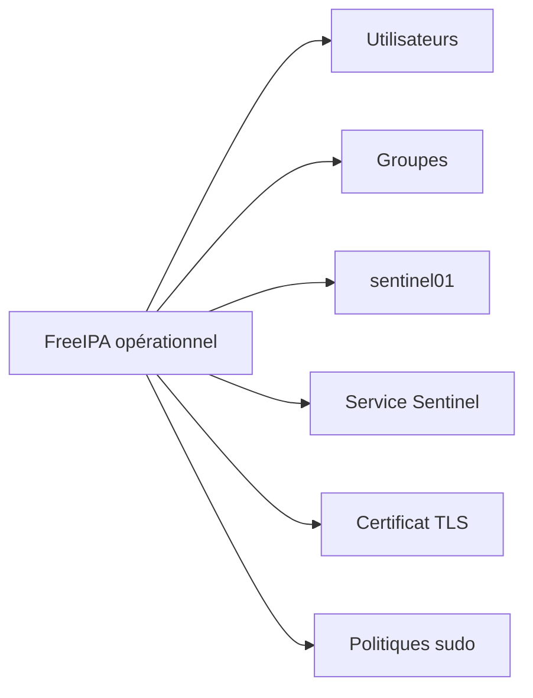

L'installation du serveur ne représente donc pas une finalité.

Elle fournit le socle de confiance sur lequel les services seront progressivement intégrés.

---

# Ce qu'il faut retenir

- Le nom d'hôte, le domaine DNS et le royaume Kerberos doivent être définis avant l'installation.
- Le FQDN du serveur doit être stable et correctement résolu.
- Kerberos dépend d'une synchronisation horaire fiable.
- Le DNS constitue une composante fonctionnelle et sécuritaire de FreeIPA.
- `ipa-server-install` configure les différents composants du domaine.
- Le Directory Manager et l'administrateur `admin` sont deux identités différentes.
- `ipactl status` fournit une vue globale des services FreeIPA.
- `kinit`, `klist` et `kdestroy` permettent de gérer les tickets Kerberos.
- Les commandes `ipa` utilisent l'identité Kerberos de l'administrateur.
- L'installation doit être validée à plusieurs niveaux : processus, ports, protocoles, authentification et opérations fonctionnelles.
- Un serveur FreeIPA de production ne doit pas rester un point de défaillance unique.

---

# Grande infographie de révision

```text
                    INSTALLATION D'UN SERVEUR FREEIPA

                              PRÉPARATION
                                  |
          +-----------------------+-----------------------+
          |                       |                       |
          v                       v                       v
       FQDN stable           DNS cohérent          Heure synchronisée
          |                       |                       |
          +-----------------------+-----------------------+
                                  |
                                  v
                         AlmaLinux à jour
                                  |
                    +-------------+-------------+
                    |                           |
                    v                           v
              SELinux Enforcing           Firewalld actif
                    |                           |
                    +-------------+-------------+
                                  |
                                  v
                  Installation des paquets FreeIPA

                ipa-server + ipa-server-dns
                                  |
                                  v
                       ipa-server-install
                                  |
          +-----------------------+-----------------------+
          |                       |                       |
          v                       v                       v
  389 Directory Server       Kerberos KDC          Dogtag PKI
          |                       |                       |
          +-----------------------+-----------------------+
                                  |
                    +-------------+-------------+
                    |                           |
                    v                           v
                DNS intégré               Interface Web
                    |                           |
                    +-------------+-------------+
                                  |
                                  v
                         Domaine opérationnel

──────────────────────────────────────────────────────────────────────────────

                       VALIDATION DE L'INSTALLATION

  ipactl status
        |
        v
  Services actifs
        |
        v
  kinit admin
        |
        v
  Ticket Kerberos
        |
        v
  ipa ping
        |
        v
  API fonctionnelle
        |
        v
  dig SRV _kerberos._udp.lab.sentinel.test
        |
        v
  Découverte DNS fonctionnelle
        |
        v
  Interface Web accessible

──────────────────────────────────────────────────────────────────────────────

                       CHAÎNE DE CONFIANCE

      DNS correct
          |
          v
      Service découvert
          |
          v
      Kerberos authentifie
          |
          v
      LDAP fournit l'identité
          |
          v
      Dogtag délivre les certificats
          |
          v
      FreeIPA applique les politiques

──────────────────────────────────────────────────────────────────────────────

      Une installation FreeIPA réussie ne se résume pas à
      l'apparition du message « Setup complete ».

      Chaque composant de la chaîne doit être vérifié.
```

# Transition vers le chapitre 8.4

Le domaine FreeIPA est maintenant installé.

Il possède déjà une première identité :

```text
admin
```

Mais une infrastructure d'entreprise ne peut pas être administrée durablement avec un unique compte partagé.

Il faut maintenant créer de véritables identités.

Chaque personne devra disposer :

- de son propre compte ;
- de son propre mot de passe ;
- de son propre UID ;
- de ses propres attributs ;
- d'un cycle de vie maîtrisé.

Il faudra également apprendre à :

- désactiver un compte ;
- imposer un changement de mot de passe ;
- gérer l'expiration ;
- rechercher les utilisateurs ;
- distinguer une identité locale d'une identité FreeIPA.

Le prochain chapitre sera consacré à la gestion complète des utilisateurs dans FreeIPA.

Nous verrons comment une identité créée une seule fois dans l'annuaire devient immédiatement disponible sur l'ensemble des clients du domaine.

