# Chapitre 8.4 — Gestion des utilisateurs

> **Campagne 8 — FreeIPA**

> *« Une identité bien administrée possède un début, une période d'activité et une fin clairement maîtrisée. »*

---

## Vous êtes ici

```text
PARTIE II — Industrialiser la sécurité

Campagne 8  [████░░░░░░]

      8.1 Présentation de FreeIPA ✔
      8.2 Architecture interne ✔
      8.3 Installation ✔
   ►  8.4 Gestion des utilisateurs
      8.5 Groupes et rôles
      8.6 Politiques sudo
      8.7 Gestion des hôtes
      8.8 Certificats
      8.9 Intégration de Sentinel
      8.10 Mission : administrer une infrastructure avec FreeIPA
```

---

## Objectifs pédagogiques

À la fin de ce chapitre, vous serez capable de :

- comprendre le cycle de vie d'une identité FreeIPA ;
- créer un utilisateur avec l'interface en ligne de commande ;
- distinguer identité locale et identité centralisée ;
- rechercher et afficher les attributs d'un utilisateur ;
- gérer l'activation, la désactivation et la suppression d'un compte ;
- comprendre le rôle du mot de passe temporaire ;
- imposer un changement de mot de passe à la première connexion ;
- diagnostiquer les problèmes courants liés aux utilisateurs du domaine.

---

## Pourquoi ce chapitre existe

Le serveur FreeIPA est désormais opérationnel.

Il possède un domaine.

Il possède une autorité de certification.

Il possède un service Kerberos.

Il possède un annuaire LDAP.

Mais il ne contient encore presque aucune identité métier.

Un domaine d'identité n'a de valeur que s'il permet de gérer correctement les utilisateurs.

Créer un utilisateur ne consiste pas simplement à lui attribuer un nom.

Une identité d'entreprise possède généralement :

- un identifiant ;
- un nom complet ;
- une adresse électronique ;
- un UID ;
- un groupe principal ;
- un mot de passe ;
- une date d'expiration éventuelle ;
- des groupes ;
- des rôles ;
- des autorisations.

Elle possède également un cycle de vie.

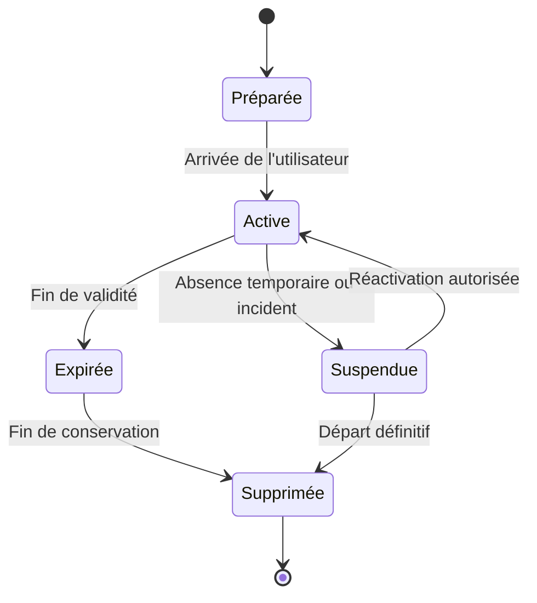

Une bonne administration ne se limite donc pas à la création.

Elle doit également maîtriser :

- l'activation ;
- les modifications ;
- la suspension ;
- le départ ;
- la suppression.

---

## Une identité unique pour tout le domaine

Avant FreeIPA, un utilisateur pouvait exister séparément sur plusieurs machines.

Par exemple :

```text
alice sur serveur A
alice sur serveur B
alice sur serveur C
```

Ces trois comptes pouvaient posséder :

- des UID différents ;
- des groupes différents ;
- des mots de passe différents ;
- des dates d'expiration différentes.

Avec FreeIPA, Alice ne possède plus trois identités.

Elle en possède une seule.

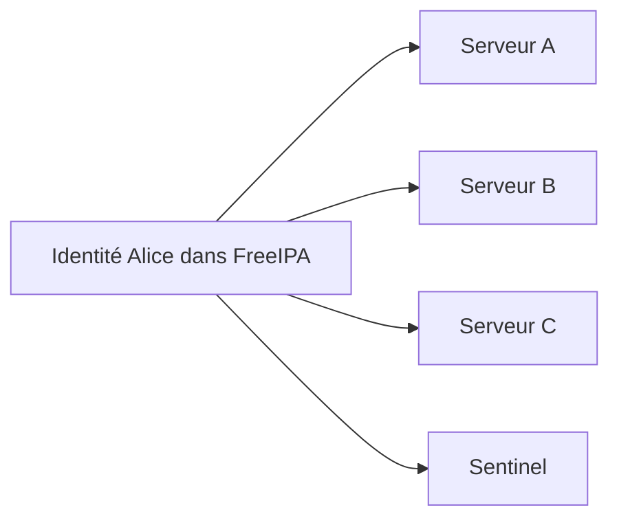

Tous les clients consultent la même source.

L'identité devient cohérente dans tout le domaine.

---

## Le compte administrateur

Avant toute opération, obtenez un ticket Kerberos.

```bash
kinit admin
```

Vérifiez-le.

```bash
klist
```

Le principal par défaut doit être :

```text
admin@LAB.SENTINEL.TEST
```

Les commandes `ipa` utiliseront ce ticket.

Il n'est pas nécessaire de fournir à nouveau le mot de passe pour chaque opération tant que le ticket reste valide.

Cette séparation entre authentification et administration est l'un des principes fondamentaux de Kerberos.

---

## Créer un premier utilisateur

Créons une utilisatrice nommée Alice Martin.

```bash
ipa user-add alice \
    --first=Alice \
    --last=Martin \
    --email=alice@lab.sentinel.test
```

La commande retourne les informations de l'utilisateur.

Par exemple :

```text
Added user "alice"

User login: alice
First name: Alice
Last name: Martin
Full name: Alice Martin
Display name: Alice Martin
Initials: AM
Home directory: /home/alice
GECOS: Alice Martin
Login shell: /bin/sh
Principal name: alice@LAB.SENTINEL.TEST
Email address: alice@lab.sentinel.test
UID: 1001
GID: 1001
Account disabled: False
```

Certaines valeurs dépendent de la configuration du domaine.

FreeIPA peut attribuer automatiquement :

- l'UID ;
- le GID ;
- le répertoire personnel ;
- le principal Kerberos ;
- le groupe privé de l'utilisateur.

---

## Ce que FreeIPA crée réellement

La commande paraît simple.

Pourtant, plusieurs objets et attributs sont préparés.

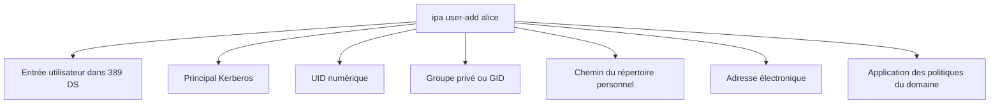

L'administrateur ne manipule pas directement chaque composant.

FreeIPA garantit la cohérence de l'ensemble.

---

## Le principal Kerberos

L'utilisateur reçoit un principal.

Dans notre laboratoire :

```text
alice@LAB.SENTINEL.TEST
```

Le principal Kerberos est composé de deux parties.

```text
alice
```

L'identité.

Puis :

```text
LAB.SENTINEL.TEST
```

Le royaume.

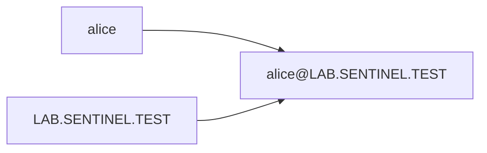

Le nom de connexion Linux est généralement :

```text
alice
```

Le principal Kerberos complet permet d'identifier sans ambiguïté le royaume auquel appartient l'utilisateur.

---

## Afficher un utilisateur

Pour consulter une identité :

```bash
ipa user-show alice
```

Pour afficher davantage d'attributs :

```bash
ipa user-show alice --all
```

Pour afficher également les valeurs brutes :

```bash
ipa user-show alice --all --raw
```

Ces trois niveaux répondent à des besoins différents.

| Commande | Usage |
|----------|-------|
| `ipa user-show alice` | Consultation courante |
| `--all` | Diagnostic détaillé |
| `--raw` | Affichage des attributs LDAP bruts |

L'option `--raw` est particulièrement utile lorsqu'on cherche à comprendre la correspondance entre les objets FreeIPA et les attributs LDAP.

---

## Rechercher des utilisateurs

Pour afficher les utilisateurs :

```bash
ipa user-find
```

Pour rechercher un nom :

```bash
ipa user-find alice
```

Pour limiter le nombre de résultats :

```bash
ipa user-find --sizelimit=20
```

Pour rechercher selon un attribut :

```bash
ipa user-find --email=alice@lab.sentinel.test
```

La commande `user-find` devient essentielle lorsque le domaine contient plusieurs centaines ou plusieurs milliers d'identités.

---

## Les attributs d'une identité

Une identité FreeIPA contient davantage d'informations qu'une ligne de `/etc/passwd`.

On y retrouve notamment :

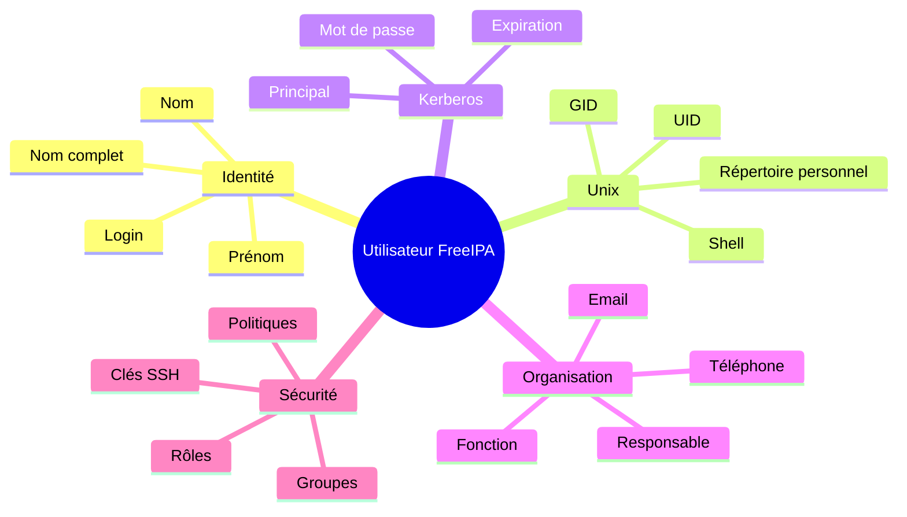

Tous les attributs ne sont pas obligatoires.

La politique de l'organisation doit définir lesquels sont réellement nécessaires.

Une accumulation d'informations inutiles augmente :

- les besoins de maintenance ;
- les risques d'erreur ;
- les enjeux liés à la protection des données personnelles.

---

## Modifier un utilisateur

Supposons qu'Alice change d'adresse électronique.

```bash
ipa user-mod alice \
    --email=alice.martin@lab.sentinel.test
```

Pour modifier son shell :

```bash
ipa user-mod alice \
    --shell=/bin/bash
```

Pour modifier son numéro de téléphone :

```bash
ipa user-mod alice \
    --phone="+33 5 00 00 00 00"
```

Vérifiez ensuite :

```bash
ipa user-show alice
```

L'identité est modifiée une seule fois.

Tous les clients consulteront ensuite la nouvelle valeur.

---

## Le shell de connexion

FreeIPA peut définir le shell associé à l'utilisateur.

Par exemple :

```text
/bin/bash
```

ou :

```text
/sbin/nologin
```

Ce champ remplit le même rôle que le dernier champ de `/etc/passwd`.

Il ne faut pas attribuer un shell interactif sans nécessité.

Un utilisateur humain peut avoir besoin de :

```text
/bin/bash
```

Un compte technique destiné uniquement à certaines opérations peut utiliser :

```text
/sbin/nologin
```

Cependant, il ne faut pas confondre :

- un utilisateur FreeIPA ;
- un compte système local ;
- un principal de service Kerberos.

Ces trois identités répondent à des besoins différents.

---

## FreeIPA crée-t-il le répertoire personnel ?

Non.

Cette distinction est essentielle.

FreeIPA stocke l'attribut :

```text
/home/alice
```

Mais il ne crée pas ce répertoire sur tous les clients.

Pourquoi ?

Parce que le répertoire personnel appartient au système de fichiers de la machine cliente.

L'annuaire ne peut pas créer directement un répertoire sur chaque serveur.

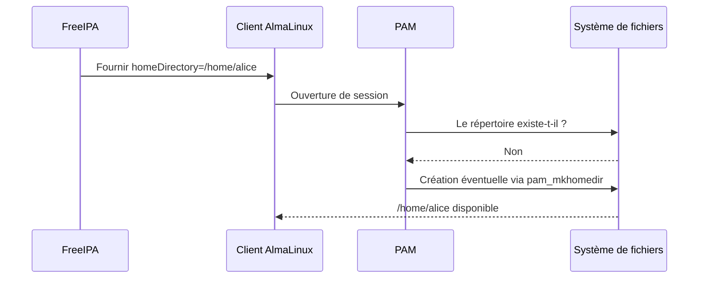

La création automatique peut être assurée côté client par un mécanisme comme :

```text
pam_oddjob_mkhomedir
```

ou :

```text
pam_mkhomedir
```

selon la configuration.

Nous retrouverons cette étape lors de l'intégration des clients FreeIPA.

---

## Définir le mot de passe initial

La création de l'utilisateur ne lui attribue pas nécessairement un mot de passe utilisable.

Définissons un mot de passe temporaire.

```bash
ipa passwd alice
```

Le programme demande :

```text
New Password:
```

Puis :

```text
Enter New Password again to verify:
```

Ce mot de passe initial est généralement marqué comme expiré.

Lors de sa première authentification, Alice devra le remplacer.

Cette pratique évite que l'administrateur connaisse durablement le mot de passe de l'utilisateur.

---

## Pourquoi utiliser un mot de passe temporaire ?

Imaginons que l'administrateur choisisse le mot de passe définitif d'Alice.

Il connaîtrait alors son secret.

Cette situation poserait plusieurs problèmes.

- Alice ne serait pas la seule personne à connaître son mot de passe.
- L'administrateur pourrait se connecter sous son identité.
- La traçabilité deviendrait moins fiable.
- Le secret pourrait être transmis par un canal non sécurisé.

Le mot de passe temporaire répond à ce problème.

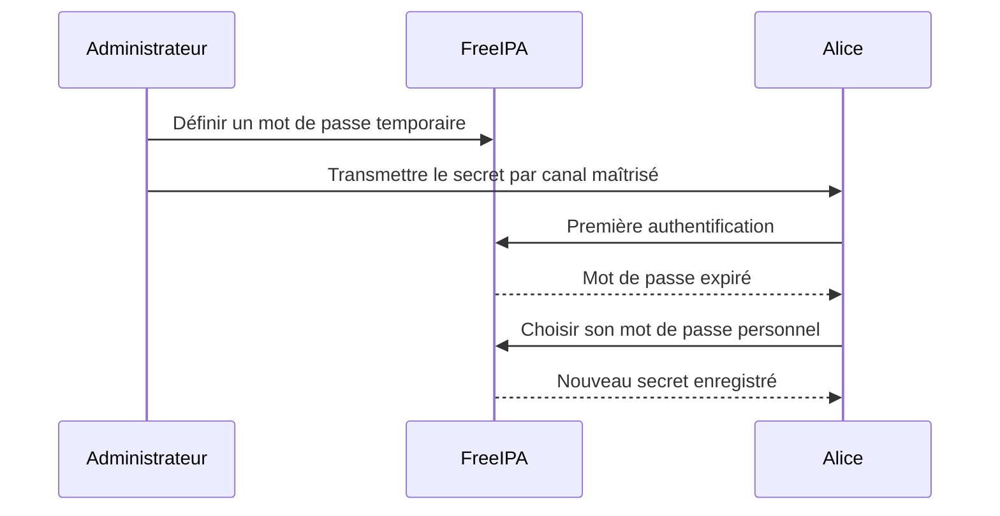

À l'issue de la première connexion, l'administrateur ne connaît plus le mot de passe actif.

---

## Tester le premier changement de mot de passe

Détruisez le ticket administrateur.

```bash
kdestroy
```

Essayez ensuite d'obtenir un ticket pour Alice.

```bash
kinit alice
```

Saisissez le mot de passe temporaire.

Kerberos peut répondre que le mot de passe est expiré.

Il demande alors :

```text
Enter new password:
```

Puis une confirmation.

Une fois le changement effectué, vérifiez :

```bash
klist
```

Le principal doit être :

```text
alice@LAB.SENTINEL.TEST
```

Alice possède désormais son propre ticket Kerberos.

---

## Vérifier l'identité avec `id`

Sur le serveur FreeIPA lui-même, essayez :

```bash
id alice
```

Puis :

```bash
getent passwd alice
```

Le résultat doit afficher l'identité FreeIPA.

Par exemple :

```text
alice:*:1001:1001:Alice Martin:/home/alice:/bin/bash
```

Cette sortie ressemble à une ligne de `/etc/passwd`.

Pourtant, Alice n'est pas nécessairement présente dans ce fichier.

Vérifiez :

```bash
grep '^alice:' /etc/passwd
```

La commande ne devrait normalement rien retourner.

L'identité provient de SSSD et de FreeIPA.

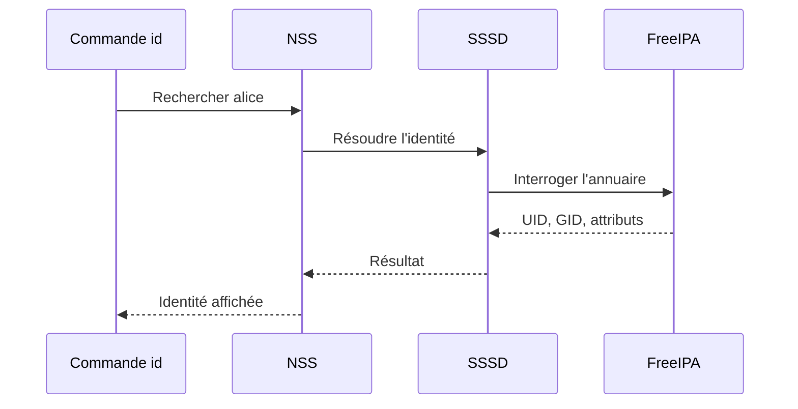

---

## Compte local et compte FreeIPA

Il est possible qu'un même nom existe :

- localement ;
- dans FreeIPA.

Par exemple :

```text
alice dans /etc/passwd
```

et :

```text
alice dans FreeIPA
```

Cette situation est dangereuse.

Selon l'ordre de résolution NSS, l'une des identités peut masquer l'autre.

Les UID peuvent également être différents.

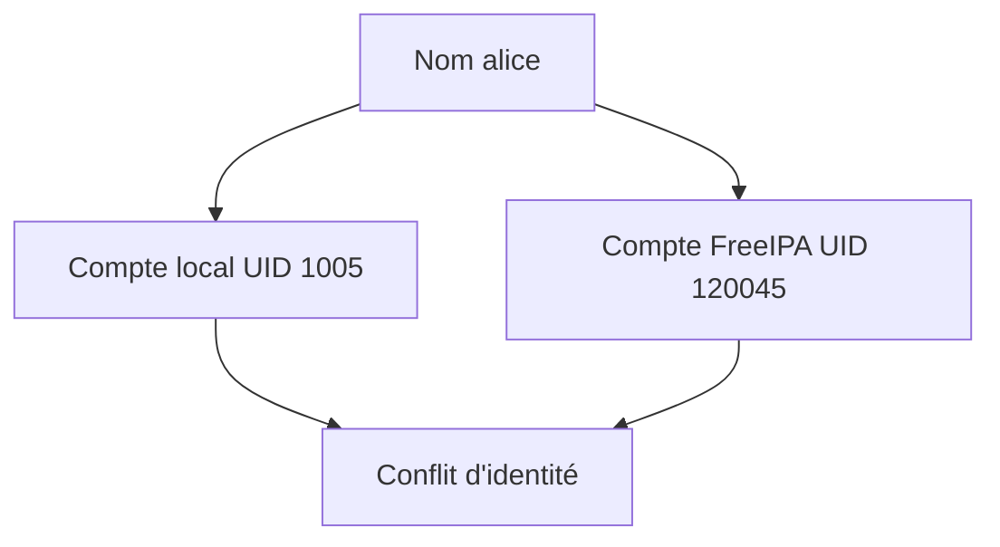

Une convention de nommage doit empêcher ces collisions.

Avant de créer une identité FreeIPA, il est utile de vérifier :

```bash
getent passwd alice
```

Si le nom existe déjà, il faut identifier son origine avant de continuer.

---

### 💎 Le point d'expertise

Une identité Linux est réellement définie par son UID.

Pas par son nom.

Imaginons deux utilisateurs.

```text
alice
UID 1001
```

et :

```text
alice
UID 2001
```

Pour un humain, ils semblent identiques.

Pour le noyau, il s'agit de deux identités totalement différentes.

Inversement, deux noms différents utilisant accidentellement le même UID peuvent être considérés comme le même propriétaire par le système de fichiers.

C'est pourquoi la gestion centralisée des plages d'UID est essentielle.

FreeIPA permet d'attribuer des identifiants numériques cohérents à l'échelle du domaine.

Dans une architecture comportant plusieurs domaines, plusieurs annuaires ou des migrations, la gestion des plages d'identifiants devient un véritable sujet d'architecture.

---

## Les groupes privés des utilisateurs

Selon la configuration retenue, FreeIPA peut créer un groupe privé pour chaque utilisateur.

Pour Alice :

```text
Utilisateur : alice

Groupe privé : alice
```

Cette approche ressemble au modèle couramment utilisé sur les distributions Linux modernes.

Elle permet :

- d'isoler les fichiers personnels ;
- de simplifier le partage collaboratif ;
- d'utiliser une `umask` adaptée.

Affichez les groupes d'Alice.

```bash
id alice
```

Puis recherchez son groupe.

```bash
ipa group-show alice
```

Le comportement exact dépend de la configuration du domaine et des options utilisées lors de la création.

---

## Désactiver un utilisateur

Lorsqu'une personne quitte temporairement l'organisation, il n'est pas toujours souhaitable de supprimer immédiatement son compte.

On peut le désactiver.

```bash
ipa user-disable alice
```

Vérifiez :

```bash
ipa user-show alice
```

L'état doit indiquer :

```text
Account disabled: True
```

Alice ne peut plus s'authentifier normalement.

Cependant, son identité reste présente.

Ses groupes sont conservés.

Ses attributs sont conservés.

Cette approche est adaptée à :

- une suspension temporaire ;
- une absence prolongée ;
- une investigation ;
- un départ nécessitant une période de conservation.

---

## Réactiver un utilisateur

Pour réactiver Alice :

```bash
ipa user-enable alice
```

Puis :

```bash
ipa user-show alice
```

Le compte redevient actif.

La désactivation est donc réversible.

Elle doit être privilégiée lorsque l'organisation n'est pas encore certaine qu'une suppression définitive est appropriée.

---

## Désactivation et suppression

Ces deux opérations ne doivent pas être confondues.

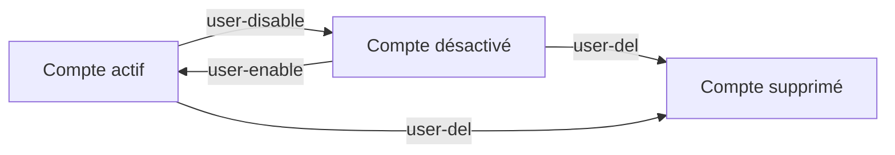

La désactivation conserve l'objet.

La suppression détruit l'identité dans l'annuaire.

Une suppression peut affecter :

- les appartenances aux groupes ;
- les autorisations ;
- les propriétaires affichés ;
- les workflows d'audit ;
- les références à l'utilisateur.

Elle doit donc suivre une procédure clairement définie.

---

## Supprimer un utilisateur

Pour supprimer Alice :

```bash
ipa user-del alice
```

FreeIPA demande une confirmation selon le contexte et les options utilisées.

Après suppression :

```bash
ipa user-show alice
```

doit échouer.

Cependant, les fichiers appartenant à l'UID d'Alice sur les clients ne disparaissent pas.

Ils restent présents.

Leur propriétaire peut être affiché sous forme numérique si l'identité n'est plus résolue.

```text
1001 1001 rapport.txt
```

C'est une conséquence importante.

Supprimer l'identité de l'annuaire ne supprime pas automatiquement :

- ses fichiers ;
- ses processus ;
- ses données applicatives ;
- ses traces dans les journaux.

---

## Conserver les utilisateurs supprimés

FreeIPA peut prendre en charge une logique de conservation des utilisateurs supprimés.

On parle parfois de :

```text
preserved users
```

L'objectif est de conserver certaines informations avant une suppression définitive.

Cette fonctionnalité facilite :

- la restauration d'un compte supprimé par erreur ;
- la conservation d'attributs utiles à l'audit ;
- la gestion structurée du départ d'un collaborateur.

Selon la version et la configuration, les commandes associées permettent notamment de préserver puis restaurer une identité.

Le cycle devient alors :

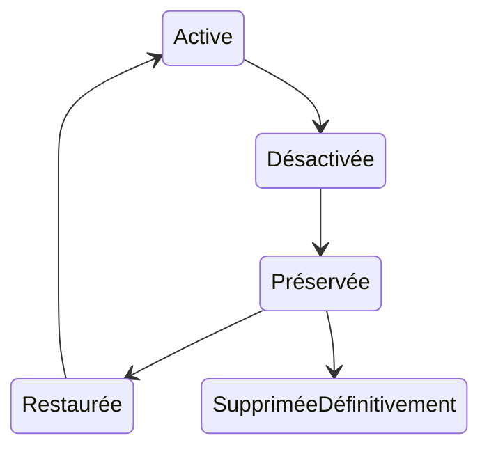

Cette approche est plus sûre qu'une suppression immédiate dans les environnements sensibles.

---

## L'expiration du compte

Une identité peut être valide uniquement jusqu'à une date définie.

Ce besoin est fréquent pour :

- un prestataire ;
- un stagiaire ;
- un compte de projet ;
- une mission temporaire.

La date d'expiration permet d'éviter qu'un compte reste actif après la fin prévue de son utilisation.

La syntaxe exacte dépend des attributs et de la version de FreeIPA.

L'objectif administratif reste le même.

```text
Compte actif jusqu'au 31 décembre

↓

Désactivation automatique après cette date
```

Une date d'expiration doit être définie dès la création lorsque le besoin est temporaire.

Il est dangereux de reposer uniquement sur une intervention manuelle future.

---

## Mot de passe expiré et compte expiré

Ces deux notions sont différentes.

Un mot de passe expiré signifie :

> l'utilisateur doit choisir un nouveau mot de passe.

Un compte expiré signifie :

> l'identité n'est plus autorisée à s'authentifier.

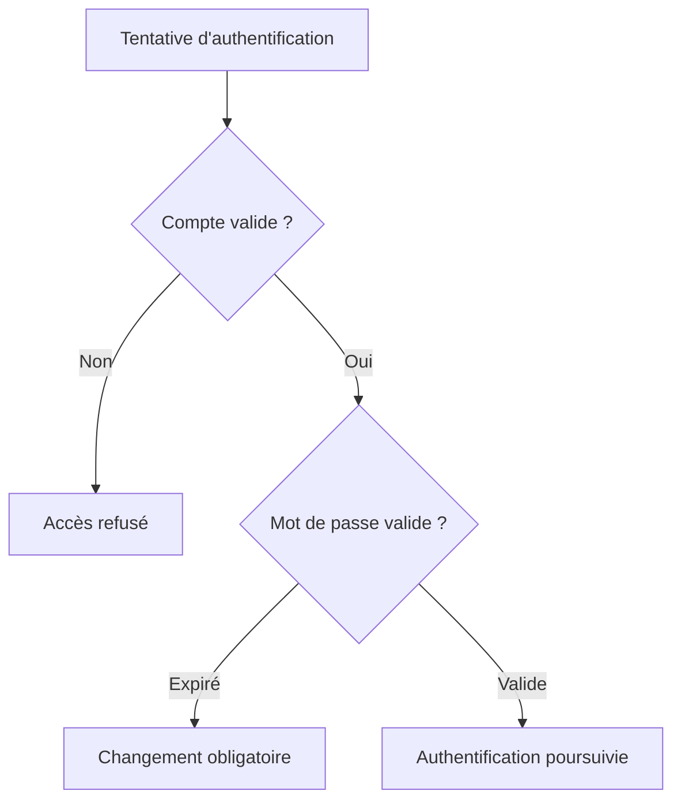

Cette distinction est indispensable lors du diagnostic d'un échec d'authentification.

---

## Réinitialiser un mot de passe

Un administrateur peut réinitialiser le mot de passe d'un utilisateur.

```bash
ipa passwd alice
```

Le nouveau mot de passe est généralement temporaire.

L'utilisateur devra le remplacer.

Cette opération doit être utilisée lorsqu'un utilisateur :

- a oublié son mot de passe ;
- soupçonne une compromission ;
- ne peut plus utiliser son ancien secret ;
- rejoint l'organisation.

La réinitialisation doit être journalisée et encadrée.

L'identité de la personne demandant l'opération doit être vérifiée avant de lui transmettre un nouveau secret.

---

## Les clés SSH dans l'identité

FreeIPA peut stocker les clés publiques SSH d'un utilisateur.

Cette fonctionnalité permet de centraliser leur gestion.

Pour ajouter une clé depuis un fichier :

```bash
ipa user-mod alice \
    --sshpubkey="$(cat ~/.ssh/id_ed25519.pub)"
```

Affichez ensuite l'utilisateur.

```bash
ipa user-show alice --all
```

La clé publique peut être distribuée aux clients intégrés selon leur configuration SSSD et OpenSSH.

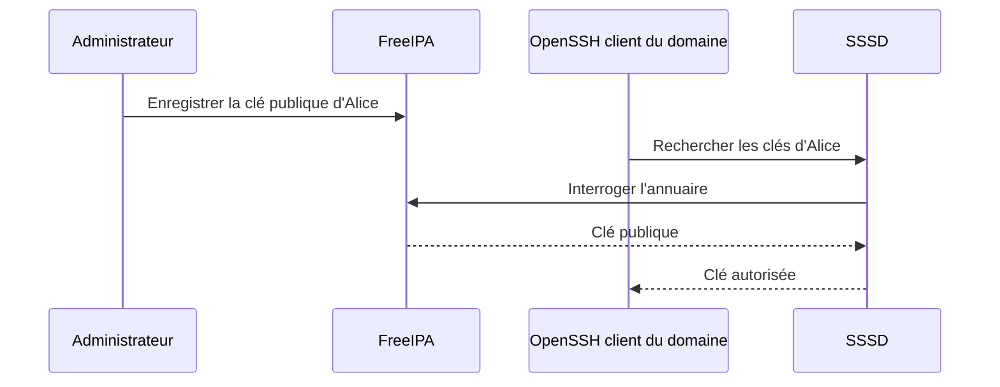

La clé privée ne doit jamais être stockée dans FreeIPA.

Elle reste sous le contrôle exclusif de l'utilisateur.

---

## Une clé SSH n'est pas un mot de passe

Les deux méthodes permettent de s'authentifier.

Mais elles ne fonctionnent pas de la même manière.

| Mot de passe | Clé SSH |
|--------------|---------|
| Secret partagé avec le système d'authentification | Paire de clés asymétriques |
| Peut être saisi sur plusieurs machines | La clé privée reste sur le poste |
| Vulnérable au hameçonnage | Vulnérable au vol de la clé privée |
| Géré par la politique de mots de passe | Géré par la politique de clés |

FreeIPA peut centraliser :

- le mot de passe Kerberos ;
- la clé publique SSH.

Il ne doit jamais centraliser la clé privée de l'utilisateur.

---

## Ajouter un certificat utilisateur

FreeIPA peut également associer des certificats à des utilisateurs.

Cette fonctionnalité peut servir à :

- l'authentification par carte à puce ;
- la signature ;
- certains usages applicatifs ;
- l'authentification forte.

Cependant, une identité utilisateur et un certificat sont deux objets distincts.

Le certificat possède :

- une période de validité ;
- une clé privée ;
- un émetteur ;
- un numéro de série ;
- un statut de révocation.

Nous approfondirons ces mécanismes dans le chapitre consacré aux certificats FreeIPA.

---

### 🧠 Comment pense un architecte ?

Un architecte ne commence pas par créer les utilisateurs.

Il commence par définir leur cycle de vie.

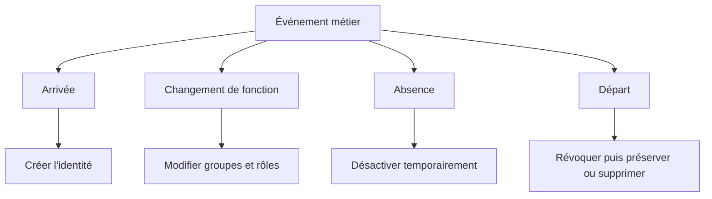

Il définit notamment :

- qui peut demander une création ;
- qui valide la demande ;
- quels attributs sont obligatoires ;
- quelle convention de nommage est utilisée ;
- comment les droits sont accordés ;
- combien de temps les données sont conservées après un départ.

FreeIPA fournit les outils techniques.

L'organisation doit fournir les règles de gouvernance.

---

### ⚔️ Comment pense un attaquant ?

Un attaquant recherche les identités faibles ou oubliées.

Par exemple :

- un ancien compte encore actif ;
- un prestataire sans date d'expiration ;
- un compte dormant ;
- une clé SSH oubliée ;
- un utilisateur appartenant encore à un groupe privilégié ;
- un mot de passe temporaire jamais remplacé.

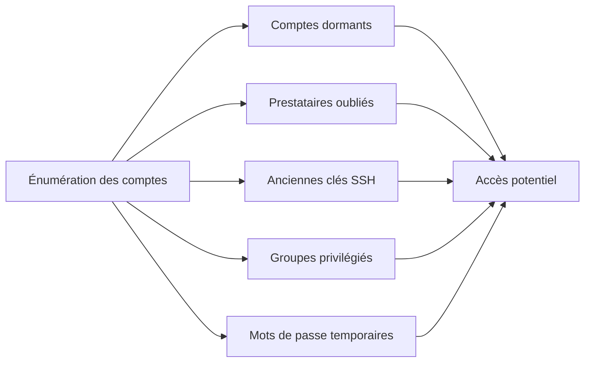

Les comptes peu utilisés sont particulièrement intéressants.

Leur activité inhabituelle peut être détectée moins rapidement.

Une revue périodique des identités est donc indispensable.

---

### 📚 Culture technique

Dans les premières infrastructures Unix, les comptes étaient souvent créés manuellement par les administrateurs.

Les demandes arrivaient :

- par courrier électronique ;
- par téléphone ;
- parfois oralement.

Dans les infrastructures modernes, la gestion des identités tend à être reliée aux processus métier.

Par exemple :

```text
Système RH

↓

Workflow d'approbation

↓

Création de l'identité

↓

Attribution des groupes

↓

Activation des accès
```

On parle alors de :

**Identity Governance and Administration**.

FreeIPA ne remplace pas nécessairement une plateforme complète de gouvernance.

Il peut toutefois constituer le référentiel technique d'identités pour l'infrastructure Linux.

---

### ⚠️ Piège classique

Un piège fréquent consiste à attribuer directement des privilèges à chaque utilisateur.

Par exemple :

```text
Alice reçoit une règle sudo.

Bob reçoit une autre règle sudo.

Claire reçoit une ACL particulière.
```

Cette approche devient rapidement ingérable.

Une meilleure stratégie consiste à :

- créer l'utilisateur ;
- l'ajouter aux groupes correspondant à sa fonction ;
- associer les politiques aux groupes.

L'identité décrit la personne.

Les groupes décrivent ses fonctions.

Les politiques décrivent les droits de ces fonctions.

Nous développerons précisément cette organisation dans le chapitre suivant.

---

## Laboratoire AlmaLinux

### Mission

Créer puis administrer le cycle de vie d'un utilisateur FreeIPA nommé :

```text
alice
```

---

### Étape 1 — Obtenir un ticket administrateur

```bash
kinit admin
```

Vérifiez :

```bash
klist
```

---

### Étape 2 — Vérifier l'absence de conflit

```bash
getent passwd alice
```

Puis :

```bash
ipa user-show alice
```

Les deux commandes doivent indiquer que l'identité n'existe pas encore.

---

### Étape 3 — Créer l'utilisateur

```bash
ipa user-add alice \
    --first=Alice \
    --last=Martin \
    --email=alice@lab.sentinel.test \
    --shell=/bin/bash
```

---

### Étape 4 — Examiner les attributs

```bash
ipa user-show alice
```

Puis :

```bash
ipa user-show alice --all
```

Enfin :

```bash
ipa user-show alice --all --raw
```

Identifiez :

- le principal Kerberos ;
- l'UID ;
- le GID ;
- le répertoire personnel ;
- le shell ;
- l'adresse électronique.

---

### Étape 5 — Définir un mot de passe temporaire

```bash
ipa passwd alice
```

Utilisez un mot de passe de laboratoire conforme à la politique du domaine.

Ne réutilisez aucun mot de passe réel.

---

### Étape 6 — Tester la première authentification

Détruisez le ticket administrateur.

```bash
kdestroy
```

Obtenez un ticket Alice.

```bash
kinit alice
```

Changez le mot de passe lorsque Kerberos le demande.

Vérifiez :

```bash
klist
```

---

### Étape 7 — Tester la résolution NSS

```bash
id alice
```

Puis :

```bash
getent passwd alice
```

Vérifiez que l'utilisateur n'est pas local.

```bash
grep '^alice:' /etc/passwd
```

---

### Étape 8 — Modifier l'identité

Récupérez un ticket administrateur.

```bash
kdestroy
```

```bash
kinit admin
```

Modifiez l'adresse électronique.

```bash
ipa user-mod alice \
    --email=alice.martin@lab.sentinel.test
```

Vérifiez :

```bash
ipa user-show alice
```

---

### Étape 9 — Désactiver l'utilisateur

```bash
ipa user-disable alice
```

Vérifiez :

```bash
ipa user-show alice
```

Essayez ensuite :

```bash
kdestroy
```

```bash
kinit alice
```

L'authentification doit être refusée.

---

### Étape 10 — Réactiver l'utilisateur

```bash
kinit admin
```

Puis :

```bash
ipa user-enable alice
```

Vérifiez :

```bash
ipa user-show alice
```

---

### Étape 11 — Ajouter une clé SSH publique de laboratoire

Créez une paire de clés dédiée si nécessaire.

```bash
ssh-keygen \
    -t ed25519 \
    -f ~/.ssh/id_ed25519_freeipa_lab
```

Ajoutez uniquement la clé publique.

```bash
ipa user-mod alice \
    --sshpubkey="$(cat ~/.ssh/id_ed25519_freeipa_lab.pub)"
```

Vérifiez :

```bash
ipa user-show alice --all
```

Ne transmettez jamais le fichier :

```text
~/.ssh/id_ed25519_freeipa_lab
```

Il contient la clé privée.

---

### Étape 12 — Conserver ou supprimer l'utilisateur

Dans un laboratoire temporaire, vous pouvez conserver Alice pour les chapitres suivants.

Elle sera utilisée lors des exercices sur :

- les groupes ;
- les rôles ;
- les politiques `sudo` ;
- l'accès à Sentinel.

Ne la supprimez pas si vous poursuivez la campagne sur la même infrastructure.

---

## Mission d'ingénieur

Définissez une convention de gestion des utilisateurs pour le laboratoire Sentinel.

Le document doit répondre aux questions suivantes.

```text
Comment est construit le login ?

Les accents sont-ils autorisés ?

Les caractères spéciaux sont-ils autorisés ?

Comment gérer les homonymes ?

Quels attributs sont obligatoires ?

Quel shell est attribué par défaut ?

Quelle est la durée de validité des comptes temporaires ?

Qui peut demander une création ?

Qui peut valider une création ?

Comment transmettre le mot de passe temporaire ?

Quand désactiver un compte ?

Combien de temps conserver un utilisateur supprimé ?

Comment traiter les clés SSH lors d'un départ ?
```

Proposez ensuite un workflow.

```text
Demande

↓

Validation

↓

Création

↓

Attribution aux groupes

↓

Transmission du mot de passe temporaire

↓

Première connexion

↓

Revue périodique

↓

Désactivation

↓

Conservation

↓

Suppression définitive
```

Ce workflow servira de base à la future gouvernance des identités Sentinel.

---

## Impact sur Sentinel

Les utilisateurs de Sentinel seront désormais créés dans FreeIPA.

Nous pourrons distinguer plusieurs profils.

Par exemple :

```text
alice
```

Administratrice fonctionnelle.

```text
bob
```

Opérateur d'exploitation.

```text
claire
```

Auditrice.

Cependant, les droits ne seront pas associés directement à ces utilisateurs.

Ils seront accordés à des groupes.

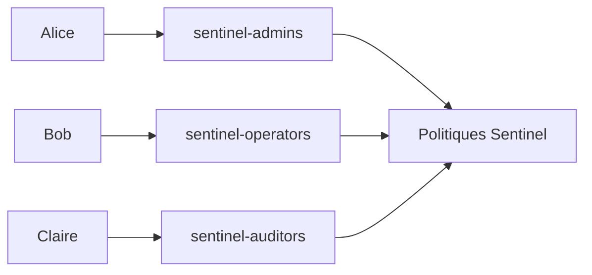

Cette séparation permettra :

- de simplifier les changements de fonction ;
- d'éviter les règles individuelles ;
- de faciliter les audits ;
- de centraliser les responsabilités.

---

## Synthèse

- Un utilisateur FreeIPA possède une identité unique dans tout le domaine.
- La commande `ipa user-add` crée une entrée cohérente pour LDAP, Kerberos et les attributs Unix.
- FreeIPA attribue notamment un UID, un GID, un principal Kerberos et un répertoire personnel théorique.
- Le répertoire personnel doit être créé sur les clients ; FreeIPA ne le crée pas directement.
- Le mot de passe initial est généralement temporaire et doit être remplacé par l'utilisateur.
- Un compte peut être désactivé sans être supprimé.
- Une suppression d'identité ne supprime pas automatiquement ses fichiers sur les clients.
- Les clés publiques SSH peuvent être stockées dans FreeIPA, mais jamais les clés privées.
- Les privilèges doivent être accordés par l'intermédiaire de groupes plutôt que directement aux utilisateurs.
- Le cycle de vie de l'identité doit être défini avant l'industrialisation des créations.

---

## Infographie de révision

```text
                  GESTION D'UN UTILISATEUR FREEIPA

                           DEMANDE MÉTIER
                                  |
                                  v
                          Validation du besoin
                                  |
                                  v
                         ipa user-add alice
                                  |
        +-------------------------+-------------------------+
        |                         |                         |
        v                         v                         v
   Entrée LDAP             Principal Kerberos         Attributs Unix
   Nom / prénom            alice@REALM                UID / GID
   Email / téléphone       Authentification           Home / Shell
        |                         |                         |
        +-------------------------+-------------------------+
                                  |
                                  v
                     Mot de passe temporaire
                                  |
                                  v
                       Première authentification
                                  |
                                  v
                     Changement du mot de passe
                                  |
                                  v
                            Compte actif

──────────────────────────────────────────────────────────────────────────────

                     CYCLE DE VIE DE L'IDENTITÉ

       Création
          |
          v
       Activation
          |
          v
       Utilisation
          |
          +-----------------------+
          |                       |
          v                       v
     Modification             Suspension
          |                       |
          +-----------+-----------+
                      |
                      v
                  Réactivation
                      |
                      v
                    Départ
                      |
          +-----------+-----------+
          |                       |
          v                       v
      Conservation            Suppression
      temporaire              définitive

──────────────────────────────────────────────────────────────────────────────

                  RÉSOLUTION SUR UN CLIENT LINUX

                  id alice
                      |
                      v
                     NSS
                      |
                      v
                    SSSD
                      |
                      v
                   FreeIPA
                      |
                      v
          UID / GID / groupes / shell / home

──────────────────────────────────────────────────────────────────────────────

                  PRINCIPE D'ADMINISTRATION

        L'utilisateur représente une personne.

        Le groupe représente une fonction.

        La politique représente un privilège.

        Les droits ne doivent pas être attribués
        individuellement sans nécessité.
```

## Pour aller plus loin

Nous savons désormais créer une identité.

Mais une infrastructure ne peut pas être administrée efficacement en attribuant les droits utilisateur par utilisateur.

L'entreprise ne raisonne pas ainsi.

Elle raisonne en fonctions.

Par exemple :

- administrateur système ;
- opérateur Sentinel ;
- auditeur ;
- responsable de sauvegarde ;
- administrateur FreeIPA.

FreeIPA permet de représenter ces fonctions grâce aux groupes.

Il permet également de déléguer certaines opérations administratives sans donner tous les privilèges du compte `admin`.

Dans le prochain chapitre, nous étudierons :

- les groupes d'utilisateurs ;
- les groupes d'hôtes ;
- les groupes imbriqués ;
- les rôles ;
- les privilèges ;
- les permissions FreeIPA.

Nous construirons ainsi une véritable organisation des responsabilités autour de Sentinel.

---

← [8.3 — Installation de FreeIPA](8.3-installation-freeipa.md) · [8.5 — Groupes et rôles](8.5-groupes-roles.md) →
