# 8.5 Groupes et rôles

> *« Une bonne politique d'accès ne suit pas les personnes. Elle suit les responsabilités qu'elles exercent. »*

---

## Vous êtes ici

```text
PARTIE II — Industrialiser la sécurité

Campagne 8  [█████░░░░░]

      8.1 Présentation de FreeIPA ✔
      8.2 Architecture interne ✔
      8.3 Installation ✔
      8.4 Gestion des utilisateurs ✔
   ►  8.5 Groupes et rôles
      8.6 Politiques sudo
      8.7 Gestion des hôtes
      8.8 Certificats
      8.9 Intégration de Sentinel
      8.10 Mission : administrer une infrastructure avec FreeIPA
```

---

## Objectifs pédagogiques

À la fin de ce chapitre, vous serez capable de :

* comprendre pourquoi les groupes constituent la base d'une administration centralisée ;
* distinguer les groupes d'utilisateurs, les groupes d'hôtes et les groupes privés ;
* créer et administrer des groupes FreeIPA ;
* utiliser les groupes imbriqués ;
* comprendre la différence entre permissions, privilèges et rôles ;
* déléguer des tâches administratives sans partager le compte `admin` ;
* construire une organisation des responsabilités adaptée à Sentinel.

---

## Pourquoi ce chapitre existe

Nous savons désormais créer des utilisateurs dans FreeIPA.

Nous pourrions maintenant attribuer des droits directement à chacun.

Par exemple :

```text
Alice peut administrer Sentinel.

Bob peut redémarrer Sentinel.

Claire peut consulter les journaux.
```

Cette approche fonctionne pour trois personnes.

Mais elle devient rapidement ingérable.

Imaginons une entreprise de cinq cents utilisateurs.

Chaque arrivée nécessite la création de plusieurs règles.

Chaque changement de fonction nécessite leur modification.

Chaque départ nécessite une recherche complète de toutes les autorisations attribuées.

Le risque d'oubli devient très important.

Une organisation moderne ne raisonne donc pas uniquement en personnes.

Elle raisonne en responsabilités.

```text
Administrateur Sentinel

Opérateur Sentinel

Auditeur Sentinel

Administrateur FreeIPA
```

Les utilisateurs rejoignent ces fonctions.

Les droits sont associés aux fonctions.

FreeIPA représente ces fonctions grâce aux **groupes** et aux **rôles**.

---

# Attribuer des droits à une fonction

Prenons l'exemple d'Alice.

Alice est actuellement administratrice de Sentinel.

Elle appartient donc au groupe :

```text
sentinel-admins
```

Quelques mois plus tard, elle rejoint une autre équipe.

Elle n'administre plus Sentinel.

Il suffit de la retirer du groupe.

Les politiques associées au groupe restent inchangées.

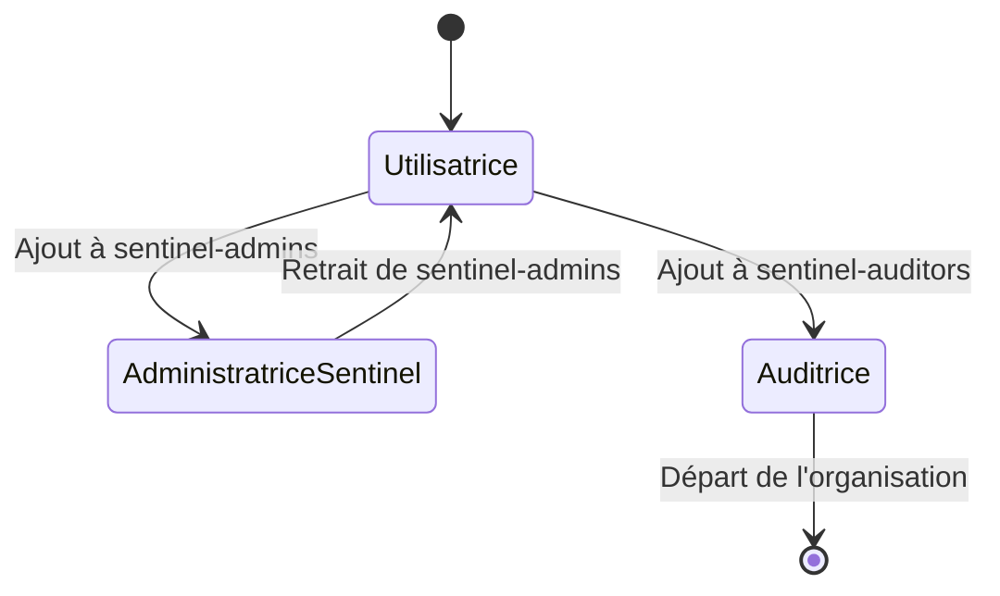

Le groupe survit aux changements de personnes.

Il représente une fonction stable de l'organisation.

---

# Les groupes dans FreeIPA

Un groupe FreeIPA rassemble plusieurs identités.

Il peut contenir :

* des utilisateurs ;
* d'autres groupes ;
* selon le type d'objet, des identités externes.

Le groupe peut ensuite être utilisé dans différentes politiques.

Par exemple :

* les règles `sudo` ;
* les règles d'accès aux hôtes ;
* les permissions administratives ;
* certaines applications ;
* les règles HBAC.

On peut représenter cette relation ainsi.

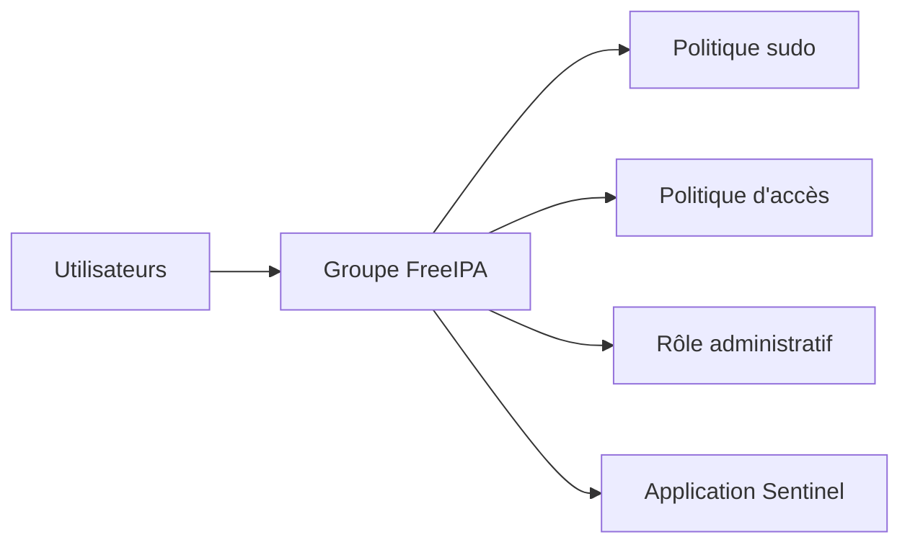

Le groupe devient donc un point central de la politique d'autorisation.

---

# Groupe d'utilisateurs et groupe d'hôtes

FreeIPA distingue plusieurs familles de groupes.

Les deux principales sont :

* les groupes d'utilisateurs ;
* les groupes d'hôtes.

Un groupe d'utilisateurs rassemble des personnes.

Par exemple :

```text
sentinel-admins
```

Un groupe d'hôtes rassemble des machines.

Par exemple :

```text
sentinel-servers
```

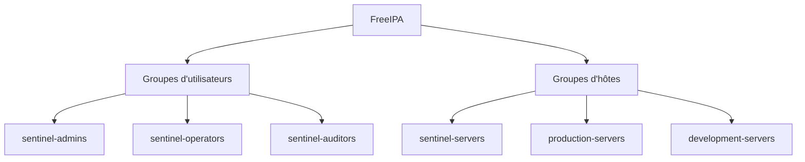

Cette séparation permet de construire des règles très précises.

Par exemple :

> Les membres de `sentinel-operators` peuvent se connecter uniquement aux machines appartenant à `sentinel-servers`.

Nous étudierons ce type de règle plus en détail avec les politiques d'accès aux hôtes.

---

# Créer un groupe d'utilisateurs

Commençons par créer le groupe des administrateurs Sentinel.

Obtenez un ticket administrateur.

```bash
kinit admin
```

Créez le groupe.

```bash
ipa group-add sentinel-admins \
    --desc="Administrateurs de la plateforme Sentinel"
```

La commande retourne les informations principales.

```text
Added group "sentinel-admins"

Group name: sentinel-admins
Description: Administrateurs de la plateforme Sentinel
GID: ...
```

FreeIPA peut attribuer automatiquement un GID au groupe.

Vérifiez le résultat.

```bash
ipa group-show sentinel-admins
```

---

# Ajouter un utilisateur à un groupe

Ajoutons Alice.

```bash
ipa group-add-member sentinel-admins \
    --users=alice
```

Vérifiez ensuite :

```bash
ipa group-show sentinel-admins
```

La sortie doit contenir :

```text
Member users: alice
```

On peut également examiner les groupes d'Alice.

```bash
ipa user-show alice --all
```

Puis, sur un client intégré :

```bash
id alice
```

Le groupe FreeIPA doit apparaître dans la liste de ses groupes secondaires.

---

# Ajouter plusieurs utilisateurs

Une seule commande peut ajouter plusieurs membres.

```bash
ipa group-add-member sentinel-admins \
    --users=alice \
    --users=bob \
    --users=charlie
```

Selon le shell et la version de la commande, une liste séparée par des virgules peut également être acceptée pour certaines options.

Une écriture explicite reste souvent plus lisible dans les scripts.

Pour une automatisation à grande échelle, Ansible sera préférable à une succession de commandes manuelles.

---

# Retirer un utilisateur

Pour retirer Alice du groupe :

```bash
ipa group-remove-member sentinel-admins \
    --users=alice
```

La suppression du membre ne supprime pas l'utilisateur.

Elle retire uniquement la relation entre Alice et le groupe.

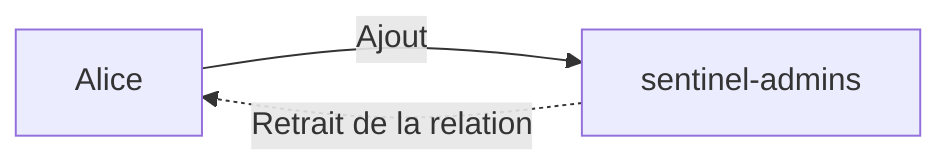

Les autres attributs de l'identité restent inchangés.

---

# Supprimer un groupe

Pour supprimer un groupe :

```bash
ipa group-del sentinel-admins
```

Cette opération ne supprime pas les utilisateurs membres.

Elle supprime uniquement le groupe et les relations associées.

Cependant, toutes les politiques qui utilisaient ce groupe peuvent être affectées.

Avant une suppression, il faut donc rechercher :

* les règles `sudo` qui le référencent ;
* les rôles administratifs ;
* les règles HBAC ;
* les règles applicatives ;
* les groupes qui l'incluent.

Une suppression de groupe est une opération de politique de sécurité.

Pas une simple opération de nettoyage.

---

# Les groupes POSIX

Un groupe FreeIPA peut être un groupe POSIX.

Cela signifie qu'il possède un GID utilisable par les systèmes Linux.

Par exemple :

```text
sentinel-admins

GID : 120045
```

Les clients peuvent alors utiliser ce groupe pour :

* les permissions UNIX ;
* les propriétaires de fichiers ;
* les ACL ;
* les processus ;
* les règles `sudo`.

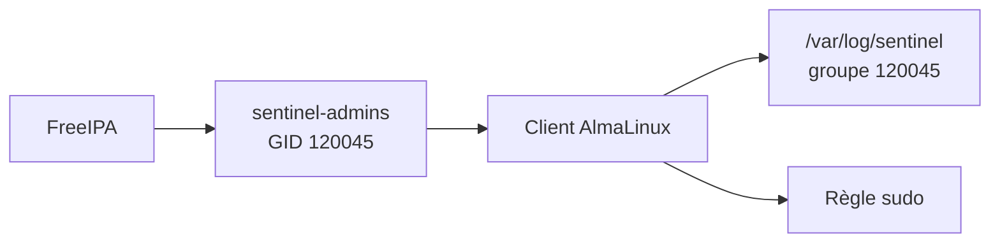

Le GID permet au noyau Linux d'utiliser le groupe comme une identité Unix classique.

---

# Les groupes non-POSIX

Tous les groupes FreeIPA n'ont pas nécessairement besoin d'un GID.

Un groupe peut être utilisé uniquement pour :

* une délégation administrative ;
* l'organisation logique ;
* certains contrôles internes à FreeIPA.

Dans ce cas, il peut être non-POSIX.

Il ne sera pas directement utilisable comme groupe propriétaire d'un fichier Linux.

Cette distinction permet d'éviter d'attribuer inutilement des identifiants Unix à des groupes purement administratifs.

| Groupe POSIX                       | Groupe non-POSIX                             |
| ---------------------------------- | -------------------------------------------- |
| Possède un GID                     | Ne possède pas nécessairement de GID         |
| Visible comme groupe Unix          | Principalement logique ou administratif      |
| Utilisable pour les permissions    | Utilisable dans certaines politiques FreeIPA |
| Résolu par NSS selon configuration | Pas nécessairement exposé comme groupe Unix  |

Le type de groupe doit être choisi selon son usage réel.

---

# Créer explicitement un groupe non-POSIX

Un groupe non-POSIX peut être créé avec une option adaptée.

Par exemple :

```bash
ipa group-add ipa-helpdesk \
    --nonposix \
    --desc="Équipe de support des identités"
```

Ce groupe pourra être utilisé pour regrouper les personnes chargées de certaines tâches administratives.

Il n'a pas besoin de devenir propriétaire de fichiers sur les clients Linux.

---

# Les groupes privés des utilisateurs

Nous avons vu que FreeIPA peut créer un groupe privé pour chaque utilisateur.

Par exemple :

```text
Utilisateur : alice

Groupe privé : alice
```

Ce groupe possède généralement le même nom que l'utilisateur.

Il sert de groupe principal.

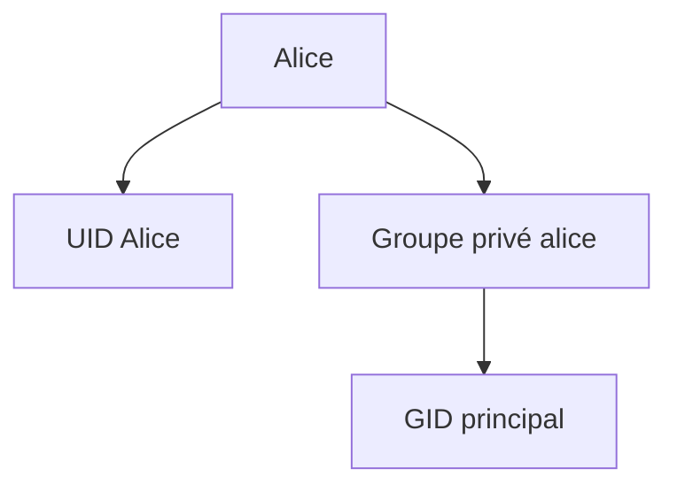

Le groupe privé ne représente pas une équipe.

Il représente l'environnement Unix personnel de l'utilisateur.

Il ne doit pas être confondu avec un groupe fonctionnel comme :

```text
sentinel-admins
```

---

# Groupes fonctionnels et groupes techniques

Une architecture mature distingue plusieurs types de groupes.

Par exemple :

| Type                 | Exemple             | Usage                             |
| -------------------- | ------------------- | --------------------------------- |
| Groupe privé         | `alice`             | Groupe principal de l'utilisateur |
| Groupe métier        | `sentinel-auditors` | Fonction dans l'organisation      |
| Groupe technique     | `journal-readers`   | Accès à une ressource technique   |
| Groupe administratif | `ipa-helpdesk`      | Délégation dans FreeIPA           |
| Groupe de projet     | `project-phoenix`   | Collaboration temporaire          |

Cette classification améliore la lisibilité.

Un nom de groupe doit permettre de comprendre immédiatement son objectif.

---

# Convention de nommage

Une convention cohérente évite la création de groupes difficiles à interpréter.

Par exemple :

```text
sentinel-admins

sentinel-operators

sentinel-auditors

ipa-helpdesk

linux-platform-admins
```

Une mauvaise convention produirait des noms comme :

```text
grp1

admins2

test-final

equipe-nouvelle
```

Ces noms deviennent rapidement incompréhensibles.

Une convention peut s'appuyer sur la structure suivante.

```text
<périmètre>-<fonction>
```

Par exemple :

```text
sentinel-admins
```

Ou :

```text
<application>-<environnement>-<fonction>
```

Par exemple :

```text
sentinel-prod-operators
```

La précision doit rester équilibrée.

Un nom excessivement long devient lui aussi difficile à utiliser.

---

# Les groupes imbriqués

FreeIPA permet d'ajouter un groupe dans un autre groupe.

On parle de groupe imbriqué.

Prenons les groupes suivants.

```text
sentinel-admins

linux-platform-admins
```

Nous souhaitons que tous les administrateurs de la plateforme Linux soient également considérés comme administrateurs Sentinel.

Il est possible d'ajouter le groupe :

```text
linux-platform-admins
```

dans :

```text
sentinel-admins
```

```bash
ipa group-add-member sentinel-admins \
    --groups=linux-platform-admins
```

Le résultat peut être représenté ainsi.

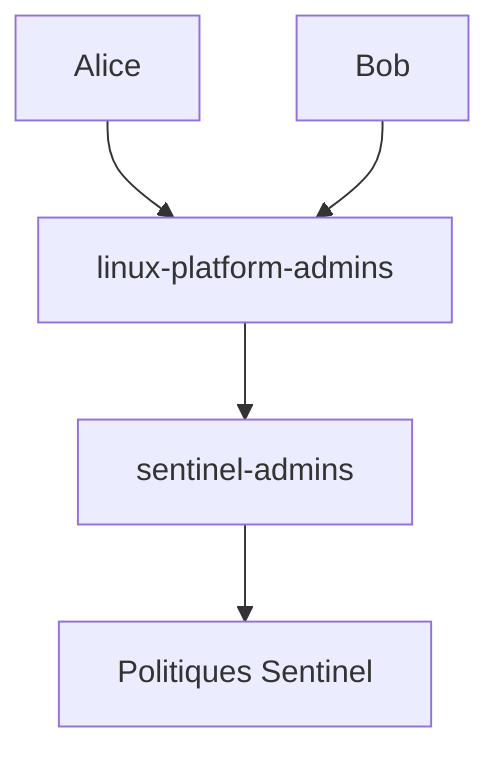

Alice et Bob bénéficient indirectement des politiques associées à `sentinel-admins`.

---

# Pourquoi imbriquer les groupes ?

Les groupes imbriqués permettent de représenter la structure de l'organisation.

Par exemple :

```text
Équipe Linux

↓

Administrateurs plateforme

↓

Administrateurs Sentinel
```

Ils évitent d'ajouter les mêmes utilisateurs dans de nombreux groupes.

Ils facilitent également les changements d'organisation.

Cependant, ils augmentent la complexité du diagnostic.

Lorsqu'un utilisateur reçoit un droit, il peut être membre :

* directement ;
* par l'intermédiaire d'un groupe ;
* par plusieurs niveaux d'imbrication.

---

## 💎 Le point d'expertise

Les groupes imbriqués doivent rester lisibles.

Une profondeur excessive produit des politiques difficiles à auditer.

Imaginons :

```text
Alice

↓

groupe A

↓

groupe B

↓

groupe C

↓

groupe D

↓

règle sudo
```

La règle fonctionne.

Mais il devient difficile de répondre rapidement à la question :

> Pourquoi Alice possède-t-elle ce privilège ?

Une bonne architecture limite le nombre de niveaux d'imbrication.

Elle documente également les relations entre groupes.

La possibilité technique d'imbriquer les groupes ne signifie pas qu'il faut construire une hiérarchie profonde.

---

# Vérifier les appartenances indirectes

Pour afficher les informations détaillées d'un utilisateur :

```bash
ipa user-show alice --all
```

Pour afficher un groupe :

```bash
ipa group-show sentinel-admins --all
```

La sortie peut distinguer :

* les membres directs ;
* les groupes membres ;
* les appartenances indirectes.

Sur un client, la commande :

```bash
id alice
```

permet d'observer les groupes Unix finalement calculés.

Cette commande répond à une question opérationnelle importante :

> Quels groupes le système client associe-t-il réellement à Alice ?

---

# Le cache SSSD

Lorsqu'une appartenance à un groupe est modifiée, le changement peut ne pas apparaître immédiatement sur un client.

Pourquoi ?

Parce que SSSD utilise un cache.

Le cache améliore :

* les performances ;
* la disponibilité ;
* le fonctionnement hors ligne.

Mais il peut retarder la visibilité d'une modification.

Dans un laboratoire, le cache peut être invalidé avec prudence.

```bash
sudo sss_cache -E
```

Puis :

```bash
id alice
```

Il est également possible qu'une nouvelle session soit nécessaire pour que les groupes soient associés aux processus de l'utilisateur.

Le cache SSSD et les groupes déjà chargés dans une session sont deux mécanismes distincts.

---

# Groupes chargés dans une session

Lorsqu'Alice ouvre une session, le système initialise la liste de ses groupes.

Si elle est ajoutée ensuite à :

```text
sentinel-admins
```

les processus déjà lancés peuvent continuer à utiliser l'ancienne liste.

Il faut alors :

* fermer la session ;
* ouvrir une nouvelle session ;
* ou utiliser un mécanisme adapté pour obtenir un nouveau contexte.

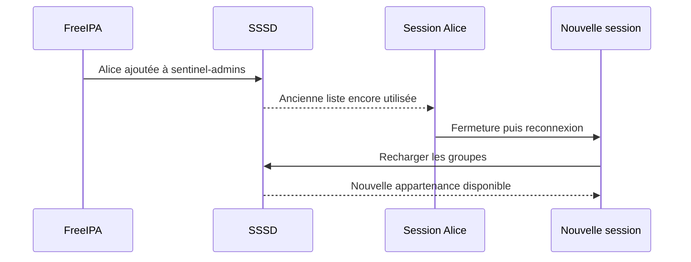

Ce comportement est identique au principe étudié avec les groupes locaux.

---

# Les groupes d'hôtes

Un groupe d'hôtes rassemble plusieurs machines enregistrées dans FreeIPA.

Créons un groupe pour les serveurs Sentinel.

```bash
ipa hostgroup-add sentinel-servers \
    --desc="Serveurs hébergeant l'application Sentinel"
```

Plus tard, nous ajouterons :

```text
sentinel01.lab.sentinel.test
```

à ce groupe.

```bash
ipa hostgroup-add-member sentinel-servers \
    --hosts=sentinel01.lab.sentinel.test
```

Les groupes d'hôtes seront particulièrement utiles pour :

* les politiques HBAC ;
* les règles `sudo` ;
* l'organisation du parc ;
* les politiques applicables à un environnement.

---

# Groupes d'hôtes par environnement

Il est souvent utile de distinguer les environnements.

Par exemple :

```text
sentinel-dev-servers

sentinel-test-servers

sentinel-prod-servers
```

Cette séparation permet de créer des politiques différentes.

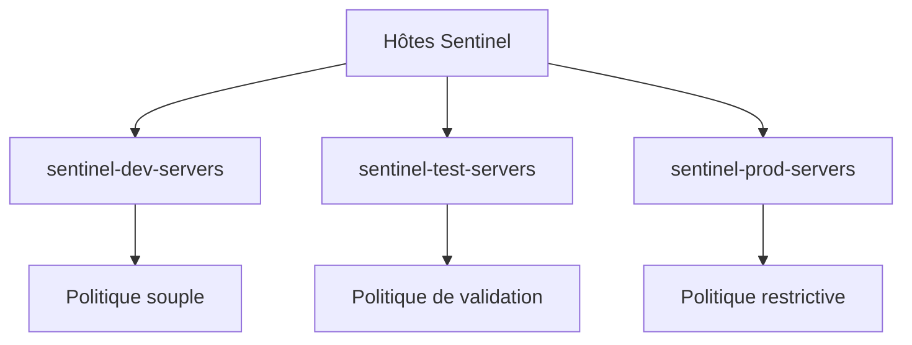

Un développeur peut être autorisé sur l'environnement de développement.

Mais pas sur la production.

La politique est alors exprimée par les groupes.

Pas par une liste de serveurs dans chaque règle.

---

# Groupes d'hôtes imbriqués

Les groupes d'hôtes peuvent également être imbriqués.

Par exemple :

```text
sentinel-prod-servers
```

peut appartenir à :

```text
production-linux-servers
```

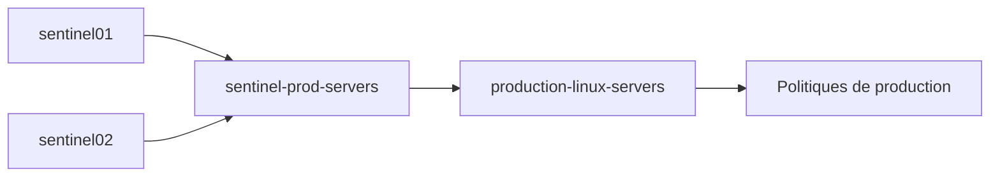

Cette organisation permet d'appliquer :

* des règles générales à toute la production ;
* des règles spécifiques à Sentinel.

Là encore, l'imbrication doit rester simple et documentée.

---

# Groupes et politiques HBAC

FreeIPA dispose d'un mécanisme nommé :

**HBAC**, pour *Host-Based Access Control*.

Une règle HBAC peut répondre à une question comme :

> Quels utilisateurs peuvent accéder à quels services sur quels hôtes ?

Elle peut utiliser :

* un groupe d'utilisateurs ;
* un groupe d'hôtes ;
* un service PAM.

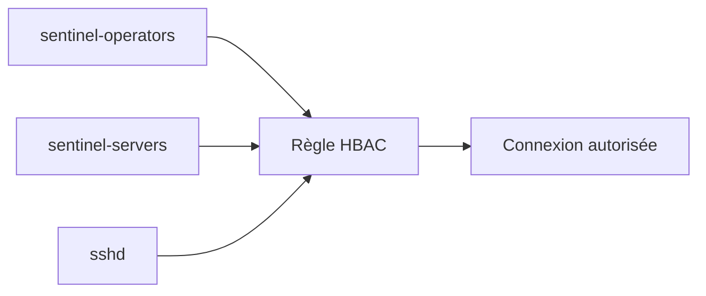

Les groupes deviennent donc les briques de base d'une politique d'accès centralisée.

Les règles HBAC seront approfondies lors de l'intégration des hôtes.

---

# Groupes et politiques `sudo`

Le même principe s'applique à `sudo`.

Une règle peut cibler :

* un groupe d'utilisateurs ;
* un groupe d'hôtes ;
* un ensemble de commandes.

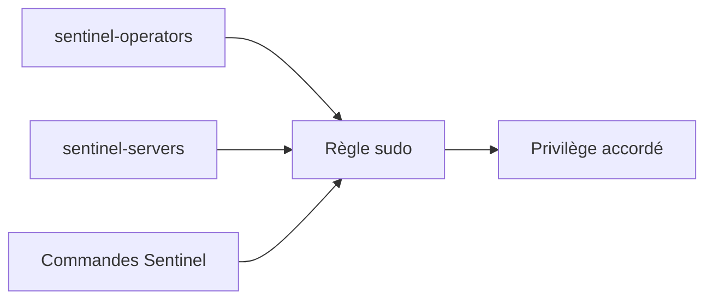

Au lieu de créer une règle différente pour chaque utilisateur et chaque serveur, on construit une politique modulaire.

Ce sera précisément l'objet du chapitre suivant.

---

# Les rôles administratifs

Les groupes permettent principalement de rassembler des identités.

Les rôles FreeIPA vont plus loin.

Ils servent à déléguer des responsabilités d'administration de FreeIPA.

Prenons un exemple.

L'équipe de support doit pouvoir :

* réinitialiser un mot de passe ;
* débloquer un compte ;
* modifier certains attributs.

Elle ne doit pas pouvoir :

* administrer l'autorité de certification ;
* modifier les serveurs ;
* supprimer les administrateurs ;
* changer les politiques Kerberos globales.

Il serait dangereux de lui transmettre le compte :

```text
admin
```

FreeIPA permet de créer un rôle limité.

---

# Permission, privilège et rôle

FreeIPA utilise trois niveaux principaux pour organiser la délégation.

```text
Permission

↓

Privilège

↓

Rôle
```

Ces trois notions sont différentes.

Une **permission** décrit une opération élémentaire.

Par exemple :

```text
Modifier le numéro de téléphone d'un utilisateur
```

Un **privilège** regroupe plusieurs permissions cohérentes.

Par exemple :

```text
Administrer les attributs de base des utilisateurs
```

Un **rôle** regroupe plusieurs privilèges et les attribue à des utilisateurs ou des groupes.

Par exemple :

```text
Support identités
```

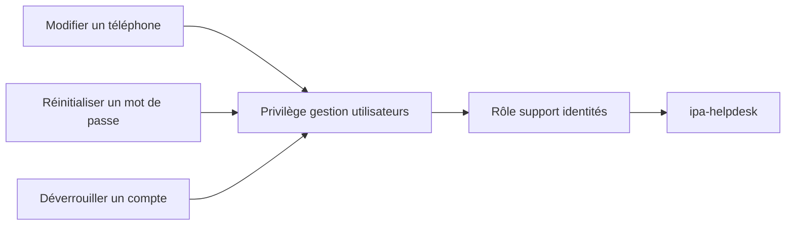

Cette organisation permet une délégation très précise.

---

# Les permissions FreeIPA

Une permission décrit ce qui peut être fait dans l'annuaire.

Elle peut définir :

* le type d'objet ciblé ;
* les attributs modifiables ;
* les opérations autorisées ;
* le périmètre de recherche.

Par exemple :

```text
Lire les utilisateurs

Modifier les numéros de téléphone

Ajouter une clé SSH

Réinitialiser un mot de passe
```

Les permissions de bas niveau sont puissantes.

Elles doivent être conçues avec prudence.

Une permission trop large peut permettre de modifier davantage d'attributs que prévu.

---

# Les privilèges FreeIPA

Un privilège rassemble plusieurs permissions.

Par exemple, un privilège nommé :

```text
Gestion courante des utilisateurs
```

pourrait regrouper :

* lecture des utilisateurs ;
* modification du téléphone ;
* modification de l'adresse électronique ;
* réinitialisation du mot de passe.

Le privilège décrit une capacité administrative cohérente.

Il évite d'attribuer directement des permissions individuelles à chaque rôle.

---

# Les rôles FreeIPA

Le rôle est l'objet attribué aux administrateurs ou à leurs groupes.

Par exemple :

```text
Helpdesk Sentinel
```

Le rôle peut contenir plusieurs privilèges.

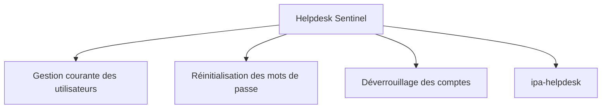

Les membres du rôle obtiennent les capacités administratives correspondantes.

Ils n'obtiennent pas automatiquement tous les droits du compte `admin`.

---

# Pourquoi trois niveaux ?

Cette architecture peut sembler complexe.

Pourquoi ne pas attribuer directement des permissions à un groupe ?

Parce que les trois niveaux répondent à trois besoins différents.

| Niveau     | Question                                                 |
| ---------- | -------------------------------------------------------- |
| Permission | Quelle opération technique est autorisée ?               |
| Privilège  | Quel ensemble cohérent d'opérations forme une capacité ? |
| Rôle       | Qui reçoit cette capacité administrative ?               |

Cette séparation améliore :

* la réutilisation ;
* la lisibilité ;
* la maintenance ;
* l'audit.

---

# Les rôles intégrés

FreeIPA fournit déjà plusieurs rôles, privilèges et permissions.

Il n'est pas toujours nécessaire de tout recréer.

Affichez les rôles disponibles.

```bash
ipa role-find
```

Affichez un rôle particulier.

```bash
ipa role-show "User Administrator"
```

Le nom exact des rôles disponibles peut varier selon la version et la langue de l'interface.

Consultez également les privilèges.

```bash
ipa privilege-find
```

Puis les permissions.

```bash
ipa permission-find
```

Avant de créer une nouvelle délégation, il faut vérifier si une structure existante répond déjà au besoin.

---

# Créer un rôle personnalisé

Supposons que nous souhaitions créer un rôle :

```text
Sentinel Identity Helpdesk
```

Créons-le.

```bash
ipa role-add "Sentinel Identity Helpdesk" \
    --desc="Support de premier niveau pour les identités Sentinel"
```

Ajoutons ensuite un groupe membre.

```bash
ipa role-add-member "Sentinel Identity Helpdesk" \
    --groups=ipa-helpdesk
```

Le rôle existe maintenant.

Mais il ne possède encore aucun privilège.

Il faudra lui attribuer uniquement les privilèges nécessaires.

---

# Ajouter un privilège à un rôle

Si un privilège existant correspond au besoin :

```bash
ipa role-add-privilege "Sentinel Identity Helpdesk" \
    --privileges="User Administrators"
```

Cette commande est uniquement un exemple de syntaxe.

Avant de l'utiliser dans un environnement réel, examinez précisément le contenu du privilège.

```bash
ipa privilege-show "User Administrators" --all
```

Un privilège portant un nom rassurant peut contenir davantage d'autorisations que prévu.

La délégation doit être fondée sur le contenu réel.

Pas uniquement sur le nom.

---

## 💎 Le point d'expertise

Une délégation FreeIPA doit être testée avec un compte représentatif.

Il ne suffit pas d'examiner la configuration depuis le compte `admin`.

Une procédure correcte consiste à :

1. créer le rôle ;
2. attribuer les privilèges ;
3. ajouter un compte de test ;
4. obtenir un ticket avec ce compte ;
5. vérifier les opérations autorisées ;
6. vérifier également que les opérations interdites échouent.

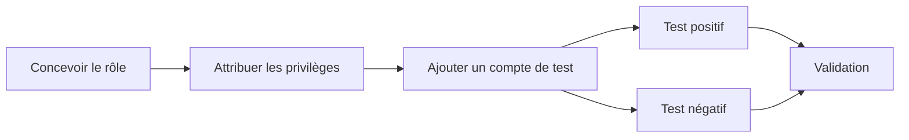

Un test uniquement positif est insuffisant.

Il faut prouver que le rôle ne peut pas sortir de son périmètre.

---

## 🧠 Comment pense un architecte ?

Un architecte distingue clairement deux dimensions.

La première :

> Que peut faire un utilisateur sur les serveurs ?

Cette réponse repose notamment sur :

* les groupes ;
* HBAC ;
* `sudo` ;
* les permissions Unix.

La seconde :

> Que peut administrer cette personne dans FreeIPA ?

Cette réponse repose sur :

* les rôles ;
* les privilèges ;
* les permissions FreeIPA.

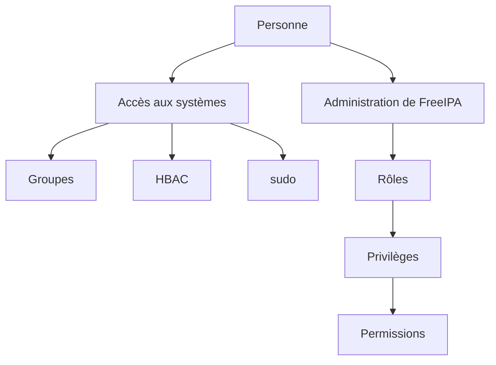

Ces deux dimensions ne doivent pas être confondues.

Être administrateur de Sentinel ne signifie pas nécessairement être administrateur de FreeIPA.

---

## ⚔️ Comment pense un attaquant ?

Un attaquant cherche les groupes et les rôles qui lui permettent d'élargir ses droits.

Il s'intéresse notamment :

* aux groupes imbriqués ;
* aux groupes administratifs ;
* aux rôles trop larges ;
* aux permissions permettant de modifier des membres ;
* aux délégations permettant de réinitialiser un mot de passe privilégié.

Une autorisation apparemment limitée peut parfois permettre une escalade.

Par exemple :

> Pouvoir ajouter un utilisateur à un groupe administrateur revient indirectement à devenir administrateur.


Il faut donc protéger non seulement les privilèges eux-mêmes.

Il faut également protéger les objets qui permettent de les attribuer.

---

## 📚 Culture technique

La gestion des rôles porte souvent le nom :

**RBAC**, pour *Role-Based Access Control*.

Le principe est simple.

Les permissions sont associées à des rôles.

Les utilisateurs reçoivent ensuite ces rôles.

```text
Utilisateur

↓

Rôle

↓

Permissions
```

Cette approche est utilisée dans de nombreux domaines :

* les systèmes d'exploitation ;
* les bases de données ;
* Kubernetes ;
* les plateformes cloud ;
* les applications métier ;
* les annuaires d'entreprise.

FreeIPA applique ce principe à l'administration de son propre domaine.

---

## ⚠️ Piège classique

Un piège fréquent consiste à créer un groupe unique nommé :

```text
admins
```

Puis à l'utiliser pour tout.

Ses membres deviennent progressivement capables :

* d'administrer les serveurs ;
* de gérer FreeIPA ;
* de modifier Sentinel ;
* de lire les journaux ;
* de gérer les certificats.

Le groupe perd toute signification précise.

Une bonne architecture sépare les responsabilités.

Par exemple :

```text
linux-platform-admins

ipa-user-admins

ipa-ca-admins

sentinel-admins

sentinel-operators

sentinel-auditors
```

La séparation augmente le nombre de groupes.

Mais elle réduit considérablement le nombre de privilèges excessifs.

---

# Laboratoire AlmaLinux

## Mission

Construire la structure de groupes et de délégation de Sentinel.

Les groupes suivants seront créés :

```text
sentinel-admins

sentinel-operators

sentinel-auditors

ipa-helpdesk
```

Un groupe d'hôtes sera également créé :

```text
sentinel-servers
```

---

## Étape 1 — Obtenir un ticket administrateur

```bash
kinit admin
```

Vérifiez :

```bash
klist
```

---

## Étape 2 — Créer les groupes Sentinel

```bash
ipa group-add sentinel-admins \
    --desc="Administrateurs de Sentinel"
```

```bash
ipa group-add sentinel-operators \
    --desc="Opérateurs d'exploitation de Sentinel"
```

```bash
ipa group-add sentinel-auditors \
    --desc="Auditeurs de Sentinel"
```

Créez le groupe administratif non-POSIX.

```bash
ipa group-add ipa-helpdesk \
    --nonposix \
    --desc="Support de premier niveau FreeIPA"
```

---

## Étape 3 — Créer les utilisateurs de laboratoire

Si Bob et Claire n'existent pas encore :

```bash
ipa user-add bob \
    --first=Bob \
    --last=Durand \
    --email=bob@lab.sentinel.test \
    --shell=/bin/bash
```

```bash
ipa user-add claire \
    --first=Claire \
    --last=Bernard \
    --email=claire@lab.sentinel.test \
    --shell=/bin/bash
```

Définissez des mots de passe temporaires si nécessaire.

```bash
ipa passwd bob
```

```bash
ipa passwd claire
```

---

## Étape 4 — Ajouter les membres

Alice devient administratrice Sentinel.

```bash
ipa group-add-member sentinel-admins \
    --users=alice
```

Bob devient opérateur.

```bash
ipa group-add-member sentinel-operators \
    --users=bob
```

Claire devient auditrice.

```bash
ipa group-add-member sentinel-auditors \
    --users=claire
```

Alice rejoint également le support FreeIPA pour les besoins du laboratoire.

```bash
ipa group-add-member ipa-helpdesk \
    --users=alice
```

---

## Étape 5 — Vérifier les groupes

```bash
ipa group-show sentinel-admins
```

```bash
ipa group-show sentinel-operators
```

```bash
ipa group-show sentinel-auditors
```

```bash
ipa group-show ipa-helpdesk
```

Vérifiez également les utilisateurs.

```bash
ipa user-show alice --all
```

```bash
ipa user-show bob --all
```

```bash
ipa user-show claire --all
```

---

## Étape 6 — Créer le groupe d'hôtes

```bash
ipa hostgroup-add sentinel-servers \
    --desc="Serveurs hébergeant Sentinel"
```

Vérifiez :

```bash
ipa hostgroup-show sentinel-servers
```

L'hôte Sentinel sera ajouté après son enrôlement dans le domaine.

---

## Étape 7 — Observer les rôles existants

```bash
ipa role-find
```

Puis :

```bash
ipa privilege-find
```

Enfin :

```bash
ipa permission-find --sizelimit=20
```

Choisissez un rôle existant.

Affichez son contenu.

```bash
ipa role-show "User Administrator" --all
```

Adaptez le nom si ce rôle n'existe pas sous cette forme dans votre version.

---

## Étape 8 — Créer un rôle de laboratoire

```bash
ipa role-add "Sentinel Identity Helpdesk" \
    --desc="Support limité des identités utilisées par Sentinel"
```

Ajoutez le groupe `ipa-helpdesk`.

```bash
ipa role-add-member "Sentinel Identity Helpdesk" \
    --groups=ipa-helpdesk
```

Vérifiez :

```bash
ipa role-show "Sentinel Identity Helpdesk" --all
```

À ce stade, le rôle ne doit recevoir aucun privilège excessif.

L'attribution fine sera préparée dans la mission d'ingénieur.

---

## Étape 9 — Tester la résolution des groupes

Sur le serveur FreeIPA ou sur un client intégré :

```bash
id alice
```

```bash
id bob
```

```bash
id claire
```

Si les groupes n'apparaissent pas immédiatement :

```bash
sudo sss_cache -E
```

Puis recommencez.

Une nouvelle session peut également être nécessaire.

---

## Étape 10 — Documenter les responsabilités

Complétez le tableau suivant.

| Groupe               | Membres      | Fonction                   | Droits futurs                           |
| -------------------- | ------------ | -------------------------- | --------------------------------------- |
| `sentinel-admins`    | Alice        | Administration de Sentinel | Configuration, redémarrage, maintenance |
| `sentinel-operators` | Bob          | Exploitation               | État, redémarrage contrôlé              |
| `sentinel-auditors`  | Claire       | Audit                      | Lecture des journaux et rapports        |
| `ipa-helpdesk`       | Alice        | Support d'identité         | Opérations limitées à définir           |
| `sentinel-servers`   | Futurs hôtes | Périmètre machine          | Cible des politiques                    |

---

# Mission d'ingénieur

Construisez un modèle RBAC pour Sentinel.

Le modèle doit distinguer au minimum :

```text
Administration de l'application

Exploitation quotidienne

Audit

Administration de l'infrastructure FreeIPA

Gestion des certificats
```

Pour chaque fonction, documentez :

* le groupe associé ;
* les utilisateurs concernés ;
* les hôtes concernés ;
* les commandes nécessaires ;
* les données accessibles ;
* les opérations explicitement interdites.

Utilisez le tableau suivant.

| Fonction                | Groupe               | Ressources           | Autorisations                         | Interdictions             |
| ----------------------- | -------------------- | -------------------- | ------------------------------------- | ------------------------- |
| Administration Sentinel | `sentinel-admins`    | Serveurs Sentinel    | Modifier la configuration, redémarrer | Administrer FreeIPA       |
| Exploitation            | `sentinel-operators` | Serveurs Sentinel    | Consulter l'état, redémarrer          | Modifier les secrets      |
| Audit                   | `sentinel-auditors`  | Journaux Sentinel    | Lire et exporter                      | Modifier ou supprimer     |
| Support identité        | `ipa-helpdesk`       | Utilisateurs ciblés  | Réinitialiser certains accès          | Gérer les administrateurs |
| Gestion PKI             | À définir            | Certificats Sentinel | Délivrer ou révoquer                  | Modifier les identités    |

Pour chaque autorisation, posez la question :

> Cette fonction a-t-elle réellement besoin de ce droit ?

Puis :

> Ce droit peut-il permettre indirectement d'en obtenir un autre ?

Cette seconde question est indispensable lors de la conception d'une délégation.

---

# Impact sur Sentinel

Les groupes construits dans ce chapitre deviendront les pivots de toutes les politiques Sentinel.

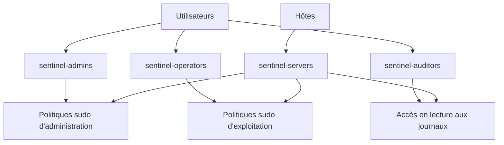

Les chapitres suivants associeront ces groupes à :

* des politiques `sudo` ;
* des règles d'accès aux hôtes ;
* des certificats ;
* des objets de service ;
* l'application Sentinel.

Grâce à cette organisation, les politiques resteront stables même lorsque les personnes changeront.

---

# Ce qu'il faut retenir

* Les groupes représentent des fonctions stables de l'organisation.
* Les utilisateurs doivent recevoir leurs droits par l'intermédiaire de groupes autant que possible.
* Un groupe POSIX possède un GID et peut être utilisé par les systèmes Linux.
* Un groupe non-POSIX peut servir à une organisation ou une délégation interne sans devenir un groupe Unix.
* Les groupes privés représentent le groupe principal d'un utilisateur.
* Les groupes imbriqués permettent de réutiliser une structure organisationnelle, mais doivent rester lisibles.
* Les groupes d'hôtes permettent de cibler des ensembles cohérents de machines.
* Les permissions, privilèges et rôles FreeIPA organisent la délégation administrative.
* Un rôle attribue des privilèges à des utilisateurs ou à des groupes.
* Toute délégation doit être validée par des tests positifs et négatifs.
* La capacité à modifier un groupe privilégié constitue elle-même un privilège critique.

---

# Grande infographie de révision

```text
                    GROUPES ET RÔLES FREEIPA

                            UTILISATEURS
                                 |
        +------------------------+------------------------+
        |                        |                        |
        v                        v                        v
 sentinel-admins         sentinel-operators      sentinel-auditors
        |                        |                        |
        v                        v                        v
 Administration              Exploitation                Audit
 Sentinel                    quotidienne             des journaux

──────────────────────────────────────────────────────────────────────────────

                         GROUPES D'HÔTES

                sentinel01      sentinel02
                     \             /
                      \           /
                       v         v
                    sentinel-servers
                           |
                           v
                 Cible des politiques
                 HBAC et sudo

──────────────────────────────────────────────────────────────────────────────

                    MODÈLE DE DÉLÉGATION FREEIPA

       Permission
       Opération technique élémentaire
             |
             v
       Privilège
       Ensemble cohérent de permissions
             |
             v
       Rôle
       Ensemble de privilèges attribué
       à des utilisateurs ou à des groupes
             |
             v
       Administrateurs délégués

──────────────────────────────────────────────────────────────────────────────

                     GROUPES IMBRIQUÉS

       Alice      Bob
          \       /
           v     v
    linux-platform-admins
              |
              v
       sentinel-admins
              |
              v
       Politiques Sentinel

──────────────────────────────────────────────────────────────────────────────

                     PRINCIPE FONDAMENTAL

        Une personne rejoint une fonction.

        La fonction reçoit les privilèges.

        Les privilèges ne suivent pas directement
        chaque personne.

        Cette séparation rend la politique stable,
        lisible et auditable.
```

# Transition vers le chapitre 8.6

Nous possédons maintenant les groupes nécessaires.

Nous savons :

* qui administre Sentinel ;
* qui l'exploite ;
* qui réalise les audits ;
* quels serveurs appartiennent au périmètre Sentinel.

Il reste à transformer cette organisation en autorisations concrètes.

Les opérateurs devront pouvoir exécuter certaines commandes privilégiées.

Par exemple :

```text
systemctl status sentinel
```

ou :

```text
systemctl restart sentinel
```

Ils ne devront pas pouvoir :

* arrêter SSH ;
* modifier le pare-feu ;
* obtenir un shell `root` ;
* administrer tous les services.

Dans le prochain chapitre, nous centraliserons les politiques `sudo` dans FreeIPA.

Nous relierons :

* les groupes d'utilisateurs ;
* les groupes d'hôtes ;
* les commandes autorisées ;
* les identités cibles.

La délégation de privilèges ne sera plus définie séparément sur chaque serveur.

Elle deviendra une politique commune à tout le domaine.
