# Chapitre 8.6 — Politiques `sudo`

> **Campagne 8 — FreeIPA**

> *« Une élévation de privilèges n'est acceptable que lorsqu'elle est précise, temporaire et traçable. »*

---

## Vous êtes ici

```text
PARTIE II — Industrialiser la sécurité

Campagne 8  [██████░░░░]

      8.1 Présentation de FreeIPA ✔
      8.2 Architecture interne ✔
      8.3 Installation ✔
      8.4 Gestion des utilisateurs ✔
      8.5 Groupes et rôles ✔
   ►  8.6 Politiques sudo
      8.7 Gestion des hôtes
      8.8 Certificats
      8.9 Intégration de Sentinel
      8.10 Mission : administrer une infrastructure avec FreeIPA
```

---

## Objectifs pédagogiques

À la fin de ce chapitre, vous serez capable de :

- comprendre l'intérêt de centraliser les politiques `sudo` ;
- expliquer comment FreeIPA distribue les règles aux clients Linux ;
- distinguer commandes, groupes de commandes et règles `sudo` ;
- cibler une règle selon des utilisateurs et des hôtes ;
- définir l'identité sous laquelle une commande peut être exécutée ;
- limiter les commandes autorisées ;
- diagnostiquer une politique `sudo` reçue par SSSD ;
- construire une délégation adaptée à Sentinel.

---

## Pourquoi ce chapitre existe

Nous avons déjà étudié `sudo`.

Nous savons qu'il permet à un utilisateur d'exécuter une commande avec une autre identité.

Le plus souvent :

```text
root
```

Nous savons également qu'une politique locale peut être définie dans :

```text
/etc/sudoers
```

ou :

```text
/etc/sudoers.d/
```

Cette approche fonctionne correctement sur une machine.

Mais notre infrastructure commence à grandir.

Nous posséderons bientôt :

- plusieurs serveurs Sentinel ;
- plusieurs opérateurs ;
- plusieurs administrateurs ;
- plusieurs environnements ;
- plusieurs politiques.

Imaginons que les opérateurs puissent redémarrer Sentinel sur dix serveurs.

Sans FreeIPA, la règle doit être copiée sur chaque machine.

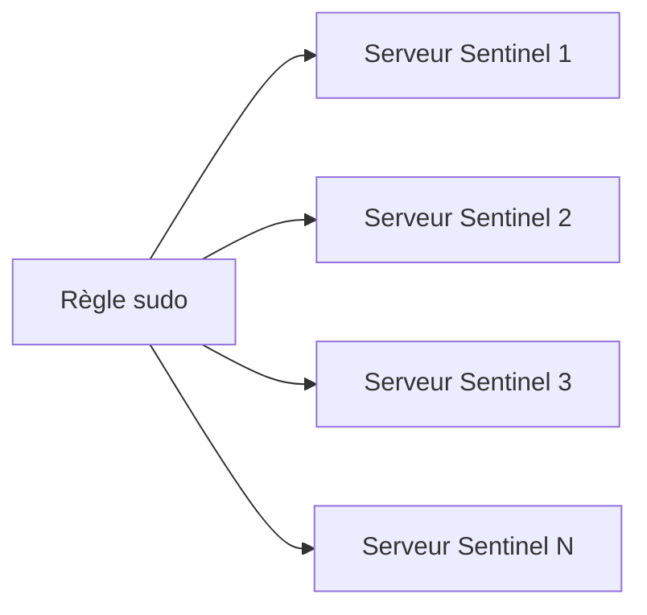

Une modification doit ensuite être répétée partout.

Une révocation doit être répétée partout.

Un oubli suffit à laisser un privilège actif.

FreeIPA propose une autre approche.

La politique est définie une seule fois.

Les clients viennent la consulter.

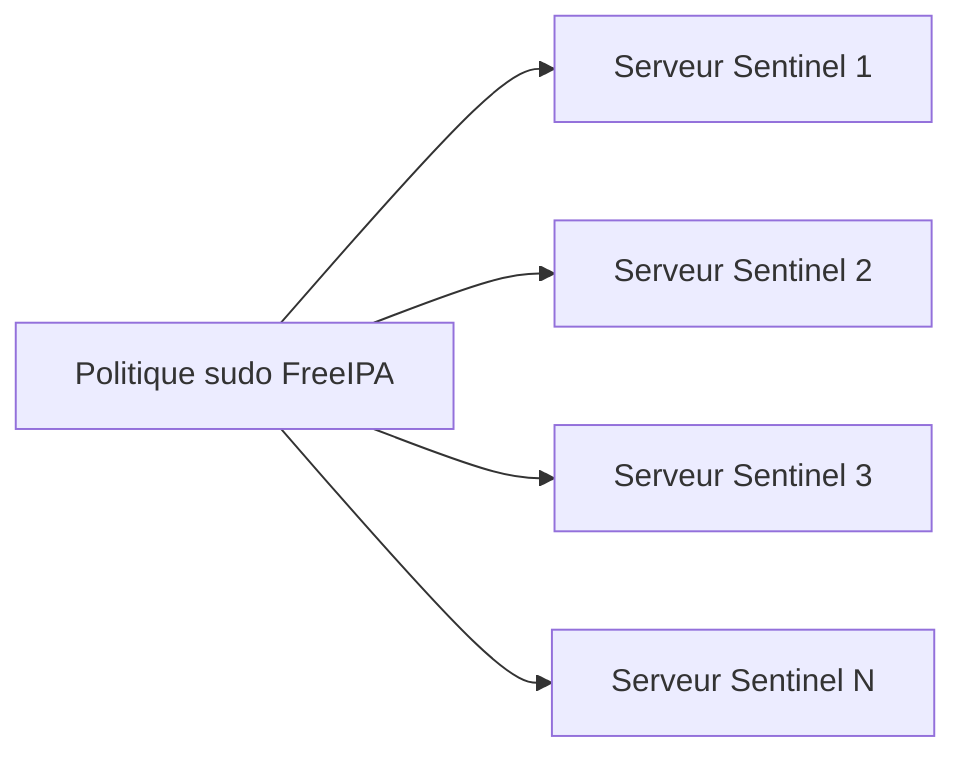

Nous obtenons une seule source de vérité.

---

## Ce que FreeIPA centralise réellement

Une politique `sudo` doit répondre à plusieurs questions.

```text
Qui ?

Sur quelles machines ?

Sous quelle identité ?

Pour quelles commandes ?

Avec quelles options ?
```

FreeIPA représente chacune de ces dimensions.

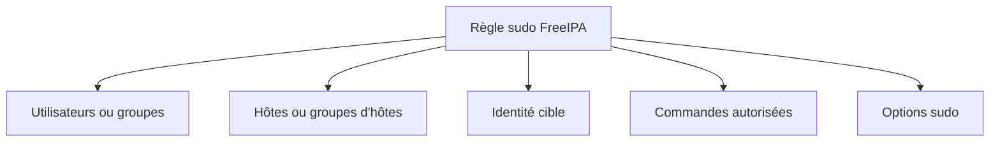

Cette structure permet de construire des règles beaucoup plus lisibles qu'une accumulation de lignes indépendantes.

---

## Le chemin suivi par une commande `sudo`

Prenons Bob.

Bob appartient au groupe :

```text
sentinel-operators
```

Il exécute :

```bash
sudo systemctl restart sentinel
```

Sur un client FreeIPA, le déroulement ressemble à ceci.

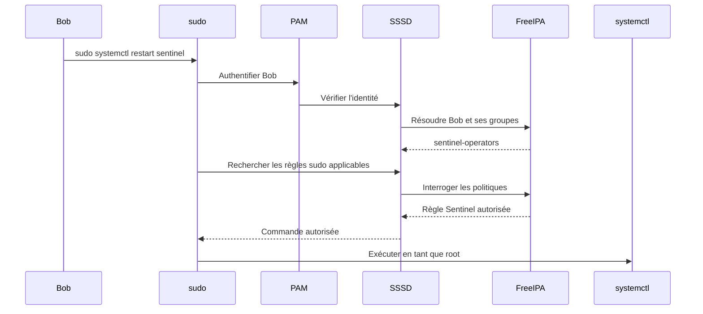

Le fichier `/etc/sudoers` local ne contient pas nécessairement la règle métier.

SSSD récupère la politique depuis FreeIPA.

---

## Le rôle de SSSD

SSSD ne résout pas uniquement les utilisateurs.

Il peut également fournir les règles `sudo`.

Cette fonctionnalité est importante.

Elle permet :

- de récupérer les politiques centralisées ;
- de les mettre en cache ;
- de limiter les requêtes vers le serveur ;
- de continuer temporairement à utiliser certaines informations en cas de perte réseau.

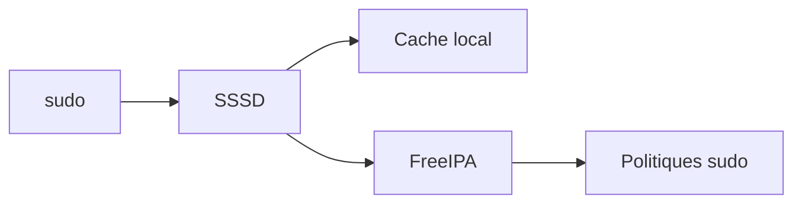

La configuration du client doit activer le fournisseur `sudo` de SSSD.

L'installation avec `ipa-client-install` configure normalement les éléments nécessaires.

Nous vérifierons ce point lors de l'enrôlement des hôtes.

---

## Les objets `sudo` dans FreeIPA

FreeIPA utilise principalement trois objets.

```text
Commande sudo

Groupe de commandes sudo

Règle sudo
```

Une **commande sudo** représente une commande précise.

Par exemple :

```text
/usr/bin/systemctl status sentinel
```

Un **groupe de commandes** rassemble plusieurs commandes.

Par exemple :

```text
SENTINEL_OPERATIONS
```

Une **règle sudo** relie :

- des utilisateurs ;
- des hôtes ;
- des commandes ;
- des identités cibles.

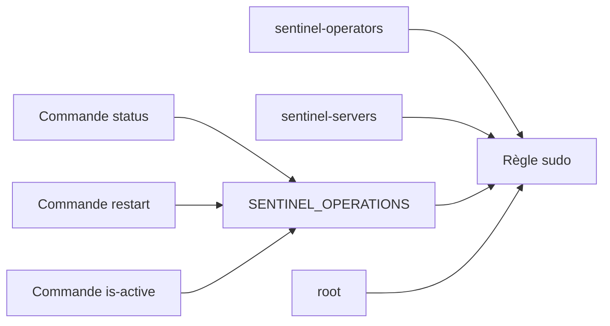

Cette séparation permet de réutiliser les mêmes commandes dans plusieurs règles.

---

## Créer une commande `sudo`

Obtenez un ticket administrateur.

```bash
kinit admin
```

Créons une première commande.

```bash
ipa sudocmd-add \
    "/usr/bin/systemctl status sentinel"
```

Ajoutons ensuite :

```bash
ipa sudocmd-add \
    "/usr/bin/systemctl restart sentinel"
```

Puis :

```bash
ipa sudocmd-add \
    "/usr/bin/systemctl is-active sentinel"
```

Affichez les commandes disponibles.

```bash
ipa sudocmd-find
```

Pour consulter une commande précise :

```bash
ipa sudocmd-show \
    "/usr/bin/systemctl restart sentinel"
```

---

## Pourquoi utiliser le chemin absolu ?

Dans une règle `sudo`, il faut utiliser le chemin absolu.

Par exemple :

```text
/usr/bin/systemctl
```

et non :

```text
systemctl
```

Pourquoi ?

Parce que la variable `PATH` peut varier.

Un attaquant pourrait placer un programme malveillant nommé :

```text
systemctl
```

dans un répertoire prioritaire.

Le chemin absolu garantit que la politique cible le binaire attendu.

Vérifiez le chemin réel.

```bash
command -v systemctl
```

Sur AlmaLinux, le résultat attendu est généralement :

```text
/usr/bin/systemctl
```

Vérifiez toujours le chemin sur les clients concernés.

---

## Commande avec arguments

FreeIPA peut enregistrer une commande complète avec ses arguments.

Par exemple :

```text
/usr/bin/systemctl restart sentinel
```

Cette précision est essentielle.

Elle signifie que l'utilisateur peut redémarrer :

```text
sentinel
```

Mais pas nécessairement :

```text
sshd
```

ou :

```text
firewalld
```

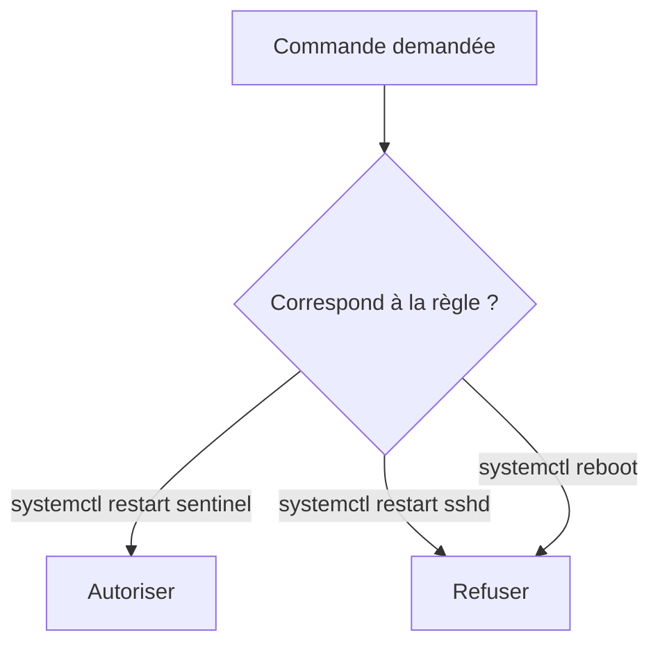

Une règle sans arguments serait beaucoup plus large.

Par exemple :

```text
/usr/bin/systemctl
```

permettrait potentiellement d'agir sur de nombreux services.

---

### ⚠️ Limite importante sur les arguments

La vérification des commandes et de leurs arguments dépend du moteur `sudoers`.

Une règle doit être testée avec précision.

Les caractères spéciaux, jokers et expressions peuvent élargir involontairement le périmètre.

Par exemple, une règle contenant un joker mal conçu pourrait autoriser :

```text
sentinel
```

mais aussi d'autres unités dont le nom commence de manière similaire.

Il faut éviter les motifs génériques lorsqu'une commande exacte suffit.

---

## Créer un groupe de commandes

Créons un groupe :

```bash
ipa sudocmdgroup-add SENTINEL_OPERATIONS \
    --desc="Commandes d'exploitation de Sentinel"
```

Ajoutons les commandes.

```bash
ipa sudocmdgroup-add-member SENTINEL_OPERATIONS \
    --sudocmds="/usr/bin/systemctl status sentinel"
```

Puis :

```bash
ipa sudocmdgroup-add-member SENTINEL_OPERATIONS \
    --sudocmds="/usr/bin/systemctl restart sentinel"
```

Enfin :

```bash
ipa sudocmdgroup-add-member SENTINEL_OPERATIONS \
    --sudocmds="/usr/bin/systemctl is-active sentinel"
```

Vérifiez :

```bash
ipa sudocmdgroup-show SENTINEL_OPERATIONS
```

Le groupe doit contenir les trois commandes.

---

## Pourquoi créer un groupe de commandes ?

Imaginons deux règles.

La première concerne les opérateurs de production.

La seconde concerne les administrateurs de l'environnement de test.

Les deux utilisent certaines commandes communes.

Sans groupe, il faut les ajouter séparément dans chaque règle.

Avec un groupe de commandes, la politique devient réutilisable.

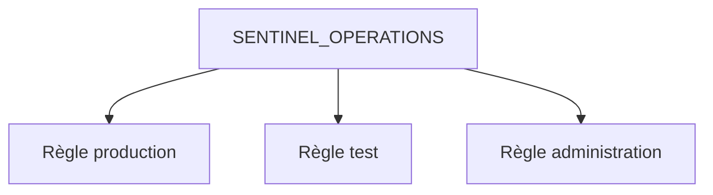

Une nouvelle commande ajoutée au groupe peut ensuite devenir disponible pour toutes les règles qui l'utilisent.

Cette puissance impose également de la prudence.

Modifier un groupe de commandes peut affecter plusieurs politiques simultanément.

---

## Créer une règle `sudo`

Créons maintenant la règle destinée aux opérateurs.

```bash
ipa sudorule-add sentinel-operators-rule \
    --desc="Exploitation contrôlée du service Sentinel"
```

La règle existe.

Mais elle ne contient encore aucun utilisateur.

Aucun hôte.

Aucune commande.

Elle n'accorde donc encore aucun privilège.

---

## Ajouter un groupe d'utilisateurs

Associons le groupe :

```text
sentinel-operators
```

à la règle.

```bash
ipa sudorule-add-user sentinel-operators-rule \
    --groups=sentinel-operators
```

Vérifiez :

```bash
ipa sudorule-show sentinel-operators-rule
```

La sortie doit mentionner :

```text
User Groups: sentinel-operators
```

Toute personne ajoutée à ce groupe deviendra potentiellement concernée par la règle.

Mais uniquement si les autres conditions correspondent.

---

## Ajouter un groupe d'hôtes

Associons ensuite :

```text
sentinel-servers
```

```bash
ipa sudorule-add-host sentinel-operators-rule \
    --hostgroups=sentinel-servers
```

La règle ne s'appliquera donc pas à tous les serveurs du domaine.

Elle s'appliquera uniquement aux hôtes du groupe Sentinel.

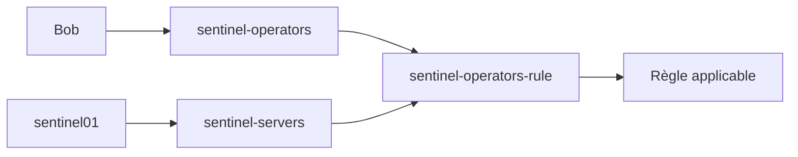

Si Bob exécute la même commande sur un serveur qui n'appartient pas au groupe, l'autorisation ne doit pas être accordée.

---

## Ajouter le groupe de commandes

Associons les commandes.

```bash
ipa sudorule-add-allow-command sentinel-operators-rule \
    --sudocmdgroups=SENTINEL_OPERATIONS
```

Vérifiez :

```bash
ipa sudorule-show sentinel-operators-rule --all
```

La règle possède maintenant :

- un groupe d'utilisateurs ;
- un groupe d'hôtes ;
- un groupe de commandes autorisées.

Il reste à définir l'identité cible.

---

## Définir l'identité cible

Nous voulons que les commandes soient exécutées en tant que :

```text
root
```

Ajoutons cette identité.

```bash
ipa sudorule-add-runasuser sentinel-operators-rule \
    --users=root
```

Selon la version et le contexte, `root` peut être représenté comme utilisateur cible externe ou via les options prévues par FreeIPA.

Vérifiez la règle.

```bash
ipa sudorule-show sentinel-operators-rule --all
```

L'objectif fonctionnel est le suivant :

```text
Les membres de sentinel-operators

sur les hôtes de sentinel-servers

peuvent exécuter SENTINEL_OPERATIONS

en tant que root.
```

---

## Règle complète

La politique peut être représentée ainsi.

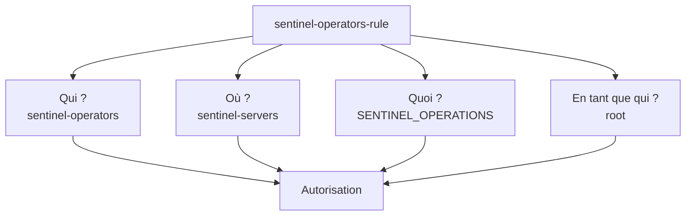

Les quatre dimensions doivent correspondre.

Un seul échec suffit à rendre la règle inapplicable.

---

## Activer et désactiver une règle

Une règle peut être désactivée sans être supprimée.

```bash
ipa sudorule-disable sentinel-operators-rule
```

Vérifiez :

```bash
ipa sudorule-show sentinel-operators-rule
```

Pour la réactiver :

```bash
ipa sudorule-enable sentinel-operators-rule
```

Cette fonctionnalité est utile :

- lors d'un incident ;
- pendant une maintenance ;
- pour tester une politique ;
- pour conserver une règle historique.

Une désactivation temporaire est souvent préférable à une suppression précipitée.

---

## Les options `sudo`

Une règle peut contenir des options.

Par exemple :

```text
authenticate
```

ou :

```text
!authenticate
```

La seconde correspond à une logique proche de :

```text
NOPASSWD
```

dans `sudoers`.

Pour ajouter une option :

```bash
ipa sudorule-add-option sentinel-operators-rule \
    --sudooption='authenticate'
```

L'option exacte doit être choisie selon le comportement recherché et les capacités de la version de `sudo`.

Affichez les options :

```bash
ipa sudorule-show sentinel-operators-rule --all
```

---

## Faut-il utiliser `NOPASSWD` ?

Dans la majorité des cas, non.

L'authentification ajoute une protection.

Elle confirme que l'utilisateur présent devant la session est bien celui qui demande l'élévation.

Cependant, certaines automatisations ont besoin d'exécuter une commande sans interaction.

Dans ce cas, une règle sans mot de passe peut être justifiée.

Elle doit alors être :

- limitée à une commande exacte ;
- limitée à un compte technique ;
- limitée à des hôtes précis ;
- journalisée ;
- revue régulièrement.

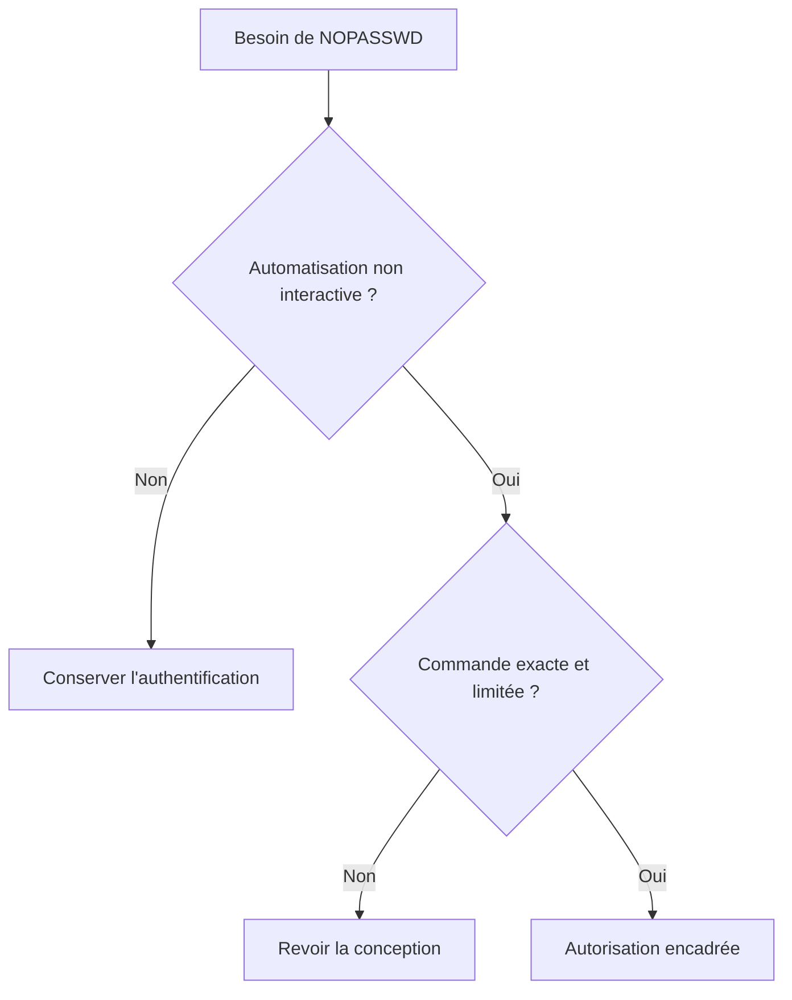

`NOPASSWD` ne doit jamais devenir un moyen de contourner une mauvaise conception.

---

## Les commandes dangereuses

Certaines commandes permettent d'exécuter d'autres programmes.

Elles sont très difficiles à déléguer de manière sûre.

Par exemple :

```text
/bin/bash
```

```text
/usr/bin/python3
```

```text
/usr/bin/vim
```

```text
/usr/bin/less
```

```text
/usr/bin/find
```

```text
/usr/bin/tar
```

Ces outils peuvent parfois :

- lancer un shell ;
- écrire des fichiers arbitraires ;
- exécuter des commandes ;
- lire des données sensibles.

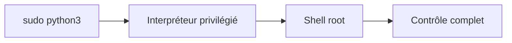

Autoriser un interpréteur revient presque toujours à autoriser un shell.

---

### 💎 Le point d'expertise

Une commande `systemctl` peut elle aussi présenter des risques indirects.

Imaginons qu'un utilisateur soit autorisé à redémarrer Sentinel.

Cette règle paraît limitée.

Mais si le même utilisateur peut modifier :

```text
/etc/systemd/system/sentinel.service
```

ou le programme exécuté par l'unité, il peut remplacer la commande par un code malveillant.

Puis demander :

```bash
sudo systemctl restart sentinel
```

Le code sera exécuté avec les privilèges du service.

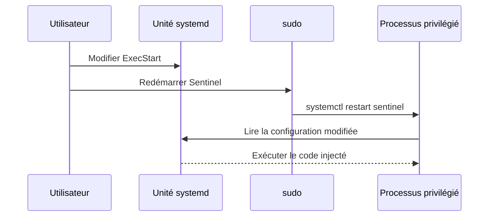

Une politique `sudo` ne peut donc pas être évaluée sans examiner les permissions sur :

- l'unité systemd ;
- le binaire ;
- les scripts ;
- les fichiers de configuration ;
- les répertoires parents.

La sécurité d'une délégation dépend de toute la chaîne d'exécution.

---

## La règle `ALL`

FreeIPA permet de définir des règles concernant :

```text
tous les utilisateurs
```

```text
tous les hôtes
```

ou :

```text
toutes les commandes
```

Cette souplesse doit être utilisée avec une extrême prudence.

Une règle comme :

```text
Groupe d'utilisateurs : admins

Hôtes : tous

Commandes : toutes
```

équivaut presque à une délégation administrative générale.

Elle peut être nécessaire pour un groupe d'administrateurs système.

Mais elle ne doit jamais être utilisée simplement pour résoudre rapidement un refus.

Le mot :

```text
ALL
```

doit toujours déclencher une revue de sécurité.

---

## Ordre et combinaison des règles

Plusieurs règles peuvent concerner le même utilisateur.

Par exemple :

- une règle générale pour les administrateurs Linux ;
- une règle spécifique pour Sentinel ;
- une règle temporaire de maintenance.

`sudo` calcule les autorisations applicables selon les informations reçues.

Il est donc possible qu'un utilisateur obtienne une commande par une autre règle que celle que vous examinez.

Lors d'un diagnostic, il faut toujours demander :

```bash
sudo -l
```

Cette commande présente la vue effective du client.

Elle est plus importante que la simple lecture d'une règle isolée dans FreeIPA.

---

## Vérifier la règle côté FreeIPA

Affichez la règle complète.

```bash
ipa sudorule-show sentinel-operators-rule --all
```

Vérifiez au minimum :

- l'état actif ;
- les groupes d'utilisateurs ;
- les groupes d'hôtes ;
- les commandes ;
- les identités cibles ;
- les options.

Listez les règles.

```bash
ipa sudorule-find
```

Recherchez les commandes.

```bash
ipa sudocmd-find
```

Affichez le groupe de commandes.

```bash
ipa sudocmdgroup-show SENTINEL_OPERATIONS
```

Cette vérification confirme la politique côté serveur.

Elle ne confirme pas encore que le client l'a reçue.

---

## Vérifier la configuration SSSD du client

Sur un client FreeIPA, examinez :

```bash
sudo grep -E '^\[domain|^sudo_provider|^services' \
    /etc/sssd/sssd.conf
```

La configuration peut notamment contenir :

```text
services = nss, pam, sudo, ssh
```

et un fournisseur adapté au domaine.

Le fichier :

```text
/etc/sssd/sssd.conf
```

contient des informations sensibles.

Ses permissions doivent être strictes.

```bash
sudo ls -l /etc/sssd/sssd.conf
```

Le fichier doit généralement appartenir à `root` et ne pas être lisible par tous.

---

## Rafraîchir le cache `sudo` de SSSD

SSSD met en cache les politiques.

Une modification FreeIPA peut donc ne pas être immédiatement visible.

Pour invalider les caches dans un laboratoire :

```bash
sudo sss_cache -E
```

Redémarrer SSSD peut également forcer une nouvelle initialisation.

```bash
sudo systemctl restart sssd
```

Cette opération doit être utilisée avec prudence en production.

Elle peut temporairement affecter :

- la résolution des identités ;
- PAM ;
- les connexions ;
- les règles `sudo`.

Pour un diagnostic plus ciblé, les outils et journaux SSSD doivent être privilégiés.

---

## Tester avec `sudo -l`

Connectez-vous avec Bob sur un client Sentinel.

Exécutez :

```bash
sudo -l
```

Le résultat doit mentionner les commandes autorisées.

Par exemple :

```text
/usr/bin/systemctl status sentinel

/usr/bin/systemctl restart sentinel

/usr/bin/systemctl is-active sentinel
```

Testez ensuite :

```bash
sudo /usr/bin/systemctl status sentinel
```

Puis :

```bash
sudo /usr/bin/systemctl is-active sentinel
```

Enfin :

```bash
sudo /usr/bin/systemctl restart sentinel
```

Les commandes doivent fonctionner si :

- Bob appartient au bon groupe ;
- le client appartient au bon groupe d'hôtes ;
- SSSD reçoit les règles ;
- les chemins correspondent ;
- la règle est active.

---

## Réaliser un test négatif

Un test positif ne suffit pas.

Essayez une commande non autorisée.

```bash
sudo /usr/bin/systemctl restart sshd
```

Elle doit être refusée.

Essayez également :

```bash
sudo /bin/bash
```

Cette commande doit être refusée.

Puis testez la règle depuis un hôte qui n'appartient pas à :

```text
sentinel-servers
```

La commande Sentinel doit également être refusée.

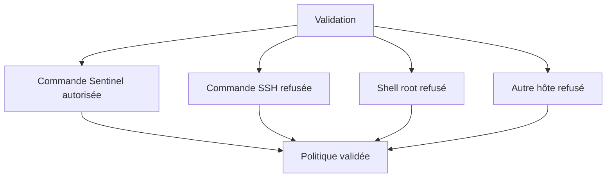

Une politique n'est validée que lorsque ses limites ont elles aussi été testées.

---

## Diagnostiquer un refus

Lorsqu'une commande attendue est refusée, suivez une méthode structurée.

Première étape.

Vérifier l'identité.

```bash
id
```

Deuxième étape.

Vérifier les groupes.

```bash
id bob
```

Troisième étape.

Vérifier les règles visibles.

```bash
sudo -l
```

Quatrième étape.

Vérifier l'hôte.

```bash
hostname -f
```

Puis côté FreeIPA :

```bash
ipa hostgroup-show sentinel-servers
```

Cinquième étape.

Vérifier la règle.

```bash
ipa sudorule-show sentinel-operators-rule --all
```

Sixième étape.

Vérifier les journaux.

```bash
sudo journalctl -u sssd
```

Puis :

```bash
sudo journalctl | grep sudo
```

Le chemin de diagnostic peut être représenté ainsi.

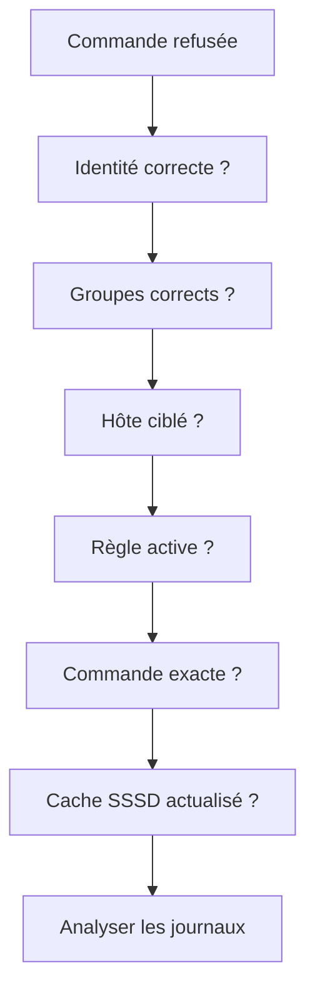

---

## Les journaux SSSD

SSSD possède plusieurs journaux.

Ils se trouvent généralement dans :

```text
/var/log/sssd/
```

Affichez leur liste.

```bash
sudo ls -l /var/log/sssd/
```

Selon la configuration, vous pourrez trouver :

- un journal principal ;
- un journal du domaine ;
- un journal NSS ;
- un journal PAM ;
- un journal `sudo`.

Pour rechercher des erreurs :

```bash
sudo grep -RiE 'error|failed|sudo' \
    /var/log/sssd/
```

Les fichiers peuvent contenir des informations sensibles.

Ils doivent être consultés uniquement par des personnes autorisées.

---

## Journalisation de `sudo`

La centralisation de la politique ne supprime pas la journalisation locale.

Lorsqu'un utilisateur exécute une commande, le client enregistre l'événement.

Par exemple :

```bash
sudo journalctl | grep sudo
```

On peut également utiliser :

```bash
sudo journalctl _COMM=sudo
```

Selon la version de `sudo` et la configuration, les journaux indiquent notamment :

- l'utilisateur ;
- le terminal ;
- le répertoire courant ;
- l'identité cible ;
- la commande exécutée.

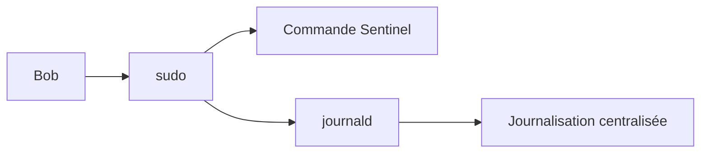

FreeIPA centralise la politique.

Le client reste responsable de l'exécution et des traces locales.

---

## FreeIPA n'enregistre pas tout le contenu de la session

Une règle FreeIPA permet de savoir :

- qui était autorisé ;
- sur quel hôte ;
- pour quelle commande.

Mais elle ne constitue pas à elle seule un enregistrement complet de ce que l'utilisateur a fait.

Pour une traçabilité approfondie, il faut compléter avec :

- les journaux `sudo` ;
- `journald` ;
- Auditd ;
- éventuellement l'enregistrement des entrées et sorties de session ;
- une collecte centralisée.

Cette distinction est importante.

```text
FreeIPA

↓

Politique d'autorisation
```

```text
Client Linux

↓

Exécution et journalisation
```

---

### 🧠 Comment pense un architecte ?

Un architecte conçoit une règle `sudo` à partir d'une tâche métier.

Il ne commence pas par :

```text
Quelle commande vais-je autoriser ?
```

Il commence par :

```text
Quelle opération la personne doit-elle accomplir ?
```

Prenons le besoin :

> Un opérateur doit relancer Sentinel après un incident.

L'architecte identifie alors :

- le groupe concerné ;
- les hôtes concernés ;
- la commande exacte ;
- les fichiers que l'opérateur peut modifier ;
- les conséquences indirectes ;
- les traces nécessaires.

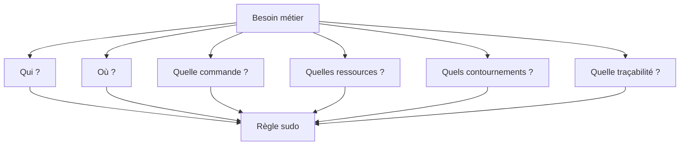

La commande n'est qu'une partie de la réponse.

---

### ⚔️ Comment pense un attaquant ?

Un attaquant commence généralement par :

```bash
sudo -l
```

Il cherche ensuite une possibilité de sortir du cadre.

Il examine notamment :

- les jokers ;
- les arguments modifiables ;
- les scripts exécutés ;
- les fichiers modifiables ;
- les variables d'environnement ;
- les programmes pouvant lancer un shell ;
- les services redémarrables.

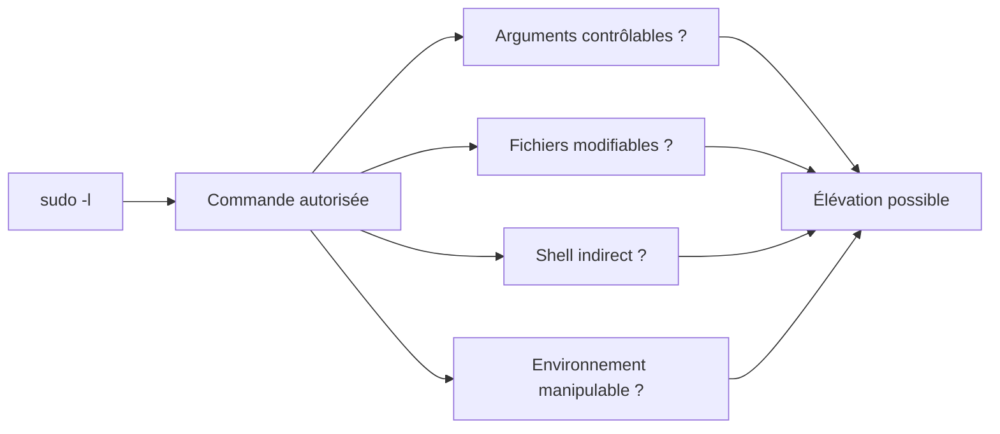

Une règle apparemment limitée peut devenir dangereuse si elle appelle un composant modifiable par l'utilisateur.

---

### 📚 Culture technique

La centralisation des règles `sudo` dans un annuaire repose historiquement sur un schéma LDAP dédié.

Les règles peuvent être représentées comme des objets d'annuaire.

SSSD sait ensuite les rechercher et les traduire pour `sudo`.

FreeIPA fournit une couche d'administration plus conviviale autour de ce modèle.

L'administrateur manipule :

- des commandes ;
- des groupes de commandes ;
- des règles ;
- des utilisateurs ;
- des hôtes.

Il n'a pas besoin de créer directement les entrées LDAP.

Cette abstraction réduit fortement le risque d'incohérence.

---

### ⚠️ Piège classique

Un piège fréquent consiste à autoriser un script contrôlé par un utilisateur.

Imaginons :

```text
/usr/local/bin/restart-sentinel.sh
```

La règle `sudo` autorise son exécution.

Mais le groupe `sentinel-operators` peut modifier le script.

L'utilisateur peut alors remplacer son contenu par :

```bash
#!/bin/bash

/bin/bash
```

Puis exécuter :

```bash
sudo /usr/local/bin/restart-sentinel.sh
```

Il obtient un shell privilégié.

La règle ne doit donc jamais cibler un script modifiable par ses bénéficiaires.

Vérifiez toute la chaîne.

```bash
namei -l /usr/local/bin/restart-sentinel.sh
```

Puis :

```bash
ls -l /usr/local/bin/restart-sentinel.sh
```

Le fichier et ses répertoires parents doivent être protégés.

---

## Laboratoire AlmaLinux

### Prérequis

Ce laboratoire suppose que :

- Bob existe ;
- Bob appartient à `sentinel-operators` ;
- le groupe d'hôtes `sentinel-servers` existe ;
- au moins un client FreeIPA héberge Sentinel ;
- ce client appartient à `sentinel-servers`.

Si l'hôte Sentinel n'est pas encore enrôlé, préparez les objets côté FreeIPA.

Les tests côté client seront finalisés après le chapitre **8.7**.

---

### Étape 1 — Obtenir un ticket administrateur

```bash
kinit admin
```

Vérifiez :

```bash
klist
```

---

### Étape 2 — Créer les commandes

```bash
ipa sudocmd-add \
    "/usr/bin/systemctl status sentinel"
```

```bash
ipa sudocmd-add \
    "/usr/bin/systemctl restart sentinel"
```

```bash
ipa sudocmd-add \
    "/usr/bin/systemctl is-active sentinel"
```

Si une commande existe déjà, vérifiez-la plutôt que de la recréer.

```bash
ipa sudocmd-show \
    "/usr/bin/systemctl restart sentinel"
```

---

### Étape 3 — Créer le groupe de commandes

```bash
ipa sudocmdgroup-add SENTINEL_OPERATIONS \
    --desc="Commandes autorisées aux opérateurs Sentinel"
```

---

### Étape 4 — Ajouter les commandes au groupe

```bash
ipa sudocmdgroup-add-member SENTINEL_OPERATIONS \
    --sudocmds="/usr/bin/systemctl status sentinel"
```

```bash
ipa sudocmdgroup-add-member SENTINEL_OPERATIONS \
    --sudocmds="/usr/bin/systemctl restart sentinel"
```

```bash
ipa sudocmdgroup-add-member SENTINEL_OPERATIONS \
    --sudocmds="/usr/bin/systemctl is-active sentinel"
```

Vérifiez :

```bash
ipa sudocmdgroup-show SENTINEL_OPERATIONS
```

---

### Étape 5 — Créer la règle

```bash
ipa sudorule-add sentinel-operators-rule \
    --desc="Exploitation limitée du service Sentinel"
```

---

### Étape 6 — Ajouter le groupe d'utilisateurs

```bash
ipa sudorule-add-user sentinel-operators-rule \
    --groups=sentinel-operators
```

---

### Étape 7 — Ajouter le groupe d'hôtes

```bash
ipa sudorule-add-host sentinel-operators-rule \
    --hostgroups=sentinel-servers
```

---

### Étape 8 — Ajouter les commandes

```bash
ipa sudorule-add-allow-command sentinel-operators-rule \
    --sudocmdgroups=SENTINEL_OPERATIONS
```

---

### Étape 9 — Définir l'identité cible

```bash
ipa sudorule-add-runasuser sentinel-operators-rule \
    --users=root
```

Si cette syntaxe n'est pas acceptée dans votre version, consultez :

```bash
ipa help sudorule-add-runasuser
```

Puis utilisez le type d'identité cible approprié.

---

### Étape 10 — Examiner la règle complète

```bash
ipa sudorule-show sentinel-operators-rule --all
```

Vérifiez :

```text
Règle active

Groupe utilisateur : sentinel-operators

Groupe d'hôtes : sentinel-servers

Groupe de commandes : SENTINEL_OPERATIONS

Identité cible : root
```

---

### Étape 11 — Vérifier le groupe d'utilisateurs

```bash
ipa group-show sentinel-operators
```

Bob doit apparaître.

---

### Étape 12 — Vérifier le groupe d'hôtes

```bash
ipa hostgroup-show sentinel-servers
```

Le serveur Sentinel doit apparaître après son enrôlement.

---

### Étape 13 — Rafraîchir le client

Sur le client Sentinel :

```bash
sudo sss_cache -E
```

Puis :

```bash
sudo systemctl restart sssd
```

Dans un environnement de production, privilégiez une invalidation ciblée et planifiée.

---

### Étape 14 — Tester avec Bob

Ouvrez une nouvelle session Bob.

Vérifiez :

```bash
id
```

Puis :

```bash
sudo -l
```

Testez :

```bash
sudo /usr/bin/systemctl status sentinel
```

Puis :

```bash
sudo /usr/bin/systemctl is-active sentinel
```

Enfin :

```bash
sudo /usr/bin/systemctl restart sentinel
```

---

### Étape 15 — Tester les refus

```bash
sudo /usr/bin/systemctl restart sshd
```

La commande doit être refusée.

Puis :

```bash
sudo /bin/bash
```

La commande doit être refusée.

Enfin, testez depuis un hôte hors du groupe `sentinel-servers`.

Les commandes Sentinel doivent être refusées.

---

### Étape 16 — Examiner les journaux

```bash
sudo journalctl _COMM=sudo
```

Puis :

```bash
sudo journalctl -u sssd
```

Recherchez :

- l'utilisateur ;
- la commande ;
- l'identité cible ;
- le résultat ;
- les erreurs éventuelles.

---

## Mission d'ingénieur

Concevez trois politiques distinctes.

### Politique des opérateurs

Groupe :

```text
sentinel-operators
```

Commandes envisagées :

```text
systemctl status sentinel

systemctl is-active sentinel

systemctl restart sentinel
```

Interdictions :

```text
Modifier l'unité systemd

Modifier le binaire

Modifier les secrets

Obtenir un shell root
```

---

### Politique des auditeurs

Groupe :

```text
sentinel-auditors
```

Commandes envisagées :

```text
journalctl -u sentinel

sentinelctl audit-report
```

Interdictions :

```text
Redémarrer le service

Modifier les journaux

Modifier la configuration
```

Attention.

La délégation de `journalctl` doit être analysée avec précision.

Il peut être préférable d'utiliser :

- un groupe système dédié ;
- des ACL ;
- une commande d'export contrôlée ;
- un outil applicatif spécifique.

`sudo journalctl` peut accorder une capacité de lecture beaucoup plus large que prévu.

---

### Politique des administrateurs Sentinel

Groupe :

```text
sentinel-admins
```

Commandes envisagées :

```text
systemctl restart sentinel

systemctl reload sentinel

sentinelctl validate-config

sentinelctl maintenance
```

Interdictions :

```text
Administrer les autres services

Modifier FreeIPA

Obtenir un shell root sans justification
```

---

### Tableau d'analyse

Pour chaque commande, complétez :

| Commande | Besoin métier | Arguments contrôlés | Fichiers utilisés | Modifiables par le bénéficiaire ? | Risque indirect |
|----------|---------------|---------------------|------------------|-----------------------------------|-----------------|
| `systemctl restart sentinel` | Relancer le service | Unité exacte | Unité et binaire | Non attendu | Exécution de code si unité modifiable |
| `systemctl status sentinel` | Diagnostic | Unité exacte | Journaux et métadonnées | Non | Lecture d'informations |
| `sentinelctl validate-config` | Validation | Fichier contrôlé | Configuration | À vérifier | Lecture ou exécution indirecte |
| `journalctl -u sentinel` | Audit | Unité exacte | Journal systemd | Non | Accès élargi selon options |

Une commande ne doit être ajoutée à une politique qu'après cette analyse.

---

## Impact sur Sentinel

Sentinel dispose désormais d'un modèle de délégation centralisé.

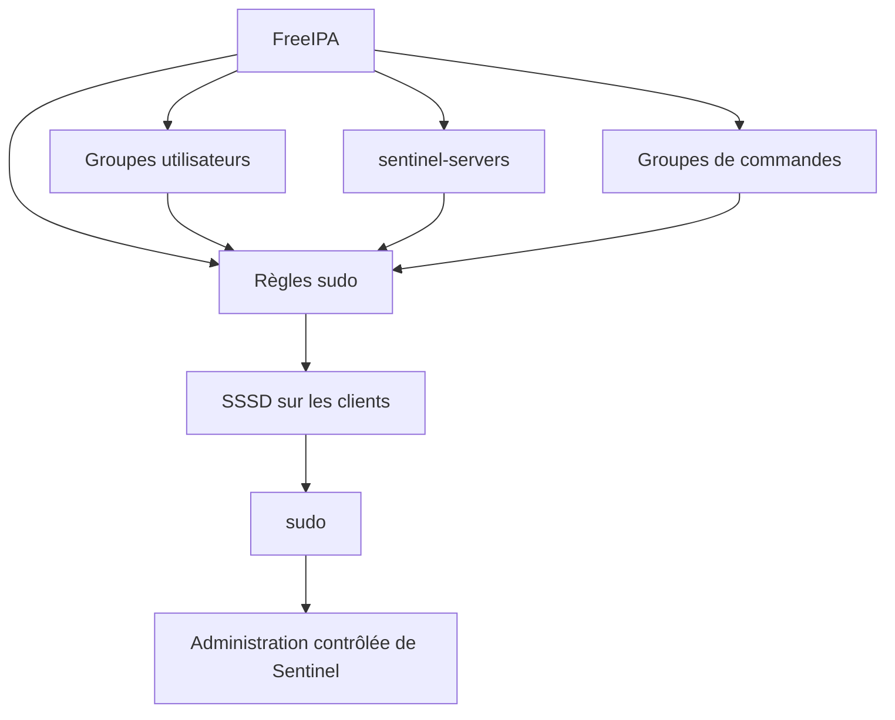

Les opérateurs peuvent accomplir leur mission.

Ils ne reçoivent pas un accès administratif général.

La politique peut être modifiée depuis un point central.

Elle peut être appliquée à plusieurs serveurs.

Elle peut également être désactivée rapidement en cas d'incident.

Cette évolution représente une étape importante vers l'industrialisation de Sentinel.

---

## Synthèse

- FreeIPA permet de centraliser les politiques `sudo`.
- SSSD récupère les règles et les fournit au moteur `sudo` du client.
- Une politique relie des utilisateurs, des hôtes, des commandes et une identité cible.
- Les commandes doivent être définies avec leur chemin absolu.
- Les arguments doivent être limités autant que possible.
- Les groupes de commandes facilitent la réutilisation, mais toute modification peut affecter plusieurs règles.
- Les groupes d'hôtes évitent d'appliquer une politique sur l'ensemble du domaine.
- `sudo -l` permet de consulter la politique effective côté client.
- Une règle doit être validée avec des tests positifs et négatifs.
- L'autorisation d'une commande doit être analysée avec les permissions sur tous les fichiers qu'elle utilise.
- Un script ou une unité modifiable par le bénéficiaire peut transformer une règle limitée en élévation complète.
- La centralisation de la politique ne remplace pas la journalisation des exécutions.

---

## Infographie de révision

```text
                     POLITIQUES SUDO FREEIPA

                           BESOIN MÉTIER
                                |
                                v
                  Qui doit accomplir l'action ?
                                |
                                v
                    Groupe d'utilisateurs
                    sentinel-operators
                                |
                                |
          Sur quelles machines ?|Quelles commandes ?
                    |           |
                    v           v
            sentinel-servers   SENTINEL_OPERATIONS
                    \           /
                     \         /
                      v       v
                  RÈGLE SUDO FREEIPA
                          |
                          v
                    Exécuter comme root
                          |
                          v
                     Politique centralisée

──────────────────────────────────────────────────────────────────────────────

                     CÔTÉ CLIENT ALMALINUX

       Bob
        |
        v
   sudo commande
        |
        v
      PAM
        |
        v
      SSSD
        |
        +----------------------+
        |                      |
        v                      v
   Identité et groupes    Règles sudo FreeIPA
        |                      |
        +----------+-----------+
                   |
                   v
           Décision de sudo
                   |
          +--------+--------+
          |                 |
          v                 v
      Autorisé           Refusé
          |
          v
   Exécution journalisée

──────────────────────────────────────────────────────────────────────────────

                     VALIDATION D'UNE RÈGLE

      Test positif

      ✔ L'opérateur peut redémarrer Sentinel.

      Tests négatifs

      ✔ Il ne peut pas redémarrer SSH.
      ✔ Il ne peut pas lancer un shell root.
      ✔ Il ne peut pas utiliser la règle sur un autre hôte.
      ✔ Il ne peut pas modifier l'unité ou le binaire exécuté.

──────────────────────────────────────────────────────────────────────────────

                    RISQUE D'EXÉCUTION INDIRECTE

      Règle autorisée
            |
            v
      systemctl restart sentinel
            |
            v
      Unité systemd
            |
            v
      Binaire ou script
            |
            v
      Fichier modifiable par l'utilisateur ?
            |
        +---+---+
        |       |
       Non     Oui
        |       |
        v       v
      Risque   Élévation possible
      limité

──────────────────────────────────────────────────────────────────────────────

                    PRINCIPE FONDAMENTAL

       Une règle sudo ne doit pas seulement limiter
       la commande visible.

       Elle doit protéger toute la chaîne de fichiers,
       de scripts et de configurations exécutée avec
       les privilèges élevés.
```

## Pour aller plus loin

Nous avons construit :

- les utilisateurs ;
- les groupes ;
- les groupes d'hôtes ;
- les politiques `sudo`.

Mais notre serveur Sentinel n'est pas encore réellement membre du domaine.

Pour recevoir les identités et les politiques, une machine doit être enregistrée dans FreeIPA.

Cette opération ne consiste pas simplement à ajouter une ligne dans un annuaire.

L'hôte reçoit une véritable identité.

Il obtient notamment :

- un objet dans FreeIPA ;
- un principal Kerberos ;
- une clé secrète dans un fichier `keytab` ;
- une configuration SSSD ;
- une relation de confiance avec le domaine ;
- éventuellement des enregistrements DNS.

Dans le prochain chapitre, nous allons enrôler le serveur Sentinel.

Nous verrons comment un hôte prouve son identité, comment fonctionne `/etc/krb5.keytab` et comment diagnostiquer une machine qui ne parvient plus à communiquer correctement avec FreeIPA.

---

← [8.5 — Groupes et rôles](8.5-groupes-roles.md) · [8.7 — Gestion des hôtes](8.7-gestion-hotes.md) →
