# Chapitre 8.7 — Gestion des hôtes

> **Campagne 8 — FreeIPA**

> *« Une machine ne rejoint pas seulement un réseau. Elle rejoint un domaine de confiance et reçoit une identité propre. »*

---

## Vous êtes ici

```text
PARTIE II — Industrialiser la sécurité

Campagne 8  [███████░░░]

      8.1 Présentation de FreeIPA ✔
      8.2 Architecture interne ✔
      8.3 Installation ✔
      8.4 Gestion des utilisateurs ✔
      8.5 Groupes et rôles ✔
      8.6 Politiques sudo ✔
   ►  8.7 Gestion des hôtes
      8.8 Certificats
      8.9 Intégration de Sentinel
      8.10 Mission : administrer une infrastructure avec FreeIPA
```

---

## Objectifs pédagogiques

À la fin de ce chapitre, vous serez capable de :

- comprendre ce que représente un hôte dans FreeIPA ;
- préparer une machine AlmaLinux avant son enrôlement ;
- installer et configurer un client FreeIPA ;
- comprendre le rôle de SSSD, NSS et PAM sur le client ;
- expliquer le fonctionnement du fichier `/etc/krb5.keytab` ;
- intégrer un hôte à un groupe d'hôtes ;
- tester les identités et les politiques centralisées ;
- diagnostiquer les principaux problèmes d'enrôlement.

---

## Pourquoi ce chapitre existe

Nous avons créé des utilisateurs.

Nous avons créé des groupes.

Nous avons préparé des politiques `sudo`.

Mais une politique centralisée ne peut pas s'appliquer à une machine inconnue du domaine.

FreeIPA doit savoir :

- quel est le nom de la machine ;
- à quelle adresse elle répond ;
- quels services elle héberge ;
- à quels groupes d'hôtes elle appartient ;
- comment elle peut prouver son identité.

Un hôte FreeIPA n'est donc pas une simple entrée DNS.

Il possède une véritable identité.

Cette identité lui permet de dialoguer avec les autres composants du domaine.

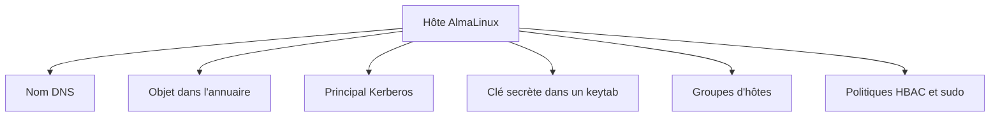

L'enrôlement transforme une machine autonome en membre du domaine.

---

## Avant l'enrôlement

Notre serveur Sentinel possède actuellement ses propres mécanismes locaux.

Il utilise :

- `/etc/passwd` ;
- `/etc/group` ;
- PAM ;
- les politiques locales ;
- les comptes système.

Après l'enrôlement, ces mécanismes restent présents.

Mais de nouvelles sources apparaissent.

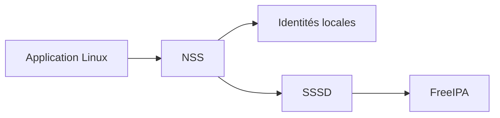

Le système peut désormais résoudre :

- les comptes locaux ;
- les comptes FreeIPA ;
- leurs groupes ;
- les politiques centralisées.

FreeIPA complète le système local.

Il ne le remplace pas totalement.

---

## Le laboratoire

Nous allons enrôler la machine suivante :

```text
sentinel01.lab.sentinel.test
```

Son rôle sera :

```text
Serveur applicatif Sentinel
```

Une architecture de laboratoire peut ressembler à ceci.


Les valeurs d'exemple seront :

| Élément | Valeur |
|---------|--------|
| Serveur FreeIPA | `ipa01.lab.sentinel.test` |
| Client Sentinel | `sentinel01.lab.sentinel.test` |
| Domaine DNS | `lab.sentinel.test` |
| Royaume Kerberos | `LAB.SENTINEL.TEST` |
| Adresse FreeIPA | `192.168.56.10` |
| Adresse Sentinel | `192.168.56.20` |

Adaptez les adresses au réseau réel du laboratoire.

---

## Vérifier le nom d'hôte

Le client doit posséder un FQDN stable.

```bash
hostname -f
```

Le résultat attendu est :

```text
sentinel01.lab.sentinel.test
```

Si nécessaire :

```bash
sudo hostnamectl set-hostname \
    sentinel01.lab.sentinel.test
```

Vérifiez ensuite :

```bash
hostnamectl
```

Puis :

```bash
hostname -f
```

Le nom ne doit pas être modifié arbitrairement après l'enrôlement.

Il sera lié à :

- l'objet hôte ;
- son principal Kerberos ;
- son fichier `keytab` ;
- ses futurs certificats ;
- ses enregistrements DNS.

---

## Vérifier le DNS

Le client doit pouvoir résoudre le serveur FreeIPA.

```bash
getent hosts ipa01.lab.sentinel.test
```

Puis :

```bash
dig ipa01.lab.sentinel.test
```

Il doit également pouvoir résoudre son propre nom.

```bash
getent hosts sentinel01.lab.sentinel.test
```

Testez les enregistrements de découverte.

```bash
dig SRV _ldap._tcp.lab.sentinel.test
```

Puis :

```bash
dig SRV _kerberos._udp.lab.sentinel.test
```

Les réponses doivent indiquer le serveur FreeIPA.

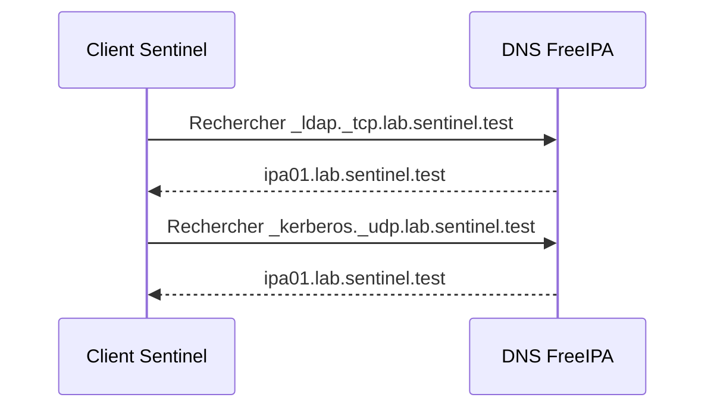

Si ces enregistrements ne sont pas résolus, l'installation du client peut échouer ou nécessiter des options supplémentaires.

---

## Configurer le résolveur DNS

Le client doit utiliser un DNS capable de résoudre la zone FreeIPA.

Dans notre laboratoire :

```text
192.168.56.10
```

Vérifiez les DNS actuels.

```bash
nmcli device show | grep -E 'IP4.DNS|IP4.DOMAIN'
```

Identifiez la connexion.

```bash
nmcli connection show
```

Puis adaptez la configuration.

```bash
sudo nmcli connection modify \
    "System eth0" \
    ipv4.dns "192.168.56.10" \
    ipv4.dns-search "lab.sentinel.test" \
    ipv4.ignore-auto-dns yes
```

Réactivez la connexion.

```bash
sudo nmcli connection up "System eth0"
```

Le nom de connexion doit être adapté.

Attention à ne pas interrompre une session distante sans accès de secours.

Vérifiez ensuite :

```bash
cat /etc/resolv.conf
```

Puis relancez les tests DNS.

---

## Vérifier l'heure

Le client doit être synchronisé avec une source de temps fiable.

```bash
timedatectl
```

Puis :

```bash
chronyc tracking
```

Et :

```bash
systemctl status chronyd
```

Si nécessaire :

```bash
sudo systemctl enable --now chronyd
```

Kerberos tolère seulement un écart limité entre les horloges.

Un client mal synchronisé peut résoudre correctement le domaine tout en échouant à s'authentifier.

---

## Vérifier les conflits d'identités

Avant l'enrôlement, vérifiez qu'aucun compte local ne porte le même nom qu'un futur utilisateur FreeIPA important.

Par exemple :

```bash
getent passwd alice
```

Puis :

```bash
grep '^alice:' /etc/passwd
```

Si Alice existe déjà localement, une collision est possible.

Vérifiez également les UID.

```bash
id alice
```

Une stratégie de migration doit être définie avant de rejoindre le domaine lorsqu'une machine possède déjà de nombreux comptes locaux.

---

## Installer les paquets client

Installez les outils FreeIPA et SSSD.

```bash
sudo dnf install -y \
    ipa-client \
    sssd \
    oddjob \
    oddjob-mkhomedir
```

Vérifiez :

```bash
rpm -q \
    ipa-client \
    sssd \
    oddjob \
    oddjob-mkhomedir
```

La commande principale est :

```bash
ipa-client-install
```

Vérifiez sa présence.

```bash
command -v ipa-client-install
```

---

## Pourquoi `oddjob-mkhomedir` ?

FreeIPA fournit l'attribut :

```text
/home/alice
```

Mais il ne crée pas physiquement ce répertoire sur le client.

Le mécanisme :

```text
oddjob-mkhomedir
```

peut créer automatiquement le répertoire lors de la première connexion.

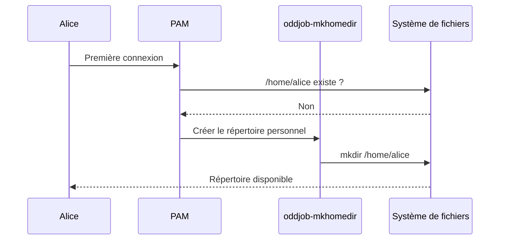

Cette fonctionnalité doit être activée explicitement lors de l'installation du client ou dans la configuration PAM.

---

## Précréer l'objet hôte

Deux méthodes sont possibles.

La première consiste à laisser l'installateur créer automatiquement l'objet hôte.

La seconde consiste à le créer à l'avance.

Depuis un poste administrateur :

```bash
kinit admin
```

Puis :

```bash
ipa host-add sentinel01.lab.sentinel.test \
    --ip-address=192.168.56.20
```

Vérifiez :

```bash
ipa host-show sentinel01.lab.sentinel.test
```

La précréation permet notamment :

- de préparer les groupes d'hôtes ;
- de contrôler les enregistrements DNS ;
- d'utiliser un mot de passe d'enrôlement ;
- d'intégrer l'opération dans un workflow.

---

## Lancer l'installation interactive

Sur le serveur Sentinel :

```bash
sudo ipa-client-install \
    --mkhomedir
```

L'installateur tente de découvrir automatiquement :

- le domaine ;
- le royaume ;
- les serveurs FreeIPA ;
- les enregistrements DNS.

Il affiche un résumé.

Par exemple :

```text
Discovery was successful!

Client hostname: sentinel01.lab.sentinel.test
Realm: LAB.SENTINEL.TEST
DNS Domain: lab.sentinel.test
IPA Server: ipa01.lab.sentinel.test
BaseDN: dc=lab,dc=sentinel,dc=test
```

Vérifiez chaque valeur.

L'installateur demande ensuite une confirmation.

```text
Proceed with fixed values and no DNS discovery? [no]:
```

ou une formulation équivalente selon le contexte.

Répondez selon les valeurs détectées.

---

## Authentifier l'enrôlement

L'installateur doit prouver qu'il est autorisé à inscrire la machine.

Dans un laboratoire, il peut demander :

```text
User authorized to enroll computers:
```

Utilisez :

```text
admin
```

Puis saisissez le mot de passe du compte FreeIPA.

Cette méthode est simple.

Elle n'est pas idéale pour une industrialisation à grande échelle.

En production, on préférera :

- un principal dédié à l'enrôlement ;
- un mot de passe à usage limité ;
- une automatisation Ansible ;
- une délégation contrôlée.

Le compte `admin` ne doit pas être utilisé partout sans nécessité.

---

## Installation non interactive

Une installation reproductible peut utiliser :

```bash
sudo ipa-client-install \
    --hostname=sentinel01.lab.sentinel.test \
    --domain=lab.sentinel.test \
    --realm=LAB.SENTINEL.TEST \
    --server=ipa01.lab.sentinel.test \
    --mkhomedir \
    --enable-dns-updates \
    --principal=admin
```

Le programme demandera encore le mot de passe si celui-ci n'est pas fourni.

Il est déconseillé de placer un mot de passe administrateur en clair :

- dans l'historique du shell ;
- dans un script ;
- dans un playbook non chiffré ;
- dans une ligne de commande visible par d'autres processus.

L'automatisation devra utiliser un mécanisme de secret adapté.

---

## Ce que fait `ipa-client-install`

L'installateur modifie plusieurs composants.

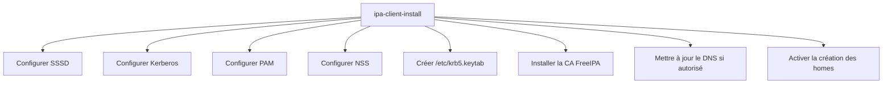

L'opération ne se limite donc pas à l'installation d'un paquet.

Elle construit une relation de confiance entre le client et le domaine.

---

## Le principal d'hôte

Chaque machine reçoit un principal Kerberos.

Pour Sentinel :

```text
host/sentinel01.lab.sentinel.test@LAB.SENTINEL.TEST
```

Ce principal représente le service générique d'hôte.

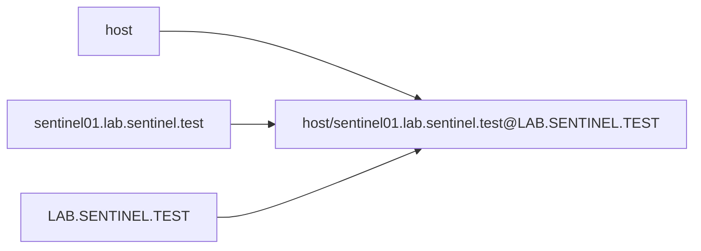

Il permet à la machine de s'authentifier auprès du domaine sans utiliser le mot de passe d'un utilisateur humain.

---

## Le fichier `/etc/krb5.keytab`

Le principal d'hôte possède une ou plusieurs clés secrètes.

Elles sont stockées dans :

```text
/etc/krb5.keytab
```

Ce fichier est extrêmement sensible.

Affichez ses permissions.

```bash
sudo ls -l /etc/krb5.keytab
```

Il doit généralement appartenir à :

```text
root:root
```

avec des permissions très restrictives.

Pour afficher son contenu logique :

```bash
sudo klist -k /etc/krb5.keytab
```

Vous devriez retrouver :

```text
host/sentinel01.lab.sentinel.test@LAB.SENTINEL.TEST
```

La commande n'affiche pas les clés secrètes.

Elle affiche les principaux et leurs versions.

---

## Un `keytab` est-il un mot de passe ?

Un `keytab` joue un rôle comparable à un magasin de secrets.

Mais il ne contient pas un mot de passe humain en clair.

Il contient des clés cryptographiques associées à des principaux Kerberos.

Ces clés permettent à un service ou à une machine de s'authentifier automatiquement.

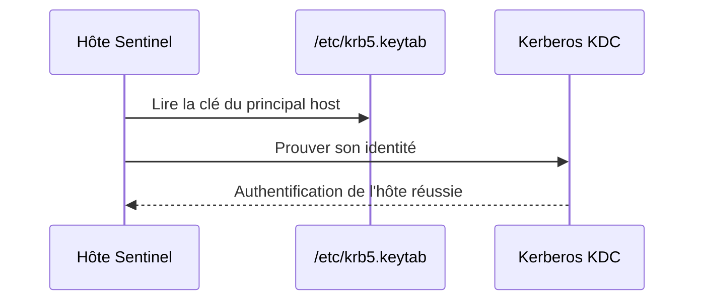

Le fichier doit être protégé comme une clé privée.

Une copie de ce fichier peut permettre à un attaquant d'usurper l'identité de la machine.

---

### 💎 Le point d'expertise

Le compte `root` peut lire `/etc/krb5.keytab`.

Un processus compromis disposant de privilèges suffisants peut donc extraire les secrets Kerberos de l'hôte.

Cela explique pourquoi les mécanismes suivants restent essentiels :

- SELinux ;
- les permissions strictes ;
- le sandboxing systemd ;
- la réduction des capacités ;
- la limitation des accès `sudo`.

L'intégration à FreeIPA ne protège pas une machine déjà totalement compromise.

Elle fournit une identité centralisée.

La sécurité locale de l'hôte reste indispensable.

---

## Obtenir un ticket avec le `keytab`

Il est possible de tester le principal d'hôte.

```bash
sudo kinit \
    -k \
    -t /etc/krb5.keytab \
    host/sentinel01.lab.sentinel.test
```

Vérifiez ensuite le ticket.

```bash
sudo klist
```

Attention.

La commande exécutée avec `sudo` peut utiliser un cache Kerberos différent de celui de votre utilisateur.

L'objectif est simplement de vérifier que la clé du `keytab` est valide.

Détruisez ensuite le ticket de test.

```bash
sudo kdestroy
```

---

## Vérifier l'objet hôte dans FreeIPA

Depuis le serveur ou un poste administrateur :

```bash
kinit admin
```

Puis :

```bash
ipa host-show sentinel01.lab.sentinel.test --all
```

Vous devriez retrouver notamment :

- le FQDN ;
- le principal de l'hôte ;
- l'état d'enrôlement ;
- les groupes d'hôtes ;
- les éventuelles clés SSH ;
- les certificats associés.

Listez les hôtes.

```bash
ipa host-find
```

L'hôte est désormais une identité gérée dans le domaine.

---

## Ajouter l'hôte au groupe Sentinel

Ajoutons-le à :

```text
sentinel-servers
```

```bash
ipa hostgroup-add-member sentinel-servers \
    --hosts=sentinel01.lab.sentinel.test
```

Vérifiez :

```bash
ipa hostgroup-show sentinel-servers
```

La sortie doit mentionner :

```text
Member hosts: sentinel01.lab.sentinel.test
```

Cette appartenance activera les politiques ciblant ce groupe.

Par exemple :

- les règles `sudo` ;
- les règles HBAC ;
- les futures politiques de Sentinel.

---

## Vérifier SSSD

Sur le client :

```bash
systemctl status sssd
```

Le service doit être actif.

Vérifiez également :

```bash
systemctl is-enabled sssd
```

Affichez la configuration.

```bash
sudo less /etc/sssd/sssd.conf
```

Le fichier doit contenir une section de domaine.

Par exemple :

```text
[domain/lab.sentinel.test]
```

Il peut également contenir des lignes proches de :

```text
id_provider = ipa
auth_provider = ipa
access_provider = ipa
chpass_provider = ipa
ipa_domain = lab.sentinel.test
ipa_server = _srv_
```

Le contenu exact dépend de la version et des options retenues.

---

## Protéger `sssd.conf`

Vérifiez les permissions.

```bash
sudo stat /etc/sssd/sssd.conf
```

Le fichier doit être fortement protégé.

Des permissions trop ouvertes peuvent empêcher SSSD de démarrer.

Par exemple, une configuration courante est :

```text
600
```

appartenant à :

```text
root:root
```

Si les permissions sont incorrectes :

```bash
sudo chown root:root /etc/sssd/sssd.conf
```

Puis :

```bash
sudo chmod 600 /etc/sssd/sssd.conf
```

Redémarrez SSSD uniquement si nécessaire.

```bash
sudo systemctl restart sssd
```

---

## Vérifier NSS

Testez une identité FreeIPA.

```bash
getent passwd alice
```

Puis :

```bash
id alice
```

Vous devez retrouver :

- son UID ;
- son GID ;
- ses groupes FreeIPA ;
- son répertoire personnel ;
- son shell.

Vérifiez qu'Alice n'est pas locale.

```bash
grep '^alice:' /etc/passwd
```

La commande ne doit normalement rien afficher.

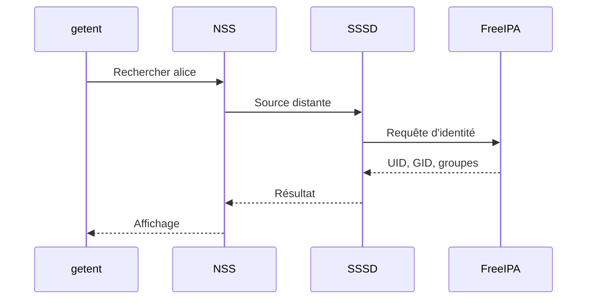

---

## Vérifier PAM

Essayez d'obtenir un ticket utilisateur.

```bash
kinit alice
```

Puis :

```bash
klist
```

Cette opération vérifie Kerberos.

Pour tester PAM, ouvrez une session.

Par exemple :

```bash
su - alice
```

ou, depuis une autre machine :

```bash
ssh alice@sentinel01.lab.sentinel.test
```

Le résultat dépend :

- des politiques HBAC ;
- des méthodes SSH autorisées ;
- de l'état du compte ;
- de la configuration PAM ;
- des clés ou mots de passe disponibles.

---

## Création automatique du répertoire personnel

Après la première connexion, vérifiez :

```bash
ls -ld /home/alice
```

Le répertoire doit avoir été créé si `--mkhomedir` est actif.

Vérifiez son propriétaire.

```bash
stat /home/alice
```

Le propriétaire doit correspondre à l'UID d'Alice.

Le groupe doit correspondre à son groupe principal.

Si le répertoire n'existe pas, vérifiez :

```bash
systemctl status oddjobd
```

Puis :

```bash
authselect current
```

La fonctionnalité de création automatique doit être activée dans le profil d'authentification.

---

## Vérifier `authselect`

Sur AlmaLinux, PAM et NSS sont généralement gérés par :

```text
authselect
```

Affichez le profil courant.

```bash
authselect current
```

Le résultat peut ressembler à :

```text
Profile ID: sssd
Enabled features:
- with-mkhomedir
```

La fonctionnalité :

```text
with-mkhomedir
```

indique que la création automatique des répertoires personnels est activée.

Évitez de modifier directement les fichiers générés par `authselect`.

Utilisez les profils et les fonctionnalités prévues.

---

## Vérifier le certificat de l'autorité

L'installation du client place normalement le certificat de l'autorité FreeIPA sur la machine.

Vérifiez :

```bash
ls -l /etc/ipa/ca.crt
```

Puis :

```bash
openssl x509 \
    -in /etc/ipa/ca.crt \
    -noout \
    -subject \
    -issuer \
    -dates \
    -fingerprint
```

Le client peut désormais vérifier les certificats délivrés par l'autorité du domaine.

Cette confiance sera utilisée lors de l'intégration TLS de Sentinel.

---

## Vérifier Kerberos

Affichez la configuration.

```bash
cat /etc/krb5.conf
```

Elle doit contenir ou inclure les informations nécessaires pour :

```text
LAB.SENTINEL.TEST
```

Testez :

```bash
kinit alice
```

Puis :

```bash
kvno host/sentinel01.lab.sentinel.test
```

La commande `kvno` demande un ticket de service pour le principal d'hôte.

Vérifiez ensuite :

```bash
klist
```

Vous devriez voir :

- le TGT d'Alice ;
- un ticket pour le service `host`.

Cela confirme que le client peut dialoguer correctement avec le KDC.

---

## Vérifier les politiques `sudo`

Ouvrez une session avec Bob.

```bash
ssh bob@sentinel01.lab.sentinel.test
```

Vérifiez son identité.

```bash
id
```

Puis ses droits.

```bash
sudo -l
```

La règle :

```text
sentinel-operators-rule
```

doit être visible si :

- Bob appartient à `sentinel-operators` ;
- le serveur appartient à `sentinel-servers` ;
- la règle est active ;
- le cache SSSD est à jour.

Testez les commandes autorisées et interdites décrites au chapitre précédent.

---

## Le cache hors ligne de SSSD

SSSD peut mettre en cache certaines identités et certains justificatifs d'authentification.

Cela permet à un utilisateur déjà connu de continuer à ouvrir une session lorsque FreeIPA est temporairement indisponible.

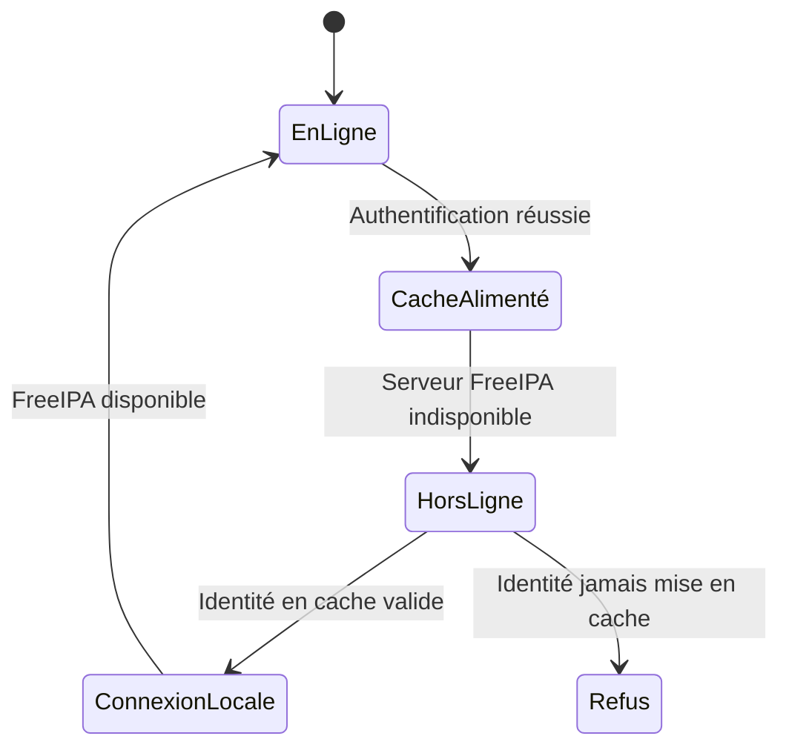

Cette fonctionnalité améliore la disponibilité.

Elle possède cependant des limites.

Un compte désactivé dans FreeIPA peut ne pas être immédiatement connu d'un client complètement isolé.

La politique de cache doit donc être adaptée au niveau de risque.

---

## Tester le comportement hors ligne

Ce test doit être réalisé uniquement dans un laboratoire.

Commencez par ouvrir une session avec Alice pendant que FreeIPA est disponible.

Fermez ensuite la session.

Simulez temporairement une perte de communication vers FreeIPA.

Par exemple, en modifiant prudemment le réseau du laboratoire ou en ajoutant une règle Firewalld temporaire et ciblée.

Essayez de vous reconnecter.

Selon la configuration SSSD, l'authentification peut fonctionner grâce au cache.

Rétablissez immédiatement la connectivité après le test.

Ne réalisez pas ce type d'expérience sur un serveur de production sans procédure de secours.

---

## Le fichier `keytab` et la rotation des clés

Les clés contenues dans un `keytab` possèdent un numéro de version.

On parle de :

```text
KVNO
```

pour *Key Version Number*.

Affichez le `keytab`.

```bash
sudo klist -k -e /etc/krb5.keytab
```

Vous verrez notamment :

- le KVNO ;
- le principal ;
- le type de chiffrement.

Lorsqu'une clé est renouvelée, le KVNO augmente.


Si le serveur et le client ne possèdent plus la même version, l'authentification du principal peut échouer.

---

## Diagnostiquer une erreur de `keytab`

Un message fréquent est :

```text
Preauthentication failed
```

ou :

```text
Key table entry not found
```

Vérifiez d'abord :

```bash
sudo klist -k /etc/krb5.keytab
```

Puis côté FreeIPA :

```bash
ipa host-show sentinel01.lab.sentinel.test --all
```

Vérifiez le principal demandé.

Il doit correspondre exactement au FQDN.

Une différence entre :

```text
sentinel01
```

et :

```text
sentinel01.lab.sentinel.test
```

peut suffire à provoquer un échec.

---

## Les enregistrements DNS dynamiques

L'option :

```text
--enable-dns-updates
```

permet au client de mettre à jour certains enregistrements DNS.

Cette fonctionnalité est utile lorsque :

- les adresses peuvent changer ;
- FreeIPA gère le DNS ;
- les mises à jour sécurisées sont correctement configurées.

Sur un serveur avec adresse fixe, le besoin est moins fréquent.

Vérifiez l'adresse enregistrée.

```bash
dig sentinel01.lab.sentinel.test
```

Puis la zone inverse.

```bash
dig -x 192.168.56.20
```

Les deux résultats doivent être cohérents.

---

## Ajouter une clé SSH d'hôte

Lors de l'enrôlement, FreeIPA peut stocker les clés publiques SSH de la machine.

Affichez l'objet hôte.

```bash
ipa host-show sentinel01.lab.sentinel.test --all
```

Les empreintes ou clés d'hôte SSH peuvent y apparaître.

Cette centralisation permet aux clients compatibles d'obtenir les clés d'hôtes via SSSD.

Elle réduit le risque d'accepter aveuglément une nouvelle clé lors d'une première connexion.

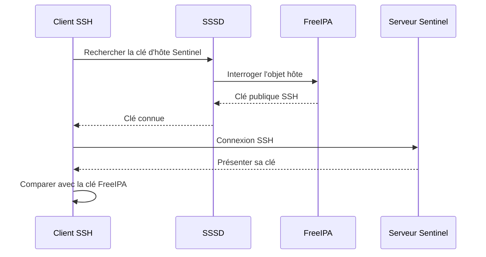

Nous approfondirons l'intégration SSH dans les campagnes concernées.

---

## Les groupes d'hôtes comme périmètres

L'appartenance à un groupe d'hôtes ne modifie rien par elle-même.

Elle sert de critère pour les politiques.

Par exemple :

```text
sentinel-servers
```

peut être utilisé dans :

- les règles `sudo` ;
- les règles HBAC ;
- certaines politiques de certificat ;
- les opérations d'administration.

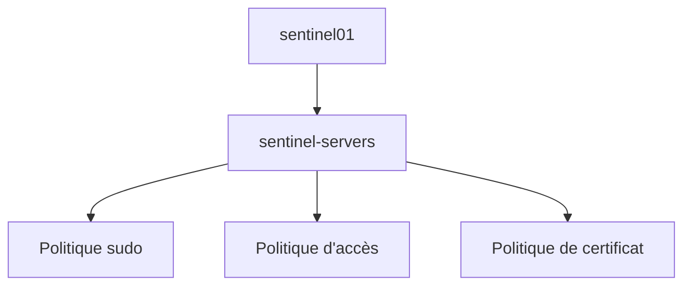

Le groupe ne contient pas la politique.

Il définit le périmètre auquel la politique peut s'appliquer.

---

## Les règles HBAC

HBAC signifie :

```text
Host-Based Access Control
```

Ce mécanisme permet de contrôler :

- quels utilisateurs ;
- peuvent accéder ;
- à quels hôtes ;
- via quels services PAM.

Une règle peut par exemple exprimer :

> Les membres de `sentinel-operators` peuvent utiliser SSH sur les hôtes de `sentinel-servers`.

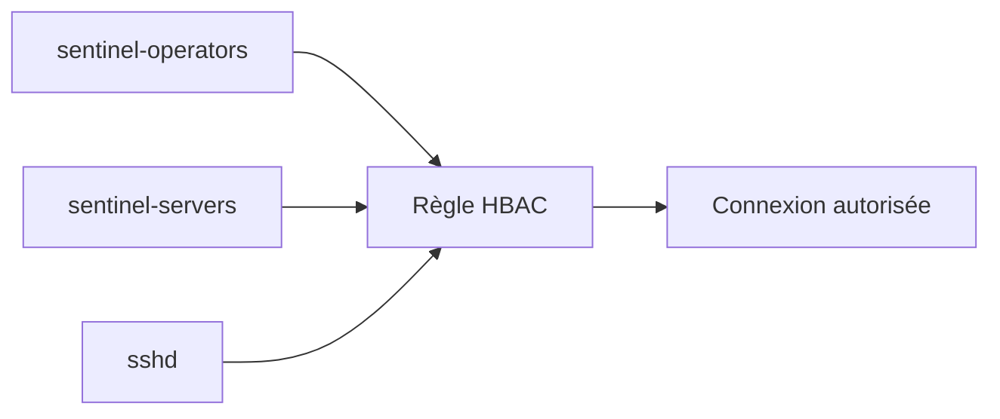

HBAC ne remplace pas :

- SSH ;
- PAM ;
- les mots de passe ;
- les clés ;
- le pare-feu.

Il ajoute une décision d'autorisation centralisée.

---

## La règle `allow_all`

Une installation FreeIPA possède souvent une règle HBAC nommée :

```text
allow_all
```

Elle autorise largement les utilisateurs du domaine.

Cette règle facilite le démarrage.

Mais elle empêche d'obtenir une politique réellement restrictive.

Affichez-la.

```bash
ipa hbacrule-show allow_all
```

Ne la désactivez pas immédiatement.

Commencez par créer et tester des règles spécifiques.

Une désactivation prématurée peut bloquer toutes les connexions.

La migration vers une politique restrictive doit être progressive.

---

## Tester une règle HBAC

FreeIPA fournit une commande de test.

Par exemple :

```bash
ipa hbactest \
    --user=bob \
    --host=sentinel01.lab.sentinel.test \
    --service=sshd
```

Le résultat indique si l'accès serait autorisé.

Ce test est extrêmement utile.

Il permet de vérifier une politique avant de l'appliquer réellement.

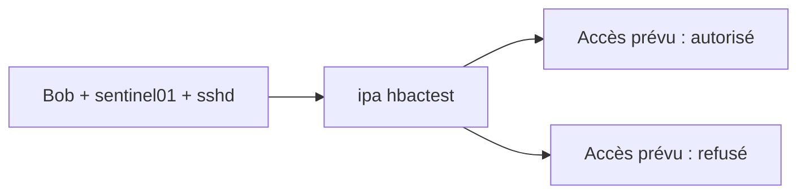

Il faut toutefois compléter ce test par une connexion réelle.

Une politique HBAC correcte ne garantit pas que :

- le DNS fonctionne ;
- le mot de passe est valide ;
- SSH accepte cette méthode ;
- PAM est correctement configuré.

---

## Créer une règle HBAC pour Sentinel

Créons une règle.

```bash
ipa hbacrule-add sentinel-ssh-access \
    --desc="Accès SSH des opérateurs aux serveurs Sentinel"
```

Ajoutons le groupe d'utilisateurs.

```bash
ipa hbacrule-add-user sentinel-ssh-access \
    --groups=sentinel-operators
```

Ajoutons le groupe d'hôtes.

```bash
ipa hbacrule-add-host sentinel-ssh-access \
    --hostgroups=sentinel-servers
```

Ajoutons le service SSH.

```bash
ipa hbacrule-add-service sentinel-ssh-access \
    --hbacsvcs=sshd
```

Vérifiez :

```bash
ipa hbacrule-show sentinel-ssh-access --all
```

---

## Tester la règle avant de toucher à `allow_all`

```bash
ipa hbactest \
    --user=bob \
    --host=sentinel01.lab.sentinel.test \
    --service=sshd
```

Le résultat doit indiquer une autorisation.

Testez Claire.

```bash
ipa hbactest \
    --user=claire \
    --host=sentinel01.lab.sentinel.test \
    --service=sshd
```

Selon les groupes définis, l'accès peut être refusé.

Testez également un autre hôte.

La règle ne doit pas s'y appliquer.

Une fois toutes les règles nécessaires créées et testées, la règle `allow_all` pourra être désactivée avec une grande prudence.

---

### 🧠 Comment pense un architecte ?

Un architecte considère l'enrôlement comme l'entrée d'une machine dans un périmètre de confiance.

Il ne demande pas seulement :

> L'installation du client a-t-elle réussi ?

Il demande :

- Qui a autorisé l'enrôlement ?
- Le nom d'hôte est-il conforme ?
- Le DNS est-il maîtrisé ?
- Le `keytab` est-il protégé ?
- À quels groupes d'hôtes la machine appartient-elle ?
- Quelles politiques s'appliquent automatiquement ?
- Comment retirer proprement la machine du domaine ?

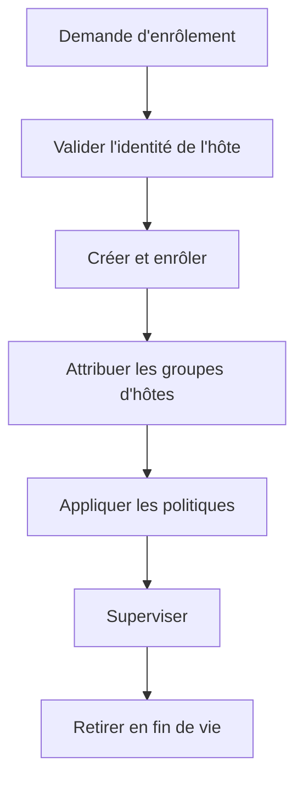

L'enrôlement possède lui aussi un cycle de vie.

---

### ⚔️ Comment pense un attaquant ?

Un attaquant cherche à compromettre l'identité d'un hôte.

Il s'intéresse notamment :

- au fichier `/etc/krb5.keytab` ;
- aux clés SSH de la machine ;
- aux certificats de service ;
- aux comptes capables d'enrôler de nouveaux hôtes ;
- aux objets hôtes abandonnés ;
- aux DNS modifiables.

Une machine fantôme encore enregistrée peut constituer une opportunité.

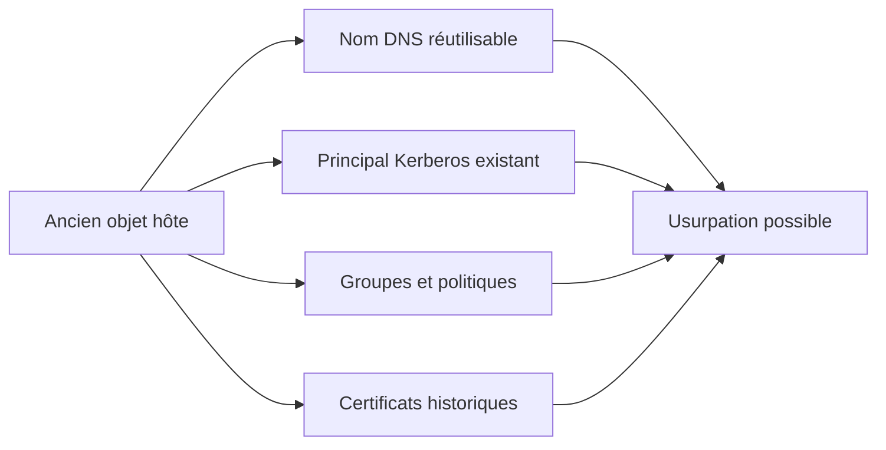

La suppression d'un serveur physique ou virtuel doit donc être accompagnée d'un retrait dans FreeIPA.

---

### 📚 Culture technique

Dans un domaine Windows, l'intégration d'une machine à Active Directory crée également une identité d'ordinateur.

FreeIPA suit une philosophie comparable pour les systèmes Linux.

L'hôte possède :

- un objet d'annuaire ;
- des secrets ;
- des politiques ;
- une relation de confiance avec le domaine.

Cette convergence montre qu'une machine moderne ne doit plus être considérée uniquement comme une adresse IP.

Elle possède une identité dans le système d'information.

---

### ⚠️ Piège classique

Une erreur fréquente consiste à copier une machine virtuelle déjà enrôlée.

Imaginons que `sentinel01` soit clonée pour créer `sentinel02`.

La copie peut contenir :

- le même `/etc/krb5.keytab` ;
- la même configuration SSSD ;
- le même nom d'hôte ;
- les mêmes certificats ;
- les mêmes clés SSH.

Les deux machines prétendent alors posséder la même identité.

Cette situation est dangereuse.

Avant de créer un modèle de machine virtuelle, il faut :

- désenrôler le système ;
- supprimer les secrets spécifiques ;
- régénérer les identités ;
- utiliser des outils de préparation d'image.

Un clone ne doit jamais réutiliser le `keytab` d'un autre hôte.

---

## Désenrôler un client

Lorsqu'une machine quitte le domaine, utilisez :

```bash
sudo ipa-client-install --uninstall
```

Cette commande supprime la configuration client locale.

Elle retire notamment les intégrations réalisées par l'installateur.

Cependant, l'objet hôte peut encore exister côté FreeIPA.

Depuis un poste administrateur :

```bash
ipa host-del sentinel01.lab.sentinel.test
```

Avant la suppression, examinez les dépendances :

- groupes d'hôtes ;
- règles `sudo` ;
- règles HBAC ;
- services ;
- certificats ;
- DNS.

Le retrait complet est une opération en deux dimensions.

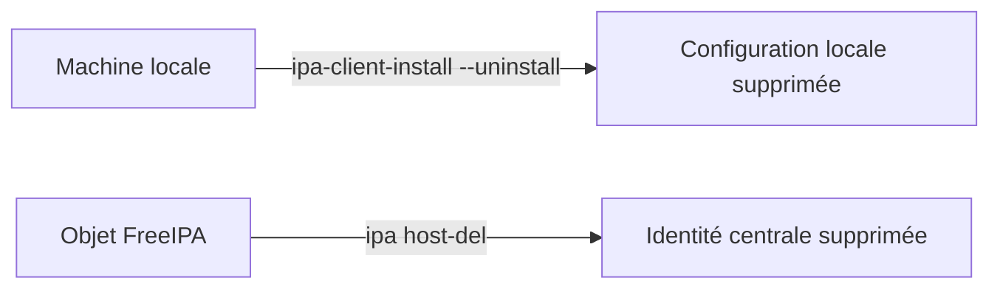

Les deux opérations sont complémentaires.

---

## Réenrôler un client

Un client peut parfois être réenrôlé après :

- une restauration ;
- une perte de `keytab` ;
- une reconstruction ;
- une désinstallation.

La bonne procédure dépend de l'état de l'objet hôte.

Il peut être nécessaire :

- de supprimer l'ancien objet ;
- de réinitialiser la clé d'enrôlement ;
- de forcer l'installation ;
- de vérifier les enregistrements DNS.

L'option :

```text
--force-join
```

peut être utile dans certains scénarios.

Elle ne doit pas être utilisée sans comprendre pourquoi la relation précédente est invalide.

Forcer l'enrôlement masque parfois un problème de nom, de DNS ou de secrets.

---

## Diagnostiquer l'enrôlement

Lorsqu'un client ne rejoint pas le domaine, commencez par les fondations.

### Vérifier le FQDN

```bash
hostname -f
```

### Vérifier le DNS

```bash
dig ipa01.lab.sentinel.test
```

```bash
dig SRV _ldap._tcp.lab.sentinel.test
```

```bash
dig SRV _kerberos._udp.lab.sentinel.test
```

### Vérifier l'heure

```bash
chronyc tracking
```

### Vérifier le réseau

```bash
nc -vz ipa01.lab.sentinel.test 443
```

```bash
nc -vz ipa01.lab.sentinel.test 389
```

```bash
nc -vz ipa01.lab.sentinel.test 88
```

Pour UDP, utilisez des outils adaptés et complétez par les tests applicatifs.

### Vérifier les journaux

```bash
sudo less /var/log/ipaclient-install.log
```

Ce fichier constitue la première source d'information en cas d'échec de l'installation du client.

---

## Diagnostiquer SSSD

Vérifiez le service.

```bash
systemctl status sssd
```

Puis :

```bash
sudo journalctl -u sssd
```

Consultez les journaux.

```bash
sudo ls -l /var/log/sssd/
```

Testez la configuration avec les outils disponibles.

```bash
sudo sssctl config-check
```

Affichez les informations du domaine.

```bash
sudo sssctl domain-list
```

Puis :

```bash
sudo sssctl domain-status lab.sentinel.test
```

Les commandes exactes disponibles dépendent de la version de SSSD.

---

## Diagnostiquer une identité introuvable

Si :

```bash
id alice
```

échoue, vérifiez d'abord côté FreeIPA.

```bash
ipa user-show alice
```

Puis côté client :

```bash
sudo sss_cache -E
```

Réessayez :

```bash
getent passwd alice
```

Vérifiez ensuite :

```bash
sudo sssctl user-checks alice
```

Puis les journaux du domaine.

```bash
sudo grep -Ri alice /var/log/sssd/
```

Le chemin de diagnostic est le suivant.

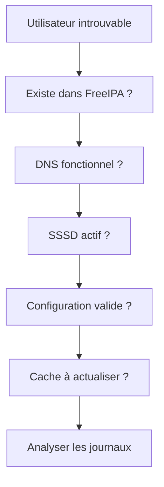

---

## Diagnostiquer une connexion refusée

Une identité peut être résolue correctement mais ne pas pouvoir se connecter.

Dans ce cas :

```bash
id alice
```

fonctionne.

Mais :

```bash
ssh alice@sentinel01.lab.sentinel.test
```

échoue.

Les causes possibles incluent :

- mot de passe incorrect ;
- compte désactivé ;
- règle HBAC ;
- configuration SSH ;
- PAM ;
- répertoire personnel ;
- shell `nologin` ;
- clé SSH invalide.

Vérifiez :

```bash
ipa user-show alice
```

Puis :

```bash
ipa hbactest \
    --user=alice \
    --host=sentinel01.lab.sentinel.test \
    --service=sshd
```

Examinez ensuite :

```bash
sudo journalctl -u sshd
```

Et :

```bash
sudo journalctl -u sssd
```

---

## Laboratoire AlmaLinux

### Mission

Enrôler :

```text
sentinel01.lab.sentinel.test
```

dans le domaine :

```text
LAB.SENTINEL.TEST
```

Puis valider :

- les identités ;
- les groupes ;
- les répertoires personnels ;
- les politiques `sudo` ;
- une règle HBAC.

---

### Étape 1 — Vérifier le FQDN

```bash
hostname -f
```

Résultat attendu :

```text
sentinel01.lab.sentinel.test
```

---

### Étape 2 — Vérifier la résolution DNS

```bash
dig ipa01.lab.sentinel.test
```

```bash
dig sentinel01.lab.sentinel.test
```

```bash
dig SRV _ldap._tcp.lab.sentinel.test
```

```bash
dig SRV _kerberos._udp.lab.sentinel.test
```

---

### Étape 3 — Vérifier l'heure

```bash
chronyc tracking
```

```bash
timedatectl
```

---

### Étape 4 — Installer les paquets

```bash
sudo dnf install -y \
    ipa-client \
    sssd \
    oddjob \
    oddjob-mkhomedir
```

---

### Étape 5 — Précréer l'hôte

Depuis une session administrateur :

```bash
kinit admin
```

Puis :

```bash
ipa host-add sentinel01.lab.sentinel.test \
    --ip-address=192.168.56.20
```

Adaptez l'adresse IP.

---

### Étape 6 — Installer le client

Sur Sentinel :

```bash
sudo ipa-client-install \
    --mkhomedir \
    --enable-dns-updates
```

Utilisez un compte autorisé à enrôler les hôtes.

Vérifiez attentivement les valeurs détectées.

---

### Étape 7 — Vérifier les services

```bash
systemctl status sssd
```

```bash
systemctl status oddjobd
```

---

### Étape 8 — Vérifier le `keytab`

```bash
sudo ls -l /etc/krb5.keytab
```

```bash
sudo klist -k /etc/krb5.keytab
```

Le principal d'hôte doit être présent.

---

### Étape 9 — Ajouter l'hôte au groupe Sentinel

Depuis le serveur FreeIPA ou un poste d'administration :

```bash
ipa hostgroup-add-member sentinel-servers \
    --hosts=sentinel01.lab.sentinel.test
```

Vérifiez :

```bash
ipa hostgroup-show sentinel-servers
```

---

### Étape 10 — Tester une identité

Sur Sentinel :

```bash
id alice
```

```bash
getent passwd alice
```

```bash
id bob
```

```bash
id claire
```

---

### Étape 11 — Tester Kerberos

```bash
kinit alice
```

```bash
klist
```

Puis :

```bash
kvno host/sentinel01.lab.sentinel.test
```

---

### Étape 12 — Tester le répertoire personnel

Ouvrez une session Alice.

```bash
su - alice
```

Ou :

```bash
ssh alice@sentinel01.lab.sentinel.test
```

Vérifiez ensuite :

```bash
ls -ld /home/alice
```

---

### Étape 13 — Tester la règle `sudo`

Ouvrez une session Bob.

```bash
ssh bob@sentinel01.lab.sentinel.test
```

Puis :

```bash
sudo -l
```

Testez :

```bash
sudo /usr/bin/systemctl status sentinel
```

Puis un refus.

```bash
sudo /usr/bin/systemctl restart sshd
```

---

### Étape 14 — Créer la règle HBAC

Depuis une session administrateur :

```bash
ipa hbacrule-add sentinel-ssh-access \
    --desc="Accès SSH des opérateurs aux serveurs Sentinel"
```

```bash
ipa hbacrule-add-user sentinel-ssh-access \
    --groups=sentinel-operators
```

```bash
ipa hbacrule-add-host sentinel-ssh-access \
    --hostgroups=sentinel-servers
```

```bash
ipa hbacrule-add-service sentinel-ssh-access \
    --hbacsvcs=sshd
```

---

### Étape 15 — Tester la règle HBAC

```bash
ipa hbactest \
    --user=bob \
    --host=sentinel01.lab.sentinel.test \
    --service=sshd
```

Puis testez Claire.

```bash
ipa hbactest \
    --user=claire \
    --host=sentinel01.lab.sentinel.test \
    --service=sshd
```

Ne désactivez pas encore `allow_all` si toutes les règles nécessaires ne sont pas prêtes.

---

### Étape 16 — Examiner les journaux

Sur Sentinel :

```bash
sudo journalctl -u sssd
```

```bash
sudo journalctl -u sshd
```

```bash
sudo journalctl _COMM=sudo
```

Puis :

```bash
sudo ls -l /var/log/sssd/
```

---

## Mission d'ingénieur

Produisez une fiche d'enrôlement pour le serveur Sentinel.

Elle doit contenir :

```text
FQDN :

Adresse IP :

Domaine FreeIPA :

Royaume Kerberos :

Serveur FreeIPA découvert :

Serveur DNS utilisé :

Source de temps :

Objet hôte créé :

Principal Kerberos de l'hôte :

Emplacement du keytab :

Groupe d'hôtes :

Règles sudo applicables :

Règles HBAC applicables :

Certificat CA installé :

Méthode de création du home :

Procédure de désenrôlement :
```

Ajoutez un tableau de validation.

| Contrôle | Commande | Résultat attendu | Résultat obtenu |
|----------|----------|------------------|-----------------|
| FQDN | `hostname -f` | Nom complet correct | |
| DNS LDAP | `dig SRV _ldap._tcp...` | Serveur FreeIPA découvert | |
| DNS Kerberos | `dig SRV _kerberos._udp...` | KDC découvert | |
| SSSD | `systemctl status sssd` | Actif | |
| Keytab | `klist -k` | Principal `host/...` présent | |
| NSS | `id alice` | Identité résolue | |
| Kerberos | `kinit alice` | TGT obtenu | |
| Home | `ls -ld /home/alice` | Répertoire créé | |
| sudo | `sudo -l` | Règles Sentinel visibles | |
| HBAC | `ipa hbactest` | Résultat conforme | |

Enfin, documentez les opérations de fin de vie.

```text
1. Retirer l'hôte des groupes.
2. Révoquer les certificats de service.
3. Supprimer les principaux inutiles.
4. Désenrôler le client.
5. Supprimer l'objet hôte.
6. Supprimer ou corriger les enregistrements DNS.
7. Archiver les journaux nécessaires.
8. Détruire les secrets et les disques.
```

---

## Impact sur Sentinel

Sentinel fonctionne maintenant sur un hôte membre du domaine.

Cette évolution change profondément son environnement.

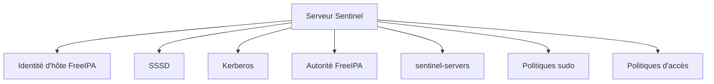

Les utilisateurs du domaine peuvent être résolus.

Les groupes peuvent être utilisés pour les permissions.

Les politiques `sudo` peuvent être appliquées.

Les connexions peuvent être limitées avec HBAC.

L'hôte possède également une identité cryptographique grâce à son `keytab`.

La prochaine étape consistera à exploiter l'autorité de certification FreeIPA.

Sentinel obtiendra alors un certificat de service lié à son identité DNS et à son principal Kerberos.

---

## Synthèse

- Un hôte FreeIPA possède une identité propre dans le domaine.
- L'enrôlement crée un objet d'annuaire, un principal Kerberos et un `keytab`.
- Le FQDN, le DNS et la synchronisation horaire doivent être corrects avant l'installation.
- `ipa-client-install` configure notamment SSSD, Kerberos, PAM, NSS et la confiance envers la CA.
- `/etc/krb5.keytab` contient des clés cryptographiques sensibles.
- Le `keytab` ne doit jamais être copié dans une image ou vers un autre hôte.
- SSSD fournit les identités, les groupes, les règles `sudo` et certaines décisions d'accès.
- `oddjob-mkhomedir` peut créer les répertoires personnels lors de la première connexion.
- Les groupes d'hôtes permettent de cibler les politiques.
- HBAC contrôle quels utilisateurs peuvent accéder à quels services sur quels hôtes.
- Une machine doit être retirée proprement du domaine lors de sa fin de vie.
- La suppression locale du client et la suppression de l'objet FreeIPA sont deux opérations distinctes.

---

## Infographie de révision

```text
                       GESTION D'UN HÔTE FREEIPA

                             MACHINE ALMALINUX
                                    |
                                    v
                    FQDN stable et DNS cohérent
                                    |
                                    v
                      Heure correctement synchronisée
                                    |
                                    v
                         ipa-client-install
                                    |
        +---------------------------+---------------------------+
        |                           |                           |
        v                           v                           v
      SSSD                       Kerberos                     PAM / NSS
        |                           |                           |
        v                           v                           v
 Identités et groupes       Principal d'hôte          Connexions utilisateur
 Règles sudo et accès       /etc/krb5.keytab           et création des homes

──────────────────────────────────────────────────────────────────────────────

                      IDENTITÉ DE LA MACHINE

        Objet hôte FreeIPA

        sentinel01.lab.sentinel.test
                    |
                    v
        Principal Kerberos

        host/sentinel01.lab.sentinel.test@LAB.SENTINEL.TEST
                    |
                    v
        Clés cryptographiques

        /etc/krb5.keytab

──────────────────────────────────────────────────────────────────────────────

                     APPLICATION DES POLITIQUES

       Bob
        |
        v
  sentinel-operators
        |
        +----------------------------+
        |                            |
        v                            v
  Règle HBAC                   Règle sudo
        |                            |
        v                            v
  Accès SSH autorisé        Redémarrage Sentinel
        \                            /
         \                          /
          v                        v
           sentinel01 appartient à
               sentinel-servers

──────────────────────────────────────────────────────────────────────────────

                     FIN DE VIE D'UN HÔTE

       Retirer des groupes
                |
                v
       Révoquer les certificats
                |
                v
       Désenrôler le client
                |
                v
       Supprimer l'objet FreeIPA
                |
                v
       Nettoyer le DNS et les secrets

──────────────────────────────────────────────────────────────────────────────

       Une machine enrôlée n'est plus un simple serveur.

       Elle possède une identité, des secrets,
       des groupes et des politiques dans le domaine.
```

## Pour aller plus loin

Le serveur Sentinel possède désormais une identité dans FreeIPA.

Il peut prouver qu'il est :

```text
sentinel01.lab.sentinel.test
```

grâce à son principal Kerberos et à son `keytab`.

Mais Sentinel devra également établir des communications TLS.

Pour cela, il lui faudra :

- une clé privée ;
- un certificat X.509 ;
- une identité DNS correcte ;
- une chaîne de confiance ;
- un mécanisme de renouvellement ;
- une procédure de révocation.

FreeIPA intègre une autorité de certification complète grâce à Dogtag PKI.

Il peut délivrer des certificats aux hôtes et aux services du domaine.

Dans le prochain chapitre, nous allons créer une identité de service pour Sentinel, demander son certificat, l'associer à son principal Kerberos et automatiser son renouvellement avec `certmonger`.

---

← [8.6 — Politiques `sudo`](8.6-politiques-sudo.md) · [8.8 — Certificats](8.8-certificats.md) →
