# 8.8 Certificats

> *« Dans une infrastructure moderne, l'identité ne concerne pas seulement les utilisateurs et les machines. Les services doivent eux aussi pouvoir prouver qui ils sont. »*

---

## Vous êtes ici

```text
PARTIE II — Industrialiser la sécurité

Campagne 8  [████████░░]

      8.1 Présentation de FreeIPA ✔
      8.2 Architecture interne ✔
      8.3 Installation ✔
      8.4 Gestion des utilisateurs ✔
      8.5 Groupes et rôles ✔
      8.6 Politiques sudo ✔
      8.7 Gestion des hôtes ✔
   ►  8.8 Certificats
      8.9 Intégration de Sentinel
      8.10 Mission : administrer une infrastructure avec FreeIPA
```

---

## Objectifs pédagogiques

À la fin de ce chapitre, vous serez capable de :

- comprendre le rôle des certificats dans FreeIPA ;
- distinguer l'identité d'un utilisateur, d'un hôte et d'un service ;
- comprendre comment Dogtag PKI s'intègre à FreeIPA ;
- demander un certificat pour un hôte ou un service ;
- comprendre le rôle de `certmonger` ;
- préparer Sentinel à utiliser une PKI d'entreprise.

---

## Pourquoi ce chapitre existe

Nous avons désormais un domaine FreeIPA.

Nous avons des utilisateurs.

Nous avons des groupes.

Nous avons enrôlé notre serveur Sentinel.

Celui-ci possède désormais une identité Kerberos.

Mais cette identité ne suffit pas toujours.

Imaginons que Sentinel expose une API HTTPS.

Comment un client peut-il vérifier qu'il dialogue bien avec **le véritable serveur Sentinel** ?

Comment empêcher un attaquant de présenter un faux serveur ?

Le mécanisme utilisé est le certificat X.509.

Il permet au serveur de prouver son identité de manière cryptographique.

Nous avons déjà étudié les certificats dans la campagne consacrée au TLS.

Ici, nous allons voir comment **FreeIPA industrialise leur gestion**.

---

# Une identité supplémentaire

Un serveur FreeIPA connaît déjà notre machine.

```text
sentinel01.lab.sentinel.test
```

Elle possède :

- un objet LDAP ;
- un principal Kerberos ;
- un fichier `keytab`.

Mais une connexion HTTPS ne repose pas sur Kerberos.

Elle repose sur TLS.

Il faut donc fournir un certificat.

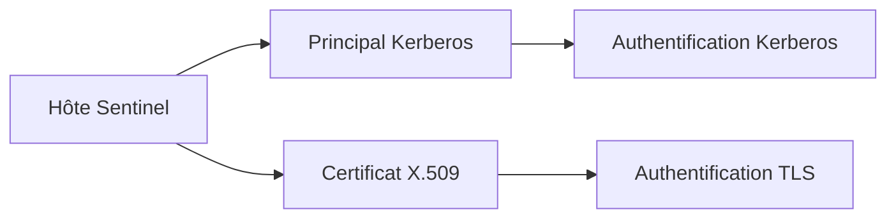

Deux mécanismes.

Deux usages.

Une même identité.

---

# Pourquoi ne pas créer soi-même les certificats ?

Nous pourrions utiliser OpenSSL.

Créer une clé privée.

Créer une CSR.

Signer le certificat.

Le copier sur le serveur.

Le renouveler manuellement.

Cette méthode fonctionne.

Mais elle devient rapidement difficile à maintenir.

Imaginons maintenant :

- cinquante serveurs Sentinel ;
- plusieurs certificats par serveur ;
- des certificats expirant tous les ans ;
- des révocations ;
- plusieurs administrateurs.

La gestion devient vite complexe.

C'est précisément le problème que FreeIPA cherche à résoudre.

---

# L'autorité de certification de FreeIPA

FreeIPA embarque une véritable PKI.

Cette PKI repose sur **Dogtag Certificate System**.

Dogtag est une autorité de certification complète.

Elle peut :

- délivrer des certificats ;
- révoquer des certificats ;
- publier des listes de révocation ;
- gérer plusieurs profils de certificats ;
- assurer le renouvellement.

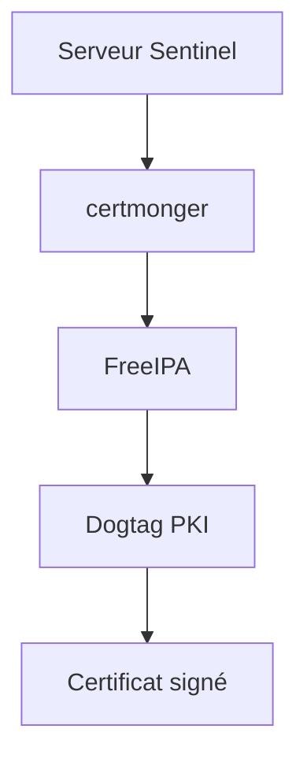

FreeIPA ne signe donc pas directement les certificats.

Il délègue cette opération à Dogtag.


---

# Les composants de la chaîne de confiance

Pour bien comprendre le fonctionnement de FreeIPA, il faut distinguer plusieurs éléments.

Commençons par la clé privée.

Elle est générée sur le serveur Sentinel.

Elle **ne doit jamais quitter la machine**.

```text
sentinel01

┌───────────────────────┐
│ Clé privée            │
│ 🔒 Strictement locale │
└───────────────────────┘
```

Vient ensuite la demande de certificat.

On parle de **CSR** (*Certificate Signing Request*).

Cette demande contient :

- la clé publique ;
- le nom du service ;
- les informations d'identité ;
- les extensions souhaitées.

Elle peut être transmise sans risque majeur.

Enfin, l'autorité de certification renvoie un certificat signé.

Celui-ci pourra être distribué librement.

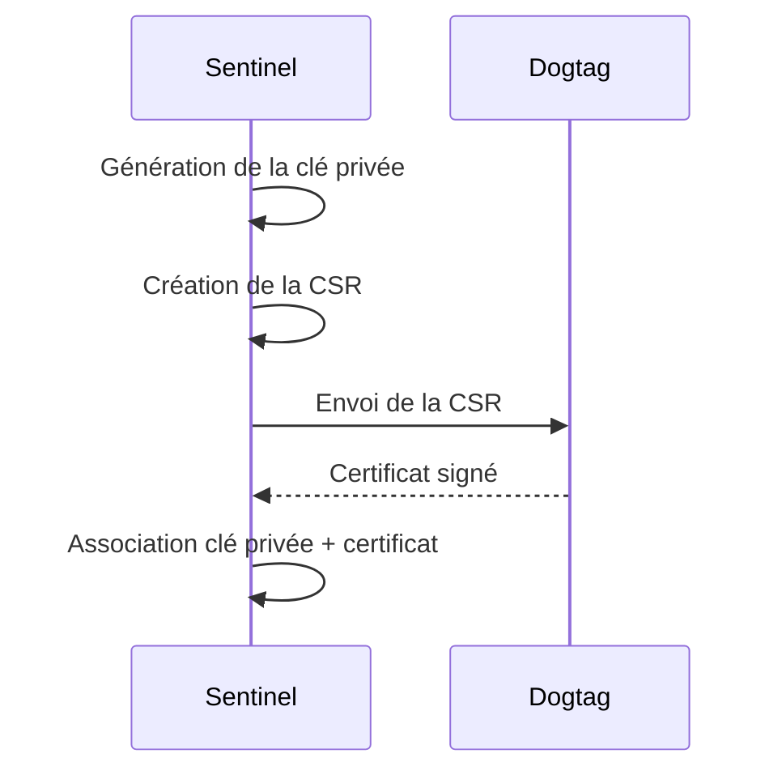

La clé privée ne quitte jamais le serveur.

C'est une règle fondamentale d'une PKI.

---

# Le certificat ne contient pas le secret

Il est fréquent de confondre :

```text
clé privée
```

et

```text
certificat
```

Le certificat ne contient **aucun secret**.

Il contient principalement :

- la clé publique ;
- l'identité du sujet ;
- l'autorité de certification ;
- la période de validité ;
- les usages autorisés ;
- la signature de la CA.

On peut le représenter ainsi.

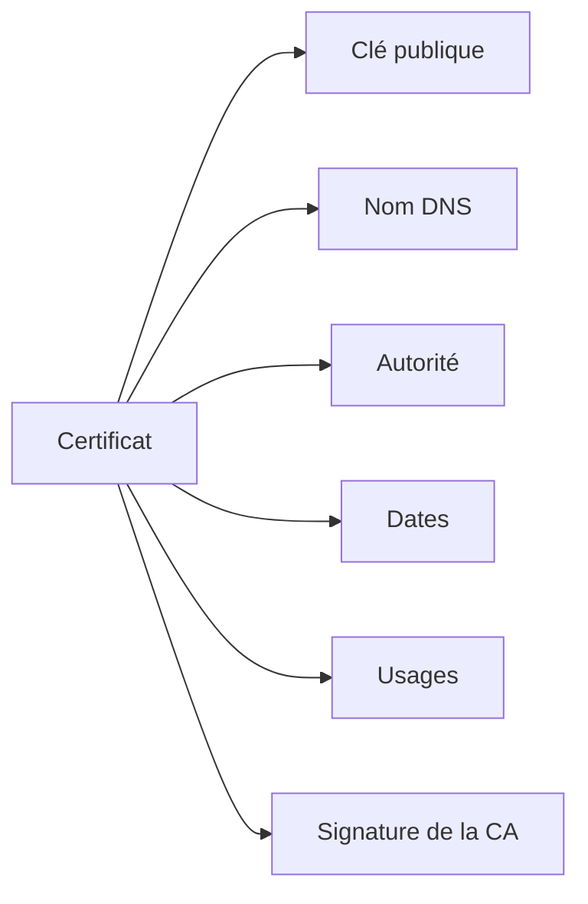

En revanche, la clé privée permet de prouver que l'on est bien le propriétaire du certificat.

C'est pourquoi elle doit rester strictement protégée.

---

# L'identité portée par le certificat

Notre serveur possède le nom :

```text
sentinel01.lab.sentinel.test
```

C'est cette identité qui apparaîtra dans le certificat.

Par exemple :

```text
Subject:
CN=sentinel01.lab.sentinel.test
```

Aujourd'hui, les clients TLS utilisent principalement les **Subject Alternative Names**.

On retrouve alors :

```text
DNS:sentinel01.lab.sentinel.test
```

Le client qui se connecte vérifiera que :

- le certificat est signé par une CA de confiance ;
- le certificat est encore valide ;
- le nom DNS demandé est bien présent.

Si l'un de ces contrôles échoue, la connexion TLS est rejetée.

---

# Pourquoi le SAN est indispensable ?

Imaginons que Sentinel présente le certificat suivant.

```text
CN=sentinel01.lab.sentinel.test
```

Mais qu'aucun SAN ne soit présent.

Les anciennes implémentations TLS pouvaient accepter ce certificat.

Les implémentations modernes vérifient principalement :

```text
Subject Alternative Name
```

Le certificat doit donc contenir :

```text
DNS:sentinel01.lab.sentinel.test
```

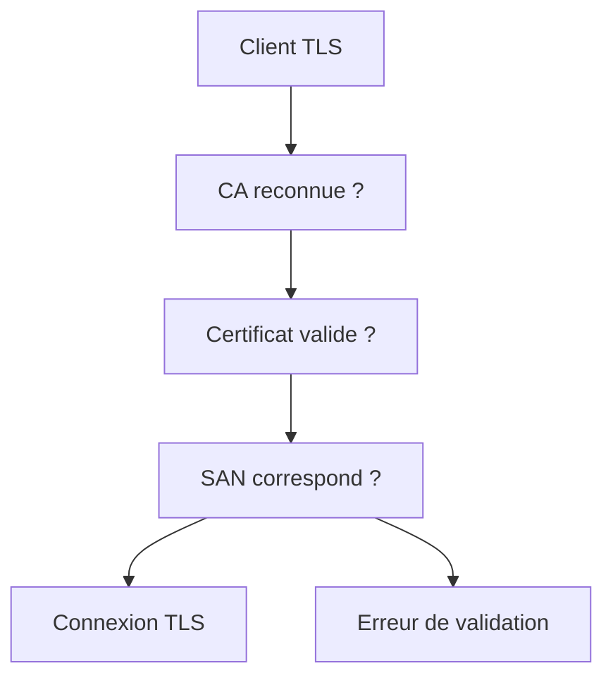

Ce point est particulièrement important.

Dans vos développements Qt, nous avons déjà rencontré un problème de validation lié au nom du certificat.

Grâce à FreeIPA, ce type d'erreur devient beaucoup plus rare lorsque les certificats sont correctement demandés.

---

# Où intervient `certmonger` ?

Créer un certificat une seule fois est relativement simple.

Le renouveler automatiquement l'est beaucoup moins.

C'est précisément le rôle de **certmonger**.

Il s'agit d'un démon chargé de surveiller les certificats.

Il sait notamment :

- demander un nouveau certificat ;
- renouveler un certificat avant son expiration ;
- appeler automatiquement FreeIPA ;
- installer le nouveau certificat.

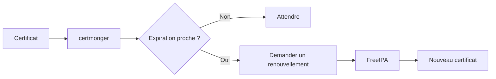

Dans une infrastructure de plusieurs centaines de serveurs, cette automatisation est indispensable.

Sans elle, le risque d'expiration d'un certificat devient très important.

---

# Pourquoi renouveler avant l'expiration ?

Un certificat expiré provoque souvent une interruption de service.

Par exemple :

```text
Navigateur

↓

Connexion HTTPS

↓

Certificat expiré

↓

Connexion refusée
```

Ou encore :

```text
API REST

↓

TLS

↓

Certificat expiré

↓

Toutes les connexions échouent
```

Une bonne PKI ne renouvelle jamais un certificat **après** son expiration.

Elle le renouvelle **avant**, de manière transparente.

C'est précisément ce que nous allons mettre en place avec `certmonger` dans la prochaine partie.

# Demander un certificat à FreeIPA

Maintenant que nous comprenons le rôle de Dogtag et de `certmonger`, voyons comment un certificat est réellement obtenu.

Le principe est toujours le même.

1. Une clé privée est créée sur le serveur.
2. Une demande de certificat est préparée.
3. FreeIPA vérifie que la demande est autorisée.
4. Dogtag signe le certificat.
5. Le certificat est installé sur la machine.

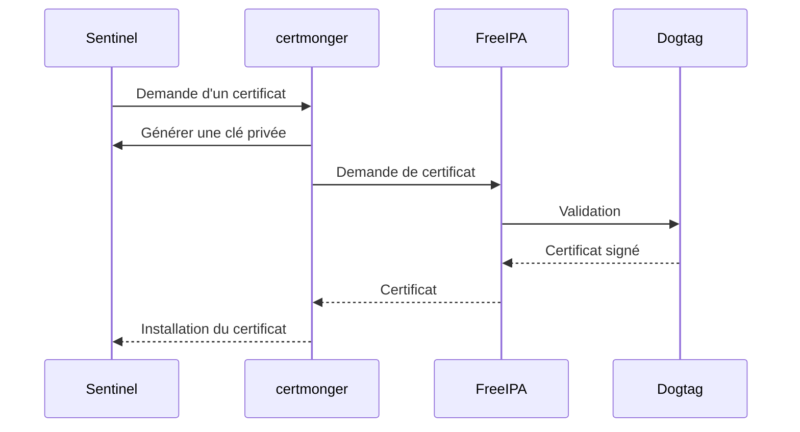

L'administrateur n'a donc pas besoin de manipuler lui-même les CSR ou OpenSSL dans le cas le plus courant.

---

# Le service `certmonger`

Vérifions tout d'abord que le démon est présent.

```bash
rpm -q certmonger
```

Si nécessaire :

```bash
sudo dnf install certmonger
```

Puis démarrez-le.

```bash
sudo systemctl enable --now certmonger
```

Vérifiez ensuite son état.

```bash
systemctl status certmonger
```

Il doit être actif avant toute demande de certificat.

---

# Les outils de `certmonger`

Le principal outil est :

```bash
getcert
```

Affichez son aide.

```bash
getcert --help
```

Il permet notamment de :

- demander un certificat ;
- suivre son état ;
- le renouveler ;
- le supprimer du suivi.

Les commandes les plus utiles sont :

```bash
getcert request
```

```bash
getcert list
```

```bash
getcert resubmit
```

```bash
getcert stop-tracking
```

Nous allons principalement utiliser les deux premières.

---

# Le principal de service

Nous avons déjà rencontré le principal d'hôte.

```text
host/sentinel01.lab.sentinel.test
```

Mais une application peut également posséder son propre principal.

Par exemple :

```text
HTTP/sentinel01.lab.sentinel.test
```

Pourquoi ?

Parce que plusieurs services peuvent cohabiter sur la même machine.

```text
host/sentinel01.lab.sentinel.test

HTTP/sentinel01.lab.sentinel.test

ldap/sentinel01.lab.sentinel.test

smtp/sentinel01.lab.sentinel.test
```

Chaque service possède alors sa propre identité Kerberos.

Cette séparation améliore la sécurité et facilite la délégation.

---

# Associer un principal au service Sentinel

Avant de demander un certificat, le principal de service doit généralement exister.

Depuis le serveur FreeIPA :

```bash
kinit admin
```

Créons le principal HTTP.

```bash
ipa service-add \
HTTP/sentinel01.lab.sentinel.test
```

Vérifiez ensuite.

```bash
ipa service-show \
HTTP/sentinel01.lab.sentinel.test
```

Le service apparaît désormais dans l'annuaire.

Il pourra recevoir :

- des certificats ;
- des clés Kerberos ;
- des politiques spécifiques.

---

# Pourquoi un principal HTTP ?

Imaginons que Sentinel expose une interface Web.

Lorsqu'un navigateur se connecte :

```text
https://sentinel01.lab.sentinel.test
```

Le serveur présente un certificat TLS.

Mais il peut également utiliser Kerberos pour une authentification intégrée.

Les deux mécanismes utilisent alors la même identité logique.

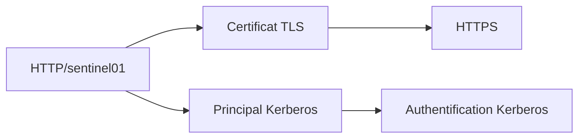

Même si Sentinel n'utilise aujourd'hui que TLS, il est préférable de créer une identité de service propre.

Elle pourra être réutilisée ultérieurement.

---

# Les certificats sont liés aux services

Un point très important est souvent mal compris.

Le certificat n'est pas délivré à une machine.

Il est délivré à une **identité de service**.

Autrement dit, ce n'est pas :

```text
sentinel01
```

qui reçoit un certificat.

C'est par exemple :

```text
HTTP/sentinel01.lab.sentinel.test
```

Cette distinction devient essentielle lorsqu'une même machine héberge plusieurs applications.

Chacune peut alors posséder :

- son propre certificat ;
- son propre principal Kerberos ;
- sa propre politique de sécurité.

C'est cette architecture que nous utiliserons pour Sentinel.

# Demander un certificat

Nous pouvons maintenant demander un certificat pour notre service.

La commande la plus courante est :

```bash
sudo getcert request \
    -K HTTP/sentinel01.lab.sentinel.test \
    -f /etc/pki/tls/certs/sentinel.crt \
    -k /etc/pki/tls/private/sentinel.key
```

Examinons chaque paramètre.

| Option | Signification |
|---------|---------------|
| `-K` | Principal Kerberos auquel sera associé le certificat |
| `-f` | Emplacement du certificat |
| `-k` | Emplacement de la clé privée |

Dans cet exemple, si la clé privée n'existe pas encore, `certmonger` la génère automatiquement.

Le certificat sera ensuite enregistré dans le fichier indiqué.

---

# Où stocker les certificats ?

Sous AlmaLinux, les conventions sont importantes.

Les certificats publics sont généralement placés dans :

```text
/etc/pki/tls/certs/
```

Les clés privées sont placées dans :

```text
/etc/pki/tls/private/
```

On obtient par exemple :

```text
/etc/pki/tls/

├── certs/
│   └── sentinel.crt
│
└── private/
    └── sentinel.key
```

Cette organisation est utilisée par de nombreux services :

- Apache HTTPD ;
- Nginx ;
- Postfix ;
- HAProxy ;
- d'autres applications métier.

Respecter cette convention facilite l'administration.

---

# Les permissions des fichiers

Le certificat peut généralement être lu par plusieurs processus.

En revanche, la clé privée doit être beaucoup plus protégée.

Une configuration classique est :

```text
-rw-r--r--  sentinel.crt
```

et :

```text
-rw-------  sentinel.key
```

Vérifiez les permissions.

```bash
ls -l /etc/pki/tls/certs/
```

Puis :

```bash
ls -l /etc/pki/tls/private/
```

Enfin :

```bash
stat /etc/pki/tls/private/sentinel.key
```

Un utilisateur non autorisé ne doit jamais pouvoir lire cette clé.

---

# Vérifier la demande

Pendant que `certmonger` traite la demande, il est possible d'afficher son état.

```bash
getcert list
```

La sortie ressemble à :

```text
Request ID '20260701'

status: MONITORING

stuck: no

key pair storage:
...
```

Chaque demande possède un identifiant.

Cet identifiant permettra :

- de suivre le certificat ;
- de forcer un renouvellement ;
- d'arrêter son suivi.

Le statut le plus courant après une demande réussie est :

```text
MONITORING
```

Cela signifie que `certmonger` continue de surveiller le certificat afin de préparer son renouvellement futur.

---

# Les différents états

Tous les certificats ne sont pas immédiatement en état `MONITORING`.

Voici quelques états fréquents.

| État | Signification |
|------|---------------|
| `MONITORING` | Certificat installé et surveillé |
| `CA_WORKING` | La demande est en cours de traitement |
| `NEED_KEY_PAIR` | Une clé privée doit être créée |
| `NEED_CERTSAVE_PERMS` | Problème de permissions lors de l'écriture |
| `CA_UNREACHABLE` | Impossible de contacter la CA |
| `CA_REJECTED` | La demande a été refusée |

La lecture de cet état constitue souvent le premier diagnostic à effectuer lorsqu'un certificat ne peut pas être obtenu.

---

# Vérifier le certificat obtenu

Une fois le certificat installé, examinons son contenu.

```bash
openssl x509 \
    -in /etc/pki/tls/certs/sentinel.crt \
    -text \
    -noout
```

Cette commande affiche notamment :

- le sujet ;
- l'émetteur ;
- la période de validité ;
- les extensions ;
- les usages ;
- les Subject Alternative Names.

Nous allons apprendre à interpréter ces informations dans la prochaine partie.

# Lire un certificat X.509

L'affichage complet produit par OpenSSL est souvent impressionnant.

Pourtant, seules quelques informations sont réellement indispensables dans la plupart des cas.

Prenons l'exemple suivant.

```text
Certificate:

    Subject:
        CN=sentinel01.lab.sentinel.test

    Issuer:
        CN=Certificate Authority

    Validity
        Not Before:
        Not After :

    X509v3 Subject Alternative Name:
        DNS:sentinel01.lab.sentinel.test
```

Dans la pratique, un administrateur commence presque toujours par vérifier ces quatre éléments.

---

# Le sujet (*Subject*)

Le sujet représente l'identité portée par le certificat.

Dans notre cas :

```text
CN=sentinel01.lab.sentinel.test
```

Historiquement, le **Common Name (CN)** était l'identifiant principal.

Aujourd'hui, il est surtout conservé pour des raisons de compatibilité.

Les clients TLS modernes utilisent principalement les **Subject Alternative Names (SAN)**.

Le CN reste néanmoins une information utile lors d'un diagnostic.

---

# L'émetteur (*Issuer*)

Le champ :

```text
Issuer
```

indique quelle autorité a signé le certificat.

Par exemple :

```text
CN=Certificate Authority
```

ou encore :

```text
CN=IPA CA
```

selon la configuration de votre laboratoire.

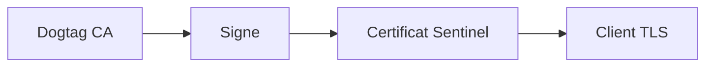

Lorsqu'un client reçoit le certificat, il vérifie qu'il connaît cette autorité.

Si elle ne figure pas parmi ses autorités de confiance, la connexion est refusée.

---

# La période de validité

Chaque certificat possède une durée de vie.

```text
Not Before

Not After
```

Autrement dit :

```text
Valide à partir de

...

Valide jusqu'au
```

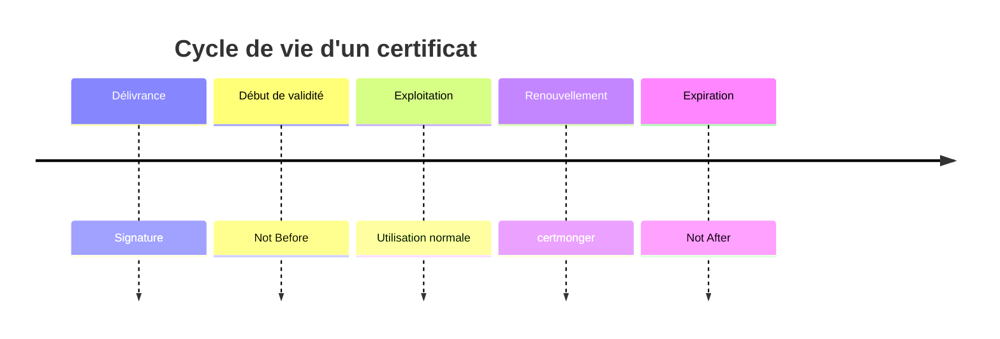

Le certificat ne doit être utilisé qu'entre ces deux dates.

Avant ou après cette période, il est considéré comme invalide.

C'est pourquoi `certmonger` renouvelle les certificats avant leur expiration.

---

# Les Subject Alternative Names (SAN)

Le champ le plus important est souvent :

```text
X509v3 Subject Alternative Name
```

On y trouve généralement :

```text
DNS:sentinel01.lab.sentinel.test
```

Mais plusieurs identités peuvent être présentes.

Par exemple :

```text
DNS:sentinel01.lab.sentinel.test

DNS:sentinel.lab.sentinel.test

DNS:api.lab.sentinel.test
```

Le client TLS compare le nom demandé avec cette liste.

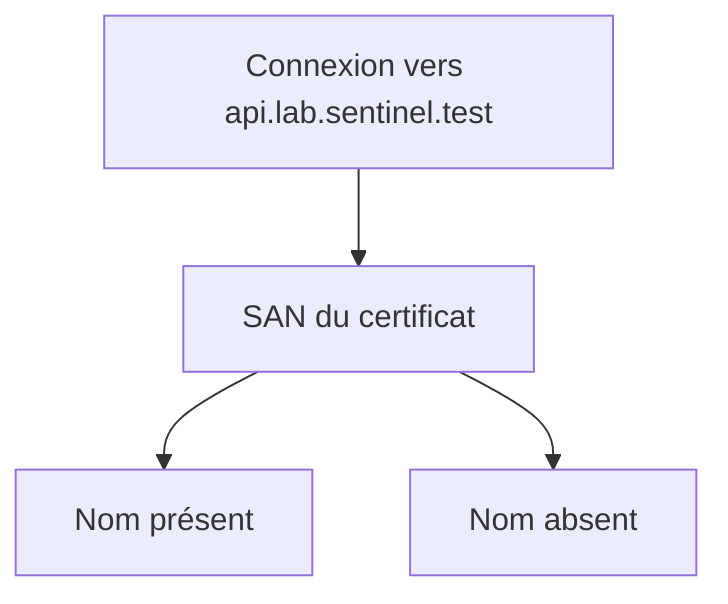

C'est précisément cette vérification qui évite qu'un certificat prévu pour un serveur soit accepté pour un autre.

---

# Pourquoi le SAN est critique ?

Imaginons que notre certificat contienne uniquement :

```text
DNS:sentinel01.lab.sentinel.test
```

Mais que l'utilisateur se connecte à :

```text
https://api.lab.sentinel.test
```

Même si les deux noms pointent vers la même machine, la connexion TLS échouera.

Le certificat ne prouve pas l'identité demandée.

C'est une erreur très fréquente lors du déploiement d'une application.

Elle est généralement résolue en ajoutant le ou les SAN nécessaires lors de la demande du certificat.

Dans la prochaine partie, nous verrons comment FreeIPA gère précisément ces extensions ainsi que le renouvellement automatique des certificats.

# Les usages d'un certificat

Un certificat ne peut pas être utilisé pour n'importe quelle opération.

Il contient des extensions qui précisent les usages autorisés.

Parmi les plus importantes, on trouve :

- **Key Usage**
- **Extended Key Usage**

Ces extensions permettent au client de vérifier que le certificat est bien adapté à la connexion demandée.

---

# Key Usage

L'extension **Key Usage** décrit les opérations cryptographiques autorisées.

Par exemple :

```text
Key Usage

✓ Digital Signature

✓ Key Encipherment
```

Ou encore :

```text
✓ Key Agreement
```

Selon les besoins.

Pour un serveur HTTPS classique, les usages les plus fréquents sont :

- **Digital Signature**
- **Key Encipherment**

Ils permettent notamment :

- de signer certaines étapes du protocole TLS ;
- d'établir une clé de session.

Le certificat ne doit pas autoriser davantage d'usages que nécessaire.

C'est une nouvelle application du principe du moindre privilège.

---

# Extended Key Usage

L'extension **Extended Key Usage** (EKU) précise le rôle du certificat.

Par exemple :

```text
TLS Web Server Authentication
```

ou :

```text
TLS Web Client Authentication
```

ou encore :

```text
Code Signing
```

Chaque usage correspond à un contexte bien particulier.

Un certificat prévu pour authentifier un serveur Web ne doit pas nécessairement être accepté pour signer du code ou authentifier un client VPN.

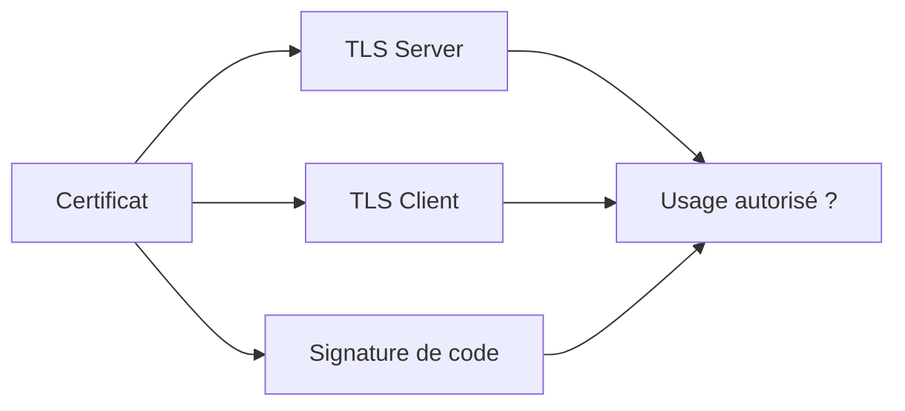

Le logiciel qui reçoit le certificat vérifie ces usages avant de poursuivre la connexion.

---

# Les profils de certificats

Toutes les demandes de certificats ne sont pas identiques.

Dogtag utilise des **profils**.

Un profil décrit notamment :

- quelles informations sont obligatoires ;
- quels usages seront ajoutés ;
- quelles extensions sont autorisées ;
- quelles validations doivent être réalisées.

On peut représenter ce fonctionnement ainsi.

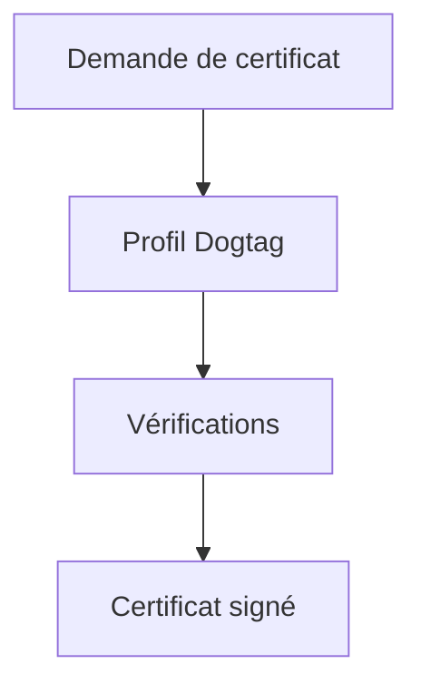

Le profil garantit qu'un certificat destiné à un serveur Web ne sera pas construit de la même manière qu'un certificat destiné à un utilisateur.

---

# Pourquoi utiliser des profils ?

Imaginons deux besoins.

Le premier concerne Sentinel.

```text
Serveur HTTPS
```

Le second concerne une carte à puce.

```text
Authentification utilisateur
```

Les deux utilisent des certificats.

Pourtant, leurs usages sont très différents.

Le serveur doit :

- présenter son identité ;
- chiffrer les échanges.

L'utilisateur doit :

- prouver son identité ;
- éventuellement signer des documents.

Il serait dangereux d'utiliser exactement le même type de certificat pour ces deux usages.

Les profils imposent donc une cohérence dans toute l'infrastructure.

---

# Les SAN multiples

Une même application peut être accessible sous plusieurs noms DNS.

Par exemple :

```text
sentinel01.lab.sentinel.test
```

et :

```text
sentinel.lab.sentinel.test
```

Dans ce cas, un seul certificat peut contenir plusieurs SAN.

```text
DNS:sentinel01.lab.sentinel.test

DNS:sentinel.lab.sentinel.test
```

Le client acceptera alors le certificat pour chacun de ces noms.

Cette possibilité est très pratique.

Elle doit cependant être utilisée avec discernement.

Plus un certificat couvre d'identités, plus son périmètre de confiance est important.

En cas de compromission de la clé privée, toutes les identités présentes dans le certificat sont concernées.

# La révocation d'un certificat

L'expiration n'est pas la seule raison pour laquelle un certificat cesse d'être valide.

Il peut également être **révoqué**.

La révocation intervient lorsqu'un certificat ne doit plus être utilisé avant sa date d'expiration.

Par exemple :

- la clé privée a été volée ;
- le serveur a été compromis ;
- le service a été supprimé ;
- une erreur a été commise lors de la délivrance.

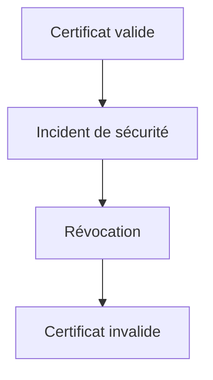

Un certificat révoqué reste techniquement intact.

En revanche, il ne doit plus être considéré comme digne de confiance.

---

# Comment un client connaît-il les certificats révoqués ?

Une autorité de certification publie des informations permettant aux clients de savoir si un certificat est toujours valide.

Deux mécanismes principaux existent.

## Les CRL (*Certificate Revocation Lists*)

Une **CRL** est une liste contenant les certificats révoqués.

Le client peut la télécharger et vérifier si le certificat présenté y figure.

```text
Autorité de certification

        │

        ▼

Liste des certificats révoqués

        │

        ▼

Client TLS
```

---

## L'OCSP

Une autre approche consiste à interroger directement un serveur.

Au lieu de télécharger une liste complète, le client demande :

> « Ce certificat est-il encore valide ? »

Le serveur répond :

- valide ;
- révoqué ;
- inconnu.

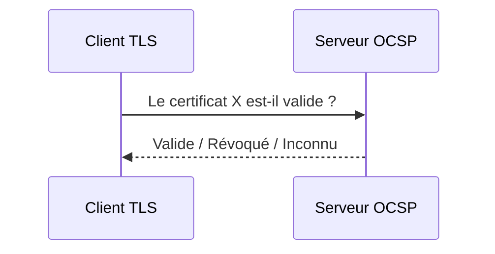

L'OCSP est généralement plus léger qu'une CRL volumineuse.

---

# FreeIPA et la révocation

Dogtag est capable de gérer les certificats révoqués.

Lorsqu'un certificat est révoqué :

- il ne pourra plus être renouvelé normalement ;
- il pourra apparaître dans les mécanismes de révocation de la PKI ;
- une nouvelle demande de certificat sera généralement nécessaire.

La révocation est une opération importante.

Elle ne doit pas être utilisée simplement parce qu'un certificat arrive bientôt à expiration.

Dans ce cas, un renouvellement est préférable.

---

# Renouvellement ou révocation ?

Ces deux notions sont souvent confondues.

| Renouvellement | Révocation |
|---------------|------------|
| Certificat bientôt expiré | Certificat devenu non fiable |
| Opération normale | Opération de sécurité |
| Réalisée automatiquement par `certmonger` | Décision d'administration |
| Même identité conservée | Ancien certificat invalidé |

Le renouvellement fait partie du cycle de vie normal d'un certificat.

La révocation intervient lorsqu'un événement exceptionnel remet en cause la confiance accordée à ce certificat.

---

# Le cycle de vie complet d'un certificat

On peut désormais représenter le cycle de vie complet.

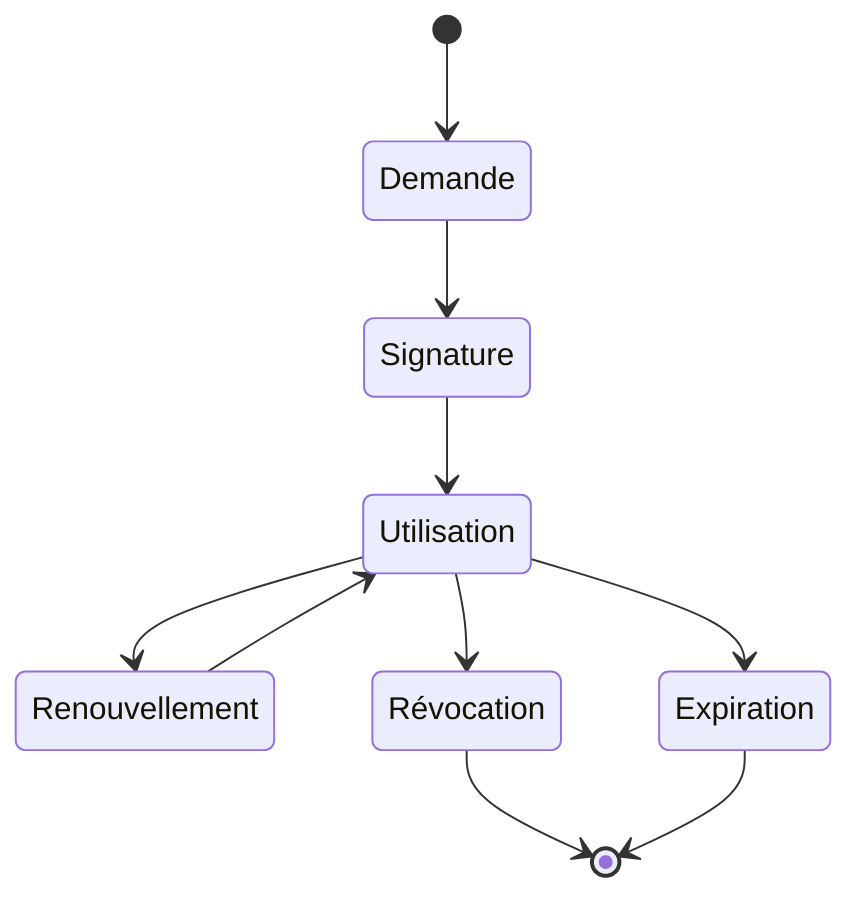

Un certificat passe donc par plusieurs états successifs.

L'objectif de `certmonger` est de maintenir le certificat dans l'état **Utilisation** aussi longtemps que le service existe.

La révocation, elle, met fin définitivement à la confiance accordée à ce certificat.

# Les certificats et Sentinel

Jusqu'à présent, nous avons étudié les mécanismes de manière générale.

Voyons maintenant comment ils s'appliquent à notre application Sentinel.

Sentinel communique avec plusieurs composants :

- les postes d'administration ;
- les agents déployés sur les serveurs ;
- d'éventuelles API ;
- les navigateurs Web.

Toutes ces communications doivent être protégées.

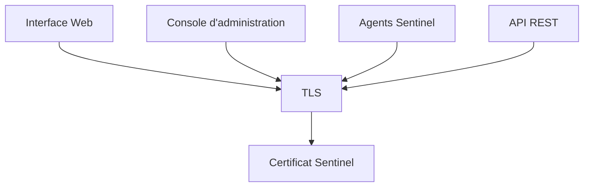

Le certificat devient donc un élément central de l'architecture de sécurité.

---

# Un certificat par application

Une erreur fréquente consiste à réutiliser le même certificat pour plusieurs services.

Par exemple :

```text
Apache

Sentinel

Grafana

API interne
```

Tous utilisent :

```text
sentinel.crt
```

Cette pratique est déconseillée.

Chaque application devrait disposer de :

- sa propre clé privée ;
- son propre certificat ;
- son propre principal de service.

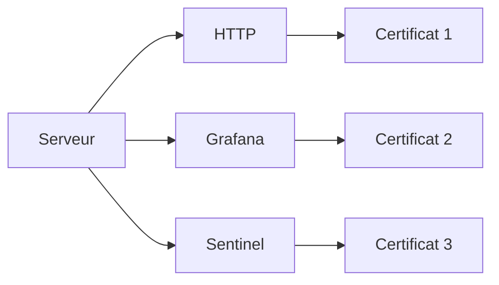

Cette séparation limite l'impact d'une compromission.

---

# Pourquoi séparer les certificats ?

Imaginons que la clé privée de Grafana soit volée.

Si Sentinel utilise le même certificat :

```text
Tous les services sont compromis.
```

En revanche, si chaque application possède sa propre identité :

```text
Grafana compromis

↓

Sentinel reste protégé
```

Cette isolation est exactement le même principe que celui appliqué :

- aux comptes utilisateurs ;
- aux groupes ;
- aux politiques `sudo`.

On évite de partager un secret entre plusieurs composants.

---

# Les certificats et l'authentification mutuelle

Jusqu'à présent, nous avons considéré que seul le serveur présentait un certificat.

Mais TLS permet également au client de présenter le sien.

On parle alors de **TLS mutuel** (*Mutual TLS* ou **mTLS**).

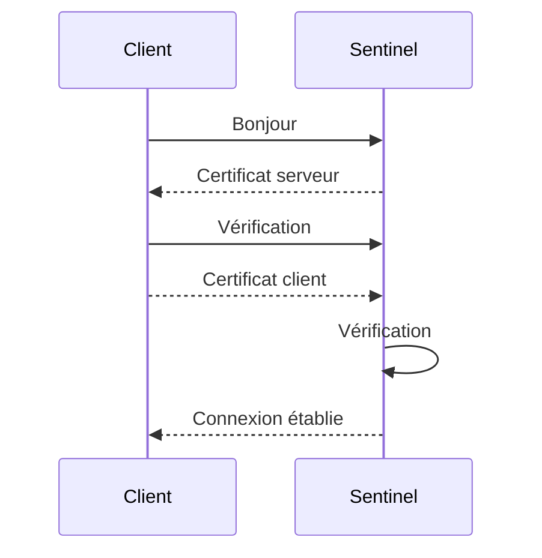

Les deux parties prouvent alors leur identité.

Il ne s'agit plus uniquement de chiffrer la connexion.

Les deux extrémités s'authentifient mutuellement.

---

# Pourquoi mTLS est intéressant pour Sentinel ?

Dans notre architecture, Sentinel devra probablement communiquer avec :

- des agents installés sur les serveurs ;
- d'autres instances Sentinel ;
- des services d'administration.

Un simple mot de passe n'est pas toujours suffisant.

Avec le mTLS :

- chaque agent possède son certificat ;
- Sentinel vérifie ce certificat ;
- l'agent vérifie également celui de Sentinel.

Un attaquant ne peut donc pas simplement ouvrir une connexion TCP et prétendre être un agent légitime.

Le certificat devient une véritable identité machine.

---

# Ce qu'il faut retenir jusqu'ici

À ce stade du chapitre, nous avons construit toute la chaîne de confiance.

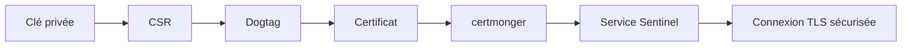

Nous savons désormais :

- comment FreeIPA délivre un certificat ;
- comment `certmonger` le renouvelle automatiquement ;
- pourquoi les SAN sont indispensables ;
- pourquoi chaque service doit posséder sa propre identité ;
- comment Sentinel exploitera cette PKI pour sécuriser ses communications.

La dernière partie du chapitre sera consacrée aux bonnes pratiques d'exploitation, aux erreurs classiques rencontrées sur le terrain et au laboratoire complet de mise en œuvre.

# 💎 Le point d'expertise

Il est tentant de considérer un certificat comme un simple fichier à copier d'un serveur à un autre.

C'est une erreur.

Un certificat est lié à une identité.

Et cette identité est liée à une clé privée.

Prenons un exemple.

Nous avons deux serveurs.

```text
sentinel01.lab.sentinel.test

sentinel02.lab.sentinel.test
```

Si nous copions :

```text
sentinel.key

sentinel.crt
```

du premier vers le second, les deux machines prétendent désormais être le même serveur.

```mermaid
flowchart LR

    S1[sentinel01]

    S2[sentinel02]

    S1 --> CERT[Même certificat]

    S2 --> CERT

    CERT --> CLIENT[Client TLS]
```

Pour un client, les deux serveurs deviennent indistinguables.

Cette pratique détruit le principe même de l'identité numérique.

Chaque serveur doit posséder :

- sa propre clé privée ;
- son propre certificat ;
- son propre principal Kerberos.

Même dans un cluster.

Même derrière un répartiteur de charge.

---

# 🧠 Comment pense un architecte ?

Un architecte ne se demande pas :

> « Comment installer un certificat ? »

Il se demande :

> « Quelle identité ce certificat représente-t-il ? »

Cette différence de raisonnement est fondamentale.

Avant de demander un certificat, il définit :

- le service concerné ;
- son nom DNS ;
- les clients autorisés ;
- la durée de vie souhaitée ;
- le mécanisme de renouvellement ;
- la procédure de révocation.

```mermaid
flowchart TD

    SERVICE[Service]

    SERVICE --> ID[Identité]

    ID --> CERT[Certificat]

    CERT --> DEPLOY[Déploiement]

    DEPLOY --> RENEW[Renouvellement]

    RENEW --> REVOKE[Révocation si nécessaire]
```

Le certificat n'est donc qu'une conséquence de l'architecture.

Il ne constitue jamais son point de départ.

---

# ⚔️ Comment pense un attaquant ?

Lorsqu'un attaquant compromet un serveur, il cherche rapidement les secrets exploitables.

Parmi eux figurent souvent :

```text
/etc/pki/tls/private/
```

ou encore :

```text
/etc/httpd/

...

/etc/nginx/
```

Il recherche :

- les clés privées ;
- les certificats ;
- les fichiers `keytab` ;
- les mots de passe applicatifs.

Pourquoi ?

Parce qu'une clé privée volée permet parfois d'usurper l'identité du serveur.

Si cette clé est également utilisée sur plusieurs machines, l'impact devient beaucoup plus important.

La protection des clés privées doit donc être considérée au même niveau que celle des comptes administrateurs.

---

# 📚 Culture technique

Toutes les autorités de certification ne délivrent pas les mêmes certificats.

On distingue notamment :

- les PKI publiques ;
- les PKI privées.

Une PKI publique délivre des certificats reconnus par les navigateurs.

Exemples :

- Let's Encrypt ;
- DigiCert ;
- GlobalSign.

Une PKI privée, comme celle de FreeIPA, est destinée à un système d'information particulier.

Elle permet :

- d'authentifier les machines internes ;
- de sécuriser les services ;
- de contrôler entièrement les règles de délivrance.

Pour Sentinel, une PKI privée est généralement le meilleur choix.

Elle évite de dépendre d'un fournisseur externe pour des services exclusivement internes.

---

# ⚠️ Piège classique

L'erreur la plus fréquente consiste à demander un certificat avec un mauvais nom DNS.

Par exemple :

```text
CN=sentinel
```

Alors que les utilisateurs se connectent à :

```text
sentinel.lab.sentinel.test
```

Le certificat est parfaitement valide.

La signature est correcte.

La période de validité également.

Pourtant, toutes les connexions TLS échouent.

Pourquoi ?

Parce que le client compare :

```text
Nom demandé

↓

Nom contenu dans le certificat
```

Ces deux informations doivent correspondre.

Avant toute demande de certificat, il faut donc toujours vérifier le FQDN réellement utilisé par les clients.

Dans un environnement de production, une simple erreur de nom peut rendre une application entièrement inaccessible malgré une PKI parfaitement fonctionnelle.

# Laboratoire AlmaLinux

## Objectif

À la fin de ce laboratoire, le serveur Sentinel devra :

- posséder un principal de service ;
- obtenir un certificat signé par FreeIPA ;
- être surveillé par `certmonger` ;
- être prêt à être utilisé par le serveur HTTPS de Sentinel.

---

## Étape 1 — Vérifier les prérequis

Le client doit déjà être enrôlé dans FreeIPA.

Vérifiez :

```bash
hostname -f
```

Puis :

```bash
klist -k
```

Le principal d'hôte doit être présent dans le `keytab`.

Vérifiez également que `certmonger` est installé.

```bash
rpm -q certmonger
```

---

## Étape 2 — Créer le principal de service

Depuis un poste d'administration :

```bash
kinit admin
```

Ajoutez le service HTTP.

```bash
ipa service-add \
HTTP/sentinel01.lab.sentinel.test
```

Vérifiez :

```bash
ipa service-show \
HTTP/sentinel01.lab.sentinel.test
```

Le principal apparaît désormais dans l'annuaire.

---

## Étape 3 — Demander le certificat

Sur le serveur Sentinel :

```bash
sudo getcert request \
    -K HTTP/sentinel01.lab.sentinel.test \
    -f /etc/pki/tls/certs/sentinel.crt \
    -k /etc/pki/tls/private/sentinel.key
```

Patientez quelques instants.

Puis affichez les certificats suivis.

```bash
getcert list
```

Le statut attendu est :

```text
MONITORING
```

---

## Étape 4 — Vérifier le certificat

Contrôlez son contenu.

```bash
openssl x509 \
    -in /etc/pki/tls/certs/sentinel.crt \
    -text \
    -noout
```

Vérifiez en particulier :

- le **Subject** ;
- l'**Issuer** ;
- les **Subject Alternative Names** ;
- la période de validité ;
- les usages (`Key Usage` et `Extended Key Usage`).

Ces informations doivent être cohérentes avec le service HTTP de Sentinel.

---

## Étape 5 — Vérifier les permissions

Contrôlez les droits du certificat.

```bash
ls -l /etc/pki/tls/certs/
```

Puis ceux de la clé privée.

```bash
ls -l /etc/pki/tls/private/
```

La clé privée ne doit être lisible que par les utilisateurs autorisés à faire fonctionner le service.

Dans un environnement de production, il est souvent préférable que seul le compte de service de Sentinel puisse y accéder.

---

## Étape 6 — Vérifier le renouvellement automatique

Affichez les informations connues par `certmonger`.

```bash
getcert list
```

Repérez notamment :

- l'identifiant de la requête ;
- le principal Kerberos associé ;
- le certificat suivi ;
- la date de renouvellement prévue.

Le certificat est désormais intégré à son cycle de vie automatique.

---

# Mission d'ingénieur

Avant de mettre un certificat en production, vérifiez systématiquement les points suivants.

| Contrôle | Vérification |
|----------|--------------|
| FQDN correct | Le nom DNS correspond exactement au service publié |
| SAN | Tous les noms utilisés par les clients sont présents |
| Clé privée | Permissions restrictives |
| Certificat | Signé par la bonne autorité |
| Durée de vie | Compatible avec la politique de l'entreprise |
| Renouvellement | Pris en charge par `certmonger` |
| Révocation | Procédure documentée et testée |
| Journalisation | Les renouvellements sont supervisés |

Cette checklist doit faire partie de toute procédure de mise en production.

---

# Impact sur Sentinel

Grâce à FreeIPA, Sentinel ne gère plus manuellement ses certificats.

```mermaid
flowchart LR

    Sentinel --> certmonger

    certmonger --> FreeIPA

    FreeIPA --> Dogtag

    Dogtag --> Certificat

    Certificat --> Sentinel
```

L'application bénéficie désormais :

- d'une identité cryptographique forte ;
- d'un renouvellement automatique ;
- d'une intégration avec l'infrastructure de confiance ;
- d'une administration centralisée.

C'est un élément essentiel pour industrialiser un service sécurisé.

---

# Ce qu'il faut retenir

- FreeIPA s'appuie sur **Dogtag PKI** pour délivrer les certificats.
- Chaque service doit disposer de sa propre identité et de sa propre clé privée.
- La clé privée ne quitte jamais la machine qui l'a générée.
- `certmonger` automatise la demande, le suivi et le renouvellement des certificats.
- Les **Subject Alternative Names (SAN)** sont indispensables pour les clients TLS modernes.
- Un certificat doit être analysé avant son déploiement : identité, usages, validité et extensions.
- La révocation et le renouvellement répondent à deux besoins différents.
- La protection de la clé privée est aussi importante que celle d'un compte administrateur.

---

# Grande infographie de révision

```text
                    GESTION DES CERTIFICATS FREEIPA

                  Génération de la clé privée
                             │
                             ▼
                    Création de la CSR
                             │
                             ▼
                     certmonger (client)
                             │
                             ▼
                        FreeIPA
                             │
                             ▼
                        Dogtag PKI
                             │
                             ▼
                  Certificat signé (X.509)
                             │
                             ▼
                Installation sur Sentinel
                             │
                             ▼
                 Renouvellement automatique

──────────────────────────────────────────────────────────────

             Le certificat représente une identité.

             La clé privée prouve cette identité.

             Dogtag la certifie.

             certmonger la maintient dans le temps.
```

# Transition vers le chapitre 8.9

Notre infrastructure possède désormais tous les composants nécessaires :

- des utilisateurs ;
- des groupes ;
- des politiques `sudo` ;
- des hôtes enrôlés ;
- une autorité de certification ;
- des certificats automatiquement renouvelés.

Il reste maintenant à intégrer **Sentinel** dans cet écosystème.

Au lieu d'être une simple application Python utilisant quelques certificats copiés à la main, Sentinel va devenir un véritable service d'entreprise capable de s'appuyer sur :

- FreeIPA pour les identités ;
- Kerberos pour certains mécanismes d'authentification ;
- la PKI interne pour TLS ;
- SSSD pour les utilisateurs et les groupes ;
- les politiques centralisées pour son administration.

C'est cette intégration complète que nous allons construire dans le chapitre **8.9**.
