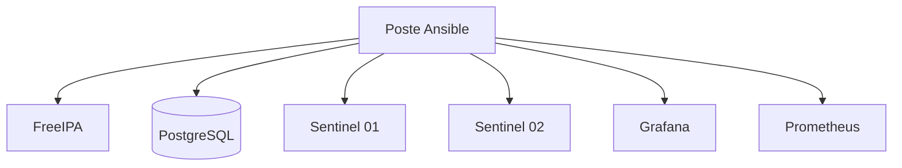
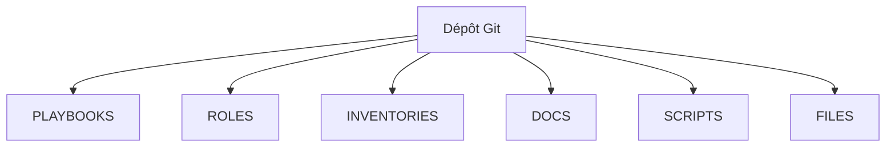
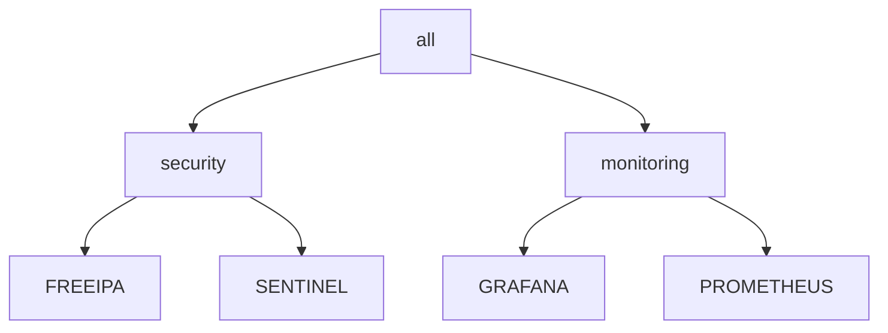
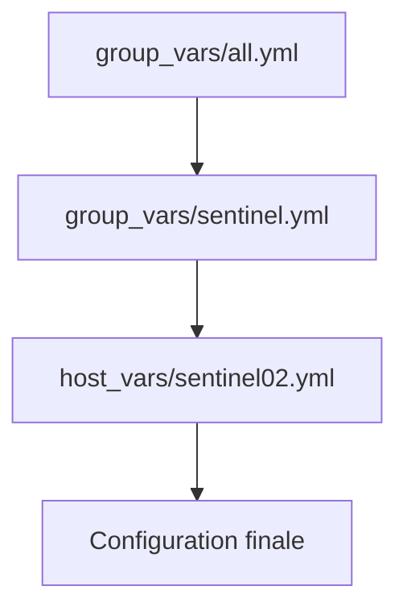
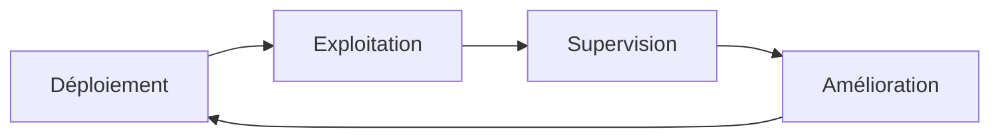
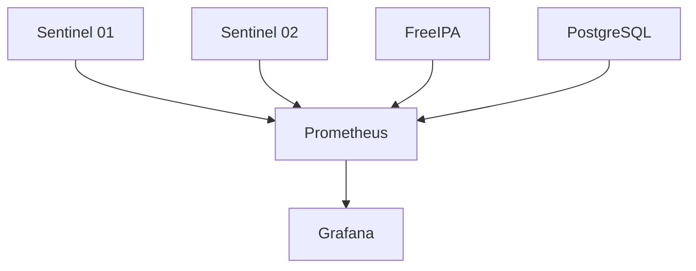
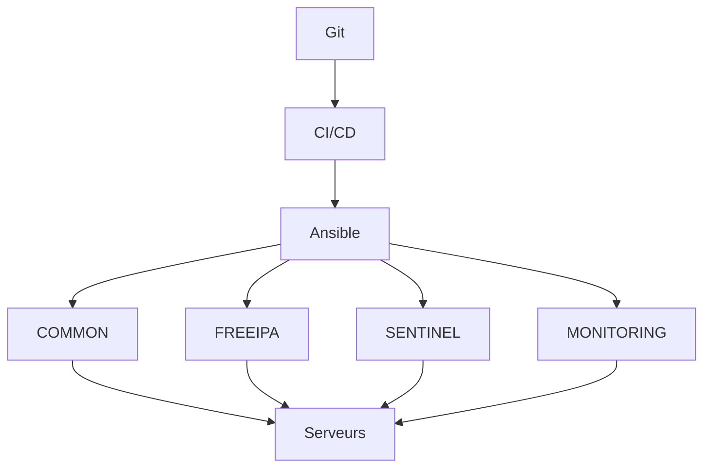
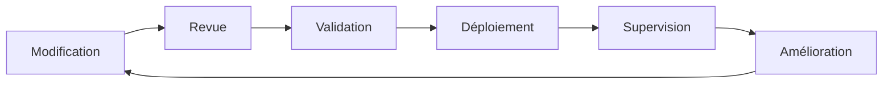

# 9.10 Mission d'ingénierie — Déploiement complet d'une infrastructure Sentinel

> *« Connaître les outils est une compétence. Les assembler pour construire une infrastructure cohérente est un métier. »*

---

## Vous êtes ici

```text
PARTIE III — Industrialiser les déploiements

Campagne 9

  9.1 Pourquoi Ansible ? ✔
  9.2 Architecture d'Ansible ✔
  9.3 Inventaires ✔
  9.4 Premiers playbooks ✔
  9.5 Variables et templates ✔
  9.6 Les rôles ✔
  9.7 Déployer Sentinel ✔
  9.8 Intégrer FreeIPA ✔
  9.9 Industrialiser le laboratoire ✔
► 9.10 Mission : déploiement complet d'une infrastructure
```

---

## Objectifs pédagogiques

Ce chapitre est différent des précédents.

Il ne présente pratiquement aucun nouveau concept.

Son objectif est de mettre en pratique l'ensemble des connaissances acquises depuis le début de la campagne.

À l'issue de cette mission, vous devrez être capable de :

- concevoir l'architecture d'un projet Ansible complet ;
- organiser les rôles, les inventaires et les variables ;
- automatiser le déploiement d'une infrastructure multi-serveurs ;
- raisonner comme un ingénieur infrastructure plutôt que comme un administrateur système.

---

# Le contexte

Vous venez d'intégrer une entreprise.

L'équipe de développement a terminé la première version de Sentinel.

L'application fonctionne.

Cependant, chaque nouveau serveur est encore installé manuellement.

Les conséquences sont nombreuses.

- les temps de déploiement sont élevés ;
- les configurations divergent progressivement ;
- certaines machines oublient des étapes de sécurité ;
- les mises à jour sont difficiles à reproduire.

Votre mission consiste à industrialiser complètement cette plateforme.

---

# Le cahier des charges

L'entreprise possède actuellement l'infrastructure suivante.



Tous ces serveurs devront être administrés depuis un unique dépôt Git.

---

# Les contraintes

La direction impose plusieurs exigences.

- Aucun déploiement manuel.
- Toutes les configurations sont versionnées.
- Les secrets sont protégés.
- Les rôles sont réutilisables.
- Les environnements sont séparés.
- Les déploiements sont reproductibles.

Ces contraintes correspondent exactement aux principes étudiés tout au long de cette campagne.

---

# Votre rôle

Dans cette mission, vous n'allez plus apprendre Ansible.

Vous allez agir comme un véritable ingénieur infrastructure.

Chaque décision devra répondre à plusieurs questions.

- Est-elle maintenable ?
- Est-elle réutilisable ?
- Est-elle évolutive ?
- Respecte-t-elle le principe de responsabilité unique ?
- Facilite-t-elle le travail des autres administrateurs ?

Ce changement de perspective est essentiel.

Il marque le passage de la maîtrise des outils à la conception d'une architecture.


# Étape 1 — Concevoir le dépôt Git

La première erreur des débutants consiste à écrire immédiatement des playbooks.

En entreprise.

On commence rarement par le code.

On commence par l'architecture.

Avant d'automatiser une infrastructure, il faut déterminer :

- où seront stockés les rôles ;
- où placer les inventaires ;
- comment organiser les variables ;
- comment gérer les secrets ;
- comment préparer les futurs développements.

Cette réflexion évite de nombreuses réorganisations quelques mois plus tard.

---

# Notre objectif

Nous souhaitons obtenir un dépôt capable de répondre aux besoins actuels…

- quelques serveurs Sentinel ;
- un serveur FreeIPA ;
- un serveur PostgreSQL.

…mais également aux besoins futurs.

- plusieurs dizaines de serveurs ;
- plusieurs environnements ;
- plusieurs équipes d'administration.

L'organisation doit donc être pensée pour durer.

---

# Une architecture cible

Nous retiendrons une structure proche de celle-ci.

```text
sentinel-infra/

├── ansible.cfg

├── README.md

├── requirements.yml

├── playbooks/

├── inventories/

├── roles/

├── collections/

├── files/

├── docs/

└── scripts/
```

Cette organisation est largement inspirée des projets d'infrastructure utilisés en entreprise.

---

# Pourquoi un répertoire `docs/` ?

Une erreur fréquente consiste à placer toute la documentation dans un unique `README.md`.

Très rapidement.

Le document devient énorme.

Le répertoire :

```text
docs/
```

permet de conserver une documentation organisée.

Par exemple.

```text
docs/

├── architecture.md

├── freeipa.md

├── sentinel.md

├── deployment.md

└── troubleshooting.md
```

Chaque sujet dispose de son propre document.

---

# Pourquoi un répertoire `scripts/` ?

Tout ne relève pas d'Ansible.

Certaines opérations peuvent nécessiter :

- un script Python ;
- un script Bash ;
- un outil de génération.

Ces éléments ne doivent pas être mélangés avec les rôles.

Ils sont regroupés dans :

```text
scripts/
```

Cette séparation améliore immédiatement la lisibilité du projet.

---

# Une vision d'ensemble



Chaque répertoire possède une responsabilité clairement définie.

---

# Une décision d'architecture

À ce stade.

Nous n'avons encore écrit aucune tâche Ansible.

Pourtant.

Une grande partie de la qualité future du projet est déjà déterminée.

Une architecture claire :

- facilite le travail en équipe ;
- limite les duplications ;
- réduit les erreurs ;
- simplifie les évolutions.

C'est pourquoi les projets professionnels consacrent souvent beaucoup de temps à cette phase de conception avant même le premier développement.


# Étape 2 — Concevoir les inventaires

Le dépôt Git est maintenant organisé.

La question suivante est essentielle.

> **Comment décrire l'ensemble des serveurs de l'entreprise ?**

C'est précisément le rôle des inventaires Ansible.

Dans une petite infrastructure, un simple fichier suffit.

Dans un projet industriel, l'organisation des inventaires devient un élément clé de l'architecture.

---

# Les besoins de l'entreprise

Notre plateforme comporte plusieurs catégories de serveurs.

```text
FreeIPA

PostgreSQL

Sentinel

Grafana

Prometheus

Administration
```

Chaque catégorie possède ses propres rôles et ses propres variables.

Il est donc logique de les représenter par des groupes Ansible.

---

# Une organisation cible

Pour l'environnement de production.

Nous utiliserons une structure similaire à celle-ci.

```text
inventories/

└── production/

    ├── hosts.yml

    ├── group_vars/

    └── host_vars/
```

Le fichier :

```text
hosts.yml
```

décrit uniquement les machines.

Il ne contient aucune configuration.

---

# Un exemple d'inventaire

```yaml
all:

  children:

    freeipa:

      hosts:

        ipa01:

    database:

      hosts:

        db01:

    sentinel:

      hosts:

        sentinel01:

        sentinel02:

    monitoring:

      hosts:

        grafana01:

        prometheus01:
```

La lecture est immédiate.

Chaque serveur appartient à un groupe fonctionnel.

---

# Pourquoi utiliser des groupes ?

Les groupes permettent d'appliquer facilement des rôles.

Par exemple.

```yaml
- hosts: sentinel

  roles:

    - sentinel
```

Tous les serveurs du groupe recevront automatiquement le même déploiement.

Aucun serveur n'a besoin d'être mentionné individuellement.

---

# Une hiérarchie naturelle

Les groupes peuvent eux-mêmes être regroupés.



Cette hiérarchie facilite énormément l'application de variables communes.

Par exemple.

Tous les serveurs du groupe :

```text
security
```

pourront partager certaines politiques de sécurité.

---

# Une bonne pratique

L'inventaire doit uniquement répondre à une question.

> **Quels sont les serveurs ?**

Il ne doit pas contenir :

- des mots de passe ;
- des chemins de fichiers ;
- des paramètres applicatifs ;
- des options système.

Toutes ces informations appartiennent aux variables (`group_vars`, `host_vars` ou Ansible Vault).

En séparant clairement **l'identité des machines** de **leur configuration**, on obtient un projet beaucoup plus lisible, plus évolutif et plus facile à maintenir lorsque l'infrastructure grandit.


# Étape 3 — Construire la hiérarchie des variables

Notre dépôt est organisé.

Les inventaires sont prêts.

Il reste maintenant à définir où seront stockées les centaines de variables de l'infrastructure.

Dans un petit laboratoire, cette question paraît secondaire.

Dans une entreprise, elle est essentielle.

Une mauvaise organisation entraîne rapidement :

- des duplications ;
- des incohérences ;
- des erreurs de configuration.

---

# Une règle fondamentale

Chaque variable doit être définie **une seule fois**, au niveau le plus pertinent.

Autrement dit.

Une valeur commune ne doit jamais être répétée sur plusieurs serveurs.

---

# Les différents niveaux

Notre projet utilisera principalement quatre niveaux.

```text
Infrastructure

↓

Environnement

↓

Groupe

↓

Serveur
```

Chaque niveau ajoute uniquement les informations qui lui sont propres.

---

# Les variables globales

Certaines informations concernent absolument tous les serveurs.

Par exemple.

```yaml
timezone: Europe/Paris

ntp_servers:

  - ntp1.example.com

  - ntp2.example.com
```

Ces paramètres peuvent être placés dans :

```text
group_vars/all.yml
```

Ils deviennent immédiatement accessibles à tous les rôles.

---

# Les variables par groupe

Chaque famille de serveurs possède ensuite ses propres paramètres.

Par exemple.

```text
group_vars/

    sentinel.yml

    database.yml

    monitoring.yml

    freeipa.yml
```

Dans :

```yaml
group_vars/sentinel.yml
```

nous pourrions trouver.

```yaml
sentinel:

  server:

    port: 8443

  logging:

    level: INFO
```

Toutes les machines Sentinel partageront cette configuration.

---

# Les exceptions

Supposons maintenant que :

```text
sentinel02
```

écoute exceptionnellement sur un autre port.

Nous utiliserons :

```text
host_vars/

    sentinel02.yml
```

```yaml
sentinel:

  server:

    port: 9443
```

Une seule machine est concernée.

La configuration commune reste inchangée.

---

# Une architecture simple



La lecture est naturelle.

Chaque niveau précise le précédent.

---

# Une règle d'or

Avant d'ajouter une variable dans `host_vars`, posez-vous toujours cette question.

> **Cette valeur est-elle réellement spécifique à ce serveur ?**

Si la réponse est non.

Elle appartient probablement à :

- `group_vars/all.yml` ;
- ou à `group_vars/<groupe>.yml`.

Cette discipline permet de conserver une infrastructure cohérente, où les exceptions restent rares et immédiatement identifiables. C'est l'un des critères qui différencient un projet Ansible facilement maintenable d'un projet qui devient rapidement difficile à faire évoluer.


# Étape 4 — Concevoir les rôles comme des produits

Jusqu'à présent, nous avons considéré les rôles comme des composants techniques.

Dans une infrastructure mature, il est plus pertinent de les voir comme de véritables **produits logiciels**.

Cette différence de perspective change profondément la manière de les concevoir.

---

# Qu'est-ce qu'un produit ?

Un produit possède :

- une interface claire ;
- une documentation ;
- des paramètres configurables ;
- des versions ;
- des utilisateurs.

Un rôle Ansible répond exactement à cette définition.

Ses utilisateurs sont les autres administrateurs.

---

# Une interface publique

L'utilisateur d'un rôle ne devrait pas avoir besoin de lire son code.

Il doit uniquement connaître :

- les variables qu'il peut modifier ;
- les prérequis ;
- le résultat attendu.

Par exemple.

Le rôle `sentinel` pourrait exposer les variables suivantes.

```yaml
sentinel:

  server:

    port:

    bind:

  tls:

    enabled:

  logging:

    level:
```

Toutes les autres variables resteront internes au rôle.

---

# Masquer l'implémentation

Prenons un exemple.

Le rôle installe actuellement trois paquets RPM.

Demain.

Il en installera peut-être cinq.

Cette évolution ne doit avoir aucun impact sur l'utilisateur du rôle.

L'interface publique reste identique.

L'implémentation évolue librement.

C'est exactement le principe d'encapsulation utilisé dans le développement logiciel.

---

# Une analogie avec une bibliothèque

On peut représenter un rôle de la manière suivante.


L'administrateur interagit uniquement avec l'interface.

Le fonctionnement interne reste caché.

---

# Pourquoi cette approche est-elle importante ?

Imaginons que plusieurs équipes utilisent le rôle `sentinel`.

Si chacune modifie directement son code.

Les divergences apparaîtront rapidement.

À l'inverse.

Si toutes utilisent la même interface.

Le rôle pourra évoluer sans casser les projets existants.

C'est le principe de **compatibilité**.

---

# Une bonne pratique

Lorsque vous développez un rôle, demandez-vous régulièrement :

> **Quelles variables un autre administrateur devra-t-il réellement modifier ?**

Toutes les autres informations doivent rester internes.

Un rôle doté d'une interface simple est :

- plus facile à apprendre ;
- plus simple à documenter ;
- plus stable dans le temps ;
- plus agréable à réutiliser.

Cette manière de concevoir les rôles rapproche Ansible des pratiques du développement logiciel moderne et favorise la création d'une véritable bibliothèque d'automatisation réutilisable à l'échelle de toute l'entreprise.


# Étape 5 — Concevoir une infrastructure évolutive

Une erreur fréquente consiste à construire une infrastructure adaptée uniquement aux besoins actuels.

Par exemple.

Aujourd'hui, l'entreprise possède :

- deux serveurs Sentinel ;
- un serveur PostgreSQL ;
- un serveur FreeIPA.

Le projet fonctionne parfaitement.

Quelques mois plus tard.

L'entreprise grandit.

Il faut désormais gérer :

- vingt serveurs Sentinel ;
- plusieurs sites géographiques ;
- plusieurs environnements ;
- plusieurs équipes d'administration.

Si l'architecture initiale n'a pas été pensée pour évoluer, il devient nécessaire de tout réorganiser.

---

# Concevoir pour demain

L'objectif n'est pas de prévoir tous les besoins futurs.

Il est de construire une architecture qui pourra évoluer sans être reconstruite.

Par exemple.


Le dépôt Git, les rôles et les inventaires doivent continuer à fonctionner quelle que soit la taille de l'infrastructure.

---

# Ajouter un nouveau serveur

Dans une architecture bien conçue, l'arrivée d'un nouveau serveur ne nécessite pratiquement aucune modification.

Par exemple.

Il suffit de :

1. créer la machine ;
2. l'ajouter dans l'inventaire ;
3. lancer le playbook.

Aucun rôle n'est modifié.

Aucun template n'est dupliqué.

Les variables existantes sont simplement réutilisées.

---

# Ajouter une nouvelle application

Le même raisonnement s'applique aux applications.

Supposons que l'entreprise souhaite désormais déployer :

- un serveur Vault ;
- un registre de conteneurs ;
- une plateforme GitLab.

La structure du projet ne change pratiquement pas.

On ajoute simplement de nouveaux rôles.


L'architecture initiale reste valide.

---

# Limiter les dépendances

Une infrastructure évolutive limite les dépendances entre ses composants.

Par exemple.

Le rôle :

```text
sentinel
```

ne doit pas connaître le fonctionnement interne de :

```text
freeipa_client
```

Il suppose uniquement que certains prérequis sont satisfaits.

Cette indépendance facilite :

- les remplacements ;
- les mises à jour ;
- les tests.

---

# Une vision à long terme

Un projet Ansible vit souvent plusieurs années.

Durant cette période.

- de nouveaux serveurs apparaîtront ;
- certains disparaîtront ;
- les versions évolueront ;
- les équipes changeront.

Une bonne architecture doit absorber ces évolutions sans nécessiter de réécriture complète.

---

# Une règle d'ingénierie

Lorsque vous prenez une décision d'architecture, ne vous demandez pas seulement :

> **Est-ce que cela fonctionne aujourd'hui ?**

Posez-vous également la question.

> **Est-ce que cette solution fonctionnera encore lorsque l'infrastructure aura été multipliée par dix ?**

C'est cette capacité à anticiper l'évolution qui distingue une automatisation ponctuelle d'une véritable plateforme d'infrastructure industrialisée.


# Étape 6 — Observer l'infrastructure

Jusqu'à présent, notre travail consistait principalement à **déployer** l'infrastructure.

Mais une fois les serveurs installés, une nouvelle question apparaît.

> **Comment savoir qu'ils continuent à fonctionner correctement ?**

Une infrastructure n'est jamais figée.

Les services démarrent et s'arrêtent.

Les certificats expirent.

Les disques se remplissent.

Les performances évoluent.

Il devient donc indispensable d'observer en permanence l'état de la plateforme.

---

# Déployer n'est pas exploiter

Une erreur fréquente consiste à considérer que le rôle d'Ansible s'arrête une fois le playbook terminé.

En réalité.

L'automatisation et l'observabilité sont deux disciplines complémentaires.



On entre alors dans une boucle d'amélioration continue.

---

# Quels éléments superviser ?

Dans notre laboratoire Sentinel, plusieurs composants devront être surveillés.

## Les serveurs

- charge CPU ;
- mémoire disponible ;
- espace disque ;
- charge système ;
- synchronisation NTP.

---

## Les services

- Sentinel ;
- FreeIPA ;
- PostgreSQL ;
- SSSD ;
- Certmonger.

Chaque service devra être capable d'indiquer son état.

---

## Les certificats

Les certificats constituent un point critique.

Il faudra notamment surveiller :

- leur présence ;
- leur date d'expiration ;
- le bon fonctionnement de leur renouvellement.

Même si `certmonger` automatise le renouvellement, une supervision reste indispensable pour détecter une anomalie.

---

## Les applications

Le fait qu'un processus soit actif ne garantit pas que l'application fonctionne.

Par exemple.

Sentinel peut être :

- démarré ;
- mais incapable de répondre à son API HTTPS.

La supervision devra donc inclure des **tests fonctionnels**.

---

# L'architecture cible

À terme, notre laboratoire évoluera vers une architecture semblable à celle-ci.



Ansible déploie.

Prometheus collecte.

Grafana visualise.

Chaque outil possède une responsabilité bien définie.

---

# Une vision d'ingénieur

Une infrastructure n'est réellement maîtrisée que lorsque l'on connaît son état à tout moment.

Déployer automatiquement les serveurs est une première étape.

Être alerté lorsqu'un service ralentit, lorsqu'un certificat approche de son expiration ou lorsqu'un disque se remplit est tout aussi important.

Dans les prochaines campagnes de cette formation, nous automatiserons également le déploiement de cette plateforme de supervision, afin que l'observabilité fasse partie intégrante de l'infrastructure, au même titre que les applications elles-mêmes.


# Grande synthèse du chapitre 9.10

Cette mission d'ingénierie avait un objectif particulier.

Il ne s'agissait pas d'apprendre de nouvelles commandes Ansible.

Il s'agissait d'apprendre à **concevoir une infrastructure**.

Depuis le début de cette campagne, nous avons progressivement assemblé toutes les briques nécessaires.

Dans ce chapitre, nous les avons organisées pour former un projet cohérent.

---

# La vision globale

Notre plateforme peut maintenant être représentée de la manière suivante.



Chaque composant possède une responsabilité clairement définie.

---

# Les principes mis en œuvre

Au cours de cette mission, nous avons appliqué les principaux principes de l'ingénierie des infrastructures.

## Architecture

- séparation des responsabilités ;
- modularité ;
- évolutivité ;
- réutilisation.

---

## Automatisation

- playbooks ;
- rôles ;
- templates ;
- handlers ;
- idempotence.

---

## Industrialisation

- Git ;
- plusieurs environnements ;
- gestion des secrets ;
- documentation ;
- préparation à la CI/CD.

---

## Exploitation

- validation ;
- supervision ;
- observabilité ;
- amélioration continue.

---

# Une infrastructure moderne

Notre laboratoire suit désormais un cycle proche de celui rencontré dans les entreprises.



L'infrastructure devient un logiciel.

Elle évolue selon le même cycle de vie que les applications.

---

# Ce que vous savez faire

À ce stade de la formation, vous êtes capable de :

- concevoir une architecture Ansible ;
- structurer un dépôt Git ;
- écrire des rôles professionnels ;
- gérer plusieurs environnements ;
- intégrer automatiquement des serveurs à FreeIPA ;
- déployer une application sécurisée ;
- préparer une infrastructure pour la supervision et l'intégration continue.

Ces compétences constituent déjà un socle solide pour administrer des infrastructures Linux modernes.

---

# Ce qui nous attend

La campagne suivante changera encore d'échelle.

Jusqu'à présent, nous avons automatisé **l'installation** des serveurs.

Nous allons maintenant apprendre à **sécuriser en profondeur les services** qu'ils exécutent.

Nous étudierons notamment :

- le durcissement (*hardening*) de SSH ;
- la sécurisation des services `systemd` ;
- les mécanismes avancés de SELinux ;
- les politiques `sudo` ;
- le renforcement des permissions ;
- la réduction de la surface d'attaque des applications.

Nous ne nous contenterons plus de déployer une infrastructure.

Nous apprendrons à construire une infrastructure **résiliente**, capable de résister aux erreurs d'administration comme aux premières tentatives de compromission.

Cette nouvelle campagne constituera la transition entre **l'automatisation** et **le durcissement avancé** de notre plateforme AlmaLinux Sentinel.

