# Chapitre 9.4 — Premiers playbooks

> **Campagne 9 — Industrialisation avec Ansible**

> *« Un inventaire répond à la question "où ?". Un playbook répond à la question "quoi faire ?". »*

---

## Vous êtes ici

```text
PARTIE III — Industrialiser les déploiements

Campagne 9

  9.1 Pourquoi Ansible ? ✔
  9.2 Architecture d'Ansible ✔
  9.3 Inventaires ✔
► 9.4 Premiers playbooks
  9.5 Variables et templates
  9.6 Rôles
  9.7 Déployer Sentinel
  9.8 Intégrer FreeIPA
  9.9 Industrialiser le laboratoire
  9.10 Mission : déploiement complet d'une infrastructure
```

---

## Objectifs pédagogiques

À la fin de ce chapitre, vous serez capable de :

- comprendre la structure d'un playbook ;
- exécuter votre premier playbook ;
- cibler un groupe de machines ;
- interpréter les résultats affichés par Ansible.

---

## Pourquoi ce chapitre existe

Ce chapitre fournit le modèle mental et les pratiques nécessaires pour aborder **Premiers playbooks** dans un socle AlmaLinux sécurisé et reproductible.

---

## Qu'est-ce qu'un playbook ?

Le playbook est le document principal d'Ansible.

Il décrit les actions à réaliser sur une ou plusieurs machines.

On peut le considérer comme une procédure d'administration écrite en YAML.

Par exemple :

> Installer un paquet.

> Créer un utilisateur.

> Démarrer un service.

> Déployer un fichier de configuration.

Toutes ces actions seront regroupées dans un même document.

---

## Anatomie d'un playbook

Un playbook est composé de plusieurs parties.

La plus simple ressemble à ceci.

```yaml
---
- name: Mon premier playbook

  hosts: sentinel

  tasks:

    - name: Afficher un message

      debug:
        msg: "Bonjour Sentinel"
```

Même si ce fichier est très court, il contient déjà les éléments fondamentaux d'Ansible.

---

## Le champ `hosts`

La directive :

```yaml
hosts: sentinel
```

indique à Ansible où exécuter les tâches.

Ici :

```text
sentinel
```

désigne le groupe présent dans notre inventaire.

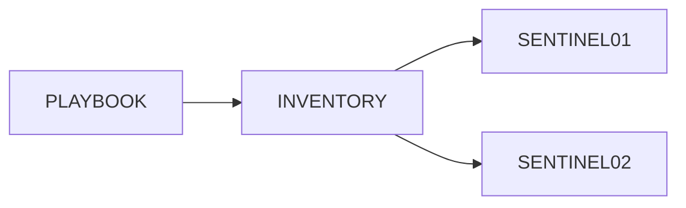

Toutes les machines appartenant au groupe `sentinel` exécuteront les tâches du playbook.

---

## Le champ `tasks`

La section :

```yaml
tasks:
```

contient la liste des opérations à réaliser.

Chaque tâche possède généralement :

- un nom ;
- un module ;
- les paramètres du module.

Par exemple :

```yaml
- name: Installer nginx

  dnf:
    name: nginx
    state: present
```

ou :

```yaml
- name: Démarrer le service

  service:
    name: nginx
    state: started
```

Chaque tâche est exécutée dans l'ordre où elle apparaît dans le fichier.

---

## Le module `debug`

Le module `debug` est très utile lors de l'apprentissage.

Il ne modifie pas le système.

Il affiche simplement une information.

```yaml
- name: Afficher un message

  debug:
    msg: "Bonjour Sentinel"
```

Le résultat obtenu est proche de :

```text
TASK [Afficher un message]

ok: [sentinel01] =>

    msg: Bonjour Sentinel
```

Ce module sera très utilisé pour :

- afficher des variables ;
- vérifier un calcul ;
- comprendre le fonctionnement d'un playbook.

Il constitue un excellent outil de diagnostic pendant le développement des automatisations.

## Exécuter un playbook

Une fois le playbook écrit, il doit être exécuté.

La commande la plus courante est :

```bash
ansible-playbook playbook.yml
```

Si un inventaire spécifique est utilisé, il faut le préciser.

```bash
ansible-playbook \
    -i inventory/hosts.yml \
    playbook.yml
```

Ansible lit alors :

1. l'inventaire ;
2. le playbook ;
3. les variables ;
4. les rôles éventuels.

Il exécute ensuite les tâches sur les hôtes concernés.

---

## Le déroulement d'une exécution

Une exécution suit généralement cette séquence.

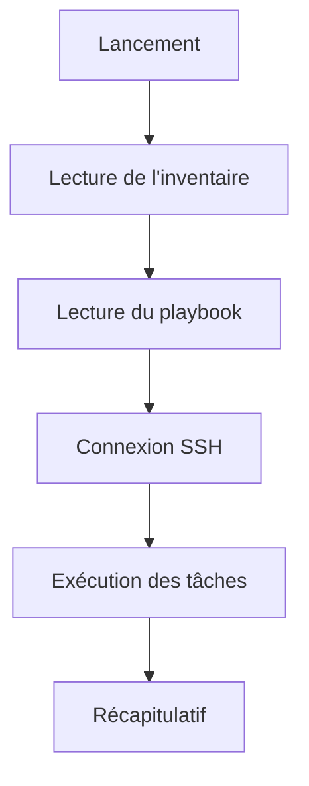

Chaque étape peut produire des messages d'information ou des erreurs.

Apprendre à les interpréter est essentiel.

---

## Le résultat d'une tâche

Lorsqu'une tâche est exécutée, Ansible affiche son état.

Les états les plus courants sont :

| État | Signification |
|------|---------------|
| `ok` | Rien n'avait besoin d'être modifié |
| `changed` | Une modification a été effectuée |
| `failed` | La tâche a échoué |
| `skipped` | La tâche n'a pas été exécutée |
| `unreachable` | Le serveur n'a pas pu être joint |

Ces états permettent de comprendre immédiatement ce qui s'est passé sur chaque machine.

---

## Exemple d'exécution

Imaginons un playbook qui installe `htop`.

Le résultat peut être :

```text
PLAY [Serveurs Sentinel]

TASK [Installer htop]

changed: [sentinel01]

ok: [sentinel02]
```

L'interprétation est immédiate.

- `sentinel01` ne possédait pas encore le paquet.
- `sentinel02` était déjà conforme.

Aucune comparaison manuelle n'est nécessaire.

---

## Le récapitulatif final

À la fin de l'exécution, Ansible affiche un résumé.

Par exemple :

```text
PLAY RECAP

sentinel01 :

ok=5

changed=2

failed=0

sentinel02 :

ok=7

changed=0

failed=0
```

Ce tableau est extrêmement précieux.

Il permet de savoir :

- quelles machines ont été modifiées ;
- lesquelles étaient déjà conformes ;
- lesquelles ont rencontré un problème.

Lorsqu'un parc comporte plusieurs centaines de serveurs, ce récapitulatif devient l'un des premiers éléments consultés après chaque déploiement.

---

## Pourquoi ce résumé est-il important ?

Imaginons que cinquante serveurs soient concernés.

Quarante-neuf affichent :

```text
changed=0
```

Mais un serveur affiche :

```text
failed=1
```

L'administrateur sait immédiatement où concentrer son diagnostic.

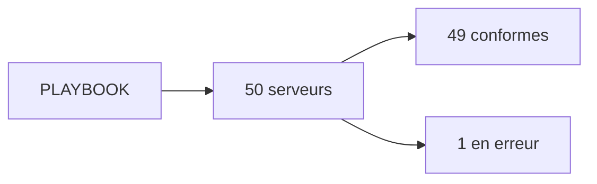

Cette capacité à identifier rapidement les anomalies constitue l'un des grands avantages d'Ansible par rapport à des scripts Shell classiques.

## Les tâches sont exécutées dans l'ordre

Un playbook est lu de haut en bas.

Les tâches sont exécutées exactement dans l'ordre où elles apparaissent.

Prenons l'exemple suivant.

```yaml
tasks:

  - name: Installer Sentinel

  - name: Déployer la configuration

  - name: Démarrer le service
```

Le déroulement est donc :


Cette séquence est importante.

Un service ne peut généralement pas être démarré avant d'être installé.

---

## Que se passe-t-il en cas d'erreur ?

Par défaut, lorsqu'une tâche échoue sur un hôte, Ansible arrête immédiatement l'exécution du playbook pour cet hôte.

Imaginons :

```yaml
- Installer Sentinel

- Copier la configuration

- Démarrer Sentinel
```

Si l'installation échoue.

Les deux tâches suivantes ne seront pas exécutées.

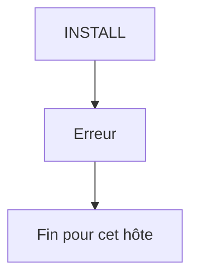

Cette stratégie évite d'aggraver la situation.

Il serait inutile de tenter de démarrer un service qui n'a pas pu être installé.

---

## Les autres serveurs continuent

Attention.

Cette interruption concerne uniquement le serveur en erreur.

Les autres hôtes poursuivent normalement leur exécution.

Prenons deux serveurs.

```text
sentinel01

sentinel02
```

Si `sentinel01` rencontre un problème.

```text
sentinel02
```

continue son exécution.

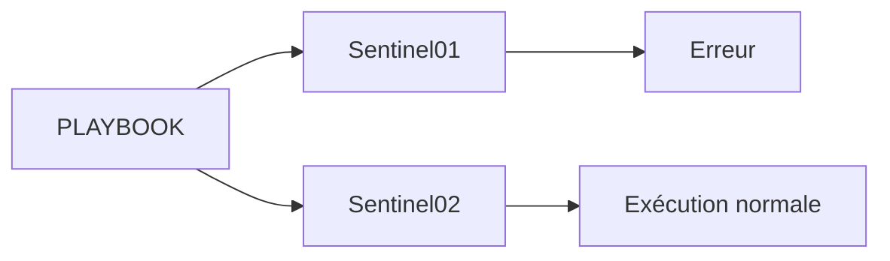

Cette indépendance est particulièrement utile lors de déploiements sur un grand nombre de machines.

---

## Pourquoi cet ordre est-il important ?

L'ordre des tâches permet d'exprimer les dépendances.

Par exemple.

Avant de copier un fichier dans :

```text
/opt/sentinel/
```

Il faut que ce répertoire existe.

Avant d'activer un service.

Il faut que son unité `systemd` soit présente.

Avant d'obtenir un certificat.

Il faut que le serveur soit intégré à FreeIPA.

Autrement dit, un bon playbook raconte une histoire logique.

Chaque étape prépare la suivante.

---

## Une bonne pratique

Lorsque vous relisez un playbook, posez-vous une question simple.

> **Une personne qui découvre ce projet comprend-elle immédiatement la chronologie du déploiement ?**

Si la réponse est oui, votre playbook est probablement bien structuré.

Si ce n'est pas le cas, il est souvent préférable de :

- découper certaines tâches ;
- les réordonner ;
- leur donner un nom plus explicite.

La lisibilité d'un playbook est presque aussi importante que son fonctionnement.

## Le premier véritable playbook

Écrivons maintenant un playbook simple mais réaliste.

Son objectif sera :

- vérifier que les serveurs sont joignables ;
- installer un paquet ;
- démarrer un service.

```yaml
---
- name: Préparer les serveurs Sentinel

  hosts: sentinel
  become: true

  tasks:

    - name: Installer htop
      dnf:
        name: htop
        state: present

    - name: Activer chronyd
      service:
        name: chronyd
        state: started
        enabled: true
```

Ce playbook reste volontairement simple.

Pourtant, il contient déjà plusieurs notions importantes.

---

## La directive `become`

Une ligne mérite une attention particulière.

```yaml
become: true
```

Pourquoi est-elle nécessaire ?

Parce que la plupart des opérations d'administration nécessitent des privilèges élevés.

Par exemple :

- installer un paquet ;
- modifier `/etc` ;
- gérer un service ;
- créer un utilisateur.

Le playbook est généralement lancé avec un utilisateur non privilégié.

Ansible élève ensuite temporairement ses privilèges grâce à `sudo`.

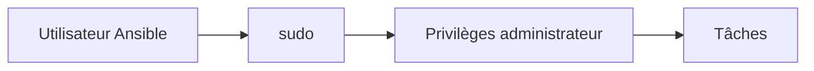

Cette approche est beaucoup plus sûre que de se connecter directement en tant que `root`.

---

## Pourquoi ne pas utiliser `root` ?

Nous avons déjà abordé cette question dans les campagnes précédentes.

Les mêmes arguments s'appliquent ici.

Se connecter directement en tant que `root` présente plusieurs inconvénients :

- journalisation moins précise ;
- surface d'attaque plus importante ;
- impossibilité de contrôler finement les autorisations.

Il est préférable de :

1. ouvrir une session avec un compte personnel ;
2. utiliser `sudo` lorsque c'est nécessaire.

Ansible reproduit exactement cette philosophie grâce à `become`.

---

## Le principe du moindre privilège

Toutes les tâches n'ont pas besoin des privilèges administrateur.

Par exemple.

Afficher un message.

```yaml
- debug:
    msg: "Bonjour"
```

ne nécessite pas `root`.

À l'inverse.

Installer un paquet.

```yaml
- dnf:
    name: htop
```

l'exige.

Une bonne pratique consiste à limiter l'utilisation de `become` aux tâches qui en ont réellement besoin.

Cela réduit les risques et rend les playbooks plus explicites.

---

## Une remarque importante

Dans de nombreux exemples disponibles sur Internet, `become: true` est placé au niveau du playbook entier.

C'est pratique pour les démonstrations.

Dans un projet professionnel, il est souvent préférable de se demander :

> **Cette tâche a-t-elle réellement besoin de privilèges élevés ?**

Cette réflexion rejoint un principe que nous appliquons depuis le début de cette formation :

> **Le moindre privilège ne concerne pas uniquement les utilisateurs. Il s'applique également aux automatisations.**

## Tester la connectivité avec `ping`

Avant d'exécuter un playbook complexe, il est recommandé de vérifier que les machines sont accessibles.

Ansible fournit pour cela un module nommé :

```text
ping
```

Attention.

Il ne s'agit **pas** de la commande ICMP du système.

Le module `ping` vérifie que :

- la connexion SSH fonctionne ;
- Python est disponible sur l'hôte ;
- Ansible peut exécuter un module.

---

## Premier test

La commande est très simple.

```bash
ansible \
    -i inventory/hosts.yml \
    sentinel \
    -m ping
```

Le résultat attendu est proche de :

```text
sentinel01 | SUCCESS =>

    "ping": "pong"

sentinel02 | SUCCESS =>

    "ping": "pong"
```

Le mot :

```text
pong
```

ne signifie pas que le réseau répond au protocole ICMP.

Il signifie que le module Ansible a été exécuté avec succès.

---

## Pourquoi utiliser ce test ?

Supposons que votre playbook échoue immédiatement.

Le problème peut provenir de plusieurs causes.

- SSH est inaccessible.
- La clé SSH est incorrecte.
- Python est absent.
- L'inventaire est erroné.

Le module `ping` permet d'éliminer rapidement ces hypothèses.

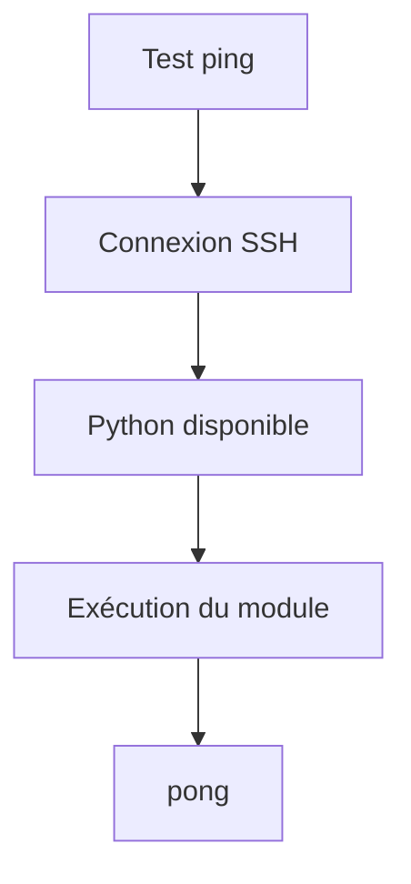

Avant tout déploiement important, ce test devrait devenir un réflexe.

---

## Tester un seul serveur

Il n'est pas obligatoire de cibler un groupe.

Vous pouvez également tester un seul hôte.

```bash
ansible \
    -i inventory/hosts.yml \
    sentinel01.lab.sentinel.test \
    -m ping
```

Cette possibilité est très utile lors d'un diagnostic.

Elle permet de vérifier une machine sans lancer le playbook sur tout le parc.

---

## Une bonne pratique

Dans notre laboratoire Sentinel, une séquence classique sera souvent :

```text
1. Vérifier le ping Ansible

↓

2. Exécuter le playbook

↓

3. Vérifier les services

↓

4. Contrôler les journaux
```

Cette méthode permet de distinguer rapidement :

- un problème d'accès ;
- un problème de déploiement ;
- un problème applicatif.

Avec l'expérience, vous constaterez que quelques secondes passées à vérifier la connectivité permettent souvent d'éviter de longues phases de diagnostic.

## Les commandes *ad hoc*

Jusqu'à présent, nous avons utilisé des playbooks.

Pourtant, Ansible permet également d'exécuter une commande unique, sans écrire de fichier YAML.

On parle alors de **commande *ad hoc***.

Le principe est simple.

Au lieu d'écrire un playbook :

```yaml
tasks:

  - name: Installer htop

    dnf:
      name: htop
      state: present
```

on exécute directement le module depuis la ligne de commande.

---

## La syntaxe générale

Une commande *ad hoc* suit généralement la forme suivante.

```bash
ansible \
    <groupe> \
    -i <inventaire> \
    -m <module> \
    -a "<arguments>"
```

Par exemple :

```bash
ansible \
    sentinel \
    -i inventory/hosts.yml \
    -m dnf \
    -a "name=htop state=present" \
    --become
```

Cette commande installe immédiatement le paquet sur tous les serveurs du groupe `sentinel`.

---

## Quand utiliser une commande *ad hoc* ?

Les commandes *ad hoc* sont idéales pour les opérations ponctuelles.

Par exemple :

- vérifier la connectivité ;
- récupérer une information ;
- redémarrer un service ;
- installer temporairement un paquet ;
- consulter la version d'un logiciel.

En revanche, elles ne sont pas adaptées aux déploiements complexes.

---

## Exemple : récupérer l'espace disque

Le module `command` permet d'exécuter une commande simple.

```bash
ansible \
    sentinel \
    -i inventory/hosts.yml \
    -m command \
    -a "df -h"
```

Chaque serveur renverra son propre résultat.

Cette approche est très pratique pour obtenir rapidement une information sur un grand nombre de machines.

---

## Exemple : redémarrer un service

Il est également possible d'utiliser directement le module `service`.

```bash
ansible \
    sentinel \
    -i inventory/hosts.yml \
    -m service \
    -a "name=sentinel state=restarted" \
    --become
```

Cette commande redémarre immédiatement le service Sentinel sur tous les serveurs du groupe.

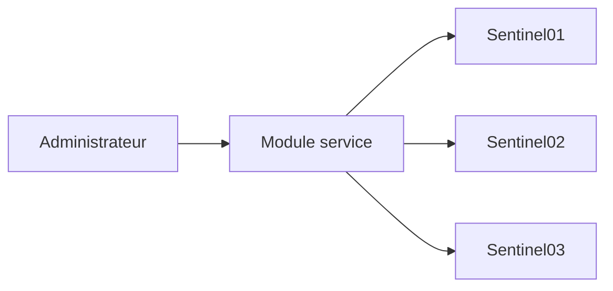

Une seule commande permet ainsi d'administrer tout un parc.

---

## Commandes *ad hoc* ou playbooks ?

Les deux approches sont complémentaires.

| Commandes *ad hoc* | Playbooks |
|--------------------|-----------|
| Rapides | Reproductibles |
| Une seule opération | Déploiement complet |
| Pas de fichier YAML | Documentation du processus |
| Dépannage | Industrialisation |

Une règle simple peut être retenue.

> **Si l'action mérite d'être rejouée ou versionnée, elle mérite probablement un playbook.**

Les commandes *ad hoc* sont excellentes pour le diagnostic quotidien.

Les playbooks sont destinés à construire et maintenir durablement l'infrastructure.

## Les modes d'exécution

Avant d'exécuter un playbook sur une infrastructure de production, une question revient toujours.

> **Que va réellement modifier Ansible ?**

Heureusement, il n'est pas nécessaire de lancer le playbook pour le découvrir.

Ansible propose plusieurs modes d'exécution permettant de vérifier son comportement.

Le plus important est le **mode Check**.

---

## Le mode Check (`--check`)

Le mode Check est souvent appelé **mode simulation**.

Il exécute le playbook sans appliquer les modifications.

La commande est très simple.

```bash
ansible-playbook \
    -i inventory/hosts.yml \
    playbook.yml \
    --check
```

Ansible tente alors de déterminer :

- ce qui devrait être modifié ;
- quelles tâches seraient exécutées ;
- quels fichiers seraient créés ;
- quels services seraient redémarrés.

Aucune modification réelle n'est effectuée.

---

## Pourquoi utiliser le mode Check ?

Prenons un exemple.

Vous venez de modifier un playbook qui configure :

- `firewalld` ;
- `sshd` ;
- Sentinel.

Avant de l'exécuter sur vingt serveurs, il est prudent de vérifier son comportement.

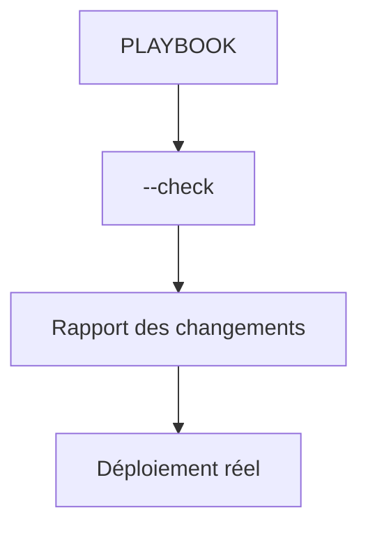

Le mode Check réduit considérablement le risque d'erreur.

Il devrait être utilisé systématiquement avant les opérations sensibles.

---

## Les limites du mode Check

Le mode Check n'est cependant pas parfait.

Certains modules savent précisément simuler leurs actions.

D'autres ne le peuvent pas.

Par exemple, une tâche reposant sur une commande Shell complexe peut ne pas être correctement simulée.

Il faut donc considérer `--check` comme une aide précieuse, mais pas comme une garantie absolue.

---

## Le mode Diff (`--diff`)

Un second mode est particulièrement utile.

```bash
--diff
```

Il affiche les différences qui seront appliquées aux fichiers.

Prenons un fichier de configuration.

Avant :

```text
Port 22
```

Après le playbook :

```text
Port 2222
```

Avec :

```bash
ansible-playbook \
    --diff
```

Ansible affichera précisément cette modification.

Cela facilite énormément les revues de changements.

---

## Associer les deux modes

Dans la pratique, on combine très souvent les deux options.

```bash
ansible-playbook \
    -i inventory/hosts.yml \
    playbook.yml \
    --check \
    --diff
```

On obtient alors :

- une simulation ;
- les différences prévues sur les fichiers.

Cette combinaison constitue l'une des meilleures pratiques avant un déploiement en production.

Elle permet de détecter très tôt une erreur de configuration, tout en gardant une excellente visibilité sur les changements à venir.

## Les tags

Au fil du temps, un playbook peut contenir plusieurs dizaines, voire plusieurs centaines de tâches.

Or, il n'est pas toujours nécessaire de toutes les exécuter.

Ansible propose pour cela un mécanisme appelé **tags**.

Un tag permet d'associer une ou plusieurs tâches à un mot-clé.

---

## Ajouter un tag

Prenons l'exemple suivant.

```yaml
- name: Installer Sentinel
  dnf:
    name: sentinel
    state: present
  tags:
    - install
```

Puis une seconde tâche.

```yaml
- name: Démarrer Sentinel
  service:
    name: sentinel
    state: started
  tags:
    - service
```

Chaque tâche appartient désormais à une catégorie.

---

## Exécuter uniquement certaines tâches

Supposons que Sentinel soit déjà installé.

Vous souhaitez uniquement redémarrer le service.

Il suffit d'utiliser :

```bash
ansible-playbook \
    playbook.yml \
    --tags service
```

Seules les tâches portant le tag :

```text
service
```

seront exécutées.

Toutes les autres seront ignorées.

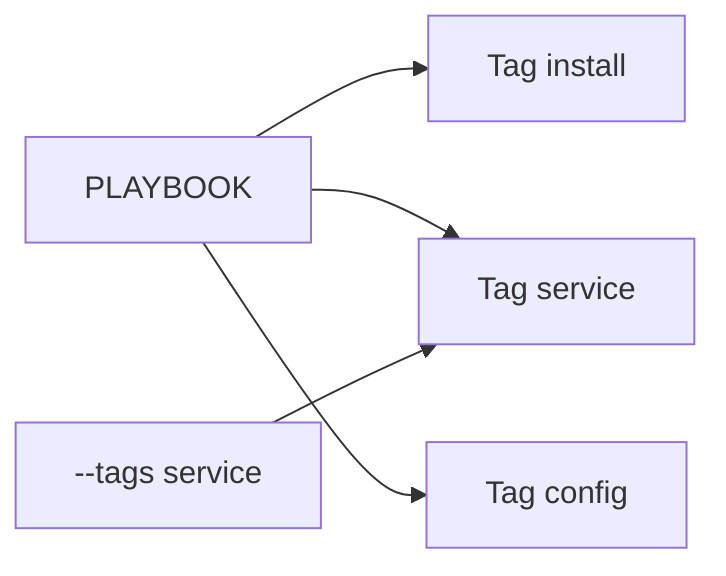

---

## Ignorer certaines tâches

L'inverse est également possible.

Par exemple :

```bash
ansible-playbook \
    playbook.yml \
    --skip-tags install
```

Toutes les tâches seront exécutées.

Sauf celles possédant le tag :

```text
install
```

Cette fonctionnalité est particulièrement pratique lors des mises à jour.

---

## Bien choisir ses tags

Les tags doivent représenter des fonctionnalités.

Par exemple :

```text
install

config

firewall

tls

freeipa

sentinel

systemd

backup
```

Évitez des noms trop vagues comme :

```text
test

divers

temp
```

Ils deviennent rapidement difficiles à interpréter.

---

## Les tags dans Sentinel

Dans notre projet, un découpage pertinent pourrait être :

```text
install
```

Installation des paquets.

```text
config
```

Déploiement des fichiers YAML.

```text
tls
```

Installation des certificats.

```text
freeipa
```

Intégration au domaine.

```text
service
```

Gestion de `systemd`.

```text
firewall
```

Configuration de `firewalld`.

Grâce à ces tags, il deviendra possible de rejouer uniquement une partie du déploiement.

Par exemple, après le renouvellement d'un certificat, il sera inutile de réinstaller complètement Sentinel.

Il suffira d'exécuter les tâches concernées par le tag approprié.

Cette granularité constitue l'un des grands atouts d'Ansible lorsqu'une infrastructure devient importante.

## Les handlers

Jusqu'à présent, chaque tâche est exécutée indépendamment.

Imaginons maintenant le scénario suivant.

Un fichier de configuration est modifié.

```text
/etc/sentinel/sentinel.yml
```

Faut-il redémarrer immédiatement le service ?

Oui.

Mais uniquement si le fichier a réellement changé.

Ansible propose pour cela un mécanisme très élégant :

> les **handlers**.

---

## Le principe

Une tâche peut demander à être notifiée lorsqu'elle effectue une modification.

Par exemple :

```yaml
- name: Déployer la configuration

  template:
    src: sentinel.yml.j2
    dest: /etc/sentinel/sentinel.yml

  notify:
    - Redémarrer Sentinel
```

Si le fichier est modifié.

Le handler est déclenché.

Sinon.

Il ne sera jamais exécuté.

---

## Déclarer un handler

Les handlers sont placés dans une section spécifique.

```yaml
handlers:

  - name: Redémarrer Sentinel

    service:
      name: sentinel
      state: restarted
```

Leur syntaxe ressemble beaucoup à celle des tâches classiques.

La différence réside dans leur mode d'exécution.

---

## Pourquoi utiliser un handler ?

Prenons un exemple.

Trois fichiers sont copiés.

```text
sentinel.yml

tls.yml

logging.yml
```

Tous nécessitent un redémarrage du service.

Sans handler.

```text
Copie 1

↓

Restart

↓

Copie 2

↓

Restart

↓

Copie 3

↓

Restart
```

Le service est redémarré trois fois.

C'est inutile.

---

## Avec un handler

Les trois tâches notifient le même handler.

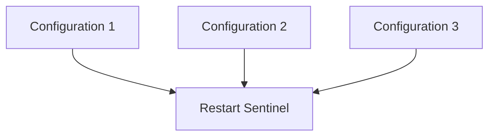

Même si les trois fichiers changent.

Le service ne sera redémarré qu'une seule fois.

À la fin du play.

---

## Pourquoi à la fin ?

Cette stratégie présente plusieurs avantages.

Pendant le déploiement.

Toutes les modifications sont appliquées.

Puis seulement ensuite.

Le service est redémarré.

Ainsi, Sentinel ne démarre jamais avec une configuration partiellement mise à jour.

Ce comportement améliore :

- la cohérence ;
- les performances ;
- la disponibilité du service.

Vous constaterez rapidement que les handlers sont omniprésents dans les projets Ansible professionnels.

Ils constituent la méthode recommandée pour gérer les redémarrages de services, les rechargements de configurations et plus généralement toutes les actions qui ne doivent être exécutées qu'en cas de modification réelle.

## Les notifications

Le fonctionnement des handlers repose sur un mécanisme appelé **notification**.

Lorsqu'une tâche modifie réellement le système, elle peut envoyer une notification.

Cette notification ne lance pas immédiatement le handler.

Elle est simplement mémorisée par Ansible.

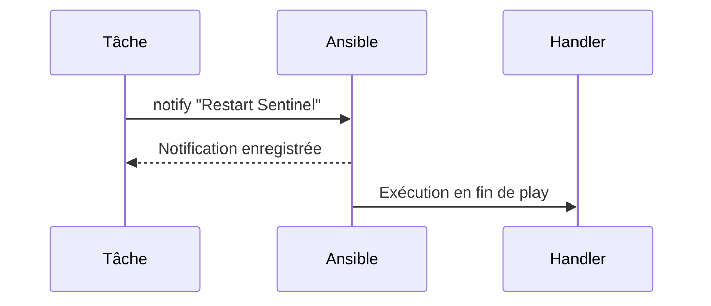

Cette différence est importante.

Le handler n'est pas appelé au moment de la notification.

Il est exécuté uniquement lorsque toutes les tâches du play sont terminées.

---

## Une notification n'est envoyée qu'en cas de changement

Prenons le cas d'un fichier de configuration.

Premier lancement.

```text
Le fichier est modifié.
```

Résultat :

```text
changed
```

La notification est envoyée.

Le handler sera exécuté.

Deuxième lancement.

Le fichier est déjà identique.

Résultat :

```text
ok
```

Aucune notification n'est envoyée.

Le handler ne sera pas exécuté.

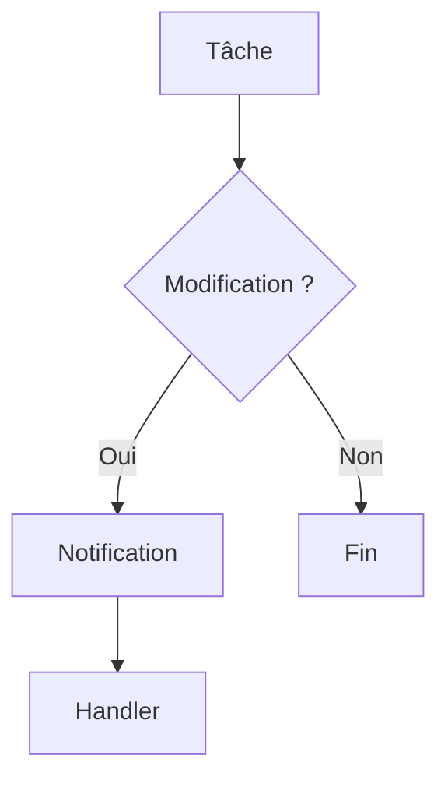

Les handlers héritent donc naturellement de l'idempotence d'Ansible.

---

## Plusieurs tâches, un seul handler

Une caractéristique très intéressante est que plusieurs tâches peuvent notifier le même handler.

Par exemple.

```yaml
- name: Déployer la configuration TLS
  notify: Restart Sentinel
```

```yaml
- name: Déployer la configuration HTTP
  notify: Restart Sentinel
```

```yaml
- name: Déployer la configuration des journaux
  notify: Restart Sentinel
```

Même si les trois tâches provoquent une modification.

Le handler :

```text
Restart Sentinel
```

ne sera exécuté qu'une seule fois.

Cette optimisation est réalisée automatiquement par Ansible.

---

## Les handlers peuvent être réutilisés

Rien n'empêche plusieurs rôles d'utiliser le même handler.

Par exemple.

```text
Configuration TLS

↓

Restart Sentinel
```

```text
Configuration systemd

↓

Restart Sentinel
```

```text
Configuration de l'application

↓

Restart Sentinel
```

Tous ces composants convergent vers une seule action finale.

Cela évite les redémarrages inutiles et simplifie énormément les playbooks.

---

## Une bonne pratique

Un handler ne doit généralement contenir qu'une seule responsabilité.

Par exemple.

```text
Restart Sentinel
```

ou :

```text
Reload firewalld
```

ou encore :

```text
Reload systemd
```

Évitez les handlers réalisant plusieurs opérations sans lien direct.

Comme pour les tâches, une responsabilité claire facilite :

- la lecture ;
- le débogage ;
- la maintenance.

Dans les chapitres suivants, nous utiliserons abondamment les handlers lors du déploiement de Sentinel afin de ne redémarrer les services que lorsque cela est réellement nécessaire.

## Les conditions

Jusqu'à présent, toutes les tâches étaient exécutées systématiquement.

Or, dans une infrastructure réelle, certaines opérations ne doivent être réalisées que dans des cas précis.

Par exemple :

- uniquement sur les serveurs FreeIPA ;
- uniquement sous AlmaLinux ;
- uniquement si TLS est activé ;
- uniquement si Sentinel est installé.

Ansible permet cela grâce aux **conditions**.

---

## Le mot-clé `when`

Une condition est exprimée avec le mot-clé :

```yaml
when:
```

Prenons un exemple simple.

```yaml
- name: Installer le certificat

  copy:
    src: sentinel.crt
    dest: /etc/pki/tls/certs/

  when: sentinel_tls_enabled
```

Si la variable :

```yaml
sentinel_tls_enabled
```

vaut :

```text
true
```

La tâche est exécutée.

Sinon, elle est ignorée.

---

## Une première utilisation

Imaginons que notre laboratoire comporte :

- des serveurs Sentinel ;
- des serveurs de test.

Seuls les premiers utilisent TLS.

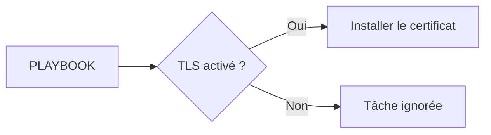

Un seul playbook suffit désormais pour gérer les deux situations.

---

## Tester le système d'exploitation

Les conditions servent également à adapter un playbook à plusieurs distributions Linux.

Par exemple.

```yaml
when:

  ansible_distribution == "AlmaLinux"
```

Ou encore.

```yaml
when:

  ansible_os_family == "RedHat"
```

La tâche ne sera exécutée que si le système correspond au critère demandé.

Cette possibilité est très utile lorsqu'un même playbook cible plusieurs environnements.

---

## Combiner plusieurs conditions

Il est possible de combiner plusieurs critères.

Par exemple.

```yaml
when:

  - sentinel_tls_enabled

  - ansible_distribution == "AlmaLinux"
```

Les deux conditions doivent être vraies.

On peut ainsi exprimer des règles très précises.

Par exemple.

> Déployer les certificats uniquement sur les serveurs Sentinel fonctionnant sous AlmaLinux.

---

## Pourquoi utiliser des conditions ?

Sans condition, il faudrait maintenir plusieurs playbooks.

Par exemple.

```text
playbook-almalinux.yml

playbook-debian.yml

playbook-sentinel.yml

playbook-freeipa.yml
```

Très rapidement, ces fichiers divergeraient.

Grâce à `when`, un même playbook peut s'adapter au contexte d'exécution.

Cette approche réduit fortement les duplications et facilite la maintenance.

Dans la suite de cette campagne, nous verrons que les conditions, associées aux variables d'inventaire, permettent de construire des automatisations extrêmement flexibles tout en conservant une excellente lisibilité.

## Les faits (*Facts*)

Dans le chapitre précédent, nous avons utilisé des variables comme :

```yaml
ansible_distribution
```

Une question se pose naturellement.

> D'où viennent ces informations ?

La réponse est simple.

Avant d'exécuter un playbook, Ansible collecte automatiquement un grand nombre d'informations sur chaque machine.

Ces informations sont appelées les **Facts**.

---

## Qu'est-ce qu'un Fact ?

Un Fact est une information décrivant l'état d'un hôte.

Par exemple :

- le système d'exploitation ;
- la version du noyau ;
- le nom d'hôte ;
- les interfaces réseau ;
- la mémoire disponible ;
- les processeurs ;
- les disques ;
- les adresses IP.

Ces informations sont accessibles sous forme de variables.

---

## La collecte des Facts

Au début d'un playbook, Ansible exécute généralement une tâche implicite.

```text
Gathering Facts
```

Son rôle est de collecter les informations nécessaires.

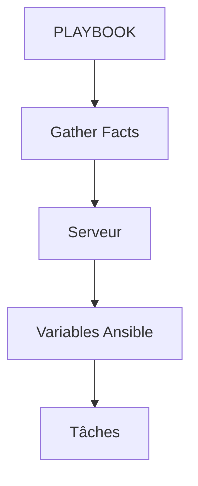

Les tâches peuvent ensuite utiliser ces variables sans effectuer elles-mêmes les vérifications.

---

## Quelques Facts utiles

Voici quelques exemples parmi les plus utilisés.

| Variable | Description |
|----------|-------------|
| `ansible_hostname` | Nom d'hôte |
| `ansible_fqdn` | Nom de domaine complet |
| `ansible_distribution` | Distribution Linux |
| `ansible_distribution_version` | Version de la distribution |
| `ansible_os_family` | Famille du système |
| `ansible_architecture` | Architecture du processeur |
| `ansible_memtotal_mb` | Mémoire totale |
| `ansible_processor_vcpus` | Nombre de processeurs virtuels |

Ces informations permettent d'adapter automatiquement les playbooks à chaque machine.

---

## Afficher un Fact

Le module `debug` permet de consulter facilement une variable.

Par exemple.

```yaml
- name: Afficher le FQDN

  debug:
    var: ansible_fqdn
```

Le résultat pourra être :

```text
ok:

ansible_fqdn:

sentinel01.lab.sentinel.test
```

Cette technique est très pratique pour comprendre les informations mises à disposition par Ansible.

---

## Pourquoi les Facts sont-ils importants ?

Imaginons que Sentinel doive utiliser un nombre de processus dépendant du nombre de processeurs.

Sans les Facts.

Il faudrait définir cette valeur manuellement pour chaque serveur.

Avec les Facts.

Le playbook peut s'adapter automatiquement.


Cette capacité d'adaptation est l'une des grandes forces d'Ansible.

Elle permet d'écrire des playbooks génériques qui fonctionnent sur des machines aux caractéristiques différentes, sans avoir à maintenir une configuration spécifique pour chacune d'elles.

## Explorer les Facts

Les Facts sont extrêmement nombreux.

Une installation standard d'Ansible en collecte souvent plusieurs centaines.

Il est évidemment impossible de tous les mémoriser.

L'important est de savoir les explorer.

---

## Afficher tous les Facts

La commande la plus simple est :

```bash
ansible \
    sentinel01.lab.sentinel.test \
    -i inventory/hosts.yml \
    -m setup
```

Le module :

```text
setup
```

est responsable de la collecte des Facts.

Le résultat est un très grand document JSON contenant toutes les informations découvertes.

---

## Filtrer les résultats

Afficher plusieurs centaines de variables n'est pas toujours pratique.

Le module `setup` permet de filtrer les informations.

Par exemple.

```bash
ansible \
    sentinel01.lab.sentinel.test \
    -i inventory/hosts.yml \
    -m setup \
    -a "filter=ansible_distribution*"
```

Le résultat pourra ressembler à :

```text
ansible_distribution

ansible_distribution_major_version

ansible_distribution_release

ansible_distribution_version
```

Cette méthode est beaucoup plus confortable pour découvrir les variables disponibles.

---

## Les Facts réseau

Ansible collecte également les informations concernant les interfaces réseau.

Par exemple :

- les adresses IPv4 ;
- les adresses IPv6 ;
- les interfaces disponibles ;
- la passerelle par défaut.

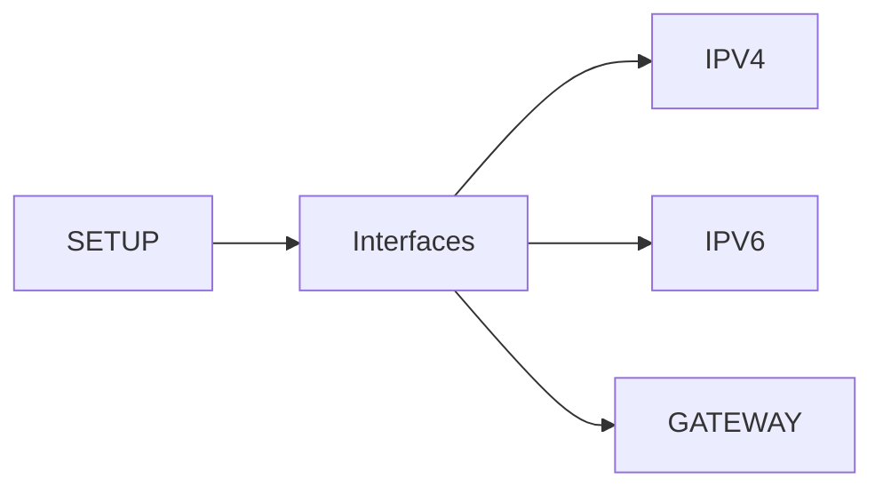

Ces informations sont très utiles pour adapter automatiquement une configuration réseau.

---

## Les Facts matériels

Le matériel est lui aussi découvert automatiquement.

Par exemple :

- quantité de mémoire ;
- architecture ;
- nombre de processeurs ;
- disques ;
- périphériques.

On peut ainsi écrire un playbook qui adapte la configuration de Sentinel à la puissance de chaque serveur.

Par exemple.

Un serveur possédant :

```text
32 Go RAM
```

n'utilisera pas nécessairement les mêmes paramètres qu'un serveur limité à :

```text
2 Go RAM
```

---

## Une bonne pratique

Il est déconseillé de mémoriser les noms des centaines de Facts disponibles.

En revanche, il est très utile de retenir deux réflexes.

Le premier consiste à utiliser :

```bash
ansible ... -m setup
```

pour explorer les informations disponibles.

Le second consiste à afficher une variable avec :

```yaml
debug:
  var: ...
```

Ces deux outils suffisent généralement à retrouver rapidement le Fact dont vous avez besoin, sans avoir à consulter la documentation à chaque fois.

Dans le prochain chapitre, nous commencerons à exploiter ces Facts pour rendre nos playbooks véritablement dynamiques et capables de s'adapter automatiquement aux caractéristiques de chaque serveur.

## Désactiver la collecte des Facts

Par défaut, Ansible collecte automatiquement les Facts au début de chaque play.

Cette opération est très pratique.

Elle possède néanmoins un coût.

Sur une seule machine, il est presque imperceptible.

Sur plusieurs centaines de serveurs, il peut représenter plusieurs secondes, voire plusieurs dizaines de secondes.

---

## Le paramètre `gather_facts`

La collecte automatique est contrôlée par la directive :

```yaml
gather_facts:
```

Par défaut, elle vaut implicitement :

```yaml
gather_facts: true
```

Il est possible de la désactiver.

```yaml
---
- name: Exemple

  hosts: sentinel

  gather_facts: false

  tasks:

    - name: Vérifier la connectivité

      ping:
```

Dans cet exemple, Ansible ne lance pas la phase :

```text
Gathering Facts
```

Le playbook démarre immédiatement.

---

## Quand désactiver les Facts ?

Prenons un exemple.

Vous souhaitez uniquement vérifier que les serveurs sont joignables.

```yaml
tasks:

  - ping:
```

Aucune information sur :

- le processeur ;
- la mémoire ;
- les interfaces réseau.

n'est nécessaire.

La collecte des Facts serait donc inutile.

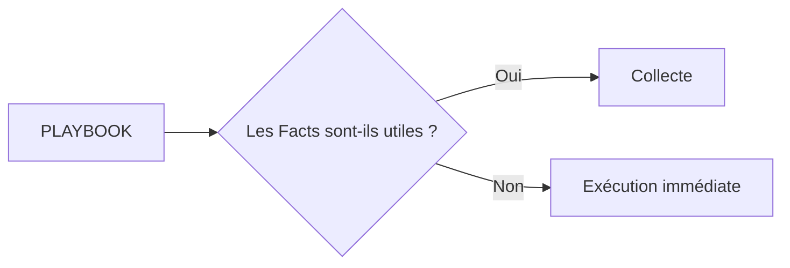

---

## Quand faut-il les conserver ?

En revanche, si le playbook contient :

```yaml
when:

  ansible_distribution == "AlmaLinux"
```

ou :

```yaml
debug:

  var: ansible_fqdn
```

Alors les Facts sont indispensables.

Sans eux, Ansible ne connaît pas ces variables.

Le playbook échouera.

---

## Une optimisation progressive

Il est fréquent de voir les débutants laisser :

```yaml
gather_facts: true
```

dans tous les playbooks.

C'est parfaitement acceptable.

Avec l'expérience, on apprend à distinguer :

- les playbooks nécessitant réellement les Facts ;
- ceux qui peuvent s'en passer.

Cette optimisation devient particulièrement intéressante dans les grandes infrastructures où plusieurs centaines de machines sont administrées simultanément.

---

## Une règle simple

Avant de désactiver les Facts, posez-vous cette question.

> **Mon playbook utilise-t-il une information propre à la machine distante ?**

Si la réponse est :

**Oui**

laissez :

```yaml
gather_facts: true
```

Si la réponse est :

**Non**

vous pouvez envisager :

```yaml
gather_facts: false
```

Cette décision, bien que simple, participe à la construction de playbooks plus rapides et plus efficaces, sans compromettre leur lisibilité.

## Les variables enregistrées

Jusqu'à présent, nous avons utilisé :

- les variables d'inventaire ;
- les Facts.

Mais Ansible permet également de créer des variables pendant l'exécution d'un playbook.

Pour cela, on utilise le mot-clé :

```yaml
register:
```

---

## Pourquoi enregistrer un résultat ?

Imaginons que nous souhaitions connaître l'état d'un service.

Nous pouvons utiliser le module :

```yaml
systemd_service:
```

Le résultat retourné peut ensuite être réutilisé.

```yaml
- name: Vérifier Sentinel

  systemd_service:
    name: sentinel

  register: sentinel_service
```

Le résultat complet est désormais stocké dans :

```text
sentinel_service
```

Cette variable pourra être utilisée par les tâches suivantes.

---

## Visualiser le contenu

Pour découvrir les informations enregistrées.

Le plus simple est :

```yaml
- name: Afficher le résultat

  debug:
    var: sentinel_service
```

Le résultat peut contenir :

- l'état du service ;
- son PID ;
- sa date de démarrage ;
- son statut ;
- diverses informations complémentaires.

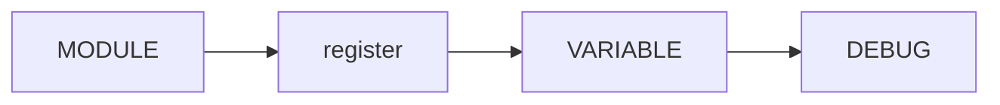

Cette technique est extrêmement utile pendant le développement d'un playbook.

---

## Réutiliser le résultat

Une variable enregistrée peut servir à prendre une décision.

Par exemple.

```yaml
when:
```

pourrait dépendre du résultat obtenu.

Schématiquement.

```text
Le service est actif ?

↓

Oui

↓

Continuer

↓

Non

↓

Arrêter le déploiement
```

Le playbook devient alors capable de réagir à la situation rencontrée sur chaque serveur.

---

## Les variables enregistrées sont temporaires

Contrairement aux variables d'inventaire.

Les variables créées avec :

```yaml
register:
```

n'existent que pendant l'exécution du playbook.

Une fois celui-ci terminé.

Elles disparaissent.

Lors de la prochaine exécution.

Elles seront recréées.

Cette caractéristique est importante.

Les variables enregistrées servent à mémoriser un résultat ponctuel, pas à stocker une configuration durable.

---

## Une bonne pratique

Le nom donné après :

```yaml
register:
```

doit être explicite.

Préférez :

```text
sentinel_service
```

à :

```text
result
```

ou :

```text
tmp
```

Quelques semaines plus tard, vous comprendrez immédiatement ce que contient la variable.

Comme pour les noms de tâches, un nom clair améliore considérablement la lisibilité et la maintenance des playbooks.

## Les variables Ansible : trois catégories

À ce stade de la formation, nous avons rencontré plusieurs types de variables.

Il est utile de les distinguer clairement.

### Les variables statiques

Elles sont définies par l'administrateur.

Par exemple :

```yaml
sentinel_port: 8443

sentinel_user: sentinel
```

On les trouve généralement dans :

- `group_vars/`
- `host_vars/`

Leur valeur reste identique tant qu'un administrateur ne la modifie pas.

---

### Les Facts

Ils sont découverts automatiquement par Ansible.

Par exemple :

```text
ansible_hostname

ansible_fqdn

ansible_distribution

ansible_processor_vcpus
```

Ces variables décrivent la machine distante.

Elles peuvent donc être différentes sur chaque serveur.

---

### Les variables enregistrées

Enfin, certaines variables sont créées pendant l'exécution.

```yaml
register:
```

Leur contenu dépend directement du résultat d'une tâche.

Par exemple :

- le résultat d'une commande ;
- l'état d'un service ;
- la sortie d'un module.

Elles n'existent que pendant l'exécution du playbook.

---

## Comparaison

| Type | Créée par | Durée de vie |
|-------|------------|--------------|
| Variable d'inventaire | Administrateur | Permanente |
| Fact | Ansible | Le temps du play |
| Variable `register` | Une tâche | Le temps du play |

Comprendre cette distinction facilite énormément la lecture des playbooks.

---

## Comment circulent les informations ?

On peut représenter les différentes sources de données ainsi.

```mermaid
flowchart LR

    INVENTORY[Inventaire]

    FACTS[Gather Facts]

    TASKS[Tâches]

    INVENTORY --> VARS

    FACTS --> VARS

    TASKS --> REGISTER

    REGISTER --> VARS

    VARS --> PLAYBOOK
```

Le playbook dispose donc d'informations provenant de plusieurs origines.

Toutes peuvent être utilisées dans les tâches.

---

## Un exemple dans Sentinel

Imaginons le déploiement de notre application.

Les informations peuvent provenir de différentes sources.

| Information | Origine |
|-------------|----------|
| Port HTTPS | `group_vars/sentinel.yml` |
| Nom DNS | `host_vars/sentinel01.yml` |
| Distribution Linux | `ansible_distribution` |
| Adresse IP | `ansible_default_ipv4` |
| État du service | `register` |

Le playbook combine ensuite toutes ces informations pour prendre ses décisions.

Cette capacité à agréger plusieurs sources de données est l'une des grandes forces d'Ansible.

---

## Une idée essentielle

Un bon playbook ne contient presque jamais de valeurs écrites en dur.

Il exploite plutôt :

- des variables d'inventaire ;
- des Facts ;
- des résultats enregistrés.

Plus un playbook s'appuie sur ces informations, plus il devient :

- réutilisable ;
- adaptable ;
- maintenable.

C'est précisément ce qui permettra, dans les prochains chapitres, de construire un déploiement unique capable de s'adapter automatiquement à toute notre infrastructure Sentinel.

## Synthèse

Le chapitre **Premiers playbooks** établit une brique du socle de sécurité Sentinel.

Avant de poursuivre, vérifiez que vous savez :

- expliquer le rôle des mécanismes présentés ;
- distinguer leur configuration de leur état réellement observé ;
- valider leur comportement dans le laboratoire ;
- conserver une configuration explicite, vérifiable et reproductible.

---

← [9.3 — Inventaires](9.3-inventaires.md) · [9.5 — Variables et templates](9.5-variables-templates.md) →
