# Chapitre 9.6 — Les rôles Ansible

> **Campagne 9 — Industrialisation avec Ansible**

> *« Un bon playbook automatise une tâche. Un bon rôle automatise un métier. »*

---

## Vous êtes ici

```text
PARTIE III — Industrialiser les déploiements

Campagne 9

  9.1 Pourquoi Ansible ? ✔
  9.2 Architecture d'Ansible ✔
  9.3 Inventaires ✔
  9.4 Premiers playbooks ✔
  9.5 Variables et templates ✔
► 9.6 Les rôles
  9.7 Déployer Sentinel
  9.8 Intégrer FreeIPA
  9.9 Industrialiser le laboratoire
  9.10 Mission : déploiement complet d'une infrastructure
```

---

## Objectifs pédagogiques

À la fin de ce chapitre, vous serez capable de :

- comprendre le rôle d'un rôle Ansible ;
- organiser un projet de manière professionnelle ;
- séparer les responsabilités d'un déploiement ;
- réutiliser facilement des composants entre plusieurs projets.

---

## Pourquoi ce chapitre existe

Ce chapitre fournit le modèle mental et les pratiques nécessaires pour aborder **Les rôles Ansible** dans un socle AlmaLinux sécurisé et reproductible.

---

## Pourquoi les rôles existent-ils ?

Imaginons un playbook unique.

Il contient :

- l'installation des paquets ;
- la configuration SSH ;
- `firewalld` ;
- FreeIPA ;
- Sentinel ;
- la journalisation ;
- les sauvegardes.

Après plusieurs mois.

Le fichier dépasse :

```text
2 000 lignes
```

Le maintenir devient difficile.

Chaque modification augmente le risque d'erreur.

---

## Découper par responsabilités

Au lieu d'un unique fichier.

Ansible propose de regrouper les tâches par domaine fonctionnel.

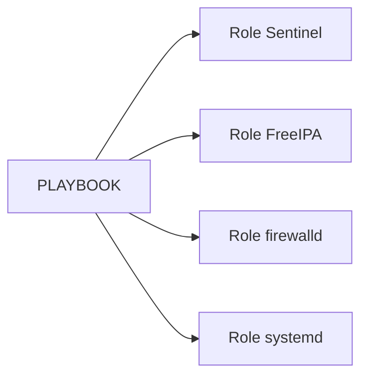

Chaque rôle possède une responsabilité clairement définie.

---

## Qu'est-ce qu'un rôle ?

Un rôle est un composant autonome.

Il regroupe tout ce qui est nécessaire à une fonctionnalité.

Par exemple.

Le rôle Sentinel peut contenir :

- les tâches ;
- les handlers ;
- les templates ;
- les variables ;
- les fichiers statiques.

Autrement dit.

Tout ce qui concerne Sentinel est regroupé au même endroit.

---

## Un premier exemple

Un playbook devient alors extrêmement simple.

```yaml
---
- name: Déployer Sentinel

  hosts: sentinel

  become: true

  roles:

    - sentinel
```

Le playbook ne décrit plus les détails.

Il indique simplement :

> Déployer le rôle Sentinel.

Toute la logique est désormais encapsulée dans ce rôle.

---

## Pourquoi cette approche est-elle meilleure ?

Imaginons que plusieurs projets utilisent Sentinel.

Sans rôle.

Il faudrait copier les tâches dans chaque projet.

Avec un rôle.

Tous les projets réutilisent exactement le même composant.

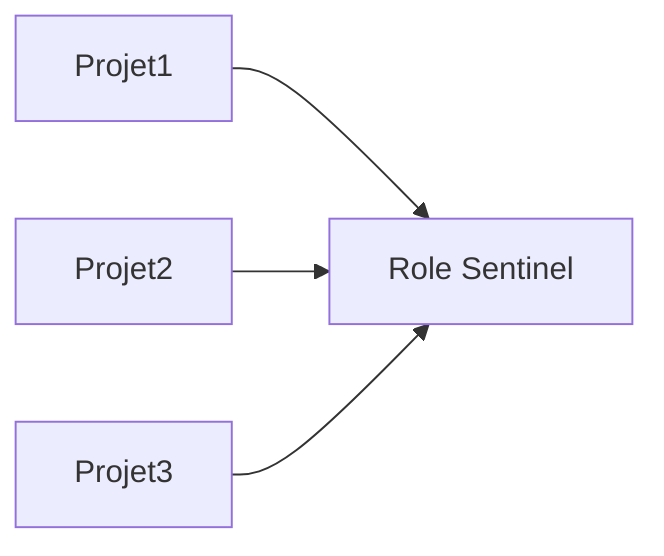

Une correction apportée au rôle bénéficie immédiatement à tous les projets qui l'utilisent.

Cette capacité de réutilisation est l'une des principales raisons pour lesquelles les rôles constituent aujourd'hui le standard de fait des projets Ansible professionnels.

## L'arborescence d'un rôle

Un rôle suit une structure bien définie.

Ansible sait automatiquement où trouver :

- les tâches ;
- les templates ;
- les handlers ;
- les variables.

Une arborescence minimale ressemble à ceci.

```text
roles/

└── sentinel/

    ├── tasks/

    ├── handlers/

    ├── templates/

    ├── files/

    ├── defaults/

    ├── vars/

    ├── meta/

    └── README.md
```

Cette organisation est utilisée dans la très grande majorité des projets professionnels.

---

## Le répertoire `tasks/`

Le cœur du rôle se trouve ici.

```text
tasks/
```

Il contient les tâches Ansible.

Le point d'entrée est toujours :

```text
tasks/main.yml
```

Par exemple.

```text
tasks/

└── main.yml
```

C'est ce fichier qu'Ansible exécute lorsqu'on appelle le rôle.

---

## Le répertoire `handlers/`

Les handlers sont regroupés dans :

```text
handlers/
```

Le point d'entrée est :

```text
handlers/main.yml
```

On y trouve généralement :

```yaml
Restart Sentinel

Reload systemd

Reload firewalld
```

Toutes les notifications du rôle convergent vers ce fichier.

---

## Le répertoire `templates/`

Les templates Jinja2 sont placés ici.

```text
templates/

    sentinel.yml.j2

    sentinel.service.j2

    nginx.conf.j2
```

Le module :

```yaml
template:
```

ira automatiquement chercher les fichiers dans ce répertoire.

---

## Le répertoire `files/`

Les fichiers qui ne nécessitent aucun traitement Jinja2 sont placés ici.

Par exemple.

```text
files/

    logo.png

    banner.txt

    helper.sh
```

Ils sont généralement déployés avec le module :

```yaml
copy:
```

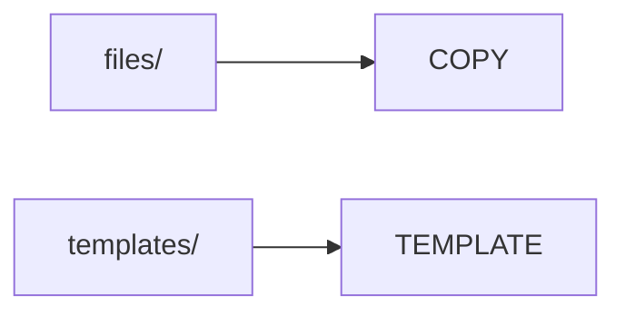

Cette séparation améliore immédiatement la lisibilité du projet.

---

## Pourquoi cette structure est-elle importante ?

Tous les rôles Ansible utilisent la même organisation.

Ainsi, lorsqu'un nouvel administrateur ouvre un projet qu'il ne connaît pas.

Il sait immédiatement où chercher :

- une tâche ;
- un template ;
- un handler ;
- une variable.

Cette standardisation est l'une des grandes forces d'Ansible.

Elle facilite énormément :

- le travail en équipe ;
- les revues de code ;
- la maintenance ;
- la réutilisation des rôles entre plusieurs projets.

## Le fichier `tasks/main.yml`

Le point d'entrée d'un rôle est toujours le fichier :

```text
tasks/main.yml
```

Lorsqu'un playbook appelle un rôle.

C'est ce fichier qui est exécuté en premier.

Par exemple.

```yaml
roles:

  - sentinel
```

Ansible recherche automatiquement :

```text
roles/

└── sentinel/

    └── tasks/

        └── main.yml
```

Aucun chemin n'a besoin d'être indiqué.

Cette convention est intégrée au fonctionnement d'Ansible.

---

## Un premier contenu

Le fichier peut contenir directement les tâches.

Par exemple.

```yaml
---
- name: Installer Sentinel

  dnf:
    name: sentinel
    state: present

- name: Déployer la configuration

  template:
    src: sentinel.yml.j2
    dest: /etc/sentinel/sentinel.yml

  notify:

    - Restart Sentinel
```

Cette approche fonctionne parfaitement pour un rôle simple.

---

## Le problème des gros rôles

Avec le temps.

Le nombre de tâches augmente.

Très rapidement.

On retrouve :

- l'installation ;
- la configuration ;
- TLS ;
- `systemd` ;
- la journalisation ;
- les sauvegardes.

Le fichier :

```text
tasks/main.yml
```

devient alors difficile à parcourir.

Il peut facilement dépasser plusieurs centaines de lignes.

---

## Découper les tâches

Une bonne pratique consiste à répartir les tâches dans plusieurs fichiers.

Par exemple.

```text
tasks/

    main.yml

    install.yml

    config.yml

    tls.yml

    service.yml

    firewall.yml
```

Chaque fichier traite un sujet unique.

Le rôle devient beaucoup plus lisible.

---

## Le module `import_tasks`

Le fichier :

```text
main.yml
```

sert alors uniquement à assembler ces différentes parties.

```yaml
---
- import_tasks: install.yml

- import_tasks: config.yml

- import_tasks: tls.yml

- import_tasks: service.yml
```

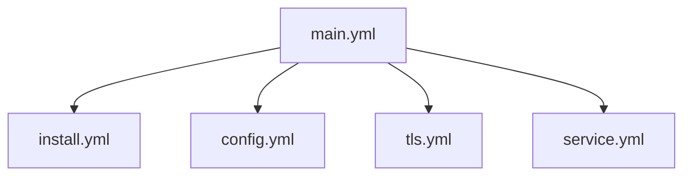

Chaque fichier reste court et possède une responsabilité clairement identifiée.

---

## Une bonne pratique

Essayez de faire en sorte que chaque fichier de tâches puisse être compris indépendamment.

Par exemple.

```text
install.yml
```

ne devrait contenir que les opérations liées à l'installation.

Il ne devrait pas modifier :

- `firewalld` ;
- les certificats ;
- les journaux.

Cette séparation améliore :

- la lisibilité ;
- les tests ;
- la réutilisation ;
- le débogage.

Elle sera utilisée tout au long du développement du rôle Sentinel dans les chapitres suivants.

## `import_tasks` ou `include_tasks` ?

À ce stade, une question revient très souvent.

Pourquoi Ansible propose-t-il deux mécanismes qui semblent faire la même chose ?

```yaml
import_tasks:
```

et

```yaml
include_tasks:
```

Les deux permettent effectivement de découper un rôle en plusieurs fichiers.

Leur fonctionnement est cependant très différent.

---

## `import_tasks`

Avec :

```yaml
import_tasks:
```

Ansible charge les fichiers **avant** de commencer l'exécution.

On parle d'**import statique**.

Schématiquement.

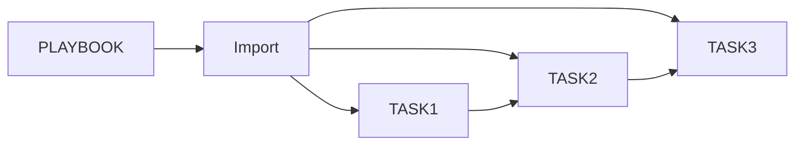

Toutes les tâches sont connues dès le début.

Le plan d'exécution est entièrement construit avant la première connexion SSH.

---

## `include_tasks`

Avec :

```yaml
include_tasks:
```

Le fichier est chargé **au moment où l'exécution atteint cette instruction**.

On parle d'**import dynamique**.

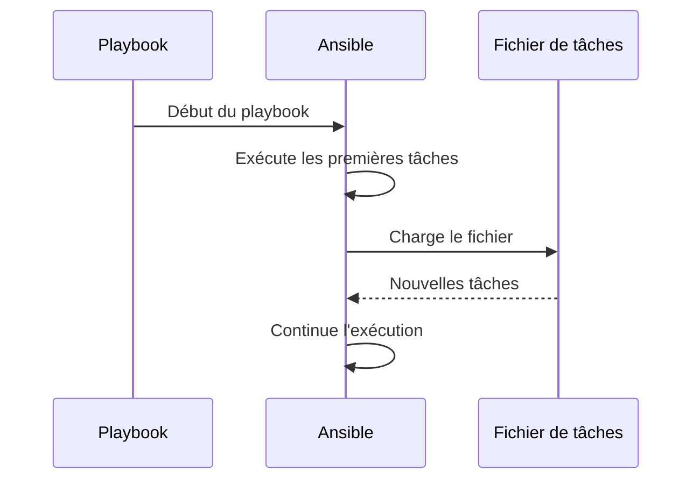

Le contenu n'est donc pas connu à l'avance.

---

## Pourquoi deux mécanismes ?

Le chargement dynamique est utile lorsque le fichier dépend d'une condition.

Par exemple.

```yaml
- include_tasks: tls.yml

  when: sentinel.tls.enabled
```

Si TLS est désactivé.

Le fichier :

```text
tls.yml
```

ne sera jamais chargé.

Cette approche peut réduire le temps d'exécution et simplifier certaines automatisations.

---

## Lequel choisir ?

Pour la majorité des rôles.

Le meilleur choix est :

```yaml
import_tasks
```

Les avantages sont nombreux.

- Structure plus lisible.
- Vérification plus précoce des erreurs.
- Plan d'exécution connu dès le départ.
- Meilleure compatibilité avec certains outils d'analyse.

`include_tasks` reste réservé aux cas où le chargement doit réellement dépendre du contexte d'exécution.

---

## Notre choix pour Sentinel

Dans cette formation, nous privilégierons presque toujours :

```yaml
import_tasks
```

Le rôle Sentinel possède une structure stable.

Les fichiers :

- `install.yml`
- `config.yml`
- `tls.yml`
- `service.yml`
- `firewall.yml`

existent en permanence.

Ils gagnent simplement à être séparés pour améliorer la lisibilité.

Nous utiliserons donc `include_tasks` uniquement lorsqu'un besoin réel de chargement dynamique se présentera, afin de conserver une architecture simple, prévisible et facile à maintenir.

## Les répertoires `defaults/` et `vars/`

Un rôle Ansible peut contenir des variables à plusieurs endroits.

Les deux répertoires les plus importants sont :

```text
defaults/
```

et

```text
vars/
```

À première vue, ils semblent identiques.

Pourtant, leur rôle est très différent.

---

## Le répertoire `defaults/`

Le fichier :

```text
defaults/main.yml
```

contient les **valeurs par défaut** du rôle.

Par exemple.

```yaml
sentinel:

  server:

    port: 8443

  tls:

    enabled: true
```

Ces valeurs sont considérées comme des recommandations.

L'utilisateur du rôle peut facilement les remplacer.

---

## Pourquoi utiliser `defaults/` ?

Imaginons que le rôle Sentinel soit utilisé dans deux entreprises.

Entreprise A.

```text
Port HTTPS : 8443
```

Entreprise B.

```text
Port HTTPS : 9443
```

Aucune modification du rôle n'est nécessaire.

Il suffit de redéfinir la variable dans l'inventaire.


Les valeurs définies dans l'inventaire prennent naturellement le dessus.

---

## Le répertoire `vars/`

Le fichier :

```text
vars/main.yml
```

est destiné à des variables internes au rôle.

Par exemple.

```yaml
sentinel_packages:

  - python3

  - python3-pip

  - policycoreutils-python-utils
```

Ces informations font partie du fonctionnement du rôle.

Elles n'ont généralement pas vocation à être modifiées par l'utilisateur.

---

## Quelle différence ?

On peut résumer leur philosophie ainsi.

| Répertoire | Destination |
|------------|-------------|
| `defaults/` | Paramètres que l'utilisateur est encouragé à personnaliser |
| `vars/` | Paramètres internes au rôle, rarement modifiés |

Autrement dit.

Les variables placées dans `defaults/` représentent l'interface publique du rôle.

Celles placées dans `vars/` constituent davantage son implémentation interne.

---

## Une bonne pratique

Dans un rôle bien conçu.

Les paramètres que l'administrateur est susceptible de modifier doivent être placés dans :

```text
defaults/main.yml
```

Par exemple.

- le port d'écoute ;
- les chemins des journaux ;
- l'activation de TLS ;
- le niveau de journalisation ;
- le nombre de processus.

En revanche.

Les constantes techniques propres au rôle resteront dans :

```text
vars/main.yml
```

Cette séparation rend le rôle beaucoup plus simple à utiliser.

Un nouvel administrateur saura immédiatement quels paramètres il peut adapter sans avoir à explorer l'ensemble du code du rôle.

## Le répertoire `meta/`

Le dernier répertoire important d'un rôle est :

```text
meta/
```

Son point d'entrée est :

```text
meta/main.yml
```

Contrairement à `tasks/` ou `templates/`, ce répertoire ne contient pas de logique de déploiement.

Il décrit le rôle lui-même.

---

## À quoi sert `meta/` ?

Le fichier `meta/main.yml` permet notamment de définir :

- les informations sur l'auteur ;
- la licence ;
- les plateformes compatibles ;
- les dépendances avec d'autres rôles.

Exemple simplifié.

```yaml
galaxy_info:

  author: Equipe Sentinel

  description: Déploiement de Sentinel

  license: MIT

  min_ansible_version: "2.16"
```

Ces informations sont principalement utilisées lorsque le rôle est partagé ou publié.

---

## Les dépendances entre rôles

L'une des fonctionnalités les plus intéressantes de `meta/` est la déclaration de dépendances.

Par exemple.

```yaml
dependencies:

  - role: firewalld

  - role: freeipa
```

Le principe est simple.

Avant d'exécuter le rôle :

```text
sentinel
```

Ansible exécutera automatiquement :

```text
firewalld

↓

freeipa

↓

sentinel
```

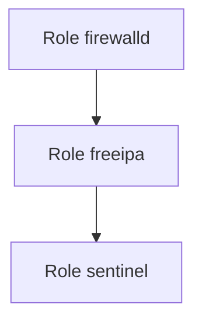

Le rôle Sentinel peut ainsi supposer que certaines briques sont déjà en place.

---

## Faut-il utiliser les dépendances ?

Techniquement, oui.

En pratique, il faut rester prudent.

Des dépendances trop nombreuses rendent parfois difficile la compréhension de l'ordre d'exécution.

Il est souvent préférable que le playbook principal décrive explicitement les rôles à exécuter.

Par exemple.

```yaml
roles:

  - firewalld

  - freeipa

  - sentinel
```

L'ordre apparaît immédiatement.

Le comportement est plus facile à suivre.

---

## Notre approche

Dans cette formation, nous utiliserons très peu les dépendances déclarées dans `meta/`.

Nous privilégierons des playbooks explicites.

Cette approche présente plusieurs avantages.

- Le déroulement est immédiatement visible.
- L'ordre d'exécution est maîtrisé.
- Les rôles restent indépendants.
- Les tests unitaires sont plus simples.

Le répertoire `meta/` restera néanmoins présent afin de documenter le rôle et d'indiquer sa compatibilité avec les plateformes ciblées.

---

## Une bonne pratique

Considérez un rôle comme une bibliothèque logicielle.

Il doit être :

- autonome ;
- documenté ;
- facilement réutilisable ;
- le moins couplé possible aux autres rôles.

Plus un rôle dépend de nombreux composants externes, plus il devient difficile à maintenir.

Des rôles simples et spécialisés sont généralement plus robustes qu'un rôle unique regroupant toutes les fonctionnalités.

## La précédence des variables

À ce stade de la formation, nous avons rencontré des variables provenant de nombreuses sources.

Par exemple :

- `defaults/main.yml` ;
- `vars/main.yml` ;
- `group_vars/` ;
- `host_vars/` ;
- les Facts ;
- les variables enregistrées avec `register`.

Une question devient alors inévitable.

> **Que se passe-t-il si plusieurs variables portent le même nom ?**

La réponse est donnée par les règles de **précédence** (*Variable Precedence*).

---

## Pourquoi une précédence est-elle nécessaire ?

Prenons un exemple.

Dans le rôle Sentinel.

```yaml
# defaults/main.yml

sentinel:

  server:

    port: 8443
```

Puis dans :

```yaml
# group_vars/sentinel.yml

sentinel:

  server:

    port: 9443
```

Quelle valeur doit être utilisée ?

Les deux sont valides.

Ansible doit pourtant en choisir une.

---

## Le principe général

La règle fondamentale est la suivante.

> **La valeur la plus spécifique l'emporte sur la plus générique.**

Autrement dit.

Une valeur définie pour un hôte est prioritaire sur une valeur définie pour un groupe.

Une valeur définie dans un groupe est prioritaire sur une valeur par défaut du rôle.

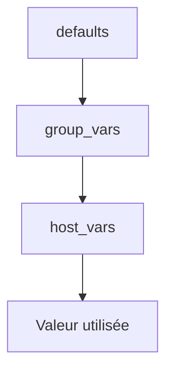

Cette logique est très intuitive.

Plus une variable cible précisément un contexte, plus elle a de poids.

---

## Un exemple concret

Imaginons l'organisation suivante.

```text
defaults/main.yml

↓

sentinel_port = 8443
```

Puis.

```text
group_vars/sentinel.yml

↓

sentinel_port = 9443
```

Enfin.

```text
host_vars/sentinel02.yml

↓

sentinel_port = 10443
```

Le résultat sera :

| Serveur | Port utilisé |
|----------|-------------:|
| sentinel01 | 9443 |
| sentinel02 | 10443 |

Aucun playbook n'a besoin d'être modifié.

Seules les variables évoluent.

---

## Une hiérarchie logique

Cette organisation permet de construire une infrastructure très flexible.

```text
Valeur par défaut

↓

Configuration du groupe

↓

Exception pour un serveur
```

Chaque niveau affine le précédent.

Il ne le remplace que lorsque c'est nécessaire.

Cette approche limite fortement la duplication des configurations.

---

## Une idée importante

Il peut être tentant de définir toutes les variables dans `host_vars/`.

C'est pourtant une mauvaise pratique.

Plus les variables sont placées haut dans la hiérarchie lorsqu'elles sont communes, plus le projet est simple à maintenir.

Les exceptions doivent rester... des exceptions.

Autrement dit, utilisez toujours le niveau **le plus générique possible**, et ne descendez vers un niveau plus spécifique que lorsqu'une différence réelle l'exige.

C'est cette discipline qui permet à un projet Ansible de rester lisible, même lorsqu'il administre plusieurs centaines de serveurs.

## L'ordre de précédence des variables

La documentation officielle d'Ansible décrit plusieurs dizaines de niveaux de précédence.

Cette hiérarchie est très complète, mais elle est rarement utilisée dans son intégralité.

En pratique, un ingénieur Ansible manipule principalement une dizaine de sources de variables.

Il est donc plus utile de comprendre leur logique que de mémoriser la liste exhaustive.

---

## Les niveaux les plus courants

Dans un projet professionnel, on rencontre généralement les sources suivantes, classées de la moins prioritaire à la plus prioritaire.

| Priorité | Source |
|----------:|--------|
| 1 | `defaults/main.yml` |
| 2 | Variables de l'inventaire (`group_vars`) |
| 3 | Variables spécifiques aux hôtes (`host_vars`) |
| 4 | Facts collectés par Ansible |
| 5 | Variables définies dans le playbook |
| 6 | Variables passées lors de l'inclusion d'un rôle |
| 7 | Variables enregistrées avec `register` |
| 8 | Variables fournies en ligne de commande (`--extra-vars`) |

L'idée essentielle est la suivante.

Plus une variable est proche du contexte d'exécution, plus sa priorité est élevée.

---

## Les variables `--extra-vars`

Les variables passées sur la ligne de commande possèdent l'une des priorités les plus élevées.

Par exemple.

```bash
ansible-playbook \
    deploy.yml \
    -e "sentinel_port=9443"
```

Même si :

```yaml
defaults/main.yml
```

contient :

```yaml
sentinel_port: 8443
```

la valeur :

```text
9443
```

sera utilisée.

Cette fonctionnalité est particulièrement utile pour des déploiements ponctuels ou des tests.

---

## Visualiser la hiérarchie

On peut représenter cette organisation sous la forme d'une pyramide.

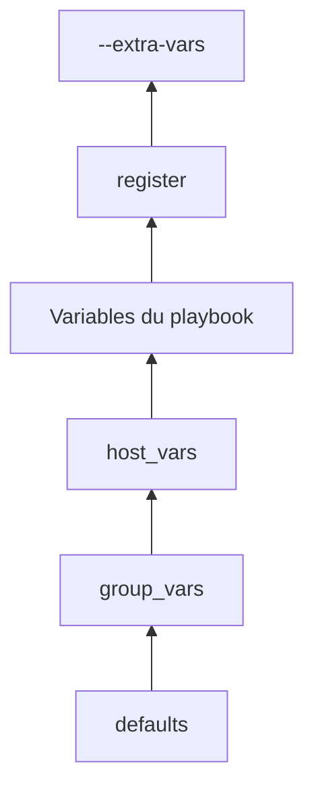

Chaque niveau est capable de remplacer le précédent.

Cette architecture offre une grande souplesse sans sacrifier la lisibilité.

---

## Une règle d'or

Il est fortement déconseillé de définir la même variable à plusieurs niveaux sans raison.

Par exemple.

```text
defaults/

↓

group_vars/

↓

host_vars/

↓

extra-vars
```

Si une même variable est redéfinie partout, il devient très difficile de savoir quelle valeur sera réellement utilisée.

La hiérarchie est un mécanisme puissant.

Elle ne doit pas devenir une source de confusion.

---

## Une bonne pratique

Lorsqu'un paramètre doit être personnalisé par un administrateur, commencez toujours par le placer dans :

```text
defaults/main.yml
```

Puis, si nécessaire :

- adaptez-le dans `group_vars` pour un ensemble de serveurs ;
- utilisez `host_vars` uniquement pour les exceptions ;
- réservez `--extra-vars` aux besoins ponctuels (tests, intégration continue, déploiements spécifiques).

En appliquant systématiquement cette méthode, vos rôles resteront prévisibles, cohérents et faciles à maintenir, même lorsque plusieurs équipes travailleront simultanément sur la même infrastructure.

## Les rôles dans un projet Sentinel

Maintenant que nous maîtrisons la structure d'un rôle, une question se pose naturellement.

> **Comment découper notre propre projet ?**

Il existe plusieurs possibilités.

Le bon découpage dépend toujours de la responsabilité de chaque composant.

---

## Une mauvaise approche

Une première idée pourrait être de créer un unique rôle.

```text
roles/

└── infrastructure/

    ├── tasks/

    ├── templates/

    ├── handlers/

    └── ...
```

Ce rôle finirait rapidement par contenir :

- Sentinel ;
- FreeIPA ;
- `firewalld` ;
- SSH ;
- les sauvegardes ;
- les journaux ;
- SELinux.

Après quelques mois, il deviendrait extrêmement difficile à maintenir.

---

## Une meilleure organisation

Il est préférable de créer un rôle par domaine fonctionnel.

```text
roles/

├── sentinel/

├── freeipa_client/

├── firewalld/

├── chrony/

├── journald/

├── podman/

├── node_exporter/

└── common/
```

Chaque rôle possède une responsabilité unique.

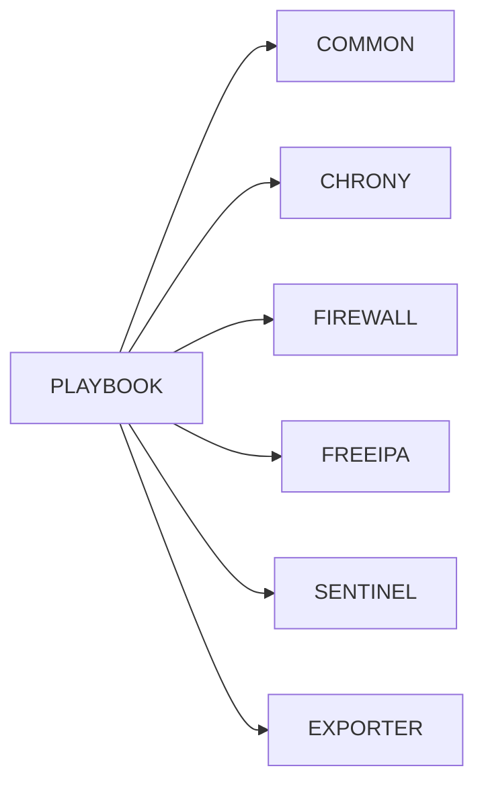

Le playbook devient un simple orchestrateur.

---

## Le rôle `common`

Dans la plupart des projets Ansible, on retrouve un rôle particulier.

```text
common
```

Il contient les opérations communes à tous les serveurs.

Par exemple :

- installation de paquets génériques ;
- configuration NTP ;
- configuration des dépôts ;
- configuration des journaux ;
- bannière SSH ;
- paramètres communs de sécurité.

Ainsi, ces opérations ne sont jamais dupliquées dans les autres rôles.

---

## Le rôle Sentinel

Le rôle Sentinel doit rester centré sur l'application.

Il pourra notamment contenir :

- l'installation de la RPM ;
- le déploiement de la configuration ;
- la création du compte système ;
- la configuration `systemd` ;
- les handlers ;
- les vérifications de bon fonctionnement.

En revanche, il ne devrait pas gérer :

- la configuration de SSH ;
- la synchronisation de l'heure ;
- l'installation de FreeIPA.

Ces responsabilités appartiennent à d'autres rôles.

---

## Une architecture modulaire

Notre projet prendra progressivement une forme proche de celle-ci.

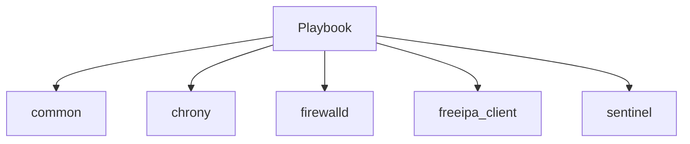

Chaque composant peut évoluer indépendamment.

Cette modularité constitue l'un des principaux avantages des rôles Ansible.

Elle facilite :

- les tests ;
- les mises à jour ;
- la réutilisation ;
- le travail collaboratif.

C'est cette architecture que nous utiliserons dans toute la suite de la formation afin de construire une plateforme Sentinel industrialisée, facilement maintenable et évolutive.

## Les dépendances entre les rôles

Bien que les rôles soient conçus pour être indépendants, ils ne sont pas totalement isolés.

Dans une infrastructure, certains composants nécessitent naturellement que d'autres soient déjà présents.

Prenons l'exemple de Sentinel.

Avant de pouvoir démarrer correctement, plusieurs éléments doivent déjà être disponibles :

- le système doit être configuré ;
- le pare-feu doit être opérationnel ;
- le serveur doit appartenir au domaine FreeIPA ;
- les certificats doivent être disponibles.

Le rôle Sentinel dépend donc du résultat produit par d'autres rôles.

---

## Une dépendance fonctionnelle

Il est important de distinguer deux notions.

Une dépendance **fonctionnelle** signifie qu'un rôle suppose qu'un autre a déjà effectué son travail.

Par exemple.

```text
common

↓

firewalld

↓

freeipa_client

↓

sentinel
```


Le rôle Sentinel ne configure pas lui-même FreeIPA.

Il suppose simplement que cette étape est terminée.

---

## Le playbook devient un orchestrateur

Le rôle du playbook est justement d'orchestrer ces différents composants.

```yaml
---
- name: Déployer une plateforme Sentinel

  hosts: sentinel
  become: true

  roles:

    - common
    - chrony
    - firewalld
    - freeipa_client
    - sentinel
```

Chaque rôle exécute sa responsabilité.

Le playbook définit uniquement leur ordre d'exécution.

Cette séparation est l'une des clés d'une architecture maintenable.

---

## Réutiliser les rôles

Imaginons maintenant un nouveau projet.

Vous souhaitez déployer un serveur de supervision qui n'utilise pas Sentinel.

Le rôle :

```text
common
```

reste parfaitement réutilisable.

Il en va de même pour :

- `chrony` ;
- `firewalld` ;
- `freeipa_client`.

Seul le dernier rôle change.

```text
node_exporter
```

par exemple.

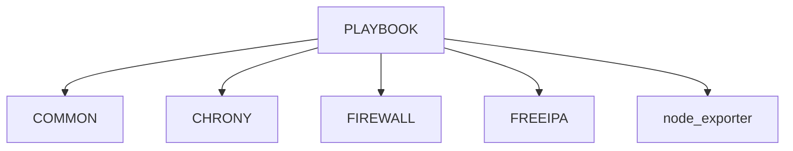

L'investissement réalisé sur ces rôles profite donc à plusieurs projets.

---

## Une bibliothèque d'automatisation

Avec le temps, une entreprise construit généralement une véritable bibliothèque de rôles.

Par exemple.

```text
roles/

├── common
├── chrony
├── firewalld
├── freeipa_client
├── podman
├── nginx
├── postgresql
├── node_exporter
├── grafana_agent
└── sentinel
```

Chaque nouveau projet réutilise les composants existants.

Le développement devient alors beaucoup plus rapide.

---

## Une bonne pratique

Lorsqu'un rôle devient très spécifique à un projet, posez-vous une question.

> **Cette fonctionnalité pourrait-elle être utile à une autre application ?**

Si la réponse est oui, il est souvent préférable d'en faire un rôle indépendant.

À l'inverse, si une fonctionnalité est intimement liée à Sentinel, elle a toute sa place dans le rôle `sentinel`.

Cette réflexion permet de construire progressivement une bibliothèque de rôles cohérente, réutilisable et durable, plutôt qu'une succession de playbooks difficilement exploitables dans d'autres contextes.

## Les bonnes pratiques de conception d'un rôle

Après plusieurs années d'utilisation d'Ansible, certaines règles de conception se retrouvent dans la majorité des projets professionnels.

Ces règles ne sont pas imposées par Ansible.

Elles sont le résultat de l'expérience.

---

## Une responsabilité unique

Un rôle doit répondre à une seule question.

Par exemple.

```text
Déployer Sentinel
```

ou :

```text
Configurer firewalld
```

Mais jamais :

```text
Configurer tout le serveur
```

Plus la responsabilité est claire, plus le rôle sera simple à comprendre et à réutiliser.

---

## Être idempotent

Un rôle doit pouvoir être exécuté plusieurs fois.

À chaque exécution.

Le résultat attendu est :

```text
ok
```

si aucune modification n'est nécessaire.

Les opérations qui produisent systématiquement :

```text
changed
```

doivent attirer votre attention.

Elles révèlent souvent :

- une commande `shell` mal utilisée ;
- un template qui génère un contenu instable ;
- une logique non idempotente.

---

## Ne jamais modifier manuellement les fichiers générés

Lorsqu'un rôle gère :

```text
/etc/sentinel/sentinel.yml
```

ce fichier appartient désormais à Ansible.

Toute modification manuelle sera perdue lors du prochain déploiement.

La seule manière durable de modifier ce fichier est de :

1. modifier le template ;
2. adapter les variables ;
3. rejouer le playbook.

---

## Produire des messages explicites

Les noms des tâches constituent une documentation.

Préférez.

```yaml
- name: Installer le paquet Sentinel
```

à :

```yaml
- name: Installation
```

Ou pire.

```yaml
- name: Étape 3
```

Un bon nom doit permettre de comprendre immédiatement ce qui est en train de se produire.

---

## Limiter les commandes Shell

Avant d'utiliser :

```yaml
shell:
```

ou :

```yaml
command:
```

posez-vous toujours la question.

> Existe-t-il un module Ansible pour réaliser cette opération ?

Dans la majorité des cas.

La réponse est oui.

Utiliser le module spécialisé améliore :

- l'idempotence ;
- la lisibilité ;
- la gestion des erreurs.

---

## Une vision d'ensemble

Un rôle professionnel ressemble davantage à une bibliothèque logicielle qu'à un script d'administration.

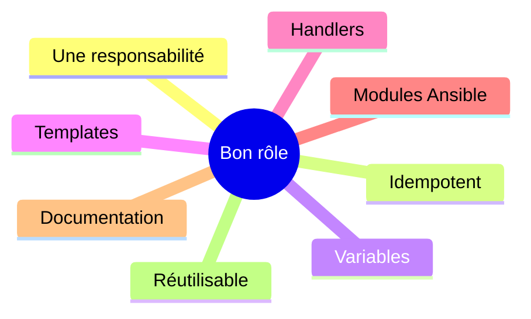

Lorsqu'un rôle respecte ces principes, il devient :

- simple à maintenir ;
- simple à tester ;
- simple à partager.

C'est précisément ce type de rôle que nous construirons dans la suite de cette campagne pour industrialiser complètement le déploiement de Sentinel.

## Créer un rôle Ansible

Jusqu'à présent, nous avons étudié la théorie des rôles.

Il est temps de créer le premier rôle de notre laboratoire.

Pour cela, Ansible fournit un outil dédié.

---

## La commande `ansible-galaxy`

Bien que son nom puisse prêter à confusion, `ansible-galaxy` ne sert pas uniquement à télécharger des rôles publics.

Il permet également de générer la structure d'un nouveau rôle.

Par exemple.

```bash
ansible-galaxy role init sentinel
```

Le résultat est immédiat.

```text
roles/

└── sentinel/

    ├── defaults/

    ├── files/

    ├── handlers/

    ├── meta/

    ├── tasks/

    ├── templates/

    ├── tests/

    ├── vars/

    └── README.md
```

L'ensemble de l'arborescence est créé automatiquement.

---

## Pourquoi utiliser cette commande ?

Il serait tout à fait possible de créer les répertoires à la main.

Cependant.

L'outil garantit :

- une structure conforme aux conventions Ansible ;
- la présence des fichiers d'entrée (`main.yml`) ;
- une organisation immédiatement exploitable.

Tous les développeurs d'une équipe partent ainsi de la même base.

---

## Les fichiers générés

Par défaut.

Chaque répertoire contient un fichier :

```text
main.yml
```

Par exemple.

```text
tasks/main.yml

handlers/main.yml

defaults/main.yml

vars/main.yml

meta/main.yml
```

Ces fichiers sont volontairement presque vides.

Ils constituent simplement les points d'entrée du rôle.

---

## Une première personnalisation

Une fois le rôle créé.

La première étape consiste généralement à supprimer le contenu d'exemple généré automatiquement.

Puis à construire progressivement son propre rôle.

Par exemple.

```text
tasks/

    main.yml

    install.yml

    config.yml

    tls.yml

    service.yml
```

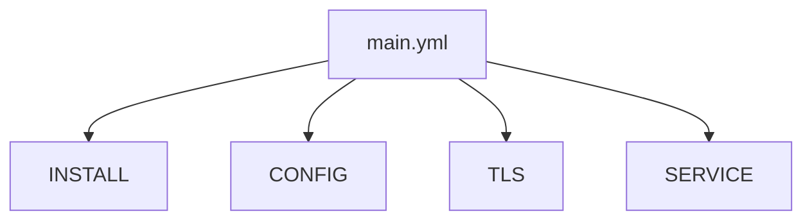

L'arborescence devient rapidement adaptée aux besoins du projet.

---

## Notre laboratoire

Dans la suite de cette formation.

Nous construirons progressivement le rôle :

```text
sentinel
```

jusqu'à obtenir un composant capable de :

- installer la RPM ;
- créer le compte système ;
- générer la configuration ;
- demander les certificats ;
- configurer `systemd` ;
- ouvrir le pare-feu ;
- vérifier le bon fonctionnement du service.

Le rôle deviendra ainsi totalement autonome.

Il suffira de l'appeler depuis un playbook pour déployer un nouveau serveur Sentinel.

Cette approche illustre parfaitement la philosophie d'Ansible : encapsuler une responsabilité complète dans un composant réutilisable, simple à maintenir et facilement partageable.

## Synthèse

Le chapitre **Les rôles Ansible** établit une brique du socle de sécurité Sentinel.

Avant de poursuivre, vérifiez que vous savez :

- expliquer le rôle des mécanismes présentés ;
- distinguer leur configuration de leur état réellement observé ;
- valider leur comportement dans le laboratoire ;
- conserver une configuration explicite, vérifiable et reproductible.

---

← [9.5 — Variables et templates](9.5-variables-templates.md) · [9.7 — Déployer Sentinel avec Ansible](9.7-deployer-sentinel-ansible.md) →
