# 9.8 Intégrer automatiquement Sentinel à FreeIPA

> *« Une application n'est réellement industrialisée que lorsque son identité est elle aussi automatisée. »*

---

## Vous êtes ici

```text
PARTIE III — Industrialiser les déploiements

Campagne 9

  9.1 Pourquoi Ansible ? ✔
  9.2 Architecture d'Ansible ✔
  9.3 Inventaires ✔
  9.4 Premiers playbooks ✔
  9.5 Variables et templates ✔
  9.6 Les rôles ✔
  9.7 Déployer Sentinel ✔
► 9.8 Intégrer FreeIPA
  9.9 Industrialiser le laboratoire
  9.10 Mission : déploiement complet d'une infrastructure
```

---

## Objectifs pédagogiques

À la fin de ce chapitre, vous serez capable de :

- automatiser l'intégration d'un serveur dans un domaine FreeIPA ;
- comprendre la place de FreeIPA dans une infrastructure industrialisée ;
- préparer automatiquement l'obtention des certificats ;
- éviter toute configuration manuelle après l'installation du système.

---

# Pourquoi intégrer FreeIPA ?

Jusqu'à présent, notre rôle Sentinel est capable :

- d'installer l'application ;
- de créer son compte système ;
- de générer sa configuration ;
- de démarrer le service.

Il manque cependant un élément essentiel.

Le serveur ne possède pas encore d'identité reconnue par le reste de l'infrastructure.

Autrement dit.

Il fonctionne.

Mais il ne fait pas encore partie du système d'information.

---

# Le rôle de FreeIPA

Dans notre laboratoire, FreeIPA joue plusieurs rôles.

- Authentifier les utilisateurs.
- Centraliser les identités des machines.
- Distribuer les certificats.
- Fournir une autorité de certification.
- Définir des politiques de sécurité communes.

Il devient ainsi un composant central de l'infrastructure.

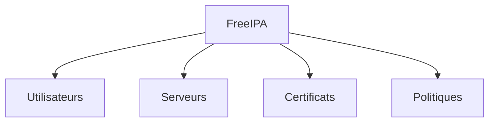

Tous les serveurs gravitent autour de cette autorité centrale.

---

# L'objectif recherché

Lorsqu'un nouveau serveur AlmaLinux est installé.

Nous souhaitons qu'il puisse être intégré automatiquement au domaine.

Sans connexion interactive.

Sans configuration manuelle.

Sans copier de fichiers à la main.

À terme, l'ajout d'un nouveau serveur devra se résumer à :

1. installer AlmaLinux ;
2. ajouter le serveur dans l'inventaire Ansible ;
3. lancer le playbook.

Le reste devra être entièrement automatisé.

---

# Pourquoi automatiser cette étape ?

Une intégration manuelle présente plusieurs inconvénients.

- Elle prend du temps.
- Elle est difficile à reproduire.
- Elle favorise les erreurs de configuration.
- Elle rend les déploiements massifs presque impossibles.

À l'inverse, une intégration automatisée garantit que tous les serveurs suivent exactement la même procédure.

---

# Une nouvelle responsabilité

Comme pour les chapitres précédents, nous allons isoler cette fonctionnalité dans un rôle dédié.

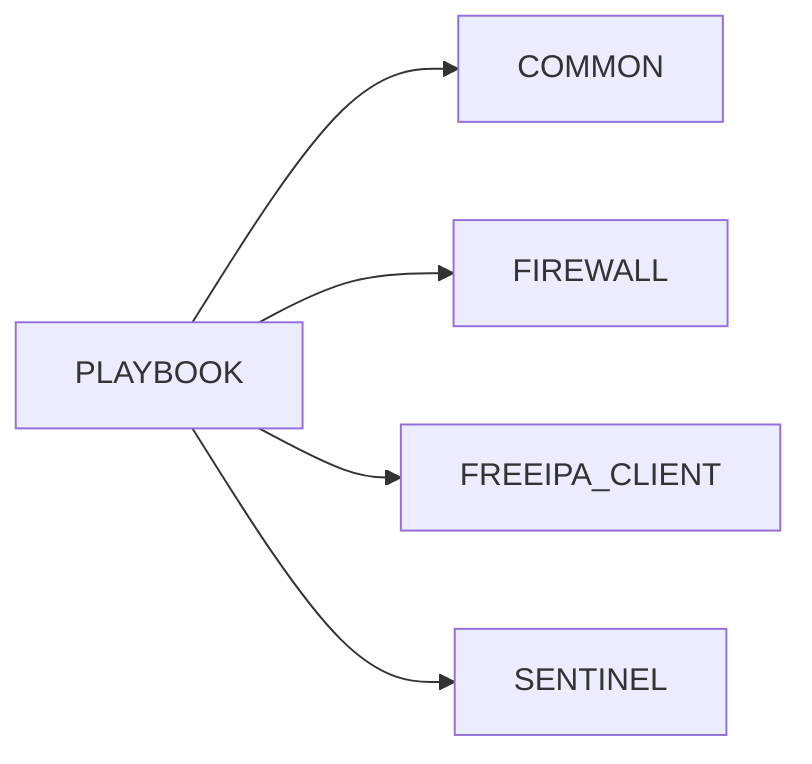

Le rôle `freeipa_client` préparera entièrement l'identité du serveur.

Le rôle `sentinel` pourra alors supposer que :

- le serveur appartient déjà au domaine ;
- les certificats sont disponibles ;
- les mécanismes d'authentification sont opérationnels.

Cette séparation des responsabilités permettra de réutiliser facilement le rôle `freeipa_client` pour d'autres applications que Sentinel, tout en conservant une architecture claire, modulaire et évolutive.


# Pourquoi créer un rôle `freeipa_client` ?

Une première idée pourrait être d'intégrer directement toutes les opérations FreeIPA dans le rôle `sentinel`.

Techniquement, cela fonctionnerait.

Pourtant, ce serait une erreur d'architecture.

---

# Une question de responsabilité

Le rôle `sentinel` a une mission bien définie.

> Déployer et configurer Sentinel.

En revanche.

L'intégration au domaine concerne le serveur lui-même.

Elle est indépendante de l'application exécutée.

Autrement dit.

Même si Sentinel disparaissait demain.

Le serveur continuerait d'appartenir au domaine FreeIPA.

Cette responsabilité doit donc être isolée.

---

# Un rôle réutilisable

Imaginons que nous souhaitions maintenant déployer :

- Grafana ;
- Prometheus ;
- un serveur PostgreSQL ;
- un registre Podman ;
- une API Python.

Tous ces serveurs devront rejoindre le domaine FreeIPA.

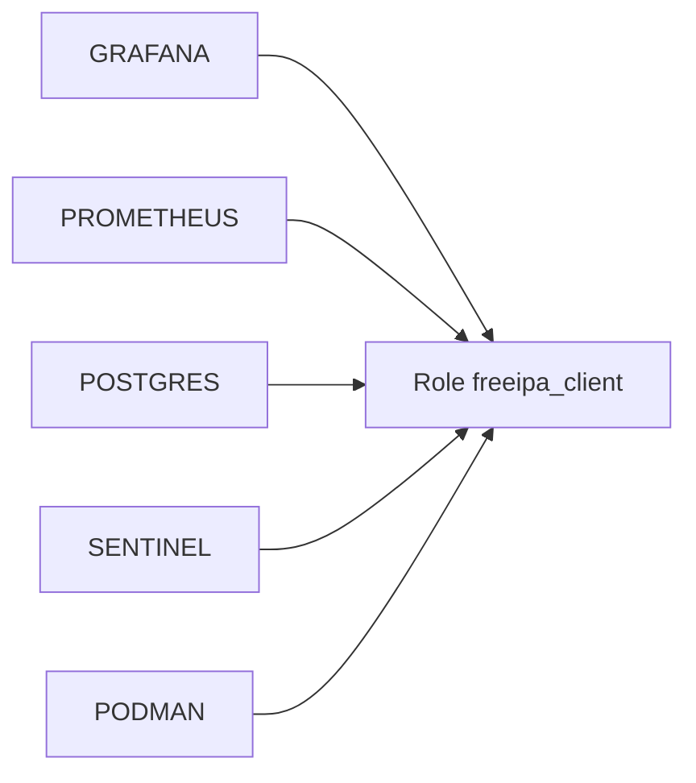

Le même rôle pourra être utilisé sans modification.

---

# Ce que fera ce rôle

Le rôle `freeipa_client` prendra en charge toutes les opérations liées à l'identité de la machine.

Par exemple.

- installation des paquets FreeIPA ;
- découverte du domaine ;
- intégration au domaine ;
- configuration de SSSD ;
- récupération de l'autorité de certification ;
- renouvellement automatique des certificats.

À l'inverse.

Il ne devra jamais :

- installer Sentinel ;
- ouvrir le pare-feu de l'application ;
- générer les fichiers de configuration de Sentinel.

Ces responsabilités appartiennent à d'autres rôles.

---

# Une architecture propre

Notre projet évolue progressivement vers une architecture modulaire.

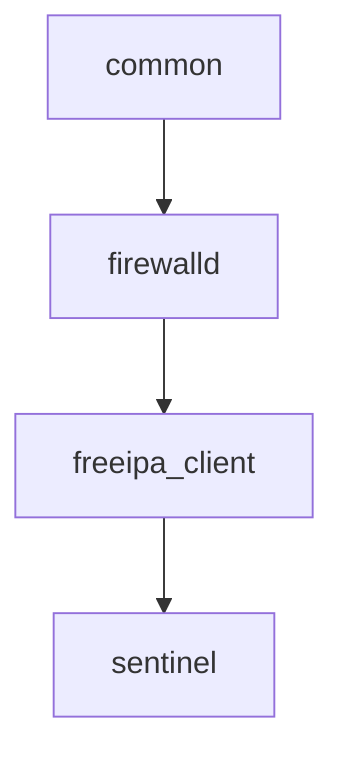

Chaque rôle prépare le terrain pour le suivant.

Aucun rôle ne réalise le travail des autres.

---

# Un bénéfice immédiat

Grâce à cette séparation.

Le jour où l'entreprise décidera de remplacer Sentinel par une autre application.

Les rôles :

- `common` ;
- `chrony` ;
- `firewalld` ;
- `freeipa_client`.

pourront être conservés.

Seul le dernier rôle changera.

C'est précisément cette capacité de réutilisation qui fait la force des rôles Ansible.

Ils représentent des briques d'infrastructure indépendantes, capables d'être assemblées de différentes façons selon les besoins des projets.


# Les responsabilités du rôle `freeipa_client`

Avant d'écrire la moindre tâche, il est indispensable de définir précisément le périmètre du rôle.

C'est une étape souvent négligée.

Pourtant, elle conditionne la qualité de toute l'architecture.

Un rôle bien conçu répond à une question simple.

> **Quelles sont exactement les responsabilités qui lui appartiennent ?**

---

# Les objectifs du rôle

Le rôle `freeipa_client` devra préparer entièrement un serveur pour qu'il puisse utiliser les services fournis par FreeIPA.

Concrètement, il devra notamment :

- installer les paquets nécessaires ;
- configurer le client FreeIPA ;
- rejoindre le domaine ;
- configurer SSSD ;
- installer le certificat de l'autorité de certification (CA) ;
- préparer le renouvellement automatique des certificats.

Une fois le rôle terminé, le serveur devra être reconnu comme membre du domaine.

---

# Ce que le rôle ne fera pas

À l'inverse, certaines opérations ne relèvent pas de ce rôle.

Par exemple :

- créer les certificats de Sentinel ;
- configurer le serveur Web ;
- ouvrir les ports de l'application ;
- installer des paquets propres à Sentinel ;
- gérer les utilisateurs de l'application.

Ces responsabilités appartiennent à d'autres composants.

Le rôle `freeipa_client` ne s'occupe que de l'identité de la machine.

---

# Le déroulement du rôle

Le rôle suivra progressivement une séquence proche de celle-ci.

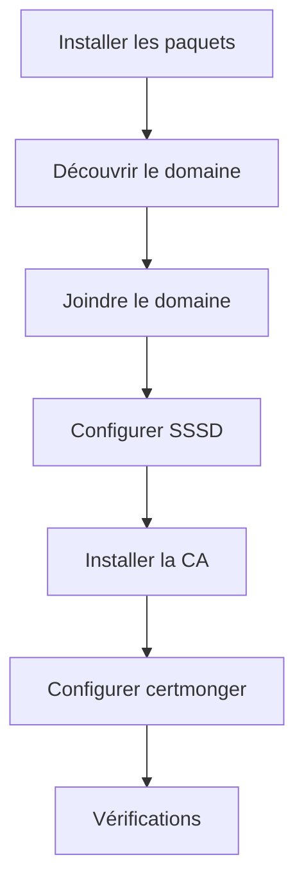

Chaque étape repose sur la précédente.

L'ensemble constitue une chaîne logique.

---

# Pourquoi cette organisation ?

Prenons un exemple.

Le serveur ne peut pas rejoindre le domaine.

Il est inutile de poursuivre :

- la configuration de SSSD ;
- la récupération de la CA ;
- la demande de certificats.

Le rôle doit donc progresser par étapes successives.

Chaque étape valide les prérequis de la suivante.

---

# Une architecture cohérente

À l'issue de ce chapitre.

Notre projet comportera deux grands rôles applicatifs.


Le premier fournit l'identité du serveur.

Le second déploie l'application.

Cette séparation reflète parfaitement la réalité d'une infrastructure d'entreprise.

Un serveur peut parfaitement appartenir au domaine FreeIPA sans exécuter Sentinel.

En revanche, Sentinel bénéficiera directement des services d'identité, d'authentification et de gestion des certificats fournis par le rôle `freeipa_client`.


# Étape 1 — Installer les composants FreeIPA

Avant qu'un serveur puisse rejoindre un domaine FreeIPA, il doit disposer des outils nécessaires.

Cette première étape consiste donc à installer les composants logiciels qui permettront au serveur de dialoguer avec l'infrastructure FreeIPA.

Comme pour le rôle `sentinel`, cette responsabilité est isolée dans un fichier dédié.

---

# Le fichier `install.yml`

Créons le fichier suivant.

```text
roles/

└── freeipa_client/

    └── tasks/

        └── install.yml
```

Son objectif est unique.

> Installer tous les paquets nécessaires au fonctionnement du client FreeIPA.

Aucune autre opération ne devra y apparaître.

---

# Les principaux paquets

Sous AlmaLinux, le client FreeIPA repose principalement sur les composants suivants.

| Paquet | Rôle |
|---------|------|
| `freeipa-client` | Client FreeIPA |
| `sssd` | Authentification centralisée |
| `sssd-tools` | Outils d'administration SSSD |
| `oddjob` | Création automatique des répertoires personnels |
| `oddjob-mkhomedir` | Module de création des *home directories* |
| `certmonger` | Renouvellement automatique des certificats |

Selon les besoins de votre infrastructure, d'autres paquets pourront être ajoutés.

---

# Installer plusieurs paquets

Le module `dnf` accepte directement une liste.

```yaml
- name: Installer les composants FreeIPA

  dnf:

    name:

      - freeipa-client

      - sssd

      - sssd-tools

      - oddjob

      - oddjob-mkhomedir

      - certmonger

    state: present
```

Ansible déterminera automatiquement quels paquets sont déjà présents.

Seuls les paquets manquants seront installés.

---

# Pourquoi installer `certmonger` immédiatement ?

À première vue, il pourrait sembler plus logique de l'installer plus tard.

En pratique, `certmonger` fait partie intégrante de l'écosystème FreeIPA.

Il sera chargé de :

- demander les certificats ;
- surveiller leur expiration ;
- déclencher automatiquement leur renouvellement.

Son installation dès le début simplifie les étapes suivantes.

---

# Une première brique

Le rôle commence progressivement à prendre forme.

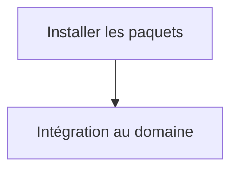

À ce stade.

Le serveur n'appartient pas encore au domaine.

Il dispose simplement de tous les outils nécessaires pour réaliser cette opération.

Comme dans le rôle `sentinel`, nous avançons par petites étapes indépendantes.

Cette approche facilite le débogage, améliore la lisibilité du rôle et permet de vérifier chaque étape avant de poursuivre l'automatisation.


# Étape 2 — Découvrir le domaine FreeIPA

Les composants nécessaires sont maintenant installés.

Avant de rejoindre le domaine, le serveur doit toutefois répondre à une question essentielle.

> **Quel domaine FreeIPA doit-il rejoindre ?**

Cette étape est appelée **découverte du domaine** (*Discovery*).

---

# Pourquoi une phase de découverte ?

Dans les premiers laboratoires de cette formation, nous avons saisi manuellement plusieurs informations.

Par exemple :

- le nom du domaine ;
- le serveur FreeIPA ;
- le domaine Kerberos.

Dans une infrastructure industrialisée, ces informations doivent provenir de la configuration Ansible.

Le rôle ne doit contenir aucune valeur écrite en dur.

---

# Les variables du rôle

Le fichier :

```text
defaults/main.yml
```

pourra contenir des variables similaires à celles-ci.

```yaml
freeipa:

  domain: lab.sentinel.test

  realm: LAB.SENTINEL.TEST

  server: ipa.lab.sentinel.test
```

Ces valeurs pourront être remplacées dans l'inventaire si une autre infrastructure est utilisée.

Le rôle reste ainsi totalement réutilisable.

---

# Vérifier la résolution DNS

Avant toute tentative d'intégration, le serveur doit pouvoir résoudre le nom du serveur FreeIPA.

Sans cela, aucune communication ne sera possible.

Cette vérification constitue un excellent candidat pour une assertion.

Par exemple.

```yaml
- name: Vérifier que le serveur FreeIPA est défini

  assert:

    that:

      - freeipa.server is defined

      - freeipa.server | length > 0

    fail_msg: "Aucun serveur FreeIPA n'a été configuré."
```

Le rôle détecte immédiatement une erreur de configuration.

---

# Pourquoi ne pas lancer directement `ipa-client-install` ?

Une erreur fréquente consiste à considérer que cette commande suffit.

En réalité, si :

- le DNS est incorrect ;
- le domaine est mal renseigné ;
- le serveur n'est pas joignable ;

l'installation échouera plus loin, avec un message parfois difficile à interpréter.

Une validation préalable permet de produire un diagnostic beaucoup plus clair.

---

# Une étape de préparation

La découverte ne modifie pas encore le système.

Elle prépare simplement l'étape suivante.

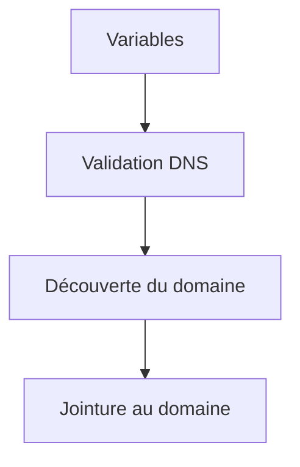

Cette séparation est volontaire.

Comme pour les autres rôles, nous privilégions une progression incrémentale où chaque étape valide les prérequis de la suivante.

Dans le prochain chapitre, nous réaliserons la **jointure automatique du serveur au domaine FreeIPA**, véritable point de bascule où la machine acquerra son identité au sein de l'infrastructure.


# Étape 3 — Joindre automatiquement le domaine

Toutes les vérifications préalables sont maintenant terminées.

Le serveur connaît :

- le domaine ;
- le serveur FreeIPA ;
- le *realm* Kerberos.

Il possède également tous les paquets nécessaires.

Nous pouvons désormais réaliser l'étape la plus importante du rôle :

> **l'intégration du serveur au domaine FreeIPA**.

---

# Que signifie "joindre le domaine" ?

Lors de cette opération, plusieurs actions sont réalisées.

- Le serveur est enregistré dans FreeIPA.
- Les clés Kerberos de la machine sont créées.
- La configuration de SSSD est générée.
- Les mécanismes d'authentification sont configurés.
- Le serveur devient un membre officiel du domaine.

Après cette étape, FreeIPA connaît l'existence de cette machine.

---

# Le principe

Schématiquement.

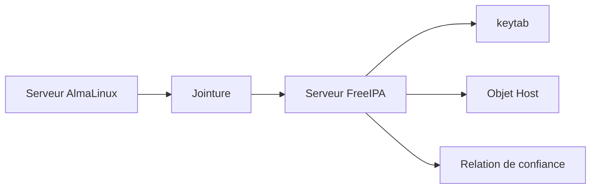

La jointure ne consiste donc pas simplement à modifier quelques fichiers locaux.

Elle établit une relation de confiance entre le serveur et le domaine.

---

# L'automatisation avec Ansible

Plusieurs approches sont possibles.

La plus simple consiste à utiliser la commande officielle :

```text
ipa-client-install
```

avec les options appropriées.

Cependant, dans un projet professionnel, cette commande ne doit jamais contenir de valeurs codées en dur.

Toutes les informations doivent provenir des variables du rôle.

Par exemple.

- le serveur FreeIPA ;
- le domaine ;
- le *realm* ;
- les options de configuration.

Ainsi, le même rôle pourra être utilisé dans plusieurs environnements sans modification.

---

# Une opération idempotente

La jointure est une opération particulière.

Contrairement à la création d'un répertoire ou à la copie d'un fichier, elle ne doit normalement être réalisée qu'une seule fois.

Le rôle doit donc être capable de distinguer deux situations.

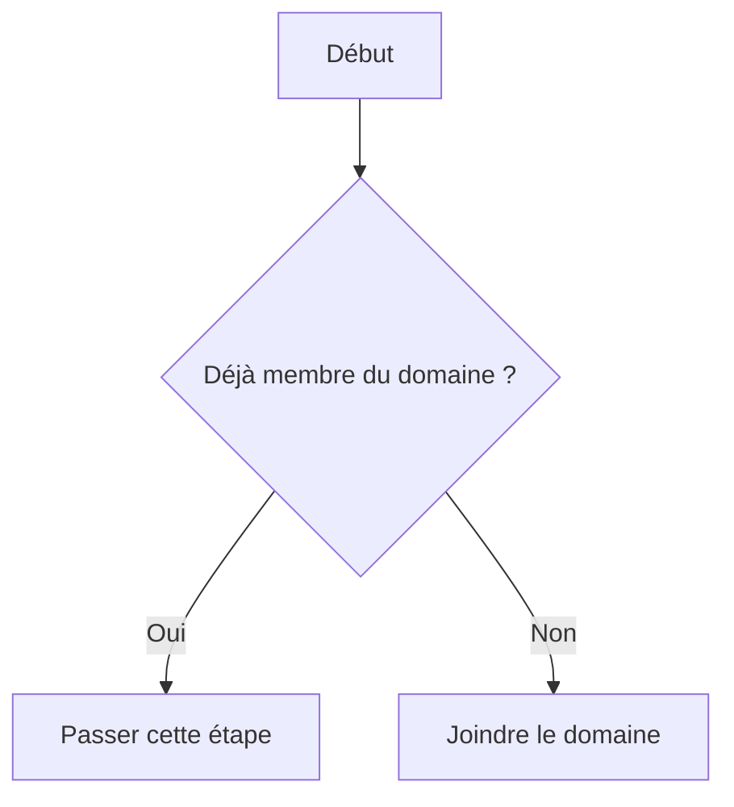

Cette vérification évite :

- de réinitialiser inutilement la relation de confiance ;
- de générer de nouveaux secrets Kerberos ;
- de perturber les services déjà en fonctionnement.

---

# Une bonne pratique

La jointure au domaine est une étape sensible.

En cas d'échec, le rôle doit interrompre immédiatement son exécution.

Il est inutile de poursuivre :

- la récupération des certificats ;
- la configuration de Sentinel ;
- les validations finales.

Sans identité de machine valide, toutes ces opérations échoueront ou produiront un résultat incohérent.

C'est pourquoi la jointure constitue un véritable **point de contrôle** du rôle `freeipa_client`.

Toutes les étapes suivantes supposeront que cette relation de confiance avec FreeIPA est désormais établie.


# Étape 4 — Configurer SSSD

La jointure au domaine est maintenant réalisée.

Le serveur possède une identité dans FreeIPA.

Pour autant, il ne sait pas encore exploiter cette identité.

C'est le rôle de **SSSD** (*System Security Services Daemon*).

SSSD constitue l'intermédiaire entre le système Linux et les services d'identité fournis par FreeIPA.

---

# Quel est le rôle de SSSD ?

Lorsqu'un utilisateur tente de se connecter.

Le système doit répondre à plusieurs questions.

- Cet utilisateur existe-t-il ?
- Son mot de passe est-il valide ?
- À quels groupes appartient-il ?
- Quelles sont ses autorisations ?

Au lieu de répondre lui-même à ces questions, le système les délègue à SSSD.

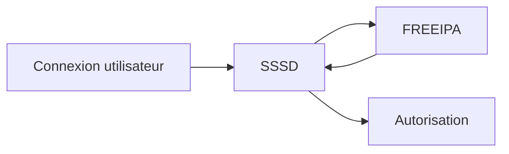

SSSD devient ainsi le point d'entrée de toutes les opérations d'authentification.

---

# Pourquoi est-ce important ?

Sans SSSD.

Le serveur appartient certes au domaine.

Mais il ne peut pas utiliser les informations qu'il contient.

Par exemple.

- les utilisateurs FreeIPA ne peuvent pas ouvrir de session ;
- les groupes centralisés sont ignorés ;
- les politiques d'accès ne sont pas appliquées.

La jointure seule n'est donc pas suffisante.

---

# Le fichier de configuration

Sous AlmaLinux, la configuration principale se trouve dans :

```text
/etc/sssd/sssd.conf
```

Ce fichier contient notamment :

- les domaines utilisés ;
- la méthode d'authentification ;
- la gestion du cache ;
- les fournisseurs d'identité.

Dans la plupart des cas, il est généré automatiquement lors de la jointure.

Le rôle devra néanmoins vérifier sa présence et ses permissions.

---

# Des permissions très particulières

Le fichier :

```text
/etc/sssd/sssd.conf
```

contient des informations sensibles.

Il doit être protégé.

Les permissions recommandées sont :

```text
0600
```

avec :

```text
owner : root

group : root
```

Cette restriction empêche tout utilisateur non privilégié de consulter son contenu.

---

# Vérifier le fonctionnement

Après la configuration, plusieurs contrôles simples peuvent être réalisés.

Par exemple.

- vérifier que le service `sssd` est actif ;
- vérifier qu'il démarre automatiquement ;
- confirmer que le domaine est bien reconnu.

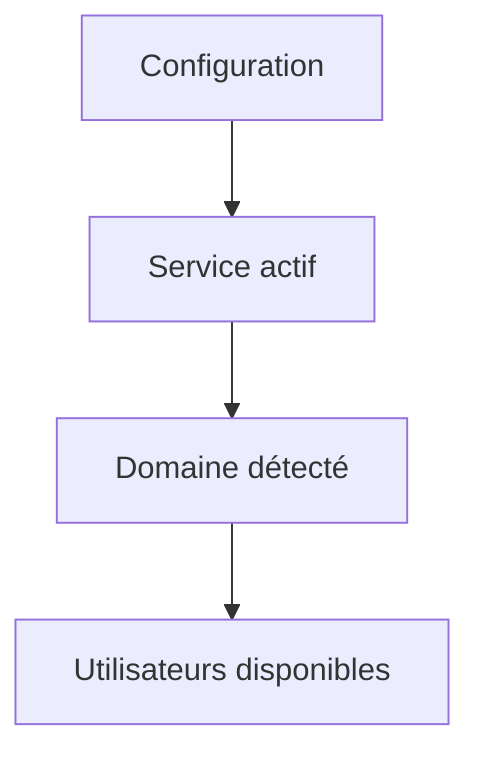

Ces vérifications permettront de s'assurer que la machine est réellement capable d'utiliser les services d'identité de FreeIPA.

---

# Une responsabilité clairement définie

Le rôle `freeipa_client` commence maintenant à suivre une progression logique.

```text
Installation des paquets

↓

Jointure au domaine

↓

Configuration de SSSD

↓

Gestion des certificats

↓

Vérifications finales
```

Chaque étape construit une couche supplémentaire.

À la fin de cette phase, le serveur ne sera plus simplement membre du domaine.

Il sera capable d'utiliser pleinement les services d'identité centralisés fournis par FreeIPA.


# Étape 5 — Installer l'autorité de certification (CA)

Le serveur appartient désormais au domaine FreeIPA.

Il est capable d'authentifier les utilisateurs grâce à SSSD.

L'étape suivante consiste à établir une relation de confiance avec l'autorité de certification du domaine.

Autrement dit.

Le serveur doit reconnaître comme légitimes tous les certificats émis par FreeIPA.

---

# Pourquoi installer la CA ?

Prenons un exemple.

Sentinel souhaite établir une connexion TLS avec un autre serveur.

Celui-ci présente un certificat.

Avant d'accepter cette connexion, Sentinel doit répondre à une question essentielle.

> **Puis-je faire confiance à ce certificat ?**

La réponse dépend de la présence de la CA ayant signé ce certificat.

Sans cette autorité de certification.

Toute connexion TLS sera rejetée.

---

# La chaîne de confiance

Le fonctionnement peut être représenté simplement.


Le certificat n'est jamais approuvé directement.

C'est la confiance accordée à la CA qui permet de valider tous les certificats qu'elle signe.

---

# Où installer la CA ?

Sous AlmaLinux, les autorités de certification sont intégrées au magasin de confiance du système.

Une fois installée.

Toutes les applications utilisant les bibliothèques TLS du système pourront automatiquement faire confiance aux certificats émis par FreeIPA.

Par exemple.

- Sentinel ;
- Python ;
- `curl` ;
- `openssl` ;
- `dnf`.

Il n'est donc généralement pas nécessaire de configurer chaque application individuellement.

---

# Pourquoi cette étape est-elle séparée ?

On pourrait penser que la jointure au domaine suffit.

En pratique, il est préférable de considérer l'installation de la CA comme une responsabilité indépendante.

En effet.

Une machine peut :

- appartenir au domaine ;
- mais ne jamais utiliser TLS.

À l'inverse.

Certaines applications peuvent avoir besoin de la CA sans être directement liées à FreeIPA.

Cette séparation améliore la modularité du rôle.

---

# Vérifier la présence de la CA

Avant de poursuivre vers la gestion des certificats.

Le rôle peut vérifier que la CA est bien installée.

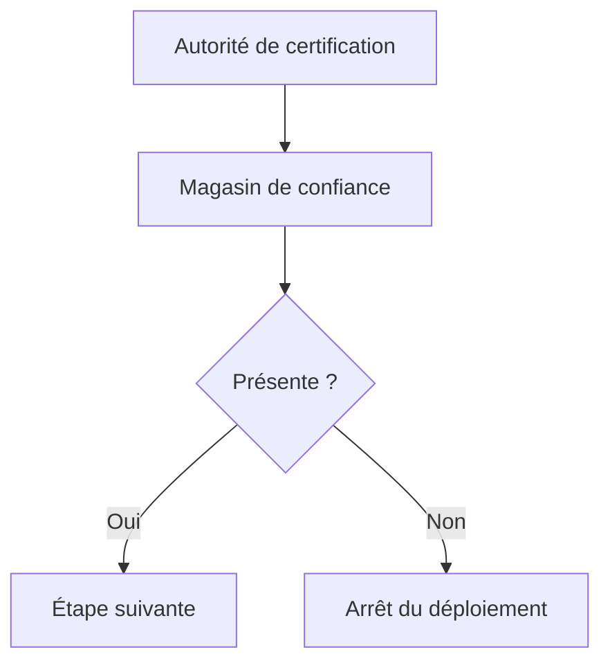

Cette validation garantit que toutes les opérations TLS réalisées par la suite reposeront sur une chaîne de confiance correctement établie.

---

# Une étape indispensable

Dans notre laboratoire Sentinel, pratiquement toutes les communications sensibles utiliseront TLS.

L'installation de la CA constitue donc un prérequis pour :

- l'authentification mutuelle ;
- les API HTTPS ;
- les communications entre services ;
- le renouvellement automatique des certificats.

Sans cette étape, l'infrastructure serait incapable d'établir des connexions chiffrées fiables, même si tous les certificats étaient correctement générés.


# Étape 6 — Obtenir automatiquement les certificats

Le serveur est désormais membre du domaine FreeIPA.

Il connaît l'autorité de certification.

Il peut donc demander un certificat d'identité.

C'est cette étape qui permettra ensuite à Sentinel de mettre en œuvre une authentification TLS forte.

---

# Pourquoi automatiser cette demande ?

Dans un environnement traditionnel, un administrateur devrait :

- générer une paire de clés ;
- créer une CSR (*Certificate Signing Request*) ;
- transmettre cette demande à l'autorité de certification ;
- récupérer le certificat signé ;
- l'installer au bon endroit.

Cette procédure est longue.

Elle est également source d'erreurs.

L'objectif de FreeIPA est justement d'automatiser cette chaîne.

---

# Le rôle de `certmonger`

Dans l'écosystème FreeIPA, le composant chargé de gérer les certificats est :

```text
certmonger
```

Son rôle est de :

- demander un certificat ;
- surveiller sa date d'expiration ;
- lancer automatiquement son renouvellement ;
- installer le nouveau certificat lorsque celui-ci est disponible.

Il fonctionne comme un démon système.

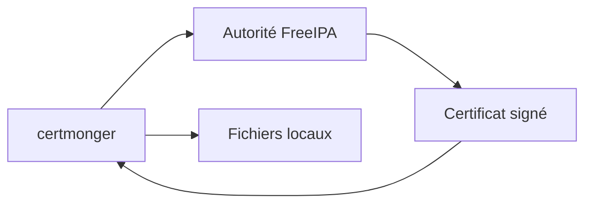

Ainsi, l'administrateur n'a plus à intervenir lors du renouvellement.

---

# Les fichiers attendus

À l'issue de cette étape, Sentinel disposera généralement de plusieurs fichiers.

Par exemple.

```text
/etc/pki/tls/certs/sentinel.crt

/etc/pki/tls/private/sentinel.key

/etc/pki/tls/certs/ca.crt
```

Le rôle `sentinel` utilisera ensuite ces chemins dans son template de configuration.

Aucune copie manuelle ne sera nécessaire.

---

# Séparer les responsabilités

Il est important de noter que :

- le rôle `freeipa_client` obtient les certificats ;
- le rôle `sentinel` les utilise.

Cette séparation est volontaire.


Le rôle Sentinel ne connaît pas la manière dont les certificats ont été obtenus.

Il suppose simplement qu'ils existent.

Cette indépendance facilite la réutilisation des deux rôles.

---

# Une bonne pratique

Les chemins des certificats ne doivent jamais être écrits directement dans les tâches.

Ils doivent être définis dans les variables du rôle.

Par exemple.

```yaml
freeipa:

  certificate: /etc/pki/tls/certs/sentinel.crt

  private_key: /etc/pki/tls/private/sentinel.key

  ca: /etc/pki/tls/certs/ca.crt
```

Le template du rôle `sentinel` pourra ensuite réutiliser ces variables.

Ainsi, un changement d'emplacement des certificats ne nécessitera aucune modification des playbooks ou des templates.

Seules les variables devront être adaptées, ce qui constitue l'un des principaux avantages d'une infrastructure pilotée par les données.


# Étape 7 — Renouveler automatiquement les certificats

Obtenir un certificat n'est qu'une première étape.

Un certificat possède une durée de vie limitée.

Il expire.

Une infrastructure moderne doit donc être capable de renouveler automatiquement ses certificats, sans intervention humaine.

C'est précisément l'une des missions de **certmonger**.

---

# Pourquoi le renouvellement est-il indispensable ?

Imaginons qu'un certificat expire.

Les conséquences peuvent être importantes.

- les connexions TLS sont refusées ;
- les authentifications mutuelles échouent ;
- les API HTTPS deviennent inaccessibles ;
- les échanges entre services sont interrompus.

Autrement dit.

Une simple expiration peut rendre une application totalement indisponible.

---

# Le fonctionnement de `certmonger`

Une fois qu'un certificat est enregistré auprès de `certmonger`, le démon surveille en permanence sa validité.

Avant son expiration.

Il effectue automatiquement une nouvelle demande auprès de FreeIPA.

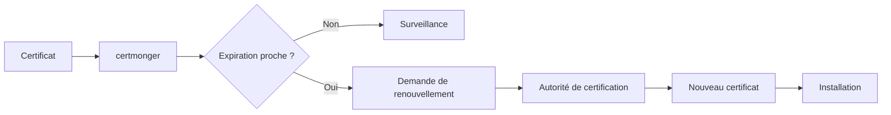

L'application continue ainsi à fonctionner sans interruption liée au certificat.

---

# Que doit faire le rôle Ansible ?

Le rôle `freeipa_client` ne renouvelle pas lui-même les certificats.

Sa responsabilité consiste à :

- installer `certmonger` ;
- enregistrer les certificats à surveiller ;
- vérifier que le démon est actif.

Une fois cette configuration réalisée.

Le renouvellement devient entièrement automatique.

---

# Vérifier le service

Comme pour les autres composants critiques.

Le rôle doit s'assurer que le service est opérationnel.

Par exemple.

- le service est démarré ;
- il est activé au démarrage ;
- il ne présente aucune erreur apparente.

Cette vérification garantit que le renouvellement continuera de fonctionner après un redémarrage du serveur.

---

# Pourquoi cette automatisation est-elle importante ?

Dans une petite infrastructure.

Un administrateur peut surveiller quelques certificats.

Dans un parc de plusieurs centaines de serveurs.

Cette approche devient irréaliste.

L'automatisation apporte plusieurs bénéfices.

- Suppression des renouvellements manuels.
- Réduction du risque d'expiration.
- Disponibilité accrue des services.
- Homogénéité de toute l'infrastructure.

---

# Une chaîne entièrement automatisée

À ce stade, la gestion des certificats devient presque autonome.

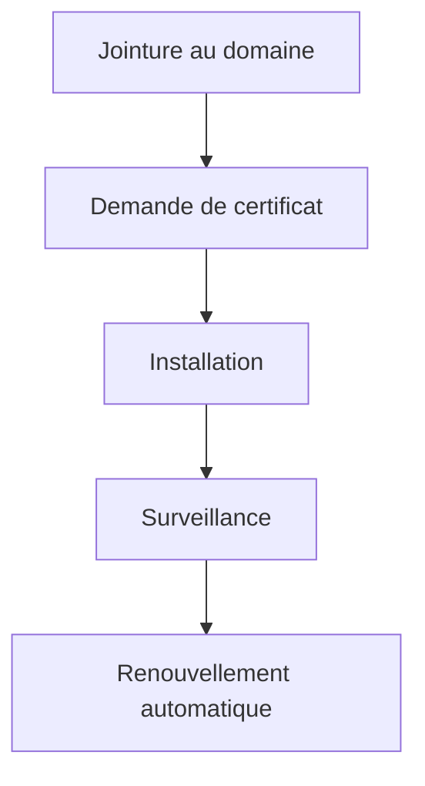

L'administrateur n'intervient plus dans le cycle de vie du certificat.

Il définit simplement les règles.

Le reste est assuré par l'infrastructure.

Cette automatisation constitue l'un des principaux avantages de FreeIPA et représente un gain considérable en termes de sécurité, de disponibilité et de maintenance.


# Étape 8 — Vérifier l'intégration au domaine

Le serveur est désormais :

- membre du domaine FreeIPA ;
- configuré avec SSSD ;
- capable d'obtenir et de renouveler ses certificats.

Avant de considérer le rôle comme terminé, il reste une dernière étape.

Vérifier que l'ensemble fonctionne réellement.

Comme pour le rôle `sentinel`, un déploiement n'est considéré comme réussi que lorsque son résultat a été validé.

---

# Pourquoi vérifier ?

Une jointure au domaine peut sembler réussie alors qu'un élément essentiel est défaillant.

Par exemple.

- SSSD ne démarre pas.
- Le serveur FreeIPA est injoignable.
- La résolution DNS est incorrecte.
- Le fichier `keytab` est absent.
- Les certificats ne sont pas renouvelables.

Le rôle doit détecter ces situations immédiatement.

---

# Les contrôles essentiels

Une première série de vérifications peut porter sur les éléments suivants.

| Élément | Vérification |
|----------|--------------|
| Domaine | Le serveur appartient au domaine FreeIPA |
| SSSD | Le service est actif |
| Certmonger | Le service est actif |
| CA | Présente dans le magasin de confiance |
| Keytab | Le fichier existe |
| DNS | Le serveur FreeIPA est résolu |

Ces contrôles couvrent les principales briques de l'intégration.

---

# Une vision globale

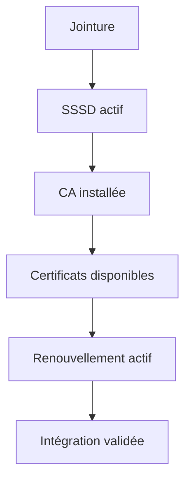

Chaque étape confirme que la précédente a correctement rempli sa mission.

---

# Utiliser `assert`

Comme dans le rôle `sentinel`, les assertions permettent de transformer ces attentes en contrôles explicites.

Par exemple.

```yaml
- name: Vérifier que SSSD est actif

  assert:

    that:

      - sssd_service.status.ActiveState == "active"

    fail_msg: "SSSD n'est pas opérationnel."

    success_msg: "SSSD fonctionne correctement."
```

Cette approche produit des messages beaucoup plus utiles qu'un simple échec technique.

---

# Préparer le rôle Sentinel

Une fois ces vérifications terminées.

Le rôle `freeipa_client` peut considérer que sa mission est accomplie.

Le serveur dispose désormais :

- d'une identité dans le domaine ;
- d'une authentification centralisée ;
- d'une chaîne de confiance TLS ;
- d'un mécanisme de renouvellement automatique des certificats.

Le rôle `sentinel` peut alors être exécuté en supposant que tous ces prérequis sont satisfaits.

Aucun traitement spécifique à FreeIPA n'a plus besoin d'être réalisé dans le rôle applicatif.

---

# Une infrastructure prête pour la production

À ce stade de la formation, notre laboratoire possède désormais deux rôles majeurs.


Cette séparation est essentielle.

Le rôle `freeipa_client` fournit les services d'identité et de confiance.

Le rôle `sentinel` se concentre exclusivement sur le déploiement de l'application.

Cette architecture est directement inspirée des infrastructures d'entreprise, où les services transverses (identité, certificats, synchronisation du temps, journalisation...) sont découplés des applications afin de maximiser leur réutilisation et leur maintenabilité.


# Grande synthèse du chapitre 9.8

Le rôle `freeipa_client` constitue une brique fondamentale de notre infrastructure.

Son objectif n'est pas de déployer une application.

Il prépare le serveur afin qu'il puisse participer à un système d'information centralisé.

Autrement dit, il fournit au serveur :

- une identité ;
- une authentification ;
- une chaîne de confiance ;
- un mécanisme de gestion des certificats.

Toutes les applications déployées par la suite pourront s'appuyer sur ces services.

---

# Les responsabilités du rôle

Au cours de ce chapitre, nous avons progressivement construit un rôle capable de :

```mermaid
mindmap
  root((freeipa_client))
    Installation
      freeipa-client
      sssd
      certmonger
    Découverte
      Domaine
      Realm
      DNS
    Jointure
      Enregistrement
      Kerberos
    Authentification
      SSSD
    Certificats
      CA
      Demande
      Renouvellement
    Vérifications
      Assertions
      Validation
```

Chaque responsabilité est clairement identifiée.

---

# Le déroulement complet

Le rôle suit désormais une séquence logique.

```mermaid
flowchart TD

    INSTALL[Installer les composants]

    INSTALL --> DISCOVERY[Découvrir le domaine]

    DISCOVERY --> JOIN[Joindre le domaine]

    JOIN --> SSSD[Configurer SSSD]

    SSSD --> CA[Installer la CA]

    CA --> CERTS[Obtenir les certificats]

    CERTS --> RENEW[Configurer certmonger]

    RENEW --> VERIFY[Valider l'ensemble]
```

Chaque étape dépend directement de la précédente.

Cette progression permet de détecter rapidement les erreurs tout en conservant un rôle simple à comprendre.

---

# Ce que le rôle garantit

Après son exécution, le serveur possède automatiquement :

- une identité dans FreeIPA ;
- une relation de confiance avec le domaine ;
- une configuration SSSD opérationnelle ;
- une autorité de certification reconnue ;
- des certificats installés ;
- un renouvellement automatique des certificats ;
- une validation de son intégration.

Le rôle `freeipa_client` peut alors être considéré comme terminé.

---

# Une architecture cohérente

Notre laboratoire repose désormais sur plusieurs couches clairement séparées.

```mermaid
flowchart TD

    COMMON[common]

    COMMON --> CHRONY[chrony]

    CHRONY --> FIREWALL[firewalld]

    FIREWALL --> FREEIPA[freeipa_client]

    FREEIPA --> SENTINEL[sentinel]

    SENTINEL --> APPLICATION[Application opérationnelle]
```

Chaque rôle prépare la couche suivante.

Cette organisation est directement inspirée des architectures utilisées dans les environnements de production.

---

# Les principes d'ingénierie acquis

Au-delà des commandes Ansible, ce chapitre introduit plusieurs concepts essentiels.

- L'identité d'une machine est un service d'infrastructure.
- Les certificats doivent être gérés automatiquement.
- Les applications ne doivent pas gérer elles-mêmes leur intégration au domaine.
- Les responsabilités doivent être réparties entre plusieurs rôles spécialisés.
- Les prérequis doivent être validés avant tout déploiement.

Ces principes dépassent largement le cadre de FreeIPA.

Ils s'appliquent à la plupart des infrastructures modernes.

---

# Ce qui nous attend

Nous savons désormais :

- automatiser le système ;
- automatiser l'identité des serveurs ;
- automatiser le déploiement d'une application.

La prochaine étape consiste à automatiser **l'ensemble de l'infrastructure**.

Nous allons apprendre à assembler tous nos rôles, gérer plusieurs environnements (développement, préproduction, production), organiser les variables à grande échelle et construire un projet Ansible capable d'administrer durablement plusieurs dizaines, voire plusieurs centaines de serveurs.

Nous entrerons alors dans la dernière phase de cette campagne :

> **9.9 — Industrialiser le laboratoire**.


