# 9.9 Industrialiser le laboratoire

> *« Automatiser un serveur est une réussite. Automatiser une infrastructure est un changement d'échelle. »*

---

## Vous êtes ici

```text
PARTIE III — Industrialiser les déploiements

Campagne 9

  9.1 Pourquoi Ansible ? ✔
  9.2 Architecture d'Ansible ✔
  9.3 Inventaires ✔
  9.4 Premiers playbooks ✔
  9.5 Variables et templates ✔
  9.6 Les rôles ✔
  9.7 Déployer Sentinel ✔
  9.8 Intégrer FreeIPA ✔
► 9.9 Industrialiser le laboratoire
  9.10 Mission : déploiement complet d'une infrastructure
```

---

## Objectifs pédagogiques

À la fin de ce chapitre, vous serez capable de :

- organiser un projet Ansible de grande taille ;
- gérer plusieurs environnements ;
- mutualiser les variables ;
- préparer une infrastructure évolutive ;
- comprendre les pratiques utilisées dans les équipes DevOps et SRE.

---

# Changer d'échelle

Jusqu'à présent, notre laboratoire comporte quelques machines.

Par exemple.

- un serveur FreeIPA ;
- un ou deux serveurs Sentinel ;
- une machine d'administration.

Toutes les variables sont relativement simples à gérer.

Mais imaginons maintenant une infrastructure plus importante.

```text
10 serveurs Sentinel

3 serveurs FreeIPA

2 serveurs PostgreSQL

4 serveurs Grafana

6 serveurs Prometheus

Plusieurs environnements
```

Les méthodes utilisées jusqu'à présent ne suffisent plus.

---

# Les nouveaux défis

Lorsque le nombre de serveurs augmente, de nouveaux problèmes apparaissent.

Par exemple.

- Comment éviter les duplications ?
- Où stocker les variables communes ?
- Comment distinguer la préproduction de la production ?
- Comment garantir que tous les serveurs restent cohérents ?

L'objectif de ce chapitre est de répondre à ces questions.

---

# Une architecture globale

Notre projet évoluera progressivement vers une organisation similaire à celle-ci.

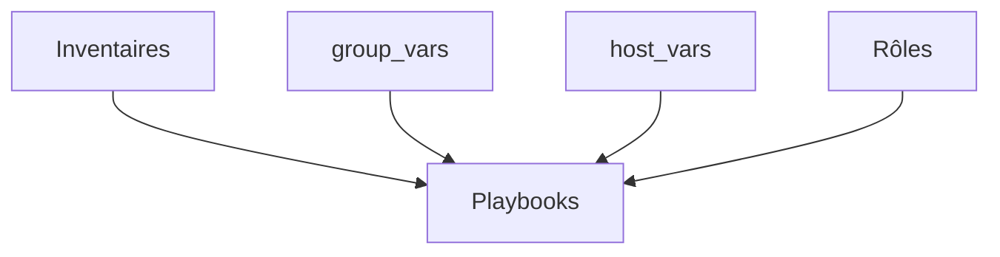

Chaque élément possède désormais une responsabilité clairement définie.

---

# Une nouvelle philosophie

Jusqu'à présent.

Nous avons surtout appris à écrire des rôles.

À partir de maintenant.

Nous allons apprendre à construire un **projet Ansible**.

La différence est importante.

Un rôle résout un problème précis.

Un projet orchestre plusieurs rôles, plusieurs environnements et plusieurs centaines de variables.

---

# Une vision d'entreprise

Les concepts abordés dans ce chapitre sont directement inspirés des pratiques utilisées dans les équipes d'exploitation.

L'objectif n'est plus seulement de déployer Sentinel.

Il est de disposer d'une plateforme capable de faire évoluer toute l'infrastructure avec :

- un minimum de duplication ;
- une excellente lisibilité ;
- une forte capacité de réutilisation ;
- un risque de régression limité.

C'est cette organisation qui permettra, dans les prochains chapitres, de transformer notre laboratoire en une véritable plateforme d'administration industrielle.

# Organiser les environnements

Dans un projet personnel, un seul environnement peut suffire.

En entreprise, il est extrêmement rare de déployer directement une modification en production.

La plupart des infrastructures distinguent plusieurs environnements.

Par exemple.

- développement ;
- intégration ;
- préproduction ;
- production.

Chaque environnement possède ses propres serveurs et parfois ses propres paramètres.

---

# Pourquoi plusieurs environnements ?

Prenons un exemple.

Vous venez de modifier le rôle `sentinel`.

Avant de le déployer en production.

Vous souhaitez vérifier :

- que l'installation fonctionne ;
- que les certificats sont correctement générés ;
- que les performances restent acceptables.

Ces tests doivent être réalisés ailleurs que sur les serveurs de production.

---

# Une organisation classique

Une arborescence très répandue est la suivante.

```text
inventory/

├── development/

│   ├── hosts.yml

│   └── group_vars/

├── staging/

│   ├── hosts.yml

│   └── group_vars/

└── production/

    ├── hosts.yml

    └── group_vars/
```

Chaque environnement possède son propre inventaire.

Les rôles, eux, restent identiques.

---

# Les rôles ne changent pas

C'est un point fondamental.

Le rôle :

```text
sentinel
```

est utilisé :

- en développement ;
- en préproduction ;
- en production.

La seule différence réside dans les variables.

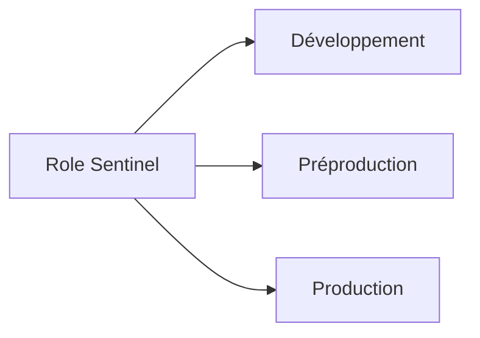

Le code est partagé.

Les données changent.

---

# Des variables différentes

Prenons un exemple.

En développement.

```yaml
sentinel:

  logging:

    level: DEBUG
```

En production.

```yaml
sentinel:

  logging:

    level: INFO
```

Le template reste identique.

Le rôle reste identique.

Seule la configuration varie.

Cette approche réduit fortement le risque de divergence entre les environnements.

---

# Une bonne pratique

Évitez de maintenir plusieurs versions d'un même rôle.

Par exemple.

```text
sentinel-dev

sentinel-prod
```

Cette organisation conduit rapidement à des différences de comportement difficiles à maîtriser.

Il est préférable de conserver :

- un seul rôle ;
- plusieurs inventaires ;
- plusieurs jeux de variables.

Ainsi, un même code est testé dans tous les environnements avant d'être promu jusqu'à la production.

Cette stratégie constitue aujourd'hui la norme dans la majorité des infrastructures professionnelles utilisant Ansible.


# Mutualiser les variables

L'un des principaux défis d'une grande infrastructure est d'éviter la duplication.

Imaginons une centaine de serveurs Sentinel.

Tous utilisent :

- le même domaine FreeIPA ;
- la même autorité de certification ;
- les mêmes dépôts RPM ;
- les mêmes paramètres de journalisation.

Répéter ces informations dans chaque fichier serait rapidement ingérable.

---

# Une hiérarchie naturelle

Les variables doivent être placées au niveau le plus pertinent.

Prenons un exemple.

```text
Infrastructure

↓

Environnement

↓

Groupe

↓

Serveur
```

Chaque niveau ne contient que les informations qui lui sont propres.

---

# Une organisation possible

```text
inventory/

└── production/

    ├── hosts.yml

    ├── group_vars/

    │   ├── all.yml

    │   ├── freeipa.yml

    │   ├── sentinel.yml

    │   └── monitoring.yml

    └── host_vars/

        ├── sentinel01.yml

        └── sentinel02.yml
```

Les paramètres communs sont définis une seule fois.

Les exceptions sont limitées aux fichiers `host_vars`.

---

# Un exemple concret

Supposons que tous les serveurs Sentinel utilisent le même serveur FreeIPA.

```yaml
freeipa:

  server: ipa.lab.sentinel.test

  realm: LAB.SENTINEL.TEST
```

Cette configuration peut être placée dans :

```text
group_vars/all.yml
```

Elle devient immédiatement disponible pour tous les rôles.

Aucune duplication n'est nécessaire.

---

# Les exceptions

Un serveur particulier peut néanmoins nécessiter une configuration différente.

Par exemple.

```yaml
sentinel:

  server:

    port: 9443
```

Cette variable sera placée dans :

```text
host_vars/sentinel02.yml
```

Elle ne concernera qu'une seule machine.

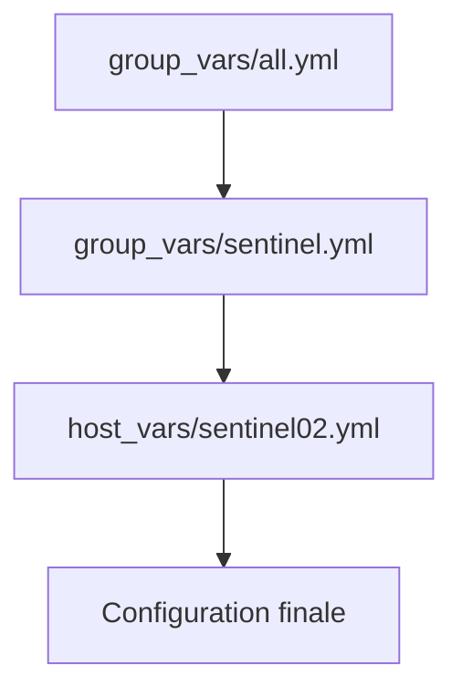

Cette hiérarchie est simple à comprendre.

Elle facilite énormément la maintenance.

---

# Une bonne pratique

Lorsque vous ajoutez une nouvelle variable.

Posez-vous systématiquement cette question.

> **Combien de serveurs utilisent cette valeur ?**

- Tous les serveurs → `group_vars/all.yml`
- Tous les serveurs d'un même groupe → `group_vars/<groupe>.yml`
- Un seul serveur → `host_vars/<hôte>.yml`

Cette règle simple permet de maintenir une infrastructure lisible, évolutive et pratiquement dépourvue de duplication, même lorsque le nombre de machines augmente fortement.


# Structurer les playbooks

Au début de cette formation, nos playbooks étaient très simples.

Ils contenaient quelques tâches directement écrites dans un unique fichier.

Aujourd'hui, notre projet comporte :

- plusieurs rôles ;
- plusieurs environnements ;
- plusieurs dizaines de variables.

Le playbook change alors complètement de rôle.

Il ne décrit plus les opérations techniques.

Il orchestre l'infrastructure.

---

# Une nouvelle responsabilité

Dans une architecture moderne, le playbook répond essentiellement à trois questions.

- Quels serveurs cibler ?
- Quels rôles exécuter ?
- Dans quel ordre ?

Tout le reste appartient aux rôles.

---

# Un exemple

Le playbook devient particulièrement lisible.

```yaml
---
- name: Déployer les serveurs Sentinel

  hosts: sentinel

  become: true

  roles:

    - common

    - chrony

    - firewalld

    - freeipa_client

    - sentinel
```

En quelques lignes.

L'ensemble de la chaîne de déploiement est visible.

---

# Pourquoi est-ce important ?

Imaginons qu'un nouveau collègue découvre le projet.

En ouvrant ce fichier.

Il comprend immédiatement :

- quels composants sont utilisés ;
- leur ordre d'exécution ;
- la logique générale du déploiement.

Il n'a pas besoin de parcourir plusieurs milliers de lignes de tâches.

---

# Plusieurs playbooks

Une infrastructure ne possède généralement pas un seul playbook.

Par exemple.

```text
playbooks/

    sentinel.yml

    monitoring.yml

    databases.yml

    backup.yml
```

Chaque playbook orchestre un domaine fonctionnel particulier.

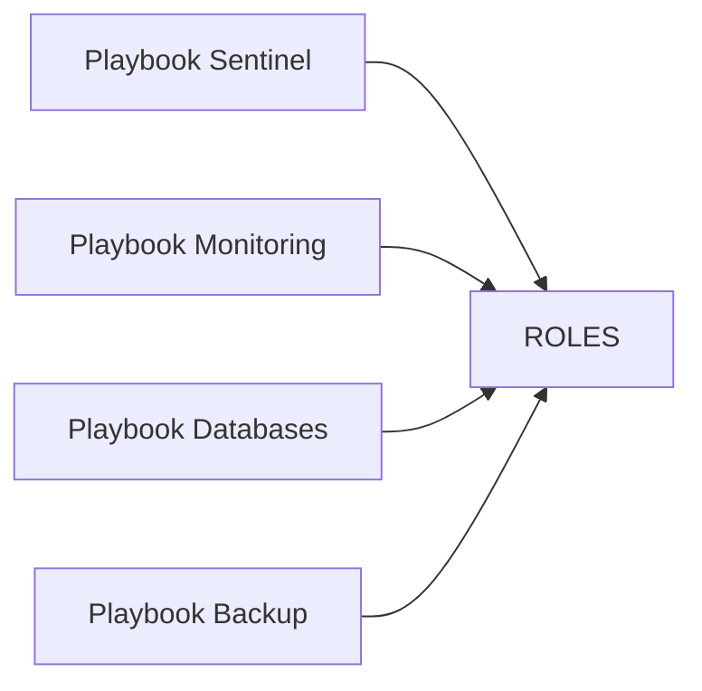

Les rôles sont ainsi réutilisés dans plusieurs scénarios.

---

# Le playbook ne contient pas de logique métier

Une erreur fréquente consiste à placer des tâches directement dans le playbook.

Par exemple.

```yaml
tasks:

  - name: Installer Sentinel
```

Cette approche fonctionne.

Mais elle contourne toute l'organisation mise en place avec les rôles.

Les playbooks doivent rester aussi courts que possible.

Toute la logique doit être encapsulée dans les rôles.

---

# Une bonne pratique

Lorsqu'un playbook dépasse plusieurs dizaines de lignes, posez-vous la question suivante.

> **Une partie de cette logique ne devrait-elle pas être déplacée dans un rôle ?**

Dans un projet mature.

Les playbooks sont souvent très compacts.

Ils décrivent l'infrastructure.

Les rôles décrivent son implémentation.

Cette séparation améliore considérablement la lisibilité du projet et facilite son évolution au fil des années.


# Organiser un dépôt Git Ansible

À partir d'une certaine taille, un projet Ansible n'est plus seulement une collection de playbooks.

Il devient un véritable projet logiciel.

À ce titre, il doit être versionné.

Le choix naturel est évidemment **Git**.

---

# Pourquoi utiliser Git ?

Versionner un projet Ansible présente de nombreux avantages.

- conserver l'historique des modifications ;
- revenir facilement à une version précédente ;
- travailler à plusieurs ;
- relire les changements avant leur mise en production ;
- intégrer automatiquement des tests.

Git devient ainsi la mémoire de l'infrastructure.

---

# Une arborescence typique

Un dépôt Ansible professionnel ressemble souvent à ceci.

```text
ansible/

├── inventories/

│   ├── development/

│   ├── staging/

│   └── production/

├── playbooks/

├── roles/

├── group_vars/

├── host_vars/

├── collections/

├── files/

├── templates/

├── ansible.cfg

├── requirements.yml

└── README.md
```

Chaque élément possède une fonction bien définie.

---

# Le fichier `ansible.cfg`

À la racine du projet, on retrouve généralement :

```text
ansible.cfg
```

Ce fichier permet de définir les paramètres communs.

Par exemple.

- le chemin des rôles ;
- l'inventaire par défaut ;
- le nombre de connexions parallèles ;
- le comportement de certains modules.

Ainsi, tous les administrateurs utilisent exactement la même configuration.

---

# Le fichier `requirements.yml`

Les projets modernes utilisent souvent des rôles ou des collections externes.

Le fichier :

```text
requirements.yml
```

décrit ces dépendances.

Par exemple.

```yaml
collections:

  - name: freeipa.ansible_freeipa
```

Ou encore.

```yaml
roles:

  - src: geerlingguy.firewall
```

Une simple commande permet ensuite de télécharger toutes les dépendances du projet.

---

# Une vision globale

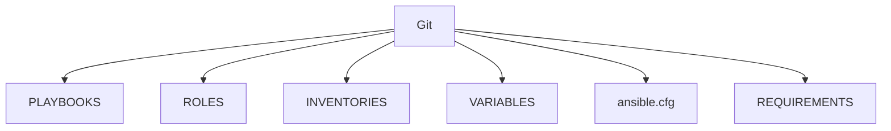

Le dépôt Git devient l'unique source de vérité de toute l'infrastructure.

---

# Une bonne pratique

Tout ce qui permet de reconstruire l'infrastructure doit être présent dans le dépôt.

À l'inverse.

Les éléments générés automatiquement ne doivent généralement pas être versionnés.

Par exemple.

- fichiers temporaires ;
- journaux ;
- caches ;
- fichiers compilés.

Cette discipline garantit qu'un nouvel administrateur pourra reconstruire intégralement le projet simplement en clonant le dépôt Git et en exécutant les playbooks.

C'est l'un des fondements de l'Infrastructure as Code et de la collaboration efficace entre plusieurs équipes.


# Tester les playbooks avant la production

Écrire un bon playbook ne suffit pas.

Avant chaque déploiement, il est indispensable de vérifier que les modifications produiront bien le résultat attendu.

Dans les grandes infrastructures, cette phase de validation est systématique.

Elle fait partie intégrante du cycle de développement.

---

# Pourquoi tester ?

Un simple changement peut avoir des conséquences importantes.

Par exemple.

- une erreur dans un template ;
- une variable renommée ;
- une mauvaise permission sur un fichier ;
- une modification du pare-feu.

Sans phase de validation.

Ces erreurs seront découvertes directement en production.

---

# Un cycle de déploiement

Une bonne pratique consiste à suivre une séquence similaire à celle-ci.

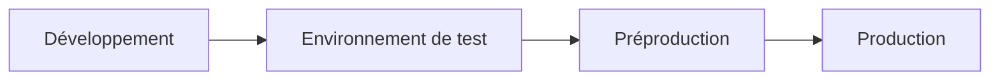

Chaque environnement valide le travail réalisé dans le précédent.

Ainsi, les risques diminuent progressivement avant la mise en production.

---

# Les outils d'Ansible

Nous avons déjà rencontré plusieurs fonctionnalités permettant de sécuriser un déploiement.

Par exemple.

```bash
--check
```

pour simuler les changements.

Ou encore.

```bash
--diff
```

pour afficher les différences sur les fichiers.

À cela s'ajoutent :

- les assertions (`assert`) ;
- les vérifications finales ;
- l'idempotence.

Ces mécanismes constituent déjà une première ligne de défense.

---

# Les tests manuels

Même lorsqu'un playbook s'exécute sans erreur.

Il est recommandé d'effectuer quelques contrôles.

Par exemple.

- le service démarre correctement ;
- les journaux ne contiennent pas d'erreur ;
- le port attendu est ouvert ;
- les certificats sont valides ;
- l'application répond correctement.

Ces vérifications permettent de détecter des problèmes que le playbook ne peut pas toujours anticiper.

---

# Une automatisation progressive

Avec le temps.

Ces contrôles manuels pourront être intégrés au projet.

Par exemple.

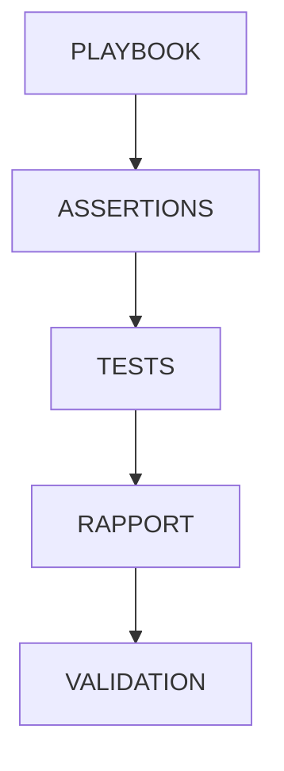

L'objectif est de réduire progressivement la part des vérifications réalisées manuellement.

---

# Une bonne pratique

Ne considérez jamais un playbook comme terminé après son premier succès.

Un bon playbook est un playbook qui :

- fonctionne aujourd'hui ;
- fonctionne demain ;
- fonctionne après plusieurs dizaines de modifications.

Cette stabilité ne s'obtient qu'en mettant en place une véritable stratégie de validation.

C'est cette discipline qui permet à une infrastructure automatisée de rester fiable pendant plusieurs années, malgré les évolutions constantes des applications et des systèmes.


# Industrialiser avec GitLab CI / GitHub Actions

Jusqu'à présent, nous avons lancé nos playbooks manuellement.

Par exemple.

```bash
ansible-playbook playbooks/sentinel.yml
```

Cette approche est parfaitement adaptée à un laboratoire.

En entreprise, les déploiements sont généralement déclenchés automatiquement par une plateforme d'intégration continue (CI).

Les plus répandues sont :

- GitLab CI ;
- GitHub Actions ;
- Jenkins ;
- Azure DevOps.

---

# Pourquoi utiliser une CI ?

L'objectif n'est pas uniquement d'automatiser les déploiements.

Une plateforme CI permet également de :

- vérifier la qualité du code ;
- lancer des tests automatiquement ;
- contrôler les modifications avant leur fusion ;
- tracer précisément chaque déploiement.

Le dépôt Git devient ainsi le point d'entrée de toutes les évolutions.

---

# Un cycle moderne

Lorsqu'un ingénieur modifie un rôle Ansible, le cycle est généralement le suivant.

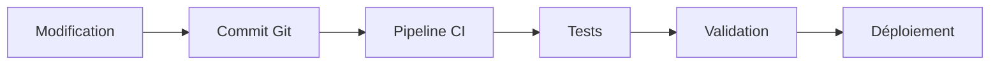

Le déploiement n'est plus déclenché directement par un administrateur.

Il est piloté par un processus reproductible.

---

# Que peut vérifier la CI ?

Avant toute mise en production, la plateforme peut exécuter automatiquement plusieurs contrôles.

Par exemple :

- syntaxe des playbooks ;
- qualité du code YAML ;
- respect des conventions ;
- exécution en mode `--check` ;
- tests unitaires des rôles.

Une erreur est détectée avant même qu'un administrateur ne lance le déploiement.

---

# Le principe du "Shift Left"

Les équipes DevOps utilisent souvent l'expression :

> **Shift Left**

Elle signifie que les erreurs doivent être détectées le plus tôt possible.

Le schéma suivant illustre cette idée.

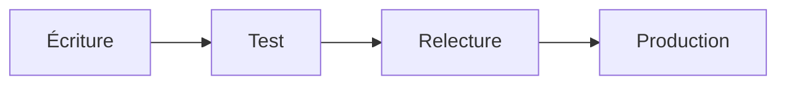

Plus un problème est découvert tôt.

Moins il coûte de temps et d'efforts à corriger.

---

# Notre laboratoire

Pour Sentinel, nous n'implémenterons pas immédiatement une chaîne CI complète.

En revanche, nous organiserons le projet de manière à ce qu'il puisse facilement être intégré à GitLab CI ou GitHub Actions.

Autrement dit.

Notre dépôt respectera déjà les bonnes pratiques attendues :

- rôles clairement séparés ;
- inventaires structurés ;
- variables organisées ;
- playbooks lisibles.

Cette préparation facilitera grandement l'ajout ultérieur d'une chaîne de déploiement continue.

---

# Une vision d'ingénieur

L'automatisation ne s'arrête pas aux serveurs.

Elle concerne également :

- la validation du code ;
- les tests ;
- les revues ;
- les déploiements.

En industrialisant l'ensemble de cette chaîne, une entreprise obtient une infrastructure plus fiable, plus reproductible et beaucoup plus simple à faire évoluer.

C'est cette vision globale qui distingue aujourd'hui les pratiques DevOps modernes d'une simple automatisation de tâches d'administration.


# Gérer les secrets de manière sécurisée

Jusqu'à présent, toutes les variables utilisées dans nos exemples étaient publiques.

Par exemple :

- un numéro de port ;
- un chemin de fichier ;
- un nom de domaine.

Dans une infrastructure réelle, certaines informations sont beaucoup plus sensibles.

Par exemple :

- mots de passe ;
- clés API ;
- jetons d'authentification ;
- certificats privés ;
- comptes de service.

Ces informations ne doivent jamais être stockées en clair dans le dépôt Git.

---

# Pourquoi est-ce dangereux ?

Prenons un exemple.

```yaml
postgres:

  password: MonMotDePasse123!
```

Ce fichier est versionné.

Chaque collaborateur ayant accès au dépôt peut alors consulter ce mot de passe.

Pire encore.

Même si la ligne est supprimée plus tard, elle reste présente dans l'historique Git.

Un secret compromis peut ainsi rester accessible pendant des années.

---

# Les solutions possibles

Plusieurs approches existent.

- **Ansible Vault**
- **HashiCorp Vault**
- **CyberArk**
- **AWS Secrets Manager**
- **Azure Key Vault**

Le choix dépend de la taille de l'infrastructure et des outils déjà en place.

Pour notre laboratoire, nous utiliserons principalement **Ansible Vault**, car il est directement intégré à Ansible.

---

# Le principe d'Ansible Vault

Au lieu de stocker une valeur en clair.

Le fichier est chiffré.

```text
group_vars/

└── vault.yml
```

Son contenu ressemble alors à ceci.

```text
$ANSIBLE_VAULT;1.1;AES256

613233343566...
```

Le contenu est illisible sans la clé de déchiffrement.

Le dépôt Git peut donc être partagé sans exposer les secrets.

---

# Où placer les secrets ?

Une bonne pratique consiste à séparer les variables.

```text
group_vars/

├── all.yml

├── sentinel.yml

└── vault.yml
```

Les paramètres publics restent dans les fichiers classiques.

Les secrets sont regroupés dans un ou plusieurs fichiers chiffrés.

Cette séparation facilite la lecture du projet tout en renforçant la sécurité.

---

# Une architecture sécurisée

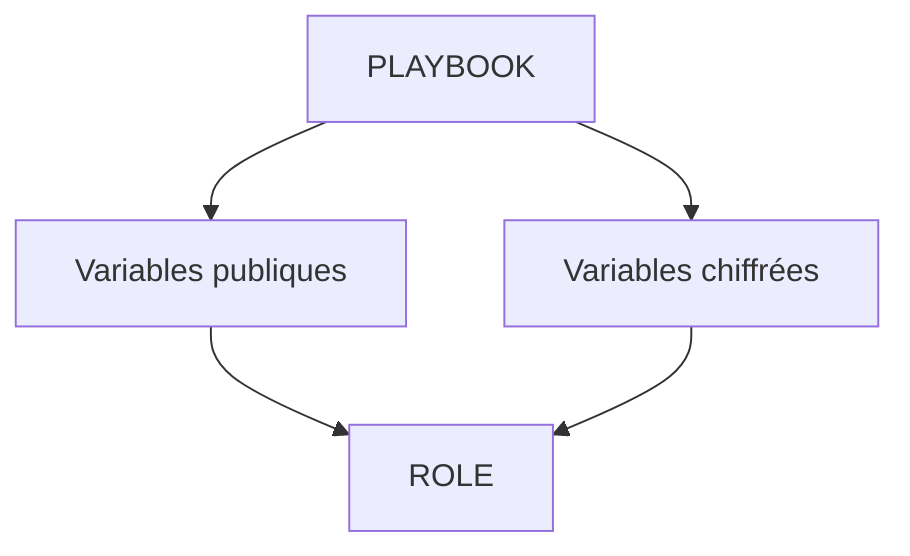

Pour le rôle Ansible.

Il n'existe aucune différence.

Les variables sont utilisées exactement de la même manière.

Le chiffrement est totalement transparent.

---

# Une règle absolue

Ne versionnez jamais :

- un mot de passe ;
- une clé privée ;
- un jeton d'API ;
- un secret applicatif ;

dans un fichier YAML non chiffré.

Cette règle est aujourd'hui considérée comme une exigence minimale de sécurité.

Elle s'applique quel que soit l'outil d'automatisation utilisé.

Dans la campagne suivante, nous utiliserons Ansible Vault pour protéger les informations sensibles de notre laboratoire Sentinel, afin que notre dépôt Git puisse être partagé sans risque d'exposer les secrets de l'infrastructure.


# Documenter l'infrastructure

Une infrastructure automatisée ne doit pas uniquement être fonctionnelle.

Elle doit également être compréhensible.

Une bonne documentation permet :

- d'accélérer l'arrivée d'un nouveau collaborateur ;
- de faciliter les opérations de maintenance ;
- de réduire les erreurs d'exploitation ;
- de conserver la connaissance technique au fil du temps.

L'automatisation ne remplace donc pas la documentation.

Elle la complète.

---

# Que faut-il documenter ?

Il est inutile de documenter chaque ligne de code.

En revanche, certains éléments méritent une description claire.

Par exemple :

- l'architecture générale ;
- le rôle de chaque serveur ;
- les groupes Ansible ;
- les dépendances entre les rôles ;
- les prérequis de déploiement.

Ces informations permettent de comprendre rapidement le projet.

---

# Le fichier `README.md`

Chaque dépôt Git devrait contenir un fichier :

```text
README.md
```

Il constitue la porte d'entrée du projet.

On y retrouve généralement :

- une présentation du projet ;
- les prérequis ;
- l'arborescence ;
- les commandes principales ;
- les procédures de déploiement.

Un nouvel administrateur doit pouvoir démarrer le projet en s'appuyant uniquement sur ce document.

---

# Documenter les rôles

Chaque rôle mérite également sa propre documentation.

Par exemple.

```text
roles/

└── sentinel/

    └── README.md
```

Ce document peut décrire :

- l'objectif du rôle ;
- les variables importantes ;
- les dépendances éventuelles ;
- un exemple d'utilisation.

Ainsi, le rôle devient facilement réutilisable dans d'autres projets.

---

# Les schémas d'architecture

Les diagrammes constituent un excellent complément à la documentation.

Par exemple.

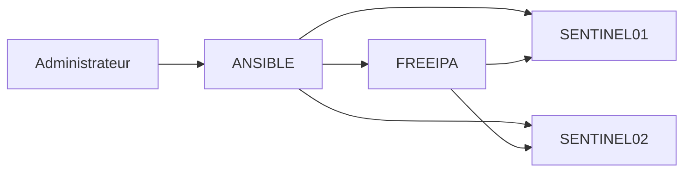

En quelques secondes, un lecteur comprend les relations entre les différents composants.

C'est souvent plus efficace qu'une longue description textuelle.

---

# La documentation comme code

De plus en plus d'entreprises appliquent le principe de :

> **Documentation as Code**

La documentation est :

- stockée dans Git ;
- relue lors des *Merge Requests* ;
- versionnée ;
- mise à jour en même temps que le code.

Ainsi, elle évolue naturellement avec le projet.

Le risque d'obsolescence est fortement réduit.

---

# Une bonne pratique

Considérez qu'un projet Ansible est incomplet tant qu'un nouvel administrateur ne peut pas répondre rapidement aux questions suivantes :

- Que déploie ce projet ?
- Quels rôles sont utilisés ?
- Comment lancer un déploiement ?
- Où modifier une configuration ?
- Où sont stockés les secrets ?

Si ces réponses sont clairement documentées, votre infrastructure sera non seulement automatisée, mais également transmissible et maintenable sur le long terme, même plusieurs années après sa création.


# Grande synthèse du chapitre 9.9

Au début de cette campagne, nous avons appris à écrire quelques tâches Ansible.

À présent, nous sommes capables de concevoir une infrastructure complète, organisée selon les pratiques utilisées dans les équipes DevOps et SRE.

Le changement est profond.

Nous ne raisonnons plus en termes de commandes Linux.

Nous raisonnons désormais en termes d'architecture.

---

# Le changement de paradigme

Au fil de cette campagne, notre vision de l'administration système a évolué.

Au départ.

```text
Administrateur

↓

Connexion SSH

↓

Modification manuelle
```

Aujourd'hui.

```text
Git

↓

Playbooks

↓

Rôles

↓

Infrastructure
```

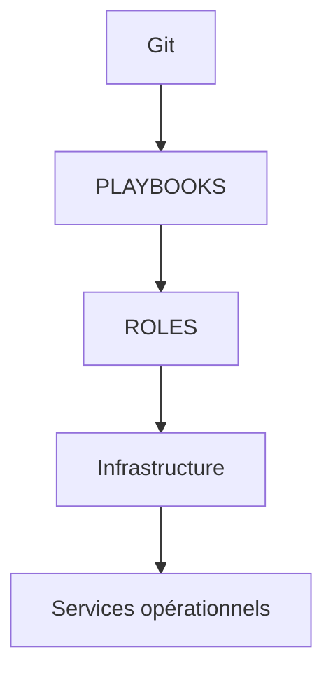

Le dépôt Git devient la source de vérité.

Les serveurs ne sont plus modifiés directement.

Ils sont reconstruits à partir du code.

---

# Les concepts acquis

Au cours de cette campagne, nous avons étudié les principaux concepts d'Ansible.

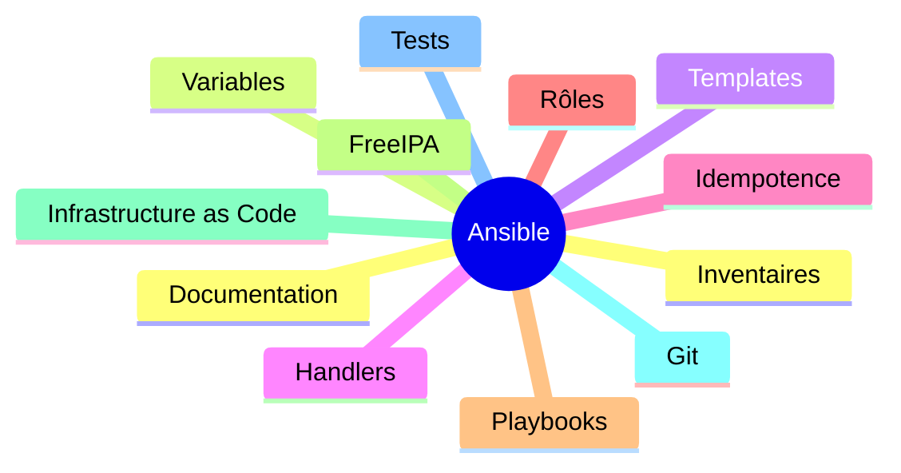

Ces briques forment aujourd'hui la base de la majorité des projets d'automatisation Linux.

---

# L'architecture finale

Notre laboratoire est maintenant organisé autour de plusieurs rôles spécialisés.

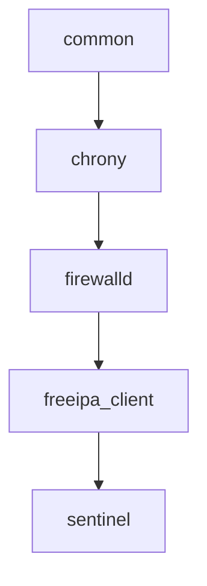

Chaque rôle possède une responsabilité unique.

Cette modularité facilite :

- la maintenance ;
- les tests ;
- la réutilisation ;
- les évolutions futures.

---

# Les pratiques professionnelles

Nous avons également introduit plusieurs méthodes largement utilisées en entreprise.

- séparation des environnements ;
- hiérarchie des variables ;
- Infrastructure as Code ;
- gestion des secrets ;
- documentation versionnée ;
- validation automatique ;
- préparation à l'intégration continue.

Ces sujets dépassent largement Ansible.

Ils constituent aujourd'hui les fondements de l'exploitation moderne.

---

# Ce que nous savons faire

À ce stade de la formation, nous sommes capables de :

- installer automatiquement un serveur ;
- le sécuriser ;
- l'intégrer à FreeIPA ;
- générer ses configurations ;
- déployer une application ;
- gérer ses certificats ;
- industrialiser l'ensemble du projet.

Autrement dit.

Nous maîtrisons désormais tout le cycle de vie d'un serveur Linux, depuis son installation jusqu'au déploiement automatisé d'une application sécurisée.

---

# Ce qui nous attend

La campagne suivante ne sera plus consacrée à l'apprentissage de nouvelles briques techniques.

Elle aura un objectif beaucoup plus ambitieux.

> **Assembler tout ce que nous avons construit pour déployer une infrastructure complète, cohérente et reproductible.**

Nous travaillerons comme une véritable équipe d'exploitation.

À partir d'un dépôt Git vide.

Nous construirons progressivement une plateforme capable de déployer automatiquement :

- les serveurs ;
- les rôles ;
- les certificats ;
- les services ;
- les applications.

Le dernier chapitre de cette campagne prendra la forme d'une **mission d'ingénierie**.

Vous ne découvrirez plus seulement des fonctionnalités d'Ansible.

Vous apprendrez à les combiner pour résoudre un problème réel de déploiement à l'échelle d'une entreprise.

