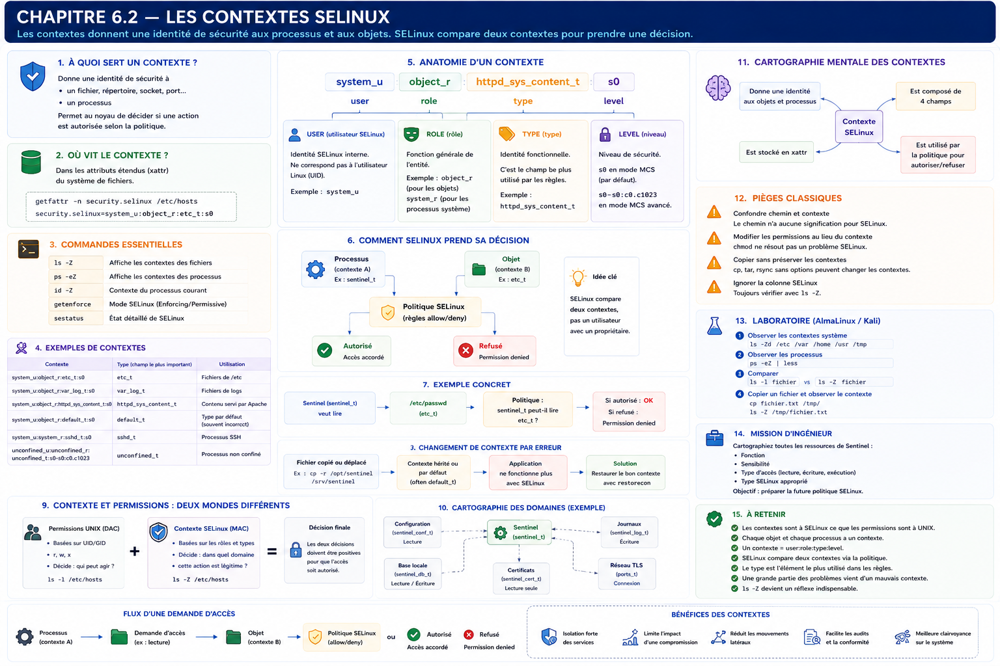

# Chapitre 6.2 — Les contextes SELinux

> *« Les permissions répondent à la question "Qui êtes-vous ?". Les contextes répondent à la question "Quel est votre rôle dans le système ?". »*

---

# Vous êtes ici

```text
Partie I — Construire un socle sécurisé

Campagne 6 — SELinux

      6.1 Pourquoi SELinux existe
    ► 6.2 Les contextes
      6.3 Les politiques
      6.4 Diagnostic des refus
      6.5 Création de règles
      6.6 Sécuriser Sentinel avec SELinux
```

---

# Objectifs pédagogiques

À la fin de ce chapitre, vous serez capable de :

- comprendre ce qu'est un contexte SELinux ;
- interpréter un contexte affiché par le système ;
- distinguer les contextes des permissions UNIX ;
- comprendre comment le noyau utilise les contextes lors d'une décision d'accès ;
- préparer le diagnostic des refus SELinux.

---

# Pourquoi ce chapitre existe

Dans le chapitre précédent, nous avons découvert que SELinux ajoute une seconde décision de sécurité.

Cette décision repose sur un élément nouveau :

> **Le contexte de sécurité.**

Or, lorsqu'un administrateur découvre SELinux, il rencontre immédiatement des lignes ressemblant à ceci :

```text
system_u:object_r:httpd_sys_content_t:s0
```

Ou encore :

```text
unconfined_u:unconfined_r:unconfined_t:s0-s0:c0.c1023
```

La première réaction est presque toujours la même.

> *« C'est incompréhensible. »*

En réalité, ces chaînes de caractères suivent une structure extrêmement logique.

Une fois cette structure comprise, une grande partie de SELinux devient beaucoup plus intuitive.

C'est pourquoi ce chapitre ne présente quasiment aucune commande avancée.

Son objectif est beaucoup plus important :

**apprendre à lire le langage de SELinux.**

---

# Théorie détaillée

## Une identité de sécurité

Dans Linux classique,

un fichier possède principalement :

- un propriétaire ;
- un groupe ;
- des permissions.

Par exemple.

```text
-rw-r-----  root  sentinel
```

Ces informations suffisent au modèle DAC.

SELinux ajoute une nouvelle identité.

Cette identité accompagne pratiquement tous les objets du système.

Par exemple :

- un fichier ;
- un répertoire ;
- un processus ;
- une socket ;
- un port réseau ;
- une mémoire partagée.

Autrement dit,

presque tout ce qui existe dans le noyau peut recevoir un contexte SELinux.

---

# Les objets possèdent un contexte

Visualisons un fichier.

```text
/var/lib/sentinel/config.db
```

Linux classique connaît :

```text
Owner

↓

sentinel
```

```text
Group

↓

sentinel
```

```text
Permissions

↓

640
```

SELinux ajoute une quatrième information.

```text
Contexte

↓

sentinel_var_lib_t
```

Le noyau dispose désormais d'une information supplémentaire pour prendre sa décision.

---

# Les processus possèdent eux aussi un contexte

Ce point est fondamental.

SELinux ne protège pas uniquement les fichiers.

Les processus possèdent également une identité.

Prenons Sentinel.

Lorsque systemd lance le service,

le noyau lui associe un contexte.

Schématiquement.

```text
sentinel.service

↓

PID 2458

↓

Contexte :

sentinel_t
```

Ce contexte accompagnera le processus pendant toute son exécution.

Chaque accès sera évalué à partir de cette identité.

---

# La rencontre entre deux contextes

Lorsqu'un processus ouvre un fichier,

SELinux ne compare pas un utilisateur avec un propriétaire.

Il compare deux contextes.

```text
Processus

↓

Contexte A

───────────────►

Fichier

↓

Contexte B

↓

Politique

↓

Décision
```

Le raisonnement est totalement différent du DAC.

C'est précisément cette comparaison qui permet d'exprimer des règles très fines.

---

# Afficher un contexte

La première commande à connaître est simplement :

```bash
ls -Z
```

Exemple.

```text
-rw-r--r--

root root

system_u:object_r:etc_t:s0

/etc/hosts
```

La colonne supplémentaire correspond au contexte SELinux.

Sans cette commande,

une grande partie des diagnostics devient impossible.

---

# Observer les processus

Pour les processus,

la commande est :

```bash
ps -eZ
```

Exemple simplifié.

```text
system_u:system_r:sshd_t:s0

/usr/sbin/sshd
```

Ou encore.

```text
system_u:system_r:chronyd_t:s0

/usr/sbin/chronyd
```

On constate immédiatement que deux services exécutés par le même utilisateur peuvent posséder des contextes complètement différents.

Et c'est précisément ce qui permet à SELinux de les isoler.

---

# Anatomie d'un contexte

Prenons un contexte réel.

```text
system_u:object_r:httpd_sys_content_t:s0
```

À première vue,

il semble illisible.

En réalité,

il est toujours composé de plusieurs champs.

```text
Utilisateur

:

Rôle

:

Type

:

Niveau
```

Autrement dit.

```text
user:role:type:level
```

Cette structure est identique sur tous les systèmes SELinux.

Comprendre ces quatre éléments revient à apprendre l'alphabet de SELinux.

---

# Le champ « User »

Premier élément.

```text
system_u
```

Attention.

Il ne s'agit pas de l'utilisateur Linux.

Ce champ appartient exclusivement à SELinux.

Il ne correspond pas à :

```bash
id

whoami
```

Il représente une identité de sécurité interne.

Dans la majorité des administrations système,

ce champ est relativement stable.

Il intervient rarement dans les diagnostics quotidiens.

---

# Le champ « Role »

Deuxième élément.

```text
object_r
```

ou

```text
system_r
```

Le rôle indique la fonction générale de l'entité.

Par exemple :

```text
system_r
```

désigne généralement un processus système.

À l'inverse,

```text
object_r
```

est utilisé pour les objets tels que les fichiers.

Nous reviendrons plus tard sur les rôles lorsque nous étudierons la politique SELinux.

Pour l'instant,

retenons simplement qu'ils participent eux aussi à la décision finale.

---

# Le champ « Type »

Voici le champ le plus important.

```text
httpd_sys_content_t
```

ou

```text
sshd_t
```

ou

```text
chronyd_t
```

ou

```text
container_t
```

Le type représente la véritable identité fonctionnelle d'un objet.

Dans la pratique,

lorsqu'un administrateur parle de « contexte SELinux »,

il fait très souvent référence au type.

Pourquoi ?

Parce que la majorité des règles de sécurité sont construites autour de lui.

C'est le type qui permet d'exprimer des règles comme :

> Un processus de type `httpd_t` peut lire des fichiers de type `httpd_sys_content_t`.

Nous verrons dans le prochain chapitre que le **Type Enforcement (TE)** constitue le cœur même de SELinux.

---
# Le champ « Level »

Le quatrième élément du contexte est souvent celui qui intrigue le plus.

Prenons notre exemple.

```text
system_u:object_r:httpd_sys_content_t:s0
```

Le dernier champ est :

```text
s0
```

Il représente le **niveau de sécurité**.

Historiquement,

ce champ est directement issu des systèmes militaires utilisant le contrôle d'accès obligatoire.

On y retrouvait des niveaux tels que :

```text
Non classifié

↓

Confidentiel

↓

Secret

↓

Très Secret
```

Chaque document,

chaque utilisateur,

chaque processus possédait un niveau.

Le système empêchait automatiquement qu'une information classifiée soit lue par un utilisateur insuffisamment habilité.

SELinux a conservé cette capacité.

---

# MLS et MCS

Le champ « Level » est principalement utilisé dans deux modes.

## MLS

```text
Multi Level Security
```

Destiné aux environnements très sensibles.

Par exemple :

- militaire ;
- gouvernemental ;
- industrie de défense.

Dans ce mode,

les niveaux de sécurité jouent un rôle majeur.

---

## MCS

```text
Multi Category Security
```

C'est le mode utilisé par défaut sur AlmaLinux et RHEL.

Le niveau apparaît généralement sous une forme simple.

```text
s0
```

Ou plus complète.

```text
s0:c0,c3
```

Dans notre contexte,

nous utiliserons essentiellement le mode MCS.

Les niveaux n'interviendront que rarement dans les politiques que nous construirons.

---

# Pourquoi apprendre les quatre champs si le type est le plus important ?

C'est une excellente question.

La réponse est simple.

Parce qu'un administrateur doit être capable de lire correctement un contexte.

Prenons cette ligne.

```text
system_u:object_r:httpd_sys_content_t:s0
```

Même si le type est souvent l'élément décisif,

ignorer les autres champs reviendrait à ne lire qu'un quart d'une adresse IP.

Un ingénieur sécurité doit savoir reconnaître immédiatement chacun des éléments,

même s'il ne les manipule pas quotidiennement.

---

# Les types racontent une histoire

Observons quelques exemples.

```text
etc_t
```

On devine immédiatement :

```text
Fichiers

de

/etc
```

---

```text
httpd_sys_content_t
```

On reconnaît facilement :

```text
Contenu

destiné

au serveur HTTP.
```

---

```text
var_log_t
```

Correspond aux journaux.

---

```text
user_home_t
```

Répertoires personnels.

---

```text
bin_t
```

Exécutables système.

On remarque rapidement que les types suivent une nomenclature relativement logique.

Ils deviennent progressivement lisibles.

---

# Un exemple concret

Imaginons que Sentinel souhaite ouvrir :

```text
/etc/passwd
```

Le noyau connaît immédiatement deux informations.

Le processus.

```text
sentinel_t
```

Le fichier.

```text
etc_t
```

La décision devient alors :

```text
sentinel_t

↓

lecture

↓

etc_t

↓

Politique

↓

Autoriser ?

Refuser ?
```

Cette représentation est beaucoup plus proche du fonctionnement réel de SELinux que le simple modèle utilisateur/groupe.

---

# Les contextes suivent les objets

Prenons maintenant une copie de fichier.

```bash
cp fichier.txt /tmp/
```

Que devient le contexte ?

Intuitivement,

beaucoup répondent :

> Il est copié.

Ce n'est pas toujours le cas.

En réalité,

SELinux cherche généralement à appliquer le contexte attendu dans le répertoire de destination.

Autrement dit,

le contexte dépend davantage de l'emplacement logique que du fichier lui-même.

Cette particularité surprend souvent les administrateurs.

Nous reviendrons dessus lorsque nous étudierons `restorecon`.

---

# Un mauvais contexte est plus fréquent qu'une mauvaise politique

Lorsqu'une application cesse soudainement de fonctionner avec SELinux,

beaucoup pensent immédiatement :

> Il faut modifier la politique.

En pratique,

la majorité des incidents proviennent simplement d'un contexte incorrect.

Prenons un exemple.

Un administrateur copie manuellement un site Web.

```bash
cp -r site /var/www/html
```

Les permissions UNIX sont parfaites.

Apache possède tous les droits nécessaires.

Pourtant,

les pages retournent :

```text
403 Forbidden
```

Pourquoi ?

Parce que les fichiers possèdent un mauvais contexte.

La politique est correcte.

Les permissions sont correctes.

Seul le contexte est erroné.

Comprendre cette différence fait gagner un temps considérable lors des investigations.

---

# Une erreur classique avec Sentinel

Imaginons notre application.

Au départ,

elle est installée ici.

```text
/opt/sentinel
```

Plus tard,

un administrateur décide de la déplacer.

```text
/opt/sentinel

↓

/srv/sentinel
```

Il copie simplement les fichiers.

```bash
cp -r
```

Puis redémarre le service.

Résultat.

```text
Permission denied
```

Pourquoi ?

Parce que la politique attend probablement des types précis.

Or,

les nouveaux fichiers ont reçu un contexte différent.

Le problème ne vient pas du code.

Il ne vient pas des permissions.

Il provient uniquement des contextes.

---

# Les contextes sont invisibles...

...jusqu'au jour où ils deviennent essentiels.

Visualisons un fichier.

```bash
ls -l
```

Tout paraît correct.

```text
-rw-r-----

sentinel

sentinel
```

Pourtant,

il est inutilisable.

Pourquoi ?

Parce qu'une information manque.

```bash
ls -Z
```

On découvre alors.

```text
system_u:object_r:default_t:s0
```

Le contexte est incorrect.

Cette quatrième colonne est précisément ce qui distingue une administration Linux classique d'une administration SELinux.

À partir de maintenant,

`ls -Z` deviendra un réflexe aussi naturel que `ls -l`.

---

# Une représentation mentale

Lorsque vous observez un objet du système,

essayez désormais de le représenter ainsi.

```text
               FICHIER

Nom
│
├── Propriétaire
├── Groupe
├── Permissions
└── Contexte SELinux
```

Et pour un processus.

```text
             PROCESSUS

PID
│
├── Utilisateur Linux
├── Groupe Linux
└── Contexte SELinux
```

Lorsqu'un accès est demandé,

SELinux compare principalement :

```text
Contexte du processus

↓

Contexte de l'objet

↓

Règles de la politique

↓

Décision finale
```

À partir de maintenant,

vous possédez tous les éléments nécessaires pour comprendre le cœur de SELinux.

Le prochain chapitre expliquera comment les politiques utilisent précisément ces contextes pour autoriser ou interdire chaque interaction.

# 💎 Le point d'expertise

## Le véritable cœur de SELinux n'est pas le contexte. C'est la relation entre deux contextes.

Après quelques jours d'utilisation de SELinux, beaucoup d'administrateurs tombent dans le même piège.

Ils cherchent à mémoriser des centaines de types.

Par exemple :

```text
httpd_t

httpd_sys_content_t

httpd_log_t

var_log_t

etc_t

user_home_t

...
```

Cette approche est vouée à l'échec.

Le nombre de types dépasse largement le millier sur une installation AlmaLinux standard.

Personne ne les connaît tous.

En réalité, un ingénieur sécurité ne raisonne jamais ainsi.

Il raisonne en termes de **relations**.

Par exemple.

```text
Processus :

httpd_t

↓

Lecture

↓

httpd_sys_content_t

↓

Autorisé
```

ou

```text
Processus :

httpd_t

↓

Lecture

↓

shadow_t

↓

Refusé
```

Le type n'a donc de sens qu'en présence d'un second type.

C'est leur interaction qui est importante.

---

## Les types représentent des responsabilités

Une erreur consiste à considérer un type comme un simple nom.

En réalité,

un type décrit une responsabilité dans le système.

Prenons quelques exemples.

```text
httpd_t
```

Ce n'est pas Apache.

C'est :

> **Un processus dont le rôle est de servir du contenu Web.**

---

```text
named_t
```

Ce n'est pas BIND.

C'est :

> **Un processus dont le rôle est de répondre aux requêtes DNS.**

---

```text
chronyd_t
```

Ce n'est pas Chrony.

C'est :

> **Un processus chargé de maintenir la synchronisation temporelle.**

Les politiques SELinux sont donc écrites autour des **fonctions** des processus,

et non autour des logiciels eux-mêmes.

Cette abstraction explique pourquoi les politiques restent relativement stables,

même lorsque les applications évoluent.

---

## Pourquoi les types sont-ils terminés par "_t" ?

Vous remarquerez rapidement que presque tous les types se terminent par :

```text
_t
```

Ce suffixe signifie simplement :

```text
Type
```

De la même manière,

vous rencontrerez également :

```text
_r
```

pour les rôles,

ou

```text
_u
```

pour les utilisateurs SELinux.

Cette convention rend les politiques beaucoup plus lisibles.

---

# 🧠 Comment pense un architecte ?

Un architecte ne classe pas les fichiers.

Il classe les **fonctions**.

Prenons Sentinel.

Au lieu de réfléchir ainsi.

```text
config.yml

↓

base.db

↓

server.pem

↓

logs
```

Il réfléchit plutôt ainsi.

```text
Configuration

↓

Données

↓

Secrets

↓

Journaux

↓

Exécutables
```

Chaque catégorie recevra ensuite son propre type SELinux.

Cette approche présente un avantage majeur.

Elle reste valable,

quel que soit le nombre de fichiers.

L'architecture ne dépend plus de l'arborescence.

Elle dépend des responsabilités.

---

## Concevoir une cartographie de confiance

Imaginons maintenant que Sentinel soit installé sur un serveur de production.

Un architecte dessine mentalement une carte ressemblant à ceci.

```text
                 Sentinel

                     │

      ┌──────────────┼──────────────┐

      ▼              ▼              ▼

Configuration     Certificats     Journaux

      │              │              │

Lecture         Lecture seule   Écriture

      ▼              ▼              ▼

 Contexte A     Contexte B     Contexte C
```

Cette cartographie est extrêmement précieuse.

Avant même d'écrire une politique,

elle permet de visualiser toutes les interactions nécessaires.

Chaque nouveau flux devra ensuite être justifié.

---

# ⚔️ Comment pense un attaquant ?

Pour un attaquant,

les contextes représentent des frontières.

Son objectif devient donc simple :

sortir de son domaine.

Imaginons une compromission de Sentinel.

Le processus possède le type :

```text
sentinel_t
```

L'attaquant va naturellement essayer d'accéder à des ressources appartenant à d'autres domaines.

Par exemple.

```text
shadow_t

↓

user_home_t

↓

httpd_config_t

↓

postgresql_db_t
```

Chaque refus réduit son rayon d'action.

Au lieu de pouvoir explorer librement le système,

il reste enfermé dans son domaine d'origine.

Cette compartimentation est l'une des forces majeures de SELinux.

---

## Les mouvements latéraux deviennent beaucoup plus difficiles

Une compromission n'a pas toujours pour objectif immédiat d'obtenir les privilèges root.

Souvent,

l'attaquant cherche d'abord à se déplacer.

Par exemple.

```text
Service Web

↓

Base de données

↓

Service LDAP

↓

Agent d'administration
```

Chaque transition constitue un mouvement latéral.

Les contextes SELinux rendent précisément ces transitions beaucoup plus difficiles.

Même lorsqu'un premier service est compromis,

les interactions vers d'autres domaines restent soumises à la politique de sécurité.

C'est une protection particulièrement efficace contre les attaques modernes visant à progresser progressivement dans le système.

# 🏢 En entreprise

Dans les entreprises utilisant plusieurs centaines ou milliers de serveurs, les contextes SELinux constituent un véritable langage commun entre les équipes.

Prenons une équipe d'exploitation.

Lorsqu'un administrateur lit :

```text
httpd_sys_content_t
```

il comprend immédiatement qu'il s'agit de contenu destiné à être lu par le serveur HTTP.

De la même manière :

```text
named_zone_t
```

évoque immédiatement des fichiers de zones DNS.

Ou encore :

```text
ssh_home_t
```

désigne des fichiers utilisés par SSH dans le contexte d'un utilisateur.

Cette nomenclature permet de comprendre rapidement le rôle d'un fichier sans même connaître son chemin exact.

---

## Les équipes sécurité raisonnent en domaines

Une entreprise ne cherche généralement pas à protéger individuellement chaque fichier.

Elle protège des domaines fonctionnels.

Prenons un serveur hébergeant plusieurs services.

```text
                 Serveur AlmaLinux

        ┌──────────────┬───────────────┬───────────────┐

        ▼              ▼               ▼

      Apache       PostgreSQL      Sentinel

        │              │               │

    httpd_t      postgresql_t     sentinel_t
```

L'objectif est simple.

Chaque domaine ne doit accéder qu'aux ressources nécessaires à son fonctionnement.

Même si deux services tournent sous le même utilisateur Linux,

leurs contextes continueront à les isoler.

Cette séparation est beaucoup plus robuste que le simple découpage par UID.

---

## Les contextes facilitent les audits

Lors d'un audit de sécurité,

les experts ne se contentent pas de vérifier les permissions UNIX.

Ils vérifient également la cohérence des contextes.

Par exemple.

Une arborescence destinée à Apache devrait principalement contenir des types comme :

```text
httpd_sys_content_t
```

ou

```text
httpd_config_t
```

La présence d'un type totalement inattendu,

comme :

```text
user_home_t
```

constitue immédiatement un signal d'alerte.

Les contextes deviennent ainsi un outil d'audit extrêmement puissant.

---

# 📚 Culture technique

## Les contextes sont stockés dans les attributs étendus

Une question revient souvent.

> Où SELinux stocke-t-il ces contextes ?

La réponse surprend généralement.

Ils ne sont pas écrits dans les permissions UNIX.

Ils ne sont pas non plus enregistrés dans un fichier séparé.

Ils sont stockés dans les **attributs étendus** (*Extended Attributes* ou **xattr**) du système de fichiers.

Vous pouvez les consulter avec :

```bash
getfattr -n security.selinux /etc/hosts
```

Le résultat ressemble à ceci.

```text
security.selinux=
system_u:object_r:etc_t:s0
```

Cette information voyage avec le fichier tant que le système de fichiers prend en charge les attributs étendus.

C'est l'une des raisons pour lesquelles certaines copies ou certains archivages peuvent modifier les contextes si les outils utilisés ne préservent pas les xattr.

---

## Les systèmes de fichiers compatibles

La plupart des systèmes de fichiers modernes utilisés avec AlmaLinux supportent naturellement les contextes SELinux.

Par exemple :

- XFS ;
- ext4 ;
- Btrfs.

En revanche,

certains systèmes de fichiers distants ou anciens ne gèrent pas correctement les attributs étendus.

Dans ce cas,

SELinux ne peut plus s'appuyer sur les contextes de manière classique.

Cette contrainte influence parfois le choix des architectures de stockage en entreprise.

---

# ⚠️ Piège classique

## Confondre chemin et contexte

Beaucoup d'administrateurs pensent :

> « Si le fichier est dans `/var/www`, Apache pourra forcément le lire. »

C'est faux.

Le chemin n'a aucune signification particulière pour SELinux.

Ce qui compte,

c'est le contexte.

Prenons deux fichiers.

```text
/var/www/html/index.html
```

Premier cas.

```text
httpd_sys_content_t
```

Apache peut le lire.

---

Deuxième cas.

```text
default_t
```

Apache sera probablement bloqué,

bien que le chemin soit exactement le même.

Cette distinction est essentielle.

---

## Corriger les permissions au lieu des contextes

Autre scénario très fréquent.

L'application affiche :

```text
Permission denied
```

L'administrateur répond immédiatement.

```bash
chmod 777 fichier
```

Le problème persiste.

Pourquoi ?

Parce que les permissions UNIX n'étaient pas en cause.

Le contexte SELinux restait incorrect.

Cette réaction est tellement courante qu'elle est devenue un véritable indicateur d'un manque d'expérience avec SELinux.

À partir de maintenant,

avant de modifier les permissions,

la première vérification devra toujours être :

```bash
ls -Z
```

---

# Laboratoire AlmaLinux / Kali

## Objectif

Découvrir concrètement les contextes SELinux et apprendre à les observer avant toute modification.

---

## Étape 1 — Observer les contextes système

Lister plusieurs répertoires.

```bash
ls -Zd /

ls -Zd /etc

ls -Zd /var

ls -Zd /home
```

Comparer les différents types rencontrés.

Essayer d'en déduire leur rôle.

---

## Étape 2 — Observer différents services

Afficher les processus.

```bash
ps -eZ
```

Repérer notamment :

- `sshd_t`
- `chronyd_t`
- `firewalld_t`
- `NetworkManager_t`

Comparer leurs contextes avec les utilisateurs Linux correspondants.

---

## Étape 3 — Comparer `ls -l` et `ls -Z`

Choisir plusieurs fichiers.

Afficher successivement.

```bash
ls -l
```

Puis.

```bash
ls -Z
```

Identifier précisément quelles informations sont apportées uniquement par SELinux.

---

## Étape 4 — Déplacer un fichier de test

Créer un fichier dans votre répertoire personnel.

Le copier ensuite dans :

```text
/tmp
```

Puis dans :

```text
/var/tmp
```

Observer les contextes obtenus.

Commencer à formuler des hypothèses sur la manière dont SELinux choisit un contexte.

Nous confirmerons ces hypothèses dans les prochains chapitres.

---

# Mission d'ingénieur

Votre entreprise prépare le développement de Sentinel.

Avant même d'écrire la première politique SELinux,

vous devez réaliser une cartographie des ressources manipulées par l'application.

Pour chacune d'elles,

indiquez :

- sa fonction ;
- son niveau de sensibilité ;
- si elle est lue, écrite ou exécutée ;
- quel type SELinux lui semblerait approprié.

L'objectif est de produire un document d'architecture qui servira de base à la future politique de sécurité.

Vous ne devez écrire aucune règle.

Vous devez uniquement raisonner sur les **interactions légitimes** entre Sentinel et son environnement.

---

# Impact sur Sentinel

Nous savons désormais que Sentinel possédera son propre domaine SELinux.

À terme,

ses processus,

ses fichiers de configuration,

ses journaux,

ses certificats,

sa base locale,

et ses répertoires de travail recevront des contextes spécifiques.

Cette organisation permettra à SELinux de distinguer clairement les différentes ressources manipulées par l'application.

Le prochain chapitre expliquera comment les **politiques SELinux** utilisent précisément ces contextes pour autoriser ou refuser chaque interaction.

---

# Ce qu'il faut retenir

- Presque tous les objets Linux possèdent un contexte SELinux.
- Les processus disposent eux aussi d'un contexte.
- Un contexte est composé de quatre champs : `user:role:type:level`.
- Le champ **type** est celui qui intervient le plus souvent dans les décisions de sécurité.
- SELinux compare principalement le contexte du processus avec celui de l'objet.
- Les contextes sont stockés dans les attributs étendus du système de fichiers.
- Une grande partie des incidents SELinux provient d'un contexte incorrect plutôt que d'une mauvaise politique.

---

# Grande infographie de révision du chapitre

```text
┌─────────────────────────────────────────────────────────────────────────────────────────────┐
│                        CHAPITRE 6.2 — LES CONTEXTES SELINUX                                 │
├─────────────────────────────────────────────────────────────────────────────────────────────┤
│                                                                                             │
│                 PROCESSUS                               OBJET                               │
│             sentinel_t                          httpd_sys_content_t                         │
│                   │                                      │                                  │
│                   └───────────────┬──────────────────────┘                                  │
│                                   ▼                                                         │
│                           Politique SELinux                                                 │
│                                   │                                                         │
│                          Allow ? / Deny ?                                                   │
│                                   │                                                         │
│                          Décision finale                                                    │
│                                                                                             │
├─────────────────────────────────────────────────────────────────────────────────────────────┤
│                                                                                             │
│               STRUCTURE D'UN CONTEXTE                                                       │
│                                                                                             │
│   system_u : object_r : httpd_sys_content_t : s0                                            │
│      │            │               │               │                                         │
│      │            │               │               └── Niveau                                │
│      │            │               └────────────────── Type (le plus important)              │
│      │            └────────────────────────────────── Rôle                                  │
│      └────────────────────────────────────────────── Utilisateur SELinux                    │
│                                                                                             │
├─────────────────────────────────────────────────────────────────────────────────────────────┤
│                                                                                             │
│                 COMMANDES CLÉS                                                              │
│                                                                                             │
│ ls -Z        → Contextes des fichiers                                                       │
│ ps -eZ       → Contextes des processus                                                      │
│ getfattr     → Attribut security.selinux                                                    │
│                                                                                             │
├─────────────────────────────────────────────────────────────────────────────────────────────┤
│                                                                                             │
│ À RETENIR                                                                                   │
│                                                                                             │
│ « Les permissions indiquent QUI peut agir.                                                  │
│  Les contextes indiquent DANS QUEL DOMAINE cette action est réalisée. »                     │
└─────────────────────────────────────────────────────────────────────────────────────────────┘

```

