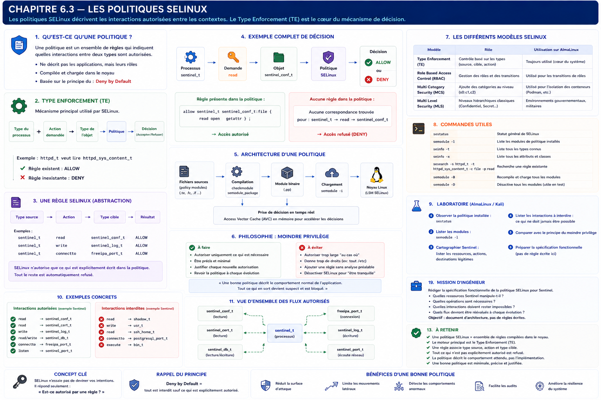

# Chapitre 6.3 — Les politiques SELinux

> *« Les contextes décrivent les acteurs. Les politiques écrivent le scénario. Sans politique, les contextes ne sont que des étiquettes. »*

---

# Vous êtes ici

```text
Partie I — Construire un socle sécurisé

Campagne 6 — SELinux

      6.1 Pourquoi SELinux existe
      6.2 Les contextes
    ► 6.3 Les politiques
      6.4 Diagnostic des refus
      6.5 Création de règles
      6.6 Sécuriser Sentinel avec SELinux
```

---

# Objectifs pédagogiques

À la fin de ce chapitre, vous serez capable de :

- comprendre ce qu'est réellement une politique SELinux ;
- distinguer les notions de contexte et de politique ;
- comprendre le principe du **Type Enforcement (TE)** ;
- savoir comment SELinux prend une décision d'autorisation ;
- préparer la création de règles personnalisées dans les chapitres suivants.

---

# Pourquoi ce chapitre existe

À ce stade de la campagne,

nous savons déjà plusieurs choses.

Nous savons que :

- les fichiers possèdent un contexte ;
- les processus possèdent un contexte ;
- SELinux compare ces contextes.

Mais une question essentielle demeure.

> **Qui décide finalement qu'une interaction est autorisée ou interdite ?**

La réponse est :

**la politique SELinux.**

Sans elle,

les contextes n'ont aucune signification.

Ils ressemblent à des badges sans lecteur de contrôle d'accès.

Ils identifient les objets,

mais ne disent absolument pas ce qui est autorisé.

Les politiques sont donc le véritable cerveau de SELinux.

---

# Théorie détaillée

## Une politique est un ensemble de règles

Le terme « politique » peut sembler abstrait.

En réalité,

il s'agit simplement d'un très grand ensemble de règles.

Par exemple.

```text
Un processus HTTP

↓

peut lire

↓

des fichiers Web.
```

Ou encore.

```text
Le serveur SSH

↓

peut ouvrir

↓

le port 22.
```

Ou bien.

```text
Le démon DNS

↓

peut écrire

↓

dans ses fichiers de cache.
```

Chaque règle décrit une interaction légitime entre deux objets.

L'ensemble de ces règles constitue la politique SELinux.

---

# Une politique ne décrit pas les applications

C'est une nuance très importante.

La politique ne dit pas :

```text
Apache

↓

peut lire

↓

index.html
```

Elle dit :

```text
Tout processus

de type

httpd_t

↓

peut lire

↓

tout objet

de type

httpd_sys_content_t.
```

Cette abstraction rend les politiques beaucoup plus puissantes.

Elles ne dépendent pas d'un nom de programme.

Elles dépendent uniquement des rôles joués par les différents composants.

---

# Le cœur de SELinux : le Type Enforcement

Le mécanisme principal utilisé par SELinux s'appelle :

```text
Type Enforcement

TE
```

Il s'agit du moteur de décision utilisé dans la très grande majorité des politiques Red Hat.

Son principe est remarquablement simple.

Chaque processus possède un type.

Chaque objet possède un type.

La politique indique quelles interactions entre ces types sont autorisées.

Schématiquement.

```text
Type du processus

↓

Type de l'objet

↓

Action demandée

↓

Politique

↓

Décision
```

Cette logique sera omniprésente dans toute la suite de cette campagne.

---

# Un exemple

Prenons Apache.

Le processus possède le type :

```text
httpd_t
```

Une page Web possède le type :

```text
httpd_sys_content_t
```

La politique contient une règle.

```text
httpd_t

↓

read

↓

httpd_sys_content_t

↓

ALLOW
```

Le noyau autorise alors la lecture.

Le raisonnement est extrêmement mécanique.

Aucune intuition.

Aucune exception.

Uniquement une comparaison avec les règles de la politique.

---

# Si aucune règle n'existe...

Imaginons maintenant que le même processus tente de lire :

```text
/etc/shadow
```

Le fichier possède un type totalement différent.

Par exemple.

```text
shadow_t
```

La politique cherche alors une règle.

```text
httpd_t

↓

read

↓

shadow_t
```

Elle n'en trouve aucune.

Le résultat est immédiat.

```text
DENY
```

Ce point est fondamental.

SELinux fonctionne selon un principe de **refus implicite**.

Autrement dit,

tout ce qui n'est pas explicitement autorisé est interdit.

Nous retrouvons ici exactement la philosophie étudiée avec Firewalld :

> **Deny by Default**

La différence est que cette fois,

ce principe s'applique non plus aux paquets réseau,

mais aux interactions entre les objets du système.

# Une politique est compilée

Une politique SELinux n'est pas un simple fichier texte lu à chaque accès.

Elle est compilée en une structure optimisée,

chargée directement dans le noyau Linux.

Visualisons le fonctionnement.

```text
              Politique SELinux

                      │

              Compilation

                      │

                      ▼

            Politique binaire

                      │

                      ▼

               Noyau Linux

                      │

                      ▼

          Décisions en temps réel
```

Cette architecture explique pourquoi SELinux est capable de prendre plusieurs milliers de décisions par seconde sans dégrader significativement les performances.

Le noyau ne relit jamais un fichier de configuration.

Il consulte directement une politique déjà compilée.

---

# Une politique est déterministe

L'une des grandes qualités de SELinux est son caractère déterministe.

Prenons exactement le même scénario.

```text
Processus

↓

httpd_t

↓

Lecture

↓

httpd_sys_content_t
```

La décision sera toujours identique.

Aujourd'hui.

Demain.

Après un redémarrage.

Sur un autre serveur possédant la même politique.

Il n'existe aucune notion de hasard.

Aucune priorité implicite.

Aucune interprétation.

La politique décrit précisément le comportement attendu.

Le noyau applique cette décision systématiquement.

Cette prévisibilité est essentielle dans les environnements critiques.

---

# Les actions sont elles aussi contrôlées

Jusqu'à présent,

nous avons principalement parlé de lecture.

En réalité,

SELinux contrôle un très grand nombre d'opérations.

Par exemple.

```text
read
```

Lecture.

---

```text
write
```

Écriture.

---

```text
append
```

Ajout à un fichier.

---

```text
create
```

Création.

---

```text
unlink
```

Suppression.

---

```text
execute
```

Exécution.

---

```text
rename
```

Renommage.

---

```text
connect
```

Connexion réseau.

---

```text
bind
```

Ouverture d'un port.

---

```text
listen
```

Mise en écoute.

Autrement dit,

la politique ne contrôle pas uniquement **qui** accède à une ressource.

Elle contrôle également **comment** cette ressource est utilisée.

---

# Une règle SELinux

Sans entrer encore dans la syntaxe complète,

une règle peut être représentée ainsi.

```text
Type A

↓

Action

↓

Type B

↓

ALLOW
```

Par exemple.

```text
sentinel_t

↓

read

↓

sentinel_conf_t

↓

ALLOW
```

Ou encore.

```text
sentinel_t

↓

write

↓

sentinel_log_t

↓

ALLOW
```

Chaque interaction est décrite séparément.

Cette granularité est l'une des principales forces de SELinux.

---

# Une politique ne cherche pas à être intelligente

Contrairement à certains systèmes de sécurité modernes,

SELinux ne tente jamais de deviner les intentions.

Prenons le cas suivant.

Sentinel tente d'ouvrir :

```text
/etc/passwd
```

Le noyau ne se demande jamais.

```text
Pourquoi ?

Est-ce raisonnable ?

L'application est-elle fiable ?
```

Il répond uniquement à une question.

```text
Existe-t-il

une règle

autorisant

cette opération ?
```

La décision est purement mécanique.

Cette simplicité est volontaire.

Elle garantit un comportement parfaitement prévisible.

---

# Le principe du moindre privilège

Le Type Enforcement permet d'appliquer naturellement un principe déjà rencontré plusieurs fois dans ce manuel.

Le moindre privilège.

Visualisons Sentinel.

Il a besoin de :

- lire sa configuration ;
- lire ses certificats ;
- écrire ses journaux ;
- mettre à jour sa base locale.

En revanche,

il n'a absolument aucune raison de :

- modifier les fichiers d'Apache ;
- lire les clés SSH des utilisateurs ;
- accéder aux bases PostgreSQL ;
- écrire dans `/usr/bin`.

Une politique bien conçue n'autorisera donc que les interactions réellement nécessaires.

Tout le reste restera interdit.

Le principe du moindre privilège est ainsi appliqué directement au niveau du noyau.

---

# Pourquoi la politique est-elle si volumineuse ?

Une installation AlmaLinux contient plusieurs centaines de services.

Chacun possède :

- des fichiers ;
- des sockets ;
- des ports ;
- des répertoires ;
- des processus.

Pour chacun,

la politique doit décrire les interactions autorisées.

Le résultat représente plusieurs dizaines de milliers de règles.

Heureusement,

l'administrateur n'a pratiquement jamais besoin de toutes les connaître.

Dans la majorité des cas,

il se contente :

- de comprendre les refus ;
- d'ajuster les contextes ;
- ou de compléter ponctuellement la politique.

---

# Une représentation mentale

Essayons maintenant de résumer tout ce que nous avons appris depuis le début de la campagne.

```text
            Processus

         Type : sentinel_t

                 │

                 ▼

      Demande une opération

                 │

                 ▼

          Objet cible

      Type : sentinel_conf_t

                 │

                 ▼

      Recherche dans la politique

                 │

        ┌────────┴────────┐

        ▼                 ▼

     Règle trouvée    Aucune règle

        │                 │

        ▼                 ▼

      ALLOW             DENY
```

Cette représentation est probablement la plus importante de toute la campagne.

Chaque refus SELinux,

chaque diagnostic,

chaque politique,

chaque correction,

reviendra toujours à cette séquence.

Une fois ce mécanisme assimilé,

SELinux cesse progressivement d'être une « boîte noire » pour devenir un système parfaitement logique.

---

# Les politiques fournies par AlmaLinux

Une question apparaît souvent.

> Qui écrit toutes ces règles ?

La réponse est :

principalement Red Hat.

Les distributions de la famille RHEL fournissent une politique extrêmement riche.

Elle couvre déjà la plupart des services standards :

- OpenSSH ;
- Apache ;
- Nginx ;
- Podman ;
- FreeIPA ;
- Chronyd ;
- Firewalld ;
- Samba ;
- MariaDB ;
- PostgreSQL ;
- BIND ;
- etc.

L'administrateur bénéficie donc immédiatement d'un niveau de sécurité élevé,

sans avoir à écrire la moindre règle.

Notre travail consistera essentiellement à intégrer **Sentinel** dans cette politique existante,

plutôt qu'à reconstruire entièrement SELinux.

# 💎 Le point d'expertise

## SELinux est un moteur d'autorisation, pas un moteur d'interdiction

Lorsqu'un administrateur découvre SELinux, il décrit souvent son fonctionnement ainsi :

> « SELinux bloque des actions. »

Cette formulation est trompeuse.

En réalité,

SELinux fonctionne exactement à l'inverse.

Il ne cherche pas les actions à interdire.

Il recherche les actions qu'il **est autorisé à permettre**.

Visualisons les deux approches.

### Pare-feu traditionnel mal conçu

```text
Tout est autorisé

↓

On ajoute quelques interdictions
```

---

### SELinux

```text
Tout est interdit

↓

On ajoute uniquement

les autorisations nécessaires.
```

Cette philosophie est capitale.

Elle explique pourquoi une nouvelle application ne fonctionne pas immédiatement avec une politique très restrictive.

Il faut d'abord décrire précisément ce dont elle a réellement besoin.

---

## Une politique SELinux est une spécification fonctionnelle

Les politiques sont parfois perçues comme des fichiers de sécurité.

En réalité,

elles ressemblent davantage à un cahier des charges.

Prenons Sentinel.

Une bonne politique ne dit pas :

> Interdire ceci.

Elle dit plutôt :

```text
Sentinel

peut :

✔ lire sa configuration

✔ lire ses certificats

✔ écrire ses journaux

✔ écouter son port HTTPS

✔ écrire sa base locale

Tout le reste est interdit.
```

Autrement dit,

la politique décrit le comportement **normal** de l'application.

Toute activité sortant de ce comportement devient immédiatement suspecte.

Cette approche est extrêmement puissante contre les attaques post-compromission.

---

## Les politiques évoluent avec les applications

Imaginons une nouvelle version de Sentinel.

Cette version ajoute une fonctionnalité.

```text
Export automatique

↓

Envoi

vers un serveur SMTP.
```

Le code est parfaitement développé.

Les permissions UNIX sont correctes.

Pourtant,

SELinux peut refuser les connexions réseau.

Pourquoi ?

Parce que cette interaction n'existait pas dans la politique.

Il faudra donc :

- analyser le besoin ;
- vérifier qu'il est légitime ;
- enrichir éventuellement la politique.

Cette étape est volontaire.

Chaque nouvelle capacité d'une application doit être explicitement autorisée.

Ainsi,

l'évolution fonctionnelle entraîne naturellement une revue de sécurité.

---

# 🧠 Comment pense un architecte ?

Un architecte ne rédige jamais une politique à partir des fichiers.

Il part toujours des **flux métiers**.

Prenons Sentinel.

Avant même d'écrire une seule règle,

il réalise un inventaire.

```text
Lecture

↓

Configuration
```

---

```text
Lecture

↓

Certificats TLS
```

---

```text
Lecture / Écriture

↓

Base locale
```

---

```text
Connexion

↓

FreeIPA
```

---

```text
Écriture

↓

Journaux
```

Une fois cette cartographie réalisée,

la politique devient presque évidente.

Chaque flux légitime reçoit une autorisation.

Les autres restent absents.

---

## Une bonne politique est la plus petite possible

Une erreur fréquente consiste à vouloir anticiper tous les besoins futurs.

Par exemple.

```text
Autoriser

la lecture

de tout /etc
```

"Au cas où."

Ou encore.

```text
Autoriser

toutes les connexions réseau

pour être tranquille.
```

Cette approche détruit progressivement les bénéfices de SELinux.

Une bonne politique est toujours :

- minimale ;
- précise ;
- justifiée.

Chaque autorisation supplémentaire augmente la surface d'attaque.

L'objectif n'est donc pas de faire fonctionner l'application à tout prix,

mais de la faire fonctionner avec le minimum absolu de privilèges.

---

# ⚔️ Comment pense un attaquant ?

Lorsqu'un attaquant obtient une exécution de code,

il cherche immédiatement à sortir du comportement prévu.

Imaginons qu'il compromette Sentinel.

Son objectif sera rapidement :

```text
Lire

↓

/etc/shadow
```

Puis.

```text
Explorer

↓

/home
```

Puis.

```text
Lancer

↓

bash
```

Puis.

```text
Créer

↓

une connexion sortante
```

Or,

si la politique SELinux ne prévoit aucune de ces interactions,

le noyau les refusera systématiquement.

L'attaquant ne combat plus seulement les permissions UNIX.

Il affronte désormais une description extrêmement précise du comportement attendu de l'application.

---

## Pourquoi les attaquants cherchent souvent à désactiver SELinux

Dans de nombreuses compromissions réelles,

l'une des premières actions observées consiste à tenter de neutraliser SELinux.

Pourquoi ?

Parce que tant que la politique reste active,

chaque nouvelle étape de l'attaque risque d'être bloquée.

Une politique bien conçue transforme donc une compromission simple en une succession de petits obstacles.

Chacun de ces obstacles augmente :

- le temps nécessaire à l'attaque ;
- le risque d'être détecté ;
- la probabilité d'un échec.

Encore une fois,

nous retrouvons le principe de défense en profondeur étudié depuis le début du manuel.

---

# 🏢 En entreprise

Dans les grandes entreprises,

les politiques SELinux sont rarement modifiées directement sur les serveurs de production.

Le processus est beaucoup plus rigoureux.

```text
Développeur

↓

Nouvelle fonctionnalité

↓

Équipe sécurité

↓

Analyse des nouveaux flux

↓

Validation

↓

Mise à jour de la politique

↓

Déploiement
```

Cette organisation présente plusieurs avantages.

- aucune règle inutile n'est ajoutée ;
- chaque autorisation est documentée ;
- la politique reste cohérente dans le temps ;
- les audits sont simplifiés.

SELinux devient ainsi un véritable composant de gouvernance de la sécurité.

# 📚 Culture technique

## SELinux est principalement basé sur le Type Enforcement

Depuis le début de ce chapitre, nous parlons presque exclusivement du **Type Enforcement (TE)**.

Ce n'est pas un hasard.

La plupart des administrateurs Linux utilisent SELinux pendant toute leur carrière sans jamais manipuler directement les autres mécanismes disponibles.

Pourtant, SELinux est beaucoup plus riche.

Historiquement, il repose sur plusieurs modèles de contrôle d'accès.

```text
SELinux

│

├── Type Enforcement (TE)
│
├── Role Based Access Control (RBAC)
│
├── Multi Level Security (MLS)
│
└── Multi Category Security (MCS)
```

Dans les distributions Red Hat modernes :

- **TE** constitue le cœur de la sécurité ;
- **RBAC** intervient principalement pour les transitions de rôles ;
- **MCS** est utilisé notamment pour l'isolation des conteneurs ;
- **MLS** est réservé à certains environnements gouvernementaux ou militaires.

Autrement dit,

lorsqu'un administrateur affirme qu'il "connaît SELinux",

il maîtrise généralement avant tout le **Type Enforcement**.

Les autres modèles viennent compléter ce socle lorsque les besoins deviennent plus spécifiques.

---

## Pourquoi SELinux est-il aussi rapide ?

À première vue,

on pourrait penser que SELinux ralentit énormément le système.

Après tout,

chaque accès nécessite une décision supplémentaire.

En réalité,

l'impact sur les performances est généralement très faible.

Pourquoi ?

Parce que les décisions sont prises directement dans le noyau.

Le moteur SELinux bénéficie :

- d'une politique compilée ;
- de structures optimisées ;
- de caches internes (Access Vector Cache ou **AVC**) ;
- d'un traitement entièrement intégré au noyau Linux.

Dans la plupart des charges de production,

le coût de cette vérification est largement inférieur au coût des accès disque ou réseau.

Le gain en sécurité dépasse donc très largement l'impact sur les performances.

---

## Les politiques sont distribuées comme des paquets

Sur AlmaLinux,

la politique SELinux est installée comme n'importe quel autre composant du système.

Par exemple :

```bash
rpm -q selinux-policy
```

ou

```bash
rpm -q selinux-policy-targeted
```

Cette approche présente plusieurs avantages.

Les politiques bénéficient :

- des mises à jour de sécurité ;
- du système RPM ;
- de la signature cryptographique ;
- du cycle de maintenance de la distribution.

Une politique SELinux est donc un véritable composant logiciel maintenu au même titre que le noyau ou OpenSSH.

---

# ⚠️ Piège classique

## Ajouter une règle au lieu de comprendre la politique

Lorsqu'une application rencontre un refus SELinux,

beaucoup d'administrateurs cherchent immédiatement à créer une nouvelle règle.

Cette réaction est prématurée.

Dans la majorité des cas,

la politique est déjà correcte.

Le problème provient :

- d'un mauvais contexte ;
- d'un fichier mal installé ;
- d'un service lancé au mauvais endroit ;
- d'une mauvaise pratique de déploiement.

Écrire une nouvelle règle devrait toujours être le **dernier recours**.

Avant cela,

il faut systématiquement vérifier :

1. le contexte du processus ;
2. le contexte de l'objet ;
3. le contexte attendu ;
4. les journaux AVC.

Nous apprendrons précisément cette méthode dans le chapitre suivant.

---

## Construire une politique trop permissive

Un autre piège consiste à créer des règles "larges" pour faire disparaître les refus.

Par exemple.

Au lieu d'autoriser :

```text
Sentinel

↓

Lecture

↓

sentinel_conf_t
```

on autorise :

```text
Sentinel

↓

Lecture

↓

Tout

/etc
```

L'application fonctionne.

Mais la politique perd immédiatement une grande partie de son intérêt.

Une politique SELinux ne doit jamais être écrite pour supprimer les erreurs.

Elle doit être écrite pour décrire précisément le comportement légitime de l'application.

---

# Laboratoire AlmaLinux / Kali

## Objectif

Comprendre concrètement le fonctionnement d'une politique SELinux avant d'apprendre à la modifier.

---

## Étape 1 — Observer la politique installée

Identifier le type de politique installé.

```bash
sestatus
```

Repérer notamment :

- le mode SELinux ;
- le type de politique ;
- le statut actuel.

Comparer ces informations avec la documentation officielle de Red Hat.

---

## Étape 2 — Explorer les modules

Lister les modules de politique installés.

```bash
semodule -l
```

Observer leur nombre.

Constater qu'une politique SELinux est composée d'un grand nombre de modules spécialisés plutôt que d'un unique fichier monolithique.

---

## Étape 3 — Cartographier Sentinel

À partir des chapitres précédents,

dresser la liste des interactions légitimes de Sentinel.

Par exemple :

| Source | Action | Destination |
|---------|---------|-------------|
| `sentinel_t` | Lire | Configuration |
| `sentinel_t` | Lire | Certificats |
| `sentinel_t` | Écrire | Journaux |
| `sentinel_t` | Lire/Écrire | Base locale |
| `sentinel_t` | Connecter | FreeIPA |

Comparer ensuite cette cartographie avec le principe du moindre privilège.

---

## Étape 4 — Identifier les interactions interdites

Construire maintenant la liste des interactions qui **ne devraient jamais exister**.

Par exemple :

- lecture de `/etc/shadow` ;
- écriture dans `/usr/bin` ;
- modification des répertoires personnels ;
- accès aux données PostgreSQL ;
- lecture des clés SSH utilisateurs.

Cette seconde liste est tout aussi importante que la première.

Une bonne politique décrit autant ce qui est autorisé que ce qui doit rester impossible.

---

# Mission d'ingénieur

Votre entreprise souhaite certifier Sentinel pour un environnement critique.

Avant toute mise en production,

vous devez rédiger la spécification fonctionnelle de la politique SELinux.

Votre document devra répondre aux questions suivantes :

- Quelles ressources Sentinel manipule-t-il ?
- Quelles opérations sont réellement nécessaires ?
- Quelles interactions doivent rester impossibles ?
- Quels nouveaux flux devront être réévalués lors de chaque évolution fonctionnelle ?

Aucune règle SELinux ne devra être écrite.

Votre objectif est de produire un document d'architecture qui servira ensuite de référence aux équipes sécurité chargées de développer la politique.

---

# Impact sur Sentinel

Nous sommes désormais capables de décrire le comportement attendu de Sentinel sans écrire une seule ligne de politique.

Nous savons :

- quelles ressources il utilise ;
- quelles actions il doit réaliser ;
- quelles interactions doivent être interdites.

Cette étape est essentielle.

Avant d'apprendre à modifier SELinux,

il faut être capable de définir **ce que l'application est censée faire**.

Le prochain chapitre abordera la compétence la plus recherchée chez les administrateurs Linux utilisant SELinux :

**diagnostiquer correctement un refus d'accès (AVC).**

---

# Ce qu'il faut retenir

- Une politique SELinux est un ensemble de règles compilées et chargées dans le noyau.
- Le **Type Enforcement (TE)** constitue le principal mécanisme de décision.
- Une règle associe un type source, une action et un type cible.
- Tout ce qui n'est pas explicitement autorisé est refusé.
- Les politiques décrivent le comportement attendu d'une application, pas son implémentation.
- Une bonne politique est minimale, précise et justifiée.
- Avant de modifier une politique, il faut toujours vérifier les contextes et comprendre le refus.

---

# Grande infographie de révision du chapitre

```text
┌──────────────────────────────────────────────────────────────────────────────────────────────┐
│                      CHAPITRE 6.3 — LES POLITIQUES SELINUX                                   │
├──────────────────────────────────────────────────────────────────────────────────────────────┤
│                                                                                              │
│          Processus                 Objet                                                     │
│        sentinel_t          ─────► sentinel_conf_t                                            │
│              │                         │                                                     │
│              └──────────────┬──────────┘                                                     │
│                             ▼                                                                │
│                      Politique SELinux                                                       │
│                             │                                                                │
│                Recherche d'une règle ALLOW ?                                                 │
│                             │                                                                │
│               ┌─────────────┴─────────────┐                                                  │
│               ▼                           ▼                                                  │
│            Règle trouvée             Aucune règle                                            │
│               │                           │                                                  │
│               ▼                           ▼                                                  │
│            AUTORISÉ                  REFUSÉ (DENY)                                           │
│                                                                                              │
├──────────────────────────────────────────────────────────────────────────────────────────────┤
│                                                                                              │
│ TYPE ENFORCEMENT (TE)                                                                        │
│                                                                                              │
│ Type du processus + Type de l'objet + Action = Décision                                      │
│                                                                                              │
├──────────────────────────────────────────────────────────────────────────────────────────────┤
│                                                                                              │
│ PHILOSOPHIE                                                                                  │
│                                                                                              │
│ ✔ Autoriser uniquement le comportement attendu                                               │
│ ✘ Ne jamais autoriser "au cas où"                                                            │
│ ✔ Toute évolution fonctionnelle entraîne une revue de la politique                           │
│                                                                                              │
├──────────────────────────────────────────────────────────────────────────────────────────────┤
│                                                                                              │
│ « Les contextes identifient les acteurs.                                                     │
│  La politique décide quelles interactions entre eux sont légitimes. »                        │
└──────────────────────────────────────────────────────────────────────────────────────────────┘
```

