# Chapitre 5.5 — Les capacités Linux

> **Campagne 5 — systemd et services**

> *« Le problème n'a jamais été que root soit puissant. Le problème est qu'il était tout ou rien. »*

## Vous êtes ici

```text
Partie I — Construire un socle sécurisé

Campagne 5 — systemd et les services

      5.1 Comprendre systemd
      5.2 Les unités (.service, .socket, .target…)
      5.3 Créer le service Sentinel
      5.4 Sandboxing systemd
    ► 5.5 Capacités Linux
      5.6 Journalisation avec journald
      5.7 Supervision et redémarrage automatique
      5.8 Mission : rendre Sentinel résilient
```

## Objectifs pédagogiques

À la fin de ce chapitre, vous serez capable de :

- comprendre pourquoi les capacités Linux ont été créées ;
- distinguer les privilèges root des capacités individuelles ;
- comprendre comment systemd manipule les capacités ;
- réduire les privilèges d'un service au strict minimum ;
- préparer Sentinel à fonctionner sans privilèges inutiles.

## Pourquoi ce chapitre existe

Depuis le début de ce manuel, une idée revient régulièrement.

> **Un service ne doit posséder que les privilèges dont il a réellement besoin.**

Nous avons déjà appliqué cette philosophie :

- avec les permissions UNIX ;
- avec `sudo` ;
- avec Firewalld ;
- avec le sandboxing systemd.

Pourtant, il reste encore un problème historique. Pendant longtemps, Linux ne connaissait que deux catégories de processus.

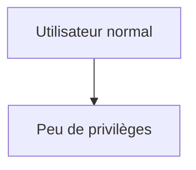

ou

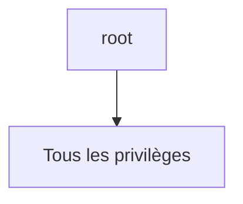

Il n'existait aucun juste milieu. Cette approche fonctionnait. Elle était pourtant extrêmement dangereuse. Pourquoi donner à une application **tous** les privilèges du système simplement parce qu'elle avait besoin... d'un seul ? Les capacités Linux répondent précisément à cette question.

## Théorie détaillée

### Le modèle historique

Pendant plusieurs décennies, Unix a utilisé un modèle extrêmement simple.

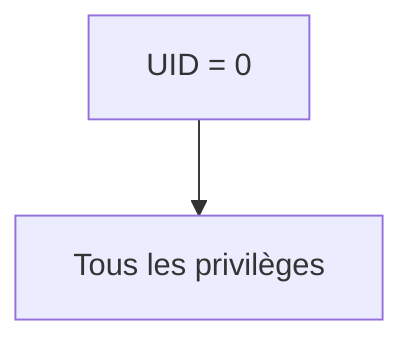

Tous les autres utilisateurs.

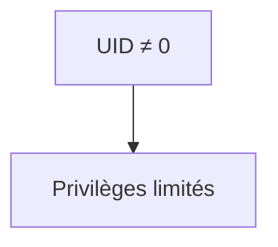

Cette approche avait le mérite d'être facile à comprendre. Elle présentait cependant une faiblesse majeure. Prenons un serveur Web. Pourquoi fonctionne-t-il parfois en tant que root ? Pas parce qu'il doit modifier le système. Pas parce qu'il doit gérer les utilisateurs. Pas parce qu'il doit charger un module noyau. Il lui fallait simplement ouvrir un port inférieur à : `1024` Pour cette unique opération, on lui accordait pourtant l'ensemble des privilèges administrateur.

## Un exemple concret

Prenons Sentinel. Supposons que demain, l'entreprise décide d'écouter sur : `443/TCP` Le port HTTPS classique. Sans capacités Linux, deux choix existent. Premier choix.

```text
Exécuter Sentinel

en root.
```

Deuxième choix. `Changer le port.` Le premier choix augmente fortement le risque. Le second n'est pas toujours possible. Les capacités Linux apportent une troisième solution.

## Découper root

L'idée est élégante. Au lieu de considérer que root possède un pouvoir indivisible, Linux découpe ses privilèges en plusieurs capacités indépendantes. Par exemple. `CAP_NET_BIND_SERVICE` Autorise l'ouverture d'un port privilégié. `CAP_SYS_TIME` Autorise la modification de l'heure système. `CAP_SYS_MODULE` Autorise le chargement de modules noyau. `CAP_SYS_ADMIN` Autorise de très nombreuses opérations d'administration. Chaque capacité représente une autorisation bien précise.

Le noyau peut alors accorder uniquement celles qui sont réellement nécessaires.

## Une nouvelle vision

Avant.

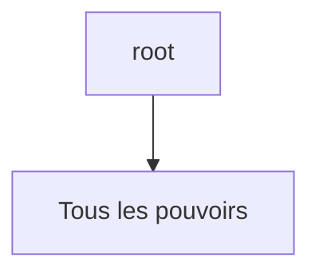

Aujourd'hui.

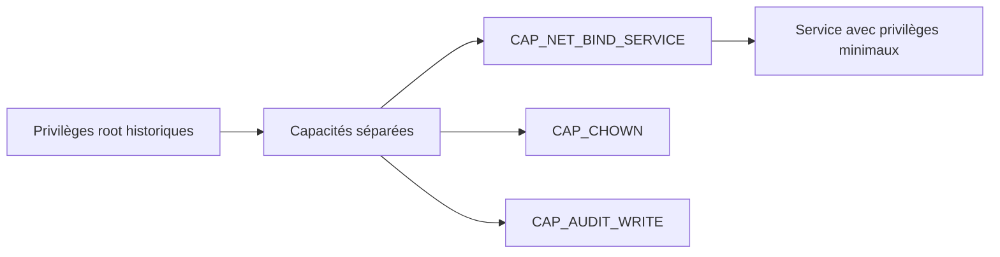

Nous passons donc d'un modèle binaire à un modèle beaucoup plus fin.

## Les cinq ensembles de capacités

Pour comprendre réellement leur fonctionnement, il faut savoir qu'un processus ne possède pas une simple liste de capacités. Le noyau Linux manipule plusieurs ensembles (*Capability Sets*). Les principaux sont :

- **Permitted**
- **Effective**
- **Inheritable**
- **Bounding**
- **Ambient**

Cette architecture peut sembler complexe. Pourtant, chaque ensemble répond à un problème précis. Nous allons les étudier progressivement.

## Le jeu "Permitted"

Le jeu **Permitted** contient les capacités que le thread peut rendre effectives ou transmettre selon les règles du noyau. Une capacité absente ne peut pas être simplement réactivée par le programme courant. Une transition `execve()` vers un fichier privilégié peut toutefois recalculer cet ensemble ; c'est le **Bounding Set**, combiné aux capacités du fichier et aux autres règles de sécurité, qui plafonne alors ce qui peut être acquis.

## Le jeu "Effective"

Posséder une capacité ne signifie pas nécessairement qu'elle est actuellement active. Le jeu **Effective** représente les capacités que le noyau consulte lors d'un contrôle de permission. Il est normalement un sous-ensemble de *Permitted* : *Permitted* autorise l'activation, *Effective* indique ce qui est actif maintenant.

## Le jeu "Inheritable"

Le jeu **Inheritable** participe au calcul des capacités après `execve()`. Il ne signifie pas qu'un enfant reçoit automatiquement toutes les capacités de son parent : les capacités déclarées sur le fichier exécuté et les règles de transformation du noyau interviennent également. Ce jeu est surtout rencontré dans des chaînes d'exécution avancées ; le connaître évite de confondre héritage de processus et héritage de privilèges.

## Le jeu "Ambient"

Le jeu **Ambient**, disponible depuis Linux 4.3, permet de conserver certaines capacités lors de l'exécution d'un programme non privilégié. Une capacité ne peut y entrer que si elle est déjà à la fois *Permitted* et *Inheritable*. À l'`execve()`, elle rejoint les jeux *Permitted* et *Effective* du nouveau programme ; l'exécution d'un binaire setuid, setgid ou doté de capacités de fichier efface ce jeu. La directive systemd `AmbientCapabilities=` automatise cette préparation pour un service.

## Le jeu "Bounding"

Voici probablement le plus important pour nous. Le **Bounding Set** limite les capacités qu'un thread pourra acquérir au cours d'un futur `execve()`. Une capacité retirée ne peut pas être réajoutée par ce thread et cette réduction est héritée par ses descendants. systemd utilise ce mécanisme avec :

```ini
CapabilityBoundingSet=
```

## Une analogie

Imaginons une entreprise. Le **Permitted Set** correspond aux badges que vous pouvez activer, le **Effective Set** au badge utilisé maintenant, l'**Inheritable Set** aux droits susceptibles de participer à une transition, l'**Ambient Set** au badge conservé lors d'un changement de programme non privilégié, et le **Bounding Set** aux bâtiments définitivement exclus de votre parcours. L'analogie simplifie les règles du noyau, mais permet de mémoriser le rôle distinct de chaque ensemble.

## Pourquoi est-ce important ?

Reprenons Sentinel. Supposons qu'il n'ait besoin que de : `CAP_NET_BIND_SERVICE` Nous pouvons retirer toutes les autres capacités. Même si un attaquant compromet le service, il ne pourra pas soudainement obtenir : `CAP_SYS_MODULE` ou `CAP_SYS_ADMIN` Le noyau refusera. Encore une fois, nous supprimons des possibilités d'attaque.

## Observer les capacités

Linux fournit plusieurs outils. Par exemple.

```bash
capsh --print
```

Cette commande affiche :

- les capacités effectives ;
- les capacités autorisées ;
- les capacités héritées.

Autre possibilité.

```bash
getpcaps PID
```

où `PID` représente le processus étudié. Ces commandes sont très utiles lors des audits.

## Les capacités des fichiers

Une capacité peut également être directement attachée à un fichier. Par exemple.

```bash
setcap cap_net_bind_service=+ep /opt/sentinel/bin/sentinel
```

Désormais, ce binaire peut ouvrir un port privilégié sans être exécuté en tant que root. Cette approche remplace certains anciens usages du bit **setuid**.

## Attention aux capacités sur les fichiers

Les capacités associées aux fichiers doivent cependant être utilisées avec prudence. Elles sont stockées dans un attribut étendu du fichier : une copie ou un remplacement peut les perdre, tandis qu'un binaire modifiable par une personne non autorisée transformerait la capacité en vecteur d'élévation. Les scripts interprétés et les systèmes de fichiers qui ne conservent pas ces attributs ajoutent encore des subtilités. Dans une infrastructure moderne, on préfère souvent laisser systemd gérer directement les capacités du service. Cette approche est :

- plus lisible ;
- plus centralisée ;
- plus facile à auditer.

Nous verrons précisément comment dans la suite du chapitre.

## Les capacités dans systemd

Jusqu'à présent, nous avons étudié les capacités du point de vue du noyau Linux. Voyons maintenant comment systemd les exploite. L'objectif est simple. Donner à Sentinel exactement les privilèges nécessaires. Pas un de plus.

## AmbientCapabilities

La directive la plus utilisée est :

```ini
AmbientCapabilities=
```

Elle permet de transmettre explicitement certaines capacités au processus lancé. Prenons Sentinel. Supposons qu'il doive écouter sur : `443/TCP` sans être exécuté en tant que root. L'unité devient alors :

```ini
[Service]

User=sentinel

AmbientCapabilities=CAP_NET_BIND_SERVICE
```

Le résultat est remarquable.

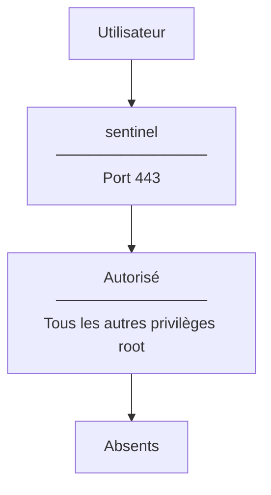

Nous obtenons exactement le comportement recherché.

## CapabilityBoundingSet

Nous avons déjà rencontré le **Bounding Set**. systemd permet de le modifier très simplement. Prenons un exemple.

```ini
CapabilityBoundingSet=CAP_NET_BIND_SERVICE
```

Que signifie cette ligne ? Toutes les autres capacités disparaissent définitivement. Même si Sentinel exécutait un autre programme, celui-ci ne pourrait jamais récupérer :

- `CAP_SYS_ADMIN`
- `CAP_SYS_MODULE`
- `CAP_SYS_PTRACE`
- etc.

Le noyau les considère comme définitivement interdites. Cette directive constitue donc une excellente mesure de réduction de la surface d'attaque.

## Combiner les deux directives

Dans la pratique, les deux directives sont souvent utilisées ensemble.

```ini
AmbientCapabilities=CAP_NET_BIND_SERVICE

CapabilityBoundingSet=CAP_NET_BIND_SERVICE
```

La première : accorde la capacité. La seconde : interdit toutes les autres. Le résultat est particulièrement lisible. L'unité décrit exactement les privilèges accordés au service.

## SecureBits

Les **SecureBits** constituent un mécanisme plus avancé. Ils permettent de contrôler certains comportements historiques liés aux privilèges root. Par exemple :

```ini
SecureBits=keep-caps
```

ou

```ini
SecureBits=no-setuid-fixup
```

Ces options répondent à des cas très particuliers. Dans la majorité des applications métiers, elles ne sont pas nécessaires. Il est néanmoins utile de connaître leur existence, notamment lors de l'analyse d'unités complexes.

## Les capacités et NoNewPrivileges

Nous avons étudié précédemment :

```ini
NoNewPrivileges=yes
```

Une question naturelle apparaît. Est-il compatible avec les capacités ? La réponse est oui. Les capacités accordées au lancement du service restent disponibles. En revanche, le processus ne pourra plus en acquérir de nouvelles ultérieurement. Cette combinaison est particulièrement intéressante.

```ini
AmbientCapabilities=CAP_NET_BIND_SERVICE

NoNewPrivileges=yes
```

Le service possède uniquement la capacité prévue, et ne pourra jamais en obtenir d'autres.

## Les capacités et SELinux

Il est important de rappeler que les capacités ne remplacent jamais SELinux. Prenons un exemple. Sentinel possède : `CAP_NET_BIND_SERVICE` Cela signifie uniquement :

> Tu peux ouvrir un port privilégié.

En revanche, si la politique SELinux interdit l'ouverture de ce port, l'opération échouera malgré tout. Autrement dit, les capacités répondent à la question : `Le noyau autorise-t-il cette opération ?` SELinux répond ensuite à une autre :

```text
Cette opération est-elle autorisée

dans ce contexte de sécurité ?
```

Les deux contrôles se complètent.

## Les capacités et Firewalld

Même logique. Sentinel peut parfaitement posséder : `CAP_NET_BIND_SERVICE` et écouter sur : `443/TCP` Si Firewalld bloque ce port, aucune connexion n'arrivera jusqu'à lui. Nous retrouvons encore une fois le principe de défense en profondeur. Chaque couche répond à une question différente.

## Les capacités et Podman

La même philosophie existe dans Podman. Un conteneur peut être lancé avec :

```bash
--cap-drop ALL
```

puis :

```bash
--cap-add NET_BIND_SERVICE
```

Le raisonnement est exactement identique. Nous retirons tout. Puis nous réintroduisons uniquement les privilèges indispensables. Vous remarquerez que les technologies étudiées dans ce manuel convergent toutes vers la même idée.

- Linux Capabilities
- systemd
- Podman
- Kubernetes

Toutes privilégient aujourd'hui une approche **minimaliste** des privilèges.

## Un exemple complet

Imaginons que Sentinel écoute sur HTTPS. Une unité raisonnablement sécurisée pourrait ressembler à ceci.

```ini
[Service]

User=sentinel

Group=sentinel

AmbientCapabilities=CAP_NET_BIND_SERVICE

CapabilityBoundingSet=CAP_NET_BIND_SERVICE

NoNewPrivileges=yes

ProtectSystem=strict

ProtectHome=yes

PrivateTmp=yes
```

Observons ce que cela signifie réellement.

| Action depuis Sentinel | Résultat | Mécanisme principal |
|---|---|---|
| ouvrir le port TCP 443 | autorisé | `CAP_NET_BIND_SERVICE` |
| charger un module noyau | refusé | `CapabilityBoundingSet` |
| accéder aux répertoires personnels | refusé | `ProtectHome` |
| acquérir un nouveau privilège | refusé | `NoNewPrivileges` |
| modifier les répertoires système | refusé | `ProtectSystem` |

Nous sommes très loin du modèle historique consistant à exécuter le service en root.

## Une évolution progressive de Sentinel

Reprenons le fil conducteur du manuel. Au début de la formation, Sentinel était lancé ainsi.

```bash
python sentinel.py
```

Puis il est devenu :

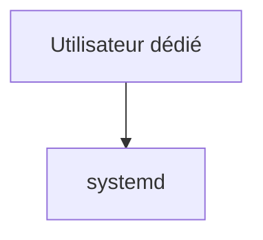

Puis : `Sandbox systemd` Nous ajoutons maintenant une nouvelle couche. `Capacités Linux` L'architecture devient progressivement :

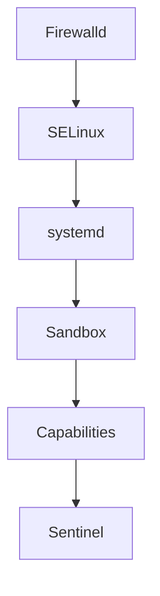

Chaque chapitre ajoute une barrière supplémentaire. Aucune n'est parfaite. Ensemble, elles construisent une défense cohérente.

## Les capacités ne remplacent jamais une bonne conception

Une erreur consiste à penser :

> Grâce aux capacités Linux, je peux désormais donner davantage de privilèges à mon application.

La bonne réflexion est exactement inverse. Les capacités permettent de **retirer** des privilèges qui auraient autrefois nécessité root. Elles servent donc avant tout à simplifier le principe du moindre privilège. Un ingénieur sécurité doit toujours se poser cette question :

> *Puis-je retirer encore une capacité sans casser mon application ?*

Si la réponse est oui, alors cette capacité ne devrait probablement pas être présente.

## Approfondissement

### Les capacités Linux sont un découpage de l'autorité, pas une réduction de sécurité

Lorsque les Linux Capabilities ont été introduites (Linux 2.2), beaucoup d'administrateurs ont cru qu'elles avaient été créées pour « remplacer root ». Ce n'est pas exact. Elles ont été créées pour **décomposer l'autorité de root**. Historiquement, root possédait plusieurs dizaines de privilèges totalement indépendants :

- modifier l'heure ;
- monter un système de fichiers ;
- ouvrir un port privilégié ;
- manipuler les interfaces réseau ;
- charger un module noyau ;
- lire n'importe quel fichier ;
- changer les UID ;
- effectuer un `ptrace()` sur un autre processus.

Ces opérations n'ont aucun rapport entre elles. Pourtant, pendant des décennies, elles étaient toutes accordées en bloc. Les capacités Linux cassent ce modèle. Aujourd'hui, lorsqu'un ingénieur lit :

```ini
AmbientCapabilities=CAP_NET_BIND_SERVICE
```

il ne voit pas seulement une directive systemd. Il lit en réalité :

> *"J'autorise explicitement Sentinel à ouvrir un port privilégié, mais je refuse de lui donner toute autre capacité d'administration."*

Cette nuance est fondamentale.

### Le Bounding Set est souvent plus important que les capacités accordées

Beaucoup d'administrateurs regardent uniquement :

```ini
AmbientCapabilities=
```

En réalité, lors d'un audit sécurité, un expert commence presque toujours par examiner :

```ini
CapabilityBoundingSet=
```

Pourquoi ? Parce qu'il définit le plafond absolu. Prenons deux unités.

#### Première unité

```ini
AmbientCapabilities=CAP_NET_BIND_SERVICE
```

Sans Bounding Set. Un développeur modifie plus tard l'application. Elle lance un autre programme. Ce nouveau programme peut éventuellement récupérer d'autres capacités encore disponibles. Deuxième unité.

```ini
AmbientCapabilities=CAP_NET_BIND_SERVICE

CapabilityBoundingSet=CAP_NET_BIND_SERVICE
```

Le noyau sait désormais qu'aucune autre capacité n'existera. Même après plusieurs `execve()` successifs. La différence paraît subtile. Elle est pourtant énorme lors d'une compromission.

### Une capacité inutile est une vulnérabilité potentielle

Imaginons une unité contenant :

```ini
AmbientCapabilities=

CAP_NET_BIND_SERVICE

CAP_SYS_TIME

CAP_SYS_ADMIN

CAP_SYS_BOOT
```

Supposons que Sentinel n'utilise réellement que : `CAP_NET_BIND_SERVICE` Les trois autres capacités deviennent immédiatement suspectes. Pourquoi sont-elles présentes ? Qui les a demandées ? Sont-elles documentées ? Ont-elles été testées ? Dans une infrastructure mature, chaque capacité doit posséder une justification technique clairement identifiée. L'absence de justification est souvent considérée comme une anomalie de sécurité.

## Concevoir la politique

Un architecte ne réfléchit jamais en termes de privilèges disponibles. Il raisonne en termes de **fonctionnalités minimales nécessaires**. Prenons Sentinel. Ses besoins réels sont :

- écouter sur HTTPS ;
- lire sa configuration ;
- écrire ses journaux ;
- communiquer avec FreeIPA ;
- communiquer avec ses agents.

Rien de plus. L'architecte construit alors une unité qui traduit exactement ces besoins. Tout le reste disparaît.

### Les privilèges doivent être documentés

Dans certaines entreprises, chaque capacité accordée possède une justification. Exemple.

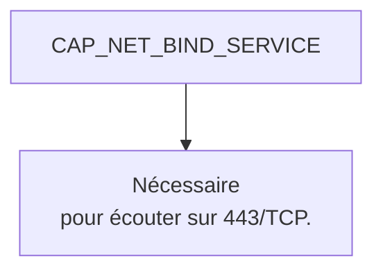

Quelques mois plus tard, Sentinel migre vers : `8443/TCP` La justification disparaît. La capacité est retirée. L'unité évolue naturellement avec l'application.

### Concevoir pour le futur

Une bonne architecture anticipe également les évolutions. Aujourd'hui, Sentinel écoute peut-être directement sur : `443` Demain, un reverse proxy Nginx ou HAProxy prendra cette responsabilité. Sentinel écoutera uniquement sur : `8443` L'architecte pourra alors supprimer complètement : `CAP_NET_BIND_SERVICE` La politique de sécurité s'améliore automatiquement.

## Point de vue offensif

Après avoir obtenu une exécution de code, l'attaquant cherche immédiatement à répondre à une question.

> **Quels privilèges possède réellement ce processus ?**

Il va souvent commencer par :

```bash
capsh --print
```

ou

```bash
getpcaps $$
```

Pourquoi ? Parce que ces informations lui indiquent immédiatement :

- quelles attaques sont possibles ;
- lesquelles sont impossibles.

Un processus possédant : `CAP_SYS_ADMIN` devient immédiatement beaucoup plus intéressant. À l'inverse, un processus limité à : `CAP_NET_BIND_SERVICE` offre très peu d'opportunités supplémentaires.

### L'escalade de privilèges

Une grande partie des attaques modernes repose sur une idée simple. Obtenir progressivement davantage de privilèges. Les capacités Linux compliquent fortement cette stratégie. Pourquoi ? Parce qu'elles rendent les privilèges explicitement visibles. L'attaquant découvre rapidement que :

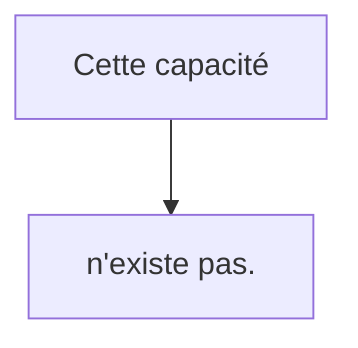

Le noyau ne lui permettra jamais de l'obtenir.

## En entreprise

Dans une infrastructure professionnelle, les capacités sont généralement définies dans des modèles d'unités. Exemple. `SERVICE WEB` ↓ CAP_NET_BIND_SERVICE

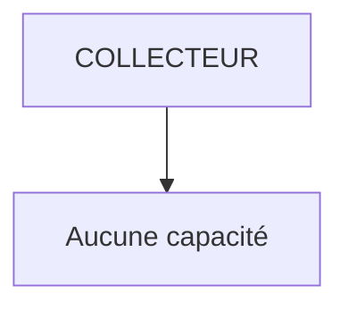

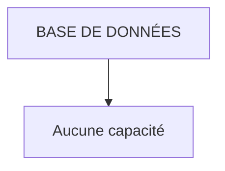

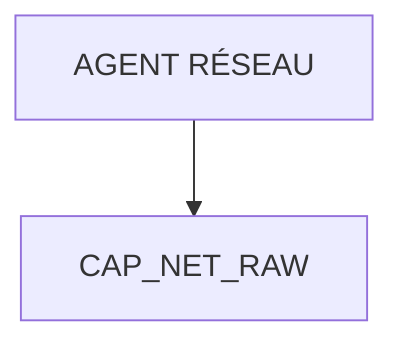

Les développeurs n'ajoutent pratiquement jamais eux-mêmes des capacités. Ils utilisent un profil validé par l'équipe sécurité. Chaque nouvelle capacité fait l'objet :

- d'une justification ;
- d'une revue ;
- d'un audit.

## Culture technique

Il existe aujourd'hui une quarantaine de capacités Linux. Certaines sont très spécialisées. Par exemple : `CAP_BPF` permet certaines opérations liées au sous-système eBPF. `CAP_CHECKPOINT_RESTORE` a été introduite pour faciliter les mécanismes de checkpoint/restore des processus. À l'inverse, certaines capacités historiques, comme : `CAP_SYS_ADMIN` sont devenues tellement vastes qu'elles sont parfois surnommées :

> **The new root.**

Lorsqu'une unité contient : `CAP_SYS_ADMIN` un auditeur sécurité considère généralement cela comme un signal d'alerte. Cette capacité donne accès à un très grand nombre d'opérations d'administration. Il convient de l'éviter autant que possible.

## Piège classique

### Conserver CAP_SYS_ADMIN "au cas où"

Il arrive qu'un développeur ajoute :

```ini
AmbientCapabilities=CAP_SYS_ADMIN
```

simplement parce qu'il ne sait pas précisément quelle capacité est nécessaire. Cette pratique est extrêmement dangereuse. Elle revient pratiquement à recréer le modèle historique de root. La bonne démarche consiste toujours à :

- identifier précisément le besoin ;
- rechercher la capacité correspondante ;
- supprimer toutes les autres.

Une capacité "temporaire" oubliée en production peut devenir plusieurs années plus tard un véritable problème de sécurité.

## TP 1 — Observer et accorder une capacité minimale

### Objectif

Comprendre concrètement l'effet des capacités Linux sur un service systemd et apprendre à réduire progressivement les privilèges de Sentinel.

### Étape 1 — Observer les capacités du système

Afficher les capacités du shell courant.

```bash
capsh --print
```

Identifier notamment :

- Effective ;
- Permitted ;
- Bounding.

Comparer ensuite avec :

```bash
getpcaps $$
```

Comprendre pourquoi les informations ne sont pas exactement présentées de la même manière.

### Étape 2 — Faire écouter Sentinel sur 443

Configurer Sentinel pour écouter sur : `443/TCP` Créer ensuite une unité contenant :

```ini
AmbientCapabilities=CAP_NET_BIND_SERVICE
```

Vérifier que le service démarre correctement sous l'utilisateur : `sentinel` sans utiliser root.

## TP 2 — Vérifier le plafond et les interactions

### Étape 3 — Restreindre le Bounding Set

Ajouter :

```ini
CapabilityBoundingSet=CAP_NET_BIND_SERVICE
```

Redémarrer le service. Vérifier qu'il fonctionne toujours. Observer ensuite les capacités du processus avec :

```bash
getpcaps <PID>
```

### Étape 4 — Comparer avec un lancement manuel

Lancer Sentinel directement. Puis :

```bash
getpcaps <PID>
```

Comparer les deux approches :

- lancement manuel ;
- lancement via systemd.

Identifier les différences de privilèges.

### Étape 5 — Vérifier la cohérence avec le sandboxing

Conserver :

- `NoNewPrivileges=yes`
- `ProtectSystem=strict`
- `ProtectHome=yes`

Ajouter les capacités étudiées. Vérifier que toutes ces protections fonctionnent simultanément. L'objectif est de comprendre qu'elles ne se remplacent pas. Elles se complètent.

## Mission d'ingénieur

Votre entreprise impose désormais une nouvelle règle :

> **Aucun service ne doit être exécuté avec plus de capacités que nécessaire.**

Vous devez réaliser l'audit de dix services existants. Pour chacun, vous devrez produire :

- les capacités actuellement utilisées ;
- celles réellement nécessaires ;
- celles pouvant être supprimées ;
- les impacts fonctionnels éventuels ;
- les modifications à apporter aux unités systemd.

Votre rapport devra être suffisamment précis pour permettre une mise en production sans interruption de service.

## Impact sur Sentinel

Sentinel fonctionne désormais avec une politique de privilèges extrêmement fine. Il ne possède plus :

- les privilèges de root ;
- des capacités inutiles ;
- des possibilités implicites d'élévation.

Il reçoit uniquement les autorisations strictement nécessaires à sa mission. Cette évolution complète naturellement les protections mises en place dans les chapitres précédents :

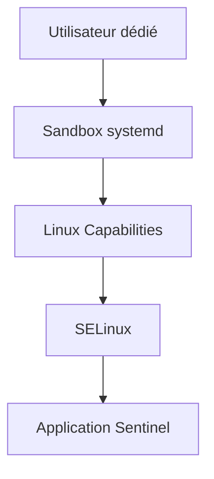

Chaque couche réduit encore un peu plus les conséquences d'une compromission.

## Synthèse

- Les capacités Linux décomposent les privilèges historiquement détenus par root.
- `AmbientCapabilities` permet d'accorder explicitement une capacité à un service.
- `CapabilityBoundingSet` définit le plafond absolu des capacités disponibles.
- Les capacités ne remplacent ni SELinux, ni Firewalld, ni le sandboxing : elles les complètent.
- Chaque capacité accordée doit être justifiée, documentée et régulièrement réévaluée.
- `CAP_SYS_ADMIN` doit être considérée comme une capacité exceptionnelle et évitée autant que possible.
- Le principe directeur reste toujours le même : **retirer tout privilège dont l'application n'a pas besoin.**

## Infographie de révision

```text
┌─────────────────────────────────────────────────────────────────────────────────────────────┐
│                    CHAPITRE 5.5 — LINUX CAPABILITIES                                        │
├─────────────────────────────────────────────────────────────────────────────────────────────┤
│                                                                                             │
│                  AVANT                               AUJOURD'HUI                             │
│                                                                                             │
│                     root                          CAP_NET_BIND_SERVICE                       │
│                Tous les pouvoirs                         uniquement                          │
│                                                                                             │
├─────────────────────────────────────────────────────────────────────────────────────────────┤
│                                                                                             │
│                   CAPACITÉS LES PLUS COURANTES                                               │
│                                                                                             │
│ CAP_NET_BIND_SERVICE  → Écouter sur un port < 1024                                          │
│ CAP_NET_RAW           → Sockets bruts                                                       │
│ CAP_SYS_TIME          → Modifier l'heure                                                    │
│ CAP_SYS_MODULE        → Charger des modules noyau                                           │
│ CAP_SYS_ADMIN         → Très nombreux privilèges (à éviter)                                 │
│                                                                                             │
├─────────────────────────────────────────────────────────────────────────────────────────────┤
│                                                                                             │
│               SYSTEMD                                                                        │
│                                                                                             │
│ AmbientCapabilities      → Capacités accordées                                               │
│ CapabilityBoundingSet    → Plafond absolu                                                    │
│ NoNewPrivileges          → Aucun privilège supplémentaire                                   │
│                                                                                             │
├─────────────────────────────────────────────────────────────────────────────────────────────┤
│                                                                                             │
│                 SENTINEL                                                                     │
│                                                                                             │
│ Utilisateur : sentinel                                                                       │
│ Capability : CAP_NET_BIND_SERVICE uniquement                                                 │
│ Sandbox : actif                                                                              │
│ SELinux : actif                                                                              │
│ Firewalld : actif                                                                            │
│                                                                                             │
├─────────────────────────────────────────────────────────────────────────────────────────────┤
│                                                                                             │
│ PHRASE À RETENIR                                                                            │
│                                                                                             │
│ « Les capacités Linux ne donnent pas plus de pouvoir à une application.                     │
│  Elles permettent enfin de ne lui donner que celui dont elle a réellement besoin. »         │
└─────────────────────────────────────────────────────────────────────────────────────────────┘
```

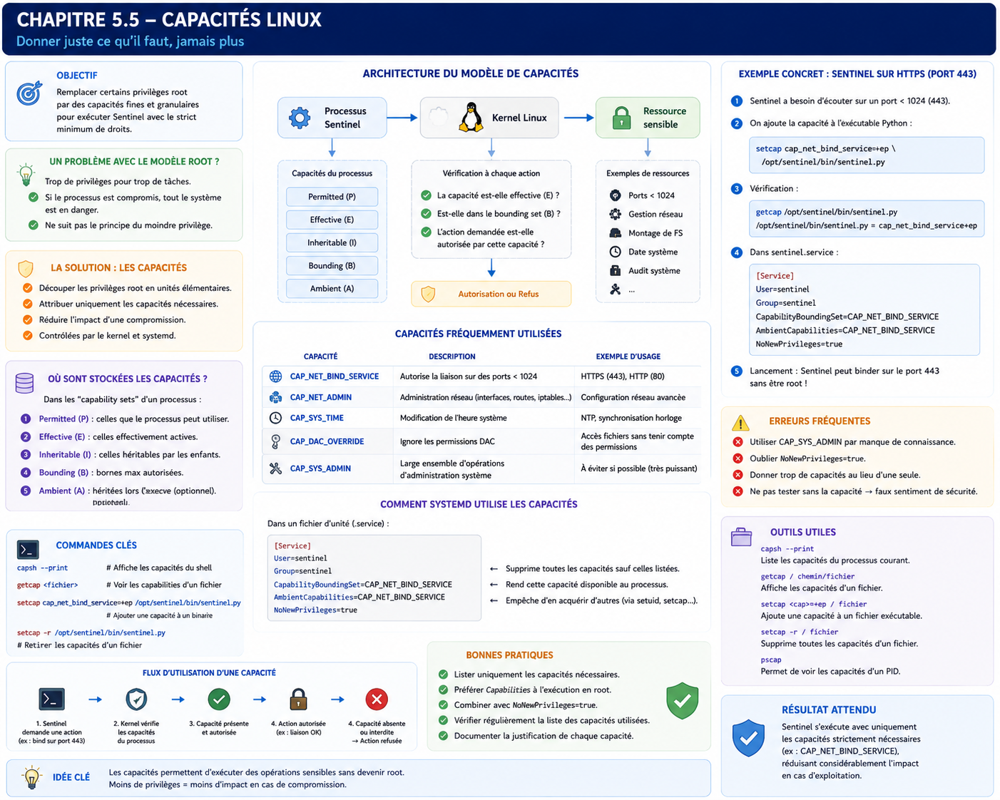

## Pour aller plus loin

Sentinel possède désormais le minimum de privilèges nécessaire. Il faut maintenant rendre son activité observable sans lui confier la rotation et le stockage de ses propres fichiers de logs.

← [5.4 — Sandboxing `systemd`](5.4-sandboxing-systemd.md) · [5.6 — Journalisation avec `journald`](5.6-journalisation-journald.md) →
