# Chapitre 5.7 — Supervision et redémarrage automatique

> **Campagne 5 — systemd et services**

> *« Un bon service n'est pas celui qui ne tombe jamais. C'est celui qui revient automatiquement à un état opérationnel lorsque quelque chose tourne mal. »*

## Vous êtes ici

```text
Partie I — Construire un socle sécurisé

Campagne 5 — systemd et les services

      5.1 Comprendre systemd
      5.2 Les unités (.service, .socket, .target…)
      5.3 Créer le service Sentinel
      5.4 Sandboxing systemd
      5.5 Capacités Linux
      5.6 Journalisation avec journald
    ► 5.7 Supervision et redémarrage automatique
      5.8 Mission : rendre Sentinel résilient
```

## Objectifs pédagogiques

À la fin de ce chapitre, vous serez capable de :

- comprendre comment systemd supervise réellement un service ;
- distinguer une application vivante d'une application réellement opérationnelle ;
- configurer intelligemment les politiques de redémarrage ;
- utiliser les mécanismes de watchdog ;
- préparer Sentinel à fonctionner plusieurs mois sans intervention humaine.

## Pourquoi ce chapitre existe

Une application qui démarre correctement n'est pas forcément une application fiable. Prenons un exemple. Sentinel démarre parfaitement. Pendant plusieurs semaines tout fonctionne. Puis un matin... un thread reste bloqué. Le processus est toujours présent. Le PID existe. Le CPU est presque à zéro. Aucune erreur n'apparaît. Pourtant, plus aucun agent ne reçoit de réponse. systemd considère pourtant que le service est : `Active (running)` Le problème est évident. Le processus est vivant. Le service est mort.

Cette différence est probablement l'une des notions les plus importantes à comprendre lorsqu'on conçoit une infrastructure résiliente.

## Vue d'ensemble

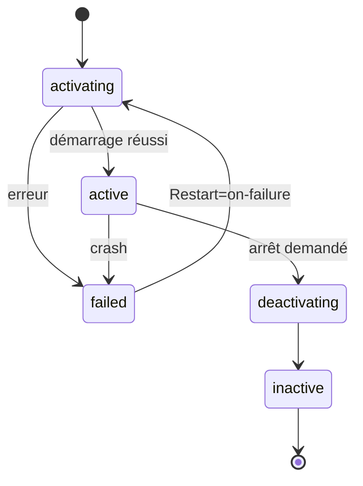

## Théorie détaillée

### Deux visions très différentes

Beaucoup d'outils anciens se contentaient de vérifier ceci :

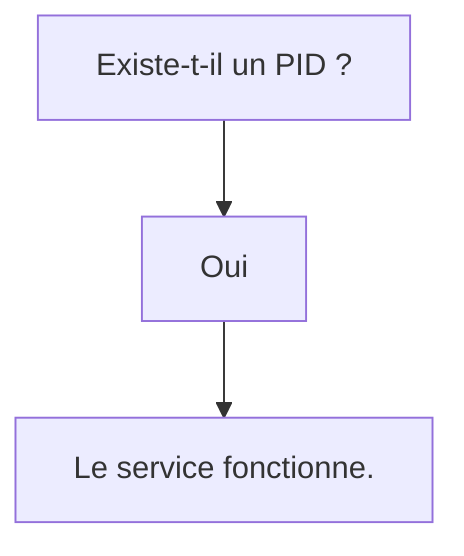

Cette hypothèse est fausse. Un processus peut exister tout en étant incapable de rendre le moindre service. Par exemple :

- boucle infinie ;
- deadlock ;
- attente réseau permanente ;
- saturation mémoire ;
- thread principal bloqué.

Dans tous ces cas, le PID est toujours présent. L'application est pourtant inutilisable.

## Les états vus par systemd

systemd ne se contente pas de lancer un programme. Il suit en permanence son évolution. Schématiquement.

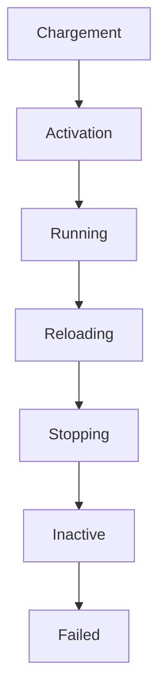

Chaque changement d'état est enregistré. Chaque transition peut déclencher une action. Cette approche constitue la base de la supervision moderne.

## Active n'est pas Healthy

Voici une confusion extrêmement fréquente. Prenons cette sortie.

```text
Active:

active (running)
```

Que signifie-t-elle exactement ? Uniquement ceci. Le processus principal existe toujours. Rien de plus. Cela ne garantit absolument pas que :

- Sentinel accepte des connexions ;
- les threads répondent ;
- la base de données soit accessible ;
- FreeIPA soit joignable ;
- les certificats soient valides.

Un service peut être :

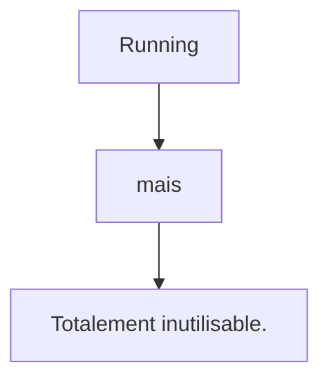

Cette distinction explique pourquoi de nombreuses infrastructures ajoutent ensuite :

- des sondes applicatives ;
- des probes HTTP ;
- des watchdogs.

## La première supervision : Restart

Nous avons déjà rencontré :

```ini
Restart=on-failure
```

Voyons maintenant son fonctionnement interne. Supposons le scénario suivant.

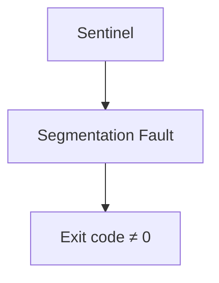

systemd détecte immédiatement : `Échec` Puis applique la politique définie.

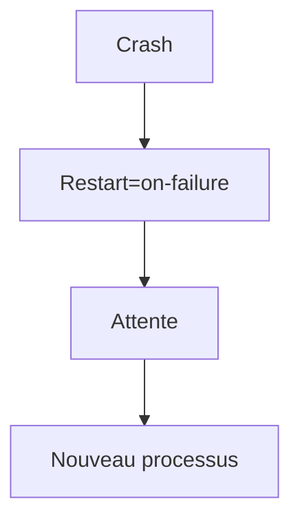

Le temps d'indisponibilité est réduit à quelques secondes.

## Les différentes politiques

systemd propose plusieurs comportements.

### no

```ini
Restart=no
```

Jamais de redémarrage. Approprié pour certains traitements ponctuels. Très rarement pour un serveur.

### always

```ini
Restart=always
```

Le service est relancé après une sortie normale du programme, une erreur, un signal ou un délai dépassé. Une commande explicite `systemctl stop` ne provoque toutefois pas de redémarrage. La politique reste souvent trop agressive, car une application conçue pour terminer proprement peut être relancée sans fin.

### on-success

```ini
Restart=on-success
```

Le redémarrage intervient uniquement après une terminaison considérée comme normale. Cas relativement rare.

### on-abnormal

Uniquement après :

- un signal ;
- un crash ;
- un timeout.

### on-failure

Le choix retenu dans ce manuel. Il couvre :

- les codes d'erreur ;
- les plantages ;
- les exceptions fatales ;
- les signaux inattendus.

Tout en laissant un arrêt volontaire... être réellement un arrêt.

### on-watchdog

Nous y reviendrons plus loin. Le redémarrage intervient uniquement lorsque le watchdog estime que le service ne répond plus.

## RestartSec

Redémarrer immédiatement n'est pas toujours souhaitable. Prenons une erreur de configuration.

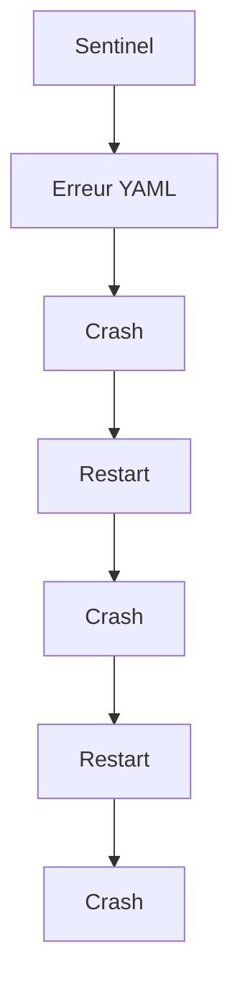

En quelques secondes, des centaines de redémarrages peuvent se produire. Pour éviter ce comportement, on définit généralement :

```ini
RestartSec=5
```

systemd attendra : `5 secondes` avant chaque nouvelle tentative. Ce délai permet :

- aux administrateurs d'intervenir ;
- aux journaux de rester lisibles ;
- d'éviter une consommation CPU inutile.

## StartLimitIntervalSec

Le délai seul ne suffit pas. Imaginons maintenant une erreur permanente. Pendant plusieurs heures, Sentinel continue :

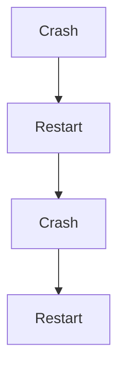

Cette boucle peut produire :

- plusieurs milliers d'événements ;
- des gigaoctets de journaux ;
- une forte charge CPU.

systemd introduit donc un mécanisme supplémentaire. Les directives suivantes appartiennent à la section `[Unit]`, et non à `[Service]`.

```ini
StartLimitIntervalSec=
```

Il définit une fenêtre temporelle. Par exemple :

```ini
StartLimitIntervalSec=300
```

Le système observe les cinq dernières minutes.

## StartLimitBurst

Cette directive complète la précédente.

```ini
StartLimitBurst=5
```

Signification.

```text
Maximum :

5 démarrages

pendant

300 secondes.
```

Au-delà, systemd abandonne. Le service passe dans l'état : `failed` Cette décision est extrêmement importante. Elle évite qu'une erreur permanente ne transforme le serveur en machine à redémarrer des processus.

## Une politique réaliste

Pour Sentinel, une politique raisonnable pourrait être :

```ini
[Unit]
StartLimitIntervalSec=300
StartLimitBurst=5

[Service]
Restart=on-failure

RestartSec=5
```

Visualisons son comportement.

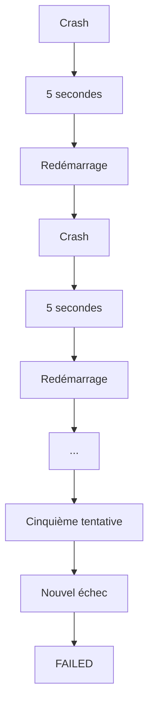

À partir de ce moment, une intervention humaine ou une automatisation explicitement autorisée devient nécessaire. Après correction de la cause, `systemctl reset-failed sentinel` remet notamment à zéro l'état d'échec et le compteur avant un nouveau démarrage. C'est généralement le comportement attendu pour une application critique.

## Le Watchdog systemd

Nous avons jusqu'à présent traité un problème relativement simple. Le processus s'arrête. systemd le détecte immédiatement. Il peut alors appliquer :

```ini
Restart=on-failure
```

Mais revenons au scénario évoqué au début du chapitre. Sentinel ne plante pas. Il ne consomme presque plus de CPU. Le PID existe toujours. Les threads sont bloqués. Plus aucun agent ne reçoit de réponse. Pour systemd, le service est toujours : `active (running)` Nous avons donc besoin d'un autre mécanisme. C'est précisément le rôle du **Watchdog**.

## Une idée très simple

Le Watchdog repose sur un principe extrêmement ancien. Le service doit régulièrement dire :

> **Je suis toujours vivant.**

Si ce message cesse d'arriver, systemd considère que le service est probablement bloqué. Schématiquement.

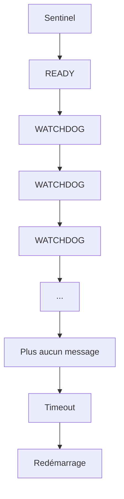

Le watchdog ne cherche donc pas à savoir si le processus existe. Il vérifie que l'application est toujours capable de dialoguer avec systemd.

## WatchdogSec

Le mécanisme s'active très simplement.

```ini
WatchdogSec=30s
```

Cette directive signifie :

Cette directive fixe le délai maximal entre deux notifications. L'application lit normalement `$WATCHDOG_USEC` ou utilise `sd_watchdog_enabled()` et envoie `WATCHDOG=1` environ deux fois plus souvent que ce délai. Avec `30s`, une notification toutes les quinze secondes laisse une marge raisonnable. À défaut de notification avant l'échéance, systemd considère le service comme défaillant.

## Le rôle de `Type=notify`

Nous avons découvert dans le chapitre précédent :

```ini
Type=notify
```

Nous avions expliqué que ce mode permettait à l'application d'annoncer `READY=1`. Le watchdog utilise le même canal de communication : l'application envoie périodiquement `WATCHDOG=1` et systemd remet son chronomètre à zéro. `Type=notify` sert à faire piloter l'état de préparation par `READY=1` ; les notifications de watchdog reposent sur `WatchdogSec=` et ne doivent pas être confondues avec cette sémantique de démarrage.

## Le protocole sd_notify()

Cette communication repose sur une petite bibliothèque. `libsystemd` Elle expose notamment la fonction :

```c
sd_notify()
```

Le principe est extrêmement simple. Au démarrage. `READY=1` Puis régulièrement. `WATCHDOG=1` systemd n'a pas besoin de connaître l'état interne de Sentinel. Il lui suffit de recevoir régulièrement cette confirmation.

## Exemple avec Sentinel

Imaginons la séquence suivante.

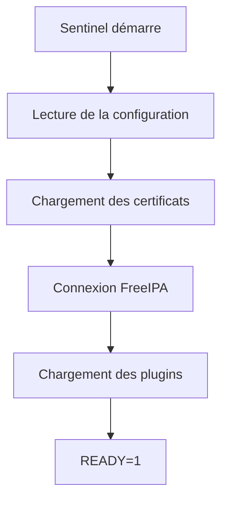

Le service est maintenant considéré comme opérationnel. Quelques secondes plus tard. `WATCHDOG=1` Puis : `WATCHDOG=1` Puis : `WATCHDOG=1` Tout fonctionne normalement.

## Que se passe-t-il en cas de blocage ?

Supposons maintenant qu'un deadlock survienne. Le thread principal ne répond plus. Plus aucun : `WATCHDOG=1` n'est envoyé. Le chronomètre continue.

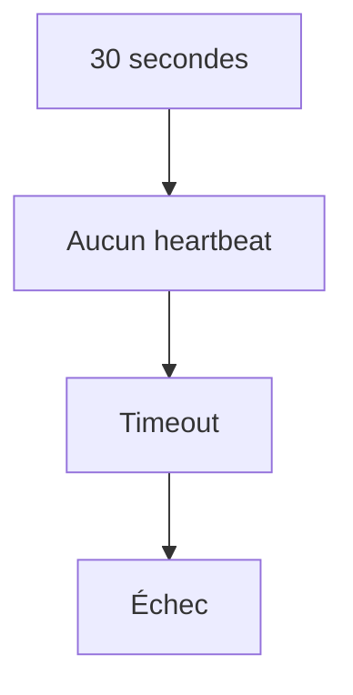

systemd applique alors immédiatement la politique définie. Par exemple :

```ini
Restart=on-failure
```

Le service est recréé.

## Heartbeat

Le message : `WATCHDOG=1` est souvent appelé : `Heartbeat` ou : `Battement de cœur` Cette image est particulièrement pertinente. Tant que le cœur bat, le service est vivant. Lorsque les battements cessent, systemd intervient.

## Tous les services ont-ils besoin d'un Watchdog ?

Non. Prenons quelques exemples.

### SSH

Le démon SSH ne réalise pratiquement aucun traitement complexe. Il attend simplement des connexions. Le watchdog apporte relativement peu.

### Firewalld

Même remarque. Le démon reste principalement en attente d'événements.

### Sentinel

Situation très différente. Sentinel :

- communique avec FreeIPA ;
- maintient des connexions TLS ;
- traite des événements ;
- charge des plugins ;
- dialogue avec plusieurs agents ;
- utilise plusieurs threads.

La probabilité qu'un blocage logique survienne est beaucoup plus importante. Le Watchdog devient alors particulièrement intéressant.

## Les faux positifs

Le watchdog doit être configuré avec prudence. Prenons :

```ini
WatchdogSec=2s
```

Supposons maintenant qu'une opération parfaitement normale prenne : `3 secondes` Le résultat.

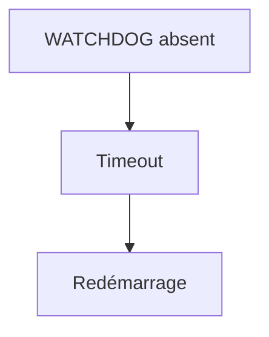

Le service est redémarré... alors qu'il fonctionnait correctement. On parle alors de : `Faux positif.` Le délai choisi doit toujours être cohérent avec le comportement réel de l'application.

## Le watchdog n'est pas un monitoring

Une confusion apparaît souvent. Le watchdog répond à la question : `Le service est-il encore capable de répondre ?` Le monitoring répond à d'autres questions. Par exemple.

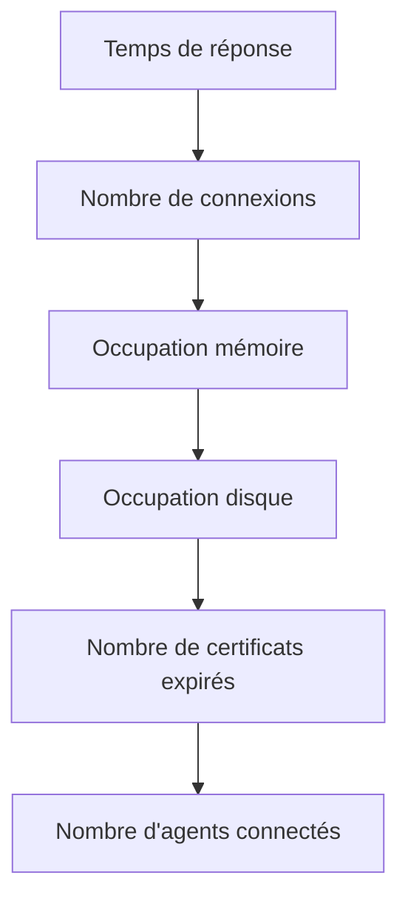

Ces informations seront étudiées dans la campagne consacrée à la supervision. Le watchdog constitue uniquement un premier niveau de protection.

## Les limites de ressources

La supervision ne consiste pas uniquement à détecter un crash. Elle consiste également à empêcher un service de monopoliser la machine. systemd permet donc d'imposer plusieurs limites.

### MemoryMax

Prenons :

```ini
MemoryMax=1G
```

`MemoryMax=` constitue une limite dure du cgroup. Si la consommation ne peut pas être maintenue sous `1G`, le mécanisme OOM intervient dans l'unité. Sur une version récente de systemd utilisant la hiérarchie cgroup v2, `MemoryHigh=` est souvent utilisé comme seuil principal pour exercer une pression avant la limite, et `MemoryMax=` comme dernier rempart. Les versions Enterprise Linux plus anciennes peuvent proposer des directives et une hiérarchie différentes : `systemd --version` et `systemctl show sentinel` permettent de vérifier le support effectif. Les valeurs doivent dans tous les cas être testées avec la charge réelle.

### TasksMax

Autre exemple.

```ini
TasksMax=200
```

Le service ne pourra pas créer plus de :

```text
200 threads

ou

processus.
```

Une erreur de programmation ne pourra donc pas produire des milliers de threads.

### CPUQuota

Autre limitation très utile.

```ini
CPUQuota=80%
```

La valeur correspond à 80 % du temps d'un **cœur logique**, et non à 80 % de toute une machine multicœur. `200%` autoriserait par exemple l'équivalent de deux cœurs. Même en cas de boucle infinie, le quota réserve ainsi du temps processeur aux autres services.

### LimitNOFILE

Les serveurs réseau ouvrent souvent un grand nombre de descripteurs de fichiers. Par exemple :

- sockets ;
- fichiers ;
- pipes.

systemd permet de fixer une limite.

```ini
LimitNOFILE=65535
```

Cette directive relève ici la limite de descripteurs du processus. Elle évite une valeur trop faible, mais une valeur élevée ne constitue pas à elle seule une protection contre la consommation excessive : la charge, la mémoire et les limites applicatives doivent également être surveillées.

## Une unité orientée production

Notre unité Sentinel ressemble maintenant davantage à ce que l'on rencontre dans une infrastructure professionnelle.

```ini
[Unit]
StartLimitIntervalSec=300
StartLimitBurst=5

[Service]

User=sentinel
Group=sentinel

Type=notify

ExecStart=/opt/sentinel/bin/sentinel

Restart=on-failure
RestartSec=5

WatchdogSec=30s

MemoryMax=1G

TasksMax=200

CPUQuota=80%

LimitNOFILE=65535
```

Cette unité ne se contente plus de lancer une application. Elle décrit désormais :

- son cycle de vie ;
- sa politique de reprise ;
- ses limites de consommation ;
- sa surveillance ;
- sa résilience.

Nous passons progressivement d'un simple **programme** à un véritable **service d'infrastructure**.

## Approfondissement

### Un superviseur ne remplace pas une application robuste

Lorsque l'on découvre systemd, une idée revient souvent.

> *"Ce n'est pas grave si l'application plante, systemd la redémarrera."*

C'est une erreur. Le rôle de systemd n'est pas de masquer les défauts d'une application. Son rôle est de garantir que **l'infrastructure réagit correctement lorsqu'un défaut survient**. Prenons deux situations.

#### Situation n°1

Sentinel plante une fois tous les six mois à cause d'un bug extrêmement rare.

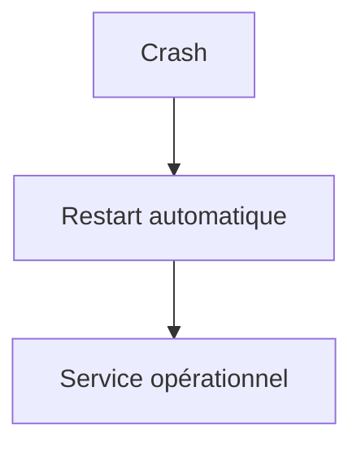

Le mécanisme de redémarrage remplit parfaitement son rôle. L'incident reste pratiquement invisible pour les utilisateurs.

#### Situation n°2

Sentinel plante toutes les trois minutes.

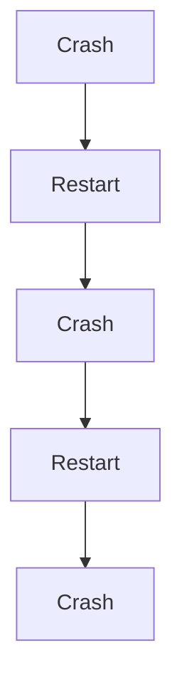

systemd continue de fonctionner correctement. Pourtant, le problème est désormais **l'application elle-même**. La supervision ne doit jamais servir à cacher une mauvaise qualité logicielle. Elle permet uniquement de rendre l'infrastructure plus résiliente.

### La disponibilité n'est pas la résilience

Ces deux notions sont souvent confondues. Pourtant, elles désignent des réalités très différentes. La disponibilité répond à la question :

> **Le service fonctionne-t-il maintenant ?**

La résilience répond à une autre :

> **Que se passe-t-il lorsqu'il ne fonctionne plus ?**

Une application peut présenter une excellente disponibilité... tout en étant incapable de se remettre d'un incident. À l'inverse, une application imparfaite, mais capable de retrouver automatiquement un état opérationnel, sera souvent beaucoup plus adaptée à une exploitation en production.

### Une bonne politique de redémarrage protège aussi les autres services

Lorsqu'un processus entre dans une boucle de crash, les conséquences dépassent largement cette seule application. Chaque redémarrage consomme :

- du CPU ;
- de la mémoire ;
- des entrées de journal ;
- parfois des connexions réseau ;
- parfois des ressources disque.

Sans limitation, un seul service défectueux peut dégrader l'ensemble du serveur. Les directives :

```ini
RestartSec=

StartLimitIntervalSec=

StartLimitBurst=
```

protègent donc autant le système que l'application.

## Concevoir la politique

Un architecte considère toujours qu'une panne est inévitable. La véritable question devient alors :

> **Comment voulons-nous que le système réagisse ?**

Pour chaque scénario, une réponse doit exister.

| Scénario | Mécanisme local | Limite à connaître |
|---|---|---|
| crash du processus | `Restart=on-failure` | ne corrige pas une erreur permanente |
| blocage logique | `WatchdogSec=` | exige un heartbeat représentatif de la santé |
| fuite mémoire | `MemoryHigh=` puis `MemoryMax=` | nécessite un seuil mesuré |
| explosion de threads ou processus | `TasksMax=` | compte les tâches du cgroup |
| consommation CPU anormale | `CPUQuota=` | limite la consommation, sans diagnostiquer la cause |

L'architecte ne cherche pas uniquement à empêcher les erreurs. Il prépare également les mécanismes qui permettront au système de survivre lorsqu'elles apparaîtront.

### Concevoir un service auto-réparable

Le meilleur service n'est pas celui qui nécessite une intervention humaine. C'est celui qui retrouve seul un état stable. Visualisons la différence.

#### Service classique

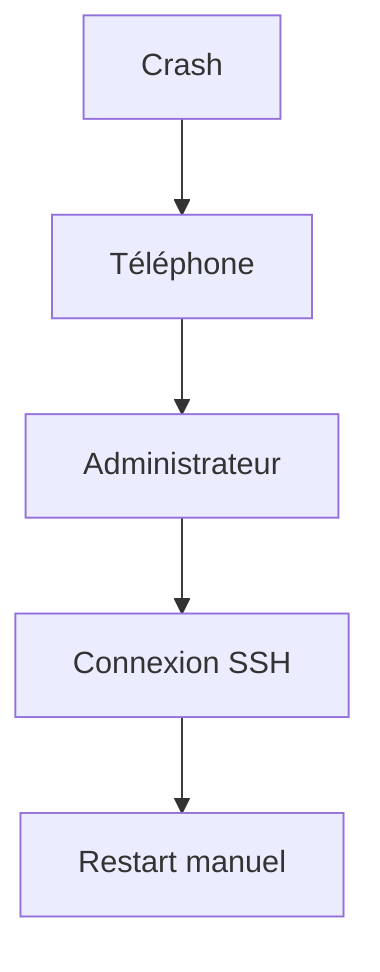

#### Service résilient

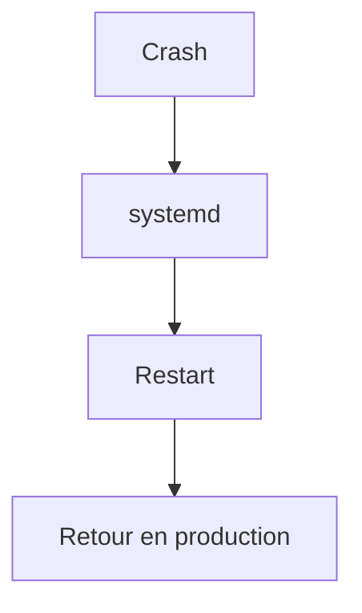

Chaque intervention humaine supprimée réduit :

- le temps d'indisponibilité ;
- les coûts d'exploitation ;
- le risque d'erreur.

## Point de vue offensif

Un attaquant cherche souvent à empêcher un service de fonctionner. Plusieurs stratégies sont possibles. Par exemple :

- provoquer un crash ;
- déclencher une fuite mémoire ;
- saturer les threads ;
- bloquer une boucle d'événements ;
- épuiser les descripteurs de fichiers.

Toutes ces attaques poursuivent le même objectif. Faire disparaître un service critique.

### Le déni de service silencieux

Le scénario le plus dangereux n'est pas toujours le crash. Prenons Sentinel. Le processus reste vivant. Le PID existe. Les journaux ne montrent aucune erreur. Pourtant, plus aucun agent n'est traité. Le service paraît opérationnel. Il est pourtant inutilisable. Cette situation est beaucoup plus difficile à détecter qu'un arrêt brutal. Le watchdog a précisément été conçu pour répondre à ce type de problème.

### Les attaques par consommation de ressources

Certaines vulnérabilités permettent de provoquer :

- une consommation mémoire infinie ;
- la création massive de threads ;
- l'ouverture de milliers de sockets.

Sans limites, le serveur entier peut devenir indisponible. Les directives :

```ini
MemoryMax

TasksMax

LimitNOFILE

CPUQuota
```

forment alors une véritable ligne de défense contre ces attaques.

## En entreprise

Les grandes infrastructures distinguent généralement plusieurs niveaux de supervision.

### Niveau 1 — systemd

Objectif : maintenir le service vivant. Fonctions :

- restart ;
- watchdog ;
- limites de ressources.

### Niveau 2 — supervision locale

Objectif : mesurer l'état du serveur. Exemples :

- mémoire ;
- CPU ;
- disque ;
- réseau.

### Niveau 3 — supervision applicative

Objectif : vérifier que Sentinel remplit réellement sa mission. Exemples :

- nombre d'agents connectés ;
- temps moyen de réponse ;
- nombre d'événements traités ;
- files d'attente.

### Niveau 4 — supervision métier

Objectif : détecter un impact sur le service rendu. Exemple.

```text
Plus aucun agent

n'envoie

de rapports de sécurité

depuis dix minutes.
```

Le serveur fonctionne peut-être parfaitement. Pourtant, le service rendu aux utilisateurs est interrompu. Ces différents niveaux ne se remplacent jamais. Ils se complètent.

## Culture technique

Les mécanismes étudiés dans ce chapitre existent également dans la plupart des orchestrateurs modernes. Par exemple. Dans Kubernetes, on retrouve des concepts très proches :

- **RestartPolicy** ;
- **Liveness Probe** ;
- **Readiness Probe** ;
- **Resource Limits** ;
- **Resource Requests**.

Autrement dit, apprendre à construire une unité systemd robuste prépare naturellement à la compréhension des plateformes d'orchestration modernes. systemd constitue souvent le premier niveau de résilience. Kubernetes industrialise ensuite ces mêmes principes à l'échelle de centaines ou de milliers de serveurs.

## Piège classique

### Utiliser `Restart=always` par réflexe

Beaucoup de tutoriels proposent :

```ini
Restart=always
```

sans autre explication. Cette directive peut pourtant produire des comportements surprenants. Si Sentinel termine volontairement avec le code `0` après avoir accompli sa tâche, systemd le relance malgré cette réussite. En revanche, un `systemctl stop sentinel` explicite désactive bien le service sans appliquer `Restart=`. Pour la majorité des applications serveur,

```ini
Restart=on-failure
```

est généralement beaucoup plus adapté.

### Croire qu'un PID suffit

Un autre piège consiste à écrire des scripts comme :

```bash
ps aux | grep sentinel
```

Si un processus existe, le script conclut : `Le service fonctionne.` Cette hypothèse est dangereuse. Un processus bloqué, sans activité, reste visible dans `ps`. Cela ne signifie absolument pas qu'il fournit encore le service attendu.

## TP 1 — Tester la politique de redémarrage

### Objectif

Construire une unité Sentinel capable de survivre automatiquement aux incidents les plus courants.

### Étape 1 — Tester `Restart=on-failure`

Modifier volontairement Sentinel afin qu'il quitte avec :

```python
sys.exit(1)
```

Observer :

```bash
systemctl status sentinel
```

Vérifier le redémarrage automatique.

### Étape 2 — Configurer les limites

Ajouter successivement :

```ini
RestartSec=5

StartLimitIntervalSec=300

StartLimitBurst=5
```

Créer volontairement une erreur permanente. Observer le passage en état : `failed` Comprendre pourquoi systemd cesse volontairement les redémarrages.

## TP 2 — Éprouver les limites et mesurer la reprise

### Étape 3 — Simuler une fuite mémoire

Créer une version de test de Sentinel consommant progressivement de la mémoire. Configurer :

```ini
MemoryMax=256M
```

Observer le comportement du service lorsque cette limite est atteinte. Comparer avec un lancement manuel hors systemd.

### Étape 4 — Simuler un blocage logique

Créer un thread volontairement bloqué. Configurer :

```ini
Type=notify

WatchdogSec=30s
```

Implémenter un heartbeat régulier. Observer la réaction de systemd lorsque celui-ci cesse.

### Étape 5 — Mesurer le temps de reprise

Chronométrer :

- le temps de crash ;
- le délai avant redémarrage ;
- le retour complet en production.

Comparer plusieurs politiques de redémarrage. Choisir celle qui convient le mieux à Sentinel.

## Mission d'ingénieur

Votre entreprise exploite une plateforme de cybersécurité composée de plusieurs dizaines de services. L'objectif fixé est ambitieux :

> **Aucun incident logiciel isolé ne doit nécessiter une intervention humaine immédiate.**

Vous devez proposer une architecture de résilience reposant sur systemd. Votre proposition devra notamment définir :

- les politiques de redémarrage ;
- les watchdogs ;
- les limites CPU et mémoire ;
- les seuils de protection contre les boucles de crash ;
- les métriques à transmettre à la supervision centrale.

Le résultat devra servir de standard à toutes les nouvelles applications développées dans l'entreprise.

## Impact sur Sentinel

Sentinel devient désormais un véritable **service auto-réparable**. En cas de :

- crash ;
- blocage ;
- consommation excessive de ressources ;
- comportement anormal,

systemd intervient automatiquement selon une politique clairement définie. Cette capacité de reprise constitue une étape essentielle avant d'industrialiser le déploiement avec **RPM**, **Ansible** et **Podman** dans les campagnes suivantes.

## Synthèse

- Un processus vivant n'est pas nécessairement un service opérationnel.
- `Restart=on-failure` constitue généralement la meilleure politique de redémarrage pour un serveur.
- `RestartSec`, `StartLimitIntervalSec` et `StartLimitBurst` évitent les boucles infinies.
- Le watchdog détecte les blocages logiques qu'un simple contrôle de PID ne peut pas voir.
- Les limites de ressources (`MemoryMax`, `TasksMax`, `CPUQuota`, `LimitNOFILE`) protègent autant le système que l'application.
- Une bonne supervision cherche à rendre un service **résilient**, pas simplement **disponible**.

## Infographie de révision

```text
┌─────────────────────────────────────────────────────────────────────────────────────────────┐
│            CHAPITRE 5.7 — SUPERVISION ET REDÉMARRAGE AUTOMATIQUE                            │
├─────────────────────────────────────────────────────────────────────────────────────────────┤
│                                                                                             │
│                   CRASH                                                                     │
│                     │                                                                       │
│                     ▼                                                                       │
│          Restart=on-failure                                                                 │
│                     │                                                                       │
│             RestartSec=5                                                                    │
│                     │                                                                       │
│                     ▼                                                                       │
│            Nouveau processus                                                                │
│                                                                                             │
├─────────────────────────────────────────────────────────────────────────────────────────────┤
│                                                                                             │
│                    BLOCAGE LOGIQUE                                                          │
│                                                                                             │
│  Sentinel ──► WATCHDOG=1 ──► systemd                                                        │
│       │                                                                                     │
│       └────── plus de heartbeat ─────► Timeout ─────► Restart                              │
│                                                                                             │
├─────────────────────────────────────────────────────────────────────────────────────────────┤
│                                                                                             │
│                  LIMITES DE RESSOURCES                                                      │
│                                                                                             │
│ MemoryMax     → Fuite mémoire                                                               │
│ TasksMax      → Explosion de threads                                                        │
│ CPUQuota      → Boucle CPU                                                                  │
│ LimitNOFILE   → Descripteurs de fichiers                                                    │
│                                                                                             │
├─────────────────────────────────────────────────────────────────────────────────────────────┤
│                                                                                             │
│                  OBJECTIF                                                                   │
│                                                                                             │
│      Processus robuste  +  Politique systemd  =  Service résilient                          │
│                                                                                             │
├─────────────────────────────────────────────────────────────────────────────────────────────┤
│                                                                                             │
│ « La supervision ne garantit pas qu'un service ne tombera jamais.                           │
│  Elle garantit qu'il saura se relever correctement. »                                      │
└─────────────────────────────────────────────────────────────────────────────────────────────┘
```

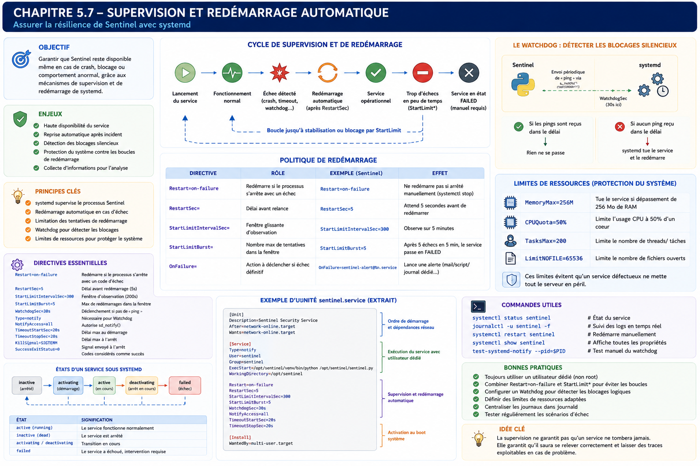

## Pour aller plus loin

Tous les mécanismes sont maintenant disponibles séparément. La mission finale demande de les assembler, de justifier chaque directive et de prouver le comportement de Sentinel face à plusieurs incidents.

← [5.6 — Journalisation avec `journald`](5.6-journalisation-journald.md) · [5.8 — Mission : rendre Sentinel résilient](5.8-mission-sentinel-resilient.md) →
