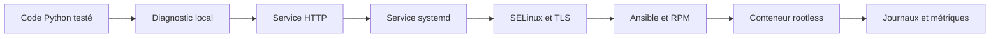
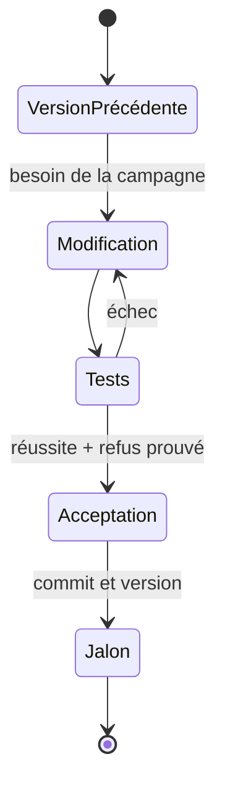

# Parcours applicatif Sentinel

Sentinel est le produit fil rouge de la formation. Il ne sert pas seulement à donner un nom aux exemples : le même programme Python évolue, version après version, à mesure que de nouveaux besoins d'exploitation et de sécurité apparaissent.

Ce document fixe le contrat transversal entre les campagnes. Il évite qu'un chapitre suppose une interface, un fichier ou un comportement qui n'a jamais été construit auparavant.

## Finalité de l'application

Sentinel est un service pédagogique de supervision légère. Sa fonction métier reste volontairement réduite afin que l'apprenant puisse observer tout son cycle de vie Linux :

1. produire un diagnostic local de l'hôte ;
2. conserver un état contrôlé ;
3. publier cet état par une interface HTTP ;
4. fonctionner comme un service durable ;
5. protéger ses échanges ;
6. être déployé, empaqueté et conteneurisé ;
7. exposer les signaux nécessaires à son exploitation.

La complexité recherchée se trouve dans l'intégration au système, pas dans un métier applicatif artificiellement riche.



## Principe d'évolution

Une campagne ne modifie pas Sentinel uniquement pour montrer du code. Une modification doit répondre à un besoin apparu dans le parcours.

```text
Besoin observable
    → modification minimale
    → mécanisme Linux étudié
    → test de réussite
    → test de refus ou de panne
    → version identifiable
```

Une campagne peut donc renforcer, déployer ou administrer Sentinel sans changer sa version applicative. Les changements de configuration, de politique de sécurité et d'infrastructure restent versionnés, mais ne deviennent pas artificiellement des fonctionnalités Python.

## Trajectoire de référence

| Jalon | Campagne | Évolution du produit | Preuve principale |
| --- | --- | --- | --- |
| `0.1.0` | 1 | programme exécutable, `--version`, diagnostic local et JSON | tests Python et exécution non privilégiée |
| `0.2.0` | 2 | configuration validée et état persistant | matrice de droits et tests sous plusieurs identités |
| `0.3.0` | 3 | serveur HTTP, `/health` et `/api/v1/status` | écoute réelle, filtrage et requête distante |
| `0.3.0` | 4 | code inchangé, administration distante sécurisée | déploiement et diagnostic via bastion |
| `0.4.0` | 5 | processus durable, signaux, journaux et modes de panne contrôlés | unité systemd et scénarios de reprise |
| `0.4.0` | 6 | code inchangé, contrat des fichiers et accès réels confiné | politique SELinux versionnée et tests AVC |
| `0.5.0` | 7 | TLS puis authentification mutuelle | chaîne de confiance et refus d'un client non autorisé |
| `0.6.0` | 8 | identité de l'hôte et autorisation issue de FreeIPA | certificat renouvelable et identité vérifiée |
| `0.6.0` | 9 | code inchangé, déploiement multi-hôte reproductible | idempotence et tests fonctionnels Ansible |
| `1.0.0` | 10 | interfaces stabilisées et paquet RPM | installation, mise à niveau, vérification et retrait |
| `1.0.0` | 11 | code inchangé, image rootless du produit empaqueté | digest, healthcheck et arrêt propre |
| `1.1.0` | 12 | `/metrics`, compteurs, latence et information de build | requêtes PromQL, alertes et tableau de bord |
| `1.1.x` | 13 | code normalement inchangé, production de traces d'incident | détection et corrélation pendant les scénarios d'attaque |
| `2.0.0` | 14 | assemblage qualifié du produit et de son infrastructure | audit final et tests d'acceptation de bout en bout |

Cette numérotation décrit le scénario pédagogique. Elle ne prétend pas remplacer une politique de versionnement définie par une organisation.

## Contrats stables

### Interface en ligne de commande

Les options sont introduites progressivement puis conservées :

```text
sentinel --version
sentinel status [--format text|json]
sentinel --config CHEMIN --check-config
sentinel --config CHEMIN serve
sentinel --config CHEMIN --healthcheck
```

Un changement ultérieur ne doit pas casser silencieusement une commande déjà utilisée par systemd, RPM, Podman ou Ansible.

### Interface HTTP

| Route | Introduction | Contrat |
| --- | --- | --- |
| `GET /health` | campagne 3 | le processus répond et peut traiter une requête |
| `GET /ready` | campagne 5 | les dépendances indispensables sont utilisables |
| `GET /api/v1/status` | campagne 3 | dernier diagnostic Sentinel en JSON |
| `GET /metrics` | campagne 12 | métriques au format texte Prometheus |

Une réponse HTTP réussie ne prouve pas à elle seule que toute la fonction métier fonctionne. Les chapitres doivent distinguer port ouvert, santé, disponibilité et transaction fonctionnelle.

### Chemins Linux

| Nature | Installation manuelle | Installation RPM |
| --- | --- | --- |
| code | `/opt/sentinel/` | `/usr/libexec/sentinel/` |
| configuration | `/etc/sentinel/` | `/etc/sentinel/` |
| état | `/var/lib/sentinel/` | `/var/lib/sentinel/` |
| données temporaires | `/run/sentinel/` | `/run/sentinel/` |
| journaux | sortie standard vers journald | sortie standard vers journald |
| unité locale | `/etc/systemd/system/` | unité du paquet sous `/usr/lib/systemd/system/` |

Le passage au RPM est une migration explicite. Le dépôt source, l'artefact et l'installation restent trois espaces distincts.

## Format d'un jalon dans un chapitre

Lorsqu'un chapitre fait évoluer le produit, il contient une section `Jalon Sentinel` composée des éléments suivants :

1. **état de départ** : version et fonctionnalités déjà disponibles ;
2. **besoin** : problème opérationnel que le changement résout ;
3. **modification** : fichiers et interfaces touchés ;
4. **migration** : compatibilité de la configuration et des données ;
5. **preuves** : tests automatisés et commandes fonctionnelles ;
6. **échec attendu** : refus, panne ou entrée invalide démontrant le contrôle ;
7. **livrable** : commit ou tag et résultat attendu pour la suite.



Les extraits de code doivent être assez complets pour être exécutés. Lorsqu'un diff partiel est utilisé, le chapitre indique clairement le fichier et le point d'insertion. Une implémentation de référence est conservée sous `sentinel/labs/sentinel-app/` pour permettre la correction ou la reprise du parcours.

## Tests cumulatifs

Chaque jalon conserve les tests des versions précédentes. Le minimum attendu est :

- tests unitaires du code modifié ;
- test de l'interface en ligne de commande ;
- test fonctionnel du service lorsqu'il existe ;
- test d'une entrée invalide ou d'un accès refusé ;
- absence de secret et d'artefact généré dans Git ;
- documentation de la commande de retour arrière.

Le test d'une campagne ne doit pas seulement prouver son mécanisme isolé. Il doit aussi vérifier que Sentinel rend encore les fonctions acquises précédemment.

## Ce que Sentinel ne doit pas devenir

Sentinel n'est ni un produit de supervision complet, ni un prétexte pour introduire un framework Python complexe. En particulier :

- la bibliothèque standard est privilégiée tant qu'elle reste lisible et sûre ;
- les dépendances nouvelles doivent servir un objectif du parcours et être empaquetables ;
- aucun mode volontairement vulnérable n'est actif par défaut ;
- les fonctions de laboratoire dangereuses restent séparées du chemin normal ;
- une configuration de démonstration ne doit jamais être présentée comme directement exploitable en production.

Cette limite maintient le centre de gravité de la formation sur Linux, la sécurité et l'exploitation.
