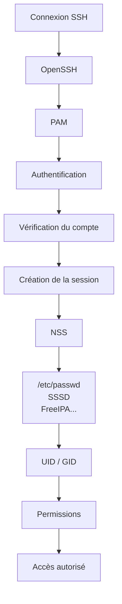
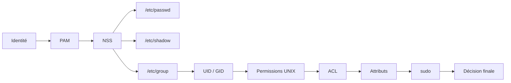
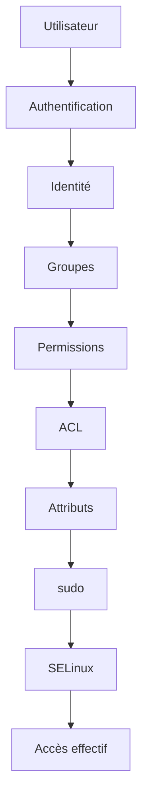
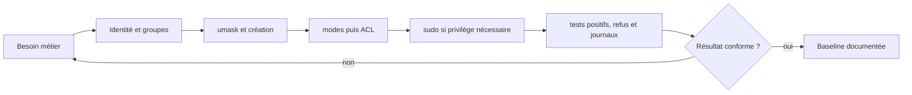

# Chapitre 2.10 — Synthèse : sécuriser les identités

> **Campagne 2 — Contrôle des accès**

> *« Une identité n'est pas simplement un nom d'utilisateur. C'est l'ensemble des mécanismes qui permettent au système de savoir qui agit, ce qu'il peut faire et dans quelles conditions. »*

## Vous êtes ici

```text
PARTIE I — Construire un socle sécurisé

Campagne 1  [██████████] ✔
Campagne 2  [██████████] ✔

      2.1 Les permissions UNIX ✔
      2.2 ACL ✔
      2.3 umask ✔
      2.4 Attributs étendus ✔
      2.5 PAM ✔
      2.6 Politique de mots de passe ✔
      2.7 Comptes système ✔
      2.8 sudo avancé ✔
      2.9 passwd / shadow / group ✔
   ►  2.10 Synthèse
```

## Objectifs pédagogiques

À la fin de ce chapitre, vous serez capable de :

- relier tous les mécanismes étudiés dans cette campagne ;
- comprendre le cycle complet d'une authentification locale ;
- expliquer comment Linux prend une décision d'autorisation ;
- identifier les différentes couches de protection autour d'une identité ;
- préparer les concepts qui seront utilisés dans les campagnes consacrées au réseau, à SSH, à FreeIPA et à SELinux.

## Pourquoi ce chapitre existe

Au cours des chapitres précédents, nous avons étudié de nombreux mécanismes. Pris individuellement, chacun paraît relativement simple. Pourtant, dans un système Linux moderne, aucun de ces mécanismes ne fonctionne isolément. Lorsqu'un utilisateur ouvre une session SSH, exécute une commande avec `sudo` ou tente d'accéder à un fichier, plusieurs composants interviennent successivement. Comprendre cette coopération est essentiel.

Un administrateur ne résout pas un problème de permissions en regardant uniquement les permissions. Il doit raisonner sur **l'ensemble de la chaîne de confiance**. C'est précisément l'objectif de ce chapitre.

## Une identité est bien plus qu'un nom

Lorsque l'on parle d'un utilisateur Linux, on pense souvent à un simple identifiant. Par exemple : `alice` En réalité, cette identité regroupe de nombreuses informations.

- un UID ;
- un groupe principal ;
- plusieurs groupes secondaires ;
- une politique PAM ;
- un mot de passe ou une autre méthode d'authentification ;
- des droits `sudo` éventuels ;
- des permissions sur les ressources ;
- des ACL ;
- des contextes de sécurité qui apparaîtront plus tard avec SELinux.

L'identité est donc un ensemble cohérent de mécanismes. Pas simplement une ligne dans `/etc/passwd`.

## Le cycle complet d'une authentification

Prenons un exemple concret. Alice souhaite se connecter en SSH. À première vue, l'opération paraît simple.

```text
Connexion

↓

Mot de passe

↓

Session ouverte
```

En réalité, Linux réalise un très grand nombre de vérifications. On peut représenter cette chaîne de décision ainsi.



Chaque composant possède une responsabilité bien précise. Aucun ne réalise seul toute la procédure. Cette séparation est l'une des grandes forces de Linux.

## La chaîne de confiance

Nous pouvons désormais représenter l'ensemble des mécanismes étudiés dans cette campagne.



Ce schéma montre que la sécurité des identités repose sur plusieurs couches. Supprimer ou mal configurer l'une d'elles fragilise l'ensemble.

## Les différentes décisions prises par Linux

Lorsqu'un utilisateur effectue une action, Linux répond successivement à plusieurs questions. Première question.

> Qui est cet utilisateur ?

Cette réponse provient de PAM et des sources d'identité. Deuxième question.

> À quels groupes appartient-il ?

Réponse. NSS. Puis : `/etc/group` ou un annuaire. Troisième question.

> Possède-t-il les permissions nécessaires ?

Le noyau vérifie alors :

- l'UID ;
- le GID ;
- les permissions ;
- les ACL.

Enfin. Le programme lui-même peut appliquer des règles supplémentaires. Par exemple :

- `sudo` ;
- une politique applicative ;
- plus tard, SELinux.

Toutes ces décisions sont indépendantes. Mais elles s'enchaînent.

## Pourquoi autant de couches ?

Une question revient souvent. Pourquoi Linux possède-t-il autant de mécanismes ? Pourquoi ne pas avoir créé un système unique ? Parce que chaque mécanisme répond à un besoin différent. Les permissions UNIX répondent à une question simple.

> Qui possède le fichier ?

Les ACL répondent à une autre.

> Qui d'autre peut y accéder ?

PAM répond à une autre encore.

> L'utilisateur est-il authentifié ?

Les groupes répondent à une autre.

> À quelle fonction appartient-il ?

Puis viendront :

- SELinux ;
- les capacités Linux ;
- le sandboxing `systemd`.

Chacun ajoute une nouvelle couche de protection. On parle alors de **défense en profondeur**.

## Une vision d'architecte

Il est désormais possible de représenter la sécurité des identités comme un ensemble de couches successives.



Chaque couche complète la précédente. Aucune ne la remplace.

Zero Trust.

### Culture technique

Pendant longtemps, les systèmes UNIX reposaient essentiellement sur trois mécanismes :

- les utilisateurs ;
- les groupes ;
- les permissions.

Cette approche a fait ses preuves. Mais elle est rapidement devenue insuffisante face à l'évolution des menaces. De nouveaux mécanismes sont progressivement apparus. Par exemple :

- les ACL ;
- PAM ;
- les capacités Linux ;
- SELinux ;
- les politiques `sudo` ;
- les annuaires centralisés.

Fait remarquable, ces innovations n'ont pas remplacé les mécanismes historiques. Elles se sont ajoutées à eux. Cette capacité à faire évoluer progressivement l'architecture sans remettre en cause les fondations explique en grande partie la longévité des systèmes UNIX et Linux.

### Piège classique

Une erreur fréquente consiste à raisonner uniquement en termes de permissions de fichiers. Prenons un exemple. Un administrateur constate qu'un utilisateur ne peut pas lire un fichier. Il vérifie immédiatement :

```bash
ls -l
```

Les permissions semblent correctes. Pourtant, l'accès est toujours refusé. Pourquoi ? Plusieurs explications sont possibles.

- Une ACL est plus restrictive.
- Le processus s'exécute avec une autre identité.
- Une politique `sudo` n'est pas appliquée.
- Plus tard, nous verrons qu'un contexte SELinux peut également provoquer ce refus.

Le bon réflexe consiste toujours à se demander :

> **À quelle étape de la chaîne de décision l'accès a-t-il été refusé ?**

Cette méthode de diagnostic est beaucoup plus efficace que la recherche d'une cause unique.

## TP 1 — Expérimenter sur AlmaLinux

L'objectif de ce laboratoire est de relier tous les mécanismes étudiés. Choisissez un utilisateur de test. Commencez par afficher son identité.

```bash
id testuser
```

Affichez ensuite son entrée dans :

```bash
grep "^testuser:" /etc/passwd
```

Puis :

```bash
sudo grep "^testuser:" /etc/shadow
```

Enfin :

```bash
grep "testuser" /etc/group
```

Vous disposez maintenant de toutes les informations décrivant cette identité. Choisissez ensuite un fichier.

```bash
ls -l fichier.txt
```

S'il possède des ACL, affichez-les.

```bash
getfacl fichier.txt
```

Demandez-vous alors :

- Quel est le propriétaire ?
- Quel est le groupe ?
- L'utilisateur appartient-il à ce groupe ?
- Une ACL modifie-t-elle la décision ?
- Une commande `sudo` serait-elle nécessaire pour accéder à cette ressource ?

Vous venez de reproduire exactement le raisonnement qu'un administrateur suit lorsqu'il analyse un problème de permissions.

## Jalon Sentinel — version 0.2.0

### Partir de la version précédente

Sentinel 0.1.0 sait produire un diagnostic, mais il ne conserve rien. La campagne vient de définir des propriétaires, des groupes, des modes, une `umask` et un compte de service : l'application peut maintenant acquérir un état réel sur lequel appliquer ces décisions.

La version 0.2.0 ajoute :

- `--config CHEMIN --check-config` ;
- une section `[storage]` ;
- la commande `record`, qui écrit le diagnostic courant ;
- la commande `show`, qui relit le dernier état ;
- une écriture atomique du fichier `status.json` avec le mode `0640`.

### Définir la configuration

Créez une configuration de développement :

```ini
[storage]
state_directory = ../var
```

Un chemin relatif est résolu par rapport au fichier de configuration, pas au répertoire courant du processus. Lors de l'installation système, il deviendra `/var/lib/sentinel`.

La validation doit refuser une configuration absente ou une section sans `state_directory`. Elle ne crée aucun fichier lorsqu'elle est appelée avec `--check-config`.

### Écrire l'état sans fichier partiellement écrit

L'enregistrement utilise un fichier temporaire créé dans le répertoire final, impose son mode, force les données utiles puis effectue un renommage atomique :

```python
descriptor, temporary_name = tempfile.mkstemp(
    dir=state_directory,
    prefix=".status-",
    text=True,
)
temporary = Path(temporary_name)
try:
    os.fchmod(descriptor, 0o640)
    with os.fdopen(descriptor, "w", encoding="utf-8") as stream:
        json.dump(status, stream, sort_keys=True)
        stream.write("\n")
        stream.flush()
        os.fsync(stream.fileno())
    os.replace(temporary, state_directory / "status.json")
except BaseException:
    temporary.unlink(missing_ok=True)
    raise
```

Le fichier temporaire doit résider sur le même système de fichiers pour que `os.replace()` fournisse la propriété atomique attendue. Cette méthode évite qu'une interruption laisse `status.json` à moitié écrit ; elle ne remplace ni une sauvegarde ni un verrou si plusieurs processus deviennent écrivains.

### Prouver le comportement sous les bonnes identités

```bash
sudo install -d -o sentinel -g sentinel -m 0750 /var/lib/sentinel
sudo install -d -o root -g sentinel -m 0750 /etc/sentinel
sudo install -o root -g sentinel -m 0640 /dev/null \
  /etc/sentinel/sentinel.conf
sudoedit /etc/sentinel/sentinel.conf
```

Placez dans cette configuration système :

```ini
[storage]
state_directory = /var/lib/sentinel
```

Puis exécutez :

```bash

sudo -u sentinel ./src/sentinel.py \
  --config /etc/sentinel/sentinel.conf --check-config
sudo -u sentinel ./src/sentinel.py \
  --config /etc/sentinel/sentinel.conf record
sudo -u sentinel ./src/sentinel.py \
  --config /etc/sentinel/sentinel.conf show --format json
```

Testez ensuite un compte sans appartenance au groupe : il ne doit ni lire la configuration protégée ni modifier l'état. Vérifiez enfin le propriétaire et le mode avec `namei -l`, `stat` et `getfacl`.

Le checkpoint de référence se trouve sous `sentinel/labs/sentinel-app/checkpoints/0.2.0/`. Il sert à comparer le résultat après l'exercice, pas à éviter le raisonnement sur les droits.

## Mission finale — Construire et auditer le modèle d'accès Sentinel

Déployez Sentinel 0.2.0 dans un petit laboratoire sous `/srv/sentinel-lab` sans y placer de secret réel. Il doit comporter le code, une configuration, un répertoire de données, un journal et un script d'administration. Définissez :

- un compte de service non interactif ;
- un groupe d'exploitation et un compte de sauvegarde ;
- des modes et une `umask` justifiés ;
- une ACL uniquement là où le modèle propriétaire-groupe-autres ne suffit pas ;
- un attribut `user.*` de démonstration ;
- une règle `sudo` minimale validée avec `visudo` ;
- un scénario PAM documenté, sans modifier la pile de la machine.

Testez ensuite la matrice sous chaque identité. Une preuve réussie ne suffit pas : ajoutez au moins un test de refus par exigence. Les commandes `record` et `show` doivent fonctionner sous le compte de service et échouer sous une identité non autorisée. Collectez `getent`, `id`, `stat`, `getfacl`, `getfattr`, `sudo -l` et les journaux utiles dans un dossier de preuves sans copier de condensat de mot de passe.



### Grille de réussite

| Critère | Preuve attendue |
| --- | --- |
| identité séparée | le processus et les fichiers utilisent le compte de service prévu |
| moindre privilège | chaque lecture, écriture et élévation correspond à un besoin nommé |
| création sûre | les nouveaux objets reçoivent immédiatement les droits attendus |
| délégation maîtrisée | les commandes prévues réussissent et les variantes dangereuses échouent |
| restauration possible | modes, ACL et attributs peuvent être inventoriés puis reconstruits |
| diagnostic reproductible | le refus est rattaché à une couche précise, sans `chmod 777` |

Le livrable final est une note courte comprenant la matrice d'accès, les commandes de mise en place, les preuves, les écarts et la procédure de retour arrière. Cette note servira de contrat aux campagnes sur le réseau, systemd, SELinux, RPM et Ansible.

## Impact sur Sentinel

À partir de la prochaine campagne, Sentinel commencera à communiquer avec le réseau. Les notions étudiées ici continueront pourtant d'être utilisées. Le service Sentinel :

- possédera sa propre identité ;
- utilisera son propre compte système ;
- appartiendra à des groupes spécifiques ;
- bénéficiera de règles `sudo` ciblées pour son administration ;
- sera progressivement intégré à FreeIPA.

Plus tard, nous ajouterons :

- une authentification TLS mutuelle ;
- des politiques SELinux ;
- un déploiement automatisé avec Ansible.

Toutes ces briques viendront compléter le socle construit dans cette campagne. Sans une bonne compréhension des identités, il serait difficile de comprendre les couches supérieures.

## Synthèse

- Une identité Linux ne se résume pas à un nom d'utilisateur.
- L'authentification, l'autorisation et l'administration des privilèges sont assurées par plusieurs mécanismes complémentaires.
- PAM vérifie l'identité et prépare la session.
- NSS permet de retrouver les informations d'identité, qu'elles soient locales ou centralisées.
- Les permissions UNIX, les ACL et les groupes déterminent les accès aux ressources.
- `sudo` permet une délégation fine et traçable des privilèges.
- La sécurité repose sur une **défense en profondeur** : plusieurs couches indépendantes coopèrent pour protéger le système.

## Infographie de révision

```text
                  CAMPAGNE 2 — CONTRÔLE DES ACCÈS

                             Utilisateur
                                  │
                                  ▼
                        Authentification (PAM)
                                  │
                                  ▼
                     Résolution de l'identité (NSS)
                                  │
          ┌───────────────────────┼────────────────────────┐
          │                       │                        │
          ▼                       ▼                        ▼
     /etc/passwd            /etc/shadow             /etc/group
          │                       │                        │
          └───────────────┬───────┴───────────────┬────────┘
                          ▼                       ▼
                    UID / GID              Groupes secondaires
                          │
                          ▼
                Permissions UNIX classiques
                          │
                          ▼
                         ACL
                          │
                          ▼
             Attributs et protections des fichiers
                          │
                          ▼
                   Élévation via sudo
                          │
                          ▼
                Décision finale d'autorisation

──────────────────────────────────────────────────────────────────────────────

     Philosophie de la campagne

     ✔ Identifier correctement les utilisateurs
     ✔ Limiter les privilèges
     ✔ Isoler les services
     ✔ Centraliser les politiques
     ✔ Journaliser les actions
     ✔ Superposer les mécanismes de sécurité

──────────────────────────────────────────────────────────────────────────────

     Une identité est une chaîne de confiance.
     La sécurité dépend de chacun de ses maillons.
```

## Pour aller plus loin

Jusqu'à présent, nous avons sécurisé **les identités**. Nous savons désormais répondre à la question :

> **« Qui peut agir sur cette machine ? »**

Mais une autre question est tout aussi importante.

> **« Qui peut atteindre cette machine ? »**

Avant même qu'un utilisateur puisse s'authentifier, il doit pouvoir communiquer avec le serveur. Cette communication passe par le réseau. Dans la campagne suivante, nous quitterons progressivement le monde des utilisateurs pour nous intéresser à celui des paquets IP, des ports TCP et UDP, des règles de filtrage et de l'exposition des services.

Nous découvrirons notamment comment **Firewalld**, le pare-feu standard des distributions AlmaLinux et RHEL, permet de construire une politique réseau moderne, flexible et adaptée aux besoins d'un service comme Sentinel. Le contrôle des identités est désormais en place. Il est temps de contrôler les **communications**.

← [2.9 — Comprendre les fichiers d'identité Linux](2.9-fichiers-identites-linux.md)
