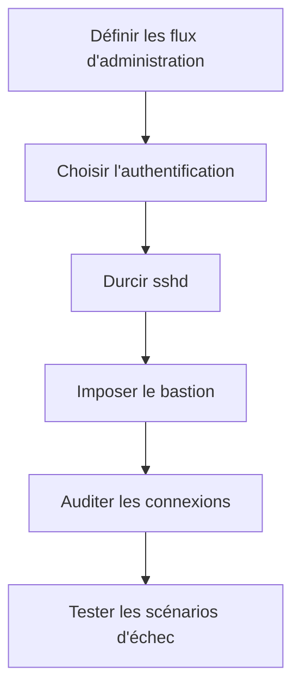
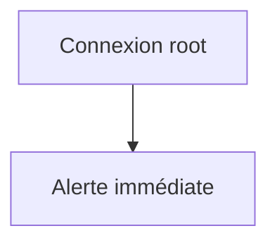
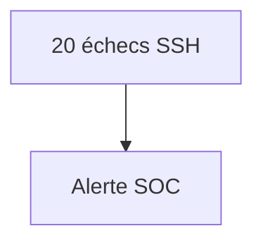
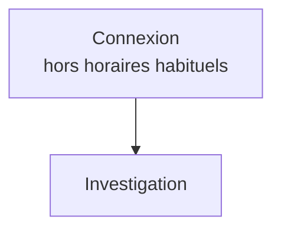
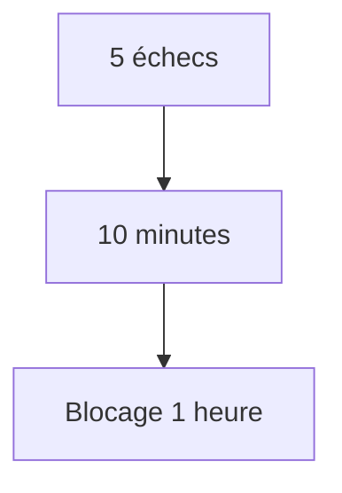

# Chapitre 4.8 — Mission : administrer Sentinel en sécurité

> **Campagne 4 — SSH et accès distant**

> *« La sécurité ne résulte jamais d'un seul mécanisme. Elle naît de la cohérence entre plusieurs couches de protection qui travaillent ensemble. »*

## Vous êtes ici

```text
Partie I — Construire un socle sécurisé

Campagne 4 — SSH et accès distant

      4.1 Architecture d'OpenSSH
      4.2 Authentification par mot de passe
      4.3 Authentification par clés
      4.4 Durcissement de sshd_config
      4.5 Bastion d'administration
      4.6 Journalisation et audit SSH
      4.7 Protection contre les attaques
    ► 4.8 Mission : Administration sécurisée de Sentinel
```

## Objectifs pédagogiques

À la fin de ce chapitre, vous serez capable de :

- concevoir une architecture d'administration passant par un bastion ;
- traduire les exigences en méthodes SSH, restrictions et flux vérifiables ;
- produire une configuration de référence avec validation et retour arrière ;
- définir les preuves nécessaires à une investigation ;
- préparer l'industrialisation et le contrôle de conformité.

## Pourquoi ce chapitre existe

Les chapitres précédents ont étudié chaque mécanisme séparément. Une infrastructure réelle échoue pourtant aux jonctions : clé individuelle mais compte partagé, bastion présent mais contournable, configuration durcie mais non déployée partout, bannissement actif mais non observable. Cette mission vérifie que les choix forment un système cohérent, testable et exploitable sous pression.

## Jalon Sentinel — version applicative inchangée

Sentinel reste en version 0.3.0 pendant cette campagne. SSH protège l'administration de l'hôte et le transfert des versions ; il n'ajoute aucune fonction métier au programme.

Cette absence de changement est volontaire. Elle permet de vérifier que l'équipe sait distinguer :

- la version de l'application ;
- la révision de `sshd_config` ;
- la politique du bastion ;
- les clés et certificats d'administration ;
- la procédure de déploiement.

Le jalon de campagne consiste à déployer **le même commit** Sentinel 0.3.0 depuis le poste autorisé, puis à l'interroger sans ouvrir un accès SSH direct depuis Kali ou Internet.

```bash
# Sur le poste d'administration, à travers le bastion configuré
scp -o ProxyJump=admin@bastion \
  dist/sentinel-0.3.0.tar.gz admin@sentinel-dev:/tmp/

ssh -J admin@bastion admin@sentinel-dev \
  'sha256sum /tmp/sentinel-0.3.0.tar.gz'
```

Comparez l'empreinte à celle produite sur le poste source avant toute installation. Puis réalisez quatre preuves :

1. connexion nominative par le bastion ;
2. connexion directe refusée depuis une zone non autorisée ;
3. déploiement du même artefact, sans modification manuelle de `sentinel.py` ;
4. routes `/health` et `/api/v1/status` encore fonctionnelles après l'opération.

Le livrable est une révision d'infrastructure et un dossier de preuves. Ne créez pas une fausse version 0.4.0 uniquement parce que la manière d'administrer l'hôte a changé.

## Mission finale — Administrer Sentinel en sécurité

### Contexte

Vous êtes désormais l'ingénieur sécurité responsable de l'administration de la plateforme **Sentinel**. L'infrastructure est en production. Elle est composée de plusieurs serveurs.

```text
Sentinel API

Sentinel Worker

PostgreSQL

FreeIPA

Serveur de sauvegarde

Serveur Ansible
```

Tous ces serveurs doivent être administrés à distance. L'entreprise vous impose plusieurs exigences.

- aucune connexion directe depuis Internet ;
- aucune authentification par mot de passe ;
- traçabilité complète des opérations ;
- accès individuels pour chaque administrateur ;
- automatisation avec Ansible ;
- architecture capable d'évoluer vers plusieurs centaines de serveurs.

Vous devez maintenant concevoir l'architecture complète.

## TP 1 — Concevoir l'architecture et les accès

### Première étape — Concevoir l'architecture réseau

Commencez par définir les différents niveaux d'exposition. Votre proposition doit répondre aux questions suivantes.

- Quels serveurs seront accessibles depuis Internet ?
- Quels serveurs resteront totalement privés ?
- Où sera placé le bastion ?
- Quel sera le rôle du pare-feu ?

Dessinez ensuite votre architecture. Par exemple.



Justifiez chacun de vos choix.

### Deuxième étape — Définir la politique d'authentification

Pour chaque catégorie d'utilisateur, déterminez la méthode retenue.

| Utilisateur | Méthode |
|-------------|---------|
| Administrateurs | Clés Ed25519 |
| Automatisation Ansible | Clé dédiée |
| Comptes de service | Aucune connexion interactive |
| root | Connexion directe interdite |

Expliquez pourquoi cette politique réduit les risques.

### Troisième étape — Construire une configuration SSH de référence

Produisez une configuration type. Par exemple.

```text
PermitRootLogin no

PasswordAuthentication no

PubkeyAuthentication yes

UsePAM yes

AllowGroups admins

MaxAuthTries 3

LoginGraceTime 30

ClientAliveInterval 300

ClientAliveCountMax 2

X11Forwarding no

AllowTcpForwarding no

AllowAgentForwarding no

Compression no
```

Pour chaque directive, expliquez :

- le risque traité ;
- les conséquences fonctionnelles ;
- les éventuelles exceptions.

## TP 2 — Organiser la détection et l'industrialisation

### Quatrième étape — Définir la stratégie de journalisation

Votre politique devra préciser.

- le niveau de journalisation (`INFO`) ;
- les événements surveillés ;
- la durée de conservation ;
- la centralisation des journaux ;
- les corrélations avec `sudo`, `auditd`, SELinux et FreeIPA.

Proposez également plusieurs alertes automatiques. Par exemple.







### Cinquième étape — Déployer Fail2ban

Définissez une politique de protection. Par exemple.



Déterminez ensuite.

- les adresses IP placées en liste blanche ;
- les jails nécessaires ;
- les notifications envoyées aux administrateurs.

### Sixième étape — Préparer l'industrialisation

Vous devez maintenant imaginer l'infrastructure dans deux ans. Elle comportera : `250 serveurs` Les modifications manuelles deviennent impossibles. Définissez donc :

- un rôle Ansible dédié à SSH ;
- une configuration versionnée dans Git ;
- une procédure de validation (`sshd -t`) ;
- un déploiement automatisé ;
- un contrôle de conformité périodique.

Votre objectif est qu'aucun serveur ne dérive de la configuration de référence.

## Étude de cas

Un lundi matin, l'équipe SOC détecte plusieurs centaines de tentatives de connexion SSH sur le bastion. Quelques minutes plus tard, une authentification réussie apparaît pour le compte : `tom` À 03 h 17 du matin. Votre mission consiste à déterminer.

- s'agit-il d'une connexion légitime ?
- quelle clé SSH a été utilisée ?
- depuis quelle adresse IP ?
- quelles actions ont été réalisées ensuite ?
- le compte a-t-il utilisé `sudo` ?
- d'autres serveurs ont-ils été atteints ?
- faut-il révoquer une clé publique ?

Décrivez précisément les investigations que vous mèneriez. Ne sautez aucune étape.

Votre réponse doit aussi distinguer les faits disponibles des informations absentes. Les journaux SSH peuvent identifier la méthode, l'adresse et souvent l'empreinte de clé, mais ils ne constituent pas à eux seuls un enregistrement fiable de chaque commande. Indiquez quelles corrélations avec `sudo`, `auditd`, `tlog`, Sentinel et les journaux du bastion seraient nécessaires, ainsi que la manière de préserver les preuves avant toute révocation.

## Livrable attendu

À la fin de cette mission, vous devrez être capable de produire :

- une architecture réseau documentée ;
- une politique SSH d'entreprise ;
- une configuration OpenSSH standardisée ;
- une stratégie de journalisation ;
- une politique Fail2ban ;
- une stratégie de déploiement Ansible ;
- une procédure complète d'investigation d'un incident SSH.

L'ensemble de ces documents constituera le socle d'administration sécurisé de Sentinel.

## Ce que vous avez appris pendant cette campagne

Vous savez désormais :

- expliquer le fonctionnement interne d'OpenSSH ;
- comprendre les mécanismes d'authentification ;
- utiliser les clés publiques ;
- durcir `sshd_config` ;
- concevoir un bastion d'administration ;
- exploiter les journaux SSH ;
- mettre en œuvre Fail2ban ;
- raisonner en défense en profondeur.

Vous possédez maintenant les connaissances nécessaires pour construire une infrastructure SSH moderne conforme aux pratiques professionnelles. La campagne suivante approfondira **systemd et les services** : elle montrera comment l'accès distant débouche sur des unités, des processus, des dépendances et des politiques d'exécution maîtrisées. FreeIPA, les certificats et l'automatisation viendront ensuite enrichir cette base.

## Impact sur Sentinel

La plateforme Sentinel dispose désormais d'un modèle d'administration complet : exposition limitée au bastion, identités individuelles, méthodes SSH explicites, configuration validée, traces centralisées et réponse adaptative. Les livrables de cette mission deviennent la référence que les campagnes suivantes devront préserver lors de l'ajout de SELinux, TLS, systemd, FreeIPA, Ansible et Podman.

## Synthèse

Le chapitre **Mission : administrer Sentinel en sécurité** établit une brique du socle de sécurité Sentinel. Avant de poursuivre, vérifiez que vous savez :

- expliquer le rôle des mécanismes présentés ;
- distinguer leur configuration de leur état réellement observé ;
- valider leur comportement dans le laboratoire ;
- conserver une configuration explicite, vérifiable et reproductible.

## Infographie de révision

```text
┌──────────────────────────────────────────────────────────────────────────────────────────────────────┐
│            CHAPITRE 4.8 — MISSION : ADMINISTRATION SÉCURISÉE DE SENTINEL                            │
├──────────────────────────────────────────────────────────────────────────────────────────────────────┤
│                                                                                                      │
│                           ARCHITECTURE GLOBALE                                                       │
│                                                                                                      │
│                                    Internet                                                         │
│                                        │                                                            │
│                                        ▼                                                            │
│                                   Firewalld                                                        │
│                                        │                                                            │
│                                        ▼                                                            │
│                                   Bastion SSH                                                      │
│                                        │                                                            │
│                          Authentification par clés                                                  │
│                                        │                                                            │
│                                        ▼                                                            │
│                           Réseau d'administration                                                   │
│                                        │                                                            │
│         ┌──────────────────────────────┼──────────────────────────────┐                            │
│         ▼                              ▼                              ▼                            │
│   Sentinel API                  FreeIPA                     PostgreSQL                             │
│         │                              │                              │                            │
│         └──────────────────────────────┼──────────────────────────────┘                            │
│                                        ▼                                                            │
│                                 Supervision                                                        │
│                                                                                                      │
├──────────────────────────────────────────────────────────────────────────────────────────────────────┤
│                           POLITIQUE D'ADMINISTRATION                                                 │
│                                                                                                      │
│ Administrateurs                                                                                     │
│        │                                                                                             │
│        ▼                                                                                             │
│ Clés Ed25519                                                                                         │
│        │                                                                                             │
│        ▼                                                                                             │
│ Bastion SSH                                                                                          │
│        │                                                                                             │
│        ▼                                                                                             │
│ Comptes nominatifs                                                                                    │
│        │                                                                                             │
│        ▼                                                                                             │
│ sudo                                                                                                 │
│        │                                                                                             │
│        ▼                                                                                             │
│ Journalisation                                                                                        │
│                                                                                                      │
├──────────────────────────────────────────────────────────────────────────────────────────────────────┤
│                           DÉFENSE EN PROFONDEUR                                                      │
│                                                                                                      │
│ Internet                                                                                             │
│     │                                                                                                │
│     ▼                                                                                                │
│ Firewalld                                                                                             │
│     │                                                                                                │
│     ▼                                                                                                │
│ Bastion SSH                                                                                           │
│     │                                                                                                │
│     ▼                                                                                                │
│ OpenSSH durci                                                                                         │
│     │                                                                                                │
│     ▼                                                                                                │
│ Clés publiques                                                                                        │
│     │                                                                                                │
│     ▼                                                                                                │
│ PAM                                                                                                  │
│     │                                                                                                │
│     ▼                                                                                                │
│ sudo                                                                                                 │
│     │                                                                                                │
│     ▼                                                                                                │
│ SELinux                                                                                              │
│     │                                                                                                │
│     ▼                                                                                                │
│ auditd + journalctl + SIEM                                                                           │
│                                                                                                      │
├──────────────────────────────────────────────────────────────────────────────────────────────────────┤
│                             AUTOMATISATION                                                          │
│                                                                                                      │
│ Git                                                                                                  │
│   │                                                                                                  │
│   ▼                                                                                                  │
│ Rôle Ansible                                                                                         │
│   │                                                                                                  │
│   ▼                                                                                                  │
│ Validation : sshd -t                                                                                 │
│   │                                                                                                  │
│   ▼                                                                                                  │
│ Déploiement                                                                                          │
│   │                                                                                                  │
│   ▼                                                                                                  │
│ Contrôle de conformité                                                                               │
│                                                                                                      │
├──────────────────────────────────────────────────────────────────────────────────────────────────────┤
│                         PROCÉDURE D'INVESTIGATION                                                    │
│                                                                                                      │
│ Alerte                                                                                                │
│   │                                                                                                  │
│   ▼                                                                                                  │
│ journalctl -u sshd                                                                                   │
│   │                                                                                                  │
│   ▼                                                                                                  │
│ Corrélation sudo                                                                                     │
│   │                                                                                                  │
│   ▼                                                                                                  │
│ auditd                                                                                                │
│   │                                                                                                  │
│   ▼                                                                                                  │
│ SELinux                                                                                              │
│   │                                                                                                  │
│   ▼                                                                                                  │
│ Journaux Sentinel                                                                                    │
│   │                                                                                                  │
│   ▼                                                                                                  │
│ Décision : Révocation / Remédiation / Rapport                                                       │
│                                                                                                      │
├──────────────────────────────────────────────────────────────────────────────────────────────────────┤
│                              LES 7 PILIERS                                                          │
│                                                                                                      │
│ ✔ Bastion unique                                                                                     │
│ ✔ Authentification par clés Ed25519                                                                  │
│ ✔ sshd_config durci                                                                                  │
│ ✔ Journalisation centralisée                                                                         │
│ ✔ Fail2ban                                                                                            │
│ ✔ Déploiement automatisé avec Ansible                                                                │
│ ✔ Procédure d'investigation documentée                                                               │
│                                                                                                      │
├──────────────────────────────────────────────────────────────────────────────────────────────────────┤
│                                   IDÉE CLÉ                                                          │
│                                                                                                      │
│ « Une infrastructure SSH professionnelle n'est pas une somme                                       │
│  de mécanismes indépendants. C'est un ensemble cohérent où                                          │
│  chaque couche complète les autres afin de protéger,                                                │
│  détecter, tracer et administrer durablement les serveurs. »                                        │
└──────────────────────────────────────────────────────────────────────────────────────────────────────┘
```

## Pour aller plus loin

Conservez la matrice d'accès, le profil `sshd`, l'inventaire des clés et les scénarios de test comme baseline. La campagne suivante ajoutera systemd et le durcissement des services : elle devra maîtriser le cycle de vie des processus sans contourner les frontières SSH déjà établies.

← [4.7 — Protection contre les attaques SSH](4.7-protection-attaques-ssh.md)
