# Chapitre 5.8 — Mission : rendre Sentinel résilient

> **Campagne 5 — systemd et services**

> *« Une infrastructure n'est pas jugée sur son comportement lorsque tout fonctionne. Elle est jugée sur sa capacité à continuer de fonctionner lorsque tout va mal. »*

## Vous êtes ici

```text
Partie I — Construire un socle sécurisé

Campagne 5 — systemd et les services

      5.1 Comprendre systemd
      5.2 Les unités (.service, .socket, .target…)
      5.3 Créer le service Sentinel
      5.4 Sandboxing systemd
      5.5 Capacités Linux
      5.6 Journalisation avec journald
      5.7 Supervision et redémarrage automatique
    ► 5.8 Mission : rendre Sentinel résilient
```

## Objectifs pédagogiques

À l'issue de cette mission, vous serez capable de :

- concevoir un service prêt pour la production ;
- appliquer simultanément tous les mécanismes étudiés dans cette campagne ;
- raisonner comme un ingénieur d'exploitation et non comme un simple administrateur ;
- évaluer objectivement le niveau de résilience d'un service ;
- identifier les points faibles restant à traiter dans les campagnes suivantes.

## Pourquoi ce chapitre existe

Depuis le début de cette campagne, nous avons découvert de nombreux mécanismes. Pris individuellement, chacun semble relativement simple.

- créer une unité ;
- lancer un service ;
- ajouter un sandbox ;
- limiter les capacités ;
- produire des journaux ;
- configurer un watchdog.

Pourtant, en entreprise, ces éléments ne sont jamais déployés séparément. Ils forment un ensemble cohérent. Cette mission consiste précisément à assembler toutes ces briques afin de construire un véritable service de production.

## Jalon Sentinel — version 0.4.0

### Pourquoi le code doit évoluer

Sentinel 0.3.0 sait servir HTTP, mais il ne distingue pas encore vie du processus et disponibilité, ne signale pas son état à systemd et ne traite pas explicitement l'arrêt. Une unité très élaborée ne peut pas inventer ces comportements à la place du programme.

La version 0.4.0 ajoute donc :

- `GET /ready`, qui vérifie que l'état existe et reste accessible ;
- `--healthcheck`, dont le code de retour dépend de `/ready` ;
- un arrêt propre sur `SIGTERM` et `SIGINT` ;
- les notifications `READY=1`, `WATCHDOG=1` et `STOPPING=1` vers `NOTIFY_SOCKET` ;
- des journaux JSON écrits sur la sortie standard ;
- une section `[logging]` validée.

Le code suit désormais les composants exploités : `runtime.py` contient signaux, watchdog et healthcheck ; `logging_support.py` prépare les événements pour journald ; `web.py` distingue `/health` de `/ready` ; `state.py` porte le critère de disponibilité. `sentinel.py` reste une façade stable afin de ne pas casser les unités et tests existants. Pendant l'installation manuelle, copiez tous les fichiers `src/*.py` sous `/opt/sentinel/bin/`, rendez seulement le lanceur `sentinel` exécutable et gardez les modules lisibles mais non modifiables par le compte de service.

```ini
[server]
listen_address = 127.0.0.1
listen_port = 8443

[storage]
state_directory = /var/lib/sentinel

[logging]
level = INFO
```

Dans `src/runtime.py`, le programme utilise un socket datagramme Unix pour parler au gestionnaire de services. Il n'a besoin d'aucun shell ni d'un accès au bus complet :

```python
def sd_notify(message):
    address = os.environ.get("NOTIFY_SOCKET")
    if not address:
        return False
    if address.startswith("@"):
        address = "\0" + address[1:]
    with socket.socket(socket.AF_UNIX, socket.SOCK_DGRAM) as notifier:
        notifier.connect(address)
        notifier.sendall(message.encode("utf-8"))
    return True
```

La boucle de service envoie `READY=1` seulement après l'écriture de l'état et l'ouverture du socket HTTP. Elle envoie ensuite le watchdog depuis la boucle principale. Un thread secondaire bloqué ne doit pas pouvoir prétendre que tout le processus progresse encore.

### Aligner l'unité sur le contrat réel

```ini
[Service]
Type=notify
NotifyAccess=main
User=sentinel
Group=sentinel
ExecStartPre=/opt/sentinel/bin/sentinel \
  --config /etc/sentinel/sentinel.conf --check-config
ExecStart=/opt/sentinel/bin/sentinel \
  --config /etc/sentinel/sentinel.conf serve
ExecStartPost=/opt/sentinel/bin/sentinel \
  --config /etc/sentinel/sentinel.conf --healthcheck
WatchdogSec=10s
TimeoutStopSec=15s
Restart=on-failure
RestartSec=5s
UMask=0027
```

`ExecStartPost` doit disposer d'un délai raisonnable : une course entre l'ouverture du port et le test rendrait le démarrage aléatoire. Dans le checkpoint fourni, `READY=1` est émis après l'initialisation ; adaptez le test si votre version de systemd lance `ExecStartPost` avant que l'état attendu soit observable.

### Tests d'acceptation du jalon

```bash
sudo systemctl daemon-reload
sudo systemctl restart sentinel.service
systemctl show sentinel.service -p Type -p NotifyAccess -p WatchdogUSec

curl --fail http://127.0.0.1:8443/health
curl --fail http://127.0.0.1:8443/ready
sudo -u sentinel /opt/sentinel/bin/sentinel \
  --config /etc/sentinel/sentinel.conf --healthcheck

sudo systemctl kill --signal=TERM sentinel.service
journalctl -u sentinel.service --since '-2 minutes' --output=json-pretty
```

Prouvez également les trois différences suivantes :

- processus vivant mais `/ready` en échec lorsque l'état est indisponible ;
- redémarrage après un arrêt anormal, mais pas après un arrêt administratif propre ;
- passage à `failed` lorsque la limite de redémarrages est atteinte.

Le code et les tests de référence sont disponibles sous `sentinel/labs/sentinel-app/checkpoints/0.4.0/`.

## Mission finale — Rendre Sentinel résilient

### Les cinq piliers d'un service moderne

Avant de commencer la mission, rappelons les cinq propriétés qu'un service moderne doit posséder.

#### 1. Il doit démarrer correctement.

Cela paraît évident. Pourtant, un service incapable de démarrer automatiquement après un redémarrage serveur n'est déjà plus exploitable.

#### 2. Il doit fonctionner avec le minimum de privilèges.

Le principe du moindre privilège doit être visible partout.

- utilisateur dédié ;
- capacités limitées ;
- sandboxing ;
- permissions minimales.

#### 3. Il doit être observable.

Un service invisible est un service impossible à exploiter. Il doit produire :

- des journaux utiles ;
- des messages explicites ;
- des événements exploitables.

#### 4. Il doit être capable de survivre.

Le crash n'est plus considéré comme un événement exceptionnel. Le service doit être capable de retrouver automatiquement un état stable.

#### 5. Il doit être industrialisable.

Un administrateur ne doit jamais avoir besoin d'exécuter :

```bash
python sentinel.py
```

La totalité du cycle de vie doit être automatisée.

## Une vision globale

Sentinel est désormais bien différent de l'application Python créée au début du livre. Visualisons son évolution.

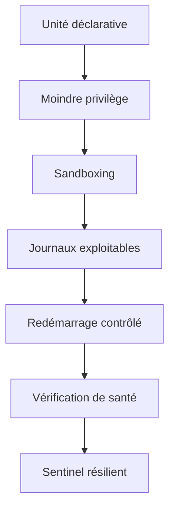

Chaque chapitre a ajouté une couche. Aucune n'était spectaculaire. Ensemble, elles transforment complètement le niveau de sécurité et d'exploitabilité.

## Les objectifs de la mission

Votre entreprise souhaite désormais mettre Sentinel en production. Avant de donner son accord, l'équipe d'architecture exige une validation complète. Vous devez démontrer que Sentinel satisfait aux exigences suivantes.

### Exigence n°1

Le service doit survivre à un redémarrage complet du serveur.

### Exigence n°2

Le service ne doit jamais fonctionner en tant que root.

### Exigence n°3

L'application ne doit écrire que dans ses répertoires de travail.

### Exigence n°4

Une compromission de Sentinel ne doit pas permettre d'accéder aux répertoires utilisateurs.

### Exigence n°5

Le service doit redémarrer automatiquement après un crash.

### Exigence n°6

Une boucle infinie de redémarrage doit être impossible.

### Exigence n°7

Toutes les erreurs doivent être visibles via :

```bash
journalctl
```

### Exigence n°8

Le service doit être capable de détecter son propre blocage.

## Architecture attendue

À la fin de la mission, l'architecture devra ressembler à ceci.

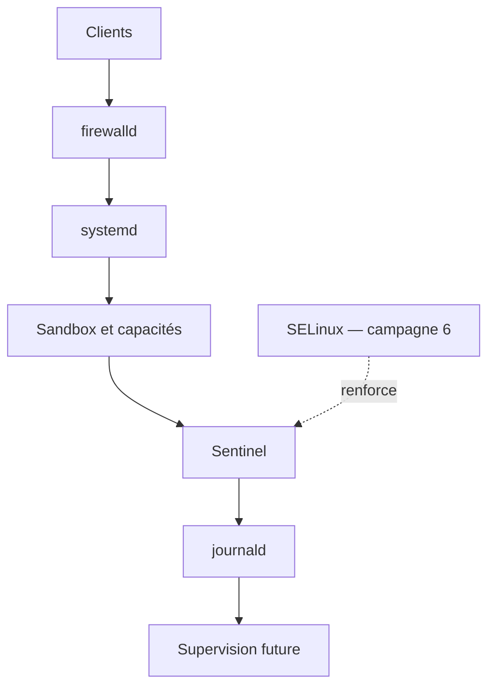

Cette représentation est volontairement incomplète. Les campagnes suivantes viendront progressivement enrichir chaque couche.

## TP 1 — Auditer l'unité et les privilèges

### Première étape : audit de l'unité

Avant toute modification, vous devez analyser l'unité existante. Pour chaque directive, répondez aux questions suivantes. Pourquoi existe-t-elle ? Que protège-t-elle ? Que se passerait-il si elle était supprimée ? Cette étape est essentielle. Un ingénieur sécurité ne copie jamais une configuration qu'il ne comprend pas.

### Deuxième étape : revue des privilèges

Construisez un tableau semblable à celui-ci.

| Élément | Justification | Peut être supprimé ? |
|----------|---------------|----------------------|
| Utilisateur dédié | Isolation | Non |
| CAP_NET_BIND_SERVICE | Port HTTPS | Oui si reverse proxy |
| ProtectHome | Isolement | Non |
| PrivateTmp | Isolation | Non |
| ProtectSystem | Lecture seule | Non |
| MemoryMax | Protection serveur | À ajuster |

L'objectif n'est pas uniquement de valider une configuration. Il est de démontrer qu'elle est comprise.

## TP 2 — Éprouver les incidents et l'observabilité

### Troisième étape : revue des incidents

Construisez une matrice.

| Incident | Détection | Réponse |
|----------|-----------|----------|
| Crash | systemd | Restart |
| Blocage | Watchdog | Restart |
| Fuite mémoire | MemoryMax | Kill + Restart |
| Boucle de crash | StartLimit | Failed |
| Saturation CPU | CPUQuota | Limitation |
| Écriture dans `/usr` | ProtectSystem | Refus |
| Accès à `/home` | ProtectHome | Refus |

Cette matrice constitue un excellent document d'exploitation. Elle permet à toute l'équipe de comprendre immédiatement la stratégie retenue.

### Quatrième étape : revue des journaux

Vérifiez que chaque événement important possède une trace. Par exemple.

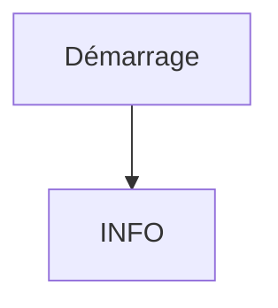

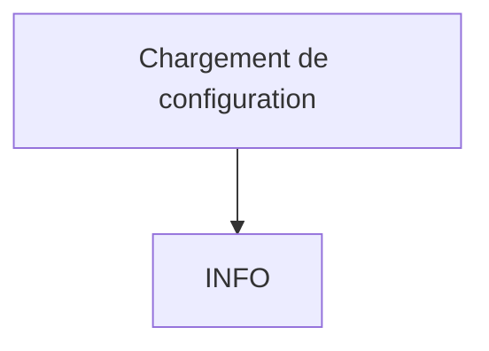

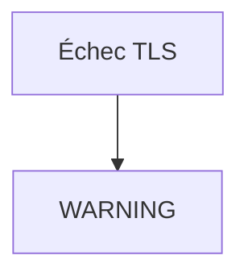

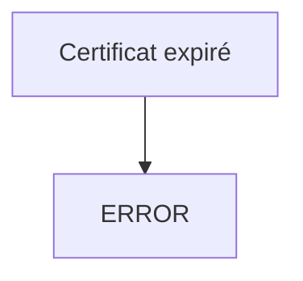

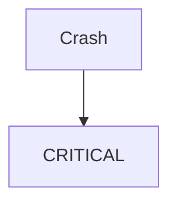

Une journalisation cohérente facilite énormément les investigations futures.

### Cinquième étape : simulation d'incident

Le service devra être soumis à plusieurs scénarios.

- arrêt brutal ;
- erreur de configuration ;
- saturation mémoire ;
- perte réseau ;
- expiration de certificat ;
- blocage volontaire.

Chaque scénario devra être documenté. Pour chacun, vous devrez répondre :

- comment le problème est-il détecté ?
- qui intervient ?
- combien de temps dure l'indisponibilité ?
- quelle information apparaît dans les journaux ?

Cette approche est directement inspirée des exercices de type *GameDay* utilisés dans les grandes plateformes Cloud.

## Approfondissement

### La résilience est une propriété émergente

Une erreur fréquente consiste à considérer la résilience comme une fonctionnalité. Ce n'est pas le cas. Une application ne devient jamais résiliente grâce à une seule technologie. La résilience apparaît lorsque plusieurs mécanismes indépendants se complètent. Prenons Sentinel. Aucun des éléments suivants ne suffit à lui seul. `systemd` ↓ Non. `Sandboxing` ↓ Non. `Capabilities` ↓ Non. `Watchdog` ↓ Non. `Journald` ↓ Non. En revanche, leur combinaison produit un comportement très différent.

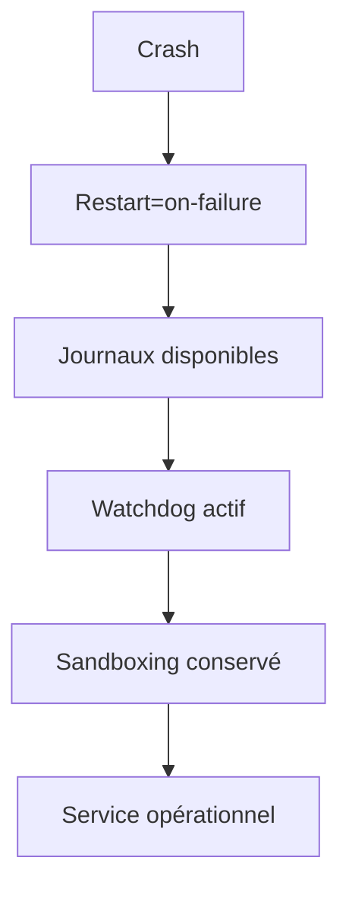

La résilience est donc **une propriété du système**, pas d'un composant.

### Les mécanismes doivent être indépendants

Une autre idée essentielle guide les architectures modernes. Chaque couche doit continuer à fonctionner même si une autre couche échoue. Par exemple. Le Watchdog ne dépend pas de Firewalld. Firewalld ne dépend pas de SELinux. SELinux ne dépend pas de journald. Chaque mécanisme possède son propre rôle. Cette indépendance évite qu'une défaillance unique ne fasse tomber toute la chaîne de protection.

### Un service résilient reste prévisible

La résilience n'est pas seulement une question de disponibilité. Elle concerne aussi la **prévisibilité**. Supposons qu'un service plante. Deux possibilités existent. Première situation.

```text
Parfois il redémarre.

Parfois non.

Parfois il attend.

Parfois il boucle.
```

Deuxième situation.

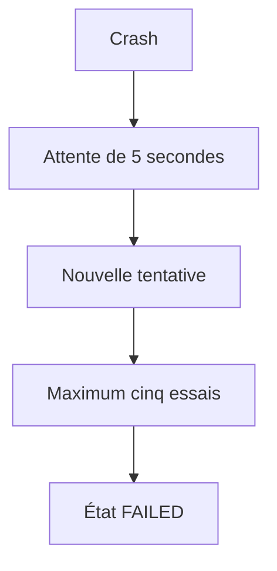

Le second comportement est infiniment plus exploitable. L'ingénieur sait exactement ce que fera le système. C'est cette prévisibilité qui caractérise une infrastructure professionnelle.

## Concevoir la politique

Lorsqu'un architecte conçoit un service, il ne réfléchit pas uniquement au démarrage. Il imagine tout son cycle de vie. Pour Sentinel, cela revient à répondre successivement aux questions suivantes.

### Installation

Comment le service est-il installé ? RPM.

### Configuration

Comment la configuration est-elle distribuée ? Ansible.

### Démarrage

Qui lance le service ? systemd.

### Sécurité

Comment limite-t-on ses privilèges ? Utilisateur dédié. Sandbox. Capabilities. SELinux.

### Réseau

Qui filtre les connexions ? Firewalld.

### Identités

Qui délivre les certificats ? FreeIPA.

### Supervision

Qui détecte les anomalies ? systemd, puis la supervision centralisée. Chaque réponse appartient à un composant différent. L'architecte ne mélange jamais ces responsabilités.

### Préparer les campagnes suivantes

À ce stade du livre, Sentinel possède déjà une base très solide. Pourtant, plusieurs sujets restent volontairement ouverts. Par exemple.

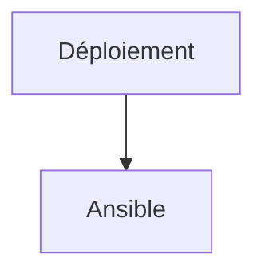


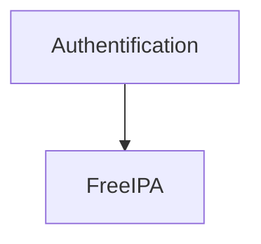

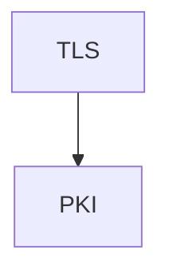

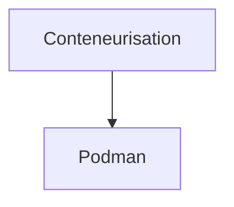

La campagne 5 constitue donc le socle d'exploitation sur lequel toutes les campagnes suivantes viendront s'appuyer.

## Point de vue offensif

Face à une infrastructure telle que celle que nous avons construite, l'attaquant adapte naturellement sa stratégie. Au début du manuel, la situation ressemblait à ceci.

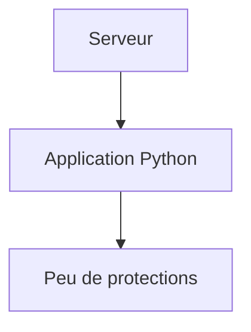

Aujourd'hui, la chaîne est devenue beaucoup plus complexe.

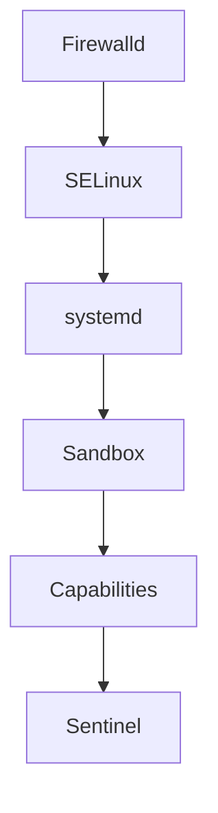

Chaque étape supplémentaire représente un obstacle. L'attaquant doit désormais :

- franchir le pare-feu ;
- contourner SELinux ;
- composer avec un utilisateur non privilégié ;
- accepter les limites du sandbox ;
- travailler avec des capacités minimales ;
- éviter les redémarrages automatiques ;
- laisser des traces dans les journaux.

Une compromission reste théoriquement possible. Elle devient simplement beaucoup plus coûteuse. C'est précisément l'objectif de la défense en profondeur.

## En entreprise

Dans une entreprise mature, une revue d'architecture est souvent organisée avant toute mise en production. Une grille d'évaluation peut ressembler à ceci.

| Domaine | Vérification |
|----------|--------------|
| Service systemd | Oui |
| Utilisateur dédié | Oui |
| Journaux exploitables | Oui |
| Sandboxing | Oui |
| Capacités minimales | Oui |
| SELinux compatible | Oui |
| Firewalld documenté | Oui |
| Watchdog | Oui |
| Restart Policy | Oui |
| Déploiement automatisé | À venir |
| Packaging RPM | À venir |
| Supervision centrale | À venir |

On remarque immédiatement que certaines lignes restent incomplètes. C'est normal. Les campagnes suivantes auront précisément pour objectif de compléter cette grille.

## Culture technique

Les pratiques étudiées dans cette campagne sont aujourd'hui largement adoptées dans les distributions modernes. Les services fournis par AlmaLinux eux-mêmes utilisent déjà de nombreuses directives que nous avons étudiées. Par exemple :

- `ProtectSystem`
- `PrivateTmp`
- `NoNewPrivileges`
- `CapabilityBoundingSet`
- `MemoryMax`
- `TasksMax`

Un excellent exercice consiste à explorer :

```bash
systemctl cat sshd

systemctl cat firewalld

systemctl cat chronyd

systemctl cat podman
```

Vous découvrirez que les services du système appliquent exactement les principes que vous venez d'apprendre. Observer les unités fournies par la distribution est probablement l'une des meilleures façons de progresser.

## Piège classique

### Considérer la campagne terminée

Après avoir découvert systemd, beaucoup d'administrateurs pensent :

> « Le service fonctionne, nous pouvons passer à autre chose. »

En réalité, le travail ne fait que commencer. Une unité systemd n'est qu'un point d'entrée. La véritable industrialisation arrivera avec :

- RPM ;
- FreeIPA ;
- Ansible ;
- Podman ;
- Auditd ;
- Grafana.

Autrement dit, nous avons construit le **moteur**. Les prochaines campagnes construiront toute la **chaîne industrielle** autour de ce moteur.

## Livrable attendu

Vous êtes nommé référent technique du projet Sentinel. Votre direction vous demande de rédiger le standard interne qui sera désormais imposé à toutes les équipes de développement. Votre document devra définir :

### Architecture

- Structure des unités systemd
- Organisation des répertoires
- Utilisateurs système
- Politique de journalisation

### Sécurité

- Sandboxing minimal obligatoire
- Capabilities autorisées
- Hypothèses et interfaces à transmettre aux futures politiques SELinux et firewalld

### Exploitation

- Politique de redémarrage
- Watchdog
- Limites de ressources
- Gestion des incidents

### Industrialisation

- fichiers, répertoires et paramètres que le futur paquet RPM devra installer ;
- éléments que les futures campagnes Ansible, FreeIPA et Podman devront reprendre sans les implémenter ici.

Votre proposition devra être suffisamment générique pour être réutilisée par toutes les futures applications de l'entreprise. La mission évalue uniquement les acquis de la campagne 5 : elle prépare les contrats des couches futures, mais ne demande pas d'écrire une politique SELinux, un paquet RPM ou un rôle Ansible avant leur étude.

## Impact sur Sentinel

La campagne 5 marque un véritable changement de dimension. Sentinel n'est plus un simple programme Python. Il devient un **service de production**. Il possède désormais :

- une identité système ;
- un cycle de vie maîtrisé ;
- une politique de sécurité ;
- une supervision ;
- une stratégie de reprise ;
- une journalisation exploitable.

Les prochaines campagnes ne modifieront plus profondément son mode d'exécution. Elles enrichiront progressivement son environnement :

- SELinux contrôlera précisément ses accès.
- FreeIPA gérera son identité.
- TLS protégera ses communications.
- RPM industrialisera son installation.
- Ansible automatisera son déploiement.
- Podman permettra son exécution conteneurisée.
- Auditd et Grafana assureront sa supervision globale.

Cette progression reflète exactement celle d'un véritable projet industriel.

## Synthèse

- Un service de production est bien plus qu'un exécutable : c'est un contrat d'exploitation.
- systemd fournit les fondations de ce contrat : démarrage, supervision, journalisation et reprise.
- Le sandboxing et les Linux Capabilities appliquent concrètement le principe du moindre privilège.
- `journald` transforme les journaux en événements structurés exploitables.
- La résilience résulte de la combinaison de plusieurs mécanismes indépendants.
- Chaque couche étudiée prépare directement les campagnes suivantes.
- Sentinel est désormais prêt à entrer dans une véritable démarche d'industrialisation.

## Infographie de révision

```text
┌────────────────────────────────────────────────────────────────────────────────────────────────────┐
│                           CAMPAGNE 5 — SYSTEMD ET LES SERVICES                                    │
├────────────────────────────────────────────────────────────────────────────────────────────────────┤
│                                                                                                    │
│          APPLICATION PYTHON                                                                         │
│                  │                                                                                  │
│                  ▼                                                                                  │
│          Utilisateur dédié                                                                          │
│                  │                                                                                  │
│                  ▼                                                                                  │
│          Service systemd                                                                            │
│                  │                                                                                  │
│        ┌─────────┼─────────┐                                                                        │
│        ▼         ▼         ▼                                                                        │
│   Sandboxing  Capabilities  Journald                                                                │
│        │         │         │                                                                        │
│        └─────────┼─────────┘                                                                        │
│                  ▼                                                                                  │
│        Supervision & Watchdog                                                                       │
│                  │                                                                                  │
│                  ▼                                                                                  │
│           Service résilient                                                                         │
│                                                                                                    │
├────────────────────────────────────────────────────────────────────────────────────────────────────┤
│                                                                                                    │
│                  DÉFENSE EN PROFONDEUR                                                             │
│                                                                                                    │
│ Firewalld → SELinux → systemd → Sandbox → Capabilities → Sentinel                                 │
│                                                                                                    │
├────────────────────────────────────────────────────────────────────────────────────────────────────┤
│                                                                                                    │
│                  COMPÉTENCES ACQUISES                                                              │
│                                                                                                    │
│ ✓ Concevoir une unité systemd                                                                      │
│ ✓ Créer un service de production                                                                   │
│ ✓ Isoler un processus                                                                              │
│ ✓ Limiter les privilèges                                                                           │
│ ✓ Exploiter journald                                                                               │
│ ✓ Configurer un watchdog                                                                           │
│ ✓ Construire une politique de reprise                                                              │
│ ✓ Préparer un service pour son industrialisation                                                   │
│                                                                                                    │
├────────────────────────────────────────────────────────────────────────────────────────────────────┤
│                                                                                                    │
│                               SENTINEL                                                             │
│                                                                                                    │
│                  Programme Python  ─────────────►  Service d'infrastructure                         │
│                                                                                                    │
├────────────────────────────────────────────────────────────────────────────────────────────────────┤
│                                                                                                    │
│ « Une application peut être développée en quelques semaines.                                      │
│  Un service de production est le résultat d'une architecture,                                     │
│  d'une politique de sécurité et d'une stratégie d'exploitation cohérentes. »                      │
└────────────────────────────────────────────────────────────────────────────────────────────────────┘
```

## Pour aller plus loin

À l'issue de cette campagne, le lecteur maîtrise désormais les fondations d'un **service Linux moderne**. Cette campagne servira de référence permanente dans la suite du manuel : les chapitres sur **SELinux**, **FreeIPA**, **Ansible**, **RPM** et **Podman** viendront enrichir cette même unité `sentinel.service`, sans remettre en cause les principes établis ici. La campagne 6 ajoute la couche de contrôle d'accès obligatoire : elle montrera pourquoi les permissions Unix, les capacités et le bac à sable systemd ne suffisent pas à exprimer toute la politique de sécurité.

← [5.7 — Supervision et redémarrage automatique](5.7-supervision-redemarrage.md) · [6.1 — Pourquoi SELinux existe](../campagne_06/6.1-pourquoi-selinux-existe.md) →
