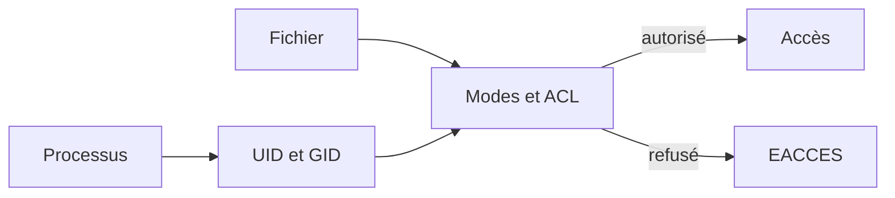
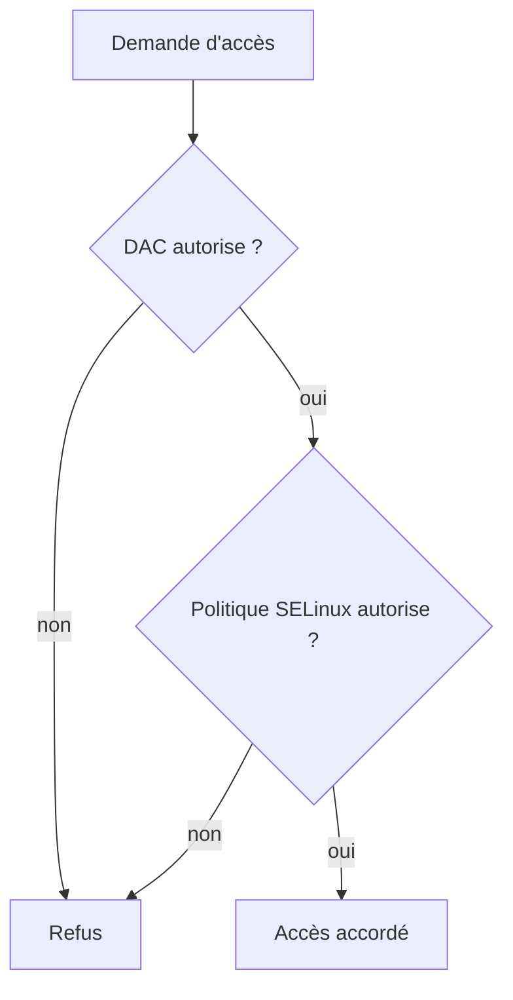
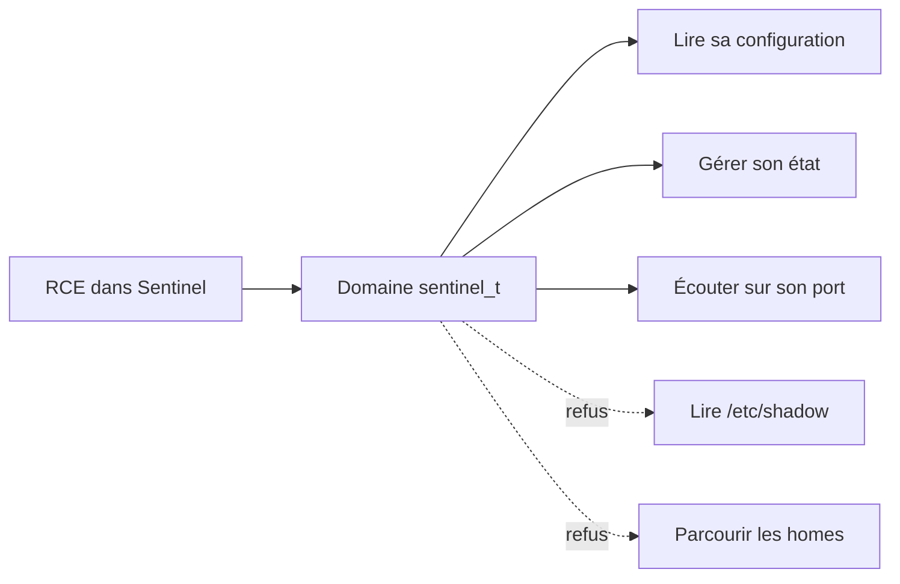
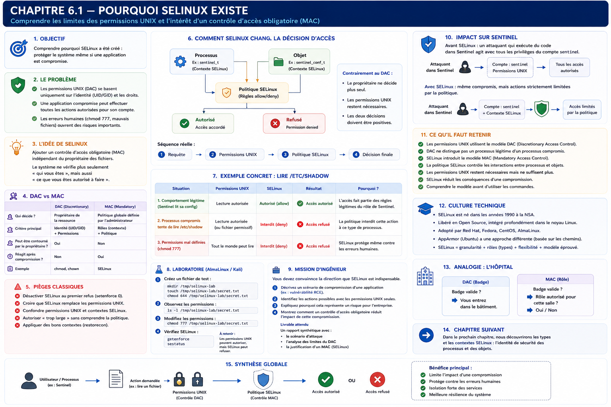

# Chapitre 6.1 — Pourquoi SELinux existe

> **Campagne 6 — SELinux**

> *« Une application compromise ne devrait pas obtenir davantage de pouvoir que son rôle légitime. »*

## Vous êtes ici

```text
Partie I — Construire un socle sécurisé

Campagne 6 — SELinux

  ► 6.1 Pourquoi SELinux existe
    6.2 Comprendre les contextes
    6.3 Lire les politiques
    6.4 Diagnostiquer un refus
    6.5 Créer des règles
    6.6 Confiner Sentinel
```

## Objectifs pédagogiques

À l'issue de ce chapitre, vous serez capable de :

- expliquer la limite du contrôle d'accès discrétionnaire UNIX ;
- distinguer DAC et MAC sans les opposer ;
- décrire ce que SELinux apporte après les permissions classiques ;
- différencier les modes enforcing, permissive et disabled ;
- situer SELinux dans la défense en profondeur de Sentinel.

## Pourquoi ce chapitre existe

Sentinel fonctionne sous un compte système dédié. Ses fichiers possèdent des propriétaires et des modes restrictifs. L'unité systemd réduit ses privilèges et Firewalld limite l'accès au port réseau.

Supposons malgré tout qu'une vulnérabilité permette d'exécuter du code dans le processus Sentinel. Le code hostile hérite alors de son UID, de ses groupes, de ses descripteurs ouverts et de toutes les ressources auxquelles l'application accède normalement.

Le noyau voit toujours le même processus légitime. Les permissions UNIX ne savent pas distinguer « Sentinel exécute sa fonction » de « un attaquant utilise Sentinel pour faire autre chose ».

SELinux répond précisément à ce problème : décrire les interactions nécessaires à une fonction, puis refuser les autres même lorsque l'UID et les permissions classiques semblent suffisants.

## Le contrôle d'accès UNIX : DAC

Les modes `rwx`, les propriétaires, les groupes et les ACL mettent en œuvre un **Discretionary Access Control** — contrôle d'accès discrétionnaire.

Le propriétaire dispose d'une part de décision. Il peut, dans les limites du système, modifier les droits de son fichier :

```bash
chmod 0640 rapport.txt
setfacl -m u:alice:r rapport.txt
```

Lorsqu'un processus demande l'accès, le noyau examine notamment :

- l'UID effectif ;
- les GID et groupes supplémentaires ;
- les modes du fichier ;
- les ACL éventuelles ;
- certaines capacités et règles propres à l'objet.



Ce modèle est simple, rapide et indispensable. Le problème n'est pas qu'il serait mauvais ; il ne porte simplement pas la notion de **fonction applicative**.

### Le processus compromis conserve son badge

Le service légitime et le code injecté possèdent le même « badge » UNIX.

| Situation | UID vu par le noyau | Droits DAC |
| --- | --- | --- |
| Sentinel lit son état | `sentinel` | ceux de `sentinel` |
| code hostile dans Sentinel lit l'état | `sentinel` | les mêmes |
| sous-processus lancé par Sentinel | généralement `sentinel` | hérités |

Créer un compte système dédié reste utile : l'attaquant ne devient pas automatiquement `root`. Mais le compte applicatif peut déjà lire une configuration sensible, modifier un état, utiliser un certificat ou joindre un autre service.

> **Piège classique — Résumer le risque à root**
>
> Une compromission est grave dès qu'elle détourne une identité utile. Un compte non privilégié peut posséder exactement les accès recherchés par l'attaquant.

## Le contrôle d'accès obligatoire : MAC

SELinux ajoute un **Mandatory Access Control** — contrôle d'accès obligatoire. La politique est définie par l'administration de sécurité et ne peut pas être élargie par le simple propriétaire d'un fichier.

Une demande doit franchir deux décisions :



SELinux n'accorde donc pas normalement un accès que les permissions UNIX refusent. Il ajoute une contrainte indépendante.

### Une interaction, pas seulement un fichier

La question ne devient pas « le fichier est-il protégé ? », mais :

> Un processus chargé du rôle Sentinel peut-il effectuer l'opération `read` sur un objet classé comme configuration Sentinel ?

La décision combine :

- le contexte du processus source ;
- le contexte de l'objet cible ;
- la classe de l'objet : fichier, répertoire, socket, processus… ;
- l'opération demandée : lire, écrire, créer, se connecter, écouter… ;
- la politique chargée dans le noyau.

Les contextes seront étudiés au chapitre 6.2 et les politiques au chapitre 6.3.

## Ce que change une compromission confinée

Sans politique adaptée, une RCE donne le périmètre du compte de service. Avec un domaine SELinux minimal, le code hostile conserve seulement les interactions prévues pour ce domaine.



SELinux ne corrige pas la vulnérabilité initiale. Il cherche à réduire son rayon d'action et à produire des traces lorsque le processus sort de son contrat.

## SELinux dans Linux

SELinux s'appuie sur **Linux Security Modules** (LSM), une interface du noyau qui permet à plusieurs mécanismes de sécurité de participer aux décisions d'accès. AppArmor utilise également LSM mais exprime principalement ses politiques d'une autre manière, souvent centrée sur les chemins.

SELinux est issu de travaux de la NSA rendus publics, puis intégrés au noyau Linux et largement industrialisés dans l'écosystème Red Hat. AlmaLinux hérite de cette intégration et de la politique ciblée fournie pour les composants de la distribution.

> **Culture technique — Targeted, MLS et MCS**
>
> La politique `targeted` confine surtout les services décrits par la distribution, tandis que de nombreux processus utilisateurs restent dans des domaines non confinés. SELinux sait aussi porter des modèles MLS et MCS ; les catégories MCS sont notamment utiles pour isoler des conteneurs. Le type reste cependant l'information la plus fréquente dans l'administration quotidienne.

## Les états et modes

```bash
getenforce
sestatus
```

| État ou mode | Politique chargée | Refus appliqués | AVC produites | Usage |
| --- | :---: | :---: | :---: | --- |
| enforcing | oui | oui | oui | fonctionnement normal |
| permissive | oui | non | oui | diagnostic temporaire |
| disabled | non | non | non | fortement déconseillé |

Le mode permissive conserve les labels et simule les décisions afin de journaliser ce qui aurait été refusé. Le mode disabled ne charge pas la politique et peut laisser des objets sans label correct, ce qui complique fortement le retour vers enforcing.

Sur AlmaLinux, enforcing avec la politique targeted constitue le point de départ attendu :

```bash
grep -E '^(SELINUX|SELINUXTYPE)=' /etc/selinux/config
```

Résultat habituel :

```text
SELINUX=enforcing
SELINUXTYPE=targeted
```

Il est possible de passer temporairement l'ensemble du système en permissive avec `setenforce 0`, mais cette portée est trop large pour développer une seule application. Nous utiliserons plus tard un domaine permissif ciblé et limité dans le temps.

## SELinux ne remplace pas les autres protections

| Couche | Question principale |
| --- | --- |
| permissions et ACL | quel utilisateur possède quel accès ? |
| Linux Capabilities | quels privilèges root sont réellement nécessaires ? |
| sandbox systemd | quelles ressources exposer au service ? |
| Firewalld | quelles sources réseau peuvent atteindre le port ? |
| SELinux | quelles interactions entre domaines et objets sont légitimes ? |
| audit | quelles décisions et actions doivent être tracées ? |

Une bonne architecture superpose ces mécanismes. Aucun d'eux ne justifie de rendre les autres permissifs.

## Laboratoire AlmaLinux

### 1. Observer le DAC

```bash
install -d -m 0750 /tmp/dac-demo
printf '%s\n' 'état pédagogique' > /tmp/dac-demo/status.txt
chmod 0640 /tmp/dac-demo/status.txt
ls -l /tmp/dac-demo/status.txt
```

Identifiez l'utilisateur, le groupe et les trois triplets de permissions. Modifiez ensuite le mode :

```bash
chmod 0666 /tmp/dac-demo/status.txt
ls -l /tmp/dac-demo/status.txt
```

Le propriétaire a élargi la décision DAC. Cette commande ne dit rien du rôle fonctionnel des futurs processus lecteurs.

### 2. Observer SELinux sans le modifier

```bash
getenforce
sestatus
ls -lZ /etc/shadow
ps -eZ | sed -n '1,12p'
```

Repérez la colonne supplémentaire de `ls -Z` et la diversité des domaines de processus. Il n'est pas encore nécessaire de déchiffrer les quatre champs.

### 3. Raisonner sur Sentinel

Complétez cette matrice avant d'écrire une règle :

| Interaction | Fonction légitime ? | Conséquence si compromise |
| --- | :---: | --- |
| lire `/etc/sentinel/sentinel.conf` | oui | exposition de paramètres |
| modifier `/var/lib/sentinel/status.json` | oui | falsification de l'état |
| lire `/etc/shadow` | non | vol d'informations sensibles |
| écrire dans un home utilisateur | non | persistance ou altération |
| écouter sur `8443/tcp` | oui | exposition du service prévue |

Cette matrice deviendra le contrat de sécurité du domaine Sentinel.

## Impact sur Sentinel

La campagne 6 ne change pas encore le code Python. Sentinel reste en version `0.4.0`, mais son processus sera placé dans un domaine dédié. La politique recevra sa propre version afin de ne pas confondre évolution applicative et évolution du confinement.

Le résultat attendu n'est pas « aucune AVC ». C'est :

- toutes les fonctions acquises continuent de fonctionner ;
- chaque interaction légitime est justifiée ;
- les comportements étrangers au métier restent refusés ;
- les refus sont diagnostiquables et testés.

## Synthèse

- DAC décide à partir des identités UNIX, modes et ACL ;
- un code hostile injecté dans un processus conserve l'identité de ce processus ;
- MAC ajoute une politique que le propriétaire ne peut pas élargir seul ;
- une demande doit satisfaire DAC **et** SELinux ;
- enforcing applique la politique, permissive journalise sans bloquer, disabled retire le mécanisme ;
- SELinux réduit les conséquences d'une compromission mais ne remplace ni la correction du code ni les autres couches.

## Infographie de révision



## Pour aller plus loin

Le chapitre suivant apprend à lire les identités de sécurité utilisées par SELinux : [6.2 — Comprendre les contextes](6.2-contextes-selinux.md).

Référence : [Red Hat Enterprise Linux 9 — démarrer avec SELinux](https://docs.redhat.com/en/documentation/red_hat_enterprise_linux/9/html/using_selinux/getting-started-with-selinux_using-selinux).
