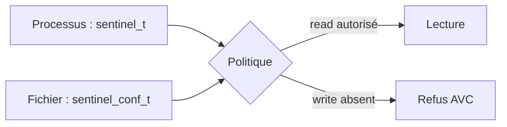
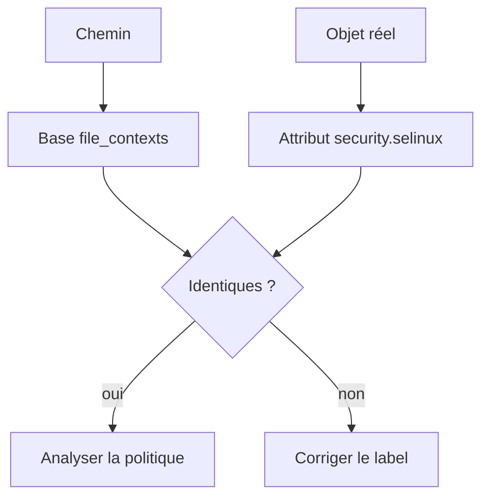

# Chapitre 6.2 — Comprendre les contextes SELinux

> **Campagne 6 — SELinux**

> *« Un label n'est pas une permission : il donne à la politique le vocabulaire nécessaire pour décider. »*

## Vous êtes ici

```text
Partie I — Construire un socle sécurisé

Campagne 6 — SELinux

    6.1 Pourquoi SELinux existe ✔
  ► 6.2 Comprendre les contextes
    6.3 Lire les politiques
    6.4 Diagnostiquer un refus
    6.5 Créer des règles
    6.6 Confiner Sentinel
```

## Objectifs pédagogiques

À l'issue de ce chapitre, vous serez capable de :

- lire les quatre champs d'un contexte SELinux ;
- distinguer le contexte d'un processus de celui d'un objet ;
- expliquer pourquoi le type est central dans la politique targeted ;
- comparer le label courant au label attendu ;
- corriger durablement un étiquetage avec `semanage fcontext` et `restorecon`.

## Pourquoi ce chapitre existe

Les permissions UNIX identifient un propriétaire et un groupe. SELinux ajoute une identité de sécurité aux processus, fichiers, répertoires, sockets, ports et autres objets contrôlés.

Cette identité ressemble à ceci :

```text
system_u:object_r:httpd_sys_content_t:s0
```

Une suite de noms mystérieux devient lisible dès que l'on sépare ses quatre champs. Surtout, il faut comprendre qu'un contexte ne donne aucun droit à lui seul : la politique décide ce que deux contextes peuvent faire ensemble.

## Processus, domaines et objets

Affichez les contextes de fichiers :

```bash
ls -lZ /etc/passwd /etc/shadow
```

Exemple :

```text
system_u:object_r:passwd_file_t:s0 /etc/passwd
system_u:object_r:shadow_t:s0      /etc/shadow
```

Affichez les processus :

```bash
ps -eZ | grep -E 'sshd|chronyd|systemd' | head
```

Exemple simplifié :

```text
system_u:system_r:sshd_t:s0    ... sshd
system_u:system_r:chronyd_t:s0 ... chronyd
```

Le type d'un processus est appelé **domaine**. `sshd_t` et `chronyd_t` peuvent tourner avec des identités UNIX privilégiées tout en recevant des autorisations SELinux différentes.



## Anatomie d'un contexte

```text
system_u:object_r:httpd_sys_content_t:s0
└─ user └─ role └────── type ──────┘└ level
```

| Champ | Exemple | Signification pratique |
| --- | --- | --- |
| utilisateur SELinux | `system_u` | identité interne SELinux, distincte de l'utilisateur Linux |
| rôle | `object_r`, `system_r` | composant du contrôle par rôles ; `object_r` est fréquent sur les fichiers |
| type ou domaine | `httpd_sys_content_t` | responsabilité fonctionnelle principale dans la politique targeted |
| niveau | `s0`, `s0:c1,c2` | sensibilité et catégories MLS/MCS |

### L'utilisateur SELinux n'est pas l'UID

Un utilisateur Linux peut être associé à un utilisateur SELinux. Cette association limite les rôles et domaines accessibles lors d'une session, mais elle ne remplace pas `/etc/passwd`.

```bash
id -Z
semanage login -l
```

Sur un poste d'administration, une session peut être `unconfined_u:unconfined_r:unconfined_t:...`. Cela ne signifie pas que SELinux est désactivé : les services ciblés restent confinés dans leurs propres domaines.

### Le rôle

Le rôle relie des utilisateurs SELinux à des domaines autorisés. Dans l'administration courante d'une politique targeted, le diagnostic porte souvent d'abord sur le type, mais un ingénieur doit savoir reconnaître `system_r`, `unconfined_r` et `object_r`.

### Le type : le vocabulaire fonctionnel

Le suffixe `_t` est une convention pour les types et domaines :

- `sshd_t` : processus SSH ;
- `httpd_t` : serveur Web ;
- `httpd_sys_content_t` : contenu Web en lecture ;
- `var_log_t` : catégorie générique de journaux ;
- `container_t` : domaine fréquent des processus conteneurisés.

Le type décrit une responsabilité, pas une permission. `httpd_sys_content_t` ne signifie pas « Apache peut lire » ; il permet à la politique de formuler cette relation.

### Le niveau : MLS et MCS

**MLS** (*Multi-Level Security*) représente des sensibilités hiérarchiques. **MCS** (*Multi-Category Security*) ajoute des catégories non nécessairement ordonnées.

```text
s0
s0:c3,c7
s0-s0:c0.c1023
```

Dans le parcours Sentinel, la plupart des règles reposeront sur le type. Les catégories restent utiles à connaître : les moteurs de conteneurs s'en servent pour empêcher deux conteneurs portant des catégories différentes d'accéder aux mêmes objets, même si leur type général est identique.

## Où les labels sont-ils stockés ?

Sur les systèmes de fichiers compatibles, le contexte d'un fichier est conservé dans un attribut étendu `security.selinux`.

```bash
getfattr -n security.selinux /etc/passwd
```

Cette culture technique explique plusieurs comportements :

- une archive ou un outil de copie peut ne pas conserver les attributs ;
- un système de fichiers qui ne les prend pas en charge nécessite une stratégie de montage ;
- une sauvegarde doit préserver ou permettre de reconstruire les labels ;
- désactiver SELinux peut produire des objets non étiquetés.

## Label courant et label attendu

SELinux connaît des correspondances persistantes entre chemins et types. Comparez le label actuel à celui attendu :

```bash
ls -Zd /var/www/html
matchpathcon /var/www/html
matchpathcon -V /var/www/html
```

`ls -Z` montre l'état présent. `matchpathcon` consulte la base de contextes de fichiers de la politique. Un désaccord indique souvent un problème d'étiquetage, pas une règle manquante.



## Copier, déplacer et créer

Le contexte est associé à l'objet, pas à la chaîne de caractères du chemin.

- un nouveau fichier reçoit généralement un type prévu pour son répertoire et son créateur ;
- une copie crée un nouvel objet et peut donc recevoir le type de destination ;
- un déplacement dans le même système de fichiers conserve souvent l'inode et son ancien label ;
- un déplacement vers un autre système de fichiers peut devenir une copie suivie d'une suppression ;
- `restorecon` réapplique le contexte attendu à l'emplacement actuel.

Cette différence explique le cas classique d'un fichier créé sous `/tmp`, puis déplacé vers un répertoire servi par une application : les permissions semblent correctes, mais le type reste celui d'un fichier temporaire.

## Corriger temporairement ou durablement

### `chcon` : modifier l'objet courant

```bash
sudo chcon -t httpd_sys_content_t /srv/site/index.html
```

La modification touche le label présent, mais ne crée pas de règle persistante pour le chemin. Un `restorecon` ou un réétiquetage peut l'annuler. `chcon` convient à une expérience contrôlée, pas à la définition durable d'une installation.

### `semanage fcontext` : déclarer l'intention

Pour les données Sentinel :

```bash
sudo semanage fcontext -a -t sentinel_var_lib_t \
  '/var/lib/sentinel(/.*)?'
sudo restorecon -RFv /var/lib/sentinel
```

La première commande ajoute une correspondance locale persistante. La seconde applique cette intention aux objets existants.

```bash
sudo semanage fcontext -l -C
```

L'option `-C` affiche les personnalisations locales, précieuses pour l'audit et le retour arrière.

> **Piège classique — Copier un type voisin**
>
> Donner à Sentinel un type prévu pour Apache uniquement parce qu'il « permet la lecture » brouille les responsabilités et peut accorder des interactions non souhaitées. Un type doit correspondre au métier de l'objet, pas seulement faire disparaître un refus.

## Laboratoire AlmaLinux

Installez les outils si nécessaire :

```bash
sudo dnf install -y policycoreutils-python-utils attr
```

### 1. Créer une arborescence de démonstration

```bash
sudo install -d -m 0750 /srv/sentinel-context-demo
printf '%s\n' 'diagnostic' > /tmp/status-sentinel-demo.json
sudo mv /tmp/status-sentinel-demo.json \
  /srv/sentinel-context-demo/status.json
```

Comparez :

```bash
ls -lZ /srv/sentinel-context-demo/status.json
matchpathcon /srv/sentinel-context-demo/status.json
```

Le chemin n'a encore aucune règle Sentinel spécifique ; le type peut donc être générique ou hérité de `/tmp`.

### 2. Déclarer un type de démonstration existant

Avant la création du type propre à Sentinel au chapitre 6.5, utilisez temporairement `var_lib_t` pour pratiquer le mécanisme :

```bash
sudo semanage fcontext -a -t var_lib_t \
  '/srv/sentinel-context-demo(/.*)?'
sudo restorecon -RFv /srv/sentinel-context-demo
ls -lZd /srv/sentinel-context-demo{,/status.json}
```

### 3. Prouver la persistance

```bash
sudo chcon -t user_tmp_t \
  /srv/sentinel-context-demo/status.json
matchpathcon -V /srv/sentinel-context-demo/status.json
sudo restorecon -v /srv/sentinel-context-demo/status.json
matchpathcon -V /srv/sentinel-context-demo/status.json
```

### 4. Nettoyer

```bash
sudo semanage fcontext -d \
  '/srv/sentinel-context-demo(/.*)?'
sudo restorecon -RFv /srv/sentinel-context-demo
```

Conservez le répertoire si vous souhaitez comparer les labels au chapitre 6.4 ; sinon, retirez-le avec votre procédure habituelle de laboratoire.

## Impact sur Sentinel

La politique finale distinguera au minimum :

| Ressource | Type envisagé | Usage |
| --- | --- | --- |
| processus | `sentinel_t` | domaine confiné |
| lanceur | `sentinel_exec_t` | transition vers le domaine |
| modules Python | `sentinel_lib_t` | code applicatif en lecture |
| configuration | `sentinel_conf_t` | lecture seule |
| état | `sentinel_var_lib_t` | création et remplacement |
| port | `sentinel_port_t` | écoute sur `8443/tcp` |

Ces noms décrivent l'architecture. Ils ne produiront des droits qu'après l'ajout de règles dans la politique.

## Synthèse

- un contexte comporte utilisateur SELinux, rôle, type et niveau ;
- le type est le principal vocabulaire de la politique targeted ;
- le type d'un processus est appelé domaine ;
- les labels de fichiers sont généralement stockés dans des attributs étendus ;
- un label courant peut différer du label attendu pour un chemin ;
- `chcon` modifie temporairement l'objet, tandis que `semanage fcontext` et `restorecon` expriment et appliquent une intention durable.

## Infographie de révision


## Pour aller plus loin

Le chapitre suivant montre comment la politique relie ces types : [6.3 — Lire les politiques SELinux](6.3-politiques-selinux.md).

Référence : [Red Hat Enterprise Linux 9 — utilisation et création de politiques SELinux](https://docs.redhat.com/en/documentation/red_hat_enterprise_linux/9/html/using_selinux/writing-a-custom-selinux-policy_using-selinux).
