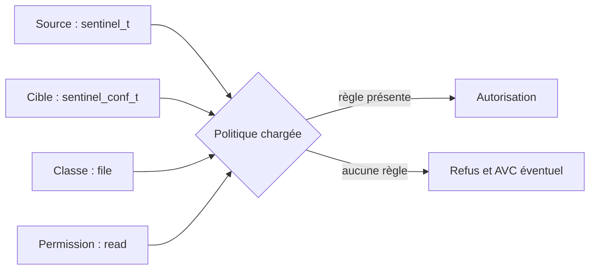
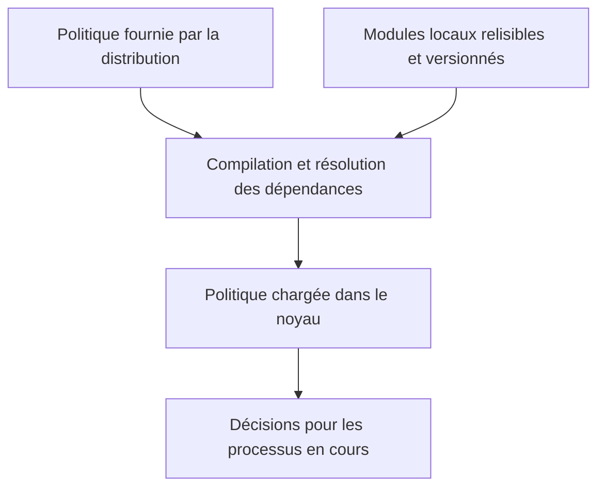
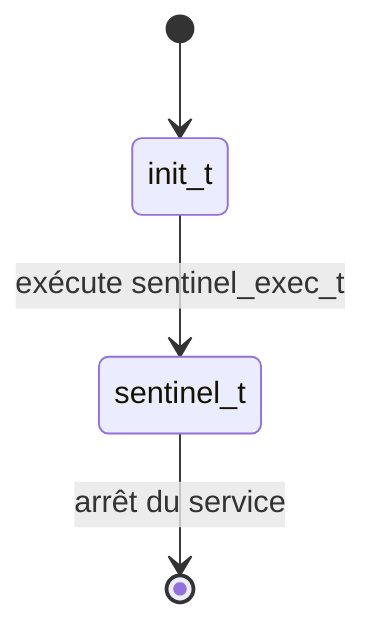

# Chapitre 6.3 — Les politiques SELinux

> **Campagne 6 — SELinux**
>
> *« Les contextes nomment les acteurs et les objets ; la politique décrit leurs interactions légitimes. »*

## Vous êtes ici

```text
Partie I — Construire un socle sécurisé

Campagne 6 — SELinux

      6.1 Pourquoi SELinux existe
      6.2 Les contextes
    ► 6.3 Les politiques
      6.4 Diagnostic des refus
      6.5 Création de règles
      6.6 Sécuriser Sentinel avec SELinux
```

## Objectifs pédagogiques

À la fin de ce chapitre, vous serez capable de :

- expliquer le rôle d'une politique SELinux et du **Type Enforcement** ;
- lire une règle à partir de son domaine source, de sa cible, de sa classe et de ses permissions ;
- distinguer règle, attribut, interface, module et booléen ;
- interroger la politique chargée sans la modifier ;
- traduire les besoins de Sentinel en contrat d'accès.

## Pourquoi ce chapitre existe

Un contexte tel que `system_u:system_r:httpd_t:s0` identifie un processus, mais ne lui accorde aucun droit à lui seul. La politique relie ce type source à un type cible et à une opération précise.

Comprendre ce langage évite deux erreurs opposées : considérer SELinux comme une boîte noire ou ajouter une autorisation trop large dès le premier refus.

## Du contexte à la décision

Lorsqu'un processus agit sur un objet, SELinux rassemble quatre informations principales :

1. le **type source**, généralement le domaine du processus ;
2. le **type cible**, porté par le fichier, le port ou l'objet concerné ;
3. la **classe d'objet**, par exemple `file`, `dir` ou `tcp_socket` ;
4. la **permission demandée**, par exemple `read`, `write` ou `name_bind`.



La décision est déterministe : à état de politique et contextes identiques, la même requête produit la même réponse.

## Le Type Enforcement

Le **Type Enforcement**, souvent abrégé **TE**, est le mécanisme central des politiques courantes. Une règle illustrative peut s'écrire ainsi :

```selinux
allow sentinel_t sentinel_conf_t:file { open read getattr map };
```

Elle se lit :

| Élément | Signification |
|---|---|
| `allow` | autoriser les opérations listées |
| `sentinel_t` | domaine du processus source |
| `sentinel_conf_t` | type de la cible |
| `file` | classe de l'objet cible |
| `{ ... }` | permissions précises accordées |

Cette règle ne désigne ni un PID ni un nom de fichier. Tout processus réellement entré dans `sentinel_t` bénéficie de cette autorisation sur tout fichier correctement étiqueté `sentinel_conf_t`.

### Un modèle à autorisations explicites

SELinux n'est pas une liste générale d'interdictions. La politique décrit les interactions permises ; l'absence d'autorisation implique un refus.

Ce **refus implicite** rend le modèle robuste, mais explique aussi pourquoi une application nouvellement confinée révèle progressivement ses besoins réels. Il faut les observer, les justifier, puis n'autoriser que le nécessaire.

### Les classes et permissions

Une même action apparente mobilise parfois plusieurs classes :

| Besoin applicatif | Classes ou permissions possibles |
|---|---|
| parcourir `/etc/sentinel/` | `dir` avec `search` |
| lire `sentinel.conf` | `file` avec `open`, `read`, `getattr` |
| remplacer `status.json` | `dir` et `file` avec création, renommage ou suppression |
| écouter sur TCP 8443 | `tcp_socket` avec `name_bind` |
| se connecter à un service | `tcp_socket` avec `name_connect` |

Une règle « lecture du fichier » ne suffit donc pas toujours : le processus doit aussi traverser ses répertoires parents.

## Une politique organisée en modules

La politique du système est compilée puis chargée dans le noyau. Les distributions la découpent en modules afin de faire évoluer un service sans réécrire l'ensemble.



La politique `targeted`, courante sur RHEL et ses dérivés, confine surtout des services ciblés. D'autres processus peuvent rester dans des domaines `unconfined_*`. Cela ne signifie pas que SELinux est inactif : la portée du confinement dépend de la politique et du domaine effectif.

```bash
sestatus
ps -eZ | head
sudo semodule -l | head
```

`semodule -l` inventorie les modules installés ; il ne montre pas à lui seul toutes les règles qu'ils ont générées.

## Réutiliser les abstractions de la distribution

Une politique maintenable évite d'accumuler des règles brutes lorsque la distribution fournit déjà une abstraction adaptée.

### Les attributs

Un attribut regroupe plusieurs types partageant un rôle. Une règle visant l'attribut s'applique à ses types membres. Cela réduit les duplications, mais une appartenance trop large peut aussi accorder plus que prévu.

### Les interfaces et macros

Une interface encapsule un ensemble cohérent de permissions. Par exemple, une interface de lecture de configuration peut inclure la traversée des répertoires et la consultation des attributs nécessaires.

Les fichiers d'interface portent généralement l'extension `.if`. Dans un module source, des appels comme `read_files_pattern(...)` ou `manage_files_pattern(...)` expriment mieux l'intention qu'une série opaque de `allow`.

### Les transitions de type

Une transition permet à un exécutable étiqueté, lancé depuis un domaine prévu, de démarrer dans son propre domaine. Pour un service systemd, l'objectif est par exemple :



Déclarer `sentinel_t` sans organiser cette transition ne confine pas automatiquement le processus.

## Les booléens : des variantes prévues

Un **booléen SELinux** active ou désactive une variante explicitement conçue dans la politique. Il permet à l'administrateur de choisir un comportement supporté sans recompilation.

```bash
getsebool -a | less
semanage boolean -l | less
getsebool httpd_can_network_connect
sudo setsebool -P httpd_can_network_connect on
```

L'option `-P` rend le choix persistant et peut prendre un peu de temps. Sans elle, le changement ne survit pas au rechargement de politique ou au redémarrage.

Un booléen n'est pas un interrupteur universel. Activer un booléen `httpd_*` pour contourner un besoin de Sentinel serait trompeur si Sentinel n'appartient pas au domaine HTTP prévu. Il faut d'abord vérifier sa description et les règles qu'il contrôle.

## Interroger la politique chargée

Les outils SETools répondent à des questions précises. Selon la distribution, installez le paquet `setools-console`.

```bash
# Types connus contenant "sshd"
seinfo -t | grep sshd

# Autorisations dont sshd_t est la source
sesearch -A -s sshd_t | head -n 30

# Règles de lecture de fichiers, si la version de sesearch accepte ces filtres
sesearch -A -s sshd_t -c file -p read
```

Une sortie vide signifie qu'aucune règle correspondant exactement aux filtres n'a été trouvée. Elle ne prouve pas que le domaine est totalement incapable d'atteindre l'objet : attributs, transitions et autres classes peuvent intervenir.

`sepolicy` fournit aussi des vues de haut niveau :

```bash
sepolicy manpage -d sshd_t
sepolicy network -a sshd_t
```

La disponibilité précise des sous-commandes dépend des paquets installés.

## Mise en pratique — lire un contrat existant

Sur une machine de laboratoire RHEL, CentOS Stream, Rocky Linux ou AlmaLinux :

```bash
sudo dnf install -y setools-console policycoreutils-python-utils
sestatus
sudo semodule -l | sort | head -n 20
ps -eZ | grep -E 'sshd|httpd' || true
```

Choisissez un domaine réellement présent, par exemple `sshd_t`, puis répondez aux questions suivantes :

1. quelles règles concernent la classe `tcp_socket` ?
2. quelles règles autorisent la lecture de fichiers ?
3. certains résultats passent-ils par un attribut ?
4. quels booléens documentés peuvent modifier son comportement ?

```bash
sesearch -A -s sshd_t -c tcp_socket
sesearch -A -s sshd_t -c file -p read | head -n 30
semanage boolean -l | grep -i ssh
```

Le but n'est pas de mémoriser la sortie, mais de formuler une question avant de lancer l'outil.

## Impact sur Sentinel

Avant d'écrire une politique, Sentinel a besoin d'un contrat fonctionnel :

| Source | Cible | Action justifiée |
|---|---|---|
| `sentinel_t` | `sentinel_conf_t` | lire la configuration |
| `sentinel_t` | `sentinel_var_lib_t` | gérer l'état local |
| `sentinel_t` | `sentinel_port_t` | écouter ou joindre TCP 8443 en local |
| `sentinel_t` | ressources système sans rapport | aucune |

Cette matrice est volontairement plus lisible qu'un fichier `.te`. Au chapitre 6.6, chaque ligne sera traduite en types, interfaces et permissions testées. La politique restera versionnée séparément de Sentinel `0.4.0`.

## Synthèse

- le contexte identifie ; la politique autorise une interaction ;
- le Type Enforcement raisonne sur une source, une cible, une classe et une permission ;
- en l'absence de règle applicable, la requête est refusée ;
- modules, attributs et interfaces rendent une politique composable ;
- un booléen n'est utilisable que pour la variante qu'il documente ;
- `sesearch`, `seinfo`, `sepolicy` et `semodule` permettent d'interroger avant de modifier.

## Infographie de révision


## Pour aller plus loin

Le chapitre suivant part d'un refus réel et apprend à déterminer s'il vient de SELinux, d'un mauvais contexte ou d'un besoin fonctionnel absent de la politique.

[Continuer vers le chapitre 6.4 — Diagnostiquer les refus SELinux](6.4-diagnostic-refus-selinux.md)

Référence : [Red Hat Enterprise Linux 9 — Writing a custom SELinux policy](https://docs.redhat.com/en/documentation/red_hat_enterprise_linux/9/html/using_selinux/writing-a-custom-selinux-policy_using-selinux).
