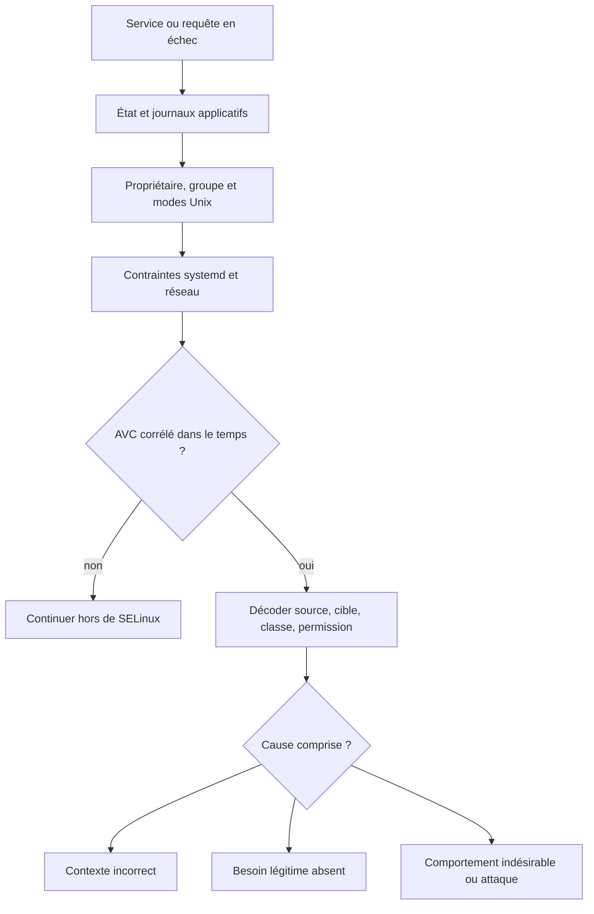

# Chapitre 6.4 — Diagnostiquer les refus SELinux

> **Campagne 6 — SELinux**
>
> *« Un AVC est une preuve à interpréter, pas une permission à recopier. »*

## Vous êtes ici

```text
Partie I — Construire un socle sécurisé

Campagne 6 — SELinux

      6.1 Pourquoi SELinux existe
      6.2 Les contextes
      6.3 Les politiques
    ► 6.4 Diagnostic des refus
      6.5 Création de règles
      6.6 Sécuriser Sentinel avec SELinux
```

## Objectifs pédagogiques

À la fin de ce chapitre, vous serez capable de :

- vérifier qu'une panne vient réellement de SELinux ;
- retrouver un refus AVC dans `auditd` ou le journal ;
- décoder la source, la cible, la classe et la permission refusée ;
- distinguer erreur d'étiquetage et règle légitime manquante ;
- appliquer une méthode de diagnostic reproductible.

## Pourquoi ce chapitre existe

« Cela fonctionne en permissif » indique que SELinux participe au problème, mais ne dit ni pourquoi ni quelle correction est sûre. Le mauvais réflexe consiste à désactiver SELinux ou à transformer immédiatement les journaux en règles.

Une enquête fiable remonte du symptôme vers l'interaction exacte, puis choisit entre correction du contexte, option de politique prévue, correction applicative ou nouvelle règle minimale.

## Toutes les pannes ne sont pas des refus SELinux

Un service peut échouer pour de nombreuses raisons : droits Unix, répertoire absent, configuration invalide, dépendance indisponible, pare-feu, sandbox systemd ou port déjà occupé.



Commencez par établir une chronologie : heure du test, commande exécutée, résultat et identité du processus.

## Une méthode en sept étapes

### 1. Reproduire une seule fois

Notez l'heure juste avant le test afin de réduire le bruit :

```bash
date --iso-8601=seconds
sudo systemctl restart sentinel
```

Évitez une boucle de redémarrage : elle multiplie les événements sans apporter de nouvelle information.

### 2. Lire l'état du service

```bash
systemctl status sentinel --no-pager
journalctl -u sentinel --since '-5 minutes' --no-pager
```

Une erreur de syntaxe de configuration ou un `Permission denied` Unix peut être visible avant toute recherche SELinux.

### 3. Vérifier les deux contrôles d'accès

```bash
getenforce
namei -l /etc/sentinel/sentinel.conf
ls -lZ /etc/sentinel/sentinel.conf
ps -eZ | grep sentinel
matchpathcon -V /etc/sentinel/sentinel.conf
```

`namei -l` montre les permissions de chaque répertoire du chemin. `matchpathcon -V` compare le contexte observé au contexte attendu par la base d'étiquetage.

### 4. Chercher les AVC récents

Avec `auditd` actif :

```bash
sudo ausearch -m AVC,USER_AVC -ts recent -i
sudo ausearch -m AVC,USER_AVC -ts recent -c sentinel -i
```

Selon le système, certains événements apparaissent aussi dans le journal du noyau :

```bash
journalctl -k --since '-5 minutes' | grep -i avc
```

L'absence de résultat ne prouve pas que SELinux est innocent : l'horodatage peut être mauvais, `auditd` peut être arrêté ou une règle `dontaudit` peut masquer un événement.

### 5. Décoder l'événement

Un événement simplifié ressemble à ceci :

```text
avc: denied { read } for pid=1842 comm="sentinel"
name="sentinel.conf" dev="vda2" ino=8732
scontext=system_u:system_r:sentinel_t:s0
tcontext=system_u:object_r:etc_t:s0
tclass=file permissive=0
```

| Champ | Question à poser |
|---|---|
| `{ read }` | quelle permission a été refusée ? |
| `comm`, `exe`, `pid` | quel processus la demandait ? |
| `name`, `path`, `dev`, `ino` | quel objet était visé ? |
| `scontext` | dans quel domaine tournait la source ? |
| `tcontext` | quel type portait la cible ? |
| `tclass` | fichier, répertoire, socket ou autre objet ? |
| `permissive` | le refus a-t-il été appliqué ou seulement journalisé ? |

`audit2why` résume la raison politique, sans décider si l'accès est souhaitable :

```bash
sudo ausearch -m AVC,USER_AVC -ts recent | audit2why
```

Avec `setroubleshoot-server`, `sealert` peut regrouper et commenter les événements :

```bash
sudo sealert -a /var/log/audit/audit.log
```

### 6. Classer la cause

Trois cas couvrent la majorité des incidents :

1. **mauvais contexte** : un fichier de configuration porte `etc_t` au lieu du type applicatif ;
2. **fonction prévue mais politique incomplète** : l'application doit réellement réaliser l'opération ;
3. **interaction inattendue** : bug, mauvaise configuration ou comportement hostile que SELinux doit continuer à bloquer.

Avant une nouvelle règle, cherchez un chemin standard, un type existant ou un booléen précisément documenté.

### 7. Corriger au plus petit périmètre et retester

Pour une erreur d'étiquetage :

```bash
sudo restorecon -v /etc/sentinel/sentinel.conf
```

Pour un emplacement personnalisé, définissez d'abord la règle persistante :

```bash
sudo semanage fcontext -a -t sentinel_conf_t '/srv/sentinel/config(/.*)?'
sudo restorecon -Rv /srv/sentinel/config
```

Rejouez exactement le même test, puis vérifiez que l'AVC a disparu sans élargir d'autres accès.

## Permissif : un instrument de mesure, pas un état final

Le mode permissif global journalise ce qui aurait été refusé, mais retire une protection à toutes les applications. Si le domaine existe déjà, rendez seulement celui-ci permissif :

```bash
sudo semanage permissive -a sentinel_t
# tests contrôlés
sudo semanage permissive -d sentinel_t
```

Cette technique reste temporaire et doit être tracée. Elle est préférable à `setenforce 0`, mais elle autorise tout de même les actions interdites du domaine pendant le test.

### Le cas des règles `dontaudit`

Certaines opérations refusées, jugées trop bruyantes, ne sont pas journalisées. Pour une investigation courte :

```bash
sudo semodule -DB
# reproduire une fois et collecter les AVC
sudo semodule -B
```

`-DB` désactive les règles `dontaudit`; `-B` reconstruit la politique et les réactive. Ne laissez pas le système dans cet état de diagnostic.

## Mise en pratique — provoquer puis corriger un mauvais contexte

Ce laboratoire utilise Apache parce que sa politique existe déjà. Il illustre un défaut d'étiquette, pas la création d'une règle.

```bash
sudo dnf install -y httpd policycoreutils-python-utils
printf '%s\n' 'Sentinel AVC lab' | sudo tee /var/www/html/sentinel-avc-demo.html
sudo chcon -t user_tmp_t /var/www/html/sentinel-avc-demo.html
ls -Z /var/www/html/sentinel-avc-demo.html
matchpathcon -V /var/www/html/sentinel-avc-demo.html
```

Démarrez le service et demandez la page localement :

```bash
sudo systemctl enable --now httpd
curl -i http://127.0.0.1/sentinel-avc-demo.html
sudo ausearch -m AVC,USER_AVC -ts recent -c httpd -i
```

Le résultat attendu est un refus HTTP et un AVC montrant `httpd_t` face à `user_tmp_t`. Si le service utilise un autre nom de commande, relancez la recherche sans `-c httpd`.

La politique Apache sait déjà lire les contenus correctement étiquetés. La bonne correction est donc :

```bash
sudo restorecon -v /var/www/html/sentinel-avc-demo.html
ls -Z /var/www/html/sentinel-avc-demo.html
curl -i http://127.0.0.1/sentinel-avc-demo.html
sudo ausearch -m AVC,USER_AVC -ts recent -c httpd -i
```

La seconde requête doit réussir et ne créer aucun nouvel AVC correspondant. Nettoyez ensuite :

```bash
sudo rm /var/www/html/sentinel-avc-demo.html
```

## Le piège `audit2allow`

`audit2allow` traduit des événements en règles syntaxiquement plausibles. Il ne connaît ni l'architecture prévue ni la sensibilité de la cible. Si une application compromise tente de lire `/etc/shadow`, l'outil peut proposer la règle correspondant à cette tentative.

La question correcte n'est donc pas « comment autoriser cet AVC ? », mais « cette interaction appartient-elle au contrat fonctionnel ? ».

## Impact sur Sentinel

Pour Sentinel, conservez une fiche d'incident minimale :

```text
Heure et commande de reproduction :
Symptôme applicatif :
Domaine source :
Type et classe de la cible :
Permission refusée :
Besoin fonctionnel associé :
Correction retenue :
Preuve après correction :
```

Cette trace fera le lien entre la matrice du chapitre 6.3 et le module construit au chapitre 6.6. Un AVC sans besoin associé reste un refus attendu.

## Synthèse

- établissez d'abord que le problème vient de SELinux ;
- corrélez l'AVC avec une reproduction horodatée ;
- lisez source, cible, classe et permission avant tout outil de génération ;
- corrigez un mauvais contexte avec `restorecon` et une règle `fcontext` persistante ;
- préférez le permissif par domaine pour une observation temporaire ;
- une règle suggérée n'est jamais une preuve de légitimité.

## Infographie de révision


## Pour aller plus loin

Le prochain chapitre montre comment écrire et empaqueter une autorisation réellement justifiée.

[Continuer vers le chapitre 6.5 — Créer des règles SELinux](6.5-creation-regles-selinux.md)

Référence : [Red Hat Enterprise Linux 9 — Using SELinux](https://docs.redhat.com/en/documentation/red_hat_enterprise_linux/9/html/using_selinux/getting-started-with-selinux_using-selinux).
