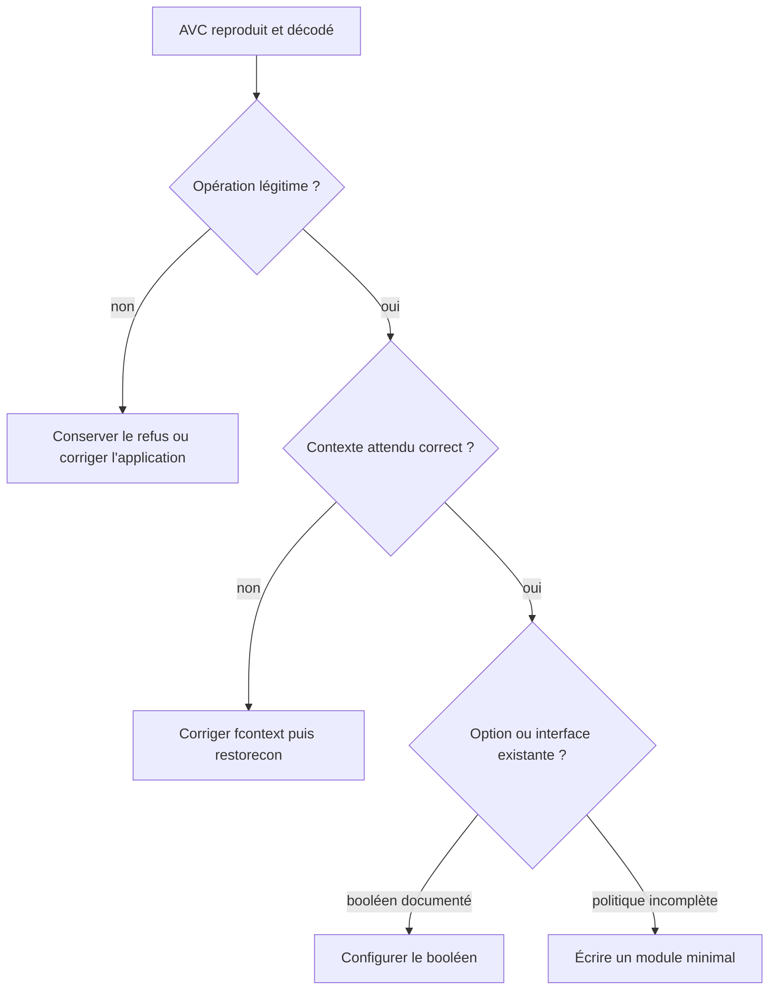
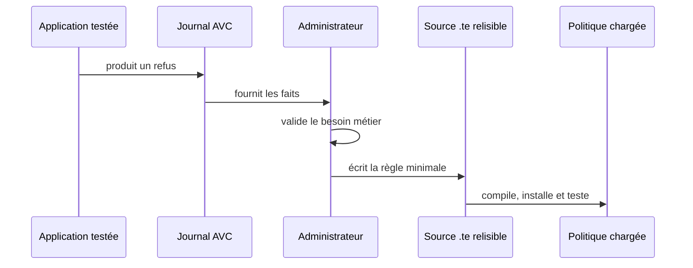

# Chapitre 6.5 — Créer des règles SELinux

> **Campagne 6 — SELinux**
>
> *« Une règle utile naît d'un besoin compris, pas d'un journal copié. »*

## Vous êtes ici

```text
Partie I — Construire un socle sécurisé

Campagne 6 — SELinux

      6.1 Pourquoi SELinux existe
      6.2 Les contextes
      6.3 Les politiques
      6.4 Diagnostic des refus
    ► 6.5 Création de règles
      6.6 Sécuriser Sentinel avec SELinux
```

## Objectifs pédagogiques

À la fin de ce chapitre, vous serez capable de :

- décider si une nouvelle règle est réellement nécessaire ;
- distinguer les fichiers `.te`, `.if`, `.fc` et le module compilé `.pp` ;
- produire une base de politique avec `sepolicy generate` ;
- utiliser `audit2allow` comme aide à l'analyse, sans déléguer la décision ;
- compiler, installer, interroger et retirer un module local.

## Pourquoi ce chapitre existe

Après avoir observé un refus légitime, il faut transformer le besoin en politique maintenable. Une commande qui « fait disparaître l'AVC » n'est pas encore une solution : il faut pouvoir relire la règle, la reconstruire, la tester et la retirer.

Ce chapitre présente le cycle de développement. La politique complète de Sentinel viendra ensuite.

## Avant d'écrire une règle

Suivez cet ordre de décision :



Une règle locale est justifiée lorsque l'application utilise un chemin ou une interaction métier que la politique de distribution ne connaît pas.

## Préparer l'atelier

Sur une distribution de la famille RHEL :

```bash
sudo dnf install -y \
  selinux-policy-devel \
  policycoreutils-python-utils \
  setools-console \
  checkpolicy
mkdir -p ~/selinux-lab
cd ~/selinux-lab
```

Travaillez dans un répertoire versionné. Les sources constituent le livrable ; un `.pp` installé seul est difficile à auditer et à reproduire.

## Les quatre fichiers à connaître

| Extension | Rôle |
|---|---|
| `.te` | types, domaines et règles du module |
| `.if` | interfaces réutilisables par d'autres modules |
| `.fc` | correspondances persistantes entre chemins et types |
| `.pp` | paquet de politique compilé et installable |

Des fichiers auxiliaires peuvent être générés pendant la compilation. Ils ne remplacent pas ces sources.

### Le fichier `.te`

Un squelette pédagogique peut ressembler à ceci :

```selinux
policy_module(sentinel_demo, 0.1)

type sentinel_demo_t;
type sentinel_demo_exec_t;
init_daemon_domain(sentinel_demo_t, sentinel_demo_exec_t)

type sentinel_demo_conf_t;
files_config_file(sentinel_demo_conf_t)

read_files_pattern(
    sentinel_demo_t,
    sentinel_demo_conf_t,
    sentinel_demo_conf_t
)
```

`policy_module` nomme et versionne le module. `init_daemon_domain` organise le domaine d'un service et sa transition depuis l'exécutable. `files_config_file` classe un type comme fichier de configuration. `read_files_pattern` exprime l'intention de lecture avec les permissions associées.

Ce fragment illustre la structure ; il ne constitue pas encore une politique Sentinel complète.

### Le fichier `.fc`

Les expressions régulières relient les chemins aux types :

```text
/opt/sentinel/bin/sentinel    --  gen_context(system_u:object_r:sentinel_demo_exec_t,s0)
/etc/sentinel(/.*)?               gen_context(system_u:object_r:sentinel_demo_conf_t,s0)
```

Après installation du module, `restorecon` applique ces contextes. Le fichier `.fc` décrit la vérité persistante ; il évite de dépendre d'un `chcon` manuel.

### Le fichier `.if`

Une interface expose une capacité à d'autres modules. Pour une application isolée, il peut rester très court. Lorsque plusieurs composants doivent lire la configuration de Sentinel, une interface nommée et commentée évite qu'ils dépendent de ses détails internes.

```selinux
interface(`sentinel_demo_read_config',`
    gen_require(`
        type sentinel_demo_conf_t;
    ')

    read_files_pattern($1, sentinel_demo_conf_t, sentinel_demo_conf_t)
')
```

Le paramètre `$1` représente le domaine appelant. Une interface doit rester plus stable que les règles qu'elle encapsule.

## Générer une base avec `sepolicy`

`sepolicy generate` prépare un ensemble de fichiers adaptés au type d'application :

```bash
mkdir -p ~/selinux-lab/sentinel-generated
cd ~/selinux-lab/sentinel-generated
sepolicy generate --init /opt/sentinel/bin/sentinel
ls -la
```

Exécutez cette commande sur une machine où l'exécutable existe. L'outil examine le binaire et produit un point de départ, souvent accompagné d'un script d'installation et d'une page de manuel.

Il ne connaît cependant pas le contrat fonctionnel de l'application. Lisez chaque type, chemin et permission générés avant compilation.

## Utiliser `audit2allow` sans automatiser la confiance

Pour expliquer des AVC :

```bash
sudo ausearch -m AVC,USER_AVC -ts recent -c sentinel | audit2why
```

Pour afficher une proposition fondée sur des interfaces connues :

```bash
sudo ausearch -m AVC,USER_AVC -ts recent -c sentinel | audit2allow -R
```

Pour générer un module de travail :

```bash
sudo ausearch -m AVC,USER_AVC -ts recent -c sentinel \
  | audit2allow -M sentinel_local
```

Cette dernière commande produit notamment `sentinel_local.te` et `sentinel_local.pp`. N'installez pas automatiquement le `.pp`. Ouvrez le `.te`, associez chaque autorisation à un besoin documenté, puis réduisez la proposition.



Une application compromise peut volontairement provoquer des AVC vers des secrets. `audit2allow` traduirait aussi ces tentatives : il produit de la syntaxe, pas une décision de sécurité.

## Écrire avec des interfaces ou avec `allow`

Préférez une interface de distribution quand elle exprime exactement le besoin : elle documente l'intention et suit mieux les évolutions internes de la politique.

Une règle brute reste utile lorsqu'aucune interface précise n'existe :

```selinux
allow sentinel_demo_t sentinel_demo_conf_t:file { getattr open read map };
```

Dans tous les cas, évitez :

- les types génériques comme `etc_t` ou `var_t` comme cibles larges ;
- les ensembles de permissions recopiés sans justification ;
- les attributs très vastes uniquement pour faire passer un test ;
- les autorisations préparées pour une fonctionnalité future.

## Compiler et gérer le cycle de vie

Dans un répertoire contenant `sentinel_demo.te`, `.fc` et éventuellement `.if` :

```bash
make -f /usr/share/selinux/devel/Makefile sentinel_demo.pp
sudo semodule -i sentinel_demo.pp
sudo semodule -l | grep sentinel_demo
```

Appliquez ensuite les contextes déclarés :

```bash
sudo restorecon -Rv /opt/sentinel/bin /etc/sentinel
```

Interrogez la politique effectivement chargée :

```bash
sesearch -A -s sentinel_demo_t
```

Pour revenir en arrière :

```bash
sudo semodule -r sentinel_demo
```

Retirer le module ne restaure pas automatiquement tous les contextes de fichiers ni les associations de ports créées séparément. Le plan de retour arrière doit les inventorier.

## Mise en pratique — revue d'un module généré

Créez une branche de travail et générez un squelette pour une application de laboratoire ou pour l'exécutable Sentinel installé.

Pour chaque proposition du `.te`, complétez ce tableau avant compilation :

| Source | Cible | Classe et permission | Besoin observable | Décision |
|---|---|---|---|---|
| domaine applicatif | type de configuration | lecture de fichier | démarrage et rechargement | conserver |
| domaine applicatif | type système sensible | lecture | aucun | refuser |
| domaine applicatif | type d'état | création et remplacement | mise à jour atomique | conserver |

Puis :

1. remplacez les chemins génériques du `.fc` par des chemins exacts ;
2. retirez les autorisations sans test associé ;
3. compilez le module ;
4. installez-le sur la machine de laboratoire ;
5. lancez un cas passant et au moins un refus attendu ;
6. conservez le `.te`, le `.fc`, les commandes et les preuves.

## Impact sur Sentinel

Sentinel gardera sa version applicative `0.4.0`. La politique commencera en version `0.1` :

```text
sentinel-selinux/
├── README.md
├── sentinel.te
├── sentinel.fc
├── sentinel.if
└── tests/
    └── acceptance.md
```

Séparer les versions évite de faire croire qu'une modification de politique change l'API ou les données de l'application. Le chapitre suivant transforme la matrice d'accès en ce livrable.

## Synthèse

- cherchez d'abord une erreur de contexte ou une option de politique prévue ;
- versionnez les sources `.te`, `.fc` et `.if`, pas seulement le `.pp` ;
- utilisez les interfaces pour exprimer une intention stable ;
- considérez `sepolicy generate` et `audit2allow` comme des aides à relire ;
- compilez, installez, testez puis prévoyez le retrait du module ;
- n'autorisez que les opérations prouvées par le jalon actuel.

## Pour aller plus loin

Le dernier chapitre applique ce cycle à Sentinel `0.4.0` et construit une politique `0.1` testable et réversible.

[Continuer vers le chapitre 6.6 — Sécuriser Sentinel avec SELinux](6.6-securiser-sentinel-selinux.md)

Référence : [Red Hat Enterprise Linux 9 — Writing a custom SELinux policy](https://docs.redhat.com/en/documentation/red_hat_enterprise_linux/9/html/using_selinux/writing-a-custom-selinux-policy_using-selinux).
