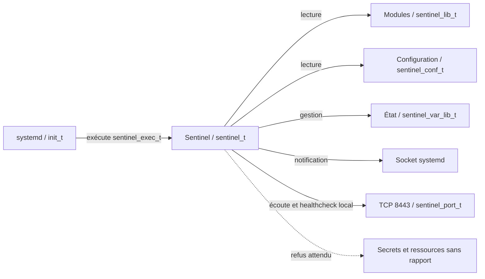
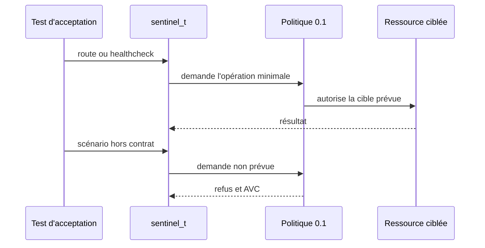

# Chapitre 6.6 — Sécuriser Sentinel avec SELinux

> **Campagne 6 — SELinux**
>
> *« Le confinement utile autorise la mission du service et rend le reste explicitement imprévu. »*

## Vous êtes ici

```text
Partie I — Construire un socle sécurisé

Campagne 6 — SELinux

      6.1 Pourquoi SELinux existe
      6.2 Les contextes
      6.3 Les politiques
      6.4 Diagnostic des refus
      6.5 Création de règles
    ► 6.6 Sécuriser Sentinel avec SELinux
```

## Objectifs pédagogiques

À la fin de ce chapitre, vous serez capable de :

- construire le modèle d'accès de Sentinel `0.4.0` ;
- définir ses domaines, types de fichiers et type de port ;
- mettre un domaine en observation sans désactiver SELinux globalement ;
- vérifier les comportements permis et les refus attendus ;
- livrer une politique versionnée, testable et réversible.

## Pourquoi ce chapitre existe

Sentinel est devenu un service systemd résilient en campagne 5. Il possède donc assez de surface concrète pour être confiné : code, configuration, état local, notification systemd et port réseau.

La campagne 6 ne modifie pas le code Python. Elle ajoute une politique SELinux `0.1` autour de Sentinel `0.4.0`. Les certificats de la campagne 7 et les identités de la campagne 8 ne doivent pas être autorisés par anticipation.

## État fonctionnel à confiner

Le service installé doit pouvoir :

- exécuter `/opt/sentinel/bin/sentinel` et importer les modules Python voisins ;
- lire `/etc/sentinel/sentinel.conf` ;
- créer et remplacer `/var/lib/sentinel/status.json` ;
- notifier systemd via la socket indiquée par `NOTIFY_SOCKET` ;
- écouter sur TCP 8443 et joindre ce point local pour son healthcheck ;
- écrire sur les sorties héritées que systemd collecte dans le journal.

Il n'a pas besoin de lire les comptes locaux, les clés privées du système ou l'ensemble de `/etc`.



## Construire la matrice d'accès

Une matrice précède toujours les règles :

| Source | Cible | Opérations nécessaires | Preuve |
|---|---|---|---|
| `sentinel_t` | `sentinel_exec_t` | transition au lancement | domaine visible dans `ps -eZ` |
| `sentinel_t` | `sentinel_lib_t` | lire et mapper les modules | service démarré |
| `sentinel_t` | `sentinel_conf_t` | lire la configuration | démarrage avec le fichier de référence |
| `sentinel_t` | `sentinel_var_lib_t` | créer, lire, remplacer l'état | `status.json` mis à jour |
| `sentinel_t` | socket systemd | envoyer `READY=1` et `WATCHDOG=1` | unité active sans délai |
| `sentinel_t` | `sentinel_port_t` | lier TCP 8443 et s'y connecter localement | routes et healthcheck fonctionnels |

Cette table décrit le résultat attendu. Les interfaces exactes peuvent varier avec la version de la politique de distribution ; elles doivent être validées sur la plateforme cible.

## Créer le squelette de politique

Commencez par le générateur, puis relisez ses résultats :

```bash
mkdir -p ~/sentinel-selinux
cd ~/sentinel-selinux
sepolicy generate --init /opt/sentinel/bin/sentinel
```

Renommez et simplifiez les sources si nécessaire pour obtenir un dépôt clair :

```text
sentinel-selinux/
├── README.md
├── sentinel.te
├── sentinel.fc
├── sentinel.if
└── tests/
    └── acceptance.md
```

Le générateur fournit une base dépendante de la machine. Les extraits suivants donnent l'intention à retrouver, pas un module universel à installer sans compilation ni tests.

## Définir domaine et types

Dans `sentinel.te`, la déclaration de départ peut prendre cette forme :

```selinux
policy_module(sentinel, 0.1)

type sentinel_t;
type sentinel_exec_t;
init_daemon_domain(sentinel_t, sentinel_exec_t)

type sentinel_lib_t;
files_type(sentinel_lib_t)

type sentinel_conf_t;
files_config_file(sentinel_conf_t)

type sentinel_var_lib_t;
files_type(sentinel_var_lib_t)

type sentinel_port_t;
corenet_port(sentinel_port_t)
```

`init_daemon_domain` prépare la transition depuis le gestionnaire de services. Les types distincts empêchent qu'une règle de lecture de configuration devienne une règle d'écriture sur l'état.

Ajoutez ensuite des interfaces exprimant les besoins sur les fichiers :

```selinux
read_files_pattern(sentinel_t, sentinel_lib_t, sentinel_lib_t)
read_files_pattern(sentinel_t, sentinel_conf_t, sentinel_conf_t)

manage_dirs_pattern(
    sentinel_t,
    sentinel_var_lib_t,
    sentinel_var_lib_t
)
manage_files_pattern(
    sentinel_t,
    sentinel_var_lib_t,
    sentinel_var_lib_t
)
```

La mise à jour atomique de `status.json` peut créer un fichier temporaire, le renommer puis supprimer l'ancienne entrée. Testez ce cycle complet : un simple droit `write` sur le fichier existant serait insuffisant.

## Déclarer les chemins persistants

Dans `sentinel.fc` :

```text
/opt/sentinel/bin/sentinel    --  gen_context(system_u:object_r:sentinel_exec_t,s0)
/opt/sentinel/bin/[^/]+\.py   --  gen_context(system_u:object_r:sentinel_lib_t,s0)
/etc/sentinel(/.*)?               gen_context(system_u:object_r:sentinel_conf_t,s0)
/var/lib/sentinel(/.*)?           gen_context(system_u:object_r:sentinel_var_lib_t,s0)
```

Adaptez l'expression des modules au contenu réellement installé. N'étiquetez pas tout `/opt` ou tout `/etc` avec un type Sentinel.

Après installation du module :

```bash
sudo restorecon -Rv /opt/sentinel/bin /etc/sentinel /var/lib/sentinel
ls -lZ /opt/sentinel/bin /etc/sentinel /var/lib/sentinel
```

## Autoriser le réseau utile

Le domaine a besoin de créer une socket TCP, de lier le port applicatif et de joindre le serveur local pour son healthcheck. Une base représentative est :

```selinux
allow sentinel_t self:tcp_socket create_stream_socket_perms;
corenet_tcp_bind_generic_node(sentinel_t)
allow sentinel_t sentinel_port_t:tcp_socket { name_bind name_connect };
```

Les interfaces réseau disponibles dépendent de la distribution. Interrogez les sources installées et la politique chargée avant de retenir ces lignes.

Associez ensuite TCP 8443 au type de port. Vérifiez d'abord s'il possède déjà une association :

```bash
sudo semanage port -l | grep -w 8443
```

S'il n'est pas déclaré :

```bash
sudo semanage port -a -t sentinel_port_t -p tcp 8443
```

S'il est déjà déclaré sous un autre type et que la modification est compatible avec les autres services qui l'utilisent :

```bash
sudo semanage port -m -t sentinel_port_t -p tcp 8443
```

Ne réaffectez pas silencieusement un port partagé. Une collision doit conduire à revoir le port ou l'architecture.

## Traiter la notification systemd

Sentinel utilise `Type=notify` et le watchdog. L'autorisation exacte de la socket systemd dépend des interfaces fournies par la politique installée.

1. recherchez une interface documentée dans `/usr/share/selinux/devel/include/` ;
2. démarrez le service avec le seul domaine Sentinel en permissif ;
3. corrélez l'AVC avec l'appel de notification ;
4. ajoutez l'interface la plus étroite ;
5. repassez le domaine en application.

N'accordez pas un accès général à `var_run_t` : cette catégorie contient les ressources d'exécution de nombreux services.

## Compiler et installer la politique `0.1`

```bash
cd ~/sentinel-selinux
make -f /usr/share/selinux/devel/Makefile sentinel.pp
sudo semodule -i sentinel.pp
sudo semodule -l | grep '^sentinel'
sudo restorecon -Rv /opt/sentinel/bin /etc/sentinel /var/lib/sentinel
```

Vérifiez aussi la correspondance du port et les types attendus :

```bash
sudo semanage port -l | grep sentinel_port_t
matchpathcon -V /opt/sentinel/bin/sentinel
matchpathcon -V /etc/sentinel/sentinel.conf
matchpathcon -V /var/lib/sentinel/status.json
```

## Observer uniquement le domaine Sentinel

Pendant la mise au point :

```bash
sudo semanage permissive -a sentinel_t
sudo systemctl restart sentinel
sudo ausearch -m AVC,USER_AVC -ts recent -c sentinel -i
```

Exercez toutes les fonctions acquises, pas seulement le démarrage. Chaque AVC doit être associé à une ligne de la matrice ou rester refusé.

Quand les règles sont relues :

```bash
sudo semanage permissive -d sentinel_t
sudo systemctl restart sentinel
getenforce
ps -eZ | grep sentinel
```

Le processus doit apparaître dans `sentinel_t` alors que le système reste en mode `Enforcing`.

## Prouver le fonctionnement et le confinement

### Cas passants

Adaptez l'option de configuration si votre unité la fournit autrement :

```bash
systemctl status sentinel --no-pager
curl --fail http://127.0.0.1:8443/health
curl --fail http://127.0.0.1:8443/ready
sudo -u sentinel /opt/sentinel/bin/sentinel \
  --config /etc/sentinel/sentinel.conf --healthcheck
sudo ausearch -m AVC,USER_AVC -ts recent -c sentinel -i
```

Les routes doivent répondre, le healthcheck doit réussir et aucun AVC inattendu ne doit apparaître.

Exécutez aussi les tests cumulés du checkpoint applicatif depuis les sources :

```bash
python3 -m unittest discover \
  -s sentinel/labs/sentinel-app/checkpoints/0.4.0/tests -v
```

### Refus attendus

La politique doit également prouver ce qu'elle n'accorde pas. Interrogez par exemple la lecture du type des mots de passe chiffrés :

```bash
sesearch -A -s sentinel_t -t shadow_t -c file -p read
```

Une sortie vide est attendue pour ce filtre. Vérifiez également qu'aucune règle générale vers `etc_t` ou `var_t` n'a été introduite pour masquer un mauvais contexte.

Enfin, rendez temporairement illisible une copie de configuration placée sous un type non prévu et confirmez que le démarrage échoue avec un AVC. Revenez ensuite au fichier normal avec `restorecon`.



## Retour arrière

Documentez les valeurs observées avant installation. Un retour arrière du laboratoire comprend :

```bash
sudo semanage permissive -d sentinel_t
sudo semodule -r sentinel
sudo semanage port -d -p tcp 8443
```

La suppression de l'association de port n'est correcte que si votre procédure l'a créée et qu'aucun autre module ne la possède. Après retrait, réappliquez les contextes standards avec `restorecon` sur les chemins concernés et contrôlez le résultat.

## Jalon Sentinel

### État de départ

Sentinel `0.4.0` fournit le serveur HTTP, les routes `/health` et `/ready`, l'état local, l'intégration systemd, les journaux structurés, le watchdog et l'arrêt propre.

### Besoin

Une compromission du processus ne doit pas hériter de tous les accès de l'utilisateur de service. Les fichiers, le port et les interactions système doivent former un contrat contrôlé par SELinux.

### Modification

Le code reste en `0.4.0`. Un livrable séparé `sentinel-selinux` `0.1` ajoute :

- le domaine `sentinel_t` et sa transition depuis `sentinel_exec_t` ;
- les types du code, de la configuration, de l'état et du port ;
- les règles de fichiers, réseau et notification strictement observées ;
- la procédure d'installation, de test et de retrait.

### Migration

Les chemins, options, routes et données restent compatibles. L'installation du module est suivie de `restorecon`, de l'association contrôlée du port 8443 et d'un redémarrage de l'unité.

### Preuves

- module compilé et chargé ;
- processus visible dans `sentinel_t` en mode `Enforcing` ;
- routes, état local, notification systemd et healthcheck fonctionnels ;
- tests Python `0.4.0` réussis ;
- aucun AVC inattendu après la campagne de tests ;
- aucune lecture de `shadow_t` accordée.

### Échecs attendus

- une configuration portant un type non prévu est refusée ;
- un accès à une ressource système hors contrat reste refusé ;
- le service échoue si son port n'est pas correctement associé ou autorisé.

### Livrable

Sentinel `0.4.0` et `sentinel-selinux` `0.1`, accompagnés de leurs sources et preuves, deviennent l'entrée de la campagne 7. Cette campagne étendra la politique seulement lorsque les fichiers TLS existeront réellement.

## Synthèse

- la politique part des fonctions réellement présentes dans Sentinel `0.4.0` ;
- le code, la configuration, l'état et le port reçoivent des types distincts ;
- les contextes de chemins sont persistants grâce au fichier `.fc` ;
- l'observation se fait en permissif par domaine, puis les tests se terminent en `Enforcing` ;
- une preuve comporte des cas passants et des refus attendus ;
- la politique `0.1` est versionnée séparément de l'application.

## Infographie de révision


## Pour aller plus loin

La campagne 7 introduit les certificats, HTTPS et l'authentification TLS. La politique SELinux n'évoluera qu'après observation de ces nouveaux besoins.

[Continuer vers la campagne 7 — TLS, certificats et PKI](../campagne_07/7.1-comprendre-cryptographie-appliquee.md)

Référence : [Red Hat Enterprise Linux 9 — Writing a custom SELinux policy](https://docs.redhat.com/en/documentation/red_hat_enterprise_linux/9/html/using_selinux/writing-a-custom-selinux-policy_using-selinux).
