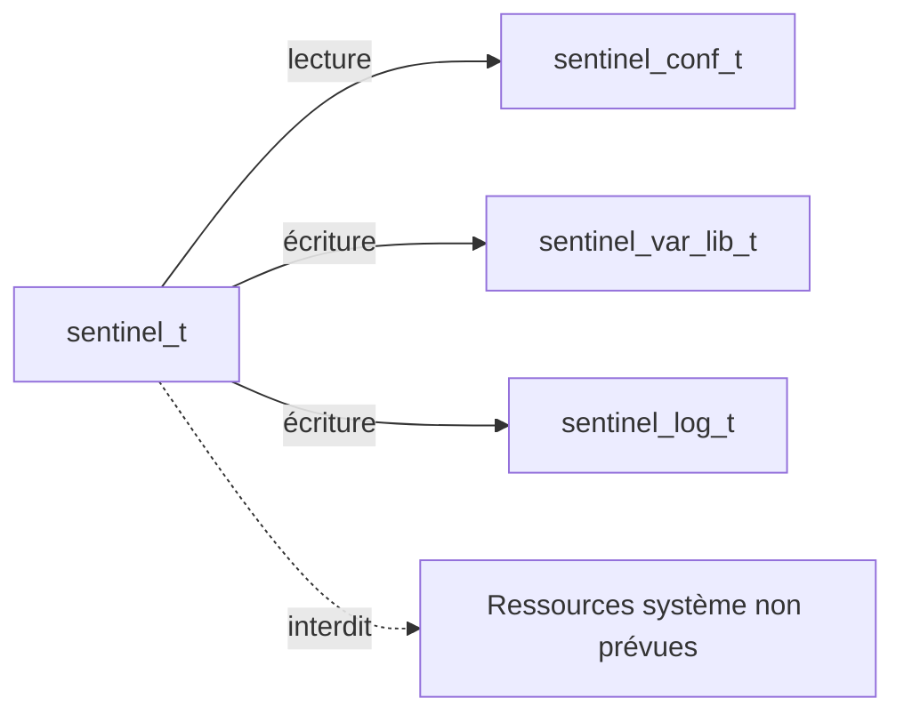
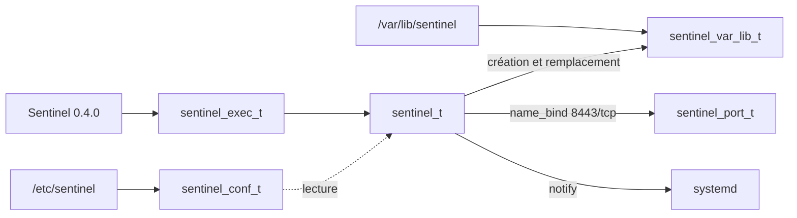
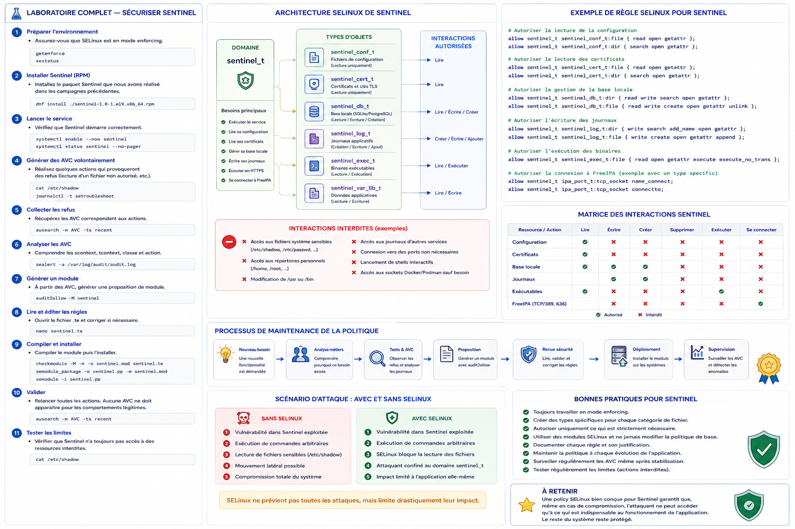

# Chapitre 6.6 — Sécuriser Sentinel avec SELinux

> **Campagne 6 — SELinux**

> *« Une politique SELinux bien conçue ne cherche pas à empêcher toutes les attaques. Elle cherche à faire en sorte qu'une attaque réussie ne puisse jamais devenir une compromission totale du système. »*

---

## Vous êtes ici

```text
Partie I — Construire un socle sécurisé

Campagne 6 — SELinux

      6.1 Pourquoi SELinux existe
      6.2 Les contextes
      6.3 Les politiques
      6.4 Diagnostic des refus
      6.5 Création de règles
    ► 6.6 Sécuriser Sentinel avec SELinux
```

---

## Objectifs pédagogiques

À la fin de ce chapitre, vous serez capable de :

- concevoir une politique SELinux adaptée à une application métier ;
- identifier les domaines et les types nécessaires à Sentinel ;
- appliquer le principe du moindre privilège à une architecture complète ;
- intégrer SELinux avec toutes les protections étudiées depuis le début de l'ouvrage ;
- comprendre comment les entreprises développent une politique de sécurité durable.

---

## Pourquoi ce chapitre existe

Depuis le début de cette campagne,

nous avons appris :

- pourquoi SELinux existe ;
- ce que sont les contextes ;
- comment fonctionnent les politiques ;
- comment diagnostiquer une AVC ;
- comment créer une règle.

Mais jusqu'à présent,

nous avons travaillé sur des exemples volontairement génériques.

L'objectif de ce dernier chapitre est différent.

Nous allons construire la politique SELinux de **Sentinel**.

Autrement dit,

nous allons réunir toutes les notions étudiées depuis le début de la campagne dans une architecture cohérente.

Ce chapitre représente la synthèse de tout ce que vous venez d'apprendre.

---

## Revenir sur l'architecture de Sentinel

Rappelons rapidement l'état actuel de notre application.

Sentinel `0.4.0` est un service système. À ce stade, il :

- écoute sur un port HTTP filtré ;
- écrit des journaux ;
- conserve une base locale ;
- fonctionne sous systemd.

Les certificats, HTTPS et l'authentification mutuelle seront ajoutés en campagne 7. L'intégration à FreeIPA viendra en campagne 8. La politique SELinux doit évoluer avec ces besoins : elle ne doit pas autoriser aujourd'hui des accès dont le code `0.4.0` ne se sert pas encore.

Graphiquement,

son architecture ressemble à ceci.



Chaque interaction devra maintenant être analysée du point de vue de SELinux.

---

## Première étape : identifier les domaines

Notre politique commence par identifier les processus.

Nous définissons un domaine principal.

```text
sentinel_t
```

Tous les processus Sentinel exécuteront leurs opérations dans ce domaine.

Autrement dit,

chaque décision SELinux sera prise à partir de cette identité.

---

## Deuxième étape : identifier les ressources

Nous pouvons ensuite classer les ressources actuelles et celles déjà prévues par la trajectoire. Cette taxonomie prépare les évolutions, mais la politique `0.1` n'autorise que les accès réellement exercés par Sentinel `0.4.0`. Le type des certificats ne sera utilisé qu'en campagne 7.

Par exemple.

Configuration.

```text
sentinel_conf_t
```

---

Journaux.

```text
sentinel_log_t
```

---

Base locale.

```text
sentinel_db_t
```

---

Certificats.

```text
sentinel_cert_t
```

---

Exécutables.

```text
sentinel_exec_t
```

---

Répertoire de travail.

```text
sentinel_var_lib_t
```

Nous retrouvons exactement la logique étudiée dans le chapitre consacré aux contextes.

Chaque catégorie reçoit son propre type.

---

## Troisième étape : décrire les interactions

Nous pouvons maintenant exprimer les besoins réels.

Configuration.

```text
Lecture

uniquement
```

---

Certificats.

```text
Lecture

uniquement
```

---

Base locale.

```text
Lecture

Écriture

Création
```

---

Journaux.

```text
Création

Ajout

Écriture
```

---

Port applicatif 8443, utilisé en HTTP puis en HTTPS.

```text
Bind

Listen

Accept
```

Aucune autre interaction ne sera autorisée tant qu'un besoin métier ne l'imposera pas.

---

## Ce qui sera interdit

Une bonne politique décrit aussi ce qui ne doit jamais arriver.

Par exemple.

Sentinel ne doit jamais :

- modifier `/usr/bin` ;
- accéder aux répertoires personnels ;
- lire `/etc/shadow` ;
- accéder aux journaux d'autres services ;
- modifier Firewalld ;
- ouvrir des ports arbitraires ;
- lancer des shells interactifs ;
- écrire dans `/etc`.

Toutes ces opérations resteront interdites.

Même si une vulnérabilité permet l'exécution de code,

le noyau continuera de bloquer ces comportements.

---

## Une représentation globale

Notre politique peut désormais être résumée ainsi.

```text
                     sentinel_t

                           │

        ┌──────────────────┼──────────────────┐

        ▼                  ▼                  ▼

sentinel_conf_t     sentinel_cert_t    sentinel_db_t

 Lecture             Lecture           Lecture / Écriture

        │                  │                  │

        └──────────────────┼──────────────────┘

                           ▼

                    Fonctionnement normal

                           │

             Toute autre interaction

                           ▼

                         REFUS
```

Nous obtenons ainsi une véritable cartographie de confiance.

Chaque autorisation possède une justification.

## 💎 Le point d'expertise

### Une politique SELinux ne protège pas Sentinel. Elle protège le reste du système contre Sentinel.

Cette phrase peut sembler paradoxale.

Pourtant,

elle résume parfaitement la philosophie de SELinux.

Prenons une vulnérabilité Remote Code Execution.

L'attaquant obtient l'exécution de commandes dans Sentinel.

À ce stade,

l'application est déjà compromise.

SELinux n'a pas empêché cette première étape.

En revanche,

il empêche que cette compromission se transforme en compromission du système.

Visualisons la différence.

Sans SELinux.

```text
Vulnérabilité

↓

Sentinel compromis

↓

Exploration du système

↓

Lecture des secrets

↓

Mouvement latéral

↓

Compromission complète
```

---

Avec SELinux.

```text
Vulnérabilité

↓

Sentinel compromis

↓

SELinux

↓

Confinement

↓

Surface d'attaque fortement réduite
```

Cette nuance est fondamentale.

SELinux ne remplace jamais le développement sécurisé.

Il limite les conséquences d'une erreur de développement.

---

### Le confinement est plus important que l'interdiction

Une erreur fréquente consiste à vouloir empêcher absolument toute attaque.

En pratique,

aucun mécanisme ne garantit cela.

L'objectif réaliste consiste à enfermer chaque application dans un périmètre extrêmement réduit.

Pour Sentinel `0.4.0`, ce périmètre correspond exactement aux besoins déjà démontrés.

```text
Configuration

✔

Base locale

✔

Journaux

✔

Socket de notification systemd

✔
```

Tout le reste est exclu.

Cette approche est beaucoup plus robuste qu'une simple liste d'interdictions.

---

### Les meilleures politiques sont faciles à expliquer

Un excellent exercice consiste à présenter la politique à un collègue.

Si vous êtes capable de dire :

> Sentinel peut uniquement lire sa configuration, écrire ses journaux, maintenir sa base locale, écouter sur son port et notifier systemd.

alors votre politique est probablement saine.

Si, au contraire,

vous devez expliquer cinquante exceptions,

plusieurs centaines de règles,

et de nombreuses autorisations historiques,

c'est souvent le signe que la politique est devenue trop complexe.

Une politique doit rester compréhensible.

La simplicité est un facteur de sécurité.

---

## 🧠 Comment pense un architecte ?

Un architecte ne conçoit jamais SELinux isolément.

Il le place dans une architecture de défense en profondeur.

Pour Sentinel,

la chaîne de protection ressemble désormais à ceci.

```text
Internet

        │

        ▼

Firewalld

        │

        ▼

TLS

        │

        ▼

Authentification

        │

        ▼

systemd

        │

        ▼

Linux Capabilities

        │

        ▼

SELinux

        │

        ▼

Application Sentinel
```

Chaque couche protège la suivante.

Si une protection échoue,

la suivante continue de limiter les conséquences.

Cette philosophie accompagne tout l'ouvrage depuis la campagne 1.

---

### SELinux complète systemd

Les deux technologies sont souvent comparées.

En réalité,

elles sont complémentaires.

Prenons un exemple.

Systemd peut empêcher Sentinel :

- d'accéder au répertoire `/home` ;
- de monter un système de fichiers ;
- d'obtenir certaines capacités ;
- d'accéder à des périphériques.

SELinux,

lui,

continue de contrôler les interactions entre processus et objets.

Même si le sandbox systemd est contourné,

SELinux reste actif.

Les deux protections s'additionnent.

---

## ⚔️ Comment pense un attaquant ?

Imaginons qu'un attaquant découvre une vulnérabilité dans Sentinel.

Il obtient une exécution de commandes.

Sa première réaction consiste généralement à effectuer de la reconnaissance.

```bash
cat /etc/shadow

find /home

find / -name "*.pem"

cat ~/.ssh/id_rsa
```

Dans une politique correctement construite,

la majorité de ces opérations produira des AVC.

L'attaquant comprend alors qu'il est enfermé dans un domaine très restreint.

Il doit changer complètement de stratégie.

Au lieu de chercher des secrets système,

il devra exploiter uniquement les ressources déjà accessibles à Sentinel.

La compromission devient beaucoup moins rentable.

---

### Une attaque réussie peut devenir inutile

C'est probablement l'objectif ultime de SELinux.

Prenons deux scénarios.

#### Sans SELinux

L'attaquant obtient un shell.

Quelques secondes plus tard,

il possède des informations sensibles.

---

#### Avec SELinux

L'attaquant obtient exactement le même shell.

Mais il ne peut accéder qu'à :

- la configuration Sentinel ;
- ses journaux ;
- sa base locale.

Le gain est beaucoup plus limité.

La vulnérabilité existe toujours.

Son exploitation devient cependant beaucoup moins intéressante.

C'est précisément ce que recherche un architecte sécurité.

---

## 🏢 En entreprise

Les entreprises les plus matures considèrent aujourd'hui SELinux comme un composant normal du cycle de développement.

Une nouvelle application passe généralement par les étapes suivantes.

```text
Développement

        │

        ▼

Tests fonctionnels

        │

        ▼

Politique SELinux

        │

        ▼

Validation sécurité

        │

        ▼

Déploiement automatisé

        │

        ▼

Supervision des AVC
```

La politique n'est plus un ajout réalisé après coup.

Elle fait partie intégrante du produit.

C'est exactement la démarche que nous avons suivie avec Sentinel.

Avant même de rédiger une règle,

nous avons réfléchi :

- à son architecture ;
- à ses flux ;
- à ses besoins réels ;
- à ses limites.

Cette approche est celle utilisée dans les infrastructures professionnelles les plus exigeantes.

## 📚 Culture technique

### SELinux et les autres mécanismes de sécurité

Une erreur très fréquente consiste à opposer SELinux aux autres protections du système.

On entend parfois :

> « Avec SELinux, je n'ai plus besoin de sandbox systemd. »

Ou encore :

> « Les Capabilities rendent SELinux inutile. »

Ces affirmations sont fausses.

Tous ces mécanismes travaillent à des niveaux différents.

Comparons-les.

| Mécanisme | Rôle principal |
|-----------|----------------|
| Permissions UNIX | Contrôle DAC basé sur l'utilisateur |
| Firewalld | Contrôle des communications réseau |
| systemd Sandboxing | Restriction de l'environnement d'exécution |
| Linux Capabilities | Limitation des privilèges root |
| SELinux | Contrôle des interactions entre objets |
| Auditd | Traçabilité des événements |

Chaque couche répond à une problématique différente.

Aucune ne remplace les autres.

Ensemble,

elles construisent une véritable défense en profondeur.

---

### Pourquoi Red Hat recommande de laisser SELinux activé

Pendant de nombreuses années,

beaucoup d'administrateurs désactivaient systématiquement SELinux après l'installation.

Cette pratique a progressivement disparu.

Aujourd'hui,

la recommandation officielle est claire.

Une application destinée à fonctionner sur RHEL ou AlmaLinux doit être compatible avec SELinux.

Pourquoi ?

Parce que la quasi-totalité des composants de l'écosystème Red Hat sont désormais développés en tenant compte de cette contrainte.

Désactiver SELinux revient souvent à se priver d'un composant essentiel de la plateforme.

---

### SELinux accompagne tout le cycle de vie

Une politique ne sert pas uniquement lors de la mise en production.

Elle intervient à toutes les étapes.

```text
Développement

↓

Tests

↓

Validation

↓

Production

↓

Maintenance

↓

Évolution

↓

Nouvelle version
```

Chaque évolution fonctionnelle peut entraîner :

- de nouveaux contextes ;
- de nouvelles interactions ;
- de nouvelles AVC ;
- une évolution du module Sentinel.

La politique devient ainsi un composant vivant du projet.

---

## ⚠️ Piège classique

### Vouloir tout autoriser dès le premier jour

Beaucoup de développeurs souhaitent éviter les AVC pendant les premiers tests.

Ils créent alors une politique extrêmement permissive.

L'application fonctionne.

Mais...

Les AVC disparaissent également.

Le problème est que ces refus constituaient justement un excellent indicateur des comportements inattendus.

En supprimant les refus,

on supprime également une grande partie de la visibilité sur les erreurs de conception.

Une bonne politique se construit progressivement.

Elle commence restrictive,

puis s'enrichit uniquement lorsque chaque nouvelle interaction est comprise et validée.

---

### Oublier de maintenir la politique

Une autre erreur consiste à considérer la politique comme un travail terminé.

Quelques mois plus tard,

Sentinel évolue.

De nouvelles fonctionnalités apparaissent.

La politique,

elle,

n'a jamais été revue.

Deux situations deviennent alors possibles.

Soit les nouvelles fonctionnalités sont bloquées.

Soit des règles trop larges avaient été créées auparavant,

et elles autorisent désormais des comportements qui n'étaient pas prévus.

Dans les deux cas,

la politique n'accompagne plus correctement l'application.

Une politique SELinux doit être versionnée,

testée,

auditée,

et maintenue comme n'importe quel composant logiciel.

---

## Laboratoire AlmaLinux / Kali

### Objectif

Concevoir une politique complète pour Sentinel en appliquant l'ensemble des concepts étudiés dans cette campagne.

---

### Étape 1 — Identifier les domaines

Définir le domaine principal.

```text
sentinel_t
```

Puis lister les différents types d'objets.

Par exemple :

- `sentinel_conf_t`
- `sentinel_cert_t`
- `sentinel_log_t`
- `sentinel_db_t`
- `sentinel_exec_t`

Justifier chacun de ces choix.

---

### Étape 2 — Construire la matrice des interactions

Créer un tableau semblable à celui-ci.

| Ressource | Lire | Écrire | Créer | Supprimer | Exécuter |
|-----------|:----:|:------:|:------:|:----------:|:---------:|
| Configuration | ✔ | ✘ | ✘ | ✘ | ✘ |
| Certificats | ✔ | ✘ | ✘ | ✘ | ✘ |
| Journaux | ✘ | ✔ | ✔ | ✘ | ✘ |
| Base locale | ✔ | ✔ | ✔ | ✘ | ✘ |
| Exécutables | ✔ | ✘ | ✘ | ✘ | ✔ |

Chaque autorisation devra être justifiée.

---

### Étape 3 — Construire la matrice des interdictions

Lister explicitement les ressources auxquelles Sentinel ne devra jamais accéder.

Par exemple :

- `/etc/shadow`
- `/home`
- `/root`
- `/usr/bin`
- clés SSH utilisateurs
- journaux système
- bases PostgreSQL
- sockets Docker/Podman non nécessaires

Cette étape est tout aussi importante que la précédente.

---

### Étape 4 — Relecture d'architecture

Relire toute la politique en répondant à une seule question.

> Si Sentinel est compromis, que pourra encore faire l'attaquant ?

Chaque réponse devra être confrontée au principe du moindre privilège.

## Jalon Sentinel — application 0.4.0, politique SELinux 0.1

### Ne pas inventer une fonction pour justifier une règle

La campagne 6 ne modifie pas le code Python. Elle confine les besoins réellement introduits dans les campagnes précédentes :

- exécuter le programme installé sous `/opt/sentinel` ;
- lire `/etc/sentinel/sentinel.conf` ;
- créer et remplacer `/var/lib/sentinel/status.json` ;
- communiquer avec `NOTIFY_SOCKET` sous `/run/systemd/notify` ;
- écouter sur le port TCP 8443 ;
- écrire ses messages vers la sortie standard capturée par journald.

Sentinel reste donc en version **0.4.0**. Le module de politique reçoit sa propre version **0.1**. Cette séparation évite de présenter une règle de sécurité comme une fonctionnalité applicative.



### Observer puis écrire le contrat

Repartez d'une installation propre de Sentinel 0.4.0. Exécutez les tests Python, démarrez le service en mode permissif pour ce seul domaine si votre procédure le permet, puis collectez les accès :

```bash
sudo semanage permissive -a sentinel_t
sudo systemctl restart sentinel.service

curl --fail http://127.0.0.1:8443/health
curl --fail http://127.0.0.1:8443/ready
sudo -u sentinel /opt/sentinel/bin/sentinel \
  --config /etc/sentinel/sentinel.conf --healthcheck
sudo ausearch -m AVC,USER_AVC -ts recent -i
```

Le mode permissif du domaine sert à inventorier le comportement connu dans le laboratoire. Il ne transforme pas automatiquement chaque AVC en autorisation. Pour chaque accès, rattachez la ressource à une fonction du programme, puis écrivez la règle minimale ou corrigez le chemin.

### Prouver le comportement fonctionnel et les interdictions

Après retour en mode enforcing :

```bash
sudo semanage permissive -d sentinel_t
sudo restorecon -RFv /opt/sentinel /etc/sentinel /var/lib/sentinel
sudo systemctl restart sentinel.service

ps -eZ | grep '[s]entinel'
ls -Zd /opt/sentinel /etc/sentinel /var/lib/sentinel
curl --fail http://127.0.0.1:8443/api/v1/status
sudo ausearch -m AVC,USER_AVC -ts recent -i
```

Ajoutez des tests de refus séparés de l'exécutable normal : un script de laboratoire lancé dans le domaine Sentinel tente de lire `/etc/shadow`, d'écrire sous `/etc/sentinel` et d'ouvrir un port non prévu. Ces actions doivent échouer. Ne cachez pas des options offensives dans la CLI de production uniquement pour faciliter le test.

Le jalon accepté contient :

1. le commit exact de Sentinel 0.4.0, inchangé ;
2. les sources de la politique SELinux 0.1 ;
3. les règles de contextes et de port ;
4. les tests fonctionnels de 0.4.0 toujours réussis ;
5. les trois refus attendus et leurs traces ;
6. la procédure de retrait du module et de restauration des contextes.

---

## Mission d'ingénieur

Vous êtes chargé de livrer la politique SELinux 0.1 de Sentinel 0.4.0.

Le produit sera déployé chez plusieurs clients.

Votre responsabilité est de fournir :

- le paquet RPM ;
- le service systemd ;
- la configuration Firewalld ;
- les certificats ;
- la politique SELinux ;
- la documentation d'administration.

Rédigez une procédure expliquant comment un administrateur devra vérifier que la politique SELinux est correctement installée après le déploiement.

Votre procédure devra inclure :

- les commandes de vérification ;
- les journaux à consulter ;
- les tests fonctionnels ;
- les contrôles de sécurité ;
- les critères permettant de considérer l'installation conforme.

---

## Impact sur Sentinel

Avec ce chapitre,

Sentinel dispose désormais d'une architecture de sécurité complète.

Depuis le début de l'ouvrage,

nous avons progressivement ajouté des couches de protection :

- utilisateurs dédiés ;
- permissions UNIX ;
- ACL ;
- Firewalld ;
- SSH sécurisé ;
- sandboxing systemd ;
- Linux Capabilities ;
- **SELinux**.

Chaque mécanisme réduit une partie de la surface d'attaque.

Ensemble,

ils construisent un système capable de résister beaucoup plus efficacement aux erreurs de configuration, aux vulnérabilités logicielles et aux tentatives de compromission.

Cette approche constitue aujourd'hui le standard attendu sur les infrastructures professionnelles basées sur AlmaLinux et Red Hat Enterprise Linux.

---

## Synthèse

- Une politique SELinux protège l'ensemble du système contre une application compromise.
- Chaque autorisation doit être justifiée par un besoin fonctionnel réel.
- Les domaines et les types permettent de compartimenter précisément une application.
- SELinux complète les autres mécanismes de sécurité ; il ne les remplace jamais.
- Une politique doit évoluer au même rythme que l'application qu'elle protège.
- Le confinement est plus important que l'interdiction absolue.
- Une politique simple, documentée et maintenue est généralement la plus robuste.

---

## Infographie de révision

```text
┌──────────────────────────────────────────────────────────────────────────────────────────────┐
│                 CHAPITRE 6.6 — SÉCURISER SENTINEL AVEC SELINUX                               │
├──────────────────────────────────────────────────────────────────────────────────────────────┤
│                                                                                              │
│                              INTERNET                                                        │
│                                  │                                                           │
│                                  ▼                                                           │
│                             Firewalld                                                        │
│                                  │                                                           │
│                                  ▼                                                           │
│                             TLS / PKI                                                        │
│                                  │                                                           │
│                                  ▼                                                           │
│                               systemd                                                        │
│                                  │                                                           │
│                                  ▼                                                           │
│                         Linux Capabilities                                                   │
│                                  │                                                           │
│                                  ▼                                                           │
│                               SELinux                                                        │
│                                  │                                                           │
│                                  ▼                                                           │
│                              sentinel_t                                                      │
│                                  │                                                           │
│     ┌──────────────┬──────────────┼──────────────┬────────────────┐                          │
│     ▼              ▼              ▼              ▼                │                          │
│ Configuration   Certificats   Base locale    Journaux        FreeIPA                         │
│ Lecture         Lecture       L/E/C          Création/Écriture Connexion                     │
│                                                                                              │
│                     Toute interaction non prévue = REFUS                                     │
├──────────────────────────────────────────────────────────────────────────────────────────────┤
│ PHILOSOPHIE                                                                                  │
│                                                                                              │
│ ✔ Compartimenter                                                                             │
│ ✔ Limiter                                                                                    │
│ ✔ Documenter                                                                                 │
│ ✔ Faire évoluer                                                                              │
│ ✘ Ne jamais autoriser "au cas où"                                                            │
├──────────────────────────────────────────────────────────────────────────────────────────────┤
│ IDÉE CLÉ                                                                                     │
│                                                                                              │
│ « Une application compromise ne doit jamais pouvoir sortir de son domaine de confiance. »    │
└──────────────────────────────────────────────────────────────────────────────────────────────┘
```


Tout le reste est implicitement interdit.

---

← [6.5 — Création de règles SELinux](6.5-creation-regles-selinux.md)
