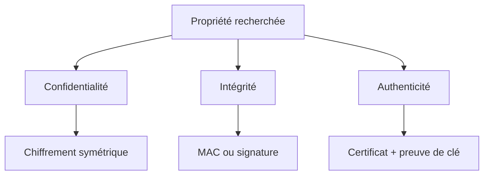
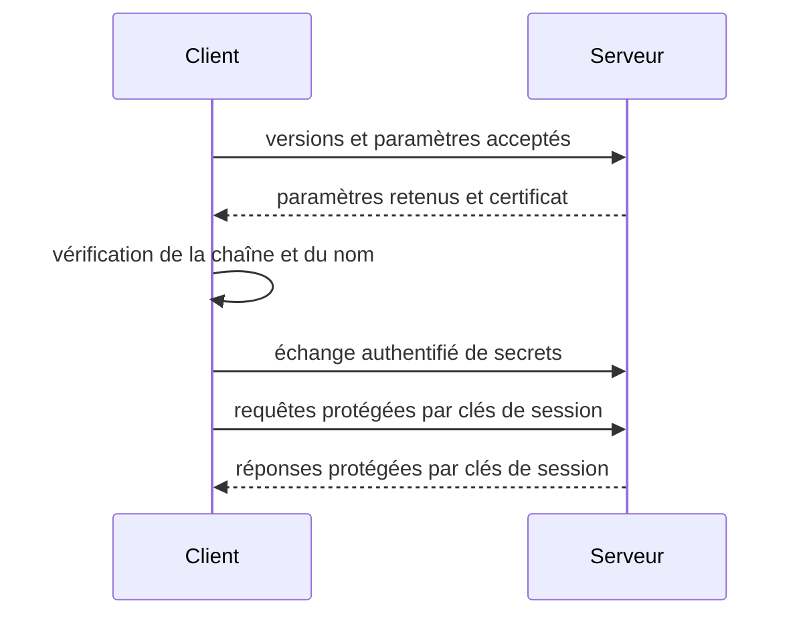

# Chapitre 7.1 — Comprendre la cryptographie appliquée

> **Campagne 7 — TLS et PKI**

> *« La cryptographie ne supprime pas le besoin de confiance : elle permet de dire précisément où cette confiance commence. »*

## Vous êtes ici

```text
PARTIE I — Construire un socle sécurisé

Campagne 7

► 7.1 Comprendre la cryptographie appliquée
  7.2 Lire et vérifier les certificats X.509
  7.3 Construire une autorité de certification
  7.4 Authentifier les deux extrémités avec mTLS
  7.5 Préparer l'intégration à FreeIPA
  7.6 Renouveler et révoquer les certificats
  7.7 Sécuriser Sentinel avec TLS
```

## Objectifs pédagogiques

À l'issue de ce chapitre, vous serez capable de :

- distinguer confidentialité, intégrité, authenticité et disponibilité ;
- différencier chiffrement symétrique, cryptographie asymétrique, hachage et signature ;
- expliquer pourquoi TLS combine plusieurs primitives au lieu d'en choisir une seule ;
- générer de l'aléa et calculer une empreinte avec OpenSSL ;
- identifier les limites que la cryptographie ne peut pas compenser.

## Pourquoi ce chapitre existe

Sentinel écoute désormais sur le réseau et fonctionne comme un service durable. Firewalld limite les machines capables de joindre le port et SELinux réduit les actions du processus, mais les octets qui circulent restent exposés à d'autres risques : observation, modification ou usurpation d'un correspondant autorisé sur le réseau.

Activer « HTTPS » sans modèle mental conduit facilement à des erreurs : certificat accepté sans vérifier son nom, clé privée copiée partout, algorithme ancien conservé par habitude ou option de vérification désactivée pour terminer un test. Ce chapitre présente les briques avant de les assembler dans TLS.

## Partir des propriétés de sécurité

La cryptographie fournit plusieurs propriétés distinctes.

| Propriété | Question | Exemple pour Sentinel |
| --- | --- | --- |
| confidentialité | un tiers peut-il lire le message ? | masquer le diagnostic transporté |
| intégrité | le message a-t-il été modifié ? | détecter une réponse altérée |
| authenticité | avec quel pair communiquons-nous ? | reconnaître le serveur Sentinel |
| preuve d'origine | qui a produit une signature vérifiable ? | signer un artefact distribué |
| disponibilité | le service répond-il à temps ? | **non fournie** par le chiffrement |

Un canal TLS peut être parfaitement chiffré et rester indisponible. Il peut aussi aboutir au mauvais serveur si le client chiffre sans vérifier l'identité du pair.



## Ne pas confondre les primitives

### Le chiffrement symétrique

Le même secret permet de chiffrer et de déchiffrer. Les algorithmes symétriques sont rapides et adaptés aux volumes de données importants. Leur difficulté principale est la distribution de la clé : si le client et le serveur doivent déjà partager un secret, comment le leur remettre sans l'exposer ?

Dans TLS, une clé de session symétrique protège les données applicatives. Elle est éphémère : elle n'est pas le certificat du serveur et ne devrait pas être réutilisée indéfiniment.

### La cryptographie asymétrique

Une paire est composée d'une clé privée et d'une clé publique.

- la clé privée reste sous le contrôle de son propriétaire ;
- la clé publique peut être distribuée ;
- une opération réalisée avec la clé privée peut être vérifiée avec la clé publique selon le mécanisme employé.

La clé publique ne porte pas seule une identité. Un attaquant peut publier sa propre clé et prétendre qu'elle appartient à Sentinel. Le certificat X.509 reliera cette clé à un nom dans le chapitre suivant.

### Le hachage

Une fonction de hachage transforme une donnée de taille quelconque en une empreinte de taille fixe. Elle ne chiffre pas : il n'existe pas de clé de déchiffrement permettant de retrouver le document initial.

```bash
printf '%s' 'sentinel-0.5.0' | openssl dgst -sha256
```

Modifiez un seul caractère et comparez l'empreinte :

```bash
printf '%s' 'sentinel-0.5.1' | openssl dgst -sha256
```

Une empreinte détecte une différence uniquement si la valeur de référence provient d'une source fiable. Si un attaquant remplace le fichier et l'empreinte publiée au même endroit, le contrôle ne prouve rien.

### Le MAC et la signature

Un code d'authentification de message, tel qu'un HMAC, combine une donnée et un secret partagé. Les deux parties capables de vérifier le HMAC possèdent le même secret : il ne permet donc pas d'attribuer publiquement l'action à une seule d'entre elles.

Une signature asymétrique est produite avec une clé privée et vérifiée avec la clé publique. Elle apporte une preuve technique d'origine et d'intégrité, mais son sens dépend encore de la confiance accordée à l'association entre la clé et son propriétaire.

| Mécanisme | Secret partagé | Vérification publique | Usage courant |
| --- | --- | --- | --- |
| empreinte | non | oui, si la référence est fiable | intégrité d'un artefact |
| HMAC | oui | non | intégrité entre pairs partageant un secret |
| signature | non | oui | artefact, certificat, protocole |

## Pourquoi TLS est un protocole hybride

TLS orchestre plusieurs opérations. Une description simplifiée suffit pour le moment :



La cryptographie asymétrique participe à l'authentification et à l'établissement du secret. Le chiffrement symétrique protège ensuite efficacement le flux. Les fonctions de hachage et de dérivation relient les étapes et protègent l'intégrité de la négociation.

TLS 1.3 simplifie et renforce cette négociation. TLS 1.2 reste nécessaire dans certains environnements AlmaLinux, mais les versions antérieures ne doivent pas être réactivées pour accommoder un client obsolète sans décision de risque explicite.

## L'aléa est une dépendance de sécurité

Une clé prévisible n'est pas une clé. Utilisez le générateur du système par l'intermédiaire d'une bibliothèque éprouvée :

```bash
openssl rand -hex 32
```

Cette commande affiche une valeur pédagogique. Ne l'insérez pas dans l'historique d'un shell si elle devient un vrai secret. Pour les clés privées TLS, laissez OpenSSL générer et écrire directement le fichier avec des permissions restrictives.

```bash
umask 077
openssl genpkey -algorithm RSA \
  -pkeyopt rsa_keygen_bits:3072 \
  -out sentinel-lab.key
stat -c '%a %n' sentinel-lab.key
```

Résultat attendu : le mode doit empêcher la lecture par les autres comptes, généralement `600`.

> **Regard sécurité — La taille ne corrige pas le cycle de vie**
>
> Une clé très longue, copiée sur cinq serveurs, sauvegardée sans protection et jamais renouvelée reste mal administrée. Le choix algorithmique et la gestion opérationnelle sont deux exigences complémentaires.

## Ce que la cryptographie ne résout pas

Elle ne corrige pas :

- une clé privée lisible par un attaquant ;
- une application compromise avant le chiffrement ou après le déchiffrement ;
- une autorité de certification indûment approuvée ;
- une horloge incorrecte qui fausse les périodes de validité ;
- un déni de service ;
- une autorisation métier absente après authentification.

Cette dernière distinction deviendra essentielle avec mTLS. Un certificat client valide prouve qu'une autorité a délivré ce certificat ; il ne dit pas automatiquement que son porteur peut consulter toutes les routes de Sentinel.

## Mise en pratique — Classer les contrôles

Associez chaque besoin au contrôle principal, puis identifiez le contrôle complémentaire nécessaire.

| Situation | Contrôle principal attendu | Contrôle complémentaire |
| --- | --- | --- |
| éviter la lecture sur le réseau | chiffrement TLS | protection des clés privées |
| détecter un binaire modifié | empreinte ou signature | source fiable de la référence |
| reconnaître le serveur | certificat vérifié | DNS et heure corrects |
| limiter les clients | certificat client | règle d'autorisation applicative |
| maintenir Sentinel disponible | supervision et reprise | capacité et protection réseau |

Vérifiez la présence d'OpenSSL et ses emplacements de configuration :

```bash
openssl version -a
openssl version -d
```

La version observée doit être celle fournie et maintenue par la distribution. Ne remplacez pas la bibliothèque système par une compilation locale uniquement pour suivre un exemple.

## Synthèse

- le besoin de sécurité précède le choix d'un algorithme ;
- chiffrement, hachage, HMAC et signature ne sont pas interchangeables ;
- TLS utilise une combinaison de primitives pour établir puis protéger un canal ;
- une clé privée est un actif à contrôler pendant tout son cycle de vie ;
- le chiffrement ne fournit ni disponibilité ni autorisation métier ;
- une implémentation et des paramètres maintenus valent mieux qu'une cryptographie artisanale.

## Pour aller plus loin

Le chapitre suivant associe une clé publique à une identité grâce au certificat X.509. Références normatives : [TLS 1.3 — RFC 8446](https://www.rfc-editor.org/rfc/rfc8446) et [recommandations d'usage de TLS — RFC 9325](https://www.rfc-editor.org/rfc/rfc9325).
