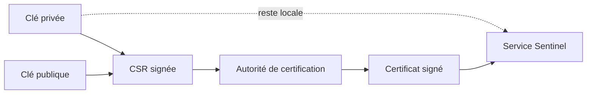
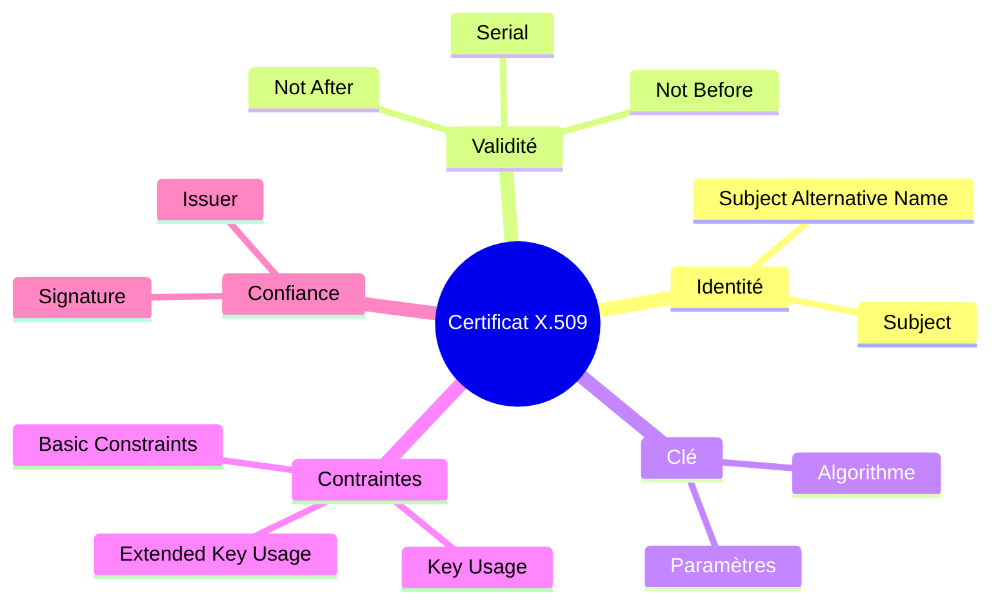
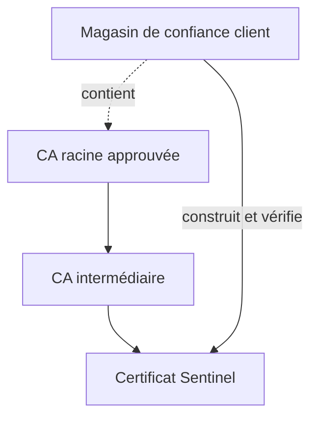

# Chapitre 7.2 — Lire et vérifier les certificats X.509

> **Campagne 7 — TLS et PKI**

> *« Un certificat n'est pas une preuve absolue : c'est une affirmation signée, valable pour un usage, un nom et une période donnés. »*

## Vous êtes ici

```text
PARTIE I — Construire un socle sécurisé

Campagne 7

  7.1 Comprendre la cryptographie appliquée ✔
► 7.2 Lire et vérifier les certificats X.509
  7.3 Construire une autorité de certification
  7.4 Authentifier les deux extrémités avec mTLS
  7.5 Préparer l'intégration à FreeIPA
  7.6 Renouveler et révoquer les certificats
  7.7 Sécuriser Sentinel avec TLS
```

## Objectifs pédagogiques

À l'issue de ce chapitre, vous serez capable de :

- distinguer clé privée, clé publique, CSR et certificat ;
- lire le sujet, l'émetteur, la période de validité et les extensions X.509 ;
- expliquer le rôle de SAN, Key Usage, Extended Key Usage et Basic Constraints ;
- vérifier une chaîne de certification et un nom DNS avec OpenSSL ;
- diagnostiquer les échecs les plus courants sans désactiver la vérification.

## Pourquoi ce chapitre existe

Lorsqu'un client se connecte à `sentinel.sentinel.lab`, il reçoit une clé publique. Il doit encore déterminer si cette clé appartient réellement au service attendu, si elle peut servir à un serveur TLS et si l'affirmation est toujours valable.

X.509 fournit un format signé pour transporter ces informations. Sa richesse explique aussi sa difficulté : une signature valide ne suffit pas si le nom ne correspond pas, si le certificat est expiré ou si son usage interdit l'authentification d'un serveur.

## Les quatre objets à ne pas confondre

| Objet | Contient | Peut être diffusé ? | Rôle |
| --- | --- | --- | --- |
| clé privée | secret cryptographique | non | prouver la possession de l'identité |
| clé publique | partie publique de la paire | oui | vérifier une opération |
| CSR | clé publique et identité demandée, signées par le demandeur | oui | demander un certificat |
| certificat | identité, clé publique, usages et signature d'une CA | oui | présenter une identité vérifiable |



Une CSR n'est pas un certificat. Elle n'est pas encore une affirmation approuvée par une autorité.

## Anatomie d'un certificat

Un certificat serveur contient notamment :

- un numéro de série unique chez l'émetteur ;
- un sujet ;
- un émetteur ;
- une date de début et une date de fin ;
- une clé publique ;
- un algorithme de signature ;
- des extensions X.509 v3 ;
- la signature de l'émetteur.



### Le nom utile se trouve dans SAN

Pour un serveur moderne, le nom DNS attendu doit apparaître dans l'extension **Subject Alternative Name** (SAN). Le champ Common Name du sujet ne doit pas être utilisé comme substitut à une extension SAN absente.

Pour Sentinel :

```text
DNS:sentinel.sentinel.lab
```

L'adresse d'écoute `0.0.0.0` ou `127.0.0.1` n'est pas l'identité du service. Le client peut joindre une adresse IP tout en vérifiant un nom DNS distinct.

### Key Usage et Extended Key Usage

`Key Usage` limite les opérations cryptographiques de la clé. `Extended Key Usage` (EKU) précise le contexte applicatif.

| Usage | EKU attendue |
| --- | --- |
| serveur HTTPS | `TLS Web Server Authentication` |
| client mTLS | `TLS Web Client Authentication` |
| certificat polyvalent de laboratoire | parfois les deux, mais moins précis |

Séparer les certificats serveur et client réduit les usages possibles d'une clé compromise et rend l'intention plus lisible.

### Basic Constraints

Un certificat d'autorité porte généralement `CA:TRUE`. Un certificat final de serveur ou client porte `CA:FALSE`. Sans cette contrainte, une identité applicative pourrait être confondue avec une autorité autorisée à signer d'autres certificats.

## PEM, DER et conteneurs

X.509 décrit le contenu, pas son encodage sur disque.

| Format | Aspect | Usage fréquent |
| --- | --- | --- |
| PEM | texte Base64 entre marqueurs `BEGIN`/`END` | services Linux et fichiers de laboratoire |
| DER | binaire ASN.1 | outils ou équipements particuliers |
| PKCS#12 | conteneur binaire, souvent protégé par mot de passe | transporter certificat et clé entre systèmes |

Convertir un certificat ne change pas son identité :

```bash
openssl x509 -in server.crt -outform DER -out server.der
openssl x509 -in server.der -inform DER -out server-roundtrip.crt
```

Un fichier `.crt` peut contenir du PEM ou du DER ; l'extension du nom ne constitue pas une preuve du format.

## TP 1 — Lire un certificat distant

Récupérez la chaîne présentée par un service de laboratoire :

```bash
openssl s_client \
  -connect sentinel.sentinel.lab:8443 \
  -servername sentinel.sentinel.lab \
  -showcerts </dev/null
```

`-servername` envoie le nom SNI. Cette option aide le serveur à choisir le bon certificat lorsqu'il héberge plusieurs identités.

Pour inspecter un certificat déjà enregistré :

```bash
openssl x509 -in server.crt -noout \
  -subject -issuer -serial -dates -fingerprint -sha256

openssl x509 -in server.crt -noout -text
```

Relevez au minimum :

1. le nom DNS dans SAN ;
2. la date d'expiration ;
3. l'EKU serveur ;
4. l'émetteur ;
5. l'algorithme et la taille de clé publique.

## TP 2 — Vérifier la clé associée

Le certificat et la clé privée doivent contenir la même clé publique. Comparez des empreintes calculées sur la représentation publique :

```bash
openssl x509 -in server.crt -pubkey -noout \
  | openssl pkey -pubin -outform DER \
  | openssl dgst -sha256

openssl pkey -in server.key -pubout -outform DER \
  | openssl dgst -sha256
```

Les deux résultats doivent être identiques. Cette vérification ne valide ni la chaîne ni le nom DNS ; elle répond uniquement à la question « cette clé correspond-elle à ce certificat ? ».

## TP 3 — Vérifier la chaîne et le nom

Avec une CA de laboratoire dans `ca.crt` :

```bash
openssl verify \
  -CAfile ca.crt \
  -purpose sslserver \
  -verify_hostname sentinel.sentinel.lab \
  server.crt
```

Résultat attendu :

```text
server.crt: OK
```

Provoquez ensuite trois échecs distincts :

```bash
openssl verify -CAfile autre-ca.crt server.crt
openssl verify -CAfile ca.crt -verify_hostname faux.sentinel.lab server.crt
openssl x509 -in server.crt -checkend 31536000 -noout
```

La dernière commande demande si le certificat restera valide pendant environ un an. Son échec ne signifie pas forcément qu'il est déjà expiré ; il indique qu'il expirera avant la fenêtre demandée.

## Construire la chaîne de confiance

Une chaîne classique comporte trois rôles.



La racine est une **ancre de confiance** configurée localement. Elle ne devient pas fiable parce qu'elle est autosignée ; elle est autosignée parce qu'aucune autorité supérieure n'existe dans cette PKI. La décision de l'installer dans le magasin de confiance est administrative.

Le serveur présente normalement son certificat final et les intermédiaires nécessaires. Il n'a pas besoin d'envoyer la racine déjà connue du client.

## Lire un échec avant d'agir

| Erreur observée | Cause probable | Correction saine |
| --- | --- | --- |
| unable to get local issuer certificate | intermédiaire absent ou CA inconnue | fournir la chaîne et l'ancre correctes |
| hostname mismatch | SAN différent du nom demandé | réémettre le certificat avec le bon SAN |
| certificate has expired | date de fin dépassée | renouveler et déployer |
| certificate is not yet valid | horloge fausse ou date de début future | corriger le temps ou l'émission |
| unsupported certificate purpose | EKU incompatible | utiliser un profil serveur/client adapté |
| key values mismatch | mauvaise clé privée | retrouver la paire correcte ou réémettre |

La mauvaise réponse commune est `-k`, `--insecure` ou la désactivation de la vérification. Ces options changent le problème en supprimant l'authentification, elles ne le corrigent pas.

## Synthèse

- un certificat relie une clé publique à une identité et à des usages ;
- SAN porte le nom DNS vérifié par les clients modernes ;
- la signature, la période, le nom et les extensions doivent tous être contrôlés ;
- la racine est fiable parce qu'elle a été distribuée comme ancre de confiance ;
- la clé privée n'appartient ni au certificat ni à la chaîne diffusée ;
- un diagnostic précis vaut mieux qu'un contournement de la vérification.

## Pour aller plus loin

Le chapitre suivant construit une autorité de laboratoire et sépare sa racine d'une autorité intermédiaire. Références : [commande `openssl x509`](https://docs.openssl.org/3.2/man1/openssl-x509/) et [options de vérification OpenSSL](https://docs.openssl.org/3.1/man1/openssl-verification-options/).
