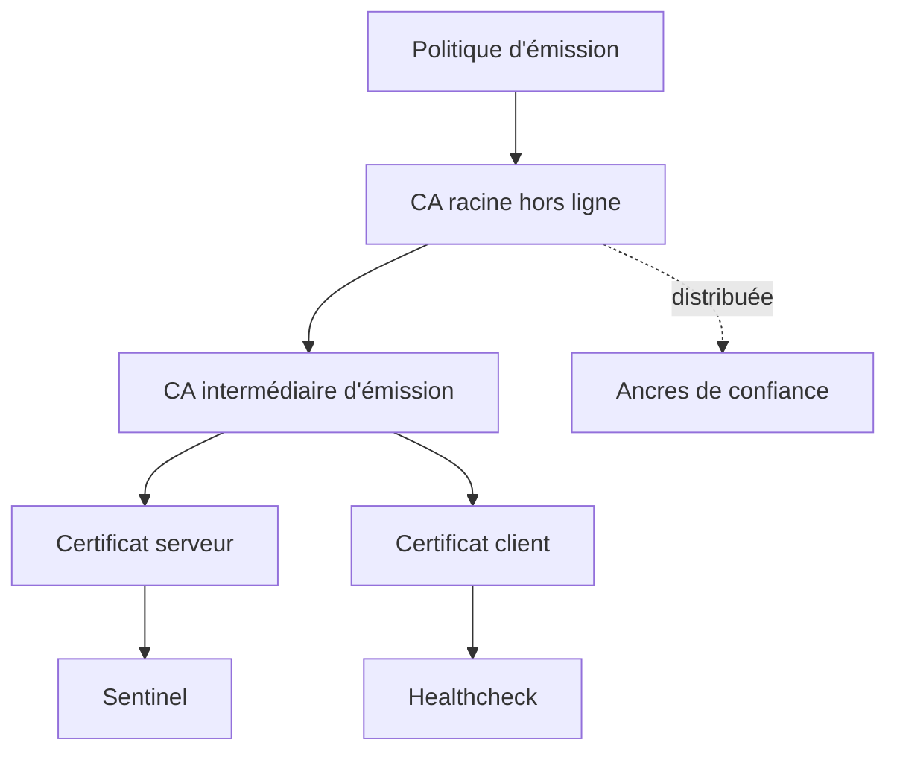

# Chapitre 7.3 — Construire une autorité de certification

> **Campagne 7 — TLS et PKI**

> *« Émettre un certificat est facile ; exploiter durablement la confiance qu'il représente est le vrai travail d'une PKI. »*

## Vous êtes ici

```text
PARTIE I — Construire un socle sécurisé

Campagne 7

  7.1 Comprendre la cryptographie appliquée ✔
  7.2 Lire et vérifier les certificats X.509 ✔
► 7.3 Construire une autorité de certification
  7.4 Authentifier les deux extrémités avec mTLS
  7.5 Préparer l'intégration à FreeIPA
  7.6 Renouveler et révoquer les certificats
  7.7 Sécuriser Sentinel avec TLS
```

## Objectifs pédagogiques

À l'issue de ce chapitre, vous serez capable de :

- expliquer les rôles d'une CA racine, d'une CA intermédiaire et d'un certificat final ;
- construire une petite chaîne de confiance réservée au laboratoire ;
- émettre des certificats serveur et client avec des usages distincts ;
- distribuer une ancre de confiance sans exposer de clé privée ;
- distinguer la démonstration OpenSSL d'une PKI d'entreprise exploitable.

## Pourquoi ce chapitre existe

Autosigner directement chaque certificat de service ne passe pas à l'échelle. Chaque client devrait approuver séparément chaque certificat, et le remplacement d'une clé obligerait à redistribuer une nouvelle confiance.

Une autorité de certification centralise la politique d'émission. Les clients approuvent une racine ; les services présentent ensuite des certificats reliés à cette racine. Cette simplification crée une responsabilité majeure : une CA compromise permettrait d'émettre de fausses identités acceptées par tous ses clients.

## Les rôles d'une PKI



| Rôle | Exposition souhaitée | Fonction |
| --- | --- | --- |
| CA racine | minimale, idéalement hors ligne | établir le sommet de la confiance |
| CA intermédiaire | contrôlée, disponible pour l'émission | signer les certificats finaux |
| autorité d'enregistrement | selon l'organisation | valider l'identité et la demande |
| dépôt de publication | disponible | distribuer CA, chaîne et informations de révocation |
| opérateur | authentifié et audité | approuver, renouveler ou révoquer |

La séparation racine/intermédiaire limite l'usage quotidien de la clé la plus sensible. Si l'intermédiaire est compromis, une nouvelle intermédiaire peut être émise sans remplacer immédiatement la racine sur tous les clients.

## Définir la politique avant les commandes

Pour le laboratoire :

| Élément | Décision |
| --- | --- |
| espace de noms | `sentinel.lab` |
| serveur | `sentinel.sentinel.lab` |
| client de santé | `healthcheck.sentinel.lab` |
| algorithme | RSA 3072 et SHA-256 pour la lisibilité du TP |
| durée racine | longue, uniquement pour le laboratoire |
| durée intermédiaire | inférieure à celle de la racine |
| durée des certificats finaux | courte par rapport aux CA |
| clé racine | retirée du poste après l'émission de l'intermédiaire |

Ces valeurs ne constituent pas une politique universelle. Une organisation choisit ses algorithmes et durées en fonction de ses exigences, de ses clients, de la réglementation et des recommandations maintenues.

## TP 1 — Créer la racine du laboratoire

Travaillez avec un compte ordinaire dans un répertoire neuf :

```bash
mkdir -p ~/sentinel-pki/{root,intermediate,issued,private,csr}
chmod 0700 ~/sentinel-pki/private
cd ~/sentinel-pki
umask 077
```

Générez la clé racine :

```bash
openssl genpkey -algorithm RSA \
  -pkeyopt rsa_keygen_bits:3072 \
  -out private/root-ca.key
```

Créez le certificat autosigné de la racine :

```bash
openssl req -x509 -new -sha256 -days 3650 \
  -key private/root-ca.key \
  -out root/root-ca.crt \
  -subj '/O=Sentinel Training/CN=Sentinel Lab Root CA' \
  -addext 'basicConstraints=critical,CA:TRUE,pathlen:1' \
  -addext 'keyUsage=critical,keyCertSign,cRLSign' \
  -addext 'subjectKeyIdentifier=hash'
```

Inspectez les contraintes :

```bash
openssl x509 -in root/root-ca.crt -noout \
  -subject -issuer -dates -text
```

Le sujet et l'émetteur sont identiques. Cela signifie « autosigné », pas « automatiquement fiable ».

## TP 2 — Créer l'intermédiaire

```bash
openssl genpkey -algorithm RSA \
  -pkeyopt rsa_keygen_bits:3072 \
  -out private/intermediate-ca.key

openssl req -new -sha256 \
  -key private/intermediate-ca.key \
  -out csr/intermediate-ca.csr \
  -subj '/O=Sentinel Training/CN=Sentinel Lab Issuing CA'
```

Créez `intermediate/intermediate.ext` :

```ini
basicConstraints = critical, CA:TRUE, pathlen:0
keyUsage = critical, keyCertSign, cRLSign
subjectKeyIdentifier = hash
authorityKeyIdentifier = keyid,issuer
```

Signez la demande :

```bash
openssl x509 -req -sha256 -days 1825 \
  -in csr/intermediate-ca.csr \
  -CA root/root-ca.crt \
  -CAkey private/root-ca.key \
  -CAcreateserial \
  -extfile intermediate/intermediate.ext \
  -out intermediate/intermediate-ca.crt
```

Vérifiez la chaîne :

```bash
openssl verify \
  -CAfile root/root-ca.crt \
  intermediate/intermediate-ca.crt
```

Après cette étape, la clé racine n'est plus nécessaire pour les émissions courantes. Dans une véritable PKI, elle serait conservée hors ligne, protégée et utilisée selon une procédure à plusieurs personnes.

## TP 3 — Émettre le certificat serveur

```bash
openssl genpkey -algorithm RSA \
  -pkeyopt rsa_keygen_bits:3072 \
  -out private/sentinel-server.key

openssl req -new -sha256 \
  -key private/sentinel-server.key \
  -out csr/sentinel-server.csr \
  -subj '/O=Sentinel Training/CN=sentinel.sentinel.lab'
```

Créez `issued/server.ext` :

```ini
basicConstraints = critical, CA:FALSE
keyUsage = critical, digitalSignature, keyEncipherment
extendedKeyUsage = serverAuth
subjectAltName = DNS:sentinel.sentinel.lab
subjectKeyIdentifier = hash
authorityKeyIdentifier = keyid,issuer
```

Puis signez :

```bash
openssl x509 -req -sha256 -days 90 \
  -in csr/sentinel-server.csr \
  -CA intermediate/intermediate-ca.crt \
  -CAkey private/intermediate-ca.key \
  -CAcreateserial \
  -extfile issued/server.ext \
  -out issued/sentinel-server.crt
```

## TP 4 — Émettre le certificat client

```bash
openssl genpkey -algorithm RSA \
  -pkeyopt rsa_keygen_bits:3072 \
  -out private/healthcheck-client.key

openssl req -new -sha256 \
  -key private/healthcheck-client.key \
  -out csr/healthcheck-client.csr \
  -subj '/O=Sentinel Training/CN=healthcheck.sentinel.lab'
```

Créez `issued/client.ext` :

```ini
basicConstraints = critical, CA:FALSE
keyUsage = critical, digitalSignature
extendedKeyUsage = clientAuth
subjectAltName = DNS:healthcheck.sentinel.lab
subjectKeyIdentifier = hash
authorityKeyIdentifier = keyid,issuer
```

Signez avec l'intermédiaire :

```bash
openssl x509 -req -sha256 -days 30 \
  -in csr/healthcheck-client.csr \
  -CA intermediate/intermediate-ca.crt \
  -CAkey private/intermediate-ca.key \
  -CAcreateserial \
  -extfile issued/client.ext \
  -out issued/healthcheck-client.crt
```

## Vérifier avant de déployer

```bash
openssl verify \
  -CAfile root/root-ca.crt \
  -untrusted intermediate/intermediate-ca.crt \
  -purpose sslserver \
  -verify_hostname sentinel.sentinel.lab \
  issued/sentinel-server.crt

openssl verify \
  -CAfile root/root-ca.crt \
  -untrusted intermediate/intermediate-ca.crt \
  -purpose sslclient \
  issued/healthcheck-client.crt
```

Construisez deux fichiers de chaîne sans y ajouter de clé privée :

```bash
cat issued/sentinel-server.crt \
    intermediate/intermediate-ca.crt \
  > issued/sentinel-server-chain.crt

cat issued/healthcheck-client.crt \
    intermediate/intermediate-ca.crt \
  > issued/healthcheck-client-chain.crt

cat intermediate/intermediate-ca.crt \
    root/root-ca.crt \
  > issued/clients-ca-chain.crt
```

Le premier fichier est présenté par le serveur. Le second sert de chaîne de confiance dans ce laboratoire. Selon le logiciel, l'ancre racine et les intermédiaires peuvent être configurés séparément.

## Ce laboratoire n'est pas une CA de production

Les commandes `openssl x509 -req` rendent la chaîne visible avec peu de fichiers, mais elles ne fournissent pas seules :

- un inventaire durable des certificats émis ;
- une validation organisationnelle des demandes ;
- une séparation de rôles ;
- un HSM ou une protection matérielle ;
- un service de révocation publié ;
- un renouvellement automatisé ;
- un journal d'audit et des sauvegardes qualifiées.

OpenSSL fournit aussi une commande `ca` avec une base d'émission et la génération de CRL, mais sa propre documentation avertit qu'il s'agit d'une application de CA minimale. La campagne suivante industrialisera ce besoin avec FreeIPA et Dogtag.

> **Piège classique — diffuser une archive complète**
>
> N'envoyez jamais `~/sentinel-pki` vers le serveur. Copiez seulement le certificat et la chaîne nécessaires à chaque rôle. La clé racine et la clé intermédiaire ne doivent jamais atteindre Sentinel.

## Synthèse

- la racine est l'ancre distribuée, pas l'autorité utilisée à chaque émission ;
- l'intermédiaire signe les certificats finaux et limite l'exposition de la racine ;
- un profil serveur et un profil client portent des EKU différents ;
- chaque clé privée reste sur le système qui en a besoin ;
- chaque certificat est vérifié avant son déploiement ;
- une PKI durable exige gouvernance, inventaire, révocation, audit et renouvellement.

## Pour aller plus loin

Le chapitre suivant utilise les certificats serveur et client pour rendre l'authentification TLS mutuelle. Pour comprendre les limites de l'outil de laboratoire, consultez la [documentation officielle de `openssl ca`](https://docs.openssl.org/3.0/man1/openssl-ca/).
