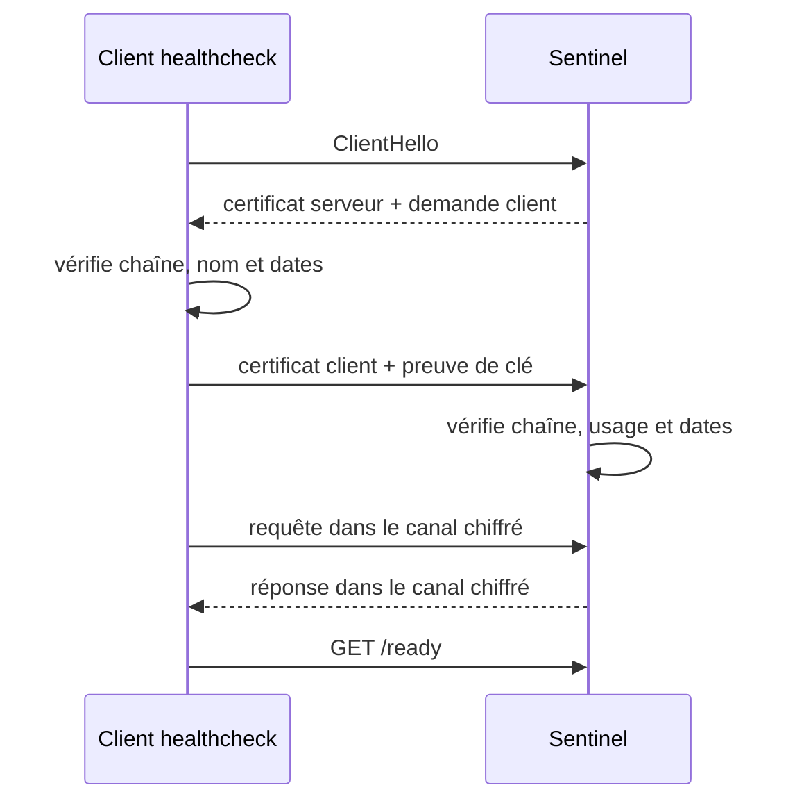
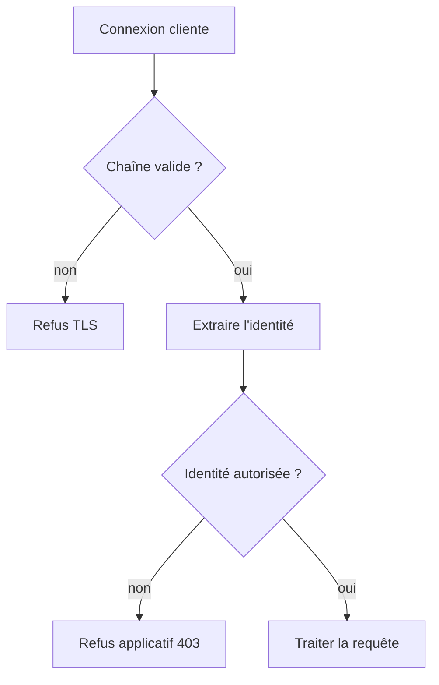

# Chapitre 7.4 — Authentifier les deux extrémités avec mTLS

> **Campagne 7 — TLS et PKI**

> *« Chiffrer vers un serveur connu protège le client ; exiger une identité cliente vérifiée protège aussi l'entrée du service. »*

## Vous êtes ici

```text
PARTIE I — Construire un socle sécurisé

Campagne 7

  7.1 Comprendre la cryptographie appliquée ✔
  7.2 Lire et vérifier les certificats X.509 ✔
  7.3 Construire une autorité de certification ✔
► 7.4 Authentifier les deux extrémités avec mTLS
  7.5 Préparer l'intégration à FreeIPA
  7.6 Renouveler et révoquer les certificats
  7.7 Sécuriser Sentinel avec TLS
```

## Objectifs pédagogiques

À l'issue de ce chapitre, vous serez capable de :

- distinguer TLS serveur et authentification mutuelle ;
- décrire les contrôles réalisés par chaque extrémité ;
- tester une connexion mTLS avec OpenSSL et `curl` ;
- interpréter le refus d'un client sans certificat ou signé par une autre CA ;
- séparer authentification cryptographique et autorisation applicative.

## Pourquoi ce chapitre existe

Avec HTTPS classique, le client authentifie le serveur. Le serveur, lui, reçoit une connexion chiffrée mais ne connaît pas nécessairement l'identité cryptographique du client. Une application publique peut ensuite demander un mot de passe ou un jeton.

Sentinel possède aussi des échanges de machine à machine : healthcheck, agent, collecteur ou outil d'administration. Dans ce contexte, un certificat client permet d'établir une identité avant même que la requête HTTP soit traitée.

## Du TLS serveur au mTLS

| Contrôle | TLS serveur | mTLS |
| --- | --- | --- |
| le client vérifie la CA du serveur | oui | oui |
| le client vérifie le nom DNS du serveur | oui | oui |
| le serveur demande un certificat client | non | oui |
| le serveur vérifie la CA du client | non | oui |
| le serveur autorise une action métier | à définir | toujours à définir |



Chaque partie doit posséder sa clé privée et la chaîne utile. Aucun secret symétrique permanent n'est partagé entre elles.

## Ce que vérifie le serveur

Lorsqu'il exige un certificat client, le serveur vérifie au minimum :

- que le client possède la clé privée associée ;
- que le certificat forme une chaîne vers une CA cliente approuvée ;
- que les signatures et dates sont valides ;
- que l'usage du certificat autorise l'authentification cliente.

Selon l'application, il doit ensuite lire une identité stable — SAN DNS, URI, principal ou autre attribut défini par la politique — puis appliquer une autorisation.



Le checkpoint `0.5.0` de Sentinel réalise le premier contrôle : il approuve les clients signés par la CA configurée. Le checkpoint `0.6.0`, introduit avec FreeIPA, ajoutera une liste d'identités DNS autorisées. Cette progression rend visible la différence entre **authentification** et **autorisation**.

## TP 1 — Lancer un serveur mTLS de diagnostic

Réutilisez la PKI construite au chapitre 7.3. Dans un premier terminal :

```bash
cd ~/sentinel-pki

openssl s_server \
  -accept 9443 \
  -cert issued/sentinel-server.crt \
  -key private/sentinel-server.key \
  -cert_chain intermediate/intermediate-ca.crt \
  -CAfile root/root-ca.crt \
  -Verify 1 \
  -verify_return_error \
  -www
```

`-Verify 1` rend le certificat client obligatoire. Le serveur de test OpenSSL aide au diagnostic ; ce n'est pas le serveur applicatif final.

Dans un second terminal, connectez un client autorisé :

```bash
cd ~/sentinel-pki

openssl s_client \
  -connect 127.0.0.1:9443 \
  -servername sentinel.sentinel.lab \
  -verify_hostname sentinel.sentinel.lab \
  -verify_return_error \
  -CAfile root/root-ca.crt \
  -cert issued/healthcheck-client.crt \
  -key private/healthcheck-client.key \
  -cert_chain intermediate/intermediate-ca.crt </dev/null
```

Cherchez :

```text
Verification: OK
Verify return code: 0 (ok)
```

## TP 2 — Prouver les refus

### Client sans certificat

```bash
openssl s_client \
  -connect 127.0.0.1:9443 \
  -servername sentinel.sentinel.lab \
  -CAfile root/root-ca.crt </dev/null
```

La négociation doit échouer car le serveur exige une identité cliente.

### Mauvais nom de serveur

```bash
openssl s_client \
  -connect 127.0.0.1:9443 \
  -servername imposteur.sentinel.lab \
  -verify_hostname imposteur.sentinel.lab \
  -verify_return_error \
  -CAfile root/root-ca.crt \
  -cert issued/healthcheck-client.crt \
  -key private/healthcheck-client.key </dev/null
```

Le client doit refuser le serveur même si la CA est connue.

### Client signé par une autre CA

Émettez un certificat avec une seconde CA de test ou utilisez un certificat d'un autre laboratoire. Le serveur doit rejeter la chaîne. Ne copiez pas cette nouvelle racine dans `-CAfile` uniquement pour faire disparaître l'erreur : cela étendrait réellement la population approuvée.

## TP 3 — Tester avec `curl`

Lorsque le serveur Sentinel sera lancé :

```bash
curl --fail-with-body \
  --cacert ~/sentinel-pki/root/root-ca.crt \
  --cert ~/sentinel-pki/issued/healthcheck-client.crt \
  --key ~/sentinel-pki/private/healthcheck-client.key \
  --resolve sentinel.sentinel.lab:8443:127.0.0.1 \
  https://sentinel.sentinel.lab:8443/ready
```

`--resolve` associe le nom à l'adresse pour ce test tout en conservant le nom DNS dans l'URL et donc dans la vérification. Utiliser directement `https://127.0.0.1` demanderait un SAN IP correspondant ou provoquerait un échec sain.

Testez ensuite sans `--cert` ni `--key`. Le refus doit se produire pendant la négociation, avant toute réponse HTTP utile.

## Concevoir les populations de confiance

Utiliser la même CA pour tous les serveurs et clients est simple mais large. Une PKI d'entreprise peut séparer :

- une hiérarchie ou un profil pour les serveurs ;
- une hiérarchie ou un profil pour les agents ;
- des durées plus courtes pour les identités automatisées ;
- des règles d'émission selon l'environnement ;
- des SAN ou URI stables destinés à l'autorisation.

Le serveur Sentinel devrait approuver uniquement les CA capables d'émettre des clients Sentinel, pas toutes les racines installées globalement sur l'hôte.

> **Regard sécurité — Une CA valide n'est pas une ACL**
>
> Si mille machines reçoivent un certificat de la même CA, elles sont cryptographiquement authentifiées. Elles ne doivent pas pour autant obtenir toutes les mêmes permissions. L'application ou un frontal doit appliquer la politique d'autorisation après la validation TLS.

## Diagnostiquer par couche

| Couche | Outil | Preuve recherchée |
| --- | --- | --- |
| DNS et routage | `getent hosts`, `ip route` | le pair visé est joignable |
| TCP | `ss`, `nc` | un service écoute et le pare-feu laisse passer |
| TLS | `openssl s_client` | versions, chaîne, nom et certificat client |
| HTTP | `curl -v` | route, statut et contenu |
| application | `journalctl -u sentinel` | décision et erreur métier |

Commencez par la couche la plus basse qui échoue. Une erreur `403` prouve que TLS et HTTP ont suffisamment fonctionné pour atteindre l'autorisation ; une alerte `unknown ca` se produit plus tôt.

## Synthèse

- TLS serveur authentifie le serveur auprès du client ;
- mTLS ajoute une identité cryptographique cliente ;
- les deux pairs doivent vérifier chaîne, usage, dates et identité attendue ;
- l'absence ou la mauvaise origine du certificat doit produire un refus ;
- authentification TLS et autorisation applicative restent deux décisions ;
- OpenSSL et `curl` permettent de localiser précisément la couche en échec.

## Pour aller plus loin

Le chapitre suivant prépare le remplacement de la CA manuelle par la PKI intégrée à FreeIPA et le suivi des certificats par `certmonger`. La description normative du protocole se trouve dans [TLS 1.3 — RFC 8446](https://www.rfc-editor.org/rfc/rfc8446).
