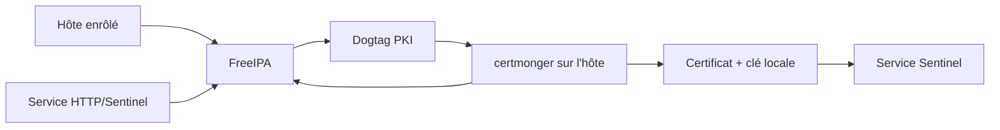
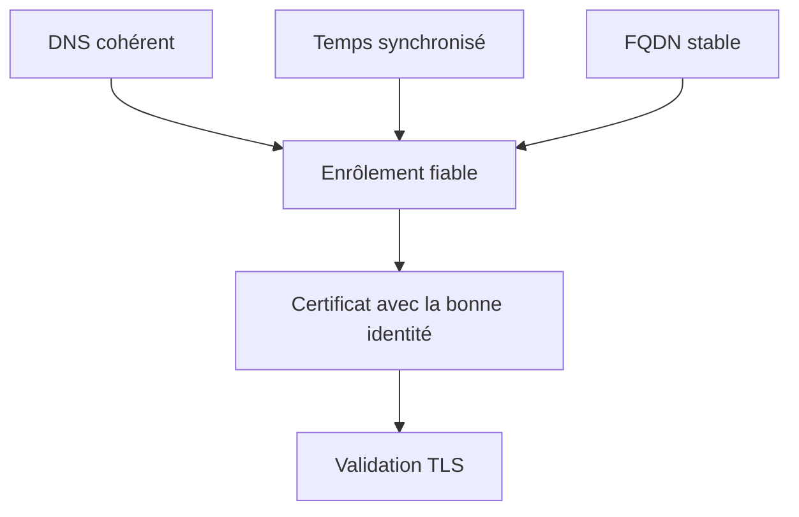

# Chapitre 7.5 — Préparer l'intégration à FreeIPA

> **Campagne 7 — TLS et PKI**

> *« Une application bien préparée ne connaît pas les détails de la CA : elle connaît le contrat de ses certificats et laisse l'infrastructure gérer leur cycle de vie. »*

## Vous êtes ici

```text
PARTIE I — Construire un socle sécurisé

Campagne 7

  7.1 Comprendre la cryptographie appliquée ✔
  7.2 Lire et vérifier les certificats X.509 ✔
  7.3 Construire une autorité de certification ✔
  7.4 Authentifier les deux extrémités avec mTLS ✔
► 7.5 Préparer l'intégration à FreeIPA
  7.6 Renouveler et révoquer les certificats
  7.7 Sécuriser Sentinel avec TLS
```

## Objectifs pédagogiques

À l'issue de ce chapitre, vous serez capable de :

- identifier ce qu'une PKI d'entreprise apporte par rapport à la CA de laboratoire ;
- définir le contrat de certificat nécessaire à Sentinel avant son enrôlement ;
- expliquer les rôles respectifs de FreeIPA, Dogtag et `certmonger` ;
- préparer DNS, temps, chemins, permissions et identités de service ;
- distinguer les actions préparatoires de cette campagne et le déploiement réalisé en campagne 8.

## Pourquoi ce chapitre existe

La CA OpenSSL a rendu visibles la racine, l'intermédiaire, la CSR et les extensions. Elle dépend toutefois d'actions manuelles et ne connaît ni l'inventaire des hôtes, ni les services autorisés à demander un certificat.

FreeIPA réunit identité, DNS, Kerberos et PKI. Sa CA Dogtag peut délivrer les certificats, tandis que `certmonger` suit leur expiration et demande leur renouvellement. Avant d'installer cette infrastructure dans la campagne 8, Sentinel doit exprimer un contrat clair et ne pas dépendre des noms de fichiers improvisés pendant le TP.

## De la CA manuelle au service d'identité



| Composant | Responsabilité principale |
| --- | --- |
| FreeIPA | connaître les hôtes, services, droits et demandes |
| Dogtag | agir comme autorité de certification intégrée |
| `certmonger` | surveiller, demander et renouveler les certificats locaux |
| Sentinel | charger les fichiers et vérifier ses pairs |
| systemd | démarrer ou redémarrer proprement l'application après changement |

Sentinel ne doit pas embarquer de mot de passe FreeIPA ni appeler périodiquement une API de CA. Le système d'exploitation gère les matériaux ; l'application consomme les chemins prévus.

## Définir le contrat de certificat

Avant toute commande d'enrôlement, documentez les exigences.

### Identité serveur

| Champ | Valeur du laboratoire |
| --- | --- |
| service | `HTTP/sentinel.sentinel.lab` |
| SAN DNS | `sentinel.sentinel.lab` |
| EKU | authentification serveur |
| propriétaire de la clé | compte du service ou groupe strictement nécessaire |
| chemin certificat | `/etc/sentinel/tls/server.crt` |
| chemin clé | `/etc/sentinel/tls/server.key` |

Le principal de service Kerberos et le certificat X.509 sont deux expressions complémentaires de l'identité. Posséder l'un ne crée pas automatiquement l'autre.

### Identité du healthcheck

Le healthcheck intégré est un client mTLS. Il lui faut donc :

- un certificat autorisé pour l'authentification cliente ;
- la clé privée correspondante ;
- la chaîne de CA permettant de vérifier le serveur ;
- le nom DNS attendu du serveur.

Dans un environnement réel, il faut décider si la sonde locale possède sa propre identité ou si un agent externe réalise le contrôle. Copier le certificat serveur comme certificat client serait une mauvaise séparation des usages.

## Préparer les prérequis système

Une PKI dépend fortement de trois services de base.



Vérifiez le futur hôte Sentinel :

```bash
hostname --fqdn
getent hosts sentinel.sentinel.lab
timedatectl status
chronyc tracking
```

Résultats attendus :

- le FQDN est stable et entièrement qualifié ;
- la résolution directe aboutit à l'adresse prévue ;
- l'horloge est synchronisée ;
- aucune entrée temporaire dans `/etc/hosts` ne masque une erreur DNS durable.

## Préparer les chemins et les droits

```bash
sudo install -d -o root -g sentinel -m 0750 /etc/sentinel/tls
sudo install -d -o sentinel -g sentinel -m 0750 /var/lib/sentinel
```

Le contrat recommandé est :

```text
/etc/sentinel/tls/
├── server.crt
├── server.key
├── clients-ca.crt
├── healthcheck.crt
└── healthcheck.key
```

Les certificats et les CA sont publics au sens cryptographique, mais leurs permissions doivent rester cohérentes avec l'administration du service. Les clés privées sont lisibles uniquement par le compte ou le groupe strictement requis.

```bash
sudo stat -c '%U %G %a %n' /etc/sentinel/tls
sudo restorecon -RFv /etc/sentinel/tls
```

La campagne SELinux a déjà défini le type nécessaire à Sentinel. Toute création ou rotation doit conserver ce contexte.

## Anticiper les commandes de la campagne 8

Une fois l'hôte enrôlé dans FreeIPA, le flux ressemblera à ceci :

```bash
ipa service-add HTTP/sentinel.sentinel.lab

sudo ipa-getcert request \
  -K HTTP/sentinel.sentinel.lab \
  -D sentinel.sentinel.lab \
  -f /etc/sentinel/tls/server.crt \
  -k /etc/sentinel/tls/server.key
```

Ces commandes sont présentées pour rendre le contrat concret. Ne les exécutez pas encore si le domaine FreeIPA n'est pas installé et si l'hôte n'y est pas enrôlé. La campagne 8 ajoutera les contrôles d'identité, de droits et de renouvellement nécessaires.

Consultez ensuite l'état d'une demande suivie :

```bash
sudo getcert list
```

`MONITORING` indique que `certmonger` suit le certificat ; cela ne prouve pas que Sentinel a rechargé le nouveau fichier ni que les clients approuvent sa chaîne.

## Concevoir une frontière stable pour Sentinel

L'application attend des fichiers, pas un fournisseur particulier.

| Environnement | Producteur des fichiers | Contrat Sentinel identique |
| --- | --- | --- |
| laboratoire | commandes OpenSSL | chemins, usages, nom DNS |
| entreprise FreeIPA | Dogtag + `certmonger` | chemins, usages, nom DNS |
| autre PKI | agent ou pipeline interne | chemins, usages, nom DNS |

Cette indépendance permet de tester localement et d'industrialiser ensuite sans réécrire le protocole applicatif.

> **Regard sécurité — Ne pas déléguer la politique au fournisseur**
>
> FreeIPA automatise l'émission ; il ne décide pas à votre place quel service peut demander quel profil, quelle population cliente Sentinel doit approuver ou quelle action déclencher après renouvellement. Ces décisions restent dans l'architecture et la politique d'exploitation.

## Préparer la migration

Avant de remplacer la CA de laboratoire :

1. installez la nouvelle ancre chez les clients ;
2. conservez temporairement l'ancienne si une période de chevauchement est nécessaire ;
3. émettez les nouvelles identités avec les mêmes noms DNS ;
4. vérifiez les fichiers et la chaîne hors ligne ;
5. redémarrez Sentinel de façon contrôlée ;
6. prouvez les connexions acceptées et refusées ;
7. retirez l'ancienne ancre après la période prévue.

Changer simultanément serveur, clients et racine sans chevauchement rend le diagnostic et le retour arrière difficiles.

## Synthèse

- FreeIPA apporte l'identité et les règles d'enrôlement ; Dogtag émet les certificats ;
- `certmonger` suit les fichiers et peut automatiser leur renouvellement ;
- Sentinel consomme un contrat de chemins, de noms et d'usages stable ;
- DNS, temps et FQDN font partie de la sécurité TLS ;
- les clés privées restent locales et soumises aux permissions et à SELinux ;
- la campagne 8 exécutera l'enrôlement et l'autorisation après cette préparation.

## Pour aller plus loin

Le chapitre suivant traite l'expiration, le renouvellement et la révocation. Pour le rôle de l'agent de suivi, consultez la [documentation FreeIPA de `certmonger`](https://www.freeipa.org/page/Certmonger).
